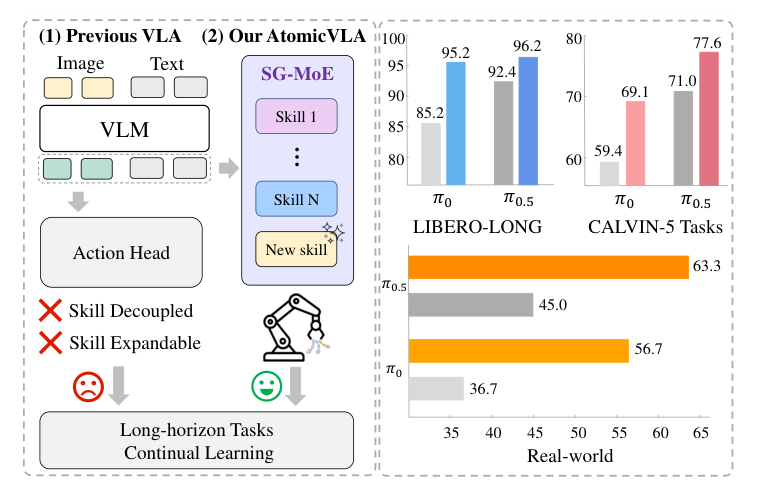
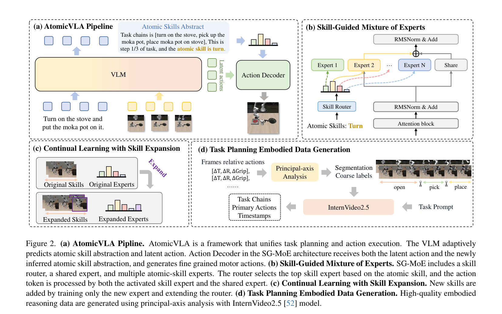

## 论文信息

- **标题**：[AtomicVLA: Unlocking the Potential of Atomic Skill Learning in Robots](https://arxiv.org/abs/2603.07648)
- **作者**：Likui Zhang, Tao Tang, Zhihao Zhan, Xiuwei Chen, Zisheng Chen, Jianhua Han, Jiangtong Zhu, Pei Xu, Hang Xu, Hefeng Wu, Liang Lin, Xiaodan Liang
- **机构**：中山大学、鹏城实验室、银旺智能科技
- **发表**：arXiv:2603.07648，2026 年 3 月

---

# 一、论文卡片

* **论文标题：**  
  [AtomicVLA: Unlocking the Potential of Atomic Skill Learning in Robots](https://arxiv.org/abs/2603.07648)
* **核心关键词：**  
  VLA、Mixture-of-Experts、原子技能、长时域任务、持续学习、任务规划、Think-Act、SG-MoE、LIBERO、CALVIN

* **一句话总结：**  
  AtomicVLA 的核心思想是：**把一个复杂任务拆解成有语义含义的原子技能序列，让每个原子技能激活专属的动作专家，从而同时解决长时域任务执行和持续学习两大难题。** 它不依赖单一的"大锅炖"动作解码器，而是用一个可扩展的技能专家库，让规划和执行在统一框架中互相配合。



* **我的观点：**  
  * 这篇论文最打动我的地方，是它对"技能干扰"问题的直白承认与解法。传统 VLA 把所有技能都压进同一个动作解码器，就像让一个工人同时熟练掌握焊接、精密装配和搬运——混在一起训练，每件事都做得不够精。AtomicVLA 的思路更像工厂分工：让"抓取专家"只学抓取，让"转动专家"只学转动，上层规划模块决定什么时候叫哪位专家出场。这个思路简单却有力。

  * SG-MoE 里用**噪声调度灵感**来编码原子技能是一个有趣的设计选择——把每种原子技能映射到 [0, 100] 范围内的一个噪声标量，再嵌入成高维向量，相当于给每种技能赋予一个连续且结构化的"身份"。这比直接用 one-hot 或者任意 ID 更有利于路由模块的泛化。

  * 持续学习部分的设计也很克制：新技能来了，只新增一个专家模块和路由分支，其他专家权重完全冻结。实验中 π0.5 在学了新技能后旧技能平均下降 15%，而 AtomicVLA* 只下降 1.3%——这个对比数字说服力很强。

---

# 二、问题背景：现有 VLA 为什么在长时域任务上表现不足

现有 VLA 模型面临两个主要挑战：

**挑战一：长时域、多步骤任务**

真实场景的机器人任务往往不是"拿起杯子"这种单步动作，而是"打开抽屉 → 把物体放进去 → 关上抽屉"这样的多步序列。当前 VLA 模型的动作解码器是整体式的（monolithic），它被训练在混合任务数据上，无法对不同阶段的子技能做专门化建模，导致在 LIBERO-LONG 这类长时域基准上性能明显偏低。

**挑战二：持续学习新技能**

机器人在实际部署中会不断遇到新任务。如果要让现有 VLA 学会新技能，通常需要在整个模型上做微调，代价高昂，而且极易引发"灾难性遗忘"——新技能学会了，旧技能反而退化。

两种常见的解决路线各有缺陷：
- **两阶段架构**（高层规划器 + 低层控制器分离）：规划器和控制器没有共享的潜在空间，决策不一致，系统延迟也会带来过时指令问题；
- **单一端到端 VLA**：表达能力强，但所有技能混在一起，缺乏可扩展性。

AtomicVLA 的目标是在统一的端到端框架内，同时具备高层推理、精细动作生成和可扩展的持续学习能力。

---

# 三、整体架构：Think-Act 统一框架

AtomicVLA 的整体流程可以用一句话描述：

**给定当前视觉观测和任务指令，模型自主判断当前应该"思考"还是"行动"，并根据最新的原子技能抽象动态激活对应的专家来生成动作。**

整个架构围绕三个模块展开：

```
VLM（视觉语言模型）
  ├── 思考模式（Thinking）：输出任务链 + 当前进度 + 原子技能抽象 σ
  └── 行动模式（Acting）：基于 σ 激活 SG-MoE 中对应的技能专家，输出动作 chunk
```



---

## 3.1 自适应 Think-Act 切换

AtomicVLA 引入了两个特殊输出 token：`[think]` 和 `[act]`。

每一步推理时，模型先预测应该输出哪个 token：

- 输出 `[think]`：进入**思考模式**。模型生成三样东西：
  - 任务链 $C_{0-k}$：全局高层计划（例如"打开炉灶, 抓取摩卡壶, 将摩卡壶放到炉灶上"）
  - 当前进度 $C_t$：当前是第几步（例如"step 1/3"）
  - 原子技能抽象 $\sigma$：当前应执行的原子技能（例如"turn"）

- 输出 `[act]`：进入**行动模式**。模型利用最近一次思考得到的 $\sigma$，通过 SG-MoE 激活对应的技能专家，生成低层动作序列 $A_t$。

思考模式通常只在任务启动或子技能切换时触发，其余大多数步骤都在执行行动模式。这样设计的好处是：高层规划的语言输出和低层动作执行共享同一个 VLM 骨干，避免了两阶段架构的信息割裂问题。

---

## 3.2 SG-MoE：技能引导的混合专家架构

SG-MoE 是 AtomicVLA 的核心组件，由三部分构成：

| 组件 | 功能 |
|------|------|
| 技能路由器（Skill Router） | 根据原子技能嵌入 $Z_\sigma$ 选择激活哪个专家 |
| 共享专家（Shared Expert） | 保留 π0 预训练的通用动作生成能力 |
| 原子技能专家（Atomic Skill Experts） | 每个专家专注于一种原子技能的精细执行 |

**原子技能嵌入的设计**

每种原子技能被映射到一个标量噪声水平 $\sigma \in [0, 100]$，再通过嵌入函数转换为高维向量：

$$Z_\sigma = E(\text{norm}(\log(\sigma)))$$

这种设计来自扩散模型中噪声调度的思路，使得不同原子技能在嵌入空间中具有良好的语义区分度，有利于路由模块的稳定学习。

**稀疏激活与动作生成**

路由器根据 $Z_\sigma$ 为每个技能专家计算分数，采用稀疏激活策略：只选择得分最高的一个专家参与计算。最终动作是共享专家和被激活专家的加权组合：

$$F_\text{out} = (1 - w_k) \cdot F_\text{share}(x_t) + w_k \cdot F_k(x_t)$$

这个设计同时保留了 π0 的通用泛化能力（通过共享专家），又保证了针对特定技能的高精度执行（通过对应的技能专家）。

---

## 3.3 持续学习：扩展技能库而不遗忘旧技能

当机器人需要学习一种新原子技能时，AtomicVLA 的做法如下：

1. 为新技能**新增一个专家模块**，添加到现有技能库中；
2. **扩展路由网络**：复制原有路由器权重作为初始化，新分支用小随机值初始化；
3. **只训练新专家和新路由分支**，其余专家权重完全冻结。

这种模块化设计从根本上防止了灾难性遗忘：已有技能的专家参数不参与新一轮训练，自然不会被覆盖。

---

## 3.4 任务规划数据生成：基于主轴分析的原子动作标注

高质量的任务规划数据是训练 AtomicVLA 思考模块的前提。论文提出了一套基于**主轴分析**的轨迹分解方法，自动将完整轨迹切分成原子动作片段：

1. 分析末端执行器轨迹的关键运动维度：平移位移 $(\Delta x, \Delta y, \Delta z)$、旋转变化 $(\Delta \text{roll}, \Delta \text{pitch}, \Delta \text{yaw})$ 以及夹爪状态；
2. 通过比较各分量的幅度，判断主导运动模式；
3. 结合夹爪状态转换来推断动作语义：例如 z 轴持续下降 + 夹爪闭合 → 判定为"pick"；平移有限但旋转显著 + 夹爪闭合 → 判定为"turn"；
4. 用 InternVideo2.5 对切分出的视频片段进行语义标签精化和验证。

这种物理驱动的分解方法产生的边界在时序上更精确，大幅减少了人工标注的依赖。

---

# 四、实验结果

## 4.1 LIBERO 仿真基准

AtomicVLA 在 LIBERO 四个任务套件上平均成功率达到 **96.6%**，AtomicVLA* 达到 **97.8%**，均明显优于基线：

| 方法 | Spatial | Object | Goal | Long | Avg. |
|------|---------|--------|------|------|------|
| Octo | 78.9 | 85.7 | 84.6 | 51.1 | 75.1 |
| OpenVLA | 84.9 | 88.4 | 79.2 | 53.7 | 76.5 |
| CoT-VLA | 87.5 | 91.6 | 87.6 | 69.0 | 81.1 |
| π0 | 96.4 | 98.8 | 95.8 | 85.2 | 94.2 |
| π0.5 | 98.8 | 98.2 | 98.0 | 92.4 | 96.9 |
| **AtomicVLA** | 96.8 | 98.0 | 96.4 | **95.2** | 96.6 |
| **AtomicVLA\*** | 98.8 | 98.8 | 97.2 | **96.2** | **97.8** |

最显著的提升在 **LIBERO-LONG** 上：AtomicVLA 以 95.2% 超过 π0 的 85.2%，提升幅度达到 **10%**。这直接说明原子技能分解对长时域任务的帮助是实质性的。

## 4.2 CALVIN 长时域基准

CALVIN 基准用"连续成功执行多少个任务"来衡量长时域能力。AtomicVLA* 的平均任务长度达到 **4.27**，比 π0.5 的 4.02 高出 0.25，后三个阶段的相对提升分别达到 5.8%、6.2% 和 6.6%。

| 方法 | 1 | 2 | 3 | 4 | 5 | Avg. Len |
|------|---|---|---|---|---|----------|
| π0 | 94.3 | 87.0 | 77.9 | 68.5 | 59.4 | 3.87 |
| π0.5 | 91.9 | 84.6 | 79.4 | 75.5 | 71.0 | 4.02 |
| AtomicVLA | 95.0 | 87.8 | 81.9 | 75.0 | 69.1 | **4.09** |
| AtomicVLA* | 94.1 | 88.7 | 85.2 | 81.7 | 77.6 | **4.27** |

论文还观察到一个值得关注的现象：AtomicVLA 具备一定的**错误恢复能力**——当某步执行失败时（例如物体被夹起后掉落），模型能检测到任务异常，重新生成原子技能抽象并重试。不过由于 CALVIN 评测机制不将失败后的恢复计为有效完成，这一能力在分数上被低估了。

## 4.3 真实世界 Franka 机械臂实验

**长时域任务**（三项：将物体放入盘子、放入抽屉、放入微波炉）：

| 方法 | InP | IntoD | IntoM | Avg. |
|------|-----|-------|-------|------|
| π0 | 45% | 55% | 10% | 36.7% |
| π0.5 | 65% | 35% | 35% | 45.0% |
| AtomicVLA | 65% | 60% | 45% | 56.7% |
| AtomicVLA* | 75% | 60% | 55% | **63.3%** |

AtomicVLA* 平均领先 π0.5 约 **18.3%**，且在涉及关门操作的任务上优势更加明显。

**持续学习实验**（五种短时域任务，"open"作为新增技能）：

| 方法 | Grasp | Stack | Close | Press | Open(新) | Avg | ΔAvg |
|------|-------|-------|-------|-------|---------|-----|------|
| π0.5 | 85% | 65% | 70% | 90% | - | 77.5% | - |
| π0.5 (CL) | 70% | 45% | 60% | 75% | 55% | 61% | **-15.0%** |
| AtomicVLA* | 95% | 80% | 70% | 100% | - | 86.3% | - |
| AtomicVLA* (CL) | 90% | 80% | 80% | 100% | 70% | 82% | **-1.3%** |

π0.5 在学完新技能后旧技能平均下降 15%（Stack 下降 20%）；而 AtomicVLA* 的旧技能平均只下降 1.3%，同时新技能"open"也达到 70% 的成功率。这是持续学习部分最有说服力的数据。

## 4.4 消融实验：SG-MoE 路由机制的贡献

在 LIBERO-LONG 上的消融对比：

| 方法 | LIBERO-LONG |
|------|-------------|
| π0（无 MoE） | 85.2% |
| + 标准 Token 级 MoE | 88.6% |
| + MoDE（以去噪时间步 t 为路由信号） | 89.5% |
| + SG-MoE（以原子技能为路由信号，本文方法） | **95.2%** |

标准 MoE 和 MoDE 的差距很小（+3.4% vs +4.3%），因为两者本质上都是 token 级路由，专家之间没有语义区分，仍然是"混在一起学"。SG-MoE 以原子技能抽象作为路由信号，保证了同一技能阶段的所有 token 都由同一专家处理，实现了真正的专家专一化，最终相比无 MoE 基线提升了 **10%**。

---

# 五、核心设计洞察

**"分而治之"的技能专家化**  
AtomicVLA 的核心假设是：不同原子技能有各自独立的动作分布，混合训练会造成干扰。给每种技能配置专属专家，相当于把一个"万金油"解码器替换为一个有组织的专家团队。实验中夹爪状态冲突（有些任务不需要夹紧，但混合训练会错误激活夹紧行为）的问题，被专家路由机制明显缓解。

**Think 触发时机的设计**  
AtomicVLA 不是每一步都调用思考模块，而是只在任务开始或子技能切换时触发。这在计算效率和规划准确性之间取得了合理平衡，也减少了语言输出对低层动作节拍的干扰。

**噪声调度启发的技能嵌入**  
用类似扩散模型时间步的方式来编码技能身份，提供了一个连续且结构化的嵌入空间，天然有利于将来扩展更多技能时路由器的泛化。这个设计比 one-hot 技能标签更优雅。

---

# 六、局限与未来方向

论文没有明确列出局限，但从实验设置可以观察到几个潜在问题：

1. **原子技能的粒度选择依赖人工定义**：目前的原子技能（pick、place、turn、open、close 等）是人为预设的，自动发现技能边界的方法尚未探索；
2. **技能专家数量需要预先指定**：LIBERO 用 5 个专家，CALVIN 用 8 个，如何动态决定专家数量是开放问题；
3. **真实世界数据量仍然有限**：每个长时域任务只有 100 条演示轨迹，规模较小，大规模真实世界验证有待跟进；
4. **错误恢复被评测指标低估**：AtomicVLA 的错误恢复能力在 CALVIN 指标下无法体现，需要更合适的评测框架。
