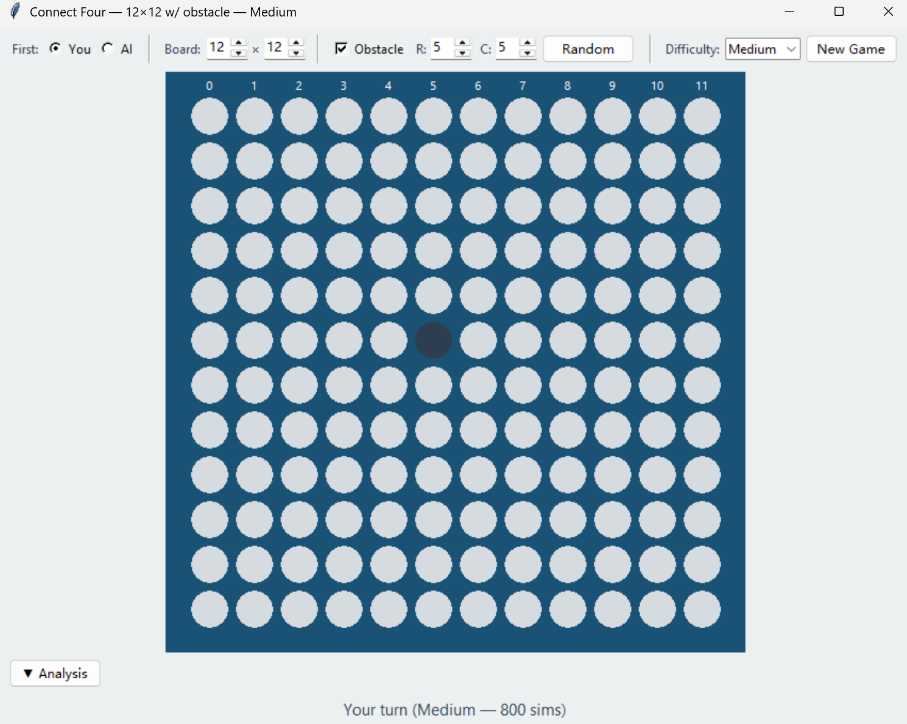

基于 AlphaZero 架构的动态四子棋强化学习系统。在可变尺寸棋盘（9×9 ~ 12×12）上，通过自对弈（self-play）训练深度残差网络，结合蒙特卡洛树搜索（MCTS）实现高水平的博弈决策。
## 项目结构

```
ConnectFour/
├── env.py          # 游戏环境：动态棋盘、障碍物、状态张量
├── network.py      # 双头残差网络（Policy-Value ResNet）
├── mcts.py         # 批量 MCTS 搜索器（支持 GPU 并行评估）
├── train.py        # 自对弈训练循环（AMP + torch.compile）
├── play.py         # 人机对弈 / 基线评估 / AI 对战 Arena
├── gui.py          # 图形化界面（tkinter），可打包为 .exe
├── my_models/
│   └── checkpoints/
│       ├── iter_00000.pt ~ iter_00499.pt   # 每迭代权重快照
│       └── checkpoint_00499.pt             # 完整训练检查点
└── ConnectFourFiles/                        # 原始竞赛平台文件
```

## 模型架构
### 输入表示
每一局游戏的状态编码为固定尺寸的 **4 通道张量** `(1, 4, 12, 12)`，始终对齐至左上角：

| 通道 | 内容 |
|------|------|
| 0 | 当前玩家棋子（1.0 = 有棋子） |
| 1 | 对手棋子（1.0 = 有棋子） |
| 2 | 有效区域掩码（1.0 = 在 H×W 范围内） |
| 3 | 障碍物位置（1.0 = 此格不可用） |

### 网络结构：ConnectFourResNet

```
Input (B, 4, 12, 12)
    │
InitialBlock: Conv(4 → num_channels, 3×3) → BatchNorm → ReLU
    │
ResidualTower: num_res_blocks × ResBlock
    │       └── Conv3×3 → BN → ReLU → Conv3×3 → BN → + → ReLU
    │
    ├── PolicyHead: Conv1×1(2) → BN → ReLU → Flatten → Linear(12)
    │       └── Action Masking + log_softmax → log_probs
    │
    └── ValueHead:  Conv1×1(1) → BN → ReLU → Flatten → Linear(64)
            └── ReLU → Linear(1) → tanh → value ∈ [-1, 1]
```

**核心参数：**
- 卷积通道数：192
- 残差块数量：7
- 总参数量：**4,670,931**
- 输入内存布局：CUDA 上使用 channels_last（NHWC）以利用 Tensor Core
- 动作掩码使用算术掩码（避免布尔张量破坏 `torch.compile` 图追踪）
### MCTS 搜索器

实现 AlphaZero 风格的蒙特卡洛树搜索，关键特性：

- **PUCT 选择公式**：`Q(s,a) + c_puct × P(s,a) × √N(s) / (1 + N(s,a))`

- **批量叶节点评估**：多条并行搜索路径同时到达叶节点，一次性送入 GPU 推理（mcts_batch=16~32）

- **虚拟损失（Virtual Loss）**：并行选择时对正在评估的路径施加负虚拟损失，防止不同路径汇聚到同一叶节点

- **狄利克雷噪声**：仅在根节点混入，增强探索（ε=0.25, α=0.3）

- **懒惰环境克隆**：`env.clone()` 不分配 GPU 张量，仅在需要网络推理时才构建状态张量

- **`_fast_step()`**：MCTS 选择阶段仅执行棋盘逻辑（落子、胜负检测），跳过张量构建
## 训练方法

### 训练流程（AlphaZero Self-Play）

```
for iteration in 1..N:
    1. 自对弈阶段：
       - 当前网络与自身对弈 num_parallel_episodes 局
       - 每步根据 MCTS 访问计数采样动作（前10步带温度τ=1，之后τ→0）
       - 记录 (state, mask, π_mcts, player) 轨迹
       - 终局后根据胜负标注 z ∈ {-1, 0, +1}
    1. 训练阶段：
       - 从经验池随机采样 batch_size 条数据
       - 损失函数：L = L_value + L_policy
         - L_value = MSE(value, z)  —— 预测终局结果
         - L_policy = CrossEntropy(π_mcts, log_probs) —— 模仿 MCTS 策略
       - 反向传播更新网络权重
    1. 保存模型检查点
```

  

### GPU 优化策略

| 优化 | 说明 |
|------|------|
| **AMP 混合精度** | `GradScaler + autocast`，前向传播使用 FP16，减少显存占用、加速计算 |
| **torch.compile** | PT2 JIT 编译（mode="default"），融合算子、消除 Python 开销 |
| **Fused AdamW** | CUDA 融合优化器实现，减少 kernel 启动次数 |
| **cuDNN benchmark + TF32** | 允许 cuDNN 自动调优卷积算法，启用 Tensor Float-32 |
| **Pinned Memory** | 训练数据通过页锁定内存异步传输至 GPU |
| **批量 MCTS** | 并行搜索路径合并为单次 GPU 推理，提升利用率 |

### 默认超参数

| 参数 | 值 | 说明 |
|------|-----|------|
| num_simulations | 400 | 每步 MCTS 模拟次数 |
| mcts_batch_size | 16 | 每次 GPU 推理的并行路径数 |
| c_puct | 1.5 | PUCT 探索常数 |
| num_parallel_episodes | 8 | 每迭代自对弈局数 |
| batch_size | 256 | 训练批大小 |
| buffer_size | 100,000 | 经验回放池容量 |
| epochs_per_iteration | 4 | 每迭代训练轮数 |
| learning_rate | 1e-3 | 初始学习率 |
| weight_decay | 1e-4 | AdamW 权重衰减 |

## 训练使用


```bash
# 从头训练
python train.py --num_iterations 500 --num_simulations 400 --batch_size 256
# 从检查点恢复训练
python train.py --resume checkpoints/checkpoint_00499.pt
# 禁用 AMP 或 compile（调试用）
python train.py --no_amp --no_compile
# 本地快速调试
python train.py --local_debug
```

训练日志可通过 TensorBoard 查看：
```bash
tensorboard --logdir logs
```

## 模型评估

### 对局测试

```bash

# 人机对弈

python play.py --mode human --checkpoint my_models/checkpoints/iter_00499.pt

  

# AI vs 贪心基线（100局，800次模拟）

python play.py --mode eval --checkpoint my_models/checkpoints/iter_00499.pt \

               --opponent greedy --num_games 100 --num_simulations 800

  

# AI vs AI Arena（两个模型对战）

python play.py --mode arena --checkpoint my_models/checkpoints/iter_00499.pt \

               --checkpoint2 my_models/checkpoints/iter_00200.pt \

               --num_games 100 --num_simulations 100

```

  

### 评估结果

#### iter_00499 vs Greedy 基线（800 sims）

| 指标 | 值 |
|------|-----|
| 胜场 | 93 |
| 负场 | 7 |
| 平局 | 0 |
| **胜率** | **93.0%** |

#### Arena：iter_00499 vs 历史检查点（100 sims，各100局）

| 对手 | 胜率 |
|------|------|
| iter_00000（未训练） | **90.0%** |
| iter_00100 | **69.0%** |
| iter_00200 | **63.0%** |
| iter_00300 | **57.0%** |

> 随迭代数增长，模型实力单调提升。低模拟次数（100 sims）下先手优势显著，胜率随对手变强逐步收敛至 50% 附近。

## 图形界面


基于 tkinter 的桌面应用，无需 Python 环境即可运行。
### 打包为 .exe

```bash

pip install pyinstaller

pyinstaller --onedir --windowed --name ConnectFour \

    --add-data "my_models/checkpoints/iter_00499.pt;my_models/checkpoints" \

    gui.py

```

输出目录：`dist/ConnectFour/ConnectFour.exe`（约 500 MB，包含 PyTorch 运行时）
### GUI 功能

  

- **难度选择**：Easy（100）/ Medium（400）/ Hard（800）MCTS 模拟

- **可定制规则**：先后手、棋盘尺寸（9×9 ~ 12×12）、障碍物有无及位置

- **可折叠分析面板**：竖向柱状图展示每列访问概率，最佳列红色高亮

- **胜负高亮**：连成四子的棋子用金色圆圈标出

- **落子标记**：橙色圆圈指示上一步落子位置

## 环境设计

### DynamicConnectFourEnv

规则在标准四子棋基础上引入两个随机变量，增强泛化能力：


- **可变尺寸**：每局随机采样 H, W ∈ [9, 12]，状态始终以 12×12 张量表示，有效区域通过掩码标记

- **障碍物**：每局随机放置一个不可落子的障碍格，破坏固定开局定式

胜负检测沿四个方向扫描连续同色棋子（避开障碍物），平局判定为无合法落子位置。

## 依赖  

```

torch >= 2.0

numpy

tensorboard

```

`play.py` 和 `gui.py` 额外需要 `tkinter`（Python 标准库自带）。
