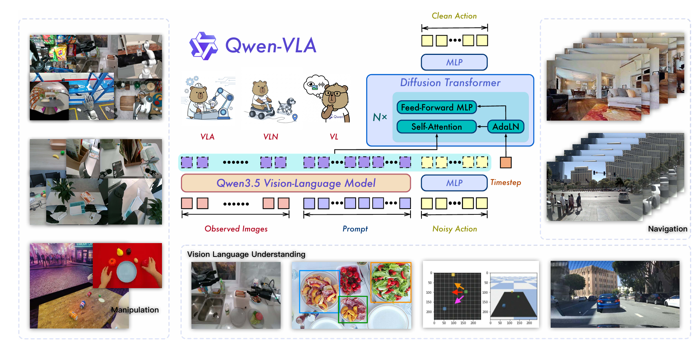
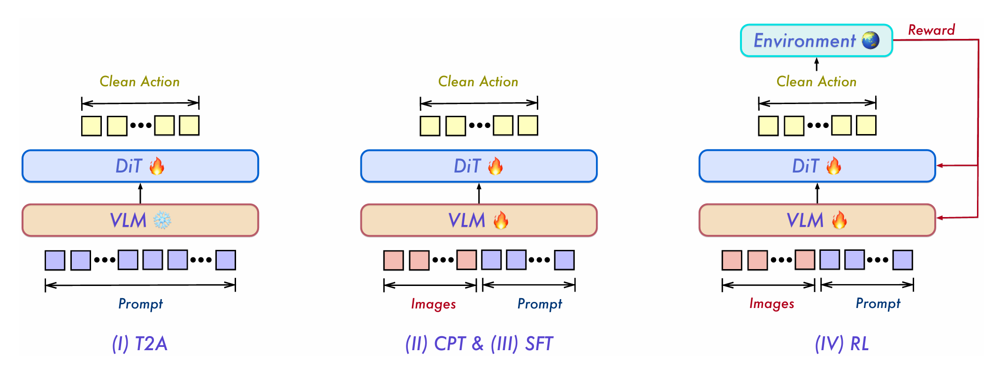

## 论文信息

- **标题**:[Qwen-VLA: Unifying Vision-Language-Action Modeling across Tasks, Environments, and Robot Embodiments](https://arxiv.org/pdf/2605.30280)
- **作者**: Qwen Team
- **发表**: arXiv:2605.30280, 2026年5月
- **链接**: [Blog](https://qwen.ai/blog?id=qwenvla) | [GitHub](https://github.com/QwenLM/Qwen-VLA)

## 一句话总结

Qwen-VLA 在 Qwen3.5-4B 视觉语言模型的基础上加了一个 DiT Flow Matching 动作解码器，通过大规模联合预训练和四阶段训练策略，将操作（manipulation）、导航（navigation）、人类自我中心演示（egocentric human demo）和视觉语言理解统一到一个模型中，实现跨具身、跨任务、跨场景的泛化。



这篇论文最大的亮点，我认为是 **「T2A（Text-to-Action）——在视觉参与之前建立语言-动作解压缩先验」** 这个设计。**语言先于视觉，解压先于锚定**。**应该先学会解压映射，再学习视觉锚定**。

---

## 1. 研究背景与动机

### 1.1 具身智能的碎片化现状

当前的具身智能系统高度专业化：
- **操作模型**（如 π₀, GR00T）：针对桌面操作或灵巧手控制
- **导航模型**（如 NaVILA, StreamVLN）：针对室内航点预测

这些模型各自为政，输出格式不同（末端位姿 vs 关节角 vs 航点），观测格式不同，控制频率不同，行为维度不同——导致跨任务、跨具身的迁移困难。

### 1.2 统一的核心洞察

尽管表象各异，所有具身决策问题共享同一计算结构：

> 一个具身智能体必须基于视觉观测、语言指令和具身约束，预测未来动作或轨迹。

这为**统一建模**提供了理论基础：将操作、导航、自我中心人类动作、轨迹预测全部形式化为条件预测问题。

---

## 2. 核心贡献

1. **统一架构**：基于 Qwen3.5-4B + DiT Flow Matching 动作解码器，将操作、导航、人类动作统一到共享的动作-轨迹预测空间
2. **大规模联合预训练语料**：混合机器人操作轨迹、人类自我中心数据、合成仿真数据、导航数据和视觉语言数据
3. **具身感知提示条件化（Embodiment-aware Prompt Conditioning）**：用文本描述取代架构变更，在不改变模型的条件下适配不同机器人平台
4. **四阶段渐进训练**：T2A → CPT → SFT → RL，逐步弥合离散语言 token 和连续动作轨迹之间的维度鸿沟
5. **强大的泛化能力**：作为单一通才策略同时在 LIBERO (97.9%), Simpler-WidowX (73.7%), RoboTwin (86.1/87.2%), R2R (69.0% OSR), RxR (59.6% SR) 上取得领先或具备竞争力的结果

---

## 3. 方法详解

### 3.1 统一问题形式化

将所有任务形式化为统一的条件预测：

$$
p(\mathbf{y}_{t:t+H-1} \mid o_t, x, e, z)
$$

其中：
- $o_t$：视觉上下文（单帧/多帧/视频）
- $x$：语言指令
- $e$：**具身提示**（描述机器人平台、控制规范）
- $z$：可选的任务类型标识
- $\mathbf{y}_{t:t+H-1}$：需要预测的目标序列（动作/航点/轨迹）

### 3.2 模型架构

Qwen-VLA 由两大组件构成：

#### 视觉语言骨干网络：Qwen3.5-4B

- **原生多模态**：ViT + 空间合并 → 视觉 token 直接插入文本 token 流
- **混合注意力**：大部分层用 Gated Linear Attention（高效），间隔使用 Grouped-Query Softmax Attention（全局推理）
- 继承强大的细粒度视觉感知、指代定位、多语言指令跟随和结构化推理能力

#### 动作专家：DiT Flow Matching 解码器

- **参数规模**：约 1.15B（16 个 DiT block 各 70.8M）
- **设计**：单流 DiT 风格 + Flow Matching 目标
- **运作机制**：
  1. VLM 隐藏状态与带噪声的动作块拼接
  2. 通过联合 Self-Attention（带 AdaLN 时间步条件 + 多段 RoPE）处理
  3. 推理时仅需几次 Euler 积分步骤即可生成动作序列，满足低延迟实时控制需求
- **解耦设计**的优势：动作专家专注精细动作生成，不干扰骨干网络的预训练能力

### 3.3 具身感知提示条件化 (Embodiment-aware Prompt)

这是本工作的关键设计，用一个文本 prompt 告知模型当前具身信息，**不需要任何架构变更**：

```
The robot is {robot_tag} with {single arm / dual arms}[, waist][, and mobile base]. 
The control frequency is {FPS} Hz. 
Please predict the next {chunk_size} control actions to execute the following task: {ori_instruction}.
```
> 当前机器人为 {robot_tag}，配备 {single arm / dual arms}[, waist][, and mobile base]。控制频率为 {FPS} Hz。请预测接下来 {chunk_size} 个控制动作以执行以下任务：{ori_instruction}。

预训练语料覆盖的机器人平台包括：WidowX, Google Robot, Franka Panda, Mobile ALOHA, AgiBot A2-D, Galaxea R1 等，涉及单臂/双臂/移动底盘/腰部等多种构型。

### 3.4 统一动作表示

核心思路：**统一张量接口 + 掩码方案，但不强行将不同具身映射到统一的物理语义空间**。

- 每个训练样本输出目标张量 $\mathbf{Y} \in \mathbb{R}^{H \times K}$（$H$ 是固定预测跨度，$K$ 是固定通道维度）
- 各类控制信号（末端位姿、关节角、航点等）使用通道布局中的前 $c \le K$ 个通道，其余零填充
- 用二进制掩码 $\mathbf{M} \in \{0,1\}^{H \times K}$ 标记有效通道——**不需要任何具身特定的输出头**

### 3.5 训练目标

联合优化两个损失：

**Flow-Matching 动作损失**：

先对每个活跃通道 $k < c$ 计算：

$$\ell_k = \frac{\sum_{h=1}^{H} \mathbf{M}_{h,k} \|v_\theta(\mathbf{Y}, \tau \mid o_{1:t}, x, e, z) - (\mathbf{Y}_1 - \mathbf{Y}_0)\|_{h,k}^2}{\sum_{h=1}^{H} \mathbf{M}_{h,k}}$$

再跨活跃通道平均：$\mathcal{L}_{act} = \frac{1}{c}\sum_{k=0}^{c-1} \ell_k$

这种两级平均保证每个控制维度平等贡献梯度，填充位置完全被排除。

**视觉语言损失**：标准 next-token prediction，防止灾难性遗忘。

$$\mathcal{L} = \lambda_{act}\mathcal{L}_{act} + \lambda_{vl}\mathcal{L}_{vl}$$

---

## 4. 训练方案：四阶段渐进训练

论文提出了一个极具洞察的 **压缩-解压缩视角**：

> 语言指令"拿起红色杯子" + 具身提示 = 少量 token 的紧凑编码；对应的运动轨迹 = 数百个高维关节位置值。弥合这一维度差距是一个**结构化解压缩问题**。

基于这一视角，设计了四阶段训练管道：

### Stage I: Text-to-Action DiT 预训练（T2A）

- **冻结 VLM**，仅训练 DiT
- **刻意屏蔽图像**，解码器仅基于文本和具身提示
- 目的：让解码器学会将紧凑的文本编码解压缩为高维动作分布——在视觉参与之前建立结构化的动作先验

### Stage II: 持续预训练（CPT）

- **解冻全部参数**，在异构混合数据上联合训练
- VLM 骨干开始将动作先验锚定到视觉观测中
- 同时包含仿真和真实数据，为后续阶段提供通用基础 → 得到 **Qwen-VLA-Base**

### Stage III: 监督微调（SFT）

- 分为两条并行分支：
  - **多任务 SFT**：联合微调 VQA + 空间定位 + 操作 + 导航
  - **真实机器人 SFT**：从 CPT 检查点出发，在内部遥操作数据上微调
- 使用余弦衰减学习率，骨干网络和动作解码器各有独立的调度

### Stage IV: 强化学习（RL）

- 从多任务 SFT 检查点出发
- 使用 **PPO + GAE**，仅在单一仿真环境（SimplerEnv）中进行
- **稀疏二值奖励**：任务成功 = 1，否则 = 0
- 关键创新：将 Flow Matching 的概率流 ODE 转换为 SDE，从而解析计算 log-probability（PPO 中重要性比率 $r_t(\theta)$ 所需）
- 产出最终模型 → **Qwen-VLA-Instruct**

---

## 5. 预训练数据

| 数据来源 | 占比 |
|---------|------|
| 机器人操作轨迹（公开+自有+合成） | 74.2% |
| 导航轨迹 | 7.5% |
| 人类自我中心轨迹（Ego4D, EgoDex, EgoVerse, Xperience） | 6.0% |
| 合成仿真轨迹（ours，ROBOINF 流水线） | 3.7% |
| 通用视觉语言数据 | 3.4% |
| 2D 空间定位 | 2.5% |
| 自动驾驶 VQA | 2.4% |
| 细粒度具身动作字幕 | 0.2% |

### 值得关注的数据策略

1. **人类自我中心数据**：将手腕运动表示为其相对于初始帧的 SE(3) 变换 + 提取 MANO 手部 45 维关节姿态的 PCA 前 10 个主成分（"eigengrasps"），每个时间步 32 维动作
2. **合成仿真数据**：基于 IsaacLab + cuRobo 流水线，生成约 8M 条轨迹，涵盖 6 种单臂机器人构型的 6 类操作模板，通过领域随机化（光照/背景/相机位姿/控制器参数）提升鲁棒性
3. **细粒度具身动作字幕**：用 Qwen3.6-plus 进行两阶段标注（粗动作序列 → 细粒度步骤描述），覆盖 13 个标注维度，约 48K 视频-字幕对
4. **相机视图标记**：用 `<|tag_start|> image <|tag_end|>` 标记每个图像的相机来源（ego / cam_left_wrist / cam_right_wrist），让模型形成视图感知的表示

---

## 6. 实验与结果

### 6.1 仿真操作（Simulation Manipulation）

单一通才模型（Qwen-VLA-Instruct）与按基准分别微调的专用模型对比：

| 基准 | Qwen-VLA-Instruct | 最佳专用模型 |
|------|------------------|------------|
| LIBERO | **97.9%** | 98.6%（ABot-M0） |
| RoboCasa-GR1 | **56.7%** | 58.3%（ABot-M0） |
| Simpler-WidowX | **73.7%** | 65.9%（StarVLA-OFT） |
| RoboTwin-Easy | **86.1%** | 86.0%（ABot-M0） |
| RoboTwin-Hard | **87.2%** | 85.0%（Being-H0.5） |

**关键结论**：一个通才模型不仅不牺牲单任务性能，在多数基准上**超越**了专用模型。

### 6.2 真实世界操作（ALOHA 双腕平台）

- **域内任务**：Qwen-VLA-aloha（含预训练）平均成功率 **83.6%**，远超从头训练的 48.5%
- **OOD 泛化**（颜色/实例/位置/背景/指令泛化）：平均 **76.9%**，比 π₀.5 高出 35.4 个百分点
- 背景和指令泛化尤为突出（80.8% 和 84.6%）

### 6.3 视觉语言导航（VLN）

| 方法 | R2R OSR↑ | R2R SR↑ | RxR SR↑ | RxR SPL↑ |
|------|---------|---------|---------|----------|
| StreamVLN | 64.2 | 56.9 | 52.9 | 46.0 |
| Qwen-VLA-Instruct | **69.0** | **57.5** | **59.6** | **47.8** |

### 6.4 OOD 泛化评估

- **SimplerEnv-OOD（静态操作）**：在仅训练简单 pick-and-place 的情况下，平均 OOD 成功率 32.0%，远超 π₀.5 的 12.6%（方向定位任务上差距尤其显著）
- **DOMINO（动态操作）**：**零样本** Success Rate 26.6%, Manipulation Score 39.5——超越了所有针对动态操作专门微调的基线模型（包括 PUMA），且仅使用当前帧观测

### 6.5 消融研究核心发现
![[Pasted image 20260531112545.png]]
1. **T2A 数据混合**：20% 合成 + 80% 真实数据效果最佳（71.09%），纯真实仅 51.04%
2. **全序列 vs 分块预测**：全序列持续优于分块（+2.86 到 +4.94 pp）
3. **T2A 中视觉输入**：在 T2A 阶段加入图像反而**损害**性能（-2.87 pp），验证了"先建立纯文本-动作映射，再引入视觉锚定"的合理性
4. **Sigmoid-Normal 时间步分布（T2A）+ Beta 分布（SFT）**：最佳组合

---

## 7. 关键设计洞察

### 7.1 "解压缩"视角的优雅之处

将动作学习视为从紧凑文本编码到高维连续动作序列的**结构化解压缩**——这一视角清晰地解释了为什么需要分阶段训练：T2A 先学习"解压映射"，CPT 再学习"视觉锚定"，两者各司其职。

### 7.2 文本 Prompt 作为统一接口

具身感知提示条件化是本工作最简洁有力的设计决策之一。它避免了为每个机器人平台设计不同的架构、输出头或输入通道——**一切差异通过文本描述来弥合**。这一设计也使得 RL 阶段学到的策略能直接迁移到新的具身平台——只需替换提示文本。

### 7.3 Flow Matching 与 RL 的结合

将 Flow Matching 的概率流 ODE 转为 SDE 来计算 PPO 中的 log-probability，是一个精巧的工程创新。随机选择单步去噪来计算重要性比率，使得 RL 训练的额外计算开销几乎可忽略。

### 7.4 训练即压缩，泛化即解压缩

T2A 阶段的大量消融实验揭示了一个核心原理：**在视觉进入之前建立强有力的语言-动作先验，是最有效的训练策略**。视觉信息过早介入反而让模型走捷径（visual shortcut），削弱了真正需要的语言-动作对应关系。

---

## 8. 局限与未来方向

论文坦诚地指出了几个核心局限：

1. **数据规模瓶颈**：具身动作数据远小于视觉语言预训练数据，限制了长尾场景的鲁棒性
2. **多任务优化权衡**：动作导向训练可能对纯视觉语言任务带来轻微退化，需要更好的损失平衡和数据课程设计
3. **短视距评估**：当前评估仍以短程和基准驱动为主，长时段、易失败的真实部署仍是开放挑战

论文提出的未来方向：
- 通过自主采集、仿真和 sim-to-real 扩展真实世界交互数据
- 利用大规模人类视频（自我中心 + 第三人称）提供物理先验
- 融合长程规划、情景记忆和世界模型
- 引入力觉/触觉/本体感知等多模态物理反馈
- 在仿真和真实世界中大规模强化学习

---

## 9. 总结与思考

Qwen-VLA 是具身基础模型方向上一份扎实的工作。它的核心贡献不在于提出了颠覆性的新架构（Qwen3.5 + DiT 都是成熟组件），而在于：

1. **系统性地解决了"如何将异构具身数据训练进同一个模型"这一工程难题**——从具身提示设计到统一张量掩码方案，从分阶段训练到数据混合策略，每个环节都经过细致的消融验证
2. **提出的"语言到动作的解压缩"视角**为 VLA 训练提供了清晰的理论指引
3. **实验充分且诚实**：不回避多任务训练带来的优化权衡，明确指出局限性

对于 VLA/VLM 方向的研究者，这篇文章在数据工程和训练策略方面提供了大量可借鉴的实践智慧。

> 当通才模型在多个任务上超越专用模型时，我们有理由相信：**统一具身建模的方向是正确的**。剩下的问题是——如何扩展到更多具身形态、更长时序、更复杂的物理交互，以及如何让数据采集的成本降到更低。
