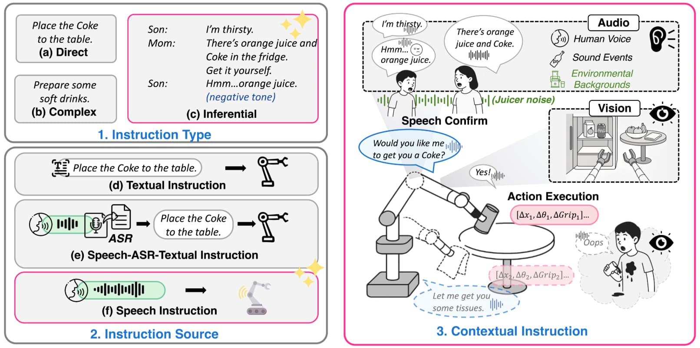
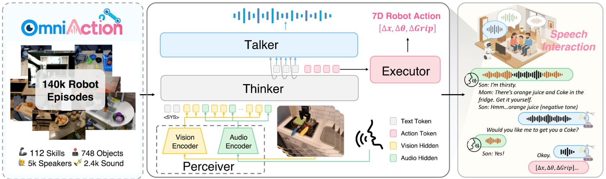
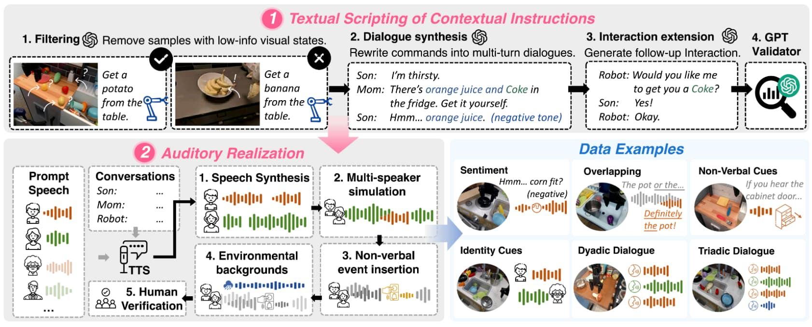

## 1. 综述
[RoboOmni：全模态背景下的主动机器人操控](https://openmoss.github.io/RoboOmni/)
**📄 论文卡片：**

- **论文标题：** _RoboOmni: Proactive Robot Manipulation in Omni-modal Context_
    
- **研究方向：** 具身智能 (Embodied AI) / 视觉-语言-动作模型 (VLA)
    
- **核心关键词：** 全模态 (Omni-modal)、主动交互 (Proactive)、音频-视觉-动作融合、意图推理
    

**🎯 一句话总结论文：** 作者提出了一种全新的全模态大模型架构（感知-思考-说话-执行），通过首次将“人类语音”与“环境声学特征（如水烧开的鸣笛声）”融入 VLA 系统，打破了传统机器人“给一个指令、做一个动作”的被动响应模式，让机器人具备了**察言观色、主动询问并执行物理动作**的能力。

**💡 我的观点 ：** 这篇论文是具身智能从‘听话的提线木偶’向‘有眼力见的助手’演进的重要分水岭。它最惊艳的设计并不在于多堆了一个音频模态，而是在引入了**基于语音对话、环境声音和视觉线索等隐性线索的意图推测**和**行动前先用自然语言确认意图（Talker机制）的闭环策略**。不过，其背后 14 万条轨迹的硬核数据采集成本，也残忍地向我们揭示了当前的残酷现实：想让机器人长出‘物理直觉’，我们依然只能靠昂贵的人力去填喂。

## 2. 动机重构：告别提线木偶

我们先想象一个你再熟悉不过的硬核工程场景：

你正戴着护目镜，双手满是锡膏，跟一块引脚极其密集的开发板死磕。这时候你满头大汗地叹了口气，嘟囔了一句：“哎，这排线怎么这么难剪……”

如果站在你旁边的是传统的 VLA 机器人（哪怕它的大脑里跑着当时最顶级的 RT-2 模型），它也会像一块石头一样杵在那儿。为什么？因为它患有严重的“指令依赖症”。在它的底层逻辑里，如果没有接收到格式极其严格的 `Instruction = "拿起桌子左侧的红色剪钳并递给人类"`，它的 `Action Token` 预测链条就永远不会启动。

这就是目前具身智能在尝试走出实验室、落地现实世界时面临的最大尴尬：**真实物理世界中的人类，极少会像敲终端命令行一样下达绝对指令。**

真实世界的沟通，充满了高维度的“潜台词（Subtext）”**和**多模态的模糊上下文：

- **视觉上的暗示：** 比如你双手被占用，或者你在四处寻找某个工具的动作。
    
- **声音与环境底噪：** 比如你抱怨的语气，或者背后突然传来的水杯掉落声、烤箱倒计时的“叮”声、仪器的过载报警声。
    

一个真正有“眼力见”的实验室学弟（或者说理想中的通用智能体），根本不需要你下死命令。他听到你抱怨，结合你被占用的双手，会主动把剪钳递过来；听到背后有玻璃摔碎，会主动转身问：“师兄，要不要我把扫把拿过来？”

这正是《RoboOmni》这篇论文试图切开的突破口。作者敏锐地指出：现有的 VLA 模型就像是高智商但极度缺乏生活常识的“死脑筋”。**要让具身智能真正融入充满不确定性的人类环境，必须完成从“被动响应（Passive）”到“主动干预（Proactive）”的范式跃迁。**

而要真正做到“主动”，仅仅依靠传统的“摄像头+键盘输入”是远远不够的。你必须给机器人装上真正的“耳朵”，光使用ASR模块是不够的，还要让它听懂环境的混沌底噪，听懂人类语气中的暗示。这就引出了本篇论文的核心：如果不把**环境声学特征**融合进模型，你的机器人永远是个“聋子”。

## 3. 核心机制拆解：PTTE架构

RoboOmni 的核心就是一个极度优雅的状态机：**PTTE 框架（Perceiver-Thinker-Talker-Executor，感知-思考-说话-执行）**。

传统的 VLA 模型是“感知 $\rightarrow$ 执行”的单行道，而 PTTE 把它变成了一个包含人类反馈的**闭环**。我们来逐一拆解：

#### 🔍 1. Perceiver（全模态感知器）：不只是“看”，更是“听音辨位”

传统的具身模型基座（比如基于 ViT 的视觉编码器）只能处理图像。而 RoboOmni 的感知器做了一个大胆的“模态加法”。

- **不搞低级的语音识别（ASR）：** 以前的机器人如果支持语音，通常是先用 ASR 把语音转成文本（“帮我拿杯子”），再把文本喂给模型。这会丢失极其重要的非文本信息——比如你的语气是焦急还是平静？
    
- **环境音的物理降维：** 这是我最喜欢的设计。它直接把未经转录的“原始音频图谱（Audio Spectrogram）”和视觉特征在时间轴上进行了对齐对齐融合。这意味着，水烧开的“呜呜”声、螺丝刀掉在地上的“吧嗒”声，在模型眼里不再是噪声，而是代表了**物理世界状态发生改变的 Trigger（触发器）**。
    

#### 🧠 2. Thinker（思考中枢）：从“填空题”到“阅读理解”

感知到了模糊的场景后，接下来怎么做？

传统模型做的是“填空题”（如果看到 X，就输出动作 Y）。而 Thinker 模块做的是“阅读理解”。它的核心任务是**意图推理（Intention Reasoning）**。当你叹气时，它内部的大模型引擎会飞速运转：_“人类发出沮丧的音频特征 + 视觉识别到桌子上的缠绕线缆 = 人类的意图是需要一把剪刀。”_

#### 🗣️ 3. Talker（对话者）：物理世界里最廉价的“安全阀”

**这是整篇论文中最让我拍案叫绝的工程化设计。**

在纯软件的数字世界里，大模型幻觉输出了错误代码，大不了抛个 Exception（异常报错）。但在物理世界，一个带着 10 斤重机械臂的机器人如果“猜错”了你的意图，一巴掌拍下去，毁掉的可能是一台昂贵的示波器。

- 面对这种极低的容错率，RoboOmni 引入了 Talker 机制。在 Thinker 推理出意图后，**它不会立刻动手，而是先开口“说话”确认。**
    
- 比如它会问：“师兄，你是需要我把左边的剪钳递给你吗？”如果得到你的肯定答复，或者你没有阻拦，它才会进入下一步。这本质上是用极其廉价的“自然语言交互”，大幅降低了高昂的“物理动作试错成本”。
    

#### ⚙️ 4. Executor（执行者）：从高维语义到低维肌肉记忆

最后一步，当意图被确认无误，系统才会把高维的语义指令转化为底层的“动作词元（Action Tokens）”。就像我们之前讨论的 VLA 原理一样，它将连续的空间坐标和抓取姿态离散化，最终通过串口下发给机械臂底层的伺服电机。

**小结一下：**

如果说传统的 VLA 培养的是一个力大无穷但又聋又哑的“莽汉”，那么 PTTE 架构就是试图培养一个虽然动作可能还略显生疏，但极具服务意识、懂得上前询问的“实习生”。**它通过牺牲一点点执行效率（多了一步对话确认），换取了在人类复杂环境中极大的安全性与主动性。**

---

## 4. 实验复盘：合成数据方法的运用
翻开这篇论文的实验部分，其庞大的工作量确实令人心生敬畏。但当我们把目光从华丽的指标移开，带入到真实的硬件开发场景中时，几根敏感的神经不可避免地被触动了。

#### 🏆 惊艳之处：用合成数据对抗具身智能的“数据荒”

论文中最让我震撼的，不是模型跑得多准，而是它背后的那个极其硬核的 **OmniAction 数据集构建流水线**。

我们都知道，真实世界里的机械臂轨迹数据比金子还贵。作者为了让模型学会“听音辨意”，走了一条极其聪明的捷径：**用 AI 训练 AI（合成数据）**。

他们用大语言模型（GPT）把单调的抓取指令强行扩写成了带情绪的“多轮对话剧本”，然后用语音合成技术（TTS）加上了背景噪音、重叠人声甚至敲击物体的非语言暗示。硬生生“无中生有”出了 14 万条高度复杂的物理交互轨迹。

这印证了目前行业内的一个残酷共识：**在通用机器人迎来自己的 GPT 时刻之前，谁掌握了低成本、高保真的“数据合成与仿真流水线”，谁就掌握了让具身模型变聪明的密码。**

#### ⚠️ 致命挑刺：真实物理世界不会为你按下“暂停键”

但是，如果明天导师让我把这套系统原封不动地部署到实验室的机械狗或移动底盘上，我会非常头疼。它的架构里隐藏着几个在纯软件测试中看不出来、但在物理世界极其致命的隐患：

1. **延时过大：**
    如果你看过其演示视频，你就会知道机械臂动作极其缓慢，抓一个物品到锅里需要将近一分钟。
    
    PTTE 架构虽然优雅，但链条太长了。处理环境音图谱 + 运行视觉 Transformer + 大模型意图推理 + 生成语音回复，这一整套走下来需要多长时间？
    
    在纯数字世界，ChatGPT 晚一秒回复你无伤大雅；但在物理世界，当机器人听到“小心！”的警告声时，如果它还需要花一秒钟去走完这套沉重的推理闭环，那台昂贵的设备可能早就摔在地上稀巴烂了。**对于底层的硬件控制来说，高纬度的智能如果不能保证实时性，有时候反而不如一个简单的中断响应函数。**
    
2. **合成数据的局限性：**
    
    虽然 TTS 合成的环境音很逼真，但这和真实世界依然有壁。实验室里风扇的低频共振、电机运转时电磁干扰带来的麦克风底噪、空旷走廊里的混响，这些真实的物理噪声，模型能靠那些在干净环境下生成的音频完美应对吗？如果感知器（Perceiver）在第一步就因为噪声听错了意图，后面的推理（Thinker）就会全部变成一本正经的胡说八道。

## 结语

从早期的单一视觉识别，到引入大语言模型作为认知中枢，再到今天 RoboOmni 试图为机器人装上敏锐的“耳朵”和谨慎的“嘴巴”。具身智能这列狂飙的列车，正在一点点拼凑出通用人工智能在物理世界的拼图。

虽然前路依然横亘着高昂的数据采集成本、令人抓狂的通信延迟和 Sim-to-Real 的鸿沟，但在无数行代码和一次次烧板子的试错中，那个属于物理世界的“GPT 时刻”，或许比我们想象的还要近。