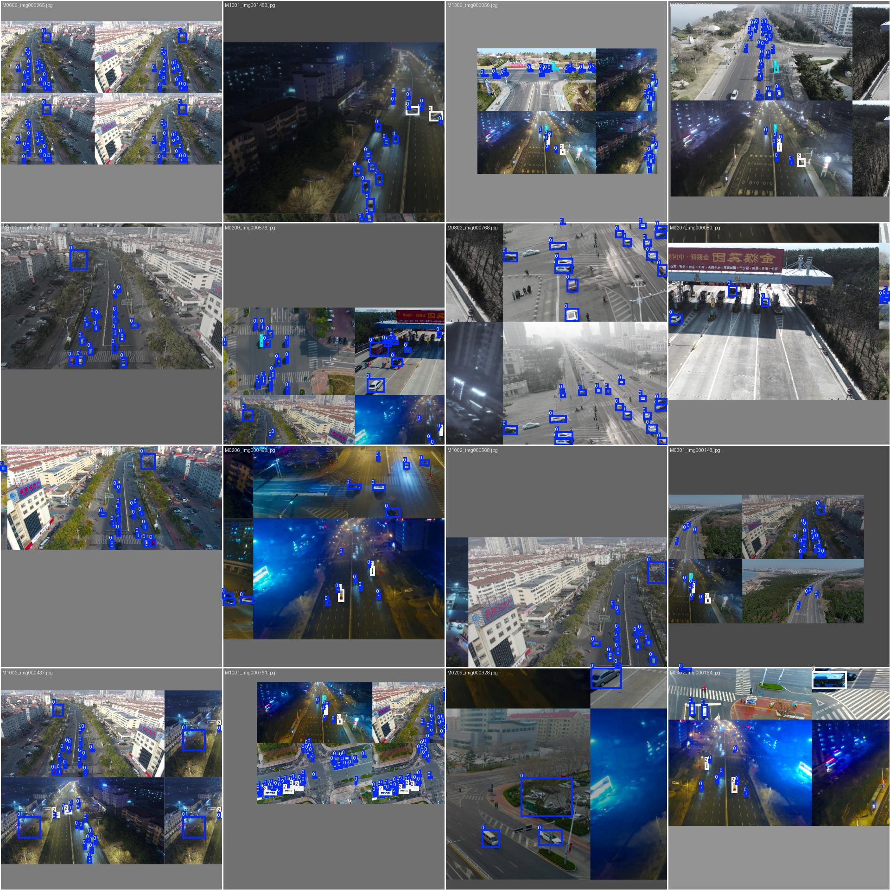
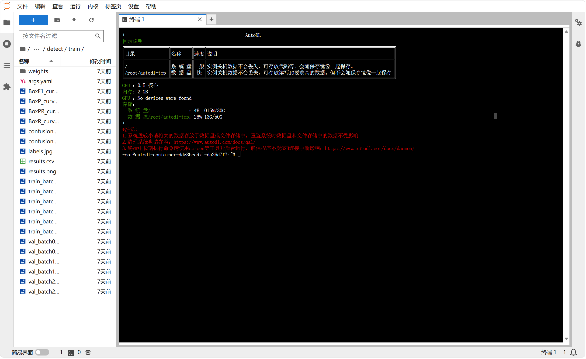
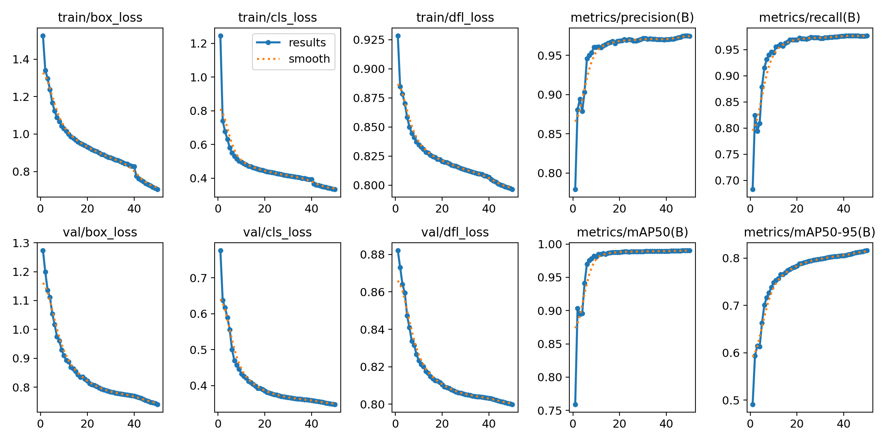
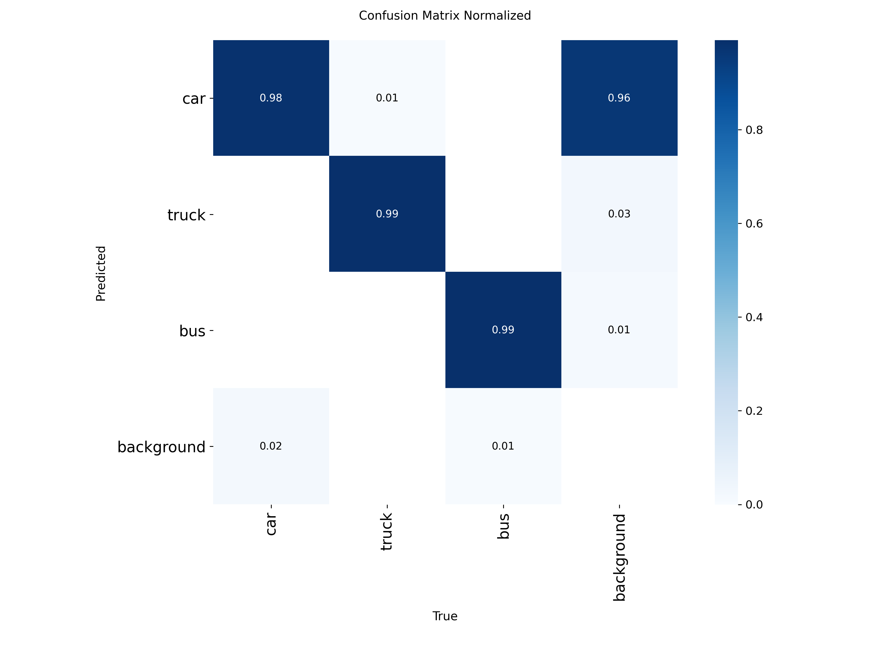
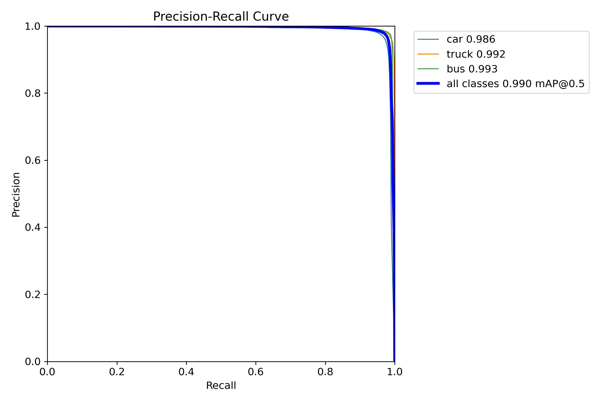
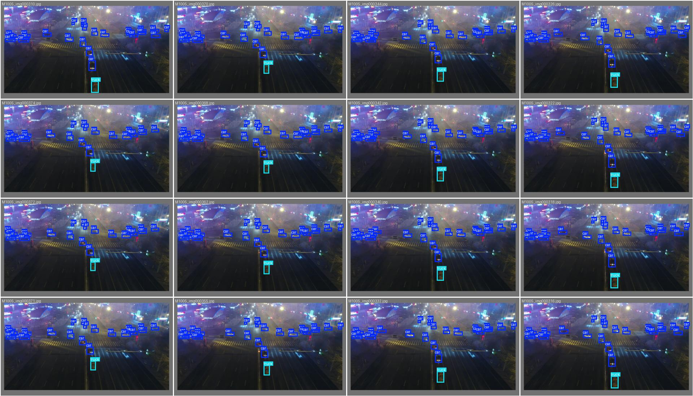
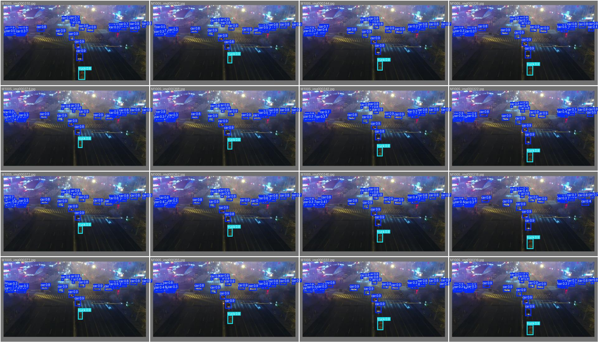
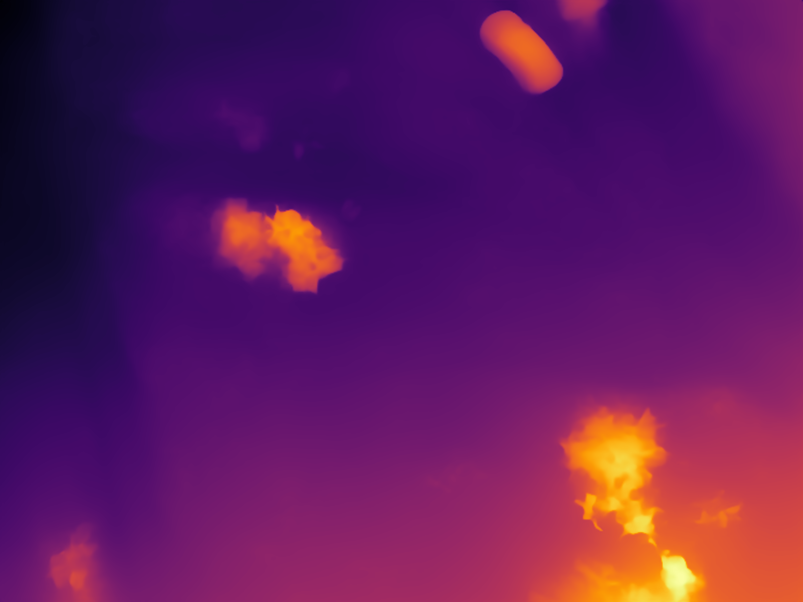
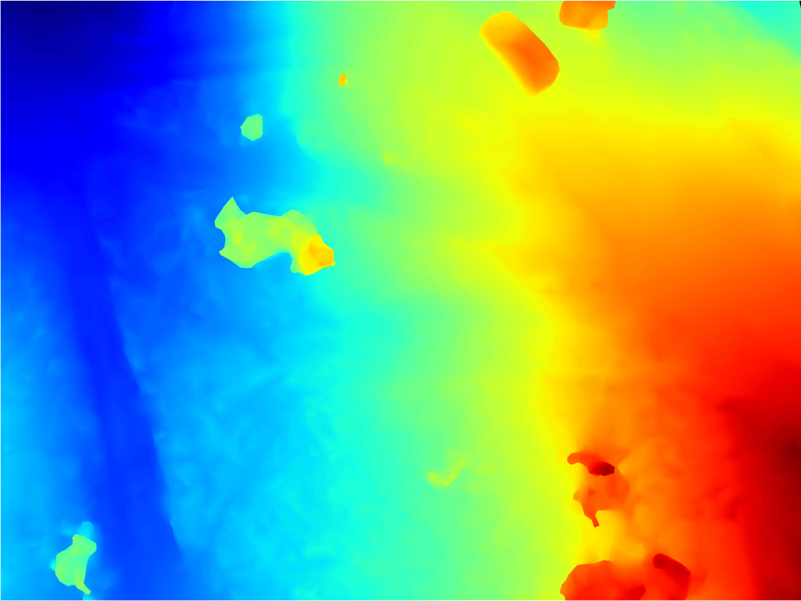
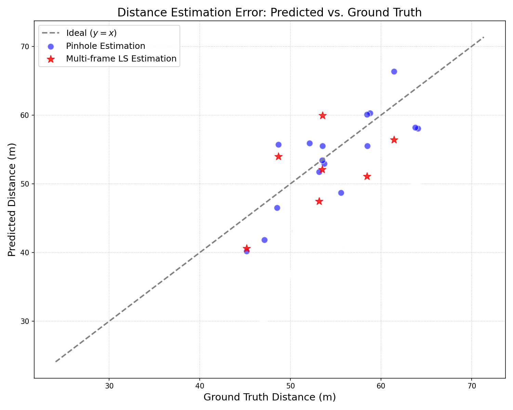

在无人机自主导航和环境感知中，测距是一件绕不开的事情。双目、激光雷达等方案可以提供更直接的几何信息，但在成本、载荷和设备复杂度受限的场景里，单目摄像头依然很有吸引力。问题也很明显：单目图像天然缺少绝对尺度，尤其在无人机俯视、斜视这类特殊视角下，目标会发生明显的形变和尺度变化，通用视觉模型很容易在检测和测距两端同时失准。

我的 SRP 项目围绕“基于深度学习的单目测距算法研究”展开，核心想法是把局部目标检测和全局深度估计结合起来：先用经过无人机视角数据微调的 YOLO 获取稳定的目标框，再用 Depth Anything 生成整幅图像的相对深度图，最后利用目标检测分支给出的绝对深度先验，对相对深度图进行动态尺度标定。

简单来说，这个系统试图回答一个问题：如果单目深度模型只能告诉我们“哪里远、哪里近”，能不能借助目标检测和相机几何，把这种相对关系拉回真实的物理距离？

## 技术路线

项目采用的是“**局部先验检测 + 全局深度估计**”的双分支框架。输入图像先经过统一缩放、归一化等预处理，然后分成两条路径：

第一条路径是 **YOLO 目标检测分支**。针对 UAVDT 等无人机数据集进行微调后，YOLO 可以在俯视交通场景中稳定提取车辆目标的二维边界框。结合相机内参和车辆实际尺寸先验，可以通过小孔成像模型估计目标的绝对距离。

第二条路径是 **Depth Anything 深度估计分支**。它对整幅图像输出高分辨率的相对深度图，能够较好保留地面、车辆、草地、道路等区域的层次关系，但本身不携带真实的米制尺度。

最后进入动态尺度标定模块：在相对深度图中裁剪出 YOLO 检测框对应的区域，用 YOLO 分支解算出的目标绝对距离作为锚点，计算相对深度到绝对深度之间的尺度因子，再将该因子广播到整张深度图，从而得到带物理尺度的全局深度结果。

这个融合思路的关键不在于让某一个模型独立完成所有事情，而是让 YOLO 提供局部、可解释的几何锚点，让 Depth Anything 提供连续、细粒度的全局深度底图。两者互补之后，单目测距的稳定性和可用性都会更好。

## 数据集与实验环境

项目主要使用了两个无人机视觉数据集。UAVDT 数据集覆盖复杂城市道路、密集目标和明显的无人机视角变化，我重点提取车辆相关类别，并将标注转换为 YOLO 训练格式，用于目标检测模型微调。WildUAV 数据集包含更开放的飞行场景和复杂背景，用于后续深度估计、真实距离标签对齐和跨数据集验证。

本地开发阶段主要完成脚本编写、数据预处理和小规模调试。由于 UAVDT、WildUAV 图像分辨率较高，同时还要运行 YOLO 与 Depth Anything，多模型联动对显存要求较高，因此训练与推理阶段迁移到 AutoDL 云端平台，使用 vGPU-32GB 实例完成主要实验。

这一套“本地 VSCode + Remote-SSH + 云端 GPU”的工作流比较适合 SRP 这种探索性实验：本地迭代轻便，云端算力按需开启，既能避免本地 12GB 显存频繁 OOM，也能控制实验成本。

## YOLO 微调结果

在目标检测部分，我基于 YOLO 预训练权重进行微调，训练任务以车辆检测为核心。训练设置中使用 50 个 epoch、batch size 32、输入尺寸 640，并保留常规数据增强策略。训练过程里，box loss、cls loss 和 dfl loss 持续下降，precision、recall 与 mAP 指标逐步稳定。

最终第 50 个 epoch 上，模型取得了较好的检测效果：Precision 为 0.97464，Recall 为 0.97653，mAP50 为 0.99039，mAP50-95 为 0.81591。对于后续测距来说，这一点很重要，因为检测框的稳定性会直接影响像素尺度、目标尺寸估计和深度标定质量。

归一化混淆矩阵也能看出，车辆相关类别具有较高的识别稳定性。PR 曲线中 car、truck、bus 各类别都接近高精度区间，所有类别 mAP@0.5 约为 0.990。

从验证集可视化结果看，模型能够在夜间、雾气、强光和远距离小目标较多的交通场景中保持比较密集的检测输出。相比原始标签，预测结果在主要车辆区域上基本对齐，说明针对无人机视角的微调确实缓解了通用模型在俯视场景中的适应问题。

## 从相对深度到绝对深度

目标检测只能给出局部目标的几何信息，而无人机测距往往需要理解整张画面的空间关系。为此，我引入 Depth Anything 作为全局相对深度估计模型。它的优势是泛化能力强、边缘贴合较好，能生成连续的深度结构；缺点是输出值本身没有真实物理单位。

下面是一组单目深度估计与融合过程的可视化。原图中车辆位于画面右上方，YOLO 能检测出目标框；Depth Anything 输出的相对深度图反映了场景前后关系；经过尺度标定后，深度图被转换为带有物理距离含义的结果。

融合模块的核心是把检测框区域当作尺度锚点。具体做法是：先计算目标框内相对深度的代表值，再用 YOLO 几何分支估计出的目标绝对深度与之相除，得到 Scale Factor。之后将该尺度因子作用于整张相对深度图，使全局深度从“相对大小”变成“物理距离”。

在实验中，我还尝试了多帧位移的最小二乘深度解算。它利用连续帧中目标框宽度变化和无人机位姿变化建立约束，和单帧针孔模型形成互补。为了减小 YOLO 检测框抖动带来的误差，我对目标框宽度加入 EMA 滤波；当多帧估计结果明显偏离物理边界时，再回退到针孔法或进行轻量加权融合。这个过程虽然不复杂，但对稳定性提升很有帮助。

## 测距误差表现

在测距验证中，我将预测距离与真实距离进行对比，并分别观察针孔法估计与多帧最小二乘估计的误差分布。散点越接近灰色的 y = x 参考线，说明预测值越接近 Ground Truth。

从结果看，针孔法在目标框稳定、目标尺寸先验较准确时表现直接有效；多帧最小二乘法在部分样本上能提供额外修正，但它对无人机运动幅度、检测框连续稳定性更敏感。因此，在工程实现中采用“针孔法兜底 + 多帧法增强 + 物理边界约束”的策略更稳妥。

项目最终验证了这条融合管线的可行性：YOLO 提供可解释的局部绝对深度，Depth Anything 提供完整的场景深度结构，动态尺度标定则把两者连接起来。虽然它还不是一个完整的机载端部署软件，但已经跑通了“图像输入、目标检测、深度估计、尺度融合、误差评估”的核心闭环。

## 项目收获

这次 SRP 最大的收获，是把一个看起来很清晰的想法真正拆成了可以运行、可以验证、可以调试的工程流程。前期我主要完成模型选型、数据集整理、训练平台调研和技术路线设计；中期集中处理 UAVDT 与 WildUAV 的数据格式转换、标签校验和训练脚本调试；后期则重点攻克相对深度到绝对深度的尺度恢复问题。

在技术上，我更系统地理解了 YOLO 微调、单目深度估计、相机成像几何和深度尺度标定之间的关系。很多误差并不来自某一个模型本身，而是来自模型之间的接口：检测框抖动会影响深度锚点，目标尺寸先验会影响针孔解算，Depth Anything 的相对深度分布也会影响全局尺度映射。

在工程上，我也更明确地体会到，算法落地并不是“指标变高”这么简单。无人机场景里的光照、视角、飞行高度、目标遮挡、显存限制和实时性要求，都会让实验室里的模型面对更苛刻的约束。后续如果继续推进，我希望能从三个方向优化：一是加入更稳定的目标跟踪与时序滤波，二是使用更多真实标定数据修正尺度因子，三是尝试通过 TensorRT 等工具将模型部署到 Jetson 等边缘计算平台。

这次项目让我真正感受到，单目测距的难点不只是“看见物体”，而是让模型在只有一只眼睛的情况下，尽可能可靠地理解三维世界。

## 参考文献

[1] 宋俊, 郑会龙, 袁建平, 等. 基于单目视觉的无人机目标定位方法研究[J]. 计算机测量与控制, 2025, 33(06): 215-222.

[2] PATEL V, MEHTA V, BOLIC M, et al. A Hybrid Framework for Object Distance Estimation using a Monocular Camera[C]. IEEE International Instrumentation and Measurement Technology Conference, 2020.

[3] YANG L, KANG B, HUANG Z, et al. Depth Anything V2: A More Capable Foundation Model for Monocular Depth Estimation[C]. NeurIPS, 2024.
