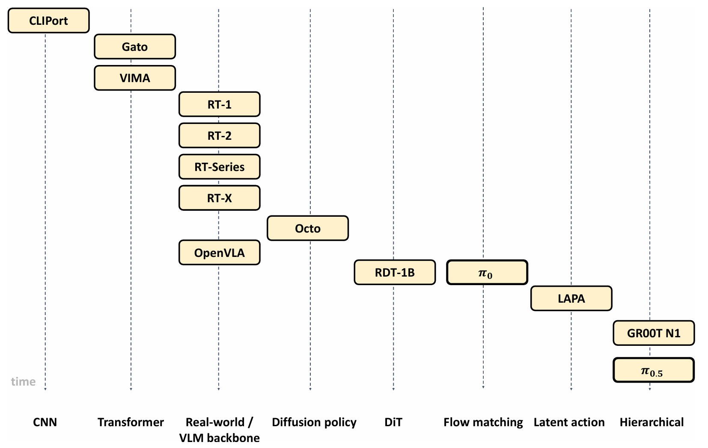

## 1. 论文卡片

- **论文标题**：[Vision-Language-Action Models for Robotics: A Review Towards Real-World Applications](https://arxiv.org/pdf/2510.07077)
    
- **研究发现**：
    
    - 通过在大规模数据上统一视觉、语言和动作这三种传统上被分开研究的模态，VLA模型旨在学习能够跨越不同任务、物体、机器人物理形态（embodiments）和环境的通用策略 。
        
    - 这种泛化能力有望使机器人能够在极少或无需额外特定任务数据的情况下解决全新的下游任务，从而促进更灵活、可扩展的真实世界部署 。
        
    - 与以往狭隘地关注动作表示或高级模型架构的综述不同，本研究提供了一个全面的“全栈式”回顾，深度整合了VLA系统的软件和硬件组件 。
        
    - 论文系统性地回顾了VLA的设计策略与架构演变、模态特定的处理技术、训练学习范式，以及面向真实世界应用时所需的机器人平台、数据收集策略、开源数据集和评估基准 。
        
- **核心关键词**：Vision-Language-Action Models（视觉-语言-动作模型）, Robotics（机器人技术）, Foundation Models（基础模型）, Imitation Learning（模仿学习）, Robot Learning（机器人学习） 。
    
- **一句话总结**：这是一篇“全栈式”的具身智能综述，系统性地梳理了视觉-语言-动作（VLA）模型在机器人领域的软硬件技术演进、架构设计、数据训练以及真实世界部署策略，为推动机器人走向通用化提供了全面指南 。
    
- **我的观点**：在大型语言模型（LLMs）和视觉语言模型（VLMs）取得巨大成功的今天，如何将它们强大的多模态理解和推理能力“落地”到具有物理实体的机器人上，是当前最具挑战性的方向 。早期的工作往往将大脑（LLM/VLM）和底层动作策略分离开来，导致泛化能力受限 。这篇综述的极高价值在于它不仅梳理了端到端的VLA架构，还深入剖析了真实世界部署中的痛点（如数据稀缺、跨具身迁移困难、训练与计算成本高昂等）。对于想要全面了解具身大模型前沿进展的研究者或工程师来说，这绝对是一份不可多得的全局技术地图和避坑指南。
    

## 2. 动机重构

这篇综述不仅解释了“为什么我们需要VLA模型”，还深刻剖析了“为什么VLA模型落地这么难”，从而引出了这篇“全栈式”综述的必要性。具体来说，论文回应了以下几个核心问题：

- **传统痛点：“大脑”与“小脑”分离架构的局限性** 早期的具身智能研究往往将大型语言/视觉模型（LLMs/VLMs）与底层负责动作生成的机器人策略解耦 。这种方式虽然在一些受限的预定义任务上有效，但系统通常只能依赖选择固定的动作基元（motion primitives）或特定任务的模仿学习策略 。这导致了一个致命问题：机器人缺乏将当前观察和指令泛化到全新、未见任务中的能力 。
    
- **VLA的破局之道：端到端的多模态大一统** 为了突破上述瓶颈，VLA模型应运而生。它的核心动机是**在一个端到端的框架内，联合学习视觉、语言和动作这三种过去被分开研究的模态** 。VLA旨在打造“通用策略（generalist policies）”，使机器人能够跨越不同的任务、物体甚至物理形态实现泛化 。这从根本上减少了对大规模、特定任务数据收集的依赖，从而大幅降低了机器人走向真实世界部署的成本 。
    
- **现实需求：为什么现在亟需这样一篇综述？** 尽管VLA展现出了巨大的通用化潜力，但该领域仍处于起步阶段，架构和训练方法尚未标准化 。论文指出，VLA走向现实世界部署仍面临三大尚未解决的“拦路虎”：
    
    1. **数据稀缺与模态不匹配**：虽然互联网上的图文数据浩如烟海，但同时满足“视觉-语言-动作”三模态的高质量数据却极为有限 。预训练的视觉语言大模型缺乏动作基础，而高质量的机器人遥操作数据又难以规模化获取 。
        
    2. **跨具身（Cross-Embodiment）迁移的鸿沟**：真实世界的机器人形态各异（机械臂、四足、轮式等），各自拥有完全不同的动作空间和传感器配置 。如何让基于一种形态甚至人类演示视频训练出的模型，成功迁移到另一种机器人形态上，是一个巨大的挑战 。
        
    3. **极高的计算与训练成本**：VLA模型需要处理高维、多模态的长序列数据（有时还包括3D点云或本体感受数据），这带来了高昂的显存和算力开销 。同时，在资源受限的真实物理机器人上进行低延迟推理也是一大难题 。
        

**总结来说**，这篇论文正是看到了VLA模型“前途光明”与“道路曲折”并存的现状，因此摒弃了以往只关注局部算法的局限，首次从软硬件结合的全栈视角，为研究者提供了一份清晰的“避坑与发展指南” 。

## 3. 核心机制拆解：VLA模型的演进族谱

这张图片展示的是**具身智能（Embodied AI）和视觉-语言-动作（VLA）模型底层架构的演进时间线**。

图片左侧向下延伸的虚线标有 “time”，说明纵向代表**时间的推移**；而底部的横坐标，代表的是**驱动这些机器人的核心基础架构或技术范式（Paradigms）**。我们可以看到，每一次架构的跃迁，都催生了新一批代表性的模型。
### 1. CNN (卷积神经网络)

- **代表模型：** CLIPort
    
- **技术含义：** 早期机器人处理视觉信息的绝对主力。模型通过提取图像的局部特征（如边缘、颜色、纹理）来理解环境。
    
- **局限性：** CNN 擅长处理空间信息，但难以有效融合复杂的自然语言指令，也较难处理长序列的时序动作。
    

### 2. Transformer (自注意力机制架构)

- **代表模型：** Gato, VIMA
    
- **技术含义：** 这是具身智能领域的一次大一统尝试。DeepMind 的 Gato 等模型开始用对待自然语言（Token）的方式，把机器人的图像、状态、文本指令和动作全部序列化，统一扔进 Transformer 里进行预测。
    

### 3. Real-world / VLM backbone (真实世界 / 视觉语言大模型骨干)

- **代表模型：** 谷歌的 RT 系列 (RT-1, RT-2, RT-X), OpenVLA
    
- **技术含义：** 标志着 VLA 时代的真正到来。研究者发现，直接把在海量互联网数据上训练好的 VLM（视觉语言大模型，如 PaLM-E）搬过来，微调一下作为机器人的“大脑”，效果惊人。它们赋予了机器人极强的跨模态泛化能力和语义理解能力，通常采用自回归（Autoregressive）的方式输出离散动作。
    

### 4. Diffusion policy (扩散策略)

- **代表模型：** Octo
    
- **技术含义：** 针对自回归模型输出“离散动作”不够平滑、容易丢失精度的问题，斯坦福/伯克利等团队引入了生成图片用的扩散模型。它不再是一个个地预测动作，而是直接生成未来一段连续平滑的“动作轨迹”，极大提升了底层物理控制的精度。
    

### 5. DiT (Diffusion Transformer)

- **代表模型：** RDT-1B
    
- **技术含义：** 传统的扩散模型（如早期 Diffusion Policy）通常使用 U-Net 结构，而 DiT 将 U-Net 替换为了 Transformer 架构。这使得模型在生成连续动作轨迹时，能够更好地扩展参数量（Scale up），处理更复杂的跨具身数据。
    

### 6. Flow matching (流匹配)

- **代表模型：** $\pi_0$ (Physical Intelligence 发布的 pi-zero)
    
- **技术含义：** 这是比标准扩散模型更前沿、更高效的生成式框架。它在数学上对生成过程进行了优化，使得模型在推断连续动作时的计算成本更低，训练收敛更快，能够更好地兼顾 VLM 的语义理解和连续控制的平滑性。
    

### 7. Latent action (潜在动作空间)

- **代表模型：** LAPA
    
- **技术含义：** 机器人的动作空间（如多个关节的角度、力矩）维度极高且复杂。Latent Action 技术不让模型直接预测物理电机的具体数值，而是先让动作映射到一个压缩的“高维特征空间（Latent Space）”中进行生成，然后再解码成物理动作。这有助于模型学习更高层次的动作规律，应对高频控制。
    

### 8. Hierarchical (分层架构)

- **代表模型：** GR00T N1 (NVIDIA), $\pi_{0.5}$
    
- **技术含义：** 这是目前解决实际物理部署的最热门方案，即“脑机分离”。最高层的模型处理极其复杂的推理（比如用 VLM 做任务分解，运行频率低，1-10Hz）；而底层使用轻量级的策略网络（如小型扩散模型或传统控制算法）来执行高频的运动学控制（50-500Hz）。这种架构兼顾了“聪明”和“敏捷”。
    

**总结来看，这条时间轴描绘了一个清晰的趋势：**

从最早**专网专用（CNN）** $\rightarrow$ 到**大一统处理（Transformer / VLM Backbone）** $\rightarrow$ 再到追求**高精度平滑控制（Diffusion / Flow matching）** $\rightarrow$ 最终走向适合复杂现实物理硬件部署的**系统工程（Latent action / Hierarchical）**。