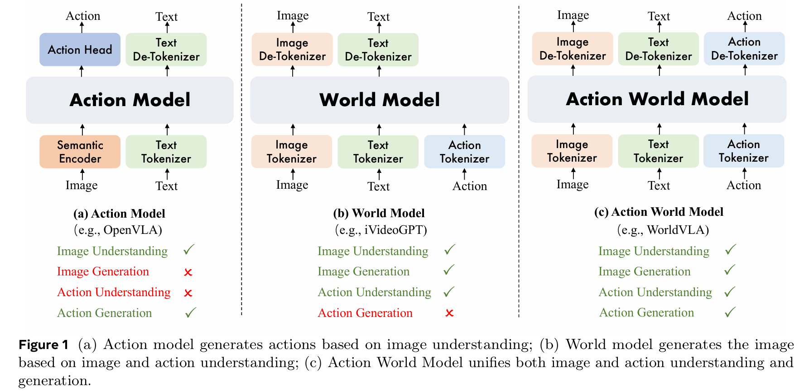
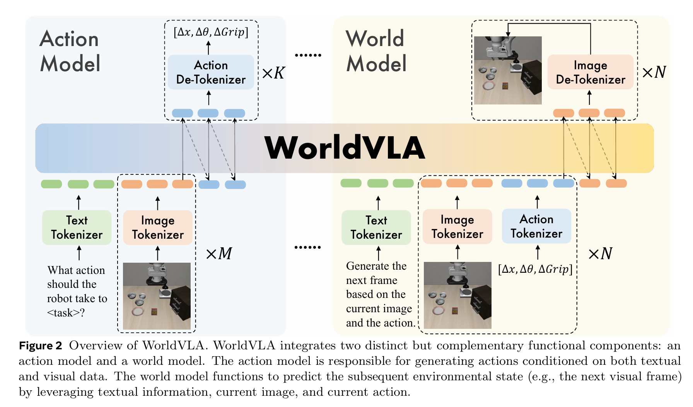
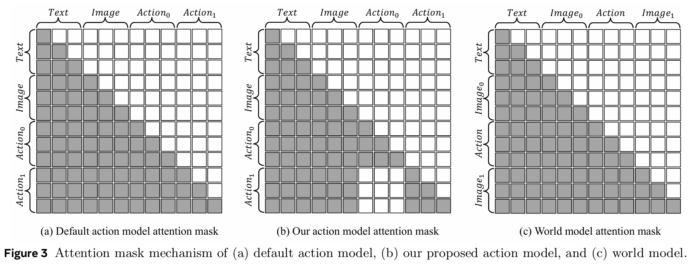
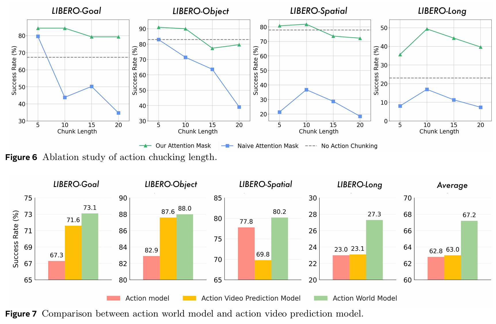
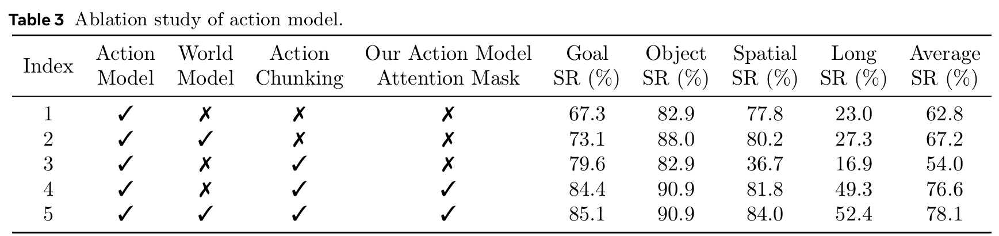
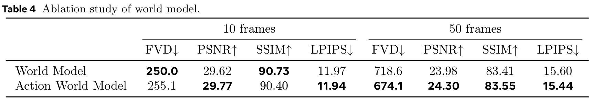

# 一、论文卡片

* **论文标题：**  
	[WorldVLA: Towards Autoregressive Action World Model](https://arxiv.org/pdf/2506.21539)
* **核心关键词：**  
	VLA、World Model、Action World Model、自回归建模、动作生成、图像生成、Action Chunking、Attention Mask、VQ-GAN、Chameleon Backbone、LIBERO Benchmark

* **一句话总结：**  
	WorldVLA 的核心思想是：**不要只让机器人学“看到图像后该怎么动”，还要让它学“执行这个动作后世界会怎么变”，通过动作模型和世界模型的联合训练，让机器人策略获得更强的环境理解和长期决策能力。** 论文中，世界模型利用当前图像和动作预测未来图像，动作模型则根据语言指令和视觉观测生成后续动作，两者在同一框架下相互增强。
* **我的观点：**  
	* 我觉得这篇论文最有价值的地方，不只是“加了一个世界模型”，而是它把机器人学习里的两个问题放到了一起：**动作决策**和**后果预测**。传统 VLA 更像是在模仿专家动作：看到图像和指令，直接输出动作；而 WorldVLA 试图让模型额外学会一种“想象未来”的能力，也就是判断某个动作会如何改变环境。这个方向很符合机器人智能的发展趋势：真正可靠的机器人不应该只是条件反射式地执行动作，而应该能在内部形成对世界动态的预测。
	
	* 另外，论文里关于 **Action Chunking + Attention Mask** 的设计也很关键。作者发现，直接让模型自回归地产生一串动作，可能会因为前面动作的错误影响后续动作，导致性能下降；因此他们提出了特殊的动作注意力掩码，限制不同动作块之间的信息泄漏。这个点说明，在机器人动作生成里，不能简单照搬语言模型的自回归范式，动作 token 和文本 token 的建模逻辑并不完全一样。

---

# 二、核心架构：把动作模型和世界模型统一到 token 序列里

WorldVLA 的整体架构可以用一句话概括：

**它把语言、图像和动作全部 token 化，然后用同一个自回归 Transformer 主干去建模两件事：机器人下一步该怎么动，以及这个动作会让世界如何变化。**

这张图其实分成左右两部分：左边是 **Action Model**，右边是 **World Model**。二者相互独立，但功能互补。

---

## 2.1 左边：Action Model，负责“该怎么做”

左侧的动作模型输入的是：

```text
任务指令 + 当前图像
```

比如图中的文本 prompt 是：

```text
What action should the robot take to <task>?
```

其中 `<task>` 会被替换成具体任务，比如“把杯子放到盘子上”或者“打开抽屉”。

这部分流程可以拆成四步：

```text
文本指令 → Text Tokenizer → text tokens
当前图像 → Image Tokenizer → image tokens
text tokens + image tokens → WorldVLA backbone
WorldVLA 输出 action tokens → Action De-Tokenizer → 机器人动作
```

最终输出的动作形式是：

```text
[Δx, Δθ, ΔGrip]
```

可以理解为：

- `Δx`：机械臂末端位置的变化；
    
- `Δθ`：姿态或角度的变化；
    
- `ΔGrip`：夹爪开合状态的变化。
    

也就是说，Action Model 解决的是一个策略学习问题：

```text
给定语言指令和当前视觉观测，预测机器人接下来应该执行什么动作。
```

如果只看动作模型，WorldVLA 和传统 VLA 很像，都是做：

```text
language + image → action
```

但 WorldVLA 的特别之处在于，它不是只训练动作模型，而是额外加入了右边的世界模型。

---

## 2.2 右边：World Model，负责“做了之后会怎样”

右侧的世界模型输入的是：

```text
任务指令 + 当前图像 + 当前动作
```

输出的是：

```text
下一帧图像
```

也就是它要学习一个环境动态模型：

```text
text + image_t + action_t → image_{t+1}
```

这部分流程是：

```text
文本指令 → Text Tokenizer → text tokens
当前图像 → Image Tokenizer → image tokens
当前动作 → Action Tokenizer → action tokens
text tokens + image tokens + action tokens → WorldVLA backbone
WorldVLA 输出 next image tokens → Image De-Tokenizer → 下一帧图像
```

这里的关键点是：世界模型不是直接控制机器人，而是在学习**动作对环境的影响**。

举个例子，如果当前画面里机械臂靠近杯子，并且动作是“夹爪闭合 + 向上移动”，那么世界模型应该预测下一帧中杯子可能被夹起来。它学到的是：

```text
这个动作会让世界发生什么变化。
```

这就是所谓的 **Action World Model**。相比普通世界模型，它不是只根据当前图像预测未来，而是显式地把机器人动作也作为条件输入进去。

---

## 2.3 Tokenizer 的作用：把不同模态翻译成统一语言

这张图里反复出现了三类 tokenizer：

```text
Text Tokenizer
Image Tokenizer
Action Tokenizer
```

它们的共同作用是：**把不同形式的数据转换成 Transformer 可以处理的 token 序列。**

文本本来就适合 token 化，比如用 BPE tokenizer；图像则可以通过 VQ-GAN 之类的方法压缩成离散视觉 token；动作虽然原本是连续控制量，也可以通过离散化或编码方式转换成 action tokens。

所以，WorldVLA 实际上是在构造一种统一的多模态序列：

```text
text tokens + image tokens + action tokens
```

对于 Transformer 来说，这些都是 token。区别只在于它们来自不同模态。

这也是 WorldVLA 架构的核心直觉：

> 不要为语言、图像、动作分别设计完全不同的模型，而是把它们统一成 token 序列，让一个自回归 backbone 学习它们之间的关系。

---

## 2.4 Image Tokenizer 和 Image De-Tokenizer：VQ-GAN 的角色

结合前面讨论的 VQ-GAN，这里的 **Image Tokenizer** 可以理解成：

```text
图像 → 离散视觉 token
```

比如一张 `256 × 256` 的图像，经过 VQ-GAN Encoder 和 Codebook 量化之后，可能变成一个 `16 × 16` 的 token 网格，也就是大约 256 个 image tokens。

反过来，**Image De-Tokenizer** 则负责：

```text
离散视觉 token → 图像
```

在动作模型里，图像 tokenizer 用来把当前观测编码成 image tokens；在世界模型里，image de-tokenizer 还要把模型预测出来的 next image tokens 还原成下一帧图像。

所以 VQ-GAN 在 WorldVLA 里承担的是图像和 token 之间的桥梁：

```text
真实图像 ↔ image tokens
```

---

## 2.5 Action Tokenizer 和 Action De-Tokenizer：动作也被 token 化

动作模型和世界模型中，动作的方向刚好相反。

在动作模型里，模型需要输出动作，所以使用的是：

```text
action tokens → Action De-Tokenizer → [Δx, Δθ, ΔGrip]
```

在世界模型里，动作是输入条件，所以使用的是：

```text
[Δx, Δθ, ΔGrip] → Action Tokenizer → action tokens
```

这说明 WorldVLA 并不是把动作当成一个普通连续向量直接拼进去，而是尽量把动作也纳入统一的 token 建模框架中。

这样做的好处是，动作可以和文本、图像一样进入 Transformer 序列，从而让模型学习：

```text
语言目标、视觉状态、机器人动作、未来图像之间的联合关系。
```

---

## 2.6 两个模型的关系：一个负责决策，一个负责想象

从功能上看，左边和右边可以这样理解：

|模块|输入|输出|作用|
|---|---|---|---|
|Action Model|文本 + 当前图像|机器人动作|决定下一步怎么做|
|World Model|文本 + 当前图像 + 当前动作|下一帧图像|预测动作造成的结果|

因此，Action Model 更像是机器人的“行动系统”，World Model 更像是机器人的“想象系统”。

传统 VLA 通常只学：

```text
看到这个场景，我应该执行什么动作？
```

而 WorldVLA 进一步要求模型学：

```text
如果我执行这个动作，接下来世界会变成什么样？
```

这个设计让模型不只是模仿专家动作，而是额外获得了对环境动态的理解。对于机器人来说，这很重要，因为现实任务往往不是单步决策，而是连续交互。一个动作执行错了，后面的状态就会偏离原来的轨迹。因此，能够预测动作后果的模型，理论上更有利于长期任务和复杂操作。

---

## 2.7 从图中读整体数据流

这张架构图可以按“从下到上”的方式读。

左边动作模型是：

```text
任务文本 + 当前图像
        ↓
Text Tokenizer / Image Tokenizer
        ↓
text tokens + image tokens
        ↓
WorldVLA backbone
        ↓
action tokens
        ↓
Action De-Tokenizer
        ↓
机器人动作 [Δx, Δθ, ΔGrip]
```

右边世界模型是：

```text
任务文本 + 当前图像 + 当前动作
        ↓
Text Tokenizer / Image Tokenizer / Action Tokenizer
        ↓
text tokens + image tokens + action tokens
        ↓
WorldVLA backbone
        ↓
next image tokens
        ↓
Image De-Tokenizer
        ↓
下一帧图像
```

所以这张图最重要的不是某一个模块，而是它表达了一种统一建模思想：

```text
动作生成和世界预测，都可以被写成 token 序列预测问题。
```

---

## 2.8 小结

WorldVLA 的核心架构可以总结为三点：

第一，**统一 token 化**。文本、图像和动作都被转换成 token，使得它们可以放进同一个 Transformer 框架中建模。

第二，**双模型互补**。Action Model 负责根据语言和视觉生成动作；World Model 负责根据当前状态和动作预测未来图像。

第三，**从“动作模仿”走向“后果预测”**。WorldVLA 不仅让机器人学会“怎么做”，还让它学会“做了之后会怎样”。这也是它相比普通 VLA 模型更有意思的地方。

下面是博客总结的**第三部分：Attention Mask 的亮点设计**，主要结合这张图来写。

---

# 三、核心亮点：用 Attention Mask 解决动作序列中的“偷看答案”问题

WorldVLA 里一个很关键、但容易被忽略的设计，是它对 **attention mask** 做了专门修改。


如果说前面的架构图回答的是：

```text
WorldVLA 怎么把文本、图像、动作统一成 token？
```

那么这张图回答的是：

```text
这些 token 在 Transformer 里到底能互相看见谁？
```

这件事非常重要。因为在自回归 Transformer 里，模型不是随便看所有 token 的，而是由 attention mask 决定每个位置能访问哪些上下文。

---

## 3.1 这张图应该怎么看

这类 attention mask 图最适合**一行一行看**。

可以这样理解：

```text
每一行：当前正在计算/预测的 token
每一列：它可以参考的 token
灰色：可以看见
白色：不能看见
```

也就是说，某一行里灰色的位置越多，说明这个 token 能用到的信息越多。

图中对角线附近出现白灰分界，是因为自回归模型通常遵循一个规则：

```text
当前位置只能看自己和之前的 token，不能看未来 token。
```

所以标准 causal mask 会自然形成一个下三角结构：左下角是灰色，右上角是白色。

这个机制在语言模型里很常见。例如生成一句话时，模型在预测第 5 个词时，可以看前 4 个词，但不能提前看到第 6 个词。

但是问题来了：**机器人动作 token 并不完全等同于文本 token。**

---

## 3.2 图 a：默认动作模型的 mask，有潜在问题

图 a 是默认动作模型的 attention mask。

它的序列结构是：

```text
Text → Image → Action0 → Action1
```

在默认 causal mask 下，后面的 token 可以看到前面的 token。因此，当模型预测 `Action1` 时，它可以看到：

```text
Text + Image + Action0 + Action1 前面的 token
```

这在普通语言建模里没问题，但在动作建模里可能会出问题。

因为这里的 `Action0` 和 `Action1` 往往不是一句话里自然连续的词，而可能是两个动作块，或者 action chunk 中不同时间段的动作。如果直接让后面的动作块看到前面的动作块，模型训练时就可能形成一种依赖：

```text
预测 Action1 时依赖 Action0 的真实答案。
```

这就有点像考试时，第二题答案可以参考第一题的标准答案。训练时看起来容易了，但实际部署时，一旦前面的动作预测错了，后面的动作就会被带偏。

所以默认 mask 的问题是：

> 它把动作 token 当成普通文本 token 来处理，允许后续动作块依赖前序动作块，容易造成动作预测中的信息泄漏和误差累积。

---

## 3.3 图 b：WorldVLA 的动作模型 mask，核心亮点就在这里

图 b 是作者提出的动作模型 attention mask。

它的序列结构仍然是：

```text
Text → Image → Action0 → Action1
```

但 mask 规则发生了变化。

在这个设计里：

```text
Action0 可以看 Text + Image + Action0 自己内部的前序 token
Action1 可以看 Text + Image + Action1 自己内部的前序 token
Action0 和 Action1 之间不能互相看
```

也就是说，`Text` 和 `Image` 是公共上下文，所有动作块都可以看；但不同动作块之间被隔离开了。

这就是图 b 中间出现大块白色区域的原因。

它表达的是：

```text
Action1 不能看 Action0
Action0 也不能看 Action1
```

这个设计非常关键。因为它让每个 action chunk 都独立地基于当前任务和视觉状态来预测，而不是依赖其他动作块的答案。

可以把它理解成：

```text
题目：Text + Image

答案块 1：Action0
答案块 2：Action1
```

两个答案块都可以看题目，但不能互相抄。

这也是 WorldVLA 在动作模型部分最重要的结构改动之一。它说明作者并不是简单地把动作序列接到 Transformer 后面，而是意识到：**动作生成有自己的结构，不能完全照搬语言模型的 causal mask。**

---

## 3.4 为什么这个设计对 Action Chunking 很重要

Action Chunking 的意思是，模型一次不是只预测一个动作，而是预测一段动作序列。

比如原来模型每次预测：

```text
action_t
```

而 action chunking 让模型一次预测：

```text
action_t, action_{t+1}, action_{t+2}, ...
```

这样做的好处是，模型可以生成更连贯的动作片段，减少每一步重新规划带来的抖动，也更适合机器人执行连续动作。

但它也带来一个风险：

```text
如果直接用普通 causal mask，后面的动作会依赖前面的动作。
```

一旦前面的动作预测偏了，后面的动作就容易跟着崩。

所以 WorldVLA 的 mask 设计相当于是给 action chunking 加了一个安全机制：

```text
允许多个动作块共享同一个视觉和语言条件，
但不允许动作块之间互相泄漏答案。
```

这也是为什么论文的消融实验里，单独加入 Action Chunking 反而可能效果变差；但加入作者设计的 attention mask 后，性能大幅提升。

---

## 3.5 图 c：世界模型的 mask，用动作预测未来图像

图 c 是世界模型的 attention mask。

它的序列结构变成了：

```text
Text → Image0 → Action → Image1
```

含义是：

```text
任务文本 + 当前图像 + 当前动作 → 下一帧图像
```

在这个 mask 里，`Image1` 的 token 可以看到：

```text
Text + Image0 + Action + Image1 前面的 token
```

这是非常合理的。

因为世界模型的目标是预测下一帧图像，那么它必须知道三件事：

```text
任务是什么？
当前世界是什么样？
机器人执行了什么动作？
```

只有知道这些信息，模型才可能预测动作之后的环境变化。

所以图 c 对应的是 WorldVLA 的世界建模能力：

```text
image_t + action_t → image_{t+1}
```

这也是它和普通视频预测模型的区别。普通视频预测可能只看过去帧，而 WorldVLA 的世界模型显式引入了动作条件。它不是单纯预测“画面自然会怎么变化”，而是在预测：

```text
机器人执行这个动作后，画面会怎么变化。
```

---

## 3.6 这张图的真正亮点

这张图的亮点不只是展示了三种 mask，而是揭示了 WorldVLA 的一个核心观点：

> 统一 token 化并不意味着所有 token 都应该用同一种 attention 规则。

文本、图像、动作虽然都被转成 token，但它们的语义结构并不一样。

文本 token 是自然顺序生成的；  
图像 token 通常表示空间区域；  
动作 token 则对应机器人控制序列。

如果简单地把它们拼起来，然后直接套用普通语言模型的 causal mask，可能会引入错误的依赖关系。

WorldVLA 的做法是：

```text
保留 Transformer 的统一建模能力，
但根据动作模型和世界模型的任务目标，重新设计 token 之间的可见关系。
```

这就是图 b 和图 c 的意义。

---

## 3.7 小结

这张图可以总结成三句话：

第一，默认动作模型 mask 会让后面的动作块看到前面的动作块，可能造成信息泄漏和误差累积。

第二，WorldVLA 的动作模型 mask 让不同 action chunk 共享同一个文本和图像上下文，但彼此隔离，从而让动作预测更稳定。

第三，世界模型 mask 允许未来图像 `Image1` 看到文本、当前图像和动作，使模型能够学习“执行动作后世界如何变化”。

所以，这张图其实是在说明 WorldVLA 的一个关键设计哲学：

```text
把语言、图像、动作统一成 token 只是第一步；
真正重要的是，设计合理的 attention mask，让模型以正确的方式理解这些 token 之间的关系。
```

# 四、模型效果：世界模型和动作 Mask 都带来了明显收益

从实验结果看，WorldVLA 的提升主要体现在两个方面：**动作执行成功率更高**，以及**长期世界预测更稳定**。

首先，在 LIBERO benchmark 上，完整模型的平均成功率达到 **78.1%**，相比基础 Action Model 的 **62.8%** 有明显提升。这说明仅仅依靠“图像 + 指令 → 动作”的传统 VLA 范式还不够，引入 World Model 之后，模型能够学习动作对环境的影响，从而提升机器人执行任务的可靠性。


更关键的是，消融实验显示，**Action Chunking 必须配合专门设计的 Attention Mask**。如果只加入 Action Chunking，但仍然使用默认 causal mask，平均成功率反而下降到 **54.0%**；而加入作者设计的动作模型 attention mask 后，平均成功率提升到 **76.6%**。这说明动作序列不能简单照搬语言模型的自回归建模方式，不同 action chunk 之间需要避免互相“偷看答案”。

在世界模型部分，论文对比了普通 World Model 和 Action World Model。短期预测 10 帧时，两者差距不大；但在长期预测 50 帧时，Action World Model 表现更好。例如 FVD 从 **718.6** 降到 **674.1**，PSNR 从 **23.98** 提升到 **24.30**。这说明动作信息对长期未来预测很重要：如果模型不知道机器人执行了什么动作，就很难准确推断后续画面会如何变化。

总体来看，实验结果支持了论文的核心观点：

**WorldVLA 的优势不只是把动作预测做得更好，而是通过世界模型让机器人学会“动作会如何改变世界”。这种后果预测能力，尤其有助于长程任务和复杂操作场景。**