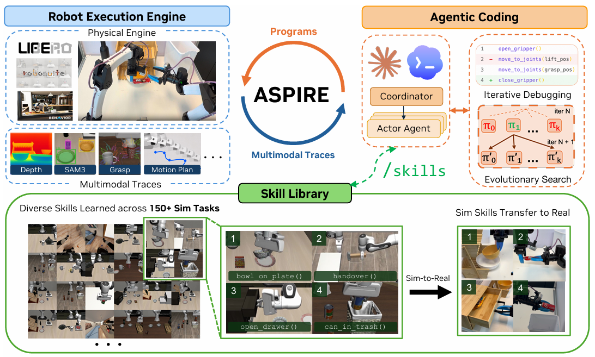
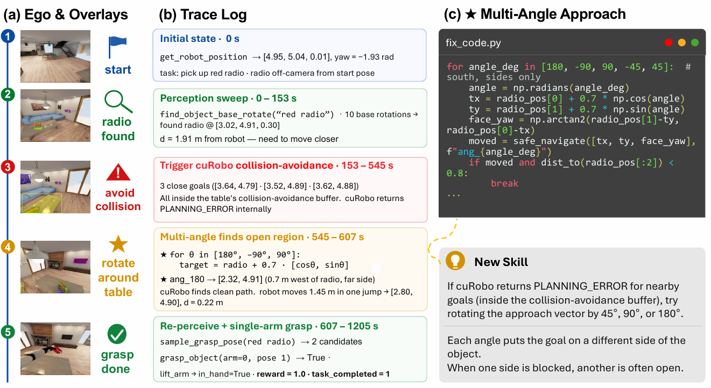
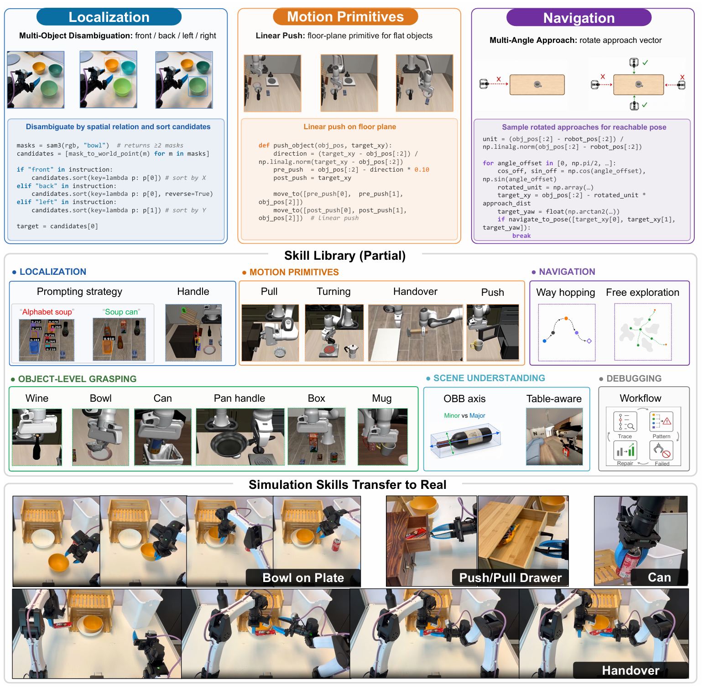

## 论文信息

- **标题**：ASPIRE: Agentic Skills Discovery for Robotics
- **作者**：Runyu Lu, Yubo Wu, Ethan Kou, Letian Fu, Wenli Xiao, Ajay Mandlekar, Yinzhen Xu, Guanya Shi, Ken Goldberg, Ang Chen, Mosharaf Chowdhury, Yuke Zhu, Linxi "Jim" Fan, Guanzhi Wang 等
- **机构**：NVIDIA、密歇根大学（UMich）、UIUC、UC Berkeley、CMU
- **发表**：2026 年 6 月，项目主页 <https://research.nvidia.com/labs/gear/aspire/>

---

# 一、论文卡片

* **核心关键词：**
  Code-as-Policy、软件工程 Agent、闭环执行引擎、多模态轨迹（trace）、失败归因、技能库、持续学习、进化式搜索、零样本迁移、Sim-to-Real、跨本体迁移

* **一句话总结：**
  Aspire 的核心思想是：**把"编程一个机器人"当成一场软件工程调试来做——让编码智能体在一个能暴露逐原语细粒度轨迹的执行引擎里，自主地看日志、定位失败、改代码、重跑验证，并把每一次成功的修复沉淀成可复用的技能，随着任务越做越多，经验不断复利。** 它不再是"跑一次失败就重来"，而是像人类机器人工程师那样，把调试经验积累成越用越强的知识资产。

* **我的观点：**
  * 这篇论文最打动我的地方，是它把"机器人失败为什么难调"这件事讲透了。传统 code-as-policy 系统跑完一个 rollout 只告诉你"任务失败了"，但失败可能来自感知错误、抓取不稳、运动规划失败、长程协调断裂中的任何一环——**粗粒度反馈让智能体根本不知道该看哪里、改哪里**。Aspire 的破局点不是换个更强的模型，而是**重构反馈通道本身**：把执行引擎从"给一个总分"变成"给每个原语调用的多模态证据链"。这是典型的"改环境比改模型更有效"的思路。

  * 另一个我很欣赏的设计是**技能库存的不是完整任务程序，而是"修复模式"**。论文里那个导航例子很典型：机器人找到收音机却总是靠近失败，根因是导航目标点落在桌子碰撞缓冲区内。Aspire 学到的技能不是"捡收音机的完整程序"，而是一条通用的导航恢复启发式——"当规划器在障碍物边界反复报 PLANNING_ERROR 时，绕物体旋转采样不同的接近方向"。**这种"提取可迁移的修复模式"而非"记住答案"的抽象层级，正是它能零样本迁移到更难任务、甚至跨本体迁移到真机的根本原因。**

  * 论文用一个残酷但诚实的对比说明了积累经验的价值：在 LIBERO-Pro Long 未见任务上，Aspire 靠积累的技能库拿到 31% 成功率，而依赖测试时反复推理和重试的此前方法只有 4%。**"解决第一百个任务的智能体，不该和解决第一个任务时一样菜"**——这句话点出了当前很多机器人 Agent 的通病：不积累、不复利。

---

# 二、问题背景：现有机器人编码智能体缺了什么

近年软件工程 Agent（Claude Code、Codex、SWE-agent 等）已经证明：语言模型能自主检查执行轨迹、定位失败、修改实现，并通过与执行环境的反复交互不断改进。这套范式启发了机器人领域的 **code-as-policy**——把感知模块、规划 API、控制原语组合成可执行的机器人程序。因为行为被显式表示成程序，理论上就可以被检查、编辑、调试和精炼。

但论文指出，现有机器人编码智能体有两个根本性缺陷：

**缺陷一：执行环境太"朴素"，只给粗粒度的任务级反馈**

机器人程序的调试本质上很难，因为失败可能来自许多相互耦合的组件：多模态感知、运动规划、抓取生成、接触动力学、长程任务协调。一次失败的 rollout 只告诉你"任务没成功"，却不告诉你根因是感知错了、抓取不稳、规划出错，还是下游恢复失败。**没有细粒度的诊断轨迹，智能体就没有能力判断该检查什么证据、如何定位失败、尝试什么修复策略。**

**缺陷二：不跨任务积累经验**

一旦某个任务完成，发现的修复和恢复策略就被丢弃了，而不是固化成可复用的技能。结果就是——解决第一百个任务的智能体，实际上并不比解决第一个任务时更有经验。

**人类机器人工程师的做法完全不同：** 程序失败时，他们会回放执行、检查感知输出和运动轨迹、定位出错的子系统、修改实现，并把可复用的恢复策略内化下来。随着时间推移，调试经验会复利成可迁移的知识——抓取恢复启发式、导航策略、prompt 配方、通用的过程性修复。这种知识积累正是人类机器人程序员越来越强的关键原因。

Aspire 要做的，就是把这套"人类工程师式的自我改进循环"搬进一个自主系统。

---

# 三、整体架构：一个开放式学习循环

Aspire 由三个组件构成，共同形成一个**开放式学习循环（open-ended learning loop）**：

```
Coordinator（协调者）
  │  管理共享技能库，为每个任务派发 Actor
  ▼
Actor（编码智能体，每任务一个，可并行）
  ├── ① 机器人执行引擎：暴露逐原语多模态轨迹，执行修复做闭环验证
  ├── ② 技能库：把验证过的修复蒸馏成可复用技能，作为 in-context 指导
  └── ③ 进化式搜索：生成多样化候选程序，跳出单轨迹精炼的局部循环
```

系统采用 **coordinator–actor 架构**：中央协调者管理共享技能库，把 actor 编码智能体派发到各个任务上（因此可以跨任务并行学习）；每个 actor 在执行引擎里编写、执行、诊断、修复机器人程序。

一个关键设计是：**Actor 之间不交换完整对话历史或原始 rollout 轨迹**。可迁移的经验被蒸馏进技能库，从而让每个 actor 的上下文窗口只聚焦于任务规格、当前程序、以及与当前失败相关的结构化执行轨迹。这既控制了上下文规模，又保证了经验共享。

随着 Aspire 遇到的任务越来越多，技能库不断增长，未来的任务可以继承已积累的修复和可复用策略——这就是"经验复利"的机制来源。



---

## 3.1 组件一：机器人执行引擎（Robot Execution Engine）

这是 Aspire 最核心的创新。具身编码智能体需要"执行证据"来调试机器人程序，而此前方法通过固定的、人工设计的接口暴露证据（人工整理的场景级摘要或预定义观测集）。这造成一个两难：**证据太少会掩盖出错的原语，原始视觉上下文太多又会让智能体从因果链上分心。**

Aspire 把这个固定反馈通道变成了**开放式调试环境**。执行引擎为每个感知、规划、控制调用记录逐原语的多模态轨迹，把轨迹暴露给编码智能体，并执行智能体编写的修复以做闭环验证。对每个原语调用，轨迹存储：

- 被调用的 API、输入与输出、返回状态；
- 相关的多模态证据：调用前后的 RGB 关键帧、叠加可视化（overlay）、抓取候选、物体位姿、运动规划结果。

**注意一个精巧的取舍：** 智能体不接收完整视频帧，引擎只保留每个原语调用前后紧邻的帧及对应的 overlay 和返回值，让智能体聚焦于与失败相关的调用周边证据。

### 一个具体调试案例（BEHAVIOR-1K 导航取收音机）

论文 Fig. 2 展示了一次完整调试：

1. **Ego 视角关键帧**显示机器人找到了收音机，却反复靠近失败，最后换了接近方向才成功；
2. **原语轨迹定位失败**：感知成功并返回了收音机位姿，但反复的 `navigate_to_pose` 调用返回 `PLANNING_ERROR`；
3. 智能体通过检查导航返回值和相关日志，发现生成的导航目标点离桌子边界太近（约 20cm 以内），触发了碰撞规避，导致规划器失败；
4. **归因结论**：失败不是因为检测或抓取收音机出错，而是目标位姿在桌子碰撞约束下不可行；
5. **修复直接源于诊断**：智能体不去改感知 prompt 或抓取原语，而是写了一个**多角度接近例程**——在收音机周围采样不同的导航目标，执行一个能绕开碰撞缓冲区的接近方向；
6. 执行引擎暴露证据、验证打过补丁的程序，这次经过验证的修复被采纳为一个可复用的 **Multi-Angle Approach（多角度接近）技能**。

这个"看日志 → 形成假设 → 做定向修复 → 重跑验证"的闭环，正是执行引擎赋予智能体的能力。



---

## 3.2 组件二：技能库（Skill Library）



**关键洞察：程序失败会跨任务复发，但可复用的知识很少是一整个任务程序。**

Aspire 的技能库存储的是**异质的修复知识**：定位启发式、感知 prompt、抓取约束、导航恢复策略、运动原语、场景理解例程、调试工作流。这个分类法不是预先规定的——技能是从验证过的修复中"归纳"出来的：

> 编码智能体从执行轨迹诊断失败 → 打补丁 → 在调试配置上验证修复 → 协调者只把**可复用的模式**采纳进共享库。

每个技能以紧凑的 in-context 指导形式存储，包含四要素：

| 要素 | 含义 |
|------|------|
| **Failure signature（失败签名）** | 触发失败的症状特征 |
| **When-to-apply（应用条件）** | 情境化的检索触发条件 |
| **Repair strategy（修复策略）** | 验证过的修复方法 |
| **Code sketch（代码草图）** | 有用时附上一段代表性代码 |

以 Fig. 2 的收音机任务为例，被采纳的技能是一个**导航恢复模式**，而非完整的取收音机程序：

> 当规划器因采样目标位姿落在碰撞缓冲区内、在障碍物边界附近反复报错时，在重试感知和抓取之前，先在物体周围采样其他接近方向。

这种表示方式让未来的 actor 可以**直接复用验证过的修复，而不必通过测试时推理重新发现**，支持零样本迁移到更难的仿真任务，也为仿真发现的技能跨本体泛化到真机提供了机制。

**技能采纳流程（严格把关）：** Actor 报告结构化发现（总结失败模式、验证过的修复、潜在可迁移的修复模式）→ 协调者审计这些发现、核验是否符合允许的 API 策略 → 只把通过调试验证的可复用修复提升进共享技能库。

论文附录展示了技能库覆盖的类别广度：定位（Localization）、导航（Navigation）、运动原语（Motion Primitives）、物体级抓取（Object-level Grasping）、场景理解（Scene Understanding）、调试工作流（Debugging）。下面举几个代表性技能：：语言里的"前面的碗""左边的碗"对 SAM3 没有意义，它会返回所有的碗且没有排序，取 `masks[0]` 会悄悄选错。技能：检测所有实例，按限定词隐含的坐标轴排序（前/后按 X，左/右按 Y），再按关键词索引选取。
- **Multi-Angle Approach（多角度接近）**：直接接近常触发 PLANNING_ERROR。技能：尝试 5 个接近角度（正向、±90°、±45°），绕物体旋转接近向量找出穿过家具的缝隙。
- **Bottle / OBB Axis Semantics（瓶子/OBB 轴语义）**：酒瓶用任意 yaw 抓取会打滑翻倒。技能：计算物体的有向包围盒（OBB），圆柱体抓取对齐长轴、扁平物体对齐短轴，并用"先 50% 试探、再 70% 就位、慢速抬起"的两阶段闭合。
- **Push（推）**：薄/扁物体（高度 <2cm）夹不起来。技能：沿地面平面推而不是抓，把动作退化为支撑面上的 2D 平移。
- **Failure Pattern（失败模式识别，调试元技能）**：一次性失败是噪声，跨 seed 或任务复发的同种失败才值得入库。技能：按 (症状, 适用类别) 对归因失败分组，出现 ≥2 次的配对成为候选库条目。**这是一条"如何总结经验"的元技能，很有意思。**

---

## 3.3 组件三：进化式搜索（Evolutionary Search）

**问题：** 单纯的轨迹引导调试可能坍缩成"局部修复循环"——智能体反复给同一个失败的策略打补丁，而不去探索解决任务的根本不同的方式。

Aspire 用进化式搜索来拓宽可执行程序的探索空间，鼓励多样化的修复假设和任务策略：

- 每一轮，编码智能体基于技能库，以此前表现最好的程序和失败轨迹为条件，提出一个**候选程序种群**（λ 个候选）；
- 每个候选在执行引擎中运行，产出任务结果和新的诊断轨迹；
- 下一轮以表现最好的程序 + 它们剩余的失败模式为条件，让搜索去探索**不同的策略**，而不是反复精炼同一个解。

搜索的目标是机器人程序本身。候选通过闭环执行来选择，验证过的修复在搜索结束后、且它们能跨环境变化和任务泛化时，才被采纳进技能库。搜索在候选解决了调试配置、或搜索预算耗尽时终止。

伪代码（Algorithm 1）概括为：初始化 → 每轮 `ProposeRepairs`（基于 Top-3 程序、失败轨迹、技能库）生成候选 → 逐个 `Execute` 打分 → 保留最优 → 达到阈值则 break → 最后在验证集上执行并 `ExtractValidatedPatterns` 抽取可复用模式入库。

---

# 四、实验结果

## 4.1 实验设置

- **仿真编码智能体**：Claude Code + Claude Opus 4.6，1M-token 上下文窗口；程序写在 CaP-X（基于 MuJoCo Playground 的开源 code-as-policy 框架）上，提供感知、几何、运动规划的机器人编程 API。**智能体、环境、API 集在所有实验中固定不变。**
- **真机迁移研究**：OpenAI Codex GPT-5.5（reasoning-xhigh 模式），双臂 YAM 操作台。选取三个在 Franka 仿真中编译出的技能（易拉罐拾取、碗放到盘上、抽屉推拉）作为 in-context 指导。真机用的是**不同的本体和 API**。
- **基准**：LIBERO-Pro（物体/目标/空间扰动下的短时域鲁棒性）、Robosuite（接触密集的单/双臂操作）、BEHAVIOR-1K（长时域家庭移动操作）。主要基线是 **CaP-Agent0**（用视觉差分、预定义技能库、每 episode 测试时重试），以及端到端 VLA：OpenVLA、π0、π0.5。

**评测协议的公平性值得强调：** Aspire 在小的 debug seed 集上学习，然后在更大的**留出评测 seed** 上只用**一个生成的程序**报告成功率；而 CaP-Agent0 是给每个 seed 重新生成一个程序、带测试时推理和重试。也就是说 Aspire 的评测条件其实更严苛。

## 4.2 主实验结果（Fig. 4 / Table 2-4）

**LIBERO-Pro（短时域，宏平均，10 任务 × 50 留出 seed）：**

| 方法 | Pos（位置扰动） | Task（指令扰动） | All |
|------|------|------|------|
| OpenVLA | 0.00 | 0.00 | 0.00 |
| π0 | 0.00 | 0.00 | 0.00 |
| π0.5 | 0.25 | 0.01 | 0.13 |
| CaP-Agent0 | 0.20 | 0.16 | 0.18 |
| **Aspire** | **0.77** | **0.67** | **0.72** |

按套件看，Aspire 相对各套件最强基线的提升：Object 上 **+77%**，Goal 上 +41.5%，Spatial 上 +42.5%。**端到端 VLA 在扰动下几乎全线崩溃**——OpenVLA 和 π0 直接归零，π0.5 在部分位置扰动上稍好但在指令改写（task paraphrase）下大幅坍塌。这个对比很尖锐地暴露了 VLA 对训练分布的过拟合/记忆问题。

**Robosuite（接触密集，100 次留出试验）：**

| 任务 | CaP-Agent0 | Aspire |
|------|-----------|--------|
| cube_lift | 0.97 | 0.97 |
| cube_stack | 0.98 | 0.99 |
| cube_restack | 0.89 | **1.00** |
| spill_wipe | 1.00 | 0.99 |
| **two_arm_handover** | 0.20 | **0.92** |
| two_arm_lift | 0.74 | 0.71 |
| nut_assembly | 0.00 | 0.09 |
| **Mean** | 0.68 | **0.81** |

最亮眼的是**双臂交接（two_arm_handover）从 20% 提升到 92%**（+72%）——这类需要双臂协调的接触密集任务，恰恰是最能体现"通过调试轨迹定位协调失败"价值的场景。

**BEHAVIOR-1K（长时域移动操作，25 留出 seed，导航与任务成功分开报告）：**

| 任务 | Human(Nav/Task) | CaP-Agent0(Nav/Task) | Aspire(Nav/Task) |
|------|------|------|------|
| Soda Can 拾取 | 0.80 / 0.72 | 0.84 / 0.72 | **0.92 / 0.88** |
| Radio 拾取 | 0.88 / 0.36 | 0.80 / 0.56 | **1.00 / 0.88** |

在导航和任务成功率上，**Aspire 同时超过了人类专家和 CaP-Agent0**，其中取收音机任务的任务级成功率从 56% 提升到 88%（+32%）。

## 4.3 跨任务零样本迁移（Fig. 5）

这是全文最有说服力的实验。Aspire 在 LIBERO-90 上积累技能库，然后**零样本**迁移到留出的 LIBERO-Pro Long 长时域任务（每个任务只生成一个程序，无额外调试、重试或任务专属更新）：

- 用完整的 N=90 技能库，Aspire 在位置扰动上达 **23%**、指令扰动上达 **38%**，两个轴都超过 CaP-Agent0 和 π0.5；
- 整体 31% 的成功率 vs 此前方法的 4%——**尽管此前方法重度依赖测试时推理和重试。**
- **更关键的趋势**：成功率随技能库规模（N = 0 → 25 → 50 → 90）持续增长。这直接证明了短时域任务积累的验证修复，能为更长时域的任务组合提供可复用的机器人知识——**经验复利是真实存在的。**

## 4.4 真机跨本体技能迁移（Table 1）

这不是直接的策略部署，而是检验"检索仿真发现的技能作为 in-context 指导，能否减少真机调试所需的工作量"。真机用自己的感知、标定、控制栈，编码智能体仍需通过真实执行反馈调整程序。

| 任务 | 无技能 总 token(M) | 有技能 总 token(M) | 无技能 成功率 | 有技能 成功率 |
|------|------|------|------|------|
| 碗放到盘上 | 8.65 | **5.11** | 20/20 | 20/20 |
| 拾取易拉罐 | 61.94 | **6.58** | 13/20 | **19/20** |
| 开/推抽屉 | 334.9 | **81.67** | 0/20 | **11/20** |

结论：迁移的技能**一致地降低了调试成本**，对最终成功率的影响则与任务相关：

- 碗放置在两种设置下都成功，但用技能检索省了近一半 token；
- 易拉罐从 13/20 提升到 19/20，同时总 token 降了近一个数量级；
- 抽屉操作在有技能指导下达到 11/20，而无技能基线**耗尽了更大的 token 预算也没产出一个成功的评测程序**。

这说明这些从失败中提炼的技能是在**跨本体、跨 API 地指导真机程序合成，而非仅仅记住了模拟器专属的代码**。

## 4.5 消融实验（Fig. 6）

在 LIBERO-Pro 上拆解两个关键组件的贡献：

| 配置 | 宏平均成功率 |
|------|------|
| 无执行引擎 / 无进化搜索（base） | 14% |
| + 机器人执行引擎 | 62% |
| + 进化式搜索（两者都用） | **72%** |

- **机器人执行引擎贡献最大**：单独就把成功率从 14% 拉到 62%（+48%）——再次印证"细粒度反馈通道"是整个系统的地基；
- **进化式搜索进一步攻克剩余的难任务**，补上最后 10%；
- 进化搜索迭代曲线显示：**前几轮提升最快**（多假设采样迅速找回单轮调试遗漏的替代方案），之后继续增长但边际递减。

---

# 五、核心设计洞察

**① 改造反馈通道，比换更强的模型更关键。**
Aspire 全程用固定的 Claude Opus 4.6，真正带来 14%→62% 飞跃的是"逐原语多模态轨迹"这个执行引擎。当智能体能看到"哪个 API 调用、输入输出是什么、返回了什么错误、当时画面长什么样"，失败归因才从"猜"变成"查"。**这提示我们：具身智能体的瓶颈往往不在推理能力，而在环境给的证据够不够。**

**② 存"修复模式"而非"任务答案"，是可迁移性的来源。**
技能库刻意不存完整程序，而存 (失败签名, 应用条件, 修复策略, 代码草图) 四元组。抽象在"修复模式"这个层级，才使得一条在仿真 Franka 上学到的导航/抓取启发式，能零样本迁移到更难任务、甚至跨本体迁移到真机 YAM 双臂。

**③ 用进化式搜索对抗"局部修复循环"。**
单轨迹调试容易陷入"反复补同一个坏策略"。进化搜索以 Top-K 程序 + 残余失败为条件生成种群，强制探索根本不同的策略——这是从"精炼一个解"到"探索解空间"的转变。

**④ Coordinator–Actor + 蒸馏，解决了上下文爆炸。**
Actor 之间不传完整历史和原始轨迹，只通过技能库共享蒸馏后的经验。这让每个 actor 的上下文只装当前任务的规格、程序和失败轨迹，既能并行学习又不撑爆上下文窗口。

---

# 六、局限与未来方向

论文诚实地列出了五点局限：

1. **尚非完全自主的真机终身学习者**：仿真里成功检测和场景重置便宜且可编程，但真机部署仍需要鲁棒的成功检测、安全重置、安全监控和标定维护。未来需要闭合"评测—重置"回路才能规模化 sim-to-real。
2. **依赖冻结的前沿大模型**：整套调试循环建立在 Claude Opus 4.6（1M 上下文）之上，尚未验证更小/更弱的模型能否维持同样的调试能力。
3. **受限于预定义 API**：智能体只能用预定义的感知/规划/控制原语编程，这让调试可控且安全，但也**限定了智能体能表达的行为**——若任务需要 API 之外的能力，只能低效近似或依赖人类扩展 API。如何让智能体安全地提出、验证、纳入新原语是开放问题。
4. **长期记忆管理未解决**：技能库增长后，部分条目可能过时、过于特化、冗余或对新任务误导，这能解释零样本迁移中的非单调趋势。需要更鲁棒的检索、剪枝、排序、再验证机制。
5. **调试+进化搜索计算开销大**：每个任务消耗大量 LLM 调用和仿真/真机 rollout。规模化到超大任务集需要更便宜的推理、更高样本效率的搜索，或更强的先验修复复用机制。

---

# 七、总结

Aspire 把机器人编程重新定义为一场"可积累经验的软件工程调试"。它用三个组件构成开放式学习循环：**暴露细粒度多模态轨迹的闭环执行引擎**（让失败可归因、修复可验证）、**不断增长的技能库**（把验证过的修复蒸馏成可迁移知识）、以及**进化式搜索**（拓宽程序探索、跳出局部修复）。

它最重要的贡献，是给出了一个**性能随经验规模化**的具身系统范式：任务见得越多，技能库越大，向新任务、更长时域行为、乃至真实世界（不同本体、不同 API）的迁移就越强。在 LIBERO-Pro、Robosuite、BEHAVIOR-1K 上大幅超越 VLA 和编码智能体基线，展现出强零样本迁移，并初步验证了仿真技能能跨本体迁移到真机、显著降低真机编程的 token 成本——这些结果共同说明：**让机器人像人类工程师那样"攒经验"，是一条被长期低估但极具潜力的路线。**
