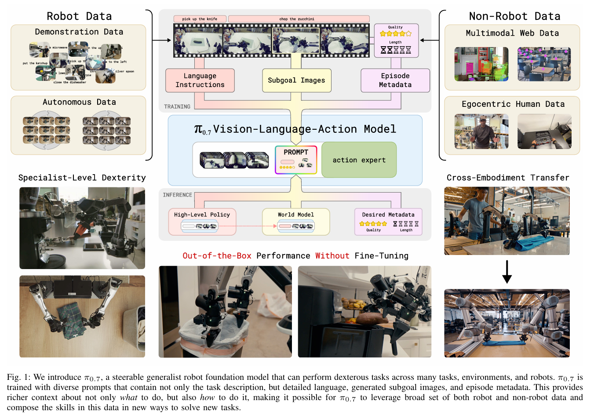
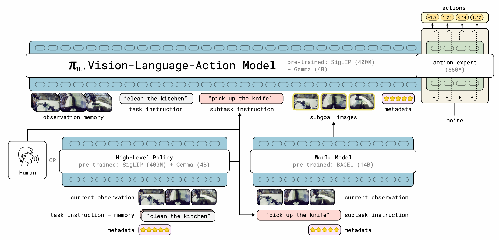

[具有涌现能力的可导向模型](https://www.pi.website/blog/pi07)

---

[π0.7: a Steerable Generalist Robotic Foundation Model with Emergent Capabilities](https://arxiv.org/abs/2604.15483)

---
## 1. 论文卡片

**🏷️ 论文标题** 
> _π0.7: a Steerable Generalist Robotic Foundation Model with Emergent Capabilities_

**🔭 研究方向**

> 具身智能 (Embodied AI) / 视觉-语言-动作模型 (VLA) / 多模态大模型应用

**🔑 核心关键词**

> Vision-Language-Action (VLA), Diverse Context Conditioning (多样化上下文调节), Zero-shot Cross-embodiment (零样本跨实体泛化), Flow Matching (流匹配), Subgoal Images (子目标图像).

**📝 一句话总结**

> $\pi_{0.7}$ 创新性地将**多模态上下文**（子目标图像、动作质量元数据等）引入训练 Prompt，成功“变废为宝”地利用了海量次优异构数据，打造出了一个能在未见环境和异构硬件上实现“开箱即用”与“组合泛化”的 50 亿参数机器人通用大脑。

**💡 我的观点**
有待思考……

图的上半部分展示了模型是如何被训练出来的，主要回答了“**数据从哪来**”以及“**怎么喂给模型**”的问题。图的正中央是 **$\pi_{0.7}$ Vision-Language-Action Model**。图的下半部分展示了模型在实际应用（Inference）时的表现。

## 2. 动机重构：π0.7为何而生

在当前的大模型浪潮中，大语言模型（LLMs）已经证明了：**海量且多样化的数据是涌现出“通用能力”的基础**。LLM 不仅能记忆知识，还能将不同的知识进行组合，解决从未见过的问题（即**组合泛化能力，Compositional Generalization**）。

然而，当我们将目光转向具身智能（Embodied AI）和物理世界时，情况却大相径庭。这正是 $\pi_{0.7}$ 这篇论文切入的核心痛点。

### 痛点分析：为什么现有的 VLA 模型不够“通用”？

目前主流的视觉-语言-动作模型（VLAs）虽然在参数规模和能力上都有所提升，但距离真正的“物理世界通用智能”仍有巨大鸿沟。论文指出了现有研究面临的三个核心痛点：

**1. 组合泛化能力的缺失与“微调依赖症”**

与 LLM 能够灵活组合已有能力来解决新问题不同，现有的 VLA 模型几乎不具备解决新任务的能力。更致命的是，即使是面对训练集中存在过的指令，如果不针对特定任务进行强化学习微调（Task-specific RL-finetuning），它们往往也无法流畅地执行。现有的机器人模型太像“专才”，而非“通才”。

**2. 海量异构数据的“反噬”（Mode Averaging 问题）**

要想获得通用能力，模型必须吸收海量、多样化的数据（包括不同机器人的策略、带有失败案例的次优自主执行数据、人类操作视频甚至互联网泛化数据）。

但是，**如果将这些参差不齐的数据直接“粗暴”地喂给模型，会导致灾难性的后果**。因为数据中包含了各种不同的策略和执行质量，朴素的训练方式会让模型对这些数据进行“平均化（Average together different modes）”，最终输出一个平庸甚至错误的次优结果。

**3. 纯文本模态的表达瓶颈**

在图像/视频生成领域，通过扩充 Prompt（加入更多细节描述）就能显著提升生成质量。但在机器人领域，仅仅给数据打上更详细的文本标签是不够的。物理世界的细节太微妙了：比如一次抓取操作的整体“质量”，或者一件“完美折叠的 T 恤”到底长什么样，这些物理特征和空间状态很难仅用自然语言精准描述。

---

### 破局之道：$\pi_{0.7}$ 的解决方案

面对上述痛点，$\pi_{0.7}$ 的核心解法是：**在训练阶段引入极度丰富的多模态上下文调节（Diverse Context Conditioning）。**

简而言之，就是彻底改变模型接收 Prompt 的方式。过去的模型 Prompt 只告诉机器人“**要做什么 (What to do)**”（例如：“叠衣服”）；而 $\pi_{0.7}$ 的 Prompt 同时告诉模型“**该怎么做 (How to do it)**”。

为了实现这一点，$\pi_{0.7}$ 构建了一个立体的 Prompt 结构，包含：

- **详细的语言标签 (Detailed language labels)**
    
- **策略元数据 (Strategy metadata)**：例如该段数据的执行质量、机器人使用的控制模态等。这完美解决了异构数据反噬的问题——模型现在能明确区分“好示范”和“坏示范”，从而从次优数据甚至失败数据中学习，而不会被其拉低整体水平。
    
- **多模态信息 (Multimodal information)**：例如子目标图像（Subgoal images）。用图像直接展示目标状态，突破了纯文本无法精确描述物理世界状态的瓶颈。
    

### 最终的涌现效果

通过这种“多模态上下文调节”，$\pi_{0.7}$ 成功化解了大规模异构数据集带来的歧义性，并展现出了令人惊艳的涌现能力。论文在评估阶段证明了它实现了：

- **开箱即用 (Out-of-the-box)**：无需微调即可完成操作浓缩咖啡机等高难度长序列任务。
    
- **零样本跨实体泛化 (Zero-shot cross-embodiment)**：在一个形态的机器人上学会的技能，可以直接迁移到另一个从未训练过该任务的异构机器人上。
    
- **指令与组合任务泛化**：能够理解复杂的长指令，并在未知环境中将旧技能组合成新任务（如操作从未见过的空气炸锅）。

## 3. 核心机制拆解：5B参数模型

### 3.1 物理架构：基于 Gemma3 的“双脑协同” 

$\pi_{0.7}$ 是一个典型的**视觉-语言-动作 (VLA)** 模型，总参数量约为 **50亿 (5B)**。它并非从零开始，而是站在了前代模型（$\pi_{0.6}$）和前沿开源大模型的肩膀上。它的架构可以看作是一个“双核”大脑：

- **“认知大脑” (VLM Backbone，约 4B 参数)**
    
    模型的主干网络初始化自强大的 **Gemma3** 视觉语言模型。它包含一个约 400M 参数的视觉编码器。为了让机器人具备“记忆”，它引入了 **MEM 记忆系统**：该系统的视觉编码器能够对历史观察画面进行时间和空间上的双重压缩。这意味着无论输入多少帧历史画面，它都能输出固定数量的 Token。这赋予了机器人理解连贯物理动作的能力，而不是仅凭单帧画面盲人摸象。
    
- **“小脑/运动中枢” (Action Expert，860M 参数)**
    
    为了将 VLM 理解的高级语义转化为机器人的物理动作，$\pi_{0.7}$ 配备了一个独立的“动作专家”模块。特别值得注意的是，它采用了**流匹配 (Flow Matching)** 技术。这种受扩散模型启发的技术，极大地提升了模型生成连续、高频（如 50Hz）电机控制指令的平滑度和精确性。
    

### 3.2 核心杀手锏：多模态上下文扩展

如果说基于 Gemma3 的 5B 架构是强健的体魄，那么“多模态上下文扩展”就是 $\pi_{0.7}$ 真正的灵魂机制。

论文中明确对比了前代与现作的差异：

> _“我们之前的模型（$\pi_0, \pi_{0.5}, \pi_{0.6}$）只使用简短的任务文本描述作为上下文。而在训练 $\pi_{0.7}$ 时，我们扩展了上下文，纳入了更多信息和模态……”_

过去的 VLA 模型，输入（Prompt）非常单薄，比如仅仅是 `<text: "把杯子放到桌子上">`。

而 $\pi_{0.7}$ 将输入扩展为一个包含极其丰富信息的立体矩阵：

#### 3.2.1 子任务指令 (Subtask instructions)

- **它是什么**：在总任务描述（如“打扫厨房”）之外，补充当前的**具体中间步骤文本**（如“打开冰箱门”）。
    
- **核心作用**：它赋予了机器人“听从人类一步步指导”的能力。在面对一个全新任务（如用空气炸锅烤红薯）时，人类可以通过语音一步步指导它。更妙的是，把这些人类指导的数据收集起来微调后，系统还能自己训练出一个高级策略网络，以后就能自动生成这些子任务指令，实现完全自主工作。
    

#### 3.2.2 子目标图像 (Subgoal images)

- **它是什么**：由一个轻量级的“世界模型”（基于 14B 参数的 BAGEL 模型初始化）生成的**多视角图像**，用来展示机器人执行完当前动作后，周围环境和机械臂应该变成什么样。
    
- **核心作用**：弥补了纯文本的“物理盲区”。比如“打开冰箱门”这句话没告诉机器人该用什么姿势握把手，但“期望图像”能直接把把手的抓取位置和姿势画出来。它将互联网上学到的海量物理常识，通过图像的方式直接灌输给了 $\pi_{0.7}$，极大地提升了机器人的空间感知和指令执行精度。
    

#### 3.2.3 回合元数据 (Episode metadata)

- **它是什么**：给训练数据打上的一系列“质量标签”，主要包含三个维度：
    
    - **整体速度 (Speed)**：完成任务花了多少步。
        
    - **整体质量 (Quality)**：1-5分的评分，5分最好。
        
    - **是否犯错 (Mistake)**：一个布尔值，记录机器人在执行中是否有抓空或做错等失误。
        
- **核心作用**：这是模型能够“变废为宝”的关键机制。因为有了这些标签，模型在训练时就能区分出哪些是“大神操作”，哪些是“菜鸟失误”。在实际应用（推理）时，只要在 Prompt 里硬性规定 `<Speed: 5, Mistake: Quality: false 快,>`，模型就会自动调用最完美的策略来执行任务。
    

#### 3.2.4 控制模式 (Control mode)

- **它是什么**：一个简单的文本标识符，告诉模型底层控制是使用**关节级控制 (joint)** 还是**末端执行器控制 (ee, end-effector)**。
    
- **核心作用**：赋予了系统在不同任务场景下，灵活切换最适合的底层物理驱动方式的能力。
    

#### 3.2.5 组合与训练策略：随机丢弃 (Dropout)

- **它是什么**：在训练阶段，模型并非每次都能看到上面所有完美的信息。研究人员采用了类似 Dropout 的机制，**随机隐藏**掉一部分提示（例如有25%的概率给子目标图像，有时故意不给子任务文本，或者隐藏元数据标签）。
    
- **核心作用**：这种“残缺训练法”赋予了 $\pi_{0.7}$ 极强的**实战鲁棒性**。这意味着在实际应用中，如果某些传感器失效或者计算资源不够导致无法生成子目标图像，机器人依然能仅靠简单的文本和元数据完成任务，不会因为缺少某个提示就彻底宕机。
    

**总结：**

$\pi_{0.7}$ 机制的绝妙之处在于：它用 5B 参数的 VLM 兜底了模型的认知上限，同时通过前所未有的“富文本+多模态” Prompt 策略，将互联网上杂乱无章的次优数据、异构机器人数据变废为宝，最终炼丹成功，催生出了强大的物理世界通用泛化能力。

## 4. 训练方法

有了强大的多模态 Prompt 机制后，$\pi_{0.7}$ 究竟是如何被训练出来的？论文的第六部分向我们展示了一个极具工业级参考价值的“炼丹配方”。最核心的亮点可以总结为三点：**用“次优数据”搞蒸馏、引入时空压缩记忆，以及解决端到端延迟。**

### 4.1 数据配方：打破“洁癖”，拥抱次优数据 (Suboptimal Data)

在过去，训练机器人大模型（VLA）往往需要耗费巨资收集完美的人类遥操作数据。一旦数据中有失误，通常会被剔除。但 $\pi_{0.7}$ 的做法截然不同：

- **海纳百川的数据源**：它的训练数据不仅包含多平台机器人（单臂/双臂、移动/固定）在实验室和真实家庭环境中的数据，还融合了人类第一视角视频（Egocentric video）甚至互联网上的通用图文数据。
    
- **核心杀手锏——次优数据蒸馏**：研究团队刻意加入了**大量失败的回合**以及**带有瑕疵的成功回合**。不仅如此，他们还将之前模型（如 $\pi_{0.6}$）在强化学习（RL）训练过程中产生的中间轨迹数据也喂给了模型。
    
- **为什么这么做？** 因为有了上一节提到的“回合元数据（Episode metadata）”做标签，模型能精准识别出哪些动作是“菜鸟失误”，哪些是“专家操作”。这实际上形成了一种**能力蒸馏 (Distillation)**——通用的 $\pi_{0.7}$ 模型通过学习海量的、覆盖各种边缘情况的次优数据，不仅继承了单任务 RL 专家的极限性能，还在面对各种突发干扰时展现出了远超单任务模型的鲁棒性。
    

### 4.2 架构进化：“空间记忆”与丝滑的底层控制

在 50 亿参数的“双脑架构”下，$\pi_{0.7}$ 在输入处理和动作输出上做了极其精细的工程优化：

- **MEM 视觉记忆编码器**：机器人最高可接收 4 个视角的摄像头画面以及 3 个视角的“子目标图像”。为了让机器人拥有连贯的“记忆”，模型会提取过去 6 帧的历史画面，但通过 MEM 编码器对时间和空间维度进行压缩，使得无论输入多少帧，都只输出固定数量的 Token。这大大降低了算力开销。
    
- **本体感受的线性映射 (Proprioceptive State)**：与前代模型将机器人的关节状态（如角度、速度）转化为离散文本 Token 不同，$\pi_{0.7}$ 直接使用线性投影将其映射到主干网络的维度中，这让模型对自身物理状态的感知更加精确。
    
- **对抗网络延迟的 RTC 技术**：860M 参数的 Action Expert（动作专家）采用**流匹配 (Flow Matching)** 输出连续动作，每次输出未来 50 步的动作块（Action Chunk）。为了解决现实世界中模型推理带来的物理延迟卡顿，$\pi_{0.7}$ 在训练时引入了**实时动作分块 (RTC, Real-time action chunking)**。它会在训练中随机模拟 0 到 12 步（最高 240 毫秒）的推理延迟，强迫模型学会预判和生成极其平滑的动作轨迹。
    

### 4.3 “子目标图像”的混合训练法则

既然 $\pi_{0.7}$ 极其依赖世界模型生成的“子目标图像”作为 Prompt，那么如何保证模型在训练和实际应用（推理）时不会产生割裂感？

研究团队采用了一种混合采样策略（Mixing Strategy）来消除 Train-Test Mismatch（训练-测试分布不匹配）：

- **真实未来的时间穿梭**：在训练时，模型有 25% 的概率看到数据片段结尾的真实图像，有 75% 的概率看到当前时刻之后 0 到 4 秒内的任意一帧真实图像。这教会了模型如何向着短、中、长期的目标逼近。
    
- **掺入“AI 幻觉”抗干扰**：如果只用真实的未来图像训练，机器人在实战中看到世界模型生成的带有微小瑕疵或“幻觉”的图像时，可能就会不知所措。因此，团队在训练集里掺入了大量由**世界模型生成的图像**。这样一来，$\pi_{0.7}$ 就学会了“包容”这些轻微不完美的提示图，在实战中依然能精准执行动作。

## 5. 模型评估

在实验评估部分（Section IX），研究团队在多种不同的机器人平台和极其复杂的物理环境中对 $\pi_{0.7}$ 进行了全方位的“压力测试”。透过这些详实的数据图表，我们可以清晰地看到 $\pi_{0.7}$ 展现出的五大核心优势：

### 1. 开箱即用：通用大模型“硬刚”单任务专才

- **核心看点 (Fig 6 & 8)**：传统的具身智能往往是一个萝卜一个坑，做咖啡的模型叠不了衣服。但 $\pi_{0.7}$ 在完全不经过特定任务微调（Zero-shot）的情况下，直接在操作浓缩咖啡机、叠衣服、折纸箱等高难度任务上，达到了甚至超越了专门为其进行强化学习（RL）微调的 $\pi_{0.6}$ 专家模型。它的吞吐量（操作速度和成功率）表现出了惊人的通用性。
    

### 2. 跨实体泛化：打破硬件物理壁垒

- **核心看点 (Fig 12)**：这是极其硬核的一环（Zero-shot cross-embodiment）。图表显示，$\pi_{0.7}$ 能够将在某一种形态的机械臂（比如小型的静态双臂）上学到的技能（如叠衬衫），直接无缝迁移到另一款尺寸更大、形态不同、且**从未收集过该任务数据**的机械臂（UR5e）上。在引入世界模型生成的子目标图像辅助后，它的表现甚至逼近了人类专家首次操作该陌生机器人的水平。
    

### 3. 听话且聪明：克服数据偏见与未知环境

- **核心看点 (Fig 9 & 11)**：在完全没见过的厨房和卧室里，面对类似“把最大的盘子上的水果拿起来”这种复杂的长尾指令，$\pi_{0.7}$ 的成功率相较于前代模型有了断崖式的领先（Fig 9）。
    
- 更有意思的是 **Fig 11（打破数据偏见）**。如果训练数据里大多数都是“把盘子放进水槽”，现在要求它“把盘子扔进垃圾桶”，传统模型会被过往的数据偏见锁死，而 $\pi_{0.7}$ 依靠强大的指令理解和图像目标调节（GC），成功逆转了这种偏见，做到了“指哪打哪”。
    

### 4. “语音教练”模式：从步步指导到完全自主

- **核心看点 (Fig 14, 15, 16)**：模型可以通过人类的一步步语音指令（比如：“左手打开空气炸锅” -> “右手拿红薯” -> “放进去”），完成一个完全陌生的长序列任务。
    
- **启发**：这种机制非常适合落地到陪伴型智能硬件的开发中。设想一下，在基于 ESP32 和多模态 LLM API 构建的桌面级互动机器人中，我们完全可以先利用这种“语音教练”模式，通过用户的日常自然语言一步步引导机器人完成特定动作；随后，系统只需收集这些带有时间戳的语音交互日志，就能微调出一个上层策略网络，让机器人以后面对类似场景时实现完全自主的 FreeRTOS 任务调度与执行，彻底免去了人工遥操作采集数据的巨大成本。
    

### 5. Scaling Law 的秘密：元数据是“免死金牌”

- **核心看点 (Fig 7 & 18)**：这两张消融实验图揭示了 $\pi_{0.7}$ 炼丹的核心秘密。
    
- Fig 18（左图）清楚地表明：如果你把海量的、质量参差不齐的数据直接喂给模型，且**不加元数据标签 (without metadata)**，数据越多，模型的性能反而越差（被脏数据污染）。
    
- 但是，一旦加入了**元数据 (with metadata, 如速度、质量评分)**，即使后续加入的数据平均质量在下降，模型的整体性能依然在**稳步上升**！这证明了包含评价维度的 Prompt 设计，是让机器人大模型享受 Scaling Law（规模法则）红利的关键钥匙。
