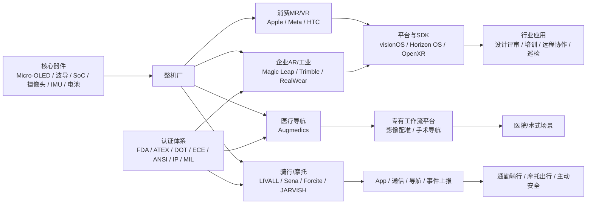
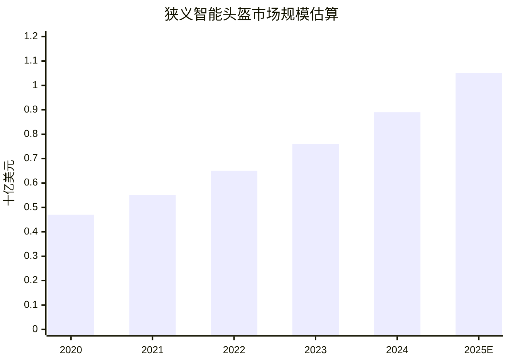

# 目前市面上的智慧头盔产品项目深度研究报告

## 执行摘要与目录

智慧头盔已分化为两条主航道：一条是以 Vision Pro、Quest 3、Magic Leap 2 为代表的空间计算头显，另一条是以 RealWear、LIVALL、Sena、Forcite 为代表的安全/作业型头盔。过去五年，行业竞争焦点已从“能否显示”转向“能否长期佩戴、合规部署并形成 ROI”。企业级机会集中在远程协作、医疗导航、巡检培训与主动安全，主要风险则来自成本、认证、续航、生态和供应链波动。 citeturn16view3turn24view6turn35search0turn39search2

目录如下：

- 研究范围与方法
- 产品全景与代表性产品比较
- 技术趋势与商业模式分析
- 市场规模、竞争格局与图表
- 专利、论文与合规观察
- 建议、结论与局限

## 研究范围与方法

本报告将“智慧头盔”定义为广义头戴式可穿戴设备，覆盖 AR/VR/MR 头显、工业安全头盔/头戴终端、骑行与摩托智能头盔，以及医疗手术导航头戴设备。之所以采用广义定义，是因为公开市场报告对“smart helmet”“AR/VR headset”“XR device”的统计口径并不统一：有的仅统计带防护壳体的安全头盔，有的统计全部头戴式显示设备，还有的把无显示智能眼镜也纳入 XR。IDC 近年的 XR 追踪已经明确把“headsets”与“smart glasses”放在统一讨论框架下，而多家 smart helmet 研究机构则把工业、骑行和消费头盔单独建模，因此本报告在市场分析部分采用“双口径”方式呈现：狭义市场看智能头盔，广义产业看 XR 头戴设备趋势。 citeturn42search1turn43search5turn39search2turn39search10

资料优先级按以下顺序处理：厂商官方规格页与新闻稿、监管资料与技术文档、专利数据库、学术论文、行业研究机构公开摘要。对公开资料缺失的字段，如价格、重量、首发月份、供应链厂商等，统一标注“未公开”或“公开信息不足”；对市场规模采用区间或假设时，会明确说明假设来源。 citeturn17search5turn14search0turn23search1turn35search10turn44search0

从方法上看，本报告重点抓三类“高确定性信号”：其一，硬件规格与合规认证；其二，软件平台、SDK 与生态约束；其三，真实部署证据，包括医院、制造业、能源场景、消费骑行与摩托用户反馈。结论因此更偏“可落地判断”，而非仅做概念罗列。 citeturn11view7turn25search11turn34view2turn29search16

## 产品全景与代表性产品比较

### 代表性产品矩阵

下表选择了 11 款代表性产品，覆盖消费 MR/VR、企业 AR、工业头戴终端、医疗导航、摩托与骑行智能头盔。表内“发布时间”以首发或当前代产品公开上市时间为准；若厂商未集中披露，则标为“在售，首发未公开”。

| 产品                           | 厂商                  | 发布时间                                       | 目标行业/场景                | 硬件规格概览                                                                                                                                                         | 软件平台与 SDK                                                                 | 主要功能                          | 价格区间                                                     | 认证与合规                                                             | 伙伴/供应链线索                                            | 用户评价与案例                                    | 主要来源                                                                                                              |
| ---------------------------- | ------------------- | ------------------------------------------ | ---------------------- | -------------------------------------------------------------------------------------------------------------------------------------------------------------- | ------------------------------------------------------------------------- | ----------------------------- | -------------------------------------------------------- | ----------------------------------------------------------------- | --------------------------------------------------- | ------------------------------------------ | ----------------------------------------------------------------------------------------------------------------- |
| Apple Vision Pro             | Apple               | 2023 首发；2025 年升级 M5 款                      | 消费级 MR、企业可视化、设计、医疗展示   | Micro‑OLED，2300 万像素；M5 + R1；2 主摄 + 6 外向追踪 + 4 眼动 + TrueDepth + LiDAR + 4 IMU；Wi‑Fi 6 / BT 5.3；续航 2.5h；机身 750–800g，外接电池 353g；双圈头带改善配重                           | visionOS；官方强调开发平台与 App Store 生态                                           | 空间计算、手眼语音交互、沉浸办公、3D 可视化、视频与协作 | US$3,499 起                                               | 各销售地法规备案；官方强调 Optic ID、环保材料与零废弃装配                                 | Apple + ZEISS 光学插片；苹果自有芯片与软件栈一体化                    | 面向高端开发者/企业用户，硬件先进但价格高、长时佩戴负担仍是门槛           | citeturn16view0turn16view2turn16view3turn16view4turn17search5turn17search7turn17search8                  |
| Meta Quest 3                 | Meta                | 2023                                       | 消费 VR/MR、教育、轻企业协作      | 每眼 2064×2208，72/90/120Hz；Snapdragon XR2 Gen 2；全彩透视双 RGB 相机，18 PPD；电池约 2.2h；515g；较 Quest 2 薄 30%                                                                | Meta Horizon OS；Meta XR Platform SDK；OpenXR 生态                            | 游戏、混合现实、社交、健身、虚拟大屏            | 当前主销 512GB，约 US$599.99；部分地区 512GB 售价更高                   | 消费电子常规合规；公开页未集中列出完整认证表                                            | Meta 自有内容与开发平台，SoC 来自高通生态                           | 大众化程度高、内容最强，但企业深场景仍依赖第三方软件                 | citeturn12search0turn12search8turn18search3turn20search2turn20search5turn21search2turn21search11         |
| Magic Leap 2                 | Magic Leap          | 2022 商业化                                   | 医疗、制造、公共部门、远程协作        | 每眼 1440×1760；显示 FOV 45°H × 55°V / 70°D；世界感知相机、深度、眼动、IMU、RGB、麦克风、气压计、环境光；x86_64 处理器 + Navi 2 GPU；官方强调比 ML1 轻 20%、体积小 50%                                        | Android 10（AOSP）；Unity / Unreal / OpenXR；企业管理导向                           | 透视 AR、动态调光、语音命令、空间映射、企业隐私控制   | Base US$3,299；Developer Pro US$4,099；Enterprise US$4,999 | 企业级隐私与数据治理；公开披露设备传感器与企业数据访问边界                                     | Magic Leap 自研光学与 Dynamic Dimming；Compute Pack 架构    | 企业场景针对性强，强项是亮环境可用性与文本清晰度                   | citeturn13view5turn14search0turn14search3turn13view4turn36search2                                          |
| VIVE XR Elite                | HTC VIVE            | 2023                                       | 消费 MR/VR、便携 PCVR、轻企业应用 | 每眼 1920×1920；90Hz；FOV 至 110°；Snapdragon XR2；12GB RAM + 128GB ROM；4 追踪相机 + 16MP RGB + 深度传感器；Wi‑Fi 6/6E、BT 5.2 + BLE；24.32Wh 可热插拔电池；续航约 2h；可调 IPD 54–73mm，后置电池配重 | VIVE 生态与串流能力；以 OpenXR/PCVR 兼容为卖点                                          | MR 透视、PCVR 串流、轻量化便携 XR        | 首发约 US$1,099                                             | 消费电子常规合规；公开规格页未集中列全套认证                                            | HTC + 高通；强调模块化与 PCVR 桥接                             | 便携与可变形是特点，但内容生态弱于 Meta                     | citeturn10search0turn15search0turn15search2turn15search4                                                    |
| Trimble XR10 with HoloLens 2 | Trimble + Microsoft | 2019                                       | 建筑、矿业、油气、制造前线          | 基于 HoloLens 2：2k 3:2 透射波导；4 个可见光相机 + 2 个 IR 眼动相机 + 1MP ToF + IMU；Snapdragon 850 + 二代 HPU；Wi‑Fi 802.11ac / BT 5.0；2–3h；HoloLens 2 重量 566g；XR10 额外整合硬帽与翻转视窗      | Windows Holographic；Trimble Connect；Dynamics 365 Guides / Remote Assist 等 | BIM/3D 模型下沉现场、检验、装配、协作、培训     | 未公开                                                      | Trimble 强调硬帽认证化方案；HoloLens 2 符合 ANSI Z87.1、CSA Z94.3、EN166 基本冲击保护 | Trimble + Microsoft 强耦合，是“软件工作流 + 头显 + 安全帽”的典型一体化方案 | 建筑与现场协作标杆，但平台连续性风险高于纯软件方案                  | citeturn22view1turn11view4turn23search1                                                                      |
| RealWear Navigator 520       | RealWear            | 在售，首发未公开                                   | 工业巡检、维修、远程协作、数字 SOP    | 工业单目微显；官方 FAQ 指显示较 500 代“屏幕大 20%、分辨率 2 倍”；Snapdragon 662；64GB / 4GB / microSD 512GB；270g；热插拔电池、全班次续航；IP66、MIL‑STD‑810H、2m 跌落；可配 FLIR 热像模块                      | Android 13（AOSP）+ WearHF；RealWear Cloud；App Marketplace                   | 免手操作、远程协作、数字工单、AI 工具、热像巡检     | 未公开                                                      | IP66、MIL‑STD‑810H、2m 跌落                                           | RealWear + Teledyne FLIR；以模组化扩展能力区分于普通头显            | 工业现场部署成熟，ROI 通常来自减少停机与出差                   | citeturn11view6turn25search5turn25search10turn24view4turn25search11                                        |
| RealWear Navigator Z1        | RealWear            | 在售，首发未公开                                   | 危险环境、油气、化工、防爆区域        | ATEX Zone 1；QCS6490 + AI Core；内存为 HMT‑1Z1 的 4 倍；48MP 模组相机；显示更大 20%、分辨率 2 倍；Wi‑Fi 6 / 5G 支持；100 dB 噪声环境语音控制；IP66，2m 跌落；重量未公开                                    | Android 12（AOSP）+ WearHF；工业 app 生态                                        | 防爆场景远程协作、巡检、数字流程、热像辅助         | 未公开                                                      | ATEX Zone 1、IP66、2m 跌落                                            | RealWear 工业生态；热像模组与 5G/Wi‑Fi 6 是升级重点                | 危险环境适配能力强，是企业级智能头盔里“合规优先”的代表               | citeturn24view6turn27search2turn25search9turn26search2                                                      |
| Augmedics xvision / X2       | Augmedics           | xvision 2019 起商用；X2 于 2025 获 FDA clearance | 脊柱手术 AR 导航             | 透明 AR 显示；xvision 适用于 C3 至骨盆开放或经皮手术；X2 官方称视场与分辨率较前代均提升 100%，亮度增强、处理器更强且更省电；重量、续航未公开                                                                             | 专有手术导航平台；非开放式消费 SDK 逻辑                                                    | 术中“X-ray vision” 导航、器械与植入物对位  | 未公开                                                      | FDA 批准/许可是核心壁垒                                                    | 医疗系统集成路线，围绕影像、手术器械与医院工作流                            | 已在美国多州医院使用，累计病例数形成较强临床背书                   | citeturn11view7turn35search0turn35search2turn35search10turn35search16                                      |
| Sena Impulse                 | Sena                | 2022                                       | 摩托骑行通信与主动可见性           | 模块化复合玻纤壳体；1760g；Bluetooth 5.0 + Mesh Intercom 3.0 + Wave Intercom；Wi‑Fi b/g/n 自动固件更新；1300mAh；蓝牙通话最长 20h、Mesh 13h；尾灯、遮阳镜、Harman Kardon 音频                       | Sena Motorcycles App                                                      | 头盔通信、群组对讲、音乐/电话、尾灯可见性         | 首发 US$699；欧洲现售约 €629                                     | DOT；欧洲版本已获得 ECE 22.06                                             | Sena + Harman Kardon                                | 优势在“通信整合式头盔”，不是 AR HUD 型产品                 | citeturn31view1turn31view3turn31view4turn32search1turn32search0                                            |
| Forcite MK1S                 | Forcite             | MK1S 代在售                                   | 摩托导航、视频记录、道路提示         | T‑400 碳纤复合壳；1500g ±50g；1080P 30–60fps Sony IMX 摄像头；158° 视场；BT 5.0；录制时 3–4h、后台使用可超 7h；3DoF 加速度计、环境光传感器、周边 LED 提示；双麦克风 + Harman Kardon 扬声器                       | Forcite App + 车把蓝牙控制器                                                     | 周边视觉导航、测速/路况提醒、行车记录、音频控制      | 澳站约 A$1,299；英站约 £929                                     | ECE 22.05；美国 DOT 版本                                               | Forcite + Harman Kardon；以应用与提醒算法构建差异化               | 媒体普遍认可硬件整合度，但也指出 App/控制器仍有改进空间             | citeturn28view0turn28view1turn28view2turn28view3turn29search0turn29search13turn29search16turn29search14 |
| LIVALL EVO21                 | LIVALL              | 2021                                       | 公路骑行、通勤、轻运动            | 350g；360° 灯光、刹车灯、转向灯；跌倒检测 + SOS + GPS 位置；10h 电池；IPX5；30% 更多通风                                                                                                  | LIVALL App                                                                | 主动可见性、跌倒预警、SOS、骑行社区/记录        | 欧洲约 €129.99 起                                            | 官方称 crash-test certified；IPX5                                     | 珠海 LIVALL 自研硬件 + App；B2C 与电商并行                      | iF 金奖、Kickstarter 超 US$20 万资金验证，说明消费端接受度较高 | citeturn34view1turn34view2turn33search4turn33search2turn33search8                                          |

### 项目补充观察

如果把“项目”视角放宽，**JARVISH X-AR** 与 **3M Connected Safety / Guardhat** 仍值得关注。JARVISH 在公开页面中把 X‑AR 定位为“全球首创 X‑AR 智慧安全帽”，强调前后 360° 摄像、可伸缩 HUD、全语音控制，并公开其与**鸿准精密/富士康体系合作建立量产能力**，还把 TIGER Display 柔性波导薄膜作为未来 AR 眼镜/头盔路线的核心工艺。不过，JARVISH 对重量、续航、售价、认证和量产规模的公开信息仍不充分，因此更适合作为“技术项目/路线观察”，而非当前已充分标准化的大规模 SKU。 citeturn30search0turn30search2turn30search3turn30search5

另一类项目是**以安全帽为载体的 Connected Worker 平台**。3M 已公开表示其 3M SIM 正迁移到 Guardhat 平台，而 Lantronix 案例披露了 Guardhat 当年把传统安全帽升级为**实时定位、免手视频音频通话、危险材料/温度/设备接近检测**终端的思路。这一路线说明，工业智能头盔并不一定追求“高沉浸显示”，很多时候核心价值在 PPE 数字化、工安事件预防与后台 EHS 系统打通。 citeturn11view12turn11view13

从产品结构看，今天的智慧头盔已明显分成三层：第一层是“空间计算头显”，强调显示、感知与平台生态；第二层是“工业免手终端/安全帽增强件”，强调语音、协作与合规；第三层是“骑行/摩托智能头盔”，强调主动安全、导航提示与通信整合。真正跨层通吃的产品并不多，这意味着采购和创业都不应把这些品类混为一谈。 citeturn16view3turn24view6turn31view1turn34view1

## 技术趋势与商业模式分析

### 技术趋势

当前最明显的技术趋势，是**显示路线分叉而感知栈收敛**。显示方面，消费 MR/VR 正在走向 Micro‑OLED + 全彩透视 + 更高像素密度，如 Vision Pro 与 Quest 3；企业透视 AR 则更强调**波导、透明显示、亮环境可用性与文本可读性**，Magic Leap 2 的 Dynamic Dimming 与更大的对角视场就是典型例子；建筑与现场作业则更关注“翻转视窗、单目显示、不遮挡真实视野”。从学术与器件演进看，波导型 AR 显示仍被普遍视为实现轻薄、较大 eyebox 和可穿戴性的关键方向，但其难点依然集中在亮度、色彩均匀性、视场、体积与工艺成本之间的平衡。 citeturn16view0turn18search3turn14search3turn23search1turn46search9turn46search12turn46search0

传感器栈已经高度标准化，正在从“有没有”转为“融合质量与功耗效率”。Vision Pro 集成了多主摄、六路外向追踪、四路眼动、LiDAR 与多 IMU；Magic Leap 2 也配置 world-sensing cameras、深度、眼动、IMU、RGB、麦克风和环境传感；HoloLens 2 以 4 路可见光相机、眼动 IR、ToF 深度和第二代 HPU 代表上一代企业 AR 经典架构；VIVE XR Elite、Quest 3 则用全彩透视把 MR 从“实验功能”推到主流体验层。工业头戴终端虽然显示更轻，但也在加速引入更强摄像头、热像、AI SoC 与高噪声语音阵列。 citeturn16view3turn13view4turn23search1turn15search2turn12search0turn27search2

AI 的价值开始从“云端问答”转为**边缘推理 + 工作流助手**。RealWear 明确把 AI Core 作为 Z1 的升级点；Apple 则通过 M5、R1 和神经网络加速器把低延迟感知融合放到本地；Magic Leap 把语音命令、本地隐私处理与企业数据边界写得很清楚，这意味着未来真正能形成差异化的，不是单个大模型，而是**头盔上的任务上下文、视觉识别、SOP 执行与数据闭环**。机会点在于 AI 巡检、AI 远程专家、AI 表单自动化；风险在于推理功耗、隐私合规、误报成本和“AI 说得对但现场不敢执行”的责任界面。 citeturn24view6turn16view3turn13view4turn25search11

低功耗通信正在分化成两条路：消费头显与企业 AR 头显主打 **Wi‑Fi 6/6E + Bluetooth 5.x**，以更好地承载透视、流媒体与边缘接入；摩托头盔则沿着**Mesh / Bluetooth 对讲**强化群组协同和骑行链路；工业高危场景则继续在 5G、Wi‑Fi 6、私有网络和语音鲁棒性上投入。机会在于头盔不再是孤立终端，而是现场数据入口；风险则在于连接稳定性、后台 IT 整合和安全攻面扩大。 citeturn15search2turn31view1turn31view2turn24view6

### 商业模式

就商业模式而言，**硬件直销**仍是消费端主流。Apple、Meta、HTC、LIVALL、Sena、Forcite 都以整机直售为主，差别主要在 ASP 与生态绑定力度。消费端的规律非常清楚：如果没有内容、OS 与配件生态，硬件本身很难维持高价与高复购。Quest 3 的成功基础是相对低价 + 内容生态；Vision Pro 的高价逻辑则建立在平台一体化和高端体验上，但这也使其总拥有成本明显高于大众市场。 citeturn17search5turn18search0turn15search4turn33search4turn32search0turn29search0

企业市场则越来越像**硬件 + SaaS + 工作流平台**。Trimble 不是单卖 XR10，而是把 Trimble Connect、BIM/施工现场流程和专业服务一起卖；RealWear 也把 RealWear Cloud 与 App Marketplace 放在核心位置；Magic Leap Enterprise 版则直接把企业功能和更新服务打包进定价层级。这种模式的优点是可持续收入与更强黏性，缺点是售前咨询、实施交付、培训与售后支持成本都更高。对于买方而言，真正的采购对象往往不是头盔，而是“可审计、可运维、可复制”的现场数字化方案。 citeturn22view1turn25search5turn25search8turn13view5

医疗市场更偏**资本设备与项目制交付**。Augmedics 这样的系统，其竞争壁垒既不只是光学或显示，也不只是头戴端，而是 FDA 路径、影像配准、器械兼容、术式验证、术者培训和医院采购流程共同构成。这里的机会是单客价值高、替换成本高；风险则是法规周期长、证据门槛高、临床事件会迅速放大品牌风险。 citeturn11view7turn35search0turn35search10turn35search12

下面这张图可概括当前智慧头盔生态的典型关系：前端由核心器件和整机厂驱动，中间由平台、云和行业应用承接，后端则受认证体系与行业工作流强约束。公开披露的合作关系中，比较典型的有 Apple 与 ZEISS、Trimble 与 Microsoft、RealWear 与 Teledyne FLIR、Sena/Forcite 与 Harman Kardon、JARVISH 与鸿准/富士康体系。 citeturn17search8turn22view1turn24view4turn31view4turn28view3turn30search3turn30search5

机会判断上，我认为未来最强的不是“更重更全能”的头盔，而是**更轻、更专注、更有 workflow hook 的设备**：显示能力足够即可，成败关键转向 AI 协作、IT 可管、合规闭环和售后体系。反过来，若一个项目同时试图解决显示、算力、内容、网络、工单、EHS 与支付，则大概率会陷入交付复杂度过高的问题。 citeturn42search1turn25search5turn22view1turn24view6

## 市场规模、竞争格局与图表

### 市场规模估算

如果按**狭义智能头盔**口径，多家研究机构给出的 2024 年全球市场规模大致落在 **8.4 亿—10.72 亿美元**之间：Grand View Research 给出 **8.922 亿美元**，Strategic Market Research 给出约 **8.4 亿美元**，Maximize Market Research 给出 **10.724 亿美元**。这些报告对产品范围与最终用户定义不同，但都指向同一件事：这不是“几十亿美元已成熟爆发”的市场，而是一个仍在快速扩张、但高度碎片化的早期至成长阶段市场。对应的中长期 CAGR 大致在 **16.2%—19.4%**之间。 citeturn39search2turn39search3turn39search10

如果按**广义 XR 头戴设备**口径，市场明显更大，但与“智能头盔”并不等价。IDC 在 2024 年秋季给出的预测口径是：2024 年全球相关设备出货量约 670 万台，2028 年将到 2290 万台，CAGR 约 36.3%；到 2026 年 3 月，IDC 又指出“XR 总市场”在 2025 年同比增长 44.4%，但该口径已把智能眼镜也纳入，因此不能直接与狭义智能头盔市场并表。换言之，智慧头盔若向“更像眼镜、而不是更像头盔”的方向演进，增长会明显受益；若坚持高重量、高单价、弱生态，则增速会更接近传统 smart helmet 轨道。 citeturn43search2turn42search1turn43search5

从地区和应用结构看，狭义智能头盔市场的**北美**在 2024 年收入占比超过 **41.2%**，而**工业场景**在 2024 年占到约 **76%**。这两个数字很关键：它们说明当前行业价值并不主要来自“大众骑行头盔”，而是来自高客单价、高合规、高运营价值的工业与企业部署。也因此，很多创业团队误以为“做一个更酷的智能头盔”就能切入市场，实际上真正的利润池更靠近工业安全、现场服务与受监管医疗。 citeturn39search6turn39search7

下面这张图给出的是**狭义智能头盔市场的中位估算曲线**。做法是以 Grand View 的 2024 年 8.922 亿美元和 17.5% CAGR 作为中位情景，对 2020—2025E 进行回推/外推；若采用低位情景，2025E 约为 9.76 亿美元；高位情景则约为 12.81 亿美元。因此，这张图应理解为“中位线”，不是唯一事实值。 citeturn39search2turn39search3turn39search10

### 竞争格局

在**主流 XR 头显**市场，份额高度集中。Counterpoint 的 2024 年第二季度数据显示，AR/VR OEM 出货份额中 Meta 约 **74%**，Pico 约 **8%**，DPVR 约 **4%**，Apple 和 Sony 各约 **3%**；IDC 对 2024 年第三季度的追踪也显示 Meta 份额达到 **70.8%**。这意味着在大众级头显市场，竞争本质上首先是 Meta 生态与价格策略的竞争，其次才是 Apple、Sony、Pico、HTC 等在不同价位和体验上的补位。 citeturn39search9turn43search3

但在**企业 AR / 工业智能头盔**市场，格局并非“一个厂商一家独大”，而是**按场景切割**。建筑现场更偏 Trimble + Microsoft 路线；高危区域更偏 RealWear Z1 这样的合规优先路线；医疗导航则是 Augmedics 这类强专科系统；轻工业与远程协作中，Magic Leap 2、RealWear、老 HoloLens 生态仍各有位置。这里的竞争不是拼单纯参数，而是拼“合规 + 实施 + 行业模板 + 售后网络”。这是与消费 XR 完全不同的竞争逻辑。 citeturn22view1turn24view6turn11view7turn13view5

另一个值得警惕的变化是，**更轻量的智能眼镜正在分流 XR 注意力与资源**。Counterpoint 在 2025 年 Q3 指出，AR 智能眼镜已占到 XR 总量接近四分之一；IDC 也在 2026 年指出 2025 年 XR 总市场的反弹主要由 smart glasses 拉动，而未来增长的绝大部分将来自更轻的眼镜形态。这对“智慧头盔”行业是双刃剑：一方面，头盔厂可以借 AI + 显示 + 连接红利；另一方面，头盔若不能提供更强安全/合规/专业价值，就会被更轻的眼镜替代。 citeturn39search1turn42search1turn43search5

## 专利、论文与合规观察

### 关键专利

| 专利 | 归属/类型 | 核心内容 | 对产品的影响 |
|---|---|---|---|
| US11170565B2 / 同族相关专利 | Magic Leap | **Spatially-resolved dynamic dimming**，用局部调光提升 AR 在强光环境下的虚像对比度与可见性 | 直接对应 Magic Leap 2 对“亮环境可用性”的核心卖点，是工业/医疗透视 AR 能否进入日间工作流的重要技术基础 |
| US20210092292A1 | Apple | 头戴显示器总体架构专利，覆盖显示单元、头部支撑结构与多摄像头布置 | 体现 Apple 在 Vision Pro 这类设备上的结构一体化思路：不只是显示，更是传感器排布、配重与佩戴系统协同 |
| US10897947B2 | LIVALL 相关专利族 | **Smart helmet fall detection method and smart helmet**，覆盖跌倒检测与智能头盔主动报警 | 与 LIVALL 的跌倒检测、SOS、主动安全叙事高度一致，是骑行智能头盔从“灯光配件”升级为“安全终端”的关键 IP |
| RealWear Hands-free 专利族 | RealWear | 通过语音或免触输入去驱动原本依赖触控的操作系统或应用交互 | 这类专利决定了工业头戴终端与普通 Android 设备的根本差异：现场工人能否真正“免手、免触、戴手套工作” |

上述专利说明，智慧头盔的关键专利并不集中在“帽壳”本身，而是集中在**显示耦合、主动安全、免手交互、亮环境可用性**这些决定工作流价值的技术点上。也因此，后来者若只做结构设计或硬件堆料，而在这些核心 IP 上缺乏布局，往往很难形成可持续壁垒。 citeturn44search0turn44search8turn44search1turn44search2turn44search6turn44search7

### 代表性论文

| 论文 | 方向 | 对产品/产业的影响 |
|---|---|---|
| *Device profile of the XVision-spine augmented-reality surgical navigation system*（2021） | 医疗 AR 导航综述 | 对 xvision 的安全性与有效性进行综述，强化了医疗级 AR 不是“可穿戴显示器”，而是“带临床证据的导航系统”这一认知 |
| *Feasibility and Accuracy of Thoracolumbar Pedicle Screw Placement Using AR Navigation with the Magic Leap HMD*（2022） | 术中 AR 精度验证 | 证明消费/通用 AR 头显加导航系统并非只可展示，也可进入高精度医疗辅助，从而扩大 Magic Leap 类设备的临床想象空间 |
| *A Comparative Study of MR-Guided Needle Insertion... HoloLens 2, Magic Leap 2, Apple Vision Pro*（2025） | 三大主流 HMD 的医疗对比 | 这是少见的直接横评研究，说明不同平台在高精度医疗任务上的交互效率、用户体验与精度差异可以被量化，而不是只看营销话术 |
| *Head-mounted display cataract surgery: a new frontier with eye tracking and foveated rendering technology*（2024） | 眼动与注视点渲染 | 指向未来医疗与高精度作业场景：眼动追踪不只是交互输入，而是决定渲染负载、可视化质量和长时间佩戴舒适性的关键技术 |
| *Waveguide holography for 3D augmented reality glasses*（2024） | 波导/全息近眼显示 | 指向“更轻、更真 3D、更接近眼镜形态”的中长期路线，对今天所有企业 AR、智慧头盔 HUD 都有直接启发 |
| *Waveguide-based augmented reality displays: a highlight*（2024） | 波导综述 | 系统总结了波导在 AR 中的优势与局限，是理解 Magic Leap、HoloLens、JARVISH/TIGER Display 类路线的基础文献 |
| *Augmented reality and virtual reality displays: emerging technologies and future perspectives*（2021） | AR/VR 显示综述 | 对 HOE、微型显示、液晶与微 LED 等路线做了系统梳理，是判断未来器件路径与供应链演化的高价值综述 |

综合这些论文可以得出一个清晰判断：**显示器件、眼动追踪、空间感知、临床/现场任务精度验证**四者已经形成闭环。当前行业的真正问题不再是“能不能把图像显示在眼前”，而是“能否在真实任务中证明它更安全、更快、更准”。这也是为什么工业和医疗比纯消费娱乐更容易先看到稳定商业化。 citeturn45search0turn45search13turn45search1turn45search5turn45search3turn46search0turn46search9turn46search12

### 合规观察

智慧头盔是一个**强合规、强分层**市场。医疗设备看 FDA；危险环境设备看 ATEX / intrinsically safe；摩托头盔看 DOT / ECE；工业现场设备看 IP 等级、MIL‑STD 与光学冲击保护；建筑/施工还要考虑 PPE 兼容与佩戴限制。换言之，任何一个厂商若想跨多个场景复制产品，几乎都要面对二次设计和多轮认证。合规一方面拉长开发周期，另一方面也构成天然进入壁垒。实际市场里，公开把合规讲清楚的厂商往往集中在工业和医疗，而消费 MR/VR 厂商则更强调体验和生态。 citeturn24view6turn31view3turn32search11turn23search1turn35search10turn35search16

## 建议、结论与局限

### 面向企业客户的可执行建议

**建议一：先按“可量化 ROI 的单一工作流”立项，而不是按“设备先进性”立项。**  
对于建筑、能源、制造和运维团队，最值得先做的不是采购最贵头显，而是锁定一个可量化场景，例如远程专家支持、检验巡检、数字 SOP、培训或危险区域作业。RealWear、Trimble、Augmedics 这些成功案例共同说明，真正打动企业采购的不是“沉浸感”，而是减少停机、减少差旅、提升手术/作业精度、加强审计能力。 citeturn25search11turn22view1turn35search2

**建议二：把设备按任务分层采购，不要企图“一盔通吃”。**  
如果任务是 3D 模型评审、仿真培训、设计协作，MR 头显更合适；如果任务是现场检修、登高、戴手套、强噪声、狭窄空间，则单目工业终端或安全帽增强件更实用；如果任务是受监管医疗，则必须走医疗专用系统而非消费头显改装。采购时按任务而非按品牌挑选，部署成功率会高得多。 citeturn16view3turn24view6turn11view7

**建议三：把平台连续性、MDM、离线能力和认证写进招标条件。**  
头盔只是前端，生命周期管理、固件更新、账号治理、SSO、离线容灾、日志审计、证照和软件支持计划才决定了项目能否持续运行。企业采购不应只看硬件参数，更应要求厂商明确云管理、升级政策、关键认证与服务 SLA。 citeturn25search5turn13view5turn38view0

### 面向创业团队的产品与技术建议

**建议一：优先做“轻量、可模块化、可挂接”的产品，而不是追求全栈重头显。**  
从行业演进看，更轻的眼镜和更专用的模组正在拿走更多增量；而头盔真正不可替代的，是安全、防护、危区作业与场景化传感。创业团队更适合做热像、HUD、AI 识别、EHS 传感、记录与上报等模块，或者做能挂接标准 PPE 的方案，而不是与 Apple/Meta 直接拼通用空间计算。 citeturn24view4turn39search1turn42search1

**建议二：用软件与数据闭环建立护城河，硬件只做到“足够好”。**  
目前多数硬件能力已能满足“看、拍、说、连、定位”的基本需要，真正缺的是行业语义、流程闭环与持续运营数据。谁能把 AI 助手、工作流引擎、事件归因、报表和后台系统打通，谁更可能拿到复购和订阅收入。只有头盔、没有平台的项目，通常会很快被价格竞争吞噬。 citeturn25search5turn22view1turn13view5

**建议三：从第一天就按认证与量产做架构，不要后置。**  
智慧头盔比普通消费电子更容易在后期被认证、热设计、配重和可靠性“反杀”。JARVISH 把量产与显示工艺合作写得很清楚，RealWear、Sena、LIVALL 也都把合规与硬件设计放在核心位置。创业公司如果等原型完成后再补认证、再找供应链，成本通常会呈指数上升。 citeturn30search5turn24view6turn31view3turn34view1

### 结论

截至 2026 年 4 月，智慧头盔行业已经不再是一个单一品类市场，而是一个由**空间计算头显、工业智能头戴终端、骑行/摩托主动安全头盔、医疗 AR 导航设备**共同组成的复合产业。消费端仍由生态和价格主导，企业端则由合规、工作流和服务能力主导。中期内，行业最有确定性的增长点不在“更沉浸”，而在**更轻、更专用、更可管、更能形成证据闭环**。从这个意义上说，未来胜出的未必是“最像头盔的头盔”，而是最能把头部可穿戴入口嵌入真实工作流的产品。 citeturn42search1turn39search2turn39search7turn35search0

### 开放问题与局限

本报告仍有三点需要保留谨慎。其一，部分厂商未公开完整的首发时间、重量、价格与供应链信息，因此个别字段只能写“未公开”或“公开资料不足”；其二，市场规模口径差异较大，图表采用的是中位假设线，不能替代单一权威口径；其三，供应链分析仅限于公开披露的伙伴关系，未做拆机级别或商业敏感层面的深挖。尽管如此，上述结论对“怎么选型、怎么判断创业机会、风险主要在哪里”已经足够形成高可信度的决策参考。 citeturn39search2turn39search10turn42search1