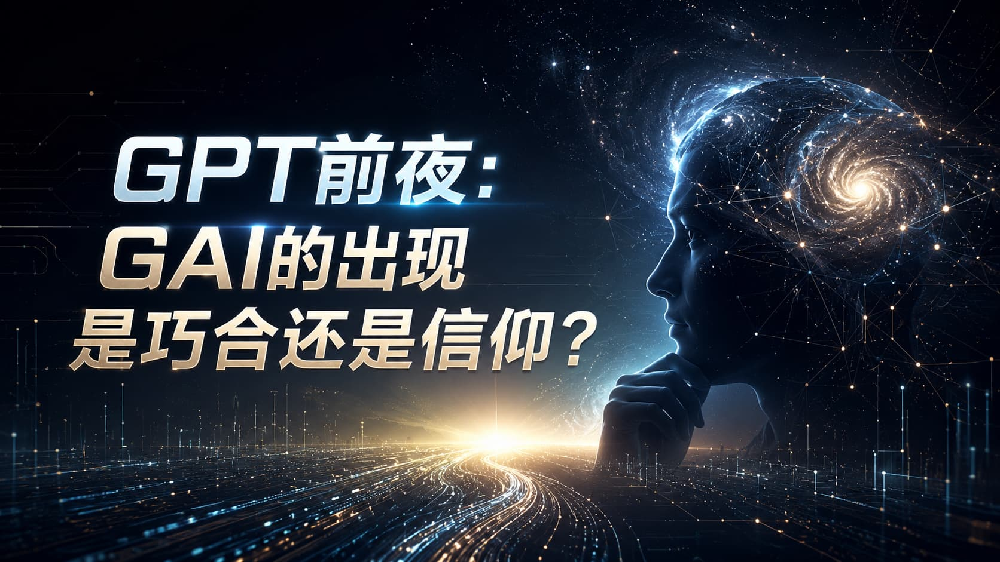

在科技史的叙事里，颠覆性的技术突破往往被包装成“苹果砸中牛顿”式的神话——几个天才在一个无聊的下午，意外敲下了一行改写人类命运的代码。

然而，当我们站在通用人工智能（AGI）的门槛上，回望 GPT 系列诞生的前夜，你会发现真实的历史远比神话更加残酷，也更加硬核。大语言模型的爆发，根本不是一场漫无目的的彩票中奖，而是一群“算力原教旨主义者”凭借着近乎偏执的信仰，完成的一场极端严谨的物理实验。

### 苦涩的教训与原教旨主义的直觉

时间拨回 2019 年。彼时的 AI 领域依然笼罩在一种“炼金术”的氛围中。全世界最聪明的学者们正趴在实验室里，煞费苦心地为神经网络设计各种精巧的模块：给视觉模型加一个注意力机制，给自然语言模型写一堆语法规则。大家试图用人类的聪明才智，去“教” AI 怎么理解世界。

但在 OpenAI 的内部，以 Ilya Sutskever 为首的核心团队却显得格格不入。他们是彻底的“算力原教旨主义者”。

这种直觉并非空穴来风。当年，强化学习泰斗 Rich Sutton 发表了一篇震撼业界的短文——《苦涩的教训》（The Bitter Lesson）。这篇文章像一记响亮的耳光，指出了一个残酷的真相：**在过去 70 年的 AI 发展史中，人类煞费苦心设计的那些带有“领域先验知识”的精巧算法，最终都会被“简单的算法 + 暴力的算力”无情碾压。**

人类的大脑有 860 亿个神经元和上百万亿个突触。面对这个数字，OpenAI 团队坚信一个朴素的哲学：不是深度学习的路线错了，而是我们的网络还不够大，喂的数据还不够多。

**“大力”一定能出奇迹。这就是他们的信仰。**

### 从炼金术到物理学：Scaling Laws 的降临

但信仰是昂贵的。当你要向投资人张口要 1 亿美金去买几万张英伟达显卡时，你不能只靠“我觉得它会变聪明”来立项。为了把这种信仰变成科学，OpenAI 必须找到那个隐藏在代码和硅片深处的真理。

2020 年，OpenAI 团队发表了一篇注定名垂青史的论文：《Scaling Laws for Neural Language Models》（神经语言模型的缩放法则）。

这不是一次随意的训练，而是一场精心设计的系统性实证实验。研究人员训练了一系列不同参数量（从几万到几十亿）的模型，投喂不同规模的数据，并记录下它们在预测任务中的误差（Loss）。

当他们把这些数据点画在对数坐标系上时，所有人都倒吸了一口凉气。

那些看似杂乱无章的数据点，完美地落在了一条极其平坦、严密的直线上。这不仅意味着模型性能与计算量、数据量、参数量呈现出完美的**幂律分布（Power-law）**，更意味着一件事：**深度学习从一门玄学，变成了可以精确计算的物理学。**

### 确定的未来与孤注一掷的豪赌

Scaling Laws 的发现，是 GPT 爆发前夜最重要的一声枪响。

它打破了科研的盲目性。OpenAI 的工程师们可以坐在白板前，精确地计算出：如果我今天砸下 1000 万美元的算力，模型明天的智商能达到什么水平。他们不需要再去碰运气，他们只需要一台足够大的推土机，顺着这条直线无情地推下去。

所以，GPT-3 的惊艳、GPT-4 的逻辑推理能力，在外界看来是不可思议的“智能涌现”，但在 OpenAI 内部，这不过是按部就班的工程兑现。他们比全世界任何人都提前知道，这艘飞船只要燃料足够，就一定能抵达预定的轨道。

### 结语：下一个前夜

回到最初的问题：GPT 的诞生是巧合吗？ 绝不是。它是一群极客先在心底构建了信仰，然后用最冷酷的数学和最暴力的算力，亲手去证实了这个信仰。

如今，历史的齿轮正在进行新一轮的咬合。大语言模型的 Scaling Laws 已经被探明，但对于具身智能（Embodied AI）**和**物理世界模型（World Models）而言，我们依然处于一片漆黑的荒野中。

如何跨越数字离散 Token 与真实三维物理世界的鸿沟？物理世界的数据是否也遵循一条完美的缩放曲线？

全世界的实验室都在寻找那条新的直线。或许在 10 年后，当通用机器人像今天的 ChatGPT 一样自然地走进我们的生活时，我们会再次回想起今天——这正是下一次 AGI 风暴的前夜。