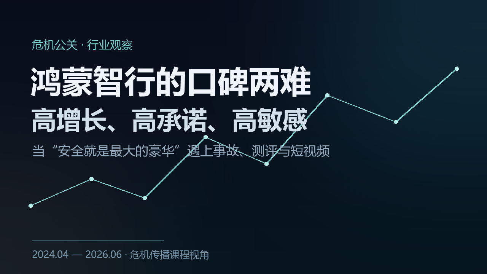

如果只看销量，鸿蒙智行这两年几乎可以用“顺风顺水”来形容。它从以问界为主，发展成覆盖问界、智界、享界、尊界、尚界的鸿蒙智能汽车技术生态联盟；2024 年全年交付 44.50 万辆，2025 年升至 58.91 万辆，2026 年前五个月又交付 19.16 万辆，截至 5 月底全系累计交付突破 139 万辆。官网上，“安全是最大的豪华”依然挂在最显眼的位置，旁边写着累计避免可能碰撞超过 405.68 万次。

但如果换一个视角，把镜头对准舆论场，你看到的是另一条曲线：问界 M7 山西事故、外部平台智驾测试争议、享界 S9 麋鹿测试风波，一次次把鸿蒙智行推到高关注度的风口浪尖。

这就是我想聊的那个矛盾——**为什么一个销量、口碑指标、产品评价都在持续向上的品牌，仍然反复遭遇舆情冲击？** 把它放进危机公关的框架里看，答案其实并不是简单的“变好”或“变差”，而是一个更耐人寻味的结构：**高增长、高承诺、高敏感，三者并存。**

### 一条上扬的曲线，和一条起伏的曲线

先把时间线铺开。过去两年，鸿蒙智行的口碑轨迹大致走过四个阶段：

- **2024 年春天**，问界 M7 高速事故，安全性遭遇质疑，这是近两年最具破坏力的单点危机；
- **2024 下半年到 2025 上半年**，借享界 S9、问界 M8 等新品上市，以及更强调交付、品控和服务的新叙事，完成了一轮修复；
- **2025 年夏天**，再度卷入外部平台的智驾测试争议；
- **2026 年**，又因享界 S9“麋鹿测试”短视频风波，进入“法务维权 + 高层回应”的新公关阶段。

与此同时，销量和品牌版图始终在上升：2024 年交付 44.50 万辆，2025 年 58.91 万辆，2026 年 5 月单月交付 4.61 万辆（46,122 台），1—5 月累计 19.16 万辆，累计交付已超 139 万辆。

把这两条曲线叠在一起，最值得注意的其实不是“销量够不够高”，而是“高增长是否已经同步转化为高韧性的声誉”。目前的答案是：**部分转化了，但还没有完全转化。** 销量、NPS 和产品奖项说明品牌的基本盘在增强；而事故、测评和短视频风波则说明，品牌的安全与智驾叙事仍处在高敏感区。

要理解这种敏感从何而来，得回到几个具体的案例里去看。

### 案例一：山西运城问界 M7 事故——最具破坏力的一次

2024 年 4 月 26 日 16:34 左右，山西运城侯平高速路段，一辆问界新 M7 Plus 在高速追尾养护车后起火，车上 3 人遇难。家属随后对 AEB 是否触发、救援效率、车门与安全气囊等提出一连串质疑。

官方的回应路径很“技术流”：4 月 28 日，AITO 表示事故时车速 115km/h，安全气囊正常打开，动力电池包特性正常，正在配合交警调查；随后又对技术问题做出说明，称涉事车为非华为 ADS 高阶智驾版本，AEB 工作范围为 4—85km/h，事故时速超出触发范围。第一财经等媒体重点报道了家属质疑与企业说法之间的张力，澎湃则发布了含家属素材的视频报道。

舆情体量不小。第三方监测文章显示，截至 4 月 28 日 15 时，相关信息量约 6,208 条，其中公众号信息占 43.75%，微博是第二大来源；“问界回应车辆起火司乘 3 人遇难”话题在微博阅读量约 6,696.5 万、讨论约 2.1 万。

这件事之所以成为口碑拐点，不只因为伤亡严重，更因为它直接冲击了鸿蒙智行最核心的品牌承诺——安全与智能辅助。对危机公关而言，问题不只在于“技术边界有没有说清”，还在于企业在最初几个小时里能不能**同时**给出三样东西：情绪安抚、事实框架、后续行动路径。仅以参数回应，往往会被受众理解成“解释”，而不是“承担”。

### 案例二：问界 M8 与“认可才提车”——一次教科书式的修复

如果说 M7 事故是危机，那么问界 M8 的上市就是一次漂亮的修复型案例。

2025 年 3 月 20 日前后预热预售，4 月 16 日正式上市，4 月 20 日在重庆赛力斯超级工厂开启首批交付。数据相当硬：预售 84 小时订单突破 7 万；上市后 1 小时大定突破 2 万，72 小时大定突破 4.4 万；杰兰路研究援引官方披露称，截至 2025 年 5 月 20 日，问界 M8 大定已突破 8 万。

但真正值得琢磨的是公关重心的转移。这一次，官方不再只是讲参数，而是强调“智造体系、质量体系、测试体系、服务体系”的升级，把“认可才提车”的工厂验收模式常态化——让用户直接参与终检验收。产品页同时突出更高的主动安全能力：AEB 支持速度范围提升至 4—150km/h，全车碰撞断电后车门仍可打开。

对比 2024 年事故后偏技术化的辩解，这一次的逻辑变了：**它不是靠一篇声明扭转口碑，而是靠“订单热度 + 工厂开放 + 安全升级叙事 + 交付体验”四者联动来恢复信任。** 这说明，在高度争议的行业里，最有效的声誉修复往往不是“喊安全”，而是“把安全和可靠做成一个可被用户旁观、检验与转述的流程”。

### 案例三：智驾测试争议与“不予置评”——数据赢不了情绪

2025 年 7 月，外部平台懂车帝推出节目《懂车智炼场》，以 15 个高风险城市/高速事故场景测试了近 40 款车型。报道显示，鸿蒙智行阵营中，智界 R7 在城市场景通过 7 项，问界 M7/M8/M9 均通过 5 项；高速场景中，智界 R7 与问界 M9 各通过 3 项，问界 M7 通过 2 项，问界 M8 通过 1 项。

7 月 25 日，鸿蒙智行回应“已看到某平台所谓‘测试’，不予置评”，并同步发布 2025 年上半年辅助驾驶报告，称半年内辅助驾驶总里程 16.7 亿公里、累计避险超 200 万次。

这里暴露出鸿蒙智行公共沟通里一个典型矛盾：**面向既有车主，“里程、活跃度、避险次数”很有说服力；面向中立公众，仅说“不予置评”却容易被理解成回避问题。** 危机传播并不总是“你拿出更多数据就会赢”，因为在强争议议题里，公众首先追问的往往不是“你平时多强”，而是“这一次为什么失灵、测试是否公允、我该如何理解边界”。你越是用“我平时很强”去回答“你这次为什么不行”，落差感反而越明显。

### 案例四：享界 S9 麋鹿测试风波——一场公信力危机

2026 年，性质又变了。这一次不是产品事故，而是一场公信力危机。

网络上出现享界 S9 与宝马 5 系、奥迪 A6L、奔驰 E300L 的“麋鹿测试”对比视频，画面里享界 S9 姿态夸张甚至疑似失控。3 月 29 日，享界汽车法务部发声，称相关测试存在恶意、刻意操控，并非按国标进行的麋鹿测试；同时披露，经中汽中心认证，享界 S9 成绩为 84.1km/h、S9T 为 83.3km/h，并对涉嫌商业诋毁的一些 MCN 账户采取维权行动。4 月 26 日，余承东又在直播中称，测试存在“放气、松轮胎螺丝”等人为操作——不过这属于企业单方说法，公开主流资料中并未见独立机构完成同等强度的外部复核。

官方这次采取“两步回应”：先法务声明，再高层直播发声。媒体评论普遍认可“维权的必要性”，但也指出，如果想真正化解疑虑，仍需更公开、可复现的第三方技术拆解。

值得一提的是，当时享界 S9 的销量基盘较小，舆情对品牌形象的边际冲击可能更大。

与 2024 年的 M7 事故相比，这更像是“公信力危机”而非“产品事故危机”。它指向高端品牌在短视频时代面临的新难题：**外部测试、二创剪辑和平台算法，可能让“一个片段”先于“完整事实”完成定性。** 所以享界 S9 风波其实不是孤立个案，而是鸿蒙智行在高端化路上必须补的一课——不仅要会做产品，还要会定义一套能被公众普遍接受的“证据标准”。

### 三种声音，三种叙事

把不同立场的观点摆在一起，分歧点其实非常清晰。

**支持的一方**看重产品体验和车主推荐。J.D. Power 的「2026 中国新能源汽车产品魅力指数研究」中，问界 M7（增程式）拿下“中型插电混动增程式 SUV”第一，问界 M9（增程式）拿下“豪华插电混动 SUV”第一。杰兰路的 NPS 研究里，问界品牌 NPS 为 74.8，旗舰车型问界 M9 以 85.2 位列车型总榜第一，且在行业整体 NPS 下行的背景下仍保持领先。汽车之家的车主样本中，问界 M8 综合评分 4.57，正向标签集中在“舒适性好”“内饰材质满意”“加速强劲”“行驶稳定性不错”。

**批评的一方**更在意宣传边界与第三方可验证性。同济大学汽车学院教授朱西产指出，当前所谓高阶智驾本质仍属于 L2+ 辅助驾驶，面对夜间施工等复杂场景仍有明显短板，“准 L3”“L2.9”等表述并非官方分级，带有营销色彩，容易误导消费者。北京工商大学学者王静、林刚则从公关角度提醒：新能源汽车危机公关若表现出慢回应、傲慢、不重视人文关怀，会引发信任危机、异化品牌形象、削弱品牌认同；有效做法应是多主体叙事、兼顾情感利益、真诚沟通。用户侧也有杂音——汽车之家享界 S9 样本综合评分 4.56，但高频负向标签已出现“转向稳定性差”“续航里程短”“车机反应慢”。

**中立的一方**不断把讨论拉回一个基本前提。J.D. Power 中国区的王甡认为，2026 年产品魅力指数大幅提升，增长主要来自“安全感”增强，竞争重心正从价格与配置转向体验与用户价值——对鸿蒙智行而言，真正的竞争不是流量，而是体验兑现。北航教授鲁光泉则强调，目前消费者实际使用的仍是 L2 级系统，驾驶人必须全程不离眼、不离手地接管。

三种叙事持续碰撞，恰恰就是鸿蒙智行口碑波动的本质来源。支持者说“产品很好、车主愿意推荐”，批评者说“你别把话说太满、拿出第三方证据”，中立者说“现在还是辅助驾驶时代，谁都不能把公众期待抬到接近自动驾驶的高度”。

### 为什么是“高敏感”？

把这些案例串起来看，我越来越觉得，鸿蒙智行的口碑曲线并不是简单的“先跌后升”，而是一个“高增长—高承诺—高敏感”的结构。

增长端的数据非常亮眼，产品基础盘其实是强的。但鸿蒙智行从来不是一个只靠“普通产品力”竞争的品牌——它的核心叙事一开始就定得很高：安全是最大的豪华，ADS 更类人，品牌一路上探 30 万、40 万、50 万乃至百万级市场。这种叙事能迅速完成品牌抬升，但也会**同步抬高外界的检验标准**。

于是矛盾出现了：M7 事故的冲击，不只来自事故本身，而是因为公众天然会把它和品牌既有的安全宣传绑在一起；智驾测试争议和麋鹿测试风波也是如此——受众真正不满的，不是“某个项目没通过”，而是“你曾经说得那么强，为什么现在看上去不稳”。这本质上是**“承诺—体验”落差**触发的声誉波动。承诺定得越高，落差被放大的倍率就越大。

再叠加传播机制，敏感度进一步被放大。社交媒体正在把汽车危机从“专业讨论”改造成“全民围观”——它在危机里承担着“吹哨”“放大”“信息瀑布”“舆论引爆”的节点功能。鸿蒙智行遇到的几个核心节点，事故视频、家属质疑、测试节目、短视频对比，全都符合这个套路：先由片段触发情绪，再由算法放大，再由媒体和专家补充解释，最后逼着企业在高度对立的情绪环境里给出回应。**企业如果只讲技术、不讲情绪，或者只讲态度、不讲证据，都很难真正止损。**

### 那该怎么办：建立“三层证据链”

平心而论，鸿蒙智行的公关已经在进步。2024 年事故后偏技术化的释疑，到 2025 年问界 M8 更强调“可旁观的制造透明”和“认可才提车”，这是把公关前置成了体验设计；2026 年享界 S9 风波里，企业也不再只是客服口径，而是用法务声明、认证数据与高层发声去联合争夺议题。

但短板依旧存在：其一，初始回应对受害者情绪的安抚仍显不足，容易给外界“企业先自证、后共情”的观感；其二，过度依赖自有数据与内部叙事，第三方共同验证偏少；其三，“不予置评”或强烈控诉式表态，对核心粉丝有效，对中立公众未必；其四，辅助驾驶的边界虽然在官网已明确写成“辅助驾驶”，但外部市场记忆不会自动同步，去神话化的传播仍需持续做。

所以，如果从危机公关的角度提一条最重要的建议，我认为不是“再做更响的传播”，而是建立一条**“三层证据链”**：

1. **同理心证据**——重大事故后的黄金 2—4 小时内，先完成对伤亡者、家属与用户的安抚承诺；
2. **事实证据**——24 小时内公布事件时间轴、已知数据边界与后续调查方案；
3. **第三方证据**——72 小时内引入权威检测机构、专家或跨平台原始数据说明，避免公关停留在“企业自说自话”。

配套还要做两件事：把“辅助驾驶边界教育”制度化，减少夸张式术语；把价格、焕新、OTA、事故售后全部纳入统一的用户预期管理，避免“被背刺感”侵蚀推荐意愿。

这套机制甚至可以被量化成一组可考核的指标（以下为建议值，并非官方现行 KPI）：

| 指标 | 定义 | 建议值 |
| --- | --- | --- |
| 首次公开回应时长 | 从全国性传播形成到品牌首次正式发声 | 重大安全事件 ≤2 小时；一般测试争议 ≤4 小时 |
| 首日事实完备率 | 24 小时内对“时间、地点、车型、已知数据、后续流程”五项的覆盖度 | ≥80% |
| 第三方参与率 | 72 小时内是否引入权威机构、专家或原始数据复核 | 每次重大事件 ≥1 家机构 + 1 位专家 |
| 负面峰值回落时间 | 从负面声量峰值到回落 50% 所需时间 | ≤5 天 |
| 官方问答覆盖率 | 对高频问题形成 FAQ 并逐条回应的完成度 | ≥90% |
| 事件后品牌 NPS 变化 | 事件后一个季度 NPS 较前一季度变化 | 控制在 -3 分以内；恢复期目标 +5 分 |
| 车主服务满意度 | 涉事用户对沟通、救援、修复、赔付流程的满意度 | ≥85% |
| 车主转述率 | 事件后真实车主产生的正向/中性复盘内容占比 | ≥30% |
| 纠错透明度 | 是否公布测试复现、OTA 修复、整改前后差异 | 重大争议 100% 公布 |
| 口径合规率 | 对外是否统一使用“辅助驾驶”，避免模糊或夸张术语 | 100% |

### 写在最后

需要说清楚的是：鸿蒙智行的口碑并没有塌掉。相反，它仍有很强的销量、车主推荐和产品认可作为支撑。但它也远没有走到“高枕无忧”的阶段。

我的体会是，**越是高端化、越是爆品化、越是拥有强势创始人 IP 和技术话语权的品牌，越需要克制、透明、可核验的危机公关。** 因为话语权越大，公众的容错率反而越低。

鸿蒙智行的下一次胜负，未必取决于能不能再多卖一万辆车，而更可能取决于：当下一次事故、测试或争议到来时，它能不能把“安全就是最大的豪华”这句口号，真正变成一套**被公众信任的证据体系**。

口号说服的是已经相信你的人，证据说服的才是还在观望的人。

