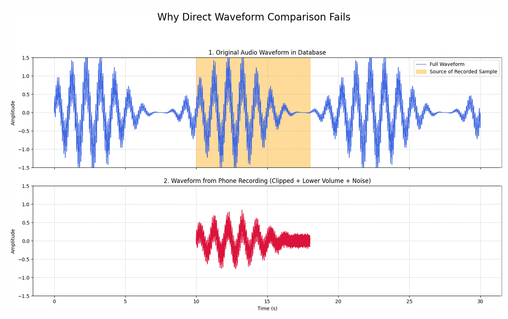
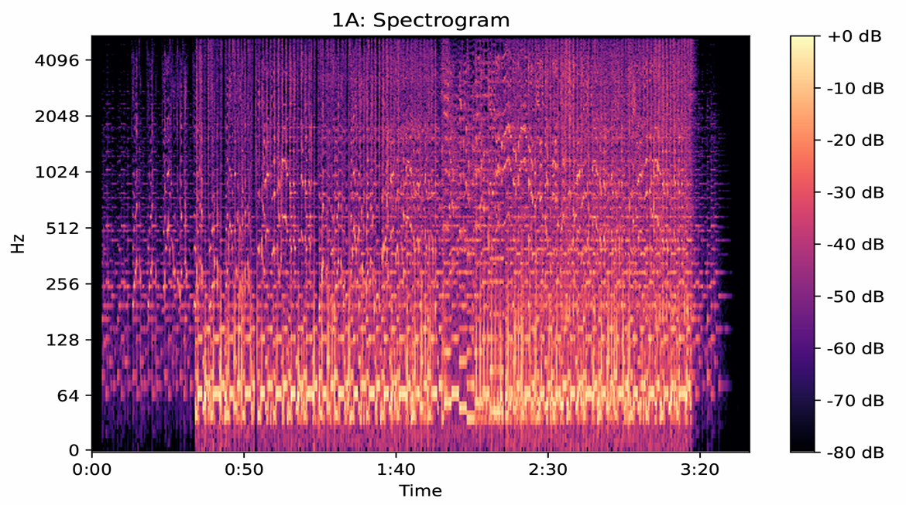
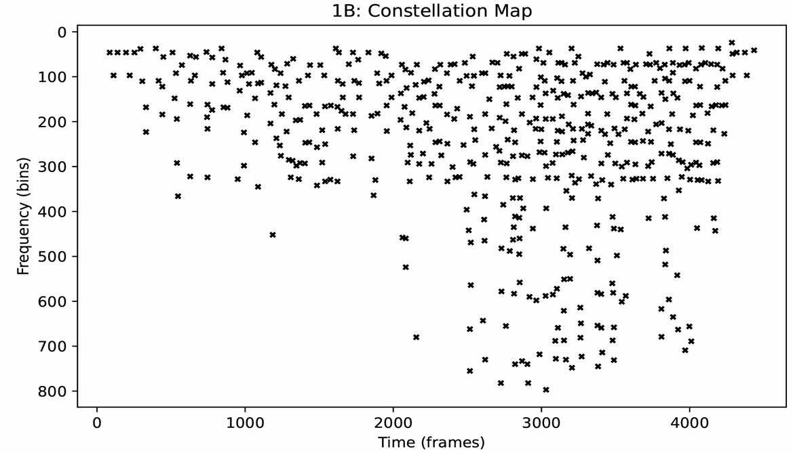
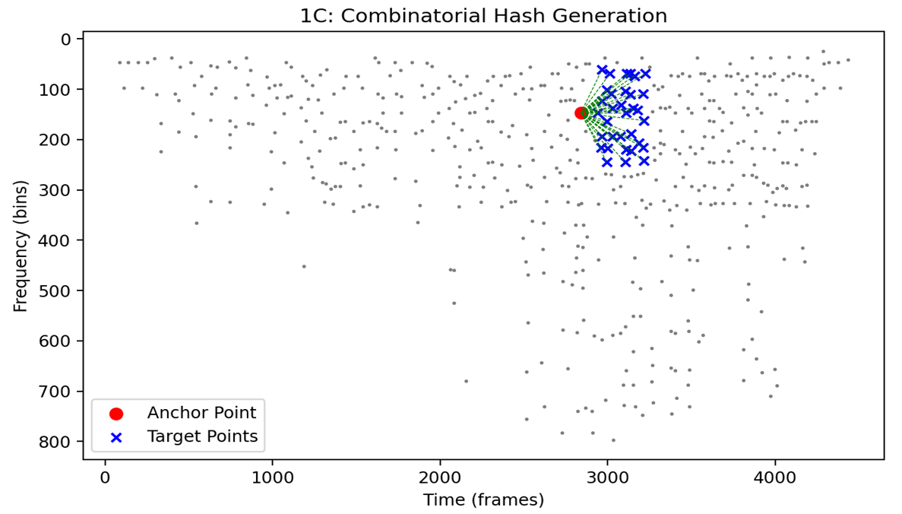
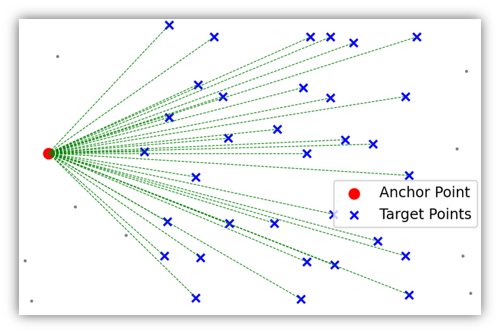

可执行文件下载[Release SongRecognPro · Allen-cubber/zzx](https://github.com/Allen-cubber/zzx/releases/tag/v1.1)
### **1. 引言与问题定义**

在海量数字音乐库中快速检索与识别未知的音频片段，是一项在版权监控、媒体检索和消费娱乐领域具有重要应用价值的技术。传统的基于波形比对或元数据匹配的方法，在面对真实世界中音频信号的复杂性时，往往表现出较低的鲁棒性。

一个典型的识别场景所面临的核心挑战包括：
*   **时间局部性：** 查询样本通常仅为完整音轨的任意一个时间片段。
*   **幅度失真：** 录音音量与原始音量存在任意比例的差异。
*   **噪声干扰：** 环境噪声（如人声、环境声）与目标信号线性叠加。
*   **信道失真：** 信号经过播放设备、空间传播和录音设备后，其频谱特性会发生改变。

因此，本项目的目标是实现一种能够克服上述干扰的、高效且可扩展的音频识别算法。其核心思想是为音频内容提取一种紧凑、稳定且具有高区分度的特征表示——即“声学指孕”。

### **2. 核心算法流程**

我们的实现方案遵循了 Avery Wang 在其经典论文中提出的框架，主要包含以下四个步骤：

#### **2.1. 时频分析：短时傅里叶变换 (STFT)**

原始的一维时域波形信号并未显式包含频率随时间变化的信息。为了获取这一关键特征，我们采用短时傅里G特变换（STFT）将信号从时域映射到时频域。STFT通过对信号进行加窗、分帧处理，并对每一帧进行快速傅里叶变换（FFT），最终生成二维的**频谱图（Spectrogram）**。

*(图1A: 音频信号的频谱图表示)*

频谱图以热力图的形式展示了信号的能量在时间和频率维度上的分布。其中，X轴代表时间，Y轴代表频率，颜色亮度则对应于特定时频单元的能量幅值。该表示方法为后续的特征提取提供了坚实的基础。

#### **2.2. 特征提取：频谱峰值与星座图**

频谱图包含了大量的冗余信息，且对噪声敏感。为了提高指纹的鲁棒性与紧凑性，我们仅提取频谱图中的**能量局部峰值点（Spectral Peaks）**。这些峰值点通常对应于音乐中能量集中且相对稳定的时频结构，如音符的基频或泛音成分，因此对噪声和失真具有较好的抗干扰能力。

通过设定能量阈值和局部邻域最大值约束，我们从密集的频谱图中筛选出稀疏的峰值点集合。将这些峰值点的时频坐标 `(t, f)` 进行可视化，便构成了所谓的**“星座图”（Constellation Map）**。

*(图1B: 由频谱峰值点构成的星座图)*

星座图是原始音频的一种高度抽象且鲁棒的表示，它构成了声学指纹的核心。

#### **2.3. 指纹生成：组合哈希算法**

单个星座点的时频坐标并不具备足够的唯一性。为了构建高区分度的指纹，我们采用了**组合哈希（Combinatorial Hashing）**策略。该策略的核心思想是利用**成对特征点之间的相对关系**来编码信息。

具体实现如下：
1.  遍历星座图中的每一个峰值点，将其作为**锚点（Anchor Point）**。
2.  为每个锚点定义一个时空上的“目标区域”（Target Zone）。
3.  将锚点与其目标区域内的其他峰值点（**目标点，Target Points**）进行配对。

*(图1C: 从锚点到目标区域内点的配对过程)*

对于每一个 `(锚点, 目标点)` 对，我们提取三个关键的不变量：
*   锚点的频率 `f1`
*   目标点的频率 `f2`
*   两点之间的时间差 `Δt = t2 - t1`

其中，时间差 `Δt` 的引入赋予了指纹对时间平移的**不变性**，从而解决了“时间局部性”的挑战。

最后，通过一个确定性的哈希函数 `H`，将这三个参数 `(f1, f2, Δt)` 映射为一个固定长度的整数哈希值。
`Hash = H(f1, f2, Δt)`
#### **2.4. 数据库索引与匹配**

生成的哈希值被用于构建一个高效的索引数据库。数据库的结构是一个键值对哈希表：
*   **Key:** 哈希值 `Hash`
*   **Value:** `(歌曲ID, 锚点在原曲中的绝对时间 t1)`

在识别阶段，查询音频经过同样的流程生成一系列哈希值。通过在数据库中检索这些哈希值，我们可以得到一组候选匹配项 `(Song ID, t1)`。如果大量匹配项指向同一首歌曲，并且它们的相对时间关系与查询样本中的一致，即可确认匹配成功。

### **3. 结论**

本项目通过Python及相关科学计算库，成功实现并验证了一套基于声学指纹的音频识别算法。实验结果表明，通过将音频信号转换为鲁棒的频谱峰值星座图，并利用组合哈希构建具有高区分度和时间不变性的指纹，该算法能够有效应对真实环境下的噪声和失真，为构建大规模、高效率的音频检索系统提供了可行的技术路径。

未来的工作可集中于优化峰值提取策略、设计更高效的哈希函数以及探索在不同类型音频（如语音、环境声）中的应用潜力。