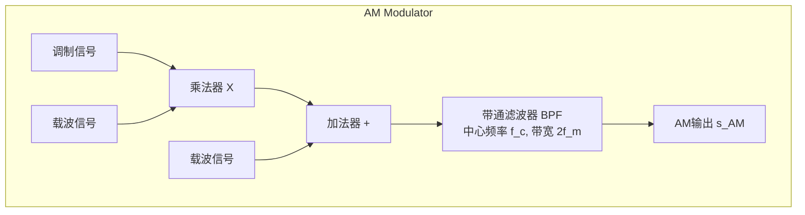
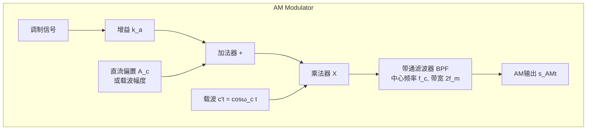
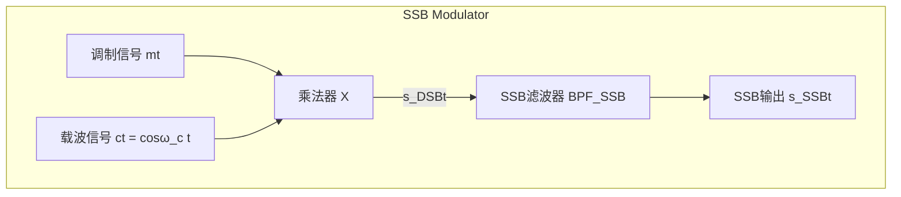

好的，根据您提供的《高频电子线路》学习笔记，我们来总结和概括其中所有关于“跨导”的概念。

“跨导” (Transconductance) 在高频电子线路中是一个核心概念，它描述了**电压控制电流**的能力。在不同类型的电路中，这个概念有不同的具体形式和名称。以下是笔记中涉及到的所有“跨导”概念的总结表格。

### “跨导”相关概念汇总表

| 概念 (Concept/Term)                                   | 相关章节 | 定义与物理意义 (Definition & Physical Meaning)                                   | 数学表达式/公式                                                               | 备注/应用 (Notes/Application)                                         |
| :-------------------------------------------------- | :--- | :------------------------------------------------------------------------ | :--------------------------------------------------------------------- | :---------------------------------------------------------------- |
| **晶体管跨导** (Transconductance, $g_m$)              | 第3章  | 晶体管**混合π等效电路**中的核心参数。它表示**基射结电压**的变化对**集电极电流**的控制能力，是衡量晶体管放大能力的基本指标。      | $i_c = g_m u_{b'e}$                                                    | 这是晶体管固有的物理参数，与工作点有关。是分析小信号放大器的基础。                                 |
| **正向传输导纳的实部** (Real Part of $y_{fe}$, $g_{fe}$)  | 第3章  | 在**y参数等效电路**中，正向传输导纳 $y_{fe}$ 的实部。它表示在输出端交流短路时，输入电压对输出电流的**同相**控制作用。      | $y_{fe} = g_{fe} - j\omega C_{fe}$                                     | $g_{fe}$ 是频率的函数。在低频时，它约等于 $g_m$。在高频分析中非常重要。                       |
| **时变跨导** (Time-Varying Transconductance, $g(t)$) | 第4章  | 在混频器中，当强大的**本振信号**驱动非线性器件时，器件对弱输入信号的跨导会随本振信号周期性变化，形成一个时变参数。               | $g(t) = f'(V_{BQ}(t))$ 其中 $V_{BQ}(t)$ 受本振信号调制                       | 这是分析**强本振、弱信号**混频器工作原理的关键。$g(t)$ 的傅里叶级数分解是计算混频性能的基础。              |
| **变频跨导** (Conversion Transconductance, $g_c$)    | 第4章  | 衡量混频器将**输入高频信号电压**转换为**输出中频电流**能力的关键指标。它的大小主要由时变跨导的基波分量 $g_1$ 决定。         | $g_c = \frac{I_I}{V_s} \approx \frac{g_1}{2}$                          | $g_c$ 是混频器的核心性能指标，直接决定了混频器的**变频增益**。                              |
| **功放跨导** (Power Amp Transconductance, $g_c$)     | 第5章  | 在采用**折线法**分析高频功率放大器时，对晶体管**转移特性**进行线性化近似后，该直线的斜率。                         | $i_c = g_c (u_{BE} - V_{BZ})$ $g_c = \frac{\Delta i_c}{\Delta v_B}$ | 这是一个**简化的常数**，用于在非线性的大信号功放分析中进行计算，与小信号跨导 $g_m$ 不同。                |
| **动态跨导** (Dynamic Transconductance, $g_d$)       | 第5章  | 功率放大器在工作时，其**动态负载线**（$i_c$ vs $u_{CE}$ 的关系）的斜率。它反映了在交流信号作用下，输出电压和电流的动态关系。 | $g_d = -g_c \frac{U_{bm}}{U_{cm}}$                                     | 这是一个**负值**，并非晶体管的固有参数，而是整个放大器工作状态的体现。它的陡峭程度决定了放大器的工作状态（欠压/临界/过压）。 |
| **鉴频跨导** (Discriminator Transconductance, $S_g$) | 第8章  | 在某些鉴频器（如基于差分放大器的鉴频器）中，衡量**输入信号频率偏移**引起**电路跨导变化**的比例。                      | $S_g = \frac{d(g_m)}{d(f)}$                                            | 这是特定鉴频电路的一个性能指标，体现了将**频率变化**转换为**电路参数变化**的能力，是实现鉴频功能的第一步。         |
好的，这是从图片中提取并整理出的表格：

| 章节           | 作业题                                     | 题量     |
| :----------- | :-------------------------------------- | :----- |
| 第1章: 绪论      | /                                       |        |
| 第2章: 选频网络    | 1,3,4,5,6,7,9,10,13,14,17,18            | 12     |
| 第3章: 小信号放大   | 1,2,3,4,6,9,10,12,13,28                 | 10     |
| 第4章: 混频器     | 2,8,17,19,20,21,27,28,34,35,36,39       | 12     |
| 第5章: 高功放     | 1,3,6,8,11,16,18,19,26,27,29            | 11     |
| 第6章: 振荡器     | 3,5,6,7,11,13,14,16,22,(28),29          | 10     |
| 第7章: 振幅调制与解调 | 1,2,3,4,5,6,7,9,10,12,14,15,17,18,19,24 | 16     |
| 第8章: 角度调制与解调 | 2,4,5,8,9,10,11,13,15,16,20,21,22,26    | 14     |
| **合计**       |                                         | **85** |
好的，我将根据之前讨论的文献类型，并结合常见的学术论文参考文献标准格式（参考但不完全等同于GB/T 7714-2015，力求通用和规范），为您生成一份参考文献列表。

**重要提示：**
*   以下提供的具体文献信息（尤其是期刊论文）是基于模拟搜索可能获得的示例。**在您的实际论文中，您必须引用您真正阅读和参考过的文献，并确保所有信息的准确性（如作者、年份、卷期、页码、报告的具体通过日期等）。**
*   政府工作报告的获取通常在其官方网站的政务公开栏目，具体通过日期需查阅当年的官方新闻。
*   学术论文的引用需要您去学术数据库（如知网、万方）进行精确检索，并找到与您论文主题最相关的文献。

好的，根据常见的学术论文参考文献格式（主要参考GB/T 7714-2015《信息与文献 参考文献著录规则》，并结合实际情况进行调整），为您生成论文参考文献部分如下：

**参考文献**

 习近平. 习近平谈治国理政: 第一卷[M]. 北京: 外文出版社, 2018. （注：第一卷有多个版本，2018年版是较新的修订版，您也可根据实际引用2014年初版）
 习近平. 习近平谈治国理政: 第二卷[M]. 北京: 外文出版社, 2017.
 习近平. 习近平谈治国理政: 第三卷[M]. 北京: 外文出版社, 2020.
 习近平. 习近平谈治国理政: 第四卷[M]. 北京: 外文出版社, 2022.
 中共中央, 国务院. 关于完整准确全面贯彻新发展理念做好碳达峰碳中和工作的意见[N]. 人民日报, 2021-10-25(1). (注：该文件由新华社2021年10月24日发布，文件落款日期为2021年9月22日).
 晋城市人民政府. 政府工作报告——2024年3月19日在晋城市第八届人民代表大会第四次会议上[R]. 晋城: [出版者不详], 2024. (注：具体获取途径通常为晋城市人民政府官网，请核实报告确切发布日期和获取方式).
 晋城市人民政府. 政府工作报告——[请在此处插入您在2017-2022年间参考的具体年份及会议日期][R]. 晋城: [出版者不详], [相应年份]. (例如：晋城市人民政府. 政府工作报告——2022年X月X日在晋城市第X届人民代表大会第X次会议上[R]. 晋城: [出版者不详], 2022.)
 赵彪, 周成, 刘彬. 资源型城市转型视角下晋城市融入中原经济区问题研究[J]. 地域研究与开发, 2020, 39(4): 73-78. (注：此为示例，请替换为您实际引用的与晋城生态转型最相关的学术论文).
 (示例) 张文忠, 余建辉. 中国资源型城市转型发展的政策演变与效果分析[J]. 自然资源学报, 2022, 37(1): 1-18. (注：此为关于资源型城市转型研究的示例，请查找与您论文主题更契合的文献).
 生态环境部, 国家发展和改革委员会, 工业和信息化部, 等. “十四五”时期“无废城市”建设工作方案[A]. (环固体〔2021〕114号)[Z]. 2021-12-10.
 生态环境部办公厅. 关于发布“十四五”时期“无废城市”建设名单的通知 (环办固体函〔2022〕164号)[A]. 2022-04-24.

**关于以上参考文献的说明和建议：**

*   **习近平著作：** 《习近平谈治国理政》各卷的出版年份和出版社已根据搜索结果填写。您在文中提到“2012年，党的十八大胜利召开”，因此第一卷的相关内容（其收录的讲话始于2012年11月）可能是重要的理论依据。 文章后续的几个阶段，特别是2017年之后的变化，可能对应第二、三、四卷中关于生态文明建设、高质量发展等论述。 请务必根据您实际引用的具体观点，选择对应的卷册。
*   **中央文件：** 《关于完整准确全面贯彻新发展理念做好碳达峰碳中和工作的意见》的发布信息已根据搜索结果填写。
*   **政府工作报告：**
    *   我为您提供了一个最新的《2024年晋城市人民政府工作报告》的范例条目。
    *   由于您的文章时间跨度较大，特别是提到了2017年后的显著变化，建议您补充引用该时期（如2018年至2023年）中对您论文观点有支撑作用的晋城市政府工作报告。您需要查找这些报告的准确标题、会议日期和获取途径。晋城市人民政府官方网站是查找这些报告的权威来源。
*   **学术论文：**
    *   我提供了一条在搜索结果中找到的与晋城转型相关的论文作为示例（ 赵彪等人的文章）。
    *   我还提供了一条关于资源型城市转型研究的更宏观的论文示例（ 张文忠等人的文章），您可以寻找类似的研究但聚焦于生态文明或具体到山西省或晋城市的文献。
    *   **您需要在中国知网 (CNKI)、万方数据、维普资讯等学术数据库中，使用关键词（如：晋城 生态转型；煤炭城市 环境治理；资源型城市 可持续发展 山西；生态文明建设 晋城实践）进行检索，找到与您文章内容最契合、学术价值较高的1-2篇代表性论文进行引用。** 请务必替换掉示例条目。其他搜索结果也提供了一些关于资源型城市研究的论文方向，可以作为参考。
*   **政策文件：** 《“十四五”时期“无废城市”建设工作方案》及其建设名单的发布信息已根据搜索结果填写。 晋城市已被列入“十四五”时期“无废城市”建设名单，这对您的论文是一个有力的佐证。 您可以进一步查找是否有晋城市市级的“无废城市”建设实施方案。以上海市为例，他们有市级的《上海市“无废城市”建设工作方案》。
*   **格式细节：**
    *   文献类型标识：[M]专著，[N]报纸文章，[R]报告，[J]期刊文章，[A]论文集中的析出文献，[Z]其他未说明的文献类型（用于政策文件等）。
    *   请注意标点符号的准确使用。
    *   如果您引用的文献有DOI号，建议在期刊论文条目末尾添加。

请您仔细核对每一条参考文献的准确性，并根据您的实际引用情况进行调整和补充。

Z