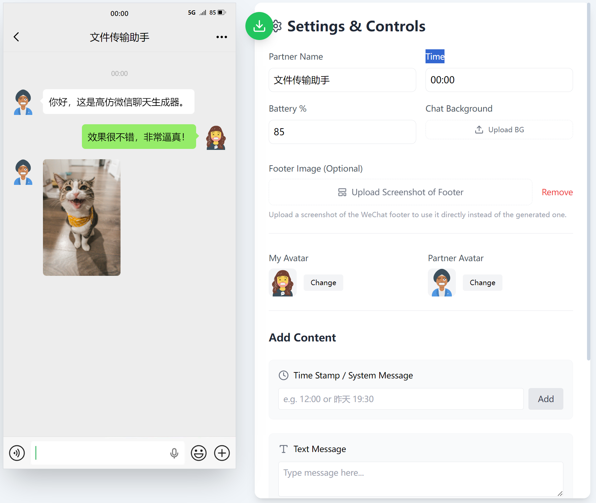

这是一个基于 React 和 Tailwind CSS 构建的高仿微信聊天界面生成器。它可以帮助用户制作逼真的微信聊天截图，用于娱乐、故事创作或设计原型演示。

* [安装包下载链接](https://github.com/Allen-cubber/wechat-gen/releases/download/v1.0.0/Setup.1.0.0.exe)

* [源代码](https://github.com/Allen-cubber/wechat-gen/archive/refs/tags/v1.0.0.zip)

## ✨ 主要功能

*   **高保真 UI 复刻**：精确还原 iOS 版微信的界面细节，包括状态栏、气泡样式、字体排版和图标。

*   **完全自定义**：

    *   **全局设置**：修改对方昵称、当前时间、电池电量及信号状态。

    *   **个性化头像**：支持上传“我”和“对方”的头像。

    *   **背景替换**：支持自定义聊天背景图片。

    *   **底部栏定制**：支持上传自定义的底部截图（如输入法状态）。

*   **多类型消息支持**：

    *   📩 **文本消息**：支持发送和接收文本，自动气泡布局。

    *   🖼️ **图片消息**：支持发送和接收图片。

    *   ⏰ **时间戳**：可插入任意时间节点。

*   **交互式编辑**：

    *   **实时预览**：所见即所得。

    *   **消息删除**：鼠标悬停在消息上即可显示删除按钮。

*   **高清导出**：集成 `html2canvas`，支持一键生成高清 PNG 截图，并解决了常见的滚动条错位和字体渲染问题。

  

## 🛠️ 技术栈

  

*   **Frontend Framework**: [React 19](https://react.dev/)

*   **Styling**: [Tailwind CSS](https://tailwindcss.com/)

*   **Icons**: [Lucide React](https://lucide.dev/)

*   **Screenshot Engine**: [html2canvas](https://html2canvas.hertzen.com/)

  

## 🚀 快速开始 (本地开发)

  

该项目是一个单页 React 应用。

  

### 1. 环境准备

  

确保你已经安装了 [Node.js](https://nodejs.org/)。

  

### 2. 安装依赖

  

由于这是一个纯前端项目，通常建议使用 Vite 来启动：

  

```bash

# 如果你是从零创建环境

npm create vite@latest wechat-gen -- --template react-ts

cd wechat-gen

npm install

npm install lucide-react html2canvas

# 确保安装 Tailwind CSS (参考 Tailwind 官方 Vite 指南)

```

  

### 3. 运行项目

  

将本项目代码（`index.tsx`, `index.html` 等）放入你的源码目录后：

  

```bash

npm run dev

```

  

### 4. 构建部署

  

```bash

npm run build

```

  

## 📖 使用指南

  

1.  **左侧预览区**：显示当前的手机界面效果。

2.  **右侧控制面板**：

    *   **Global Settings**：设置对方名字、时间、电量。

    *   **Avatars**：点击 Upload 上传双方头像。

    *   **Add Content**：输入文字或选择图片，点击 "Receive" (对方发送) 或 "Send" (我发送)。

    *   **Download**：点击底部下载按钮，同意免责声明后即可保存图片。

  

## ⚠️ 免责声明 (Disclaimer)

  

**请认真阅读：**

  

本工具仅供**娱乐、教育和设计原型**使用。

  

*   🚫 **严禁**用于伪造证据、欺诈、散布谣言或任何非法用途。

*   🚫 **严禁**用于恶意冒充他人。

*   使用者需对使用本工具生成的图像产生的所有后果承担全部责任。

*   开发团队不对因使用本工具而导致的任何直接或间接损失负责。

  

---

Made with ❤️ by React