## 1. 选题背景

随着物联网技术与生物医学工程的不断发展，人们对个人健康管理和运动监测的关注度日益增强，尤其在便携式医疗和日常健康监护的应用场景中，设备的**小型化、多功能化及无线化**已成为主要趋势。传统的健康检测设备往往面临功能单一、依赖有线连接导致使用不便、以及基于通用微控制器（MCU）在处理复杂生理信号滤波时实时性不足等问题，尤其是在面对需要同时处理多路传感器数据时，常规串行处理方法难以在低功耗下满足高精度的实时监测需求。本设计的一个关键挑战在于如何利用**FPGA的并行处理优势**，在硬件层面实现对**MAX30102**微弱生理信号的去噪与特征提取，并结合**MPU6050**运动数据，通过蓝牙实现稳定高效的无线传输。

---

## 2. 设计任务

此次课程设计任务为基于正点原子FPGA新起点V2开发板，实现便携式多参数**智能健康检测手环系统**。我们的选题主要需求包括**多路传感器数据采集**（I2C协议）、**数字信号处理**以及**多终端数据显示**（本地数码管与无线蓝牙）。新起点FPGA开发板拥有丰富的IO扩展接口，能够方便地连接MAX30102心率血氧模块与MPU6050运动姿态模块，且板载有6位共阳极数码管、LED指示灯及蜂鸣器，完全符合我们的选题需求。因此，本项目利用扩展接口驱动传感器采集生理与运动数据，通过板载数码管进行本地实时显示，并利用UART串口连接JDY-31蓝牙模块实现无线数据上传。具体实现逻辑方框图如图1所示。
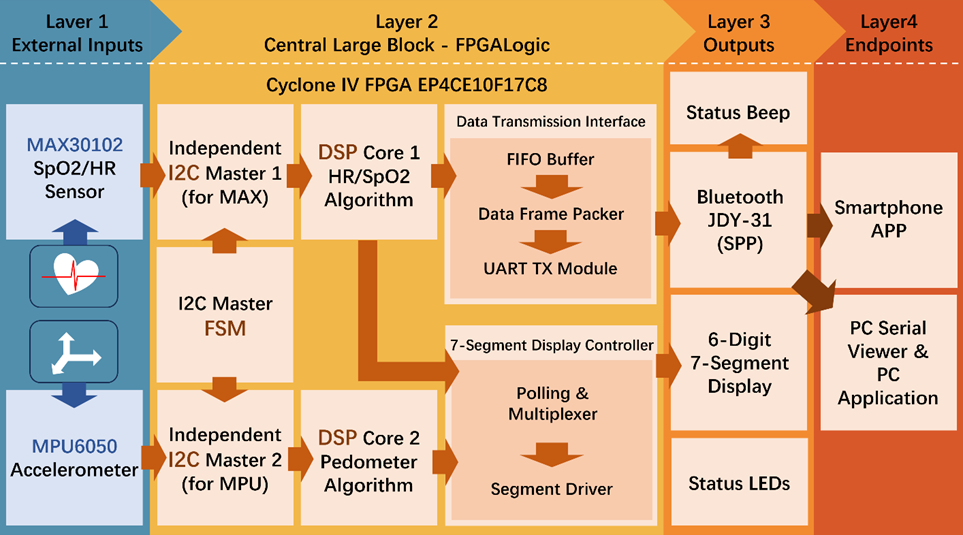
图1 系统逻辑框图
由系统逻辑框图（图 1）可知，本设计以 Cyclone IV 系列 FPGA (EP4CE10F17C8) 为核心控制单元。系统上电后，全局时钟管理模块（PLL）为内部各个逻辑单元提供稳定的驱动时钟。随后，系统按照“**外设初始化 -> 并行数据采集 -> 核心算法处理 -> 多路数据输出**”的流水线架构展开工作，具体工作流程分为以下四个层级：

### **数据采集层（Layer 1：外部输入）**

系统启动时，I2C 主控状态机（I2C Master FSM）率先工作，对 MAX30102 生理传感器和 MPU6050 姿态传感器完成初始化配置。进入运行状态后，两路传感器数据分别通过两个独立的 I2C 主控制器同步读入 FPGA 内部。这种纯硬件的并行架构有效避免了传统单片机在单总线分时复用时造成的采样率瓶颈。

### **核心处理层（Layer 2：FPGA** **逻辑核心）**

传感器原始数据进入 FPGA 后，被分流至两个独立的数字信号处理（DSP）核心进行实时计算：

生理信号通路： MAX30102 采集的 PPG 脉搏波数据送入 DSP Core 1，经过硬件数字滤波与去噪处理后，由心率/血氧算法解算出实时的生理参数。

运动数据通路： MPU6050 采集的三轴加速度数据送入 DSP Core 2，通过内置的计步算法实时计算用户的步数及运动姿态。

### **数据输出与终端层（Layer 3 & 4：输出与数据呈现）**

经过 DSP 核心处理后的有效数据，被同步送入本地与无线两条输出路径：

本地状态交互路径： 数据进入数码管显示控制器，通过内部的轮询与多路复用逻辑驱动硬件段码逻辑，在板载的 6 位数码管上动态显示当前心率或步数。同时，结合状态指示灯和蜂鸣器提供直观的设备运行状态反馈。

无线传输与上位机路径： 数据被送入数据传输接口模块。为解决速率匹配问题，数据先缓存于 FIFO Buffer 中，随后由数据帧打包器添加自定义的帧头帧尾。最终，通过 UART 发送模块驱动 JDY-31 蓝牙模块，将完整的数据包无线透传至智能手机 APP 或 PC 端串口助手，实现数据的远程可视化监控与记录。

## 3. 模块设计

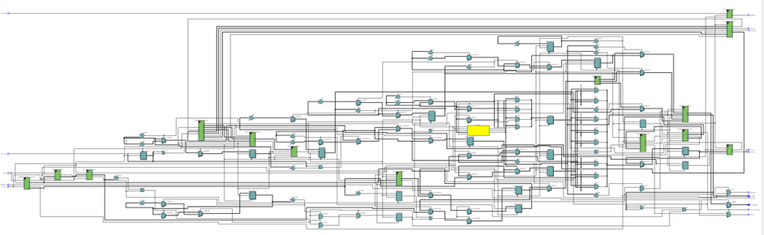
图2 总RTL图
### 3.1 MAX30102模块

`MAX30102` 内部集成了完整的光电信号采集与处理系统，主要包括 `LED` 驱动模块、光电检测模块、模拟前端电路（`AFE`）、模数转换器（`ADC`）、数字滤波单元、数据寄存器（`FIFO`）以及 `I²C` 通信接口。

其中，`LED` 驱动模块控制红光与红外 `LED` 的发光强度和工作时序；光电二极管负责接收反射光信号并转换为电流信号；模拟前端电路对微弱信号进行放大并消除环境光干扰；`ADC` 将模拟信号转换为数字信号；数字滤波模块对数据进行处理后存入 `FIFO` 寄存器；最后通过 `I²C` 接口与外部控制器进行数据通信。

其功能框图如图 2 所示。
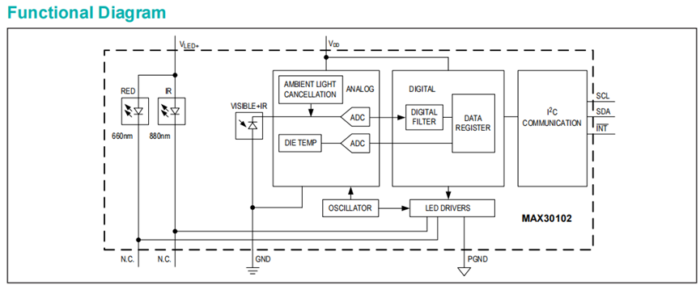
  
图 3 MAX30102功能框图

根据其内部框图可知该器件内部集成红光 `LED`（660 nm）和红外 `LED`（880 nm）。在工作过程中，`LED` 周期性发光，光线照射到人体组织（如手指）后，一部分被血液吸收，另一部分被反射回传感器。由于动脉血液在心脏搏动时呈现周期性变化，反射光强度也随之变化。

光电二极管将接收到的反射光转换为电流信号，经内部模拟前端电路进行放大与环境光消除处理后，由 `ADC` 转换为数字信号。随后数字滤波模块对数据进行处理，并将结果存入 `FIFO` 寄存器。当新数据产生时，`INT` 引脚输出中断信号通知外部控制器读取数据。

通过分析红光与红外光信号的变化规律，可以计算得到心率值；同时根据两种波长光吸收比例的差异，可以进一步估算血氧饱和度（`SpO₂`）。

#### 3.1.1 通用I2C主机控制模块

`I2C` 驱动模块负责驱动外部 `I2C` 设备总线，用户可根据该模块提供的接口对从机寄存器进行配置，实现 `I2C` 协议的读写操作。模块命名为 `i2c_master`，通过状态机控制 `I2C` 时序，完成数据的发送与接收，支持单字节读写操作。
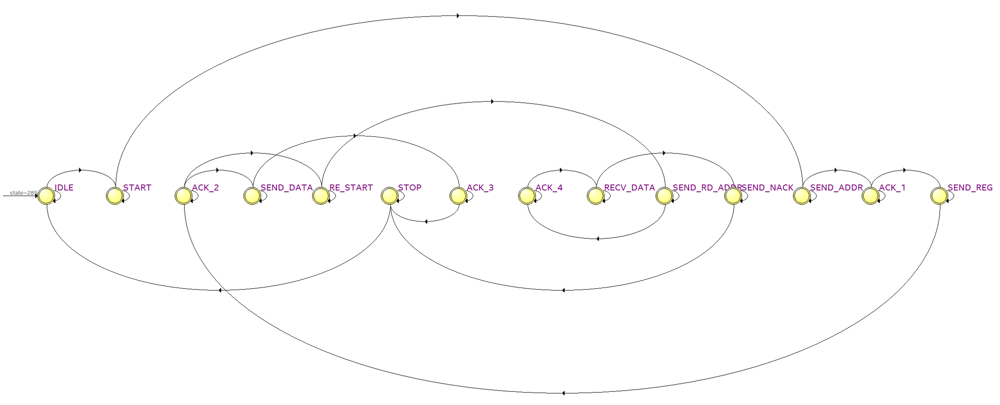
图4 状态转换图

**输入信号：** 系统时钟 `clk`；复位信号 `rst_n`（低电平有效）；`I2C` 操作触发信号 `req`，高电平启动一次 `I2C` 操作；读写控制信号 `wr_rd`，`1` 表示读操作，`0` 表示写操作；从机地址 `dev_addr`（7 位）；寄存器地址 `reg_addr`（8 位）；写入数据 `wr_data`（8 位）

**输出信号：** 读取数据 `rd_data`（8 位）；操作完成标志 `done`，高电平表示一次 `I2C` 操作完成；应答错误标志 `ack_err`，`1` 表示未收到从机应答；`I2C` 时钟信号 `i2c_scl`（`SCL`）；`I2C` 双向数据线 `i2c_sda`（`SDA`，开漏结构）

本模块采用单状态机结构控制 `I2C` 通信过程，共包含 14 个状态，每个状态对应 `I2C` 协议的一个阶段：

| **编号** | **状态名称**         | **状态说明**                         |
| ------ | ---------------- | -------------------------------- |
| **1**  | **IDLE**         | 空闲状态，等待 req 信号触发。                |
| **2**  | **START**        | 产生起始信号（SCL 为高时 SDA 由高变低）。        |
| **3**  | **SEND_ADDR**    | 发送从机地址和写控制位（默认先写寄存器地址）。          |
| **4**  | **ACK_1**        | 检测从机对应地址的应答信号。                   |
| **5**  | **SEND_REG**     | 发送寄存器地址。                         |
| **6**  | **ACK_2**        | 检测寄存器地址发送后的应答信号。                 |
| **7**  | **SEND_DATA**    | 写操作时发送 8 位数据。                    |
| **8**  | **ACK_3**        | 检测写数据后的应答信号。                     |
| **9**  | **RE_START**     | 读操作时产生重复起始信号。                    |
| **10** | **SEND_RD_ADDR** | 发送从机地址和读控制位。                     |
| **11** | **ACK_4**        | 检测读地址阶段的应答信号。                    |
| **12** | **RECV_DATA**    | 接收从机返回的 8 位数据。                   |
| **13** | **SEND_NACK**    | 主机发送 NACK 信号，表示读操作结束。            |
| **14** | **STOP**         | 产生停止信号（SCL 为高时 SDA 由低变高），完成一次通信。 |

 表一 `I2C` 主控状态机的状态转化表

从 `IDLE` 状态开始，等待 `req` 触发信号。当检测到 `I2C` 操作请求后，状态机首先产生起始信号，然后依次发送从机地址和寄存器地址。

- 若为写操作，则继续发送 8 位数据，并检测从机应答信号；
    
- 若为读操作，则产生重复起始信号，重新发送从机读地址，并接收 8 位数据，同时主机发送 `NACK` 表示读取结束。
    

最后生成停止信号，结束本次 `I2C` 操作，拉高 `done` 标志位，并返回 `IDLE` 状态。通过状态机的顺序控制，实现 `I2C` 协议的完整读写操作。

#### 3.1.2 MAX30102 初始化

本模块用于完成 `MAX30102` 传感器的上电初始化配置。通过状态机控制 `I2C` 主机模块，依次向传感器的多个寄存器写入配置数据，使其进入正常工作模式。

模块内部采用查找表（`LUT`）方式存储 12 条初始化指令，每条指令包括寄存器地址和对应写入数据。状态机在 `init_start` 触发后，依次取出寄存器地址与数据，通过 `i2c_req` 启动 `I2C` 写操作。当检测到 `i2c_done` 信号后，切换到下一条配置指令，直到全部寄存器写入完成，最后将 `init_done` 置高，表示初始化完成。

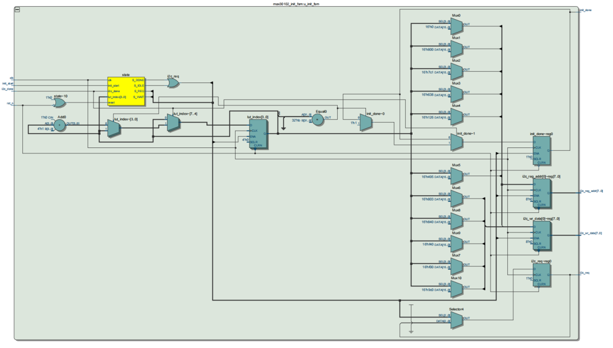
  
图5  max30102 init RTL图

如下代码为部分关键初始化配置内容：
```Verilog
// 软件复位
reg_addr_lut[0]  = 8'h09;  reg_data_lut[0]  = 8'h40;
// 中断使能配置
reg_addr_lut[1]  = 8'h02;  reg_data_lut[1]  = 8'h40;
reg_addr_lut[2]  = 8'h03;  reg_data_lut[2]  = 8'h00;
// FIFO 指针与溢出计数器清零
reg_addr_lut[3]  = 8'h04;  reg_data_lut[3]  = 8'h00;
reg_addr_lut[4]  = 8'h05;  reg_data_lut[4]  = 8'h00;
reg_addr_lut[5]  = 8'h06;  reg_data_lut[5]  = 8'h00;
// FIFO 配置（开启循环模式）
reg_addr_lut[6]  = 8'h08;  reg_data_lut[6]  = 8'h1F;
// 工作模式配置（SpO2 模式）
reg_addr_lut[7]  = 8'h09;  reg_data_lut[7]  = 8'h03;
// 采样率与 ADC 参数配置
reg_addr_lut[8]  = 8'h0A;  reg_data_lut[8]  = 8'h27;
// LED 驱动电流配置
reg_addr_lut[9]  = 8'h0C;  reg_data_lut[9]  = 8'h24;
reg_addr_lut[10] = 8'h0D;  reg_data_lut[10] = 8'h24;
// Pilot LED 配置
reg_addr_lut[11] = 8'h10;  reg_data_lut[11] = 8'h7F;
```

上述代码依次对 `MAX30102` 的关键寄存器进行配置。首先通过软件复位保证芯片从确定的初始状态启动；随后配置中断寄存器，仅保留数据就绪中断；对 `FIFO` 写指针、读指针及溢出计数器进行清零，确保数据缓存区干净；开启 `FIFO` 循环模式，提高系统稳定性；设置工作模式为 `SpO₂` 连续采样模式；配置采样率与 `ADC` 参数以保证数据精度；最后设置红光和红外 `LED` 的驱动电流，以保证信号幅度满足检测要求。

#### **3.1.3 MAX30102** **数据读取**

该模块实现了对 `MAX30102` 的数据读取控制逻辑。模块在初始化完成（`init_done` 有效）且检测到中断信号 `int_pin` 变低后，通过 `I2C` 状态机完成一次完整的读操作流程。读取过程分为两个阶段：

1. 首先读取 `0x00` 寄存器以清除中断标志；
    
2. 随后读取 `0x07` `FIFO` 数据寄存器，连续读取 6 个字节数据，分别存入红光与红外光 24 位数据寄存器中。
    

数据读取完成后输出 `data_valid` 脉冲，表示一组有效的光电数据已经准备完毕。

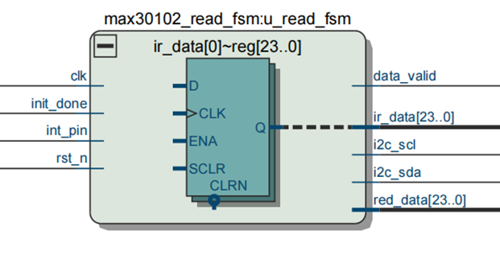
  
图6 max30102 read RTL图

下面为状态机核心读取流程代码片段：
 ```Verilog
 IDLE: begin
    i2c_scl <= 1'b1;
    sda_en  <= 1'b1;
    sda_val <= 1'b1;
    byte_cnt <= 3'd0;
    if (init_done && (int_s2 == 1'b0)) begin
        state <= START1;
        seq_cnt <= 1'b0;
        tx_shift <= 8'hAE;
    end
end
ACK1: begin
    if (cnt == CNT_Q1) sda_en <= 1'b0;
    else if (cnt == CNT_Q2) i2c_scl <= 1'b1;
    else if (cnt == CNT_Q3) i2c_scl <= 1'b0;
    else if (i2c_clk_en) begin
        state <= WR_REG_ADDR;
        tx_shift <= (seq_cnt == 1'b0) ? 8'h00 : 8'h07;
        bit_cnt <= 3'd7;
        sda_en <= 1'b1;
    end
end
RD_DATA: begin
    if (cnt == CNT_Q2) i2c_scl <= 1'b1;
    else if (cnt == CNT_Q2 + 10) rx_shift[bit_cnt] <= i2c_sda;
    else if (cnt == CNT_Q3) i2c_scl <= 1'b0;
    else if (i2c_clk_en) begin
        if (bit_cnt == 0) begin
            state <= SEND_ACK;
            sda_en <= 1'b1;
            if (seq_cnt == 1'b1) begin
                case (byte_cnt)
                    3'd0: red_data[23:16] <= rx_shift;
                    3'd1: red_data[15:8]  <= rx_shift;
                    3'd2: red_data[7:0]   <= rx_shift;
                    3'd3: ir_data[23:16]  <= rx_shift;
                    3'd4: ir_data[15:8]   <= rx_shift;
                    3'd5: ir_data[7:0]    <= rx_shift;
                endcase
            end
        end else begin
            bit_cnt <= bit_cnt - 1'b1;
        end
    end
end
STOP: begin
    if (cnt == CNT_Q1) begin sda_en <= 1'b1; sda_val <= 1'b0; end
    else if (cnt == CNT_Q2) i2c_scl <= 1'b1;
    else if (cnt == CNT_Q3) sda_val <= 1'b1;
    else if (i2c_clk_en) begin
        if (seq_cnt == 1'b1) begin
            data_valid <= 1'b1;
        end
        state <= WAIT_GAP;
    end
End
 ```

上述代码体现了整个数据读取控制的核心逻辑。在 `IDLE` 状态下等待初始化完成并检测中断信号，当中断引脚为低电平时启动 `I2C` 读取流程。

首先发送从机地址和寄存器地址，根据 `seq_cnt` 判断当前阶段是清中断寄存器（`0x00`）还是读取 `FIFO` 数据寄存器（`0x07`）。在 `RD_DATA` 状态中逐位接收数据，并按照字节顺序将 6 字节 `FIFO` 数据分别拼接成 24 位红光数据与 24 位红外数据。读完最后一个字节后发送 `NACK`，并产生 `STOP` 条件结束通信。

当整个数据读取流程完成后，在 `STOP` 状态中拉高 `data_valid` 一个时钟周期，通知上层模块当前采样数据有效。

### 3.2    心率计算模块

该模块实现了基于滤波后光电信号的心率（BPM）计算功能。模块输入为滤波后的脉搏波信号 `filter_data` 及其有效标志 `filter_valid`，通过峰值检测算法判断心跳发生时刻，并统计相邻两次心跳之间的时间间隔。随后利用间隔值计算心率（单位：BPM），当计算完成后输出有效标志 `bpm_valid` 以及 8 位心率数值 `bpm_out`。同时，每检测到一次有效心跳信号，`LED` 状态翻转一次，用于直观指示心跳节奏。

![](data:image/png;base64,/9j/4AAQSkZJRgABAQEAqACoAAD/2wBDAAoHBwkHBgoJCAkLCwoMDxkQDw4ODx4WFxIZJCAmJSMgIyIoLTkwKCo2KyIjMkQyNjs9QEBAJjBGS0U+Sjk/QD3/2wBDAQsLCw8NDx0QEB09KSMpPT09PT09PT09PT09PT09PT09PT09PT09PT09PT09PT09PT09PT09PT09PT09PT09PT3/wAARCACLA8kDASIAAhEBAxEB/8QAHwAAAQUBAQEBAQEAAAAAAAAAAAECAwQFBgcICQoL/8QAtRAAAgEDAwIEAwUFBAQAAAF9AQIDAAQRBRIhMUEGE1FhByJxFDKBkaEII0KxwRVS0fAkM2JyggkKFhcYGRolJicoKSo0NTY3ODk6Q0RFRkdISUpTVFVWV1hZWmNkZWZnaGlqc3R1dnd4eXqDhIWGh4iJipKTlJWWl5iZmqKjpKWmp6ipqrKztLW2t7i5usLDxMXGx8jJytLT1NXW19jZ2uHi4+Tl5ufo6erx8vP09fb3+Pn6/8QAHwEAAwEBAQEBAQEBAQAAAAAAAAECAwQFBgcICQoL/8QAtREAAgECBAQDBAcFBAQAAQJ3AAECAxEEBSExBhJBUQdhcRMiMoEIFEKRobHBCSMzUvAVYnLRChYkNOEl8RcYGRomJygpKjU2Nzg5OkNERUZHSElKU1RVVldYWVpjZGVmZ2hpanN0dXZ3eHl6goOEhYaHiImKkpOUlZaXmJmaoqOkpaanqKmqsrO0tba3uLm6wsPExcbHyMnK0tPU1dbX2Nna4uPk5ebn6Onq8vP09fb3+Pn6/9oADAMBAAIRAxEAPwD2aiiigAooooAKKKKACiiigAooooAKKKKACiiigAooooAKKKKACiiigAooooAKKKKACiiigAooooAKKKKACiiigAooooAKKKKACiiigAooooAKKKKACiiigAooooAKKKKACiiigAooooAKKKKACiiigAooooAKKKKACiiigAooooAKKKKACiiigAooooAKKKKACiiigAooooAKKKKACiiigAooooAKKKKACiiigAooooAKKKKACiiigAooooAKKKKACiiigAooooAKKKKACiiigAooooAKKKKACiiigAooooAKKKKACiiigAooooAKKKKACiiigArlLi/1648VXVrbyRQaZAAvm+WHbfsVsYJ/2q6uufi/5Cuq/wDXwv8A6KShiYY1T/oLf+Sq/wCNGNU/6C3/AJKr/jViipuK5Xxqn/QW/wDJVf8AGjGqf9Bb/wAlV/xqxRRcLlfGqf8AQW/8lV/xoxqn/QW/8lV/xqxRRcLlfGqf9Bb/AMlV/wAaMap/0Fv/ACVX/GrFFFwuV8ap/wBBb/yVX/GjGqf9Bb/yVX/GrFFFwuV8ap/0Fv8AyVX/ABoxqn/QW/8AJVf8asUUXC5Xxqn/AEFv/JVf8aMap/0Fv/JVf8asUUXC5Xxqn/QW/wDJVf8AGjGqf9Bb/wAlV/xqxRRcLlfGqf8AQW/8lV/xoxqn/QW/8lV/xqxRRcLlfGqf9Bb/AMlV/wAaMap/0Fv/ACVX/GrFFFwuV8ap/wBBb/yVX/GjGqf9Bb/yVX/GrFFFwuV8ap/0Fv8AyVX/ABoxqn/QW/8AJVf8asUUXC5Xxqn/AEFv/JVf8aMap/0Fv/JVf8asUUXC5Xxqn/QW/wDJVf8AGjGqf9Bb/wAlV/xqxRRcLlfGqf8AQW/8lV/xoxqn/QW/8lV/xqxRRcLlfGqf9Bb/AMlV/wAaMap/0Fv/ACVX/GrFFFwuV8ap/wBBb/yVX/GjGqf9Bb/yVX/GrFFFwuV8ap/0Fv8AyVX/ABoxqn/QW/8AJVf8asUUXC5Xxqn/AEFv/JVf8aMap/0Fv/JVf8asUUXC5Xxqn/QW/wDJVf8AGjGqf9Bb/wAlV/xqxRRcLlfGqf8AQW/8lV/xoxqn/QW/8lV/xqxRRcLlfGqf9Bb/AMlV/wAaMap/0Fv/ACVX/GrFFFwuV8ap/wBBb/yVX/GjGqf9Bb/yVX/GrFFFwuV8ap/0Fv8AyVX/ABoxqn/QW/8AJVf8asUUXC5Xxqn/AEFv/JVf8aMap/0Fv/JVf8asUUXC5Xxqn/QW/wDJVf8AGjGqf9Bb/wAlV/xqxRRcLlfGqf8AQW/8lV/xoxqn/QW/8lV/xqxRRcLlfGqf9Bb/AMlV/wAaMap/0Fv/ACVX/GrFFFwuV8ap/wBBb/yVX/Gs+60nVrq4Mo8UX8IP/LOKGIKOMcZBP61sUUXC7MX+xtX3lv8AhK9RyVC48iLA98Y6+9W7W11a2Em7XppzI+7Mtsh2+wxjAq/RTuwuyvjVP+gt/wCSq/40Y1T/AKC3/kqv+NOe+tY3KPcwqwOCDIARSDULMn/j7g/7+ClcLsoXF1r41AWtrqEDYi8xmlgA74wMUbvFP/P/AGX/AH5rPttXmutXeZJtOQGFkUPIegkYDPvxmtD+0bn/AJ+tJ/7+tTC7Dd4p/wCf+y/781VudW1y0jLz61pigNs5Qfe9ParX9o3P/P1pP/f1qwfEAULb3JXTnKzDd9kBMjZz19R9aa13E20tCe28V6rdQCRdXs1+QOym1clRx6D3xn61p2914muoEmi1CzKOMrugKnH0IyKzdAilgW6kbUI9PSZlKRK0TngYJOc4rW3k9fEI/wC+If8ACkwTbQ+wudauftCXGpRpJBL5Z8u3Ug8A55PvVvGqf9Bb/wAlV/xrC0+++za1Mj6pHNFLO+8MEGcRqQcj8q3f7Qs/+fuD/v4KQ7sMap/0Fv8AyVX/ABoxqn/QW/8AJVf8aP7Qs/8An7g/7+Cj+0LP/n7g/wC/goC7DGqf9Bb/AMlV/wAaMap/0Fv/ACVX/Gkk1KzigeU3EbImN2w7yMnA4GT1qP8Ati19Lr/wFl/+JoC7Jcap/wBBb/yVX/GjGqf9Bb/yVX/Gov7YtfS6/wDAWX/4mj+2LX0uv/AWX/4mgLslxqn/AEFv/JVf8aMap/0Fv/JVf8ajj1W1lnjhBmV5DtQPA6gnGcZIx2q7tPofyouFytjVP+gt/wCSq/40Y1T/AKC3/kqv+NWdp9D+VG0+h/Ki4XK2NU/6C3/kqv8AjRjVP+gt/wCSq/41Z2kdjSUXC5Xxqn/QW/8AJVf8aMap/wBBb/yVX/GrFFFwuV8ap/0Fv/JVf8aMap/0Fv8AyVX/ABqyAT0FG0+h/Ki4XK2NU/6C3/kqv+NGNU/6C3/kqv8AjVnafQ/lRtPofyouFytjVP8AoLf+Sq/40Y1T/oLf+Sq/41Z2n0P5UbT6H8qLhcrY1T/oLf8Akqv+NGNU/wCgt/5Kr/jVnafQ/lRtPofyouFytjVP+gt/5Kr/AI0Y1T/oLf8Akqv+NWdp9D+VG0+h/Ki4XK2NU/6C3/kqv+NGNU/6C3/kqv8AjVnafQ/lRtPofyouFytjVP8AoLf+Sq/40Y1T/oLf+Sq/41Z2n0P5UbT6H8qLhcrY1T/oLf8Akqv+NGNU/wCgt/5Kr/jVnafQ/lR0ouFytjVP+gt/5Kr/AI0Y1T/oLf8Akqv+NWKKLhcr41T/AKC3/kqv+NGNU/6C3/kqv+NWKKLhcr41T/oLf+Sq/wCNGNU/6C3/AJKr/jViii4XK+NU/wCgt/5Kr/jRjVP+gt/5Kr/jViii4XK+NU/6C3/kqv8AjRjVP+gt/wCSq/41YoouFyvjVP8AoLf+Sq/40Y1T/oLf+Sq/41YoouFyvjVP+gt/5Kr/AI0Y1T/oLf8Akqv+NWKKLhcr41T/AKC3/kqv+NGNU/6C3/kqv+NWKKLhcr41T/oLf+Sq/wCNWdIu7p7+7tLuZZ/KSORZBGEPzbgRgf7v60lR6T/yMWof9e8H85KaBM3KKKKZQVz8X/IV1X/r4X/0UldBXPxf8hXVf+vhf/RSUmJliiiikSFFFFABRRRQAUUUUAFFFFABRRRQAUUUUAFFFFABRRRQAUUUUAFFFFABRRRQAUUUUAFFFFABRRRQAUUUUAFFFFABRRRQAUUUUAFFFFABRRRQAUUUUAFFFFABRRRQAUUUUAFFFFABRRRQAUUUUAFFFFAFeTUbOGRo5bqBHXqrOARWNrmty21ldTWN/YFVT92ucyA8DPofpirx026jurmSCa12TyeZiWDcQcAYzn2qO70q8vbSW2kns1SVSjFLfDAH0OeKadgZzlg839ryxXU8jLOrzfuLVXbOeeNpI5Oc8/hW/ZPZ2sW2aG8umLbi8unkH6AKgGKbp2gT6Wxe2ltfNYYaV4mZ2H1LVf8AK1T/AJ+7T/vwf8aG10FG9tTmyYbNU8wR2ksqfL5kShgrXB5ww/unuK1DBp2f+Qyn/fEH/wARS6jYzg/aryWGZi8MShIsYHmA9ya2/IiLYEMXX+4KRRheRp//AEGU/wC+IP8A4iquoT2NjHGY7+S5kkbascMcBb6/crWi1O0mjEkOn3Txt91ltCQfcViavp8coSbS9NvUufN3uHicIw5zkc889qat1Jd7aEektf6nbuyW7PJEoDgGBfmwOMGPI7n8uTWjNYXFvHaq4la5nYr5SLBhSASfmMfPSqumabBbiaTULO9uZpiCdto6qmBjA55qW60u1vpYY7XTbmE4kzJLGyKpKELyT64odug1e2pmx2V2dZK+RLu89xjdB/zzH+xitb+z77/n3m/76t//AI3UVtb38805Nu0csE334rtVOfLUHqhzVv7Nqv8Aeuv/AANj/wDjdIZRvVmsIGluI5FABbaXtgSB1x8nNJuHaWM8E/8AHxa8gdf4PY1n69ayrqNudSjlmSSNlRHfzyTx0CqMVp6Bot1DpwLW9nA3mOyLPbBpFXPGTn0qraXJUtbWIZ9J1Z7qK4tY/k2ruV3iAfDBhyqjjIqwuk3lvp7XWpPbI43SSlnlOMknHB5/CrtxfahZStC0lq7FEMZEZAUmQJyM8jBrJGhz3mhTylraSVvNPMTM7EMenzdeOKQytbX0F1NLHCnm7DwYYrhwRgc8Hjr0qa3f7TcRxLaXCeY+xXktrhUz7ktwKr6NpmpX+rWV21rcWFvAjBpnZVlfK4AC88Z9a6z+zpP+gnf/APfaf/E03ZBF3WqMPUtGuIfssnlxyKs4LCITOQMHkgHOPpSeQf8Ang//AIDXP+Nal2k2ny2siX11KGlKskrKVYbGPZR3AqEXWvNb28sMVvMssauSqgbcjOOW+gpIDOdEjZFeMqXyFBt7kZwMnvSmJVIDRkE9MwXI/rWHrUzC51CXVJ9s8bHbHJjYx28DYSQQa6G30iC/tILqfw3YvJNErsTLjJYAnjHFNqwoyUitM0ttNaS26Or+eoBFvcYIIPHPX6Vrf2lqP9w/+AE/+FPnJ8m1tb7S4hamRY1xPu2EA7TjA6YrndZuLeYC30rT1TzYi4ln3pnkYK8/zpJX2G2krs3/AO0tR/uH/wAAJ/8ACj+0tR/uH/wAn/wrAs5Rf2gk8zRraQSFJEljlypHXHz8itWwi0tY5P7Rn0133/Ibcuo24HUEnnOaLDIdRury6u7OOdX2Zc7RaTrngenJo8g/88H/APAa5/xrXsU0YXimxa3NwFO3axLY74rVpAcn5B/54P8A+A1z/jR5B/54P/4DXP8AjXWUUCOT8g/88H/8Brn/ABo8g/8APB//AAGuf8a6yigDk/IP/PB//Aa5/wAaPI/6YP8A+A1z/jXWUDrQBy+ntYT27G5srzzFkZD5Uc+04NWvK0r/AJ8tR/79T1f0j/j3uP8Ar5l/9Cq/QBg+VpX/AD5aj/36nqK10e5urZJvJhh35IjkM25RnjPzda6Osmayt73XphcxiQJbIVBY4GWbNAGbqNiulW4mvJLSNGYIuTMcseg4aorTUNHuNPFx9i1CQqgaTyY5mXd0IBzzTfEHh+Kwto7ywiuJ3S4RmiX9423BHyjt1Gad4c0bUPtd3d3Qn01JlQJHHIu5iM8sMHFVZWvcV3e1jU0+y03UIGljtLuLa5QpOZI2yMdienNZ2pXsejwrb2Op3k0rGQRwxmNzGQCecjJAPHXNbg02TI/4md//AN9p/wDE1zM2h3k2n2lxpzNczx3M4ZJ5VVACzjdwOTnH60la+oO9tCaxvdc1OzeayLyMjKhVrmMFT33DysjFaun2msTCX+0J7i1KkbPLkikDDvzsGKq6L4WFqlxLqpgubidwx8sEKgAxgc8/WtP+w9N/59U/76P+NDsNbajjp1yOuqXn/fMf/wARSf2fcf8AQVvP++Yv/iai063itNUv4oF2RgRELkkAkHNadICkNOuT01S8/wC+Y/8A4ij+zbr/AKCl7/3xH/8AEVFqsEdzd6dDMN0bStlc4BwhrP1a2tdNguJV0lXiji3LL5vBf+7tzmmlcG7Gr/Zt1/0FL3/viP8A+Io/s26/6Cl7/wB8R/8AxFcZZTMLySG4ttNiWfMkUkjyFV4GR16DsO+etbllDpKxEX8+nSSZ4MG9RjHuT3oasCaaujVls5oI2km1e6jReSzCIAf+O1nX2oQ2NoZ/7buZyGVRHEYdzEnHHy1n6vcaZaybbEGRJoghWEFwW8xSMj6ZqxrdjBewTvY6bfpeSOr58l1ViCDg9scelCt1B3toQabqWr6isscDXT3EZPytJFH8uTgsChxxjpnmty1sdRkgDXd7dQS5PyIY3AHbnYKy9D0SG4RtQv5YpjKmwRhSgiwxznJznPrWqmk6RJjy4oXzkjbJnOOveh2voJXtqS/2bdf9BS9/74j/APiKSw+0JfXlvNPJOsWwqzqoIyMnoBSf2Fpv/Pqv5n/Gsa40y3j1aWG2t4Q0ssUYMm4hQUJPAPtSGdFeztZ2clx5EswjG4pGBuI74yRXOP4/skBYaZqrRBA/mC346Z7nt60mq6Pc2ljK8Nra3C+W+/YjBlAU8jLc1zMV08mkzQtJF5qW/wB3aV+XZ6ZrSEOZXM6lTka0PTYJTNbxytG0ZdQ2xsZXPY4pNJ/5GLUP+veD+clU4otU8mPF1a42D/lgfT61Hp1lfT+Ib3zNRaIrbw5+zxgBvmfruB9/zqFuaI6yioraA28CxmaWYj+OUgsfrgCpaZYVz8X/ACFdV/6+F/8ARSV0Fc/F/wAhXVf+vhf/AEUlJiZYooopEhRRRQAUUUUAFFFFABRRRQAUUUUAFFFFABRRRQAUUUUAFFFFABRRRQAUUUUAFFFFABRRRQAUUUUAFFFFABRRRQAUUUUAFFFFABRRRQAUUUUAFFFFABRRRQAUUUUAFFFFABRRRQAUUUUAFFFFABRRRQAUUUUAFFFFAFHWf+PFP+u8X/oYrQH+sH1rP1n/AI8U/wCu8X/oYrQH+sH1oAztB/5AVn/1z/qav1Q0H/kBWf8A1z/qav0AFFFFAHM67ZPDeeeZEkhcyTmFog2CsYz1IzwO9PtdJhu1cxtZAxtscNZ42tjOOvPXtUviuLMNvN9titlQSoyy52yBoyD0BPHX8K59vEQe1vIZ4rFw8pkTes7DO0YYAJz+YoGdF/wjnvY/+Ag/xo/4Rz3sv/AQf41xpvp75BCZf3DEPMLSOeMcYwWyPUdR6YrotHt/EY0yH7JJZQQbnKpcRMXYE8M3v3/GrcbdSFLyINV0PyrwDNp/q4zxbY6yqPWtI+GorG3kYfYkiTdI3+i59z1an3ekahqZg+1fZ45F2K8sM7rkBgx+XGO3HpWXqTXx0ie4jguJLZ1kUt9uclACVyQRz61NruxV9LlSHVdKmlRD5cZcgFnsAAuehJ3dK6H/AIRz3sf/AAEH+Ncc0zzaBKVaF2WPB25xjHv3rvY31XykxBY42jGZX9P92qnHlM6dTnOcv7aG2vPs01gtx5cikPBbgAgxucHnrkZrZ0i9FtotlDFpt+ESBAu2IEdB05qK9tb5We8lgSRvMVjHbtnCiNlz82O5qHTJdWXSrRf9MbEKfMLaLB4H+3UGpLczaVDqIvrrR5lu5PlE0kK54GepOBxVqTxHawkCWG4QngBtg/8AZq4jV5kivb+TUJGW+3Hy1kClmO3gbBkEdK6uz02W5tLe5m0XRjNJErOXjw2SATkbeuabViYyTuXJr6DUbPEmmXdxAw3KfKVlPoRzXOf2Qb2w06Sxt7yyZYtsskVqrGQHHQlvbrXTxR6jb26wW9pp0USrtVEkcBR7DbVrT7drTTre3kKl44wrFehPtRe2w2r7mVpEUOjWP2WDTtTkUu0jPLEGZmPU9avf2h/1C77/AL8L/jV+ikBz7nULrWbZ1As03yrCssA3bdi5J57nP5U3V9XutFliW6uHcSglXitAw47fe61e1iNprmxiiTMzM5V/PaLaABnleua5DWp723vbP7bA1sQHKme6aVSOB+FVGPM7ClLlVzY0nxNPrGoLZwyyxSMrMDLaKBhf+BVu/Z9S/wCf+H/wH/8Ar1yWnG4/4S2wa2WF2NtNgOxA6LnkCuoub3UrSHzprazMYZQ2yVs4JA4496JKzsKEuZXGXNzcWcipc6tbRuw3BTb8kevWof7Tb/oM23/gMf8AGrl0ZrfWFnS0muIzb+WTFt4O7POSO1ctqPicRTGfTYL+Np2LO8kihcrxgI2cD6YzRGLk7IcnZXN3+02/6DNt/wCAx/xo/tQ5GdatRzjm2I/rWDpOt351GSWGF9TuLmMv5KT7UiHGSASQB+ta2p6lqFxoF6txpFzaSFAFcNHIAcjnr69qTi0CknsNs7nUbeO5UGZlW4ky6WgZTzzg7qX+3bgRCQ3LKhUPlrVBgEZB5f0rE1F7lrSP7eZltReyb2kVI13c9w2c9fapfDMCamb+OGx0+9tIyixyXUXJyDkBtuWAxTtpcOb3rG5FqV/KxETTOVxu22anGemfnrN03RJGvGF0baOY26uyzQAsCXbr83Wt2C3vbVpGt7DTITJguY3Zd2OmcLWXc2ktz4gmNxHpUUrQRb5JDvIQM3QMBzUlCalZ2mlQJLcS2X7x/LRUtAzFiPQN04rOsp1vbNpodOaYxqN4isFI3ZxgZfPvyOlWtc0sQWcU9m9tcyRTq3kwRxRsw5HXPbNO0DSZlurq81O4jtDMqqkVveYYYzyxHHeq0sTd3tbQl0/TZL6eSOTT/shQBgbixUBs9hhj0pdK8P8AmWAbNn/rJRza5PEjD1rV+x2f/QTuf/A4/wCNWbX7HZ2ywQ3EexckbpgxJJJJJJ55JqSjN/4Rz3sv/AQf40f8I572X/gIP8a1/tVv/wA/EP8A38X/ABo+1W//AD8Q/wDfxf8AGgRzsHh/dqt6mbP5Vj/5deOQe2at/wDCOe9l/wCAg/xpthqxuNRu7iCwvHjljiZSAnTBwfvd60G1KVfvabeD6+WP/ZqBmbN4VSblzanajhVSDZlipAJOe2c1DdaJnSpYptK06MCEq0vnH5cD733fxqfVdRnkktU+y30EWZWdhKqZ2oSBlST1FVNS0zULjQbliTh7Ytg3kr/w5xjHNNCZF4dbSbd5bi71GCS8t9yEtcKUCYHzKABwa37PWtJ1G48iyvLaeX5vkQgn5ev864/Q7efUdatbjT7WaC3RWMty8ACMcccH7xz37V2IsL0HIv0BGeRar3605bkx22sQ63qf9m25W3gZ7ll3IViDBRuAyeR61j+IbnUW0iVZhcrF5kYctbCMAbxn5t3FXdb026+wzXD35aQKiKfJUADzFJ/lV670u5vIZLe6vUlhfh0e2Uhh+dStCnscfoMVvd61cWtra2uoQiPzX848B92OWwd30Oa6az0ttPlWWy0PTLeRVKho5dpweo4T2q1b6Xc2kIitryKGMdFS1RR+lSfZL/8A6CQ/8B1/xpt3EtFa5CdYkt5JYry0IkUoEWBvM3ls47D0rmotQ1G6voLhlmDySQvhbUEZMZ6fNzWzcaTqv9p/alureeIbHKuuwkqDjoDxzWRa3N5bCyleO1CKbbBLuf8AlkcdBSKNs3OqOpUx3RBGCPsI5H/fdZ1n4e0yDzjc6FcTO7buLbaEGMYxu6VLqWofbbZjPHaM0Ss8bK8wKtjqMKP1rjf7N0640y4ulnumleD96xupBubaeuTzVRi3sROcY2uekXGs/ZLWWZtN1DZEhYjygOAPrTNL1O5Ou3bx6TeMXtoNysUUocvwcnnr29DWdbR2Np4KmaBoY5LiyEko83OX8vHQmuh0j/kYL/8A69oP5yUla5ZfsLu8uGYXentaADKkyq+eenHSr1FFU3cpBXPxf8hXVf8Ar4X/ANFJXQVz8X/IV1X/AK+F/wDRSVLEyxRRRSJCiiigAooooAKKhuL22tCv2m5hh3Z2+ZIFzjrjNYH/AAkdvaWc0v8AadnJi7YHz5skR542hefp2oSuB0tFce/jp3j/ANCtILlgx3Os5CbexHG4n1GOlami+JYb+B3u7rToyhCgxTHDHHJw4Bx+dU4tbiTT2NymTzx20Ek0zbY41LM3oBVZ9Z02NCz6haBRyT5y/wCNVdR1GzvdHv0tLqGdkg3MI3DYB6Hj1qRlZfEU88k3kpCIklaNd8UpYgdzgU7+27v0tv8AvzN/hUmn/wBpmS/8h7NYvtku3erluoznBA60+5m8QxSILeGwnU/eOWTbz6FuaAK/9vXPmeX/AKLv27tvkzZx69Kd/bV5/dtv+/M3+FcZcXc0aLd3d1NJc+cyGB5mUP8AvDlQAQR/Sutn0gXMIhm0q9eINuVG1I4Hr/Fkjjvn8KpxtuKMlLYl/tu7/u23/fmb/Cj+27v0tv8AvzN/hU1tJcaTYGKDSbnyY9z7ftKyNycnGTk/SrX9sw4/1V5/4DvUjM/+27v0tv8AvzN/hS/21d/3bb/vzN/hVufXIoreWRYLtmRCwBgYAkD17Vyi6tc31/FLeyQWi3YTYzPI0anb04ddufp+NNJsLpOzOg/tq7/u23/fmb/Cj+2rv+7bf9+Zv8KzXt2cJs1jSYiG+b9/K4K/9/B1P5Vfs49MW1QXuo20lwM72ivHVTzxgF+OMUhj/wC2rv8Au23/AH5m/wAKP7au/wC7bf8Afmb/AAq3DpunXMfmQO8qZxuS6kYZ+oapP7Gs/wC7N/4ESf8AxVAFD+2rv+7bf9+Zv8KP7au/7tt/35m/wq//AGNZ/wB2b/wIk/8AiqP7Gs/7s3/gRJ/8VQBX0rW1vp5LaYKlwrlVCo4VwACT8w689K1sH0rl4tLtTr2wrLt+0Sj/AF7/APPKM+vvUeoTW1nNMY7dzDH8g8yS5Vi45PIyNuO9NRbdkJtLVnWYPpRg+lefy6/AXDxWUcVrwfOuL6bn1GEzjPY9637L+x5rOKS4urdJXXcypfPgZ+rA9PUUNNAmnsdDg0lc9ef2VFHE1ldqZ/OjChbxmJ+YZ43c10R6mkAlFFFABRRRQAUUUUAFFFFABRRVLU9Vt9LhDyuhkYgLGZFUtk4zyenvQBdorG/4SJf+eVv/AOB0P+NWU1C8ljV49NLowyrLcxkEexzQBoUVR+2X3/QLf/wIj/xo+2X3/QLf/wACI/8AGgC9RWXPrMtqwW4s0iLDIEl3EpP5mov+EiX/AJ4wf+B0P+NAGzRWN/wkS/8APGD/AMDof8aP+EiX/njB/wCB0P8AjQBs0VzmpeJHWwkMAhjk4AdbuFiMkds1LGdTmQSQvdSRnoyTwEH8RQBvUVh+Xq//AE+/9/YKPL1f/p9/7+wUAblFYfl6v/0+/wDf2Cq813eW0nlz3U0T4zte6t1OPoaAOkormP7Sn/5/2/8AAu2o/tKf/n/b/wAC7agDp6K5j+0p/wDn/b/wLtqP7Sn/AOf9v/Au2oA6eiuY/tKf/n/b/wAC7aj+0p/+f9v/AALtqANnWf8AjxT/AK7xf+hitAf6wfWuL1LUZmtVBvWP72M4+1W5/iHpVwanPvH+nt1/5/LagDX0H/kBWf8A1z/qav1y2jJqjaNaNF9rMZjypWWHGPbNXfK1j0vf+/sFAG5RWH5Wsel7/wB/YKY815bTwpf3V1axykqJXkhKggZwaAH+J41ltwjjKtb3II/7ZmrVvdalMZUtUtFigfyl8xn3HAHPH1rl9b1W0YTWt5etc+WJvKcHGQYvl5Xrzmq+najZqk3m3NsrGXJAafHQdPnHH1oGdru1j0sPzko/4m/93T/zkrmoLq2unKW8sUrgZKoLhjj1wHqfym/55t/37uv/AIugDeX+19w+XT+vrJWFYajcHSjbSJbMhMiMPKmOcsc8gULE24fum6/887r/AOLqppaN/Z6YRvvP/wAs7n+8fR8UAUk8OWwaQszsHY4H+kcL6dOa6UazdqoAW2wBgfuZv8KpbH/55v8A9+7r/wCLo2P/AM83/wC/d1/8XTbb3EklsWp9ZuzbSgrbco3/ACxm9PpUen6xdpptqoW3wIUAzDN6D2qu0TSYhACyShlQOtyoY4JxkvjPFR2kMqWUCPE6ssaggx3OQcez4pDLovCLtrsWlh9pYAGX7NNuIHTnFT/21ef3bb/vzN/hVHY//PN/+/d1/wDF0bH/AOeb/wDfu6/+LoAvf21d/wB22/78zf4Uf21d/wB22/78zf4VR2P/AM83/wC/d1/8XRsf/nm//fu6/wDi6AL39tXf922/78zf4Uf21d/3bb/vzN/hVHY//PN/+/d1/wDF0bH/AOeb/wDfu6/+LoAnN/fXesWKxra7wJSNySqOgz1FP1zQb7XrVYrg2sbJnY8TyAjPX6jisu4Rv7QswUb/AJaf8s7n0H+3n8qs+U3/ADzb/v3df/F0bCauO0rwncaPex3VuYXkjRkUSzSMoDdeMe1XtY/tX+zJN62O3cn3S+fvCs/ym/55t/37uv8A4uqGp6Xc3jxtCZTtGwW4juAkjFl+ZiWOMAH86e+4bHWwXN5/aT2t3Hbj915qtCW/vYwc1He6g8DTLdaezW6EDzDIhDL3O0nOAe1cjJE6asSba1VPLdVMl5IgbbIVJGZM9R0qneaMby888tpyDAG0XYY8e5kzTja+opXtodRb+IbZrqZdJ0nzgMl5Y5Iog4/hYZIJBP5Vt3Nsb/Tngl3QmZAG2kEoeD9Dg1w9ppsBnU6oLS7hiUiONbyNcnj5id/t0HFbH2iw/wCfdf8AwbL/APF0nboNXe5YtNIe/tJo7m782MXUh2PAjDcG68960VsLtFCpqTqo6BYEAH6Vn2usW9nD5VvbwImS2Pt8R5PU5LZqb/hIl/54wf8AgdD/AI0gLf2K8/6Ckv8A35So4dDgF7Nd3ZS7nlRYy0sS8Bc47e9Qf8JEv/PGD/wOh/xo/wCEiX/njB/4HQ/40AaH9mWP/Plbf9+l/wAKP7Msf+fK2/79L/hWf/wkS/8APGD/AMDof8aP+EiX/njB/wCB0P8AjQBof2ZY/wDPlbf9+l/wo/syx/58rb/v0v8AhWf/AMJEv/PGD/wOh/xo/wCEiX/njB/4HQ/40AaH9mWP/Plbf9+l/wAKP7Msf+fK2/79L/hWf/wkS/8APGD/AMDof8aP+EiX/njB/wCB0P8AjQBW/tRLe7lurGSD7NKiAeZDIAu0EcEDGK5BLDTtQ1C6mmRmnFwz5V5ABhsgjJrstL1Swm0S0tpFa52QRmRI4jKqkjoccZrlp9I1CDVpf7MxHbMS6B4JuFz90jBAPPb0rSHL1M6qk1aJp+FPJm02xs0SR4kuLndlWwEO4csfrXTLotqqhVe7CgYA+1ScD86zPDkp0nSBbXaTtKZXkYxW77fmOeMjNan9rwf88bv/AMB2/wAKh7mivbUP7Ht/+el3/wCBUn+NH9j23/PS7/8AAqT/ABo/teD/AJ43f/gO3+FH9rwf88bv/wAB2/wpAI2iWjgBzcuoIO1rmQg4ORkZrQJyc1Q/teD/AJ43f/gO3+FH9rwf88bv/wAB2/woAvUVR/teD/njd/8AgO3+FH9rwf8APG7/APAdv8KALr/cb6Gubj02CWz0Oc+csknlKxSVlyBGcdD1961m1eDY37m76H/l3b/CseDSrQ6ZoTlZfnMZY+c4/wCWZPrxQBc1fQGn0+YWl5eROI3+UzO4k+U4Bya8/XV4Vsp7SbdkQ7QSrHDbemDyDmu11N7G3tpJdPe0uSkTOEfU3Qsw7Dk9s1lWnia7soGli8PQrC/76Rje72PHXkEnjFaQk0nZGdSEW05M6XRdOs20LT2ezty5toySYhnO0e1aWk/8jFqH/XvB/OSorGS6lgD3kMMTEAqsTlh09SBUuk/8jFqH/XvB/OSoW5qtzcoooplBXPxf8hXVf+vhf/RSVdk12CMNm2vi6ttKLauT1wD06HsawrbXbBtQ1R5JjATcgbJkZG4jQHgj1FDTtcltbGxRWePEGlFyg1CAuoBK5OQD04p39u6Z/wA/sX6/4VIi9RVH+3dM/wCf2L9f8KP7d0z/AJ/Yv1/woAvUVR/t3TP+f2L9f8KP7d0z/n9i/X/CgDlfFkyahr1vHAs7NbQXMUgjjyxOIzgDuMMK028KG7hkXUtTmKvJmNYwiAL/AAg8ZzXMrrPl/EB7iFYjGs0/ltMxjVgUjBIOD3FaWo+MI7u0kMlnpsrW1wERZZ2bLjHzKAuT16049AfU14/BGnRxCNZ7vGMOfN++voeK17uOK30uZoEjXyoGMZCg4wvFecvfPfQ5miWO3DGSGGJWMZbkHAYZOemPxrq9MsL2HSp4oNM0uA3MeB9nnICqVwM8Hpk9KqSa3ZMWuhXutMvNXtWt4AZljki3tcyIEY4Vj8oXPerWmeFpoIrmO5uBDFPgGC0OEOOpOR1PtWnpCGNr2M9UnCnHtGgrRqb6WHZXuYWlXhfVZoopV8hri5LLt53KwHX8a0by8uLaQGOG3eLH33uAh3Y4GCKS40XTbyYzXNjBLIeSzLyayZPAmkyDBEp5z821h1J6Ee+PoBQrdQfkUrS90dNbjkttKtxNcuTcXMr/AOqckkgEjBPfjHWurhu7e5P7i4il7/I4Nc3b+BoIjHHJd+Zahgzw+SBvwc4znpntWvH4c0eJi0WmWsZPBKJj+VN8vQS5upNrJI0W8IYg+UeQcGmLoun7F/0fsP8Alo/+NL/YemHrYwn6g1jtPeXT3hhOpq8d00a7V/dhBjgAH8qkos3VvpEYnhnsrhVUFWcrIUweM5zgjmud022sbXULc3up3F/LZsNsNnaM0aYBAZiAcj/GlutN1G8dzdeZdTKhRc7kI9B944ptloVyZ4ob+1uBbRqQRCPnk4xj2Hc9ea0sktyNW9Udzb+RcwJMkICuNwDx7W/EHpUnkxf88o/++RWKqlFCquuBVGAARwKXDemufmKzLLulKFN8FAA+1ycAY9Kv1x/mRRWeotdrrTQfaH3qpHIyOvP50utyW1ukEdnpMcbzSFC1wpAA2npg5z/Ki1wbsrs6+iuN0nWLvymtLnV4bea3CqVlttwKkcEMDz06GtK21AxXAefxFbzxb8mP7Lt+XHTIptWdg3V0VntZk1qa4FxftGLuXd5IDeXmNMYGOnb8KkvbO31FUW8bW5QhyoKEY/KiDV0l1d7WwvbdHublzlkL5CxIRgZHv+VXLxPEKFhbXFpJHtOW8ra44PQZIzmhXvoD21M+xsdKtNRVooNUkktwGWGSIlUJB5x+f0rXOo2oPNjcgnnm2rz2z+zG50wKEu7uYojwSyFsqRzn+79a7B/DcEj7pdAspWxjdJdsxx+I/D6U5Kz1FBprQm1W/gNkuyyuVImjOfs+P4x3rROrJk/6Jff9+DVJ4p7ewNu+jQyWm7LRJPuPLZJAIGeeetctf3JN5LNFZ28NtaSNuQKS7KF5zk4J/lSSvsDaW52v9rJ/z6Xv/fg0f2sn/Ppe/wDfg1zH2WzuLdGTWbGIMFYMLM7iDg85JAOOO9XrOHRoZJzd3tpcq7AxAQlPLHccde1IovX+tyx/Z0tbe4R5ZNhMtsxAGCeACMnimf2jqPof/AB//i6tafb6PNL5+nx27yQnG5M5Qke/TitOgRhf2jqPof8AwAf/AOLo/tHUfQ/+AD//ABdbtZGsavJZyR21qkjXDvGCwi3qqs2OmRzwcUAVjq18syREkSOCyr9gfkDGf4/cU/8AtHUeevHX/QH4/wDH64nVZVSW7uL2Ym/juXMUch6njA2Z9MV1w0KOdGeTQrR2mG5y122eR06cD2qmrCjJSJxqeoHoc/Swf/4us+6mu7rUyr2r3E3lxFFFuYgAJCTkknA960tP0x9LkZ7DRrO3Z1CMUuTyAcj+GpIPtF+yahDcRWshjaB4mQSj5XbocipKMvWdavIh5Men/YnE6xmZgGDd/l4wwqrpN1f7pLFr+6VLdE2/ZbZGODn1HB498+1afiCNzpuzUdTj8lpFwIbY7854xhs/lWXoWqxw2WLFmRycSLFpjsS3PGd2ScVV1bYlJ825uWt1JbuGmm1a5AB+WS1UA57/ACgdKuf2sn/Ppff9+DWVLrN/FIExfOxz93SXP4/erQsm1K+tY51vFjWT+CWyKuvOORu46VJRlarqQbUSY4LuN2hjjDeR8wBmUHGfbIqyRb/Z4J1utSaKbOGWEHZjru+Xiq73M1zLHLOVMoEakquAcXKjOPwrXXRY0Roku7xYmJ+QS8YPUdPemI5a21h7m7URrfGKZVEILxje2TkA46kcgHHpWqlpq7H5rWZAQTk3kR57ZG2oNP8ACNwGgXUJ4Ps8EgZYowWL4JxuY9Pwrd/sTTf+fKL9f8abt0FFu3vET6FHMoWa7uHTIJUlcHBzjpUOl2Ly2jul9cxKbibCRlQq/vW6cVb/ALE03/nyi/X/ABrPTwukO5YntdhdmUPbFiASTjO4ZxnFSMvS6fcLEzRX97I4BKp5ijcfTJHFcvJ4luAzCGLVZQCRu85ADj0O31zWvc+H7mOINaJp80oYfI9uygjvzuPNcnps+IxA04RyG2q0e3b8x9+fpWkIcxnVqclrI6wS3D6RZ3kVzetJd7dsfnINpYZ5O2s/SotSu5JZnE8kjxQszfaIxnKZ7rU1pDfNoOiFLyEIzR7F8jJHBxzu5qnbXWo2iizHnw3LNbxs624JVVT7oG7nOMZ9M1BojSuor60gMssc4QMqnFzF3IA/h96ajSySxxxzB5JM7FW+hJbHXA281k+IS9/qNvDqMc0qNA2AIfLAO4c8Mfzp3hqHRtL16dzDa27x26hG2YIOTnBx6VXL7tyPaLn5TRlnaCVoprgJIvDK17ECPr8tM+2D/n7X/wADYv8A4mpLrWPIstTlstjiSWZxNv2hAsa89OasSQ30FqbiZ3SFU3NI1/gAev3Kg0Kf2wf8/a/+BsX/AMTR9sH/AD9r/wCBsX/xNQDXIwZt91IvksVb/TCQcdwQhBq3Y3M2pOyWkssjKiyMPtZXCt06pTAo6jdg2qj7Sp/ex/8AL5Ef4h6LU7aoiTqq36RSrJER5kscsbKzYOcAdPrWhNpGo3YjidpETzUZmN5uwAwJ429awGOoy3kl1OSsG+IxkXR3BBKwBb5evHbpSAl05vPgSSSe3nRIookVIpGwxLcYVxzV/wCyn/n2P/gJN/8AHKqaTeIthZM86P5WHVHvCFyCcZGyl8T6pFqGnwR3Atwn2hcmOZmYDB/2RTSu7CbsrstfZv8Ap374/wCPWbr6f6ykazDDDWm4e9nMf/alYVlaQabq+kzWpYbrwH5jkfOMMee+K9I3r/fX86GrbijNSV0cbeW32bT7uWKzVHEEg3fYZMgFTnkucVpaNFfTRXEiSWihps4ktTkZVe27j6Vqaw6/2Jf/ADr/AMe8nf8A2TTNI/5ff+vk/wDoK0iiC40i5umRp2sGZMhSLd1Iz16OKi/sCX+9Z/8AfuX/AOOVuUUCMMaBKD96z/79y/8Axyp7Hw7Z2tmkUsYlkGSzhnUEkk9N3vWrRQBR/sTT/wDn3/8AIj/40f2Jp/8Az7/+RH/xq9RQBjTaCTJIIGgFu5VxFMrvsYAjIO8Y60z+wJf71n/37l/+OVuUUAYf9gS/3rP/AL9y/wDxyj+wJf71n/37l/8AjlblFAGH/YEv96z/AO/cv/xyj+wJf71n/wB+5f8A45W5RQBh/wBgS/3rP/v3L/8AHKZNoc8cEjxi0d1UlUCS/MfT/WVv0UAcqYCy4W2mERfzUjltZGMTFQGAYOOOP1o+zN/z7N/4CTf/AByurooA5T7M3/Ps3/gJN/8AHKPszf8APs3/AICTf/HK6uigDnIZbm3gWGKBVjXO1f7Pc4ycnq/rT/td5/zxX/wWt/8AF10FFAHP/a7z/niv/gtb/wCLo+13n/PFf/Ba3/xddBRQBz/2u8/54r/4LW/+Lo+13n/PFf8AwWt/8XXQUUAc/wDa7z/niv8A4LW/+Lo+13n/ADxX/wAFrf8AxddBRQBz/wBrvP8Aniv/AILW/wDi6Ptd5/zxX/wWt/8AF10FFAHP/a7z/niv/gtb/wCLo+13n/PFf/Ba3/xddBRQBz/2u8/54r/4LW/+Lo+13n/PJf8AwWt/8XXQUUAcklksa4jswg9FspQP/RlO+zN/z7N/4CTf/HK6uigDlPszf8+zf+Ak3/xyj7M3/Ps3/gJN/wDHK6W7maCynmTG6ONnGemQCa5jVL7V5NBlk/0jDQ7n2WYXgrzzvPFNahcs2mmG8jd4zbrscxsskMqkMO2PM96n/sCXH3rP/viX/wCOVzGlWUF3rCRwQC9DRlpleZtoIAxlufy710keimObzv7Gtnl8zzN73jMd3ryKGrMUZcyuiO506KzKi6u9OhL8qHEgz/5EqHyrH/oI6V/5E/8AjlW7u9vLbVknubW1jVLZiS1xwBuHOdtU9X8RzjTyLVraKUyIoeKUuygsM4BXH50JXG3bUtw6N9ohWWCaxkjYZV1SUg/j5lP/ALAl/vWf/fuX/wCOVh6TLqCXslmNQvXSIecqwQo2MsflI44z78+1bVt9pguBLLNrc6hsiN4owuPQ4GT19fShqzsCaauhp0meF5A9hb3Me3KvHO8RB7ggsao22lySaHZyxac0UkcAkWaO8wc7PQ5HQ9K6BtTYqR9gvuRj/VD/ABrIt9Q1a20qO0/sOZjHCItwk64XGelIZQl+12Xh+F5YLsxPa/eSVGVR5ecnC8CsSBnfQ5lFwXZYOd2GwNnTjFdxajUxpUNtJYQY+zrEwNzg/dwf4aybLwLATO95Lcxs/wAiLHcbsJtAwTtrSE0k7mNWm5tWNa5k1Sz0qS5W4s28qDeFMDc4XOPvU7T7TUrjXr3GpLAwt4MmGAc/M/8Aez2z+dT6yoXQL5R0Fs4H/fJqzpH/ACMF/wD9e0H85KhOzNrXNC0tLuGbfcag9wu3GwxIoz68DNXaKKpu40rBXNW15by6lqjx3ETKblRkOMcRID+tbN9p/wBtZGF3dW5T/nhJtB5HUdD0rjLjR/st7f8Al3AfN/EmZreORsOI88kZ/ipNKwnc1op4v7fuW82Pm2jGdw5+ZqvfaYv+e0f/AH2K5LQ9D86UjzYx/o6n/j0ib+NvUVFq15aaPcyW88VzJMgBCxaZC28HuDjp16+hqRHYvdwojOZkwoJPzjtVCPXhLEkiWdyVcBlOUGR/31XP6RJba/bX3kCS3e3jyyXGnwoTkHpx7daS00ppp7CJpIgFdAuLSLPMDNzxz+NFhnR/20f+fK5/76T/AOKo/to/8+Vz/wB9J/8AFVj6tBbaK1t9rdilw5QPHp0TBSBnnC5/SszTNWstU1KGyS3u4JZnZUM2mQqpAGd2ce3SmlcRoarqj/8ACS6Vd/Z2ijghnUyTn5MttwMruOeD2rDj8RyCLVWaDT5v+Ji0kSzLI56KNygLyOOvFdgPD4HS4i/8Aof/AImqmm6H5kdx/pEYxcyD/jziPf8A3aE7MNzkHvXvos3ESrFuLwwRRN5e/pwrL1PHB4xXYaNBd6dbtttNFheTBK28hjAGOAeOcc1a/wCEf/6eIv8AwCh/+Jo/4R4f894v/AKH/wCJpuVxJW6ljTt0JupLqW2DzzeZtjk3ADaB1OPSrv2iH/ntH/32Kyv+EeH/AD3i/wDAKH/4mj/hHh/z3i/8Aof/AImpGav2iH/ntH/32KPtEP8Az2j/AO+xWV/wjw/57xf+AUP/AMTR/wAI8P8AnvF/4BQ//E0Aav2iH/ntH/32KPtEP/PaP/vsVlf8I8P+e8X/AIBQ/wDxNH/CPD/nvF/4BQ//ABNAGr9oh/57R/8AfYrJEt5YfamgWznR5mlUeeQ5BxxjFL/wjw/57xf+AUP/AMTR/wAI8P8AnvF/4BQ//E0Ac/qd/fSl5hotpFuRmdnRnfIPDZX8CKp6NNetqqzWghbUJEbzpLtcKmRknOBgk8YHWus/4R4f8/EX/gFD/wDE0f8ACPg9biL/AMAof/iavm0sTy63uNtbnW0Lfa20iQYG3y5mXnvnINWPtl//AM89O/8AAk//ABNQ/wDCPD/nvF/4BQ//ABNV9Q0Y2mnXNwk0BaKNnANlDgkD/dqW7lIoTWcupR6g06Wb+W84SNZdxLnb0yAO3Wn6tZW19botlYvYzpIHWZI4yQOQR973qKbRP+JPqsnmx/JLIP8Aj0i56d8cfhU2tJDoZVrmK4kjZgokh02Blyc8dM549KEO1ybRIrfQxM0UF/NNPjzZZpEJbHTjOAK1P7aP/Plc/wDfSf8AxVcidbsXuIYbe2vZpJSQo/suFDkDOPmAyev5GumHh4EA+fFz/wBOUP8A8TQxaGeLqS4v554Y54ZIrliDsjf70aAggt7dqs/b9R/57Tf+A8P/AMXUdjoIe4vx58Xy3GP+POI/wL/s8Vc/4R4f894v/AKH/wCJpDM2zifTt32KLyC5yxjtIQSfruq19v1H/ntN/wCA8P8A8XVj/hHh/wA94v8AwCh/+Jo/4R4f894v/AKH/wCJoApXEtzeRCG7aeSAsrOggiG7BzjO6sy60OC7v53K3sFjMcm1txGgzjBy27oa6D/hHh/z3i/8Aof/AImj/hHh/wA94v8AwCh/+Jp3E0mSQ6qtvBHDFY3IjjUIo3JwAMD+Kn/20f8Anyuf++k/+KqD/hHh/wA94v8AwCh/+Jpr+HwsbMJ4chSf+PKH/wCJpAR22r41XUW+xznd5PG5OMKf9qrn9s/9OVx/30n/AMVXPotkl9ayXdnH++aF8pakq37pt2MAjr2pNcufs80J0uDTysz7PLuNNddvGSd3GenpTSu7A2krs6H+2f8ApyuP++k/+KrP80aprNwuZLJoo4JUkkCMCVZj0zzWDbXGqTa3bW0sGiJFdsyoEs8lCFLdT16V1MemWJ125X7FbbRbxkDyl45PtQ1YSaeqIk0lI72S8S+shdScvL9kj3H8c1a23f8A0GYf+/Cf41Y/sqw/58bX/v0v+FH9lWH/AD42v/fpf8KQyvtu/wDoMw/9+E/xrM1PSWgthcJPYsXmQMz2SYIZsE5B681t/wBlWH/Pja/9+V/wqouiPHbG2jvSLbcSsLW8bKuSTjkdMmgDF1zRfJshPavDcywyKwhggjRmGeec0aBpFydQub7UpFsxNEkaRQ3Xz8EnLEcd61/+EeH/AD3i/wDAKH/4mj/hHh/z3i/8Aof/AImnd2sLlV7k32G1/wCghc/+BZqvfxRWlr58N/ceYkkeM3ORguoOR9Cad/wjw/57xf8AgFD/APE1S1bQfL02RxKj7WQkJYxZxvXPRc9KQyjPdNa3Jie2kJVkIKspBH2kMCOa6E6zz/x5XH/fSf8AxVc3drp8eoHf+/UrDjNhsx++XPAQdv8ACte8GnyoosoYIH3cmXS3kBHpjAxQMu/2z/05XH/fSf8AxVH9s/8ATlcf99J/8VXGi/1S5jeS3tNDjRsiMPaMSME810Phe0bUNJhvdRh06QXEasixWgTYckNnrnPHpTcWtyVKL2ZZvNeIgljiR7e4CBkaUKy4LBT0PvTP7TUvIqa/G5jco2yy3AMOoyOM03xBoGmTWJmNnEsiFVUxjbwWGenWk0zS7Cy0mWQvNBCk8xbZMygYkYZwPoKRRJ/aJ/6Dg/8AAA/4Vmf2ZpJu3uGu7VpHABzpmR1JyBjqc9amuZ7VXd7fUYvJ5VRLdTK25eoNZz63HO6/ZG8mFjxPd3coTjqPlz1w2D06VXK0TeLdjajmtla2V9UBgtnDJElkUHAwBwOBTNUutGur6xlkWKR/PAdmgYkqFPB45qaxjsrmxSWa/G9wSDDeuVx2xnB/SmMtxNZW8Fzd6dKYNpEgunViwGN2R3qRnN6xZ2dpqUUumi5nhZWLBYC5RiwOOQMD09K0vDWpRxapczXMdxboYFRTLCw3HcTxgUuo6jbaS8a3l/ApkBK7Lqd+B/ug461oWljd3tpFcwMpilUMhN1OCQfYircm1Zk+zipcxS1x9KubreHnlE0cpkhTzFEh2gAYx36UzV9DvYtDumYysiRZKPeySDA5+7t5q1caVerqlkpKZKyY/wBKl9B3q1/Y976xf+Bc3+FStCmYfh5L271pZ9MjubSzMTiSZ4cRyE4x8pxnvzXWG01I9dTH/gKv+NZ/9kXvrH/4Fzf4Uf2Re+sf/gXN/hQ3d3FGKirI0VtNS3D/AImY6/8APqv+NZfhZZkf97IJHEHDKu3jzXxxT/7IvR3j/wDAub/CkGi3KiMJHbJ5aeWClzKpxknnjnkmkMvx6JDDGI4p71EXoqzsAPpXNeK7C9sbSO4e/d7VZl4dnBQ84Oee3HStf+yL31j/APAub/Cg6NeMCD5RB4/4+5v8KcXZ3FJcyscXBqFlq+paUgAeT7WgZGU8jv8AhXov9i6d/wA+Fv8A9+xWXHoV1FGiIIQqAKP9Kl4A/Cn/ANkXvrH/AOBc3+FOUuZ3FCCgrI0f7E009dPtv+/YpumDEuoD/p7b+Qqh/ZF76x/+Bc3+FWLS01CyjZII7LDMXYtLIxJPfJFSUatFUc6t/csP++3/AMKM6t/csP8Avt/8KAL1FUc6t/csP++3/wAKM6t/csP++3/woAvUVRzq39yw/wC+3/wozq39yw/77f8AwoAvUVRzq39yw/77f/CjOrf3LD/vt/8ACgC9RVHOrf3LD/vt/wDCjOrf3LD/AL7f/CgC9RVHOrf3LD/vt/8ACjOrf3LD/vt/8KAL1FUc6t/csP8Avt/8KM6t/csP++3/AMKAL1FUc6t/csP++3/wozq39yw/77f/AAoAvUVRzq39yw/77f8Awozq39yw/wC+3/woAvUVRzq39yw/77f/AAozq39yw/77f/CgC9RVHOrf3LD/AL7f/CjOrf3LD/vt/wDCgC9RVHOrf3LD/vt/8KM6t/csP++3/wAKAL1FUc6t/csP++3/AMKM6t/csP8Avt/8KAL1FUc6t/csP++3/wAKM6t/csP++3/woAvUVRzq39yw/wC+3/wozq39yw/77f8AwoAvUVRzq39yw/77f/CjOrf3LD/vt/8ACgC9RVHOrf3LD/vt/wDCjOrf3LD/AL7f/CgC5LGs0LxOMo6lWHsRg1QOiQGHyWnvDHt2FTOSCMYxT86t/csP++3/AMKM6t/csP8Avt/8KAGQ6FbW8Qjgluoox0VJiAPwFP8A7Jj/AOfq9/8AAhqM6t/csP8Avt/8KM6t/csP++3/AMKAM290RLjVEgF3dqWtywYyl8EOpHB6j2q5faVealaSW1zqe6KTG4Lbqp656g1LBb3jakLm7+zhViMarEWJJJBycj2q/QBkWOhy6bGUs7uKIH7xW0XLfU5yas/ZdR/6Ca/+Aq/41eooAo/ZdR/6Ca/+Aq/40fZdR/6Ca/8AgKv+NXqKAKP2XUf+gmv/AICr/jR9l1H/AKCa/wDgKv8AjV6igDNudNvrq2lgl1MeXKpRsWyg4PB71d0njxDfj/p3g/nJUtR6T/yMWof9e8H85KENG5RRRVFBXI6luFzqLqjvs1C3dgiljgLEScDk8V1crMkTMkbSMBkIpALe3PFcY3iS0s9U1EXsV1bPJOrKjwnJHloM8dsg0MTM8oIY1aUcRrs8w21yh27iQDgY71j/AGpZ9aLWkkckLRKGYCTGQT3bvXVnxfpLDDPMQexhNcl4huLe71VLzSHhQuAr+bbtlCM/MMVVNpPUxqxco2Rp6DJcjUtYSK0MxeFF4kC44YA805dFSydI/LuVkh8sglZpFYeWVI3L3yar+GtVg0u5u59RuQ7zqijyYXx8ueufrXQf8JhpP/PSf/vyamTuyoJqKTOW1K8ie4tltJY3lhmZZFCzZX5DwQ1SQyzp4j0Zlh81g7kKrY3HYcjnpU/ifUdN1W2jexKi5hZmAltzh8qRjjv9azdJung1awutQu4WjtmZiIoXDHKkY9O9XzLksZuEnU5uh3v229/6Bcn/AH/SnaXFNFbym4j8p5J3k2bg2ATxyKof8JhpP/PSf/vyaP8AhMNJ/wCek/8A35NZGxt0Vif8JhpP/PSf/vyaP+Ew0n/npP8A9+TQBt0Vif8ACYaT/wA9J/8AvyaP+Ew0n/npP/35NAG3RWJ/wmGk/wDPSf8A78mj/hMNJ/56T/8Afk0AbdFYn/CYaT/z0n/78mj/AITDSf8AnpP/AN+TQBt0Vif8JhpP/PSf/vyaP+Ew0n/npP8A9+TQBt0Vif8ACYaT/wA9J/8AvyaP+Ew0n/npP/35NAG3VTV0aTRr1I1Z3aFwqqMknHQVn/8ACYaT/wA9J/8AvyaP+Ew0n/npP/35NAFbULfTr21uVSG+jnnBJb7PPt3epAFYGuXKL5MUTr9oSdWMeycMOD2auo/4TDSv+ek//fk1i+JtU0vWbBVt2AuYn3oZbdiG4IIOPw/Kqg7O7FNNxaRS8yZdW0RhGJG+1g7VbGTtbgZrtPtt7/0C5P8Av+lefaVPJFfabNe3MAitZhKVjgcMOCNvp3rtP+Ew0n/npP8A9+TTm03oRSi4xsy9psc6m7luIfJM0+9U3BiBtUdR9Ku1z8PiH7Y8zw31jbQq+2NbhSHYYHPX1z+VS/2s/wD0GNJ/I/8AxVQaG3RWJ/az/wDQY0n8j/8AFUf2s/8A0GNJ/I//ABVAG3RWJ/az/wDQY0n8j/8AFUf2s/8A0GNJ/I//ABVAG3TZf9TJ/un+VY39rP8A9BjSfyP/AMVTZNVcxuP7X0k5UjofT/eoAba2N7faNYpKbIxoiun+sBU465Hsa5vxHDeQ/Z1urNoUEzFZUlkcNgH0PHrWnY+Jvs9hBC11CrRxhSDaucY9881Dquq2ms2f2e9uInQHcpFrICpxjPDVUXyu4pR5lYqWg+067opt7h0BkkAdcEj92eeQefrXb2lg1vcyzyXM1xJIoTLhRgDPTaB61w+njSNMuILi2eJZ4fuuYJjgkYJwWxzzWje69/aKwW/2yDa06FyYHjAUHnJ3dKJO7uKnDkjY7LB9DRg+hrlPKsv+ghpP/fT/APxdHlWX/QQ0n/vp/wD4upKOrwfQ0YPoa5TyrL/oIaT/AN9P/wDF0eVZf9BDSf8Avp//AIugDq8H0NGD6GuU8qy/6CGk/wDfT/8AxdHlWX/QQ0n/AL6f/wCLoA6vB9DRg+hrlPKsv+ghpP8A30//AMXR5Vl/0ENJ/wC+n/8Ai6ANLxJp8dxaLPs/0gSRRqxZgMGReDjtVK803ULUK0NrHc9SwjnkBUD6tzUax2SurjUNI3IwZclzgjkH71Xv7Wf/AKDGk/kf/iqEBxekMoikiZnjkbJAJbjJPTd3+ldX4Vs7iTwtpzJqNxEpi4RUjIHzH1UmshvD2jvdyTtfaWd/O0SSAA5JJGH962bK6j0+zitLXVdJjghXai/McD6lq0nNS2M6dNxbZPrFlcrpkhOp3LDcnBSP+8P9mq+mfureVJdfaNhczfIRECv7xuuV/H8afc3ou4fJm1nSxGWUttBzgEHj5vard1d6FeIVnuLJgWDcOAcg56jmszUwtcG64RpPFSRptYRLuVSTjnJUcisS3a2S5gltpYY7RGDI1780eR6hRnBO7GePauqFl4YWNUjuYY1XcV2XJGMjB71FaaZ4cs7mKVdRWQRHcsck6ld3rjHP8q05laxnZ3uaFhdaXPZRyzvpJdxuzEqhcduGGelRR2sGpajdi2nhSCHywohgiYZK5PJU1c/tHRf+fiw/NKcmraTGMR3lmg9FdRWZZn3Xhd5bhJodQ8tlQoQbZMEZz/Dtq1ZeHLS0s44GaaQoOXMrLk5z0BwKsf21pn/P/bf9/BR/bWmf8/8Abf8AfwU7sVle46DSrS2uFnjRvMUEBmkZsA9epq3VL+2tM/5/7b/v4KP7a0z/AJ/7b/v4KQy7RVL+2tM/5/7b/v4KP7a0z/n/ALb/AL+CgC7RVL+2tM/5/wC2/wC/go/trTP+f+2/7+CgC7RVL+2tM/5/7b/v4KP7a0z/AJ/7b/v4KALtFUv7a0z/AJ/7b/v4KP7a0z/n/tv+/goAu0VS/trTP+f+2/7+Cj+2tM/5/wC2/wC/goAu0VS/trTP+f8Atv8Av4KP7a0z/n/tv+/goAu0VS/trTP+f+2/7+Cj+2tM/wCf+2/7+CgC7RVL+2tM/wCf+2/7+Cj+2tM/5/7b/v4KALtFUv7a0z/n/tv+/go/trTP+f8Atv8Av4KALtFUv7a0z/n/ALb/AL+Cj+2tM/5/7b/v4KALtFUv7a0z/n/tv+/go/trTP8An/tv+/goAu0VS/trTP8An/tv+/go/trTP+f+2/7+CgC7RVL+2tM/5/7b/v4KP7a0z/n/ALb/AL+CgC7RVL+2tM/5/wC2/wC/go/trTP+f+2/7+CgC7RVL+2tM/5/7b/v4KP7a0z/AJ/7b/v4KALtFUv7a0z/AJ/7b/v4KP7a0z/n/tv+/goAu0VS/trTP+f+2/7+Cj+2tM/5/wC2/wC/goAu0VS/trTP+f8Atv8Av4KP7a0z/n/tv+/goAu0VS/trTP+f+2/7+Cj+2tM/wCf+2/7+CgC7RVL+2tM/wCf+2/7+Cj+2tM/5/7b/v4KALtFUv7a0z/n/tv+/go/trTP+f8Atv8Av4KALtFUv7a0z/n/ALb/AL+Cj+2tM/5/7b/v4KALtFUv7a0z/n/tv+/go/trTP8An/tv+/goAu0VS/trTP8An/tv+/go/trTP+f+2/7+CgC7RVL+2tM/5/7b/v4KP7a0z/n/ALb/AL+CgC7RVL+2tM/5/wC2/wC/go/trTP+f+2/7+CgC7RVL+2tM/5/7b/v4KP7a0z/AJ/7b/v4KALtFUv7a0z/AJ/7b/v4KP7a0z/n/tv+/goAu1HpP/Ixah/17wfzkqt/bWmf8/8Abf8AfwVJoVxDd65qEttKksfkQruQ5Gcvxn8RQho6GiiiqKCmNGjnLorH3GafRQBH5EX/ADyT/vkUeRF/zyT/AL5FSUUAR+RF/wA8k/75FHkRf88k/wC+RUlFAEfkRf8APJP++RR5EX/PJP8AvkVJRQBH5EX/ADyT/vkUeRF/zyT/AL5FSUUAR+RF/wA8k/75FHkRf88k/wC+RUlFAEfkRf8APJP++RR5EX/PJP8AvkVJRQBH5EX/ADyT/vkUeRF/zyT/AL5FSUUAR+RF/wA8k/75FHkRf88k/wC+RUlFAEfkRf8APJP++RR5EX/PJP8AvkVJRQBH5EX/ADyT/vkUeRF/zyT/AL5FSUUAR+RF/wA8k/75FHkRf88k/wC+RUlFAEfkRf8APJP++RR5EX/PJP8AvkVJRQBH5EX/ADyT/vkUeRF/zyT/AL5FSUUAR+RF/wA8k/75FHkRf88k/wC+RUlFAEfkRf8APJP++RR5EX/PJP8AvkVJRQBH5EX/ADyT/vkUeRF/zyT/AL5FSUUAR+RF/wA8k/75FHkRf88k/wC+RUlFAEfkRf8APJP++RR5EX/PJP8AvkVJRQBH5EX/ADyT/vkUeRF/zyT/AL5FSUUAR+RF/wA8k/75FHkRf88k/wC+RUlFAEfkRf8APJP++RR5EX/PJP8AvkVJRQBH5EX/ADyT/vkUeRF/zyT/AL5FSUUAR+RF/wA8k/75FHkRf88k/wC+RUlFAEfkRf8APJP++RR5EX/PJP8AvkVJRQBH5EX/ADyT/vkUeRF/zyT/AL5FSUUAR+RF/wA8k/75FHkRf88k/wC+RUlFAEfkRf8APJP++RR5EX/PJP8AvkVJRQBH5EX/ADyT/vkUeRF/zyT/AL5FSUUAR+RF/wA8k/75FHkRf88k/wC+RUlFAEfkRf8APJP++RR5EX/PJP8AvkVJRQBH5EX/ADyT/vkUeRF/zyT/AL5FSUUAR+RF/wA8k/75FHkRf88k/wC+RUlFAEfkRf8APJP++RR5EX/PJP8AvkVJRQBH5EX/ADyT/vkUeRF/zyT/AL5FSUUAR+RF/wA8k/75FHkRf88k/wC+RUlFAEfkRf8APJP++RR5EX/PJP8AvkVJRQBH5EX/ADyT/vkUeRF/zyT/AL5FSUUAR+RF/wA8k/75FHkRf88k/wC+RUlFAEfkRf8APJP++RR5EX/PJP8AvkVJRQBH5EX/ADyT/vkUeRF/zyT/AL5FSUUAR+RF/wA8k/75FHkRf88k/wC+RUlFAEfkRf8APJP++RR5EX/PJP8AvkVJRQBH5EX/ADyT/vkUeRF/zyT/AL5FSUUAR+RF/wA8k/75FHkRf88k/wC+RUlFAEfkRf8APJP++RR5EX/PJP8AvkVJRQBH5EX/ADyT/vkUeRF/zyT/AL5FSUUAR+RF/wA8k/75FHkRf88k/wC+RUlFAEfkRf8APJP++RR5EX/PJP8AvkVJRQBH5EX/ADyT/vkUeRF/zyT/AL5FSUUAR+RF/wA8k/75FHkRf88k/wC+RUlFAEfkRf8APJP++RR5EX/PJP8AvkVJRQBH5EX/ADyT/vkUeRF/zyT/AL5FSUUAR+RF/wA8k/75FHkRf88k/wC+RUlFAEfkRf8APJP++RR5EX/PJP8AvkVJRQBH5EX/ADyT/vkUeRF/zyT/AL5FSUUAR+RF/wA8k/75FHkRf88k/wC+RUlFAEfkRf8APJP++RR5EX/PJP8AvkVJRQBH5EX/ADyT/vkUeRF/zyT/AL5FSUUAR+RF/wA8k/75FOVFQYVQo9hinUUAFFFFAH//2Q==)

图7 心率计算模块 RTL图

以下为核心峰值检测与心率计算代码片段：
```Verilog
// 峰值检测逻辑
else if ((data_z1 >= filter_data) &&
         (data_z1 > data_z2) &&
         (data_z1 > THRESHOLD)) begin
    peak_detected   <= 1;
    cooldown_cnt    <= 30;      // 防抖锁定
    locked_interval <= interval_cnt;
    interval_cnt    <= 0;       
    beat_led_toggle <= ~beat_led_toggle;
End
// 心率计算逻辑（除法器）
if (peak_detected) begin
    if (locked_interval > 30 && locked_interval < 300) begin
        dividend <= 6000;      
        divisor  <= locked_interval;
        quotient <= 0;
        calc_busy <= 1;
    end
end
else if (calc_busy) begin
    if (dividend >= divisor) begin
        dividend <= dividend - divisor;
        quotient <= quotient + 1;
    end else begin
        bpm_out   <= quotient;
        bpm_valid <= 1;
        calc_busy <= 0;
    end
End
```


上述代码首先通过三级数据寄存器（`data_z2` → `data_z1` → `filter_data`）形成简单的滑动比较结构，实现局部极大值判断。当检测到当前数据小于前一拍数据，且前一拍数据大于前两拍数据，同时幅值超过设定阈值时，判定为一次有效心跳峰值。

为避免同一次脉搏波被重复识别，设置冷却计数器 `cooldown_cnt`，在一定时间内禁止再次触发，从而实现防抖处理。每次检测到心跳时，记录两次峰值之间的时间间隔 `locked_interval`，并翻转一次 `LED` 状态，用于实时心跳指示。

在心率计算部分，模块采用逐次减法方式实现整数除法运算。通过公式：

$$BPM = 60 / T$$

在系统采样频率换算后等效为：

$$BPM = 6000 / interval$$

当检测到合法间隔值后启动除法运算，最终得到 8 位心率数值，并拉高 `bpm_valid` 一个时钟周期表示数据有效。

### 3.3 血氧饱和度计算模块

该模块实现了基于红光与红外光数据的血氧饱和度（$SpO_2$）计算功能。输入数据来自 `MAX30102` 通过 `I2C` 读取的原始 `red_data` 与 `ir_data`。

模块在每次心跳检测完成后（由 `calc_trigger` 触发）对当前心跳周期内的极值进行结算，计算血氧比值 $R$，并通过查表方式得到最终的血氧百分比 `spo2_out`。当计算完成后输出 `spo2_valid` 脉冲，表示本次血氧数据有效。
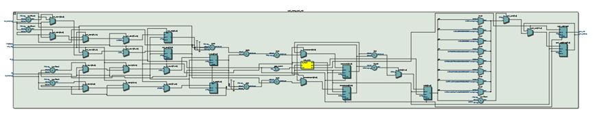
  
图8 血氧饱和度计算模块 RTL图

以下为血氧计算核心代码片段：
```Verilog
3'd0: begin
    if (calc_trigger) begin
        // 锁定当前周期 AC 与 DC 分量
        numerator   <= (red_max - red_min) * ir_max * 64'd100;
        denominator <= (ir_max - ir_min) * red_max;
        calc_state  <= 3'd1;
    end
end
3'd1: begin
    if (denominator != 0)
        ratio <= numerator / denominator;
    else
        ratio <= 32'd0;
    calc_state <= 3'd2;
end
3'd3: begin
    if (ratio < 32'd114)
        spo2_out <= uch_spo2_table[ratio];
    else
        spo2_out <= 8'd0;
    spo2_valid <= 1'b1;
    calc_state <= 3'd0;
End
```

上述代码实现了完整的血氧计算流程。

首先，在一个心跳周期内，模块持续追踪红光与红外光信号的最大值（$DC$ 分量）与最小值，用于计算交流分量 $AC = Max - Min$。当心率模块发出 `calc_trigger` 脉冲时，锁定当前周期的极值数据，并按照公式：

$$R = \frac{AC_{red} / DC_{red}}{AC_{ir} / DC_{ir}}$$

在硬件中等效转化为：

$$R = \frac{AC_{red} \times DC_{ir}}{AC_{ir} \times DC_{red}}$$

为避免小数运算带来的复杂性，设计中将分子额外乘以 `100` 进行比例放大。随后利用 `FPGA` 的整数除法运算求得比值 `ratio`。

在计算出 $R$ 值后，通过查找 `Maxim` 官方标定表 `uch_spo2_table` 将 $R$ 值映射为实际血氧百分比。该查表方式避免了复杂浮点运算，既提高运算速度，又降低硬件资源消耗，适合 `FPGA` 实时实现。

当查表完成后输出 `spo2_valid` 有效脉冲，并将计算结果输出至 `spo2_out`。至此完成一次完整的血氧计算流程。
### 3.4 MPU6050模块

#### **3.4.1** **初始化及读取模块**

该模块实现了对 `MPU6050` 三轴加速度数据的初始化配置与周期性读取控制。模块通过 `I2C` 主控制接口完成上电唤醒、量程配置以及 $50Hz$ 定时采样读取。

读取到的 6 个字节数据分别拼接为 $X$、$Y$、$Z$ 三轴 16 位加速度数据，并在一次完整更新后输出 `accel_valid` 脉冲，供后续计步算法模块使用。

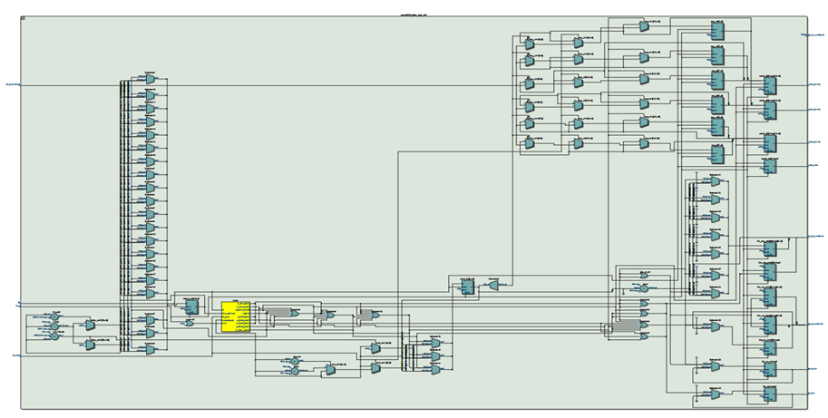  

图9 MPU6050 初始化及读取模块 RTL图

以下为核心控制代码片段：
```Verilog
// --- 第1步：唤醒 MPU6050 ---
S_PWR_REQ: begin
    i2c_req      <= 1'b1;
    i2c_wr_rd    <= 1'b0;          // 写
    i2c_reg_addr <= 8'h6B;         // PWR_MGMT_1 寄存器
    i2c_wr_data  <= 8'h00;         // 写入 0 唤醒
    state        <= S_PWR_WAIT;
end
// --- 第2步：配置 ±4g 量程 ---
S_CFG_REQ: begin
    i2c_req      <= 1'b1;
    i2c_wr_rd    <= 1'b0;          // 写
    i2c_reg_addr <= 8'h1C;         // ACCEL_CONFIG 寄存器
    i2c_wr_data  <= 8'h08;         // ±4g 量程
    state        <= S_CFG_WAIT;
end
// --- 依次读取 6 个加速度寄存器 ---
S_READ_REQ: begin
    i2c_req      <= 1'b1;
    i2c_wr_rd    <= 1'b1;              
    i2c_reg_addr <= 8'h3B + read_idx;   // 从 0x3B 开始递增读取
    state        <= S_READ_WAIT;
end
S_DATA_VALID: begin
    accel_x <= {reg_xh, reg_xl};
    accel_y <= {reg_yh, reg_yl};
    accel_z <= {reg_zh, reg_zl};
    accel_valid <= 1'b1;         
    state <= S_WAIT_SAMP;        
end
```

上述代码实现了完整的加速度数据采集流程。

首先，在上电后通过延时保证芯片稳定，然后向 `PWR_MGMT_1` 寄存器写入 `0x00`，退出休眠模式，实现芯片唤醒。接着向 `ACCEL_CONFIG` 寄存器写入 `0x08`，将加速度量程配置为 $\pm 4g$，提高动态检测范围。

初始化完成后，模块通过计数器产生 $50Hz$ 采样节拍。每到采样时刻，依次读取从地址 `0x3B` 开始的 6 个连续寄存器数据，分别对应加速度 $X$、$Y$、$Z$ 三轴的高低字节。所有数据读取完成后进行拼接，组合为 16 位有符号加速度数据，并输出一次 `accel_valid` 脉冲，表示三轴数据更新完成。

#### 3.4.2 加速度预处理模块

该 `step_pre_process` 模块用于对三轴加速度数据进行预处理，并自动选择振动幅度最大的轴作为当前计步主轴输出给后级计步状态机。

模块输入为 `accel_x`、`accel_y`、`accel_z` 以及数据有效信号 `accel_valid`，输出为选定主轴数据 `active_data` 以及对应的数据有效脉冲 `data_valid`。

在每次 `accel_valid` 有效时，模块首先根据当前主轴选择信号 `current_axis`，将对应轴的数据透传输出：

```Verilog
case (current_axis)
    2'd0: active_data <= accel_x;
    2'd1: active_data <= accel_y;
    2'd2: active_data <= accel_z;
    default: active_data <= accel_x;
endcase
data_valid <= 1'b1;
```

随随后模块在固定窗口内对三轴数据进行统计。在 $50Hz$ 采样率下，窗口大小设为 $50$ 个采样点，相当于 $1$ 秒更新一次主轴。窗口开始时，将当前采样值作为初始最大值和最小值；在窗口内部持续更新各轴的极值：

```Verilog
if ($signed(accel_x) > $signed(max_x)) max_x <= accel_x;
if ($signed(accel_x) < $signed(min_x)) min_x <= accel_x;
if ($signed(accel_y) > $signed(max_y)) max_y <= accel_y;
if ($signed(accel_y) < $signed(min_y)) min_y <= accel_y;
if ($signed(accel_z) > $signed(max_z)) max_z <= accel_z;
if ($signed(accel_z) < $signed(min_z)) min_z <= accel_z;
```

当窗口结束时，计算三轴的峰峰值差：

$$diff\_x = \$signed(max\_x) - \$signed(min\_x)$$

$$diff\_y = \$signed(max\_y) - \$signed(min\_y)$$

$$diff\_z = \$signed(max\_z) - \$signed(min\_z)$$

峰峰值代表该轴在 $1$ 秒内的振动强度。通过比较三轴的差值大小，选择振动幅度最大的轴作为新的主轴：

```Verilog
if (diff_x >= diff_y && diff_x >= diff_z)
    current_axis <= 2'd0;
else if (diff_y >= diff_x && diff_y >= diff_z)
    current_axis <= 2'd1;
else
    current_axis <= 2'd2;
```

最后重置计数器，并将当前采样点作为下一窗口的起始值。

#### **3.4.3** **步数检测模块**

该 `step_detector` 模块用于实现基于主轴加速度数据的步数检测功能。模块输入为来自 `step_pre_process` 的主轴数据 `active_data` 以及数据有效信号 `data_valid`，输出为检测到有效一步时产生的单周期脉冲信号 `step_pulse`。其核心包括动态阈值计算、滞回比较以及时间窗口约束三部分。

在数据有效时，模块首先进行动态阈值更新。以 $50Hz$ 采样率为例，每 $50$ 个采样点（$1$ 秒）更新一次阈值。窗口开始时初始化最大值和最小值，窗口内部持续更新极值：

```Verilog
if (win_cnt == 6'd0) begin
    max_val <= active_data;
    min_val <= active_data;
    win_cnt <= win_cnt + 1'b1;
end else if (win_cnt < UPDATE_WIN) begin
    if (active_data > max_val) max_val <= active_data;
    if (active_data < min_val) min_val <= active_data;
    win_cnt <= win_cnt + 1'b1;
end else begin
    threshold <= (max_val + min_val) >>> 1; // 计算动态阈值
    win_cnt <= 6'd1;
    max_val <= active_data;
    min_val <= active_data;
end
```

动态阈值计算公式为：

$$threshold = \frac{max\_val + min\_val}{2}$$

这样可以根据当前运动幅度自适应调整基准线，提高算法稳定性。

随后进入计步状态机部分。系统采用两状态结构：

- `S_BELOW`：数据在阈值下方
    
- `S_ABOVE`：数据在阈值上方
    

通过滞回比较实现抗干扰处理，上下触发条件分别为：

- 上触发：$threshold + NOISE\_MARGIN$
    
- 下触发：$threshold - NOISE\_MARGIN$
    

核心判断代码如下：

```Verilog
case (state)
    S_BELOW: begin
        if (active_data > (threshold + NOISE_MARGIN)) begin
            state <= S_ABOVE;
            step_timer <= 8'd0; // 开始计时
        end
    end
    S_ABOVE: begin
        if (active_data < (threshold - NOISE_MARGIN)) begin
            state <= S_BELOW;
            if (step_timer >= MIN_SAMPLES && step_timer <= MAX_SAMPLES) begin
                step_pulse <= 1'b1; // 输出一步脉冲
            end
        end
        else if (step_timer > MAX_SAMPLES) begin
            state <= S_BELOW; // 超时复位
        end
    end
endcase
```

为了避免误判，还引入了时间窗口约束。`step_timer` 用于记录一次“上升+下降”所经历的采样点数，只有当时间满足：

- 最小值：$MIN\_SAMPLES = SAMPLE\_RATE / 5$
    
- 最大值：$MAX\_SAMPLES = SAMPLE\_RATE \times 3 / 2$
    
即 $0.2$ 秒到 $1.5$ 秒之间，才认为是有效一步。这样可以过滤高频抖动和低频晃动带来的误触发。

### **3.5** **蜂鸣器模块**

该 `bt_buzzer` 模块用于在蓝牙连接或断开时，通过蜂鸣器播放提示音。模块输入为系统时钟 `sys_clk`、复位信号 `sys_rst_n` 以及蓝牙状态信号 `bt_state`（连接为 $1$，断开为 $0$），输出为蜂鸣器控制信号 `beep`。

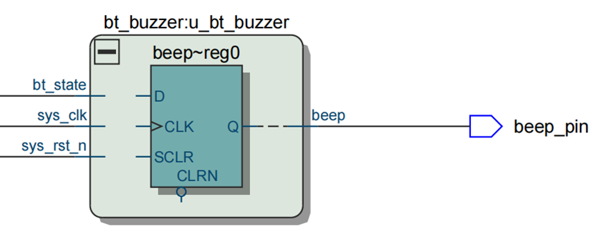
  
图12 蜂鸣器模块

首先对蓝牙状态信号进行两级寄存器同步，并进行边沿检测，用于捕捉“刚连接”或“刚断开”的瞬间：

```Verilog
wire connect_edge    = (bt_state_d0 == 1'b1) && (bt_state_d1 == 1'b0);
wire disconnect_edge = (bt_state_d0 == 1'b0) && (bt_state_d1 == 1'b1);
```

当检测到连接或断开边沿时，进入播放状态机。状态机分为三个状态：

- `0`：空闲状态
    
- `1`：播放第一个音
    
- `2`：播放第二个音
    

核心控制逻辑如下：

```Verilog
case (play_state)
    2'd0: begin
        if (connect_edge) begin
            play_state <= 2'd1;
            is_connect_event <= 1'b1;
        end else if (disconnect_edge) begin
            play_state <= 2'd1;
            is_connect_event <= 1'b0;
        end
    end
    2'd1: begin
        current_freq_max <= is_connect_event ? 16'd31887 : 16'd37936;
        if (duration_cnt < TONE_DURATION)
            duration_cnt <= duration_cnt + 1'b1;
        else begin
            duration_cnt <= 24'd0;
            play_state <= 2'd2;
        end
    end
    2'd2: begin
        current_freq_max <= is_connect_event ? 16'd37936 : 16'd31887;
        if (duration_cnt < TONE_DURATION)
            duration_cnt <= duration_cnt + 1'b1;
        else begin
            duration_cnt <= 24'd0;
            play_state <= 2'd0;
        end
    end
endcase
```

其中：

- 每个音符持续时间为 $0.2$ 秒
    
- `31887` 对应约 $784Hz$（$Sol$）
    
- `37936` 对应约 $659Hz$（$Mi$）
    

连接时播放 $Sol \rightarrow Mi$，断开时播放 $Mi \rightarrow Sol$，形成不同的提示音效果。

蜂鸣器驱动部分采用分频方式产生方波信号：

```Verilog
if (freq_cnt < current_freq_max) begin
    freq_cnt <= freq_cnt + 1'b1;
end else begin
    freq_cnt <= 16'd0;
    beep <= ~beep; // 翻转电平形成PWM波
end
```

通过对 $50MHz$ 系统时钟进行分频，生成对应频率的方波，从而驱动无源蜂鸣器发声。当状态机处于空闲状态时，蜂鸣器关闭。

### **3.6** **串口数据发送模块（蓝牙）**

该 `uart_tx` 模块用于实现串口数据发送功能，在 $50MHz$ 系统时钟下按照 $115200$ 波特率将 8 位数据按 `UART` 协议格式串行输出。模块输入为发送请求信号 `tx_req` 和待发送数据 `tx_data`，输出为串口发送引脚 `uart_txd` 以及发送完成脉冲 `tx_done`。

首先根据系统时钟频率和波特率计算每一位数据所需的时钟周期数：

$$BIT\_CNT\_MAX = \frac{SYS\_CLK\_FREQ}{BAUD\_RATE}$$

在 $50MHz$ 时钟、$115200$ 波特率下，每一位持续约 $434$ 个时钟周期。

通过 `baud_cnt` 计数器在发送期间进行计数，当计满一个比特周期后清零，驱动下一位发送：

```Verilog
if (baud_cnt == BIT_CNT_MAX - 1)
    baud_cnt <= 16'd0;
else
    baud_cnt <= baud_cnt + 1'b1;
```

主发送过程采用简单状态控制方式实现。空闲时串口线保持高电平（`UART` 空闲为 $1$）。当检测到 `tx_req` 且当前不忙时，锁存待发送数据并进入发送状态：

```Verilog
if (tx_req && !tx_busy) begin
    tx_busy     <= 1'b1;
    tx_data_reg <= tx_data; // 锁存数据
    bit_cnt     <= 4'd0;
end
```

在发送过程中，每当一个比特时间到达（`baud_cnt == BIT_CNT_MAX - 1`），根据 `bit_cnt` 依次输出起始位、8 位数据位以及停止位：

```Verilog
case (bit_cnt)
    4'd0: begin uart_txd <= 1'b0; bit_cnt <= bit_cnt + 1'b1; end // 起始位
    4'd1: begin uart_txd <= tx_data_reg[0]; bit_cnt <= bit_cnt + 1'b1; end
    // ... 2至7位略
    4'd8: begin uart_txd <= tx_data_reg[7]; bit_cnt <= bit_cnt + 1'b1; end
    4'd9: begin
        uart_txd <= 1'b1; // 停止位
        tx_busy  <= 1'b0;
        tx_done  <= 1'b1; // 发送完成
    end
endcase
```

`UART` 发送格式为：

- 1 位起始位（$0$）
    
- 8 位数据（低位先发）
    
- 1 位停止位（$1$）
    

当停止位发送完成后，拉高 `tx_done` 一个时钟周期表示本次发送结束，并回到空闲状态，等待下一次发送请求。

### **3.7** **数码管模块**

#### **3.7.1** **进制转换模块**

该 `bin2bcd` 模块用于将 8 位二进制数转换为三位十进制 BCD 码（百位、十位、个位），最大可表示 $0 \sim 255$。输入为 8 位二进制数 `bin`，输出为三位 BCD 码 `hun`、`ten`、`uni`，主要用于数码管显示。

模块采用经典的“移位加 3”（$Double\ Dabble$）算法实现二进制到 $BCD$ 的转换。首先在组合逻辑中将百位、十位、个位清零：

```Verilog
hun = 4'd0;
ten = 4'd0;
uni = 4'd0;
```

随后进行 8 次循环（对应 8 位二进制数据），从最高位开始逐位移入。在每一轮移位前，若当前某一位 $BCD$ 值大于等于 $5$，则加 $3$ 修正：

```Verilog
if (hun >= 5) hun = hun + 3;
if (ten >= 5) ten = ten + 3;
if (uni >= 5) uni = uni + 3;
```

这一“加 3”步骤用于保证在左移后仍然保持合法的 $BCD$ 编码格式。

接着执行整体左移操作，将高位依次向前传递，并将当前二进制位移入个位最低位：

```Verilog
hun = hun << 1;
hun[0] = ten[3];
ten = ten << 1;
ten[0] = uni[3];
uni = uni << 1;
uni[0] = bin[i];
```

通过这种方式，二进制数逐位移入 $BCD$ 结构中，最终得到正确的十进制表示。

**例如输入：**

`bin = 8'd123`

**转换后得到：**

`hun = 1`

`ten = 2`

`uni = 3`
#### **3.7.2** **显示模块**

该 `seg_driver` 模块用于驱动六位数码管进行动态扫描显示，实现心率（$Hr$）、血氧（$Sp$）和步数（$St$）三种模式的切换显示。模块输入包括数据位 `hun`、`ten`、`uni`，模式选择信号 `mode`，以及手指检测信号 `finger_on`，输出为位选信号 `sel` 和段选信号 `seg`。

首先通过 $1ms$ 分频计数器实现数码管动态扫描。在 $50MHz$ 时钟下计数到 `49,999` 产生 $1ms$ 周期，并轮流切换 6 个数码管位选信号：

```Verilog
if (cnt_1ms >= 16'd49_999) begin
    cnt_1ms <= 16'd0;
    if (scan_sel == 3'd5) scan_sel <= 3'd0;
    else scan_sel <= scan_sel + 1'b1;
end
```

通过 `scan_sel` 控制当前正在显示的数码管位置，实现快速轮询扫描，从视觉上形成稳定显示效果。

在组合逻辑部分，根据当前扫描位置决定显示内容。前三位用于显示数据值（百位、十位、个位），左侧两位用于显示模式前缀字符。例如：

```Verilog
3'd4: begin
    sel = 6'b101111;
    if      (mode == 2'd0) char_type = 4'd3; // r (Hr)
    else if (mode == 2'd1) char_type = 4'd6; // p (Sp)
    else                   char_type = 4'd7; // t (St)
end
3'd5: begin
    sel = 6'b011111;
    if      (mode == 2'd0) char_type = 4'd2; // H
    else if (mode == 2'd1) char_type = 4'd5; // S
    else                   char_type = 4'd5; // S (St)
end
```

因此三种模式对应显示为：

- `mode=0` $\rightarrow$ “$Hr$”
    
- `mode=1` $\rightarrow$ “$Sp$”
    
- `mode=2` $\rightarrow$ “$St$”
    

当 `finger_on` 为 $0$ 时，数据位显示为 “-” 提示未检测到手指；当高位为 $0$ 时自动消隐，实现更美观的显示效果。

最后根据 `char_type` 或数字数据生成对应的段码：

```Verilog
if      (char_type == 4'd2) seg = 8'b1000_1001; // H
else if (char_type == 4'd3) seg = 8'b1010_1111; // r
else if (char_type == 4'd5) seg = 8'b1001_0010; // S
else if (char_type == 4'd7) seg = 8'b1000_0111; // t
```

若为数字类型，则根据 `current_data` 输出 $0 \sim 9$ 的标准段码。

### **3.8** **数据通信与人机交互终端设计**

为实现传感器数据的远程可视化监控与深度健康分析，本系统配套开发了 PC 端上位机软件与移动端应用程序，并通过蓝牙串口透传模块（JDY-31）实现上下位机的数据交互 。

#### **3.8.1** **无线通信协议与数据帧格式**

系统采用自定义的串口通信帧格式来保证数据传输的可靠性与解析的准确性。在 $115200$ 的波特率下，每一帧数据包含帧头、数据段与帧尾，总长度固定。

1. **帧头标志**：采用 `0xAA` 和 `0x55` 作为双字节同步帧头，用于接收端的帧对齐检测。
    
2. **数据载荷**：依次传输 `MAX30102` 采集的红光（$Red$）与红外光（$IR$）原始数据。每种光数据占据 3 个字节（24位），按高位到低位的顺序进行截断与拆包发送。
    
3. **帧尾标识**：使用标准回车换行符 `0x0D` 和 `0x0A` 标识一帧的结束。
    

这种“双重校验（定长 + 首尾标识）”的设计，有效避免了无线传输过程中的数据粘包与错位问题。

#### **3.8.2 PC** **端上位机软件设计**

电脑端上位机采用 `Python` 语言及 `PyQt5` 框架开发，主要承担高强度的数据渲染与复杂算法验证功能。

1. **动态波形高速绘制**：借助 `pyqtgraph` 绘图引擎构建了双通道示波器界面，能够以高帧率平滑地绘制红光与红外光的实时容积脉搏波（PPG）波形，使微弱的生理信号变化过程直观可见。
    
2. **核心算法软解集成**：将 `Maxim` 官方的生理参数提取算法完整移植至 `Python` 环境中（`MaximAlgorithm` 类）。上位机在内存中维护了一个固定大小的计算滑窗（400 个采样点），利用一阶差分与滑动求和对交流与直流分量进行特征提取，最后结合血氧标准标定表（`uch_spo2_table`）完成心率与血氧饱和度的精确解算。
    
3. **深度健康评估模式**：针对日常体检场景设计了“15 秒精准测算”功能。系统在此模式下会进入免打扰状态，持续获取 15 秒的平滑采样并计算平均值。测算结束后，系统将根据心跳节律与血氧表现生成综合评分，并渲染输出一份包含医学建议的本地深度体检报告。

#### 3.8.3 移动端 App 设计

为提升设备的便携性与日常使用体验，开发了基于 `uni-app` 框架的移动终端应用程序。

1. **原生蓝牙 `SPP` 通信**：考虑到跨平台兼容性与底层硬件控制权，`App` 通过调用 `Android` 原生 `API`（`android.bluetooth.BluetoothAdapter`），利用传统蓝牙 `SPP` 协议的专属 `UUID` (`00001101-0000-1000-8000-00805F9B34FB`) 建立安全稳定的 `Socket` 数据流通道。
    
2. **高频缓冲与防错解析**：针对手机端蓝牙接收缓冲区的碎片化特性，设计了 20ms 定时轮询的单字节流读取机制。通过在内存中维护临时字节队列，严格按照协议寻找帧头帧尾进行解包，确保传入本地 `MaximAlgorithm` 计算核心的数据绝对完整。
    
3. **双模式状态机 `UI` 交互**：界面采用卡片式布局，包含“实时监测”与“15s 体检报告”两大核心板块。系统内置了智能评分器，能够根据解算出的平均心率和血氧（例如判断心率是否在 60∼100 BPM 正常区间，血氧是否大于等于 95%）进行动态扣分评级，并以直观的色彩标识（正常为绿色，预警为红色）向用户实时反馈生理健康状态。

## 4. 实体测试

[基于FPGA的智能健康检测手环系统_哔哩哔哩_bilibili](https://www.bilibili.com/video/BV19nPSzdEjw/?vd_source=b53244a9d943f1538fc8833a2c446b0b)
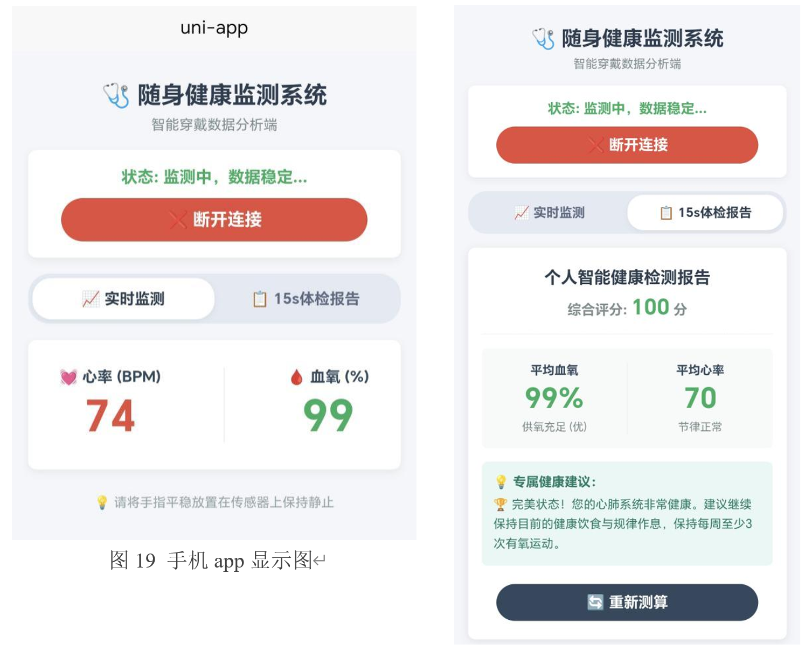
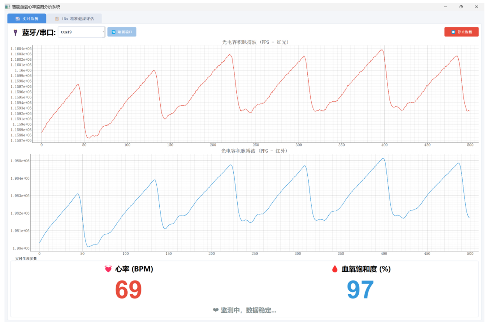

## 5.总结

本课程设计成功实现了基于FPGA的智能健康检测手环系统。我们采用Verilog硬件描述语言完成了各功能模块的设计，并在FPGA开发板上进行了下载与验证。系统以 MAX30102传感器为核心，实现了心率与血氧数据的采集；通过 I2C 通信模块完成对传感器的初始化配置与数据读取；利用数据处理模块对原始脉搏波形进行滤波与峰值检测，计算心率值；通过特征算法估算血氧饱和度；同时结合步数检测模块实现基础运动数据统计。最终通过数码管驱动模块进行动态扫描显示，并可根据模式切换显示心率、血氧和步数信息。实验结果表明，该系统能够稳定采集并显示人体健康参数，测量结果基本准确，系统运行可靠，达到了设计要求。

在系统实现过程中，我们在数据采集与算法实现方面遇到了较多问题。起初在进行心率计算时，直接采用简单阈值判断法进行峰值检测，但由于原始信号中存在噪声与波动，导致误判较多，数据不稳定。随后我们尝试增加滤波与延时判断机制，对信号进行平滑处理，同时加入有效检测标志位，提高峰值识别的准确性。在血氧计算部分，由于涉及多路数据比例运算，如果直接使用复杂浮点算法将占用大量硬件资源，不利于 FPGA 实现。为此我们改用整数运算与简化比例模型进行近似计算，在保证功能实现的前提下降低资源消耗。此外，在I2C通信调试过程中，也遇到时序不稳定和状态机跳转异常的问题，通过优化状态机设计、严格控制起始与停止信号的产生，最终实现了稳定的数据读写。

在综合资源与系统独立性的前提下，我们选择采用结构清晰、资源占用较低的实现方法，使系统既能够满足功能需求，又能够在有限硬件资源条件下稳定运行。通过逐模块调试与整体联调，最终成功完成了智能健康检测手环系统的设计。

因此，本课程设计成功实现了基于 FPGA 的智能健康检测手环系统，验证了 FPGA 在可穿戴健康检测领域中的应用潜力。通过本次课程设计，我们进一步掌握了 Verilog 语言设计方法，提升了FPGA系统架构设计与调试能力，加深了对数字信号处理、传感器通信与嵌入式系统实现流程的理解，并将理论知识有效应用于实践。

## 6.参考文献

[1] 徐向民，邢晓芬，等.VHDL数字系统设计[M].北京：电子工业出版社，2015.

[2] Maxim Integrated. MAX30102 High-Sensitivity Pulse Oximeter and Heart-Rate Sensor for Wearable Health[Z]. San Jose: Maxim Integrated Products, Inc., 2018.

[3] InvenSense. MPU-6000 and MPU-6050 Product Specification Revision 3.4[Z]. San Jose: InvenSense Inc., 2013.

[4] 张伟，李静，等. 基于MAX30102的便携式心率血氧仪设计[J]. 传感器与微系统，2020.