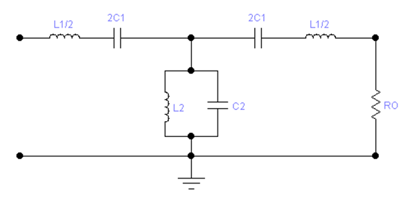

# 一、概述

## 1.1总体设计方案

众所周知，利用无线电通信系统可以将信息从一个地方传送到另一个地方。一个通信系统的基本组成结构如图1所示，主要由调制器、发射机、传输媒介、接收机和解调器组成。

图1-1  通信系统组成结构框图

## 1.2设计任务

本次实验的主要任务是设计一个基于锁相技术的频率调制器和解调器。其原理方框图如图1-2（a）和图1-2（b）所示。

图1-2（a）锁相环频率调制器原理方框图

图1-2（a）为锁相环构成的锁相调频电路系统框图。它主要由晶体振荡器、分频器、鉴相器、环路滤波器、放大器、压控振荡器组成。锁相调频电路能够得到中心频率稳定度很高的调频信号。实现锁相调频的条件是，调制信号的频谱要处于低通滤波器通带外，并且调制指数不能太大。这样，调制信号不能通过环路低通滤波器，因而在环路内不能形成交流负反馈，调制频率对环路无影响。锁相环只对VCO平均中心频率不稳定所引起的分量（处于低通滤波器通带内）起作用，使其中心频率锁定在晶振频率上。锁相调频克服了直接调频中心频率稳定度不高的缺点。这种锁相环路叫载波跟踪型PLL。

图1-2（b）锁相环频率解调器原理方框图

图1-2（b）所示为锁相环构成的锁相鉴频电路系统框图。它主要由带通滤波器、选频放大器、分频器、鉴相器、环路滤波器、放大器、压控振荡器组成。当输入为调频波时如果将环路滤波器的带宽设计的足够宽，保证鉴相器的输出电压顺利通过，则VCO就能跟踪输入调频波中反映调制规律变化的瞬时频率，即VCO的输出是一个具有相同调制规律的调频波。这时，环路滤波器输出的控制电压就是所需的调频波解调电压。称为调制跟踪型锁相环。

## 1.3设计基本要求

（1）掌握基于锁相技术的频率调制器和解调器的工作原理，组成结构。

（2）采用贴片元件设计一个基于锁相技术的频率调制器和解调器。

（3）给定频率调制器和解调器电路原理图以及相应的印制线路板图。根据给定的工作频率等设计技术指标对锁相环路中压控振荡、选频放大、带通滤波器、限幅放大器元件参数进行分析与计算。根据调制信号的频率等设计技术指标对环路低通滤波器的元件参数进行分析与计算。

（4）频率调制器和解调器能实现直联通信。

（5）记录环路各模块输入输出波形图，已调波频谱分析图等。

## 1.4设计技术指标

### 1.4.1调制技术指标

（1）输出幅度 :几百mv---2v

（2）载波频率：36MHZ

（3）频偏：△f≥10KHz

（4）电源电压：7.5—12V（经稳压后实际加到电路中的Vcc为5V电压）

（5）负载：50W 

（6）调制信号：可以传1KHz音频信号也可以传数字信号即M3序列信号

### 1.4.2解调技术指标

     （1）灵敏度：越高越好

（2）失真度：越小越好

（3）信噪比（S/N）：越高越好

（4）接收机带宽： ≤100KHz

（5）本振频率：根据调制器的工作频率自定

（6）电源工作电压：7.5—12V（经稳压后实际加到电路中的Vcc为5V电压）

## 1.5硬件开发环境

本实验的硬件开发环境由高频实验室提供，所使用的仪器和工具如下：

（1）印刷电路板、若干元器件和焊接工具

（2）直流稳压电源

（3）示波器

（4）函数信号发生器

（5）数字万用表

（6）频谱分析仪

（7）各类连接线

## 1.6软件开发环境

（1）利用Filter Solutions 2019设计发送端的低通LPF模块和接收端的带通BPF模块（计算元件参数以及参考幅频特性曲线）；

（2）利用软件Multisim14.3对发送端VCO模块以及接收端VCO模块进行仿真和元件参数调整，还有仿真发送端的低通LPF模块和接收端的带通BPF模块。

# 二、系统综述              

## 2.1系统组成

一个通信系统的基本组成结构如图图2-1所示，它主要有调制器、发射机、传输媒介、接收机及解调器组成。

图2-1 通信系统组成结构框图

## 2.2主要模块及其原理

### 2.2.1调制器模块

图2-2为锁相环构成的锁相调频电路系统框图。它主要由晶体振荡器、分频器、鉴相器、环路滤波器、放大器、压控振荡器组成。锁相调频电路能够得到中心频率稳定度很高的调频信号。实现锁相调频的条件是，调制信号的频谱要处于低通滤波器通带外，并且调制指数不能太大。这样，调制信号不能通过环路低通滤波器，因而在环路内不能形成交流负反馈，调制频率对环路无影响。锁相环只对VCO平均中心频率不稳定所引起的分量（处于低通滤波器通带内）起作用，使其中心频率锁定在晶振频率上。锁相调频克服了直接调频中心频率稳定度不高的缺点。这种锁相环路叫载波跟踪型PLL。

图2-2锁相环频率调制器原理方框图

### 2.2.2解调器模块

图2-3所示为锁相环构成的锁相鉴频电路系统框图。它主要由带通滤波器、选频放大器、分频器、鉴相器、环路滤波器、放大器、压控振荡器组成。当输入为调频波时如果将环路滤波器的带宽设计的足够宽，保证鉴相器的输出电压顺利通过，则VCO就能跟踪输入调频波中反映调制规律变化的瞬时频率，即VCO的输出是一个具有相同调制规律的调频波。这时，环路滤波器输出的控制电压就是所需的调频波解调电压。称为调制跟踪型锁相环。

图2-3锁相环频率解调器原理方框图

### 2.2.3锁相环

VCO模块产生中心频率为36MHz的输出信号，但是其电压控制电容，从而改变频率的原理会使中心频率不稳定，因此加入锁相环电路，稳定中心频率。VCO输出的信号经过除2预分频电路后，变为原来频率的一半f1，晶振参考电路输出稳定的18MHz，即f2。f1、f2同时输入鉴相器，二者的差值为鉴相器的误差电压。鉴相器输出的误差电压总是在某一范围内摆动，这个误差电压通过环路滤波器变成控制电压加到压控振荡器上，使压控振荡器输出的电压趋近于2f1。当f1、f2之间的差值不随时间变化而是一个恒定的常数，这时环路就进入“锁定”状态，从而使VCO的中心频率更加稳定。

锁相环原理如图2-4所示：

图2-4 锁相环原理图

# 三、发射系统

## 3.1电路概述

图3-1为锁相环构成的锁相调频电路系统框图。它主要由晶体振荡器、分频器、鉴相器、环路滤波器、放大器、压控振荡器组成。

图3-1锁相环频率调制器原理方框图

## 3.2参数设计

### 3.2.1压控振荡器

图3-2（a）压控振荡电路                                                    

图3-2（b）交流等效电路                                                    

本次实验，频率调制器和解调器中采用相同的压控振荡电路。压控振荡电路如图3-2（a）所示。交流等效电路如图3-29（b）所示。

L2、C6并联谐振回路的频率为f=1/( )。

压控振荡器中心频率F=1/( )。

交流等效电路中L1为原电路L2；C7、C5、C2分别为原电路中C3、C11、C7；选频网络L2、C6为原电路C42、L7；C4为原电路中可调电容CR3，C1（原电路中CR2）、C3（原电路中CR1）为原电路图中变容二极管背靠背串联时在静态工作点处的等效电容，查阅元件手册可知C1、C3均等效为25.0pF(V=2.5V)

图3-2（c）使用Multisim绘制的压控震荡电路

图3-2（d）使用Multisim绘制的波形图

结合实际情况，由于提供的元件种类有限，因此考虑计算每一种可能的参数组合并从中选取最优值。当原电路中，选择参数为：L2=100nH，L7=390nH，C3=300pF，C1= 100nF，C7=680pF，C11=300pF，C42=51pF时，计算出:

$$
\begin{align*}
f &= \frac{1}{2\pi\sqrt{C_6 \cdot L_2}} = \frac{1}{2\pi\sqrt{C_{42} \cdot L_7}} \\\\
  &= \frac{1}{2\pi\sqrt{51 \times 390 \times 10^{-21}}} = 35.686 \, \text{MHz}
\end{align*}
$$

中心频率可调范围为

$$
\begin{align*}
F &= \frac{1}{2\pi\sqrt{(C_3 + C_1 + C_4 + C_7//C_5//C_2) \cdot L_1}} \quad (\text{交流等效电路}) \\\\
  &= \frac{1}{2\pi\sqrt{(CR_1 + CR_2 + CR_3 + C_3//C_{11}//C_7) \cdot L_2}} \quad (\text{原电路}) \\\\
  &= \frac{1}{2\pi\sqrt{\left(25 + 25 + (6.3 \sim 30) + 300//300//680\right)\text{pf} \cdot 100\text{nH}}} \\\\
  &= 35.333 \sim 37.597 \, \text{MHz} \quad \text{符合指标要求}
\end{align*}
$$

### 3.2.2 LPF低通滤波器
使用滤波器设计软件Filter Solution设计7阶低通滤波电路，截频设置为58MHz，软件生成的电路图及其频率特性下图所示：
     

图3-3 使用Filter Solution生成的7阶LPF电路及其频率响应

   在上述设计的基础上，对参数进行调整，使用可获得的元件数值进行设计，使用Multisim绘制电路图并仿真，结果如下图所示：

图3-4 使用Multisim绘制的7阶LPF电路

图3-5 使用Multisim仿真的7阶LPF电路频率特性

   经过调整，最终得到实用LPF电路元件参数：C6=C9=24pF，C12=C15=100pF，L3=L4=180nH，L5=270nH。

## 3.3单元电路

### 3.3.1压控振荡器

本次实验，频率调制器和解调器中采用相同的压控振荡电路。压控振荡电路如下图所示：

图3-6 压控振荡电路

在图3-6所示压控振荡器电路中，CR1，CR2为变容二极管。CR1提供2.5V的直流偏压。变容二极管CR2上的控制电压来自于环路滤波器的输出电压，反映了压控振荡器瞬时频率的变化规律。

图3-7 压控振荡器的交流通路

图3-7所示为压控振荡器的交流通路；其振荡类型为改进型电容三端式振荡器，具有频率稳定度高，输出波形平稳等优点。采用两个变容二极管背对背串联的好处在于减小加在每个变容二极管上的高频电压，以利提高频率稳定度。

### 3.3.2放大电路

   图3-8所示为非谐振高频放大器，主要作用是对压控振荡器产生的正弦波调制信号进行放大，以推动后级的分频电路。要求输出电压幅度足够大，至少大于3.5V以上。图中R13,R14,R15组成直流偏置电路，主要为放大器提供合适的偏置，保证放大器工作在放大状态。

图3-8 放大电路

### 3.3.3分频电路

图3-9所示为除2分频器（配合晶振）。主要作用是将放大后的正弦波调制信号进行除2分频，得到整形后的方波信号，送到鉴相电路的时钟输入CLK端口，即TP9端，并与来自晶体参考频率的振荡信号进行相位比较。

图3-9 除2分频电路

### 3.3.4参考频率振荡电路

图3-10所示为高稳定性的晶体振荡电路。
主要作用是产生一个与经过二分频的压控振荡器频率相等的参考频率。
并将此信号送到鉴相器与经过二分频的压控振荡器的信号进行相位比较。

图3-10 晶体振荡电路

### 3.3.5鉴相电路

图3-11(b)所示为鉴相电路，主要由两个具有复位功能的D触发器作状态寄存器构成。设D触发器为上升沿触发，且经过二分频的压控振荡器的信号和晶振振荡器的参考频率信号分别作为两个D触发器的CP。触发器的数据端D接高电平，输出取自Q5和Q9。复位后的初始状态Q5Q9=00，当CP信号，（即参考晶振频率信号fR）上升沿来到时，Q9=1，Q5保持为0，直到经过二分频的VCO信号fV的上升沿到来，Q5变为1，此时两个D触发器的输出变为Q5Q9=11，通过D6D3R32组成的或电路，`Q5`Q9=00，使两个D触发器复位，回到初始状态Q5Q9=00。由此可看出，只有一个短暂的时间（二极管和触发器的时延）使两个D触发器同时置1，因此电路不可能在Q5Q9=11状态停留，另一方面Q5Q9有一段时间同时为高，但是它们的平均值仍然正确反映了输入频率与相位的差值。

   图3-11(b)所示鉴相电路的功能是取出两输入信号的相位差，通过低通滤波器将相位差转变为控制VCO的平均电压。

图3-11（a） fR> fV

图3-11（b） 鉴相电路

### 3.3.6环路滤波器

环路滤波器(LF)是低通滤波器，它是由电阻、电容可能还有放大器组成的线性电路。它的输入是鉴相器的输出电压，它滤除鉴相器输出中的高频成分和噪声，取出平均分量去控制压控振荡器的频率。环路滤波器还有一个重要作用，即决定稳定进行PLL环路控制的传输特性。

PLL电路是闭环电路，类似负反馈电路，要保证电路的稳定性，环路滤波器必须在中心频率处，相位控制在30°~50°。一般的低通滤波器是滞后滤波器，相位滞后太大，因此PLL的环路滤波器一般采用滞后超前滤波器。即在图4-9中，相比普通的低通滤波器，增加了R40,R39两个电阻。

图3-17为采用差分放大器将Q1Q2两路鉴相信号变换为平均电压输出的原理电路。

   图3-12 用差分放大器转换Q1Q2

图3-13为本次实验中采用的滤波电路。主要功能是将鉴相器输出脉冲Q5Q9的宽度转换为平均电压输出，这里采用的方法主要是将D触发器Q5Q9输出的脉冲先经过低通滤器，这里Q5输出的脉冲经过R20C36低通滤器，另一路Q9输出的脉冲经过R21C37低通滤器后，再进行差值比较放大。环路滤波器输出的

平均电压反映了D触发器Q5Q9两路输出相位信息。

若两路信号同频同相，则环路滤波器输出一稳定的直流电压。

图3-13 环路滤波电路

### 3.3.7 LPF低通滤波电路

图3-15（a）为低通滤波网络，其归一化后低通滤波网络的传输函数可写为 或 ，式中n为任意正整数。按此式画出的曲线如图3-14所示，具有最平特性曲线。

图3-14 归一化后的低通滤波衰减特性界限图

给定滤波网络和衰减特性界限图如图3-15（b）所示。

图3-15 (a)中VS为滤波网络的输入电压，

为容许的通带最大衰减（若为3db），

指容许的最低衰减值(若为40db)，RS为信号源内阻，

RL为其负载电阻，ωc指通带边缘角频率，ωS指阻带边缘角频率。

（a）滤波网络

(b)衰减特性界限图

图3-15滤波网络和衰减特性界限图

下图为实际7阶低通滤波电路

图3-16 滤波电路

已知选定的低通滤波器的衰减特性，信号源内阻RS、负载电阻RL。RS=RL=50Ω。工作频率为36MHz，截止频率大约为58MHZ，阻带衰减大约40db，主要用来滤除VCO振荡器中的噪声。

### 3.3.8音频放大电路

这是一个电压并联负反馈放大电路。R5是负反馈电阻，将输出放大电路的音频信号引回输入端，提高放大器的稳定性,改善放大器的线性度,降低放大器的噪声,改变放大器的输入输出阻抗。放大器的输出信号送到开关S7的管脚1处，当S7接通1-2时，音频信号经过放大后进入VCO电路进行调频。音频信号可从MIC或J1 PJ30240输入。电路参数如图：

图3-17 音频放大电路

# 四、接收系统

## 4.1电路概述

图4-1所示为锁相环构成的锁相鉴频电路系统框图。它主要由带通滤波器、选频放大器、分频器、鉴相器、环路滤波器、放大器、压控振荡器组成。

图4-1锁相环频率解调器原理方框图

## 4.2参数设计

### 4.2.1压控振荡器

图4-2 压控振荡电路

本次实验，频率调制器和解调器中采用相同的压控振荡电路，接收机的压控振荡电路的元件参数为：
L10=390nH、C55=51pF、L6=100nH、C30=680pF、C32=300pF、C28=100pF

并联谐振回路的频率
$$
\begin{align*}
f &= \frac{1}{2\pi\sqrt{C_{55} \cdot L_{10}}} \\\\
  &= \frac{1}{2\pi\sqrt{51 \times 390 \times 10^{-21}}} = 35.686\,\text{MHz}
\end{align*}
$$

压控振荡器中心频率：
$$
\begin{align*}
F &= \frac{1}{2\pi\sqrt{(CR_1 + CR_2 + C_{28}//C_{30}//C_{32}) \cdot L_6}} \\\\
  &= \frac{1}{2\pi\sqrt{\left(25 + (6.3 \sim 30) + 100//680//300\right)\text{pf} \cdot 390\text{nH}}} \\\\
  &= 35.077 \sim 38.558\,\text{MHz} \quad \text{符合指标要求}
\end{align*}
$$

### 4.2.2 BPF带通滤波器

利用Fliter Solutions Zvan 2019设计BPF带通滤波电路，选择Band Pass带通滤波类型,中心频率Center Freq设为36MHz, Pass Band Width带宽设置为8MHz, Source Res输入电阻和Load Res输出电阻设置为50Ω。其界面显示如下：

结合现有元件参数，选择3阶电路图如下，其中各元件参数为：

C59=19.65pF(可调6.3-30pF), L7=1uH，C60=19.65pF(可调6.3-30pF)，L9=1uH

L8=24nH， C52=800pF

图4-4 3阶Butterworth带通滤波电路和频响曲线

根据电路图得到的频率响应曲线如下图，可以看到在-3db处的频率分别约为32MHz与40MHz，与设计基本相符，通带长达8M Hz，可有效滤除通带外的频率分量。

## 4.3单元电路

### 4.3.1压控振荡器

图4-6 压控振荡电路

本次实验中调制器和解调器中采用相同的压控振荡电路，在此省略。

### 4.3.2 BPF带通滤波电路

在解调器的前端加带通滤波，主要作用是频率预选，对其它干扰噪声有足够衰减.图4-12所示为K式带通滤波电路。串联臂由两个L7、CR3串联谐振电路所代替，L8、C52组成并联谐振电路。

图4-7 所示为K式带通滤波原理电路

图4-8 K式带通滤波电路

图4-9 衰减特性

### 4.3.3高频小信号谐振放大电路

图4-10所示为本次实验中采用的两级相同的高频小信号谐振放大电路。第一级中的各元件作用说明如下： R3R10R11提供稳定的直流偏置，C10C6为耦合电容，C11C12为旁路电容，L1CR5组谐振回路，Q3为晶体管放大器，D2为双相限幅电路，C3C1R1组成电源去耦电路。

主要功能为选频放大。对高频小信号谐振放大器要求是：增益（放大系数）高，通频带宽，选择性好，矩形系数越接近1越好，工作稳定性好，噪声系数_N_F小，_N_F越接近1越好。

图4-10 高频小信号谐振放大电路

### 4.3.4鉴相电路

   同发射板鉴相电路。

### 4.3.5环路滤波电路

   同发射板环路滤波电路。

### 4.3.6音频放大电路

   同发射板音频放大电路。

# 五、调试

## 5.1发射机

发射机的调试目标是确保能够生成稳定、频率正确且可被调制的射频信号。

1.供电检查：在焊接完成后，首先使用万用表检查电源部分是否存在短路或开路。确认无误后，接入稳压电源，测量关键点的电压，如VCC是否为稳定的+5V，确保各芯片和三极管供电正常。

2.压控振荡器 (VCO) 调试：这是发射机的核心。首先断开锁相环路（如将跳线S2短接1-2，断开与鉴相器的连接），独立测试VCO。在TP17处施加一个固定的直流电压（如通过电位器调至2.5V），然后在TP5处用示波器或频谱分析仪观测VCO的输出。

调试结果：能观测到稳定的正弦波。通过调节可变电容CR3，使其中心频率在36MHz附近。

3.锁相环 (PLL) 调试：在VCO基本正常后，接通锁相环路（连接S2）。使用频谱分析仪在TP5或J2输出端进行观测。

调试结果：环路能正常锁定，输出一个稳定在36MHz的单音载波信号，频谱纯净，无明显杂散。

4.音频调制调试：将音频信号（如1kHz正弦波）输入至音频放大电路，并通过跳线S7连接至VCO的调制输入端。在J2处用频谱分析仪观测已调信号。

调试结果：在此步骤的初步调试中，我们遇到了一个关键问题。我们发现，尽管在音频放大器的输出端 TP2 能用示波器观测到正常的、经过放大的音频信号，但在频谱仪上观测 J2 输出时，却只有稳定的36MHz载波信号，频谱并未随音频输入而展宽，没有出现任何边带。

这一现象直接表明，调制信号未能成功耦合至VCO的输入端。我们随即采用信号追踪法进行排查，确认了信号在 TP2 正常，但在VCO的调制输入端 TP3 处却检测不到任何交流音频分量。问题点因此被锁定在 TP2 与 TP3 之间的链路上，即开关S7和耦合电容C2（如下图)。经仔细的目视检查，最终发现 C2电容存在虚焊，其一端引脚与焊盘接触不良，导致信号路径中断。

在对C2进行补焊、确保连接可靠后，我们再次进行测试。此时，调制信号成功加载至VCO，频谱分析仪上立即显示出清晰的调频波频谱，边带分布符合理论预期。这个问题解决了我们调试初期的一个重大障碍，也让我们深刻认识到焊接质量对于电路性能的决定性影响。

图5-1 音频放大电路

## 5.2接收机

接收机的调试目标是确保能够正确接收、放大并解调出原始音频信号。

1.供电检查：同发射机，首先进行严格的电源检查，确保接收板各部分供电正常。

2.本振VCO及PLL调试：接收机的本地振荡器同样采用VCO和PLL结构。调试方法与发射机类似，先独立测试VCO（在TP12处施加2.5V电压），调节其中心频率，使其能工作在36MHz附近。然后闭合环路，检查PLL是否能稳定锁定。

3.高频放大及带通滤波调试：从J4端口输入一个36MHz的微弱信号（可使用信号发生器或已调好的发射机）。用示波器或频谱仪依次检查带通滤波器（BPF）后、两级谐振放大器后的信号。

调试结果：信号应能顺利通过BPF，并被两级放大器有效放大，且非中心频率的信号得到抑制，验证射频前端的选择性和放大能力。

## 5.3收发联调

在发射机和接收机均能独立正常工作后，进行系统联调。

1.有线联调：首先采用有线连接方式，用同轴电缆将发射机的J2输出端与接收机的J4输入端直接相连。在发射机端输入1kHz音频信号。

调试结果：在接收机的解调输出端TP14处，用示波器应能观测到与输入端频率相同、波形失真较小的1kHz正弦波。这表明从调制、传输到解调的整个链路已经打通。

无线联调：有线联调成功后，分别给发射机和接收机接上天线，进行无线通信测试。将两块板放置在一定距离（如30cm）内。

调试结果：重复有线联调的步骤，TP14处仍应能观测到清晰的解调波形。逐步拉远距离，观察解调信号的质量变化，测试系统的有效通信距离。

通过以上分步调试和最终联调，我们确保了系统的各项功能模块均工作在设计状态，为后续的性能指标测试（第六部分）奠定了坚实的基础。

# 六、测试

## 6.1发射机

### 6.1.1发射端与接收端压控振荡器VCO中心频率的调整与测试

检测条件：供电电压 9V。

检测方法：调制器中压控振荡器VCO调试步骤如下：

首先，不加音频控制电压，环路断开，将跳线S2短接1^2、与参考电压连接，调接电位器使TP17处对地直流电位为2.5V，此时加到变容二极管CR2上直流电压为2.5V；

第二步 用示波器观测压控振荡器VCO中心频率，可以在TP5处观测，或用频谱分析仪在S1端观测压控振荡器VCO中心频率,此时跳线S1用隔直耦合电容(0.01-0.1)短接1^2，调节振荡回路电容CR3，使VCO的中心频率为设计所需的频率值。

第三步 加入1khz音频信号，即将跳线S7短接1^2与音频放大器的输出相连。可用示波器在TP6处观测调频波形。也可以将FM波经LPF低通滤波器后，在TP7处观测，并记录波形（幅值、失真等）。

解调器中压控振荡器VCO调试步骤如下：

首先,环路断开,将跳线S2短接2^3与参考电压连接,调接电位器使TP12处对地直流电位为2.5V,此时加到变容二极管CR2上直流电压为2.5V;

第二步 用示波器观测压控振荡器VCO中心频率,可以在TP11处观测,或用频谱分析仪在J5端(此时跳线S3短接3^2)观测压控振荡器VCO中心频率,调节振荡回路电容CR3,使VCO的中心频率为设计所需的频率值。

检测结果如下图：

图6-1 发射端VCO（TP5）输出波形

图6-2 加入1khz音频信号的发射端TP6调频波输出波形

图6-3 接收端VCO（TP11）输出波形

### 6.1.2 FM波频谱与带宽的测试

  检测条件：供电电压 9V。

检测方法：利用频谱分析仪测试FM波频谱与带宽。

  为了匹配，衰减器的输入阻抗和输出阻抗都为50Ω，再通过50Ω的同轴电缆线送入频谱分析仪，通过对频谱分析仪的有效设置，可获得调频波的频谱图，注意中心频率、扫宽、分辨率带宽、视频带宽的设置，并注意调节调制信号的幅度，使调频信号的频偏合适。

检测结果如下图所示：

图6-4 载波频谱

图6-5 加1kHz幅度较小的正弦波调制信号调频波频谱

图6-6 加1kHz正弦波调制信号调频波频谱

### 6.1.3 LPF低通滤波器的测试

   检测条件：⽆需供电。

检测方法：利用频谱分析仪（带TG）测试低通滤波器的幅频特性。将跳线帽S1短接1和2，J4接入TG信作为低通滤波器的输入，低通滤波器的输出（J2）接频谱分析仪的输入，低通滤波器是无源电路，测试时无需电源，频谱分析仪注意打开跟踪源。

图6-7  -3dB归一化LPF幅频特性曲线

图6-8  -40dB归一化LPF幅频特性曲线

检测结果：可见，-3dB时截止频率约为45.65MHz，-40dB时频率约为82.8MHz。

## 6.2接收机

### 6.2.1 BPF带通滤波器的测试

检测条件：⽆需供电。

检测方法：利用频谱分析仪（带TG）测试带通滤波器的频响曲线。将跳线帽S1短接2和3，J1接入TG信号作为带通滤波器的输入，带通滤波器的输出（J5）接频谱分析仪的输入，记录中心频率及3dB带宽。

图6-9  BPF频响曲线

检测结果：由上图可知，BPF带通滤波器的中心频率为36.02MHz，3dB带宽为6MHz。

### 6.2.2两级谐振放大器的频响曲线测试

检测条件：供电电压 7.5-12V，函数信号发⽣器提供调频波信号，载波频率为指定中⼼频率，调制信号 1KHz 正弦波，频偏⼤于等于 10KHz，幅度⾃定

检测方法：利用频谱分析仪测试谐振放大器的频响曲线。将跳线帽S1短接1^3，跳线帽S3短接1^2。高频信号从J4加到谐振放大器的输入端，谐振放大器的输出端J5(跳线帽S1短接1^2，）接示波器的输入。

检测结果：两级谐振放大电路的谐振频率为36.016666MHz，电压增益为20db以上，满足要求。

图6-10 两级谐振放大频响曲线

## 6.3收发综合测试

### 6.3.1调制器解调器直连测试

     检测条件：发射板、接收板供电电压均 7.5-12V，发射板加 1~20KHz（可在⼤ 于 20KHz 条件下继续测试）正弦波调制，幅度⾃定，连接发射板 J2 与接收板 J4。

检测方法：将调好的“FM发射”板与“FM接收”板通过电缆线直接联结，并在“FM接收”板TP14处用示波器观测波形。

检测结果：如下图所示，调频波成功完成传输并解调，波形无明显失真，解调波波形和频率与音频信号相同。

图6-11 直连测试1kHz调制信号的解调结果

### 6.3.2无线收发测试

发射板和接收板均接上天线，用示波器观测接收板TP14的波形，波形正确解调，且无明显失真，稳定的无线收发距离约为33cm，如下图。

图6-12 无线通信测试1kHz调制信号的解调结果

# 七、思考题

##   
7.1环路滤波器的设计原理

图7-1 环路滤波器电路图
这张电路图展示的是一个有源环路滤波器，它通常用在锁相环系统中。其核心作用是处理来自鉴相器的误差信号，并生成一个平滑、稳定的直流电压，用于控制压控振荡器，从而实现频率的锁定。

这个滤波器的设计原理可以从以下几个关键部分来理解：

**1. 整体结构：有源二阶或更高阶的PI滤波器**

该滤波器以运算放大器 **U4A (TLC272)** 为核心，构成了一个**有源积分器**。整体上看，这是一个**比例积分**型的滤波器，并带有额外的高频滤波环节，使其成为一个二阶或更高阶的滤波器。

·        **积分作用**：实现锁相环无静差跟踪的关键。

·        **比例作用**：通过引入零点来保证环路的稳定性。

·        **高频极点**：用于滤除鉴相器产生的高频噪声和参考杂散。

**2. 积分作用** **—— 实现精确锁定**

·        **核心元件**：运算放大器 **U4A** 和主积分电容 **C50 C49(33nF)**。

·        **原理**：运放和电容构成了这个滤波器的核心——**积分器**。当鉴相器输出误差脉冲时，这些脉冲会通过输入电阻对电容C50进行充电或放电。积分器的作用就是“累积”这些误差。只要存在微小的相位误差，积分器就会持续改变其输出电压，直到这个误差被完全消除为止。

·        **目的**：**确保锁相环没有稳态相位误差**。正是因为这个积分环节，PLL才能在锁定后，让VCO的输出频率和相位与参考信号保持极高的同步精度。这是实现高精度频率合成的基础。这个积分作用在传递函数中表现为一个位于原点的**极点**。

**2. 比例作用****—— 保证环路稳定**

·        **核心元件**：电阻 **R40 R39(100R)**。

·        **原理**：如果只有纯粹的积分作用，锁相环的响应会很慢且容易产生过冲和振荡，非常不稳定。通过在积分电容C50上串联一个电阻R40，我们在滤波器的传递函数中引入了一个至关重要的**零点**。

·        **目的**：**提升相位裕度，保证整个锁相环路的稳定性**。这个零点的作用是在环路增益接近1的关键频点上，提前“拉升”相位，提供足够的相位裕度（Phase Margin），就像给一个摇晃的系统增加了阻尼。它能有效防止环路振荡，并优化锁相的瞬态响应（即锁定速度和过程）。

**3. 高频滤波** **—— 提高输出信号纯净度**

·        **核心元件**：其他电容和电阻，以及输入端的 **C36/C37**。

·        **原理**：鉴相器本身是数字逻辑电路，它的工作会产生高频的开关噪声和参考频率的杂散信号。这些高频成分如果直接送给VCO，会对VCO的输出频谱造成调制，产生不希望的杂波，降低信号质量。

·        **目的**：**滤除高频噪声和参考杂散**。电路中加入的这些额外的RC网络，会在高频段引入更多的**极点**。每一个极点都像一个低通滤波器，对超过其频率点的噪声进行衰减。这些高频极点确保了最终输出给VCO的控制电压是“干净”的直流，从而得到一个频谱纯净的输出信号。

**设计总结**

总而言之，这个环路滤波器的设计是一个精巧的平衡艺术，设计师通过精心选择这些电阻和电容的数值，来**配置零点和极点的位置**，从而：

1.  用积分器（原点极点）来获得高精度锁定。

2.  用串联电阻（零点）来保证系统稳定性和良好的动态响应。

3.  用额外RC网络（高频极点）来抑制噪声，提高信号纯净度。

这些参数的权衡，最终决定了锁相环的**环路带宽**、**锁定时间**、**相位噪声**和**杂散抑制**等关键性能指标。

# 八、总结

通过为期一周的课程设计，我们小组成功设计、制作并调试了一个基于锁相环技术的调频通信系统，基本实现了预定的设计目标。在这次课程设计中，我主要负责**接收机部分的设计与调试工作**，这是一次将理论知识付诸实践的宝贵经历，让我受益匪浅。

在我的工作中，一项核心任务是**接收机中频带通滤波器（BPF）的设计**。为了从混杂的信号中准确提取出所需的中频信号，同时有效抑制邻道干扰和噪声，我首先利用ADS或Filter Solutions等专业软件进行了理论计算和初步设计。随后，结合实验室现有的电容、电感元件参数，在Multisim软件中进行了多次仿真和优化调整，最终确定了滤波器的拓扑结构和元件数值。这个过程让我深刻体会到，理论指标与实际元件参数之间存在的差异，以及通过仿真不断迭代优化对于实现设计目标的重要性。

此外，我还全程参与了整个**接收板的元件焊接与调试工作**。由于电路板采用了大量贴片元件，这对焊接技术和耐心提出了很高的要求。这个过程让我深刻体会到，一个看似微小的焊接失误，如虚焊或短路，都可能导致整个模块增益不足、频率偏移甚至无法正常工作，从而给后续的系统联调带来巨大困难。通过反复排查和耐心调试，我不仅掌握了贴片元件的焊接技巧，更对信号在电路板上的实际传输路径与可能出现的故障点有了更直观、更深入的认识。

总而言之，本次课程设计是一次全面的综合性训练。它不仅让我将《高频电子线路》课程中学到的混频器、滤波器、锁相环等理论知识融会贯通，更重要的是，通过亲手设计、焊接、调试和测试，我掌握了从理论到实践的完整工程流程。解决调试过程中遇到的各种问题的经历，也极大地提升了我分析问题、解决问题的能力以及熟练使用示波器、频谱分析仪、信号发生器等专业仪器的能力。这次宝贵的实践经历为我未来的学习和工作打下了坚实的基础。

在此，特别感谢邓洪波老师在整个过程中的悉心指导和耐心解答。

# 九、参考文献

[1] 邓洪波，梁志明，王云.通信电子线路实验指导书[M]. :华南理工大学出版社, 2021. 1-122.

[2] 张肃文.高频电子线路[M]. 北京:高等教育出版社, 2009.

# 附录 实物图

