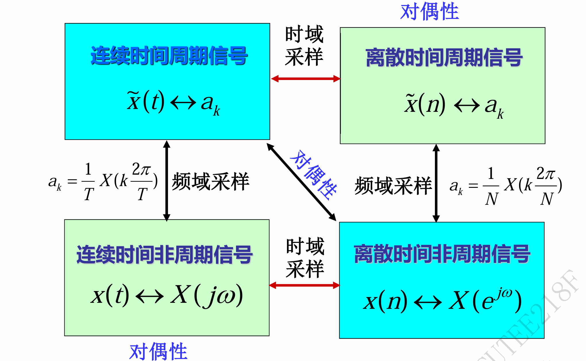

## 第一章 信号与系统 (S&S)📚
### 1.1 基本概念

#### 1.1 信号的概念

1.  **消息 (Message)** ✉️
    *   通常指来自外界的各种报道，反映了知识状态的改变。
2.  **信息 (Information)** 💡
    *   信息论术语，指消息中有意义的内容。
3.  **信号 (Signal)** 📈📉
    *   信号是信息的载体，信息通过信号传递。
    *   信号通常表示为一个或多个独立变量（自变量）的函数，携带着物理现象的相关信息。
    *   常见的电信号（电压、电流等）是时间或其他变量的函数。
    *   **一维信号**: 单个独立变量的函数。 (本课程主要讨论)
    *   **n维信号**: n个独立变量的函数。

#### 1.2 系统 (System)

1.  **定义** ⚙️
    *   信号的产生、传输和处理需要物理装置，称为系统。
    *   系统是对输入信号进行处理或变换，产生输出信号的实体。
    *   系统是由若干相互作用、相互依赖的部分组合而成的具有特定功能的整体。
    *   系统概念广泛，可以是物理的或非物理的，简单的或复杂的。
2.  **系统模型**
    *   **基本模型**:
        输入信号 (激励) → [ 系统 ] → 输出信号 (响应)
        $x(t)$ or $x[n]$ → [ System ] → $y(t)$ or $y[n]$
    *   **通信系统示例**:
        消息 → 转换器I → 发射机 → (信道) → 接收机 → 转换器II → 消息
    *   **图像处理示例**:
        原图像 → [ 噪声干扰系统 ] → 含噪图像 → [ 图像恢复系统 ] → 恢复图像
3.  **系统分类 (按输入输出数量)**
    *   **单输入单输出 (SISO) 系统**: 只有一个输入和一个输出。
        $f(\cdot) \rightarrow [\text{SISO System}] \rightarrow y(\cdot)$
    *   **多输入多输出 (MIMO) 系统**: 有多个输入和多个输出。
        $f_1(\cdot), ..., f_p(\cdot) \rightarrow [\text{MIMO System}] \rightarrow y_1(\cdot), ..., y_q(\cdot)$

### 1.2 信号的分类

#### (1) 确定信号 与 随机信号

*   **确定信号 (Deterministic Signal)**: 信号的取值在任何时刻都是确定的，可以用明确的数学函数描述。
*   **随机信号 (Random Signal)**: 信号的取值具有不确定性，无法用明确的数学函数描述，需要用概率统计方法。 (本课程主要研究确定信号)

#### (2) 连续时间信号 与 离散时间信号

*   **连续时间信号 (Continuous-Time Signal)**: 在连续的时间范围内有定义，自变量 $t$ 是连续的。表示为 $x(t)$。
*   **离散时间信号 (Discrete-Time Signal)**: 仅在离散的时刻点上有定义，自变量 $n$ 是整数。表示为 $x[n]$。
    *   离散时间信号也常称为 **序列 (Sequence)**。
    *   $n$ 称为序号。

#### (3) 模拟信号、抽样信号 与 数字信号

*   **模拟信号 (Analog Signal)**: 时间和幅值都连续的信号。 $f(t)$
*   **抽样信号 (Sampled Signal)**: 时间离散，幅值连续的信号。 (模拟信号经过 抽样 Sampling 采样得到) $f(nT_s)$
*   **数字信号 (Digital Signal)**: 时间和幅值都离散的信号。 (抽样信号经过 量化 Quantization 得到) $f_q[n]$

    模拟信号 → [抽样  Sampling] → 抽样信号 → [量化 Quantization] → 数字信号

#### (4) 周期信号 与 非周期信号

*   **周期信号 (Periodic Signal)**: 每隔一个固定的时间间隔 $T$ (或整数 $N$) 重复变化的信号。
    *   **连续时间**: 存在 $T>0$ 使得 $f(t) = f(t+nT)$ 对所有 $t$ 和整数 $n$ 成立。
    *   **离散时间**: 存在整数 $N>0$ 使得 $f[n] = f[n+kN]$ 对所有 $n$ 和整数 $k$ 成立。
*   **基波周期 (Fundamental Period)**: 满足周期性条件的最小正实数 $T_0$ (或最小正整数 $N_0$)。
*   **非周期信号 (Aperiodic Signal)**: 不满足周期性条件的信号。
*   **注意点**:
    *   常数信号 $x(t)=c$ 可视为周期信号，但其基波周期没有确定定义。
    *   常数序列 $x[n]=c$ 可视为周期信号，其基波周期 $N_0=1$。

#### (5) 能量信号 与 功率信号 💪⚡️

*   **区间能量 (Energy over Interval)**:
    *   CT $[t_1, t_2]$: $E = \int_{t_1}^{t_2} |x(t)|^2 dt$
    *   DT $[n_1, n_2]$: $E = \sum_{n=n_1}^{n_2} |x[n]|^2$
*   **区间平均功率 (Average Power over Interval)**:
    *   CT $[t_1, t_2]$: $P = \frac{1}{t_2-t_1} \int_{t_1}^{t_2} |x(t)|^2 dt$
    *   DT $[n_1, n_2]$: $P = \frac{1}{n_2-n_1+1} \sum_{n=n_1}^{n_2} |x[n]|^2$
*   **总能量 (Total Energy)** $E_\infty$:
    *   CT: $\boxed{E_\infty = \lim_{T\to\infty} \int_{-T}^{T} |x(t)|^2 dt = \int_{-\infty}^{\infty} |x(t)|^2 dt}$
    *   DT: $\boxed{E_\infty = \lim_{N\to\infty} \sum_{n=-N}^{N} |x[n]|^2 = \sum_{n=-\infty}^{\infty} |x[n]|^2}$
*   **平均功率 (Average Power)** $P_\infty$:
    *   CT: $\boxed{P_\infty = \lim_{T\to\infty} \frac{1}{2T} \int_{-T}^{T} |x(t)|^2 dt}$
    *   DT: $\boxed{P_\infty = \lim_{N\to\infty} \frac{1}{2N+1} \sum_{n=-N}^{N} |x[n]|^2}$
*   **信号分类**:
    *   **能量信号**: $E_\infty < \infty$ 且 $P_\infty = 0$。 (总能量有限)
    *   **功率信号**: $E_\infty = \infty$ 且 $0 < P_\infty < \infty$。 (平均功率有限非零)
    *   其他信号: $E_\infty = \infty$ 且 $P_\infty = \infty$ (如 $x(t)=t$) 或 $P_\infty = 0$ 但 $E_\infty = \infty$。

### 1.3 奇信号与偶信号 🌗

#### (1) 实信号

*   **偶信号 (Even Signal)**: 满足 $x(-t) = x(t)$ 或 $x[-n] = x[n]$。波形关于纵轴镜像对称。
*   **奇信号 (Odd Signal)**: 满足 $x(-t) = -x(t)$ 或 $x[-n] = -x[n]$。波形关于原点中心对称。

#### (2) 复信号

*   **共轭偶信号 (Conjugate Symmetric)**: 满足 $x(t) = x^*(-t)$ 或 $x[n] = x^*[-n]$。
*   **共轭奇信号 (Conjugate Antisymmetric)**: 满足 $x(t) = -x^*(-t)$ 或 $x[n] = -x^*[-n]$。

#### (3) 奇偶分解

*   **任何信号** 都可以分解为一个偶信号和一个奇信号之和。
*   **实信号分解**: $x(t) = x_e(t) + x_o(t)$
    *   偶部分: $\boxed{x_e(t) = \frac{1}{2}[x(t) + x(-t)]}$
    *   奇部分: $\boxed{x_o(t) = \frac{1}{2}[x(t) - x(-t)]}$
    *   离散时间类似: $x_e[n] = \frac{1}{2}[x[n] + x[-n]]$, $x_o[n] = \frac{1}{2}[x[n] - x[-n]]$
*   **复信号分解**: $x(t) = x_e(t) + x_o(t)$
    *   共轭偶部分: $\boxed{x_e(t) = \frac{1}{2}[x(t) + x^*(-t)]}$
    *   共轭奇部分: $\boxed{x_o(t) = \frac{1}{2}[x(t) - x^*(-t)]}$
    *   离散时间类似。
*   **示例**: 展示了将一个非奇非偶信号分解为其偶部（对称部分）和奇部（反对称部分）的过程。

### 1.4 自变量变换 🔄

对信号 $x(t)$ 或 $x[n]$ 的自变量进行变换会改变信号的特性。

#### (1) 时移 (Time Shift) ➡️⬅️

*   $y(t) = x(t-t_0)$ 或 $y[n] = x[n-n_0]$
*   若 $t_0 > 0$ (或 $n_0 > 0$)，信号向右平移（延迟）。
*   若 $t_0 < 0$ (或 $n_0 < 0$)，信号向左平移（提前）。

#### (2) 反转 (Time Reversal / Reflection) ↔️

*   $y(t) = x(-t)$ 或 $y[n] = x[-n]$
*   信号以 $t=0$ 或 $n=0$ 为轴镜像对称。

#### (3) 尺度变换 (Time Scaling) 📏

*   $y(t) = x(at)$
*   若 $|a| > 1$，信号在时间轴上压缩 $|a|$ 倍。
*   若 $0 < |a| < 1$，信号在时间轴上扩展 $1/|a|$ 倍。
*   **注意点**: 尺度变换通常只对连续时间信号有意义，因为离散时间信号的自变量必须是整数。 $x[an]$ 只有当 $an$ 为整数时才有意义。
*   **抽取 (Decimation)**: 对于离散信号，如 $y[n]=x[2n]$，是从 $x[n]$ 中每隔一个点取一个点构成的，称为抽取。

#### (4) 组合变换示例 (重要‼️)

*   变换 $x(t) \rightarrow x(at-b)$
*   **方法一 (先移后缩)**: $x(t) \xrightarrow{t \rightarrow t-b} x(t-b) \xrightarrow{t \rightarrow at} x(at-b)$
*   **方法二 (先缩后移)**: $x(t) \xrightarrow{t \rightarrow at} x(at) \xrightarrow{t \rightarrow t - b/a} x(a(t-b/a)) = x(at-b)$
*   **注意点**: 两种顺序都可以，但第二步的平移量不同！建议掌握方法二，不易出错。
    *   示例: $x(t) \rightarrow x(3t - 1/2)$
        *   方法一: $x(t) \rightarrow x(t-1/2) \rightarrow x(3t-1/2)$ (先右移1/2，再压缩3倍)
        *   方法二: $x(t) \rightarrow x(3t) \rightarrow x(3(t-1/6)) = x(3t-1/2)$ (先压缩3倍，再右移1/6)

### 1.5 复指数信号与正弦信号

#### (一) 连续时间 (CT) ⏳

1.  **实指数信号**: $x(t) = Ce^{at}$ ($C, a$ 为实数)
    *   $a > 0$: 单调指数增长 ↗️
    *   $a < 0$: 单调指数衰减 ↘️
    *   $a = 0$: 常数 $C$ ↔️
2.  **周期性复指数信号**: $x(t) = e^{j\omega_0 t}$ (令 $C=1, a=j\omega_0$)
    *   根据欧拉公式: $\boxed{e^{j\theta} = \cos(\theta) + j\sin(\theta)}$
    *   $x(t) = \cos(\omega_0 t) + j\sin(\omega_0 t)$，实部和虚部都是正弦信号。
    *   是周期信号，基波角频率为 $\omega_0$，基波周期 $\boxed{T_0 = \frac{2\pi}{|\omega_0|}}$。
    *   **功率**: 平均功率 $P_\infty = 1$ (是功率信号)。
3.  **正弦信号**: $x(t) = A\cos(\omega_0 t + \phi)$
    *   可由复指数表示: $A\cos(\omega_0 t + \phi) = \frac{A}{2}e^{j\phi}e^{j\omega_0 t} + \frac{A}{2}e^{-j\phi}e^{-j\omega_0 t}$
    *   基波周期 $T_0 = 2\pi/|\omega_0|$ ($\omega_0 \neq 0$)。
    *   若 $\omega_0 = 0$, $x(t) = A\cos(\phi)$ 为直流信号 (常数)。
4.  **谐波关系 (Harmonic Relationship)**
    *   信号集 $\{\phi_k(t)\} = \{e^{jk\omega_0 t}\}$, $k=0, \pm 1, \pm 2, ...$
    *   集中每个信号都是周期的，基波频率为 $|k\omega_0|$。
    *   所有信号频率都是基波频率 $\omega_0$ 的整数倍。
    *   它们具有公共周期 $T_0 = 2\pi/\omega_0$。
5.  **一般复指数信号**: $x(t) = Ce^{at}$ ($C, a$ 为复数)
    *   令 $C = |C|e^{j\theta}$, $a = r + j\omega_0$
    *   $x(t) = |C|e^{rt}e^{j(\omega_0 t + \theta)} = |C|e^{rt}[\cos(\omega_0 t + \theta) + j\sin(\omega_0 t + \theta)]$
    *   可视为幅度按实指数 $e^{rt}$ 变化的正弦振荡。
        *   $r > 0$: 增幅振荡
        *   $r < 0$: 衰减振荡
        *   $r = 0$: 等幅振荡 (即周期复指数信号)

#### (二) 离散时间 (DT) 🔢

1.  **实指数序列**: $x[n] = C\alpha^n$ ($C, \alpha$ 为实数)
    *   $\alpha > 1$: 单调指数增长
    *   $0 < \alpha < 1$: 单调指数衰减
    *   $-1 < \alpha < 0$: 摆动指数衰减 (符号交替)
    *   $\alpha < -1$: 摆动指数增长 (符号交替)
2.  **正弦序列**: $x[n] = A\cos(\Omega_0 n + \phi)$
    *   由复指数序列 $e^{j\Omega_0 n}$ 的实部得到: $e^{j\Omega_0 n} = \cos(\Omega_0 n) + j\sin(\Omega_0 n)$
    *   $\Omega_0$ 是数字角频率，单位是弧度 (rad)。
3.  **一般复指数序列**: $x[n] = C\alpha^n$ ($C, \alpha$ 为复数)
    *   令 $C = |C|e^{j\theta}$, $\alpha = |\alpha|e^{j\Omega_0}$
    *   $x[n] = |C||\alpha|^n e^{j(\Omega_0 n + \theta)}$
    *   可视为幅度按实指数 $|\alpha|^n$ 变化的正弦序列。
        *   $|\alpha| > 1$: 幅度增长
        *   $|\alpha| < 1$: 幅度衰减
        *   $|\alpha| = 1$: 等幅 (即 $e^{j(\Omega_0 n + \theta)}$)
4.  **离散时间信号的周期性 (关键‼️)**
    *   复指数序列 $x[n] = e^{j\Omega_0 n}$ 是周期的，当且仅当 存在整数 $N>0$ 和整数 $m$ 使得 $e^{j\Omega_0(n+N)} = e^{j\Omega_0 n}$，即 $e^{j\Omega_0 N} = 1$。
    *   这要求 $\boxed{\Omega_0 N = 2\pi m}$，或者等价地 $\boxed{\frac{\Omega_0}{2\pi} = \frac{m}{N}}$ (必须是有理数)。
    *   若满足条件，基波周期 $N_0$ 是使 $\Omega_0 N_0 = 2\pi m$ 成立的最小正整数 $N_0$。
    *   基波频率 (数字角频率) $\Omega_f = \frac{2\pi}{N_0} = \frac{\Omega_0}{m}$ (注意 $m$ 为使 $N_0$ 最小的整数)。
    *   **注意点**: 这与连续时间信号根本不同！连续时间 $e^{j\omega_0 t}$ 只要 $\omega_0 \neq 0$ 就一定是周期的。
5.  **离散时间频率的特性**
    *   **频率范围**: $\Omega_0$ 和 $\Omega_0 + 2\pi k$ (k为整数) 对应相同的离散时间复指数序列 $e^{j\Omega_0 n}$。因为 $e^{j(\Omega_0+2\pi k)n} = e^{j\Omega_0 n} e^{j2\pi kn} = e^{j\Omega_0 n} \times 1 = e^{j\Omega_0 n}$。
    *   因此，离散时间信号的独立频率范围只有 $2\pi$。通常取 $[0, 2\pi)$ 或 $[-\pi, \pi]$。
    *   **最低频率**: $\Omega_0 = 0$ 或 $2\pi k$ 对应常数序列 $x[n]=1$。
    *   **最高频率**: $\Omega_0 = \pi$ 或 $(2k+1)\pi$ 对应序列 $x[n] = e^{j\pi n} = (-1)^n$。频率再增加会折叠回低频。
    *   **注意点**: 连续时间信号频率 $\omega_0$ 越高，振荡越快，没有上限。
6.  **离散时间谐波关系**
    *   信号集 $\{\phi_k[n]\} = \{e^{j k (2\pi/N) n}\}$, $k=0, \pm 1, \pm 2, ...$
    *   所有信号都以 $N$ 为周期。
    *   **注意点**: 这个集合中只有 $N$ 个不同的序列 (例如 $k=0, 1, ..., N-1$)。因为 $\phi_{k+N}[n] = e^{j(k+N)(2\pi/N)n} = e^{jk(2\pi/N)n} e^{j2\pi n} = \phi_k[n]$。 这也与连续时间不同。

#### (三) CT 与 DT 复指数/正弦信号比较

| 特性       | 连续时间 $e^{j\omega_0 t}$                                 | 离散时间 $e^{j\Omega_0 n}$                                             |
| :------- | :----------------------------------------------------- | :----------------------------------------------------------------- |
| **不同频率** | 不同的 $\omega_0$ 对应不同的信号     | $\Omega_0$ 与 $\Omega_0+2\pi k$ 对应相同的信号 |
| **周期性**  | 只要 $\omega_0 \neq 0$ 就总是周期 | 仅当 $\Omega_0/(2\pi)$ 为有理数时才周期          |
| **基波周期** | $T_0 = 2\pi /\omega_0$                                 | $N_0$ = 最小正整数 N 使得 $N\Omega_0=2\pi m$                              |
| **基波频率** | $\omega_0$                                             | $\Omega_f = 2\pi / N_0 = \Omega_0 / m$                             |
| **频率范围** | $(-\infty, +\infty)$                                   | 独立范围长度为 $2\pi$ (如 $[-\pi, \pi]$)                                   |
| **谐波数量** | 无限个不同谐波                                                | 只有 $N$ 个不同谐波 (对于周期为N的基波)                                           |

### 1.6 单位冲激与单位阶跃信号 (非常重要‼️)

#### (一) 离散时间 (DT)

1.  **单位脉冲序列 (Unit Impulse Sequence)** $\delta[n]$
    *   定义: $\boxed{\delta[n] = \begin{cases} 1, & n=0 \\ 0, & n \neq 0 \end{cases}}$
    *   图像: 在 $n=0$ 处值为1，其余点为0。
2.  **单位阶跃序列 (Unit Step Sequence)** $u[n]$
    *   定义: $\boxed{u[n] = \begin{cases} 1, & n \ge 0 \\ 0, & n < 0 \end{cases}}$
    *   图像: $n<0$ 时为0，$n \ge 0$ 时为1。
3.  **关系**
    *   单位脉冲是单位阶跃的一次差分: $\boxed{\delta[n] = u[n] - u[n-1]}$
    *   单位阶跃是单位脉冲的累加和: $\boxed{u[n] = \sum_{k=-\infty}^{n} \delta[k] = \sum_{m=0}^{\infty} \delta[n-m]}$
4.  **筛选特性 (Sifting Property)**
    *   $\boxed{x[n]\delta[n-n_0] = x[n_0]\delta[n-n_0]}$
    *   这个性质表明 $\delta[n-n_0]$ 可以从信号 $x[n]$ 中提取出 $n=n_0$ 时刻的值 $x[n_0]$。

#### (二) 连续时间 (CT)

1.  **单位阶跃函数 (Unit Step Function)** $u(t)$
    *   定义: $\boxed{u(t) = \begin{cases} 1, & t > 0 \\ 0, & t < 0 \end{cases}}$
    *   $t=0$ 处的值通常不关心，或定义为 0.5。
2.  **单位冲激函数 (Unit Impulse Function)** $\delta(t)$ (也称狄拉克函数)
    *   定义 (基于阶跃): $\boxed{\delta(t) = \frac{du(t)}{dt}}$
    *   积分关系: $\boxed{u(t) = \int_{-\infty}^{t} \delta(\tau)d\tau}$
    *   **注意点**: $u(t)$ 在 $t=0$ 不连续，严格来说不可导。$\delta(t)$ 不是普通函数，是广义函数或分布。
    *   **理解**: 可视为一个宽度趋于0，高度趋于无穷，但面积始终为1的脉冲极限。
        *   定义脉冲 $\delta_\Delta(t)$：在 $[0, \Delta]$ 内值为 $1/\Delta$，其余为0。
        *   $\delta(t) = \lim_{\Delta \to 0} \delta_\Delta(t)$
    *   **冲激强度 (Strength)**: $\delta(t)$ 的面积为1。$\int_{-\infty}^{\infty} \delta(t) dt = 1$。
    *   **图像表示**: 用一个带箭头的竖线表示，箭头旁标 '1' 或不标（默认为1）表示其面积（强度）。
3.  **冲激函数的性质**
    *   **偶函数**: $\delta(t) = \delta(-t)$
    *   **筛选特性 (Sifting Property)**: (假设 $f(t)$ 在 $t=t_0$ 处连续)
        *   $\boxed{\int_{-\infty}^{\infty} f(t)\delta(t-t_0)dt = f(t_0)}$
        *   $f(t)\delta(t-t_0) = f(t_0)\delta(t-t_0)$
    *   提取 $t=t_0$ 时刻的函数值。
4.  **用阶跃函数表示脉冲**
    *   矩形脉冲 (在 $[t_0, t_0+\tau]$ 内为1，其余为0): $G(t) = u(t-t_0) - u(t-(t_0+\tau))$

### 1.7 连续时间与离散时间系统

#### (一) 系统回顾与分类

*   **系统**: 对输入信号进行变换产生输出信号。
*   **连续时间系统**: 输入输出均为连续时间信号。 $x(t) \rightarrow [\text{CT System}] \rightarrow y(t)$
*   **离散时间系统**: 输入输出均为离散时间信号。 $x[n] \rightarrow [\text{DT System}] \rightarrow y[n]$
*   **系统分析基本思想**: 建立数学模型 (通常是输入输出关系的方程)，然后求解模型。

#### (二) 系统的互联 🔗

复杂系统常由简单子系统互联构成。

1.  **级联 (Cascade Interconnection)**: 前一个系统的输出是后一个系统的输入。
    $x \rightarrow [\text{Sys 1}] \rightarrow w \rightarrow [\text{Sys 2}] \rightarrow y$
2.  **并联 (Parallel Interconnection)**: 输入同时加到多个系统，输出相加。
    $x \rightarrow [\text{Sys 1}] \rightarrow y_1$
    $x \rightarrow [\text{Sys 2}] \rightarrow y_2$
    $y = y_1 + y_2$
3.  **反馈 (Feedback Interconnection)**: 系统输出的一部分反馈回输入端。
    (输入 $x$ 与反馈信号 $w$ 相加/减) $\rightarrow [\text{Sys 1}] \rightarrow y$
    $y \rightarrow [\text{Sys 2}] \rightarrow w$

### 1.8 系统的基本性质 (非常重要‼️)

#### (1) 记忆性 (Memory) 🧠

*   **无记忆系统 (Memoryless System)**: 任何时刻的输出 $y(t_0)$ 或 $y[n_0]$ 仅取决于同一时刻的输入 $x(t_0)$ 或 $x[n_0]$。
    *   示例: $y(t)=R x(t)$ (电阻)
*   **记忆系统 (System with Memory)**: 输出还取决于过去或未来的输入。
    *   示例: $y(t) = \frac{1}{C}\int_{-\infty}^t x(\tau)d\tau$ (电容), $y[n] = x[n-1]$ (延迟器), $y[n] = \sum_{k=-\infty}^n x[k]$ (累加器)。
*   **恒等系统 (Identity System)**: $y(t)=x(t)$ 或 $y[n]=x[n]$，是无记忆系统。

#### (2) 可逆性 (Invertibility) ↩️

*   **可逆系统 (Invertible System)**: 不同的输入产生不同的输出 (输入输出一一对应)。
    *   示例: $y(t)=2x(t)$
*   **不可逆系统 (Noninvertible System)**: 存在不同的输入产生相同的输出。
    *   示例: $y(t)=x^2(t)$ (因为 $x(t)$ 和 $-x(t)$ 输出相同), $y(t)=0$ (所有输入输出都为0)。
*   **逆系统 (Inverse System)**: 如果系统1和系统2级联后构成恒等系统，则称系统2是系统1的逆系统 (反之亦然)。
    *   示例: $y(t)=2x(t)$ 的逆系统是 $y(t)=0.5x(t)$。
    *   **注意点**: 调制/编码过程需可逆，解调/解码器是其逆系统。

#### (3) 因果性 (Causality) 🕰️

*   **因果系统 (Causal System)**: 任何时刻的输出仅取决于当前和过去的输入，不取决于未来的输入。
    *   即 $y(t_0)$ 只依赖于 $x(t)$ for $t \le t_0$；$y[n_0]$ 只依赖于 $x[n]$ for $n \le n_0$。
    *   因果系统是物理可实现 (Realizable) 的系统。
    *   示例: $y(t)=x(t-1)$, RLC电路。
*   **非因果系统 (Noncausal System)**: 输出依赖于未来的输入。
    *   示例: $y(t)=x(t+1)$, $y[n]=x[-n]$ (当 $n<0$ 时)。
    *   **注意点**: 非因果系统在实时处理中不可实现。但在离线处理 (如记录信号的处理) 或自变量不是时间 (如图像处理) 时是可能的。

#### (4) 稳定性 (Stability - BIBO) ⚖️

*   **稳定系统 (Stable System - BIBO)**: 有界输入 (Bounded-Input) 产生有界输出 (Bounded-Output)。
    *   即若 $|x(t)| \le B_x < \infty$ for all $t$，则 $|y(t)| \le B_y < \infty$ for all $t$ (DT类似)。
*   **不稳定系统 (Unstable System)**: 存在某个有界输入使输出无界。
    *   示例: RC电路是稳定的；$y[n]=\sum_{k=-\infty}^n x[k]$ (累加器) 是不稳定的 (输入 $u[n]$ 时输出 $n+1$ 无界)；$y(t)=tx(t)$ 是不稳定的 (输入 $u(t)$ 时输出 $t u(t)$ 无界)。
*   **注意点**: 工程中通常要求系统稳定。

#### (5) 时不变性 (Time-Invariance) ⏱️

*   **时不变系统 (Time-Invariant System)**: 输入信号的时移会导致输出信号同样的时移，除此之外响应波形不改变。
    *   即若 $x(t) \rightarrow y(t)$，则 $x(t-t_0) \rightarrow y(t-t_0)$ 对任意 $t_0$ 成立 (DT类似)。
*   **时变系统 (Time-Varying System)**: 不满足时不变性的系统。
    *   示例: $y(t)=x(-t)$ 是时变的；$y[n]=(n+1)x[n]$ 是时变的。
    *   **检验步骤**:
        1.  令输入为 $x_1(t)$，求输出 $y_1(t)$。
        2.  求 $y_1(t)$ 时移 $t_0$ 得到 $y_1(t-t_0)$。
        3.  令输入为 $x_2(t) = x_1(t-t_0)$，求输出 $y_2(t)$。
        4.  比较 $y_2(t)$ 是否等于 $y_1(t-t_0)$。若相等，则时不变；否则时变。

#### (6) 线性 (Linearity) ➕✖️

*   **线性系统 (Linear System)**: 满足叠加原理 (Superposition Principle)。
    *   **可加性 (Additivity)**: 若 $x_1 \rightarrow y_1$ 且 $x_2 \rightarrow y_2$，则 $x_1 + x_2 \rightarrow y_1 + y_2$。
    *   **齐次性 (Homogeneity) / 比例性 (Scaling)**: 若 $x \rightarrow y$，则 $ax \rightarrow ay$ (a为任意常数，可为复数)。
    *   **叠加性**: 若 $x_1 \rightarrow y_1$ 且 $x_2 \rightarrow y_2$，则 $\boxed{ax_1 + bx_2 \rightarrow ay_1 + by_2}$ (a, b为任意常数)。
*   **非线性系统 (Nonlinear System)**: 不满足叠加原理的系统。
    *   示例: $y(t) = x^2(t)$ (不满足可加性), $y(t) = \text{Re}\{x(t)\}$ (满足可加性，但不满足齐次性，当a为复数时)。
*   **线性性质的应用 (核心思想!)**:
    *   若能将输入信号 $x$ 分解为基本信号 $x_k$ 的线性组合 $x = \sum_k a_k x_k$。
    *   且知道系统对每个基本信号 $x_k$ 的响应 $y_k$。
    *   则系统对 $x$ 的总响应为 $y = \sum_k a_k y_k$。
    *   这是信号与系统分析的基础。
*   **零输入-零输出**: 线性系统的一个重要特性是，如果输入为零，则输出必为零 (由齐次性 $a=0$ 可得)。
*   **增量线性系统 (Incrementally Linear System)**: 输出的增量与输入的增量之间满足线性关系。
    *   示例: $y(t)=x(t)+2$。它不是线性的 (零输入时输出不为零)。
    *   但 $y_1 - y_2 = (x_1+2) - (x_2+2) = x_1 - x_2$。增量之间是线性的。
    *   任何增量线性系统可表示为: $y(t) = y_{ZI}(t) + y_{ZS}(t)$
        *   $y_{ZI}(t)$: 零输入响应 (Zero-Input Response)，输入为零时的输出，与初始状态有关。记为 $y_0(t)$。
        *   $y_{ZS}(t)$: 零状态响应 (Zero-State Response)，初始状态为零时，由输入产生的响应。这部分对应一个线性系统的响应。
    *   可见，增量线性系统 = 线性系统 + 零输入响应。

### 1.9 本章小结 📝

本章主要内容：

1.  ✅ 建立了信号与系统的基本概念和数学描述方法。
2.  🔄 讨论了信号自变量变换（时移、反转、尺度）对信号的影响。
3. 介绍了信号分析的基础：
    *   复指数信号与正弦信号 (CT & DT)
    *   单位冲激信号与单位阶跃信号 (CT & DT)
4.  📊 讨论了信号的分类方法（确定/随机、连续/离散、周期/非周期、能量/功率等）。
5.  ❓ 重点讨论了离散时间正弦信号的周期性问题及其与连续时间的不同。
6.  🛠️ 定义并讨论了系统的六大基本性质：
    *   记忆性
    *   可逆性
    *   因果性
    *   稳定性 (BIBO)
    *   时不变性
    *   线性 (包括增量线性)
7.  🔗 介绍了系统的基本互联方式（级联、并联、反馈）。
8.  🌟 强调了线性时不变 (LTI) 系统的重要性，它是本课程后续研究的核心对象。因为大量实际系统可以模型化为 LTI 系统，且其分析方法完善、普适。
---

## 第二章 线性时不变系统 (LTI)⏱️

### 2.1 离散时间LTI系统：卷积和

#### 一、用单位脉冲表示离散时间信号 🧩

*   **基本思想**: 将任意离散时间信号 $x[n]$ 看作由一系列移位加权的单位脉冲 $\delta[n]$ 线性组合而成。
*   **信号分解**: 利用单位脉冲的筛选特性 $x[n]\delta[n-k] = x[k]\delta[n-k]$，可以将任意信号 $x[n]$ 表示为：
    $\boxed{x[n] = \sum_{k=-\infty}^{\infty} x[k]\delta[n-k]}$
    这表明，任何离散信号都可以分解为无穷多个移位并用信号自身值加权的单位脉冲之和。

#### 二、卷积和 (Convolution Sum) ➕

*   **LTI系统响应**:
    1.  已知系统的单位脉冲响应为 $h[n]$ (即输入 $\delta[n]$ 时系统的输出)。
    2.  根据时不变性，输入 $\delta[n-k]$ 时，输出为 $h[n-k]$。
    3.  根据线性 (齐次性和可加性)，将输入信号 $x[n] = \sum_{k=-\infty}^{\infty} x[k]\delta[n-k]$ 代入系统：
        系统输出 $y[n] = \sum_{k=-\infty}^{\infty} x[k]h[n-k]$
*   **卷积和定义**: 两个离散序列 $x_1[n]$ 和 $x_2[n]$ 的卷积和定义为：
    $\boxed{y[n] = x_1[n]*x_2[n] \triangleq \sum_{k=-\infty}^{\infty} x_1[k]x_2[n-k]}$
*   **核心关系**: LTI系统的输出等于输入信号与系统的单位脉冲响应的卷积和。
    $\boxed{y[n] = x[n]*h[n]}$
*   **重要结论**: LTI系统完全由其单位脉冲响应 $h[n]$ 唯一确定。

#### 三、卷积和的计算 🔢

1.  **解析法**: 直接利用卷积和定义式进行计算。适用于信号有明确数学表达式的情况。
    *   **注意点**: 计算时要特别注意求和变量 $k$ 的取值范围，通常由 $u[k]$ 和 $u[n-k]$ (或其他限定范围的函数) 共同决定。
    *   示例1 (指数序列与阶跃序列卷积): $a^n u[n] * b^n u[n]$
    *   示例2 (阶跃序列自身卷积): $u[n] * u[n] = (n+1)u[n]$
    *   示例3 (指数序列与移位阶跃卷积): $a^n u[n] * u[n-4]$
    *   示例4 (有限长指数序列与阶跃卷积): $\alpha^n u[n] * u[n]$ (当 $0<\alpha<1$)
2.  **图解法**: 直观理解卷积过程。
    *   **步骤**:
        1.  **换元**: 将 $x_1[n], x_2[n]$ 中的 $n$ 换成 $k$，得到 $x_1[k], x_2[k]$。
        2.  **反转**: 将 $x_2[k]$ 反转得到 $x_2[-k]$。
        3.  **平移**: 将 $x_2[-k]$ 平移 $n$ 个单位得到 $x_2[n-k]$ (注意 $n$ 是参变量)。
        4.  **乘积**: 计算 $x_1[k]$ 与 $x_2[n-k]$ 在每个 $k$ 处的乘积 $x_1[k]x_2[n-k]$。
        5.  **求和**: 对所有 $k$ 的乘积结果求和，得到 $n$ 时刻的输出 $y[n]$。 $\sum_{k=-\infty}^{\infty} x_1[k]x_2[n-k]$。
    *   **优点**: 直观，有助于理解卷积的反转、平移、相乘、求和过程。
    *   **缺点**: 对于复杂或无限长序列计算繁琐。
3.  **列表法 (表格法)**: 适用于两个有限长序列的卷积。
    *   **过程**:
        1.  构造一个二维表格，行和列分别标记两个序列的序号和值。
        2.  表格内部是两个序列对应元素值的乘积。
        3.  沿反对角线方向对乘积求和，得到对应输出序列的值。
    *   **优点**: 计算简单直接。
    *   **缺点**: ① 只适用于有限长序列；② 难以得到 $y[n]$ 的封闭表达式。
4.  **对位相乘法 (竖式乘法 / 多项式乘法)**: 适用于有限长序列。
    *   **过程**:
        1.  将一个序列写在上方，另一个序列反转后写在下方，并使 $n=0$ 的点对齐。
        2.  将下方序列依次左移(或右移)，每次移位计算对应位置样本的乘积之和。
        3.  或者，将两个序列看作多项式系数，进行多项式乘法，结果的系数即为卷积结果。
    *   **注意点**: 要正确标记 $n=0$ 的位置。

#### 四、卷积和的性质 ✨ (非常重要‼️)

1.  **交换律**: $x[n]*h[n] = h[n]*x[n]$
2.  **分配律**: $x[n]*(h_1[n]+h_2[n]) = x[n]*h_1[n] + x[n]*h_2[n]$
3.  **结合律**: $(x[n]*h_1[n])*h_2[n] = x[n]*(h_1[n]*h_2[n])$
4.  **与单位脉冲卷积**:
    *   $x[n]*\delta[n] = x[n]$
    *   $x[n]*\delta[n-n_0] = x[n-n_0]$ (移位特性)
5.  **与单位阶跃卷积**: $x[n]*u[n] = \sum_{k=-\infty}^{n} x[k]$ (求和特性)
6.  **移位序列卷积**: $x_1[n-n_1]*x_2[n-n_2] = y[n-(n_1+n_2)]$ (其中 $y[n]=x_1[n]*x_2[n]$)
7.  **差分特性**: $\nabla[x_1[n]*x_2[n]] = (\nabla x_1[n])*x_2[n] = x_1[n]*(\nabla x_2[n])$ (其中 $\nabla x[n] = x[n]-x[n-1]$)

### 2.2 连续时间LTI系统：卷积积分

#### 一、用冲激信号表示连续时间信号 🧩

*   **基本思想**: 类似于离散情况，将连续时间信号 $x(t)$ 看作由无穷多个移位加权的单位冲激 $\delta(t)$ 线性组合 (积分) 而成。
*   **近似与极限**:
    1.  用宽度为 $\Delta$ 的阶梯信号 $x_\Delta(t)$ 近似 $x(t)$。
    2.  每个小矩形脉冲可表示为 $x(k\Delta)\delta_\Delta(t-k\Delta)\Delta$ (其中 $\delta_\Delta(t)$ 是宽度 $\Delta$、高 $1/\Delta$ 的矩形)。
    3.  $x_\Delta(t) = \sum_{k=-\infty}^{\infty} x(k\Delta)\delta_\Delta(t-k\Delta)\Delta$
    4.  当 $\Delta \to 0$ 时，$k\Delta \to \tau$, $\Delta \to d\tau$, $\delta_\Delta(t-k\Delta) \to \delta(t-\tau)$, $\sum \to \int$。
*   **信号分解 (积分形式)**:
    $\boxed{x(t) = \int_{-\infty}^{\infty} x(\tau)\delta(t-\tau)d\tau}$
    这表明任何连续信号都可以表示为无穷多个移位的、用信号自身值加权的单位冲激的积分。

#### 二、卷积积分 (Convolution Integral) ➕

*   **LTI系统响应**:
    1.  已知系统的单位冲激响应为 $h(t)$ (即输入 $\delta(t)$ 时系统的输出)。
    2.  根据时不变性，输入 $\delta(t-\tau)$ 时，输出为 $h(t-\tau)$。
    3.  根据线性 (齐次性和可加性，推广到积分)，将输入信号 $x(t) = \int_{-\infty}^{\infty} x(\tau)\delta(t-\tau)d\tau$ 代入系统：
        系统输出 $y(t) = \int_{-\infty}^{\infty} x(\tau)h(t-\tau)d\tau$
*   **卷积积分定义**: 两个连续时间信号 $x_1(t)$ 和 $x_2(t)$ 的卷积积分定义为：
    $\boxed{y(t) = x_1(t)*x_2(t) \triangleq \int_{-\infty}^{\infty} x_1(\tau)x_2(t-\tau)d\tau}$
*   **核心关系**: LTI系统的输出等于输入信号与系统的单位冲激响应的卷积积分。
    $\boxed{y(t) = x(t)*h(t)}$
*   **重要结论**: LTI系统完全由其单位冲激响应 $h(t)$ 唯一确定。

#### 三、卷积积分的计算 🔢

*   **计算过程**: 与卷积和类似，也是反转、平移、相乘、积分。
*   **图解法**: 非常有助于确定积分的上下限。
    1.  **换元**: 将 $x_1(t), x_2(t)$ 中的 $t$ 换成 $\tau$，得到 $x_1(\tau), x_2(\tau)$。
    2.  **反转**: 将 $x_2(\tau)$ 反转得到 $x_2(-\tau)$。
    3.  **平移**: 将 $x_2(-\tau)$ 平移 $t$ 个单位得到 $x_2(t-\tau)$ (注意 $t$ 是参变量)。
    4.  **乘积**: 计算 $x_1(\tau)$ 与 $x_2(t-\tau)$ 在每个 $\tau$ 处的乘积 $x_1(\tau)x_2(t-\tau)$。
    5.  **积分**: 对所有 $\tau$ 的乘积结果积分，得到 $t$ 时刻的输出 $y(t)$。 $\int_{-\infty}^{\infty} x_1(\tau)x_2(t-\tau)d\tau$。
    *   **关键**: 根据 $t$ 的不同取值范围，判断 $x_1(\tau)$ 和 $x_2(t-\tau)$ 重叠的区间，从而确定积分的上下限。

### 2.3 线性时不变系统的性质 (非常重要‼️)

卷积运算（卷积和与卷积积分）的性质直接反映了LTI系统的特性。

1.  **交换律**: $x\*h = h\*x$
    *   **系统意义**: 输入信号与系统冲激响应的角色可以互换，即冲激响应为 $x$ 的系统对输入 $h$ 的响应，与冲激响应为 $h$ 的系统对输入 $x$ 的响应相同。
2.  **分配律**: $x\*(h_1+h_2) = x\*h_1 + x\*h_2$
    *   **系统意义**: 两个LTI系统并联，总系统的冲激响应等于各子系统冲激响应之和。
3.  **结合律**: $(x\*h_1)\*h_2 = x\*(h_1\*h_2)$
    *   **系统意义**: 两个LTI系统级联，总系统的冲激响应等于各子系统冲激响应的卷积。
    *   由于卷积满足交换律，级联系统的先后次序可以调换而不影响最终输出。
    *   **前提条件**: ① 系统必须是LTI系统；② 所有涉及的卷积运算必须收敛。
4.  **微分和积分特性 (CT)**:
    *   若 $y(t) = x(t)\*h(t)$，则:
        *   $x'(t)\*h(t) = x(t)\*h'(t) = y'(t)$
        *   $(\int_{-\infty}^t x(\tau)d\tau)\*h(t) = x(t)\*(\int_{-\infty}^t h(\tau)d\tau) = \int_{-\infty}^t y(\tau)d\tau$
5.  **差分和求和特性 (DT)**:
    *   若 $y[n] = x[n]\*h[n]$，则:
        *   $(x[n]-x[n-1])\*h[n] = x[n]\*(h[n]-h[n-1]) = y[n]-y[n-1]$
        *   $(\sum_{k=-\infty}^n x[k])\*h[n] = x[n]\*(\sum_{k=-\infty}^n h[k]) = \sum_{k=-\infty}^n y[k]$
6.  **时移特性**:
    *   若 $y(t) = x(t)\*h(t)$，则 $x(t-t_0)\*h(t) = x(t)\*h(t-t_0) = y(t-t_0)$。
    *   若 $y[n] = x[n]\*h[n]$，则 $x[n-n_0]\*h[n] = x[n]\*h[n-n_0] = y[n-n_0]$。
    *   **应用**: 可以利用这些性质简化卷积计算，如先微分再卷积，最后积分。

#### LTI系统性质与 $h(t)$/$h[n]$ 的关系 🔗

由于LTI系统完全由其冲激(脉冲)响应 $h$ 决定，因此系统的基本性质都体现在 $h$ 上。

1.  **记忆性**:
    *   系统无记忆 $\iff$ $h(t)=k\delta(t)$ 或 $h[n]=k\delta[n]$ (k为常数)。
    *   否则系统有记忆。
2.  **可逆性**:
    *   系统可逆 $\iff$ 存在逆系统 $h_{inv}(t)$ 或 $h_{inv}[n]$ (也是LTI)，使得 $\boxed{h(t)*h_{inv}(t) = \delta(t)}$ 或 $\boxed{h[n]*h_{inv}[n] = \delta[n]}$。
    *   示例: 延时器 $h[n]=\delta[n-n_0]$ 的逆系统是 $h_{inv}[n]=\delta[n+n_0]$。累加器 $h[n]=u[n]$ 的逆系统是 $h_{inv}[n]=\delta[n]-\delta[n-1]$ (差分器)。
3.  **因果性**:
    *   系统因果 $\iff$ $\boxed{h(t)=0 \text{ for } t<0}$ 或 $\boxed{h[n]=0 \text{ for } n<0}$。
    *   即冲激(脉冲)响应在零时刻之前必须为零。这是充要条件。
4.  **稳定性 (BIBO)**:
    *   系统稳定 $\iff$ 冲激(脉冲)响应是绝对可积(或绝对可和)的。
        *   CT: $\boxed{\int_{-\infty}^{\infty} |h(t)|dt < \infty}$
        *   DT: $\boxed{\sum_{n=-\infty}^{\infty} |h[n]| < \infty}$
    *   这是充要条件。
5.  **单位阶跃响应 (Step Response)** $s(t)$ 或 $s[n]$:
    *   $s(t) = u(t)*h(t) = \int_{-\infty}^t h(\tau)d\tau$
    *   $h(t) = \frac{ds(t)}{dt}$
    *   $s[n] = u[n]*h[n] = \sum_{k=-\infty}^n h[k]$
    *   $h[n] = s[n] - s[n-1]$
    *   LTI系统的特性也可以用 $s(t)$ 或 $s[n]$ 来描述。

### 2.4 用微分和差分方程描述的因果LTI系统  FDE/ΔE

许多物理系统可以用线性常系数微分/差分方程 (LCCDE) 来描述。

#### 一、线性常系数微分方程 (LCCDE - Differential)

*   **形式**: $\sum_{k=0}^{N} a_k \frac{d^k y(t)}{dt^k} = \sum_{k=0}^{M} b_k \frac{d^k x(t)}{dt^k}$ ($a_k, b_k$ 为常数)
*   **求解**:
    *   全解 = 特解 $y_p(t)$ (受迫响应) + 通解 $y_h(t)$ (齐次解/自然响应)。
    *   特解形式与输入 $x(t)$ 相关。
    *   齐次解由齐次方程 $\sum a_k y_h^{(k)}(t) = 0$ 决定，通过特征方程 $\sum a_k \lambda^k = 0$ 求特征根 $\lambda_k$。
    *   若特征根为单根， $y_h(t) = \sum_{k=1}^N C_k e^{\lambda_k t}$。 $C_k$ 为待定常数。
*   **初始条件**: 确定 $C_k$ 需要 $N$ 个附加条件。
*   **LTI系统要求**: 要使LCCDE描述的系统是线性的，必须满足零输入-零输出特性，这要求附加条件必须为零。
*   **初始静止 (Initially at Rest)**: 如果这组零附加条件是在信号加入的时刻 (通常 $t=0^-$ 或 $t=0$) 给出，则称系统初始静止 (或最初松弛)。“初始静止”是一个比“零初始条件”更强、更根本的条件。
    *   初始静止条件: $y(0)=0, y'(0)=0, ..., y^{(N-1)}(0)=0$。
    *   **结论**: 具有零初始条件的LCCDE描述的系统是因果、线性、时不变的。
*   **非零初始条件**: 描述的是增量线性系统。

#### 二、线性常系数差分方程 (LCCDE - Difference)

*   **形式**: $\sum_{k=0}^{N} a_k y[n-k] = \sum_{k=0}^{M} b_k x[n-k]$ ($a_k, b_k$ 为常数, $a_0 \neq 0$)
*   **求解**: 结构类似微分方程，全解 = 特解 + 齐次解。需要初始条件。
*   **LTI系统要求**: 同样需要零初始条件才能描述LTI系统。
*   **递推求解**:
    *   可以将差分方程改写为递推形式，如:
        $y[n] = \frac{1}{a_0} \left[ \sum_{k=0}^{M} b_k x[n-k] - \sum_{k=1}^{N} a_k y[n-k] \right]$
    *   要求解 $y[n]$，需要知道当前的输入 $x[n]$、过去的 $M$ 个输入 $x[n-1],...,x[n-M]$ 以及过去的 $N$ 个输出 $y[n-1],...,y[n-N]$ (初始条件)。
    *   这种需要过去输出值的方程称为递归方程 (Recursive Equation)。
*   **FIR 与 IIR 系统**:
    *   **递归方程** (当 $a_k \neq 0$ for some $k \ge 1$) 描述的系统通常具有无限长单位脉冲响应 (Infinite Impulse Response, IIR)。
    *   **非递归方程** (当 $a_k = 0$ for all $k \ge 1$)，即 $y[n] = \sum_{k=0}^{M} (b_k/a_0) x[n-k]$。此时 $h[n] = b_n/a_0$ for $0 \le n \le M$， $h[n]=0$ otherwise。单位脉冲响应是有限长的 (Finite Impulse Response, FIR)。解方程无需迭代。
    *   FIR和IIR是离散时间LTI系统中两类重要系统。

#### 三、由LCCDE描述的LTI系统的方框图表示 🖼️

*   用图形表示方程的运算关系，更直观。
*   **基本运算单元**:
    *   **加法器**: $\oplus$
    *   **乘系数器**: $\xrightarrow{a}$ (信号乘以常数 $a$)
    *   **延迟单元 (DT)**: $\boxed{D}$ (输出是输入延迟一个单位 $x[n-1]$)
    *   **积分器 (CT)**: $\boxed{\int}$ (输出是输入的积分)
*   **方框图结构 (DT - 差分方程)**:
    *   **直接Ⅰ型**: 先实现输入部分的加权求和，再实现输出部分的反馈求和。需要 $N+M$ 个延迟单元。
    *   **直接Ⅱ型**: 先实现反馈求和，再实现前馈加权求和。通过调换级联次序和合并延迟单元得到。需要 $\max(N, M)$ 个延迟单元，更节省资源。
*   **方框图结构 (CT - 微分方程)**:
    *   通常用积分器代替微分器，因为积分器对噪声不敏感且易于实现。
    *   将微分方程两边积分 $N$ 次得到积分方程。
    *   积分方程的结构与差分方程类似，可以用积分器构建直接Ⅰ型和直接Ⅱ型结构。
### 2.5 奇异函数 (Singularity Functions) ✨

对 $\delta(t)$ 等函数的严格数学处理。

*   **背景**: $u(t)$ 在 $t=0$ 不连续，$\delta(t)=du/dt$ 不是普通函数。极限定义 $\delta(t) = \lim \delta_\Delta(t)$ 也不严格，多种函数极限都可能表现出 $\delta(t)$ 的特性。
*   **奇异函数**: $\delta(t)$ 及其各阶导数、积分统称为奇异函数，它们是非常规的理想化函数。
*   **定义方法**: 通常根据它们在运算 (卷积、积分) 下表现出的特性来定义。

#### 一、通过卷积定义 $\delta(t)$

*   $\delta(t)$ 是恒等系统的单位冲激响应。
*   **定义式**: $\boxed{x(t)*\delta(t) = x(t)}$ 对任意 "良好" 函数 $x(t)$ 成立。
*   **推论**: $\delta(t)\*\delta(t)=\delta(t)$, $\delta(t-t_0)\*\delta(t)=\delta(t-t_0)$。

#### 二、通过积分定义 $\delta(t)$ (筛选特性)

*   **定义式**: $\boxed{\int_{-\infty}^{\infty} g(t)\delta(t)dt = g(0)}$ 对任意在 $t=0$ 附近 "良好" 的函数 $g(t)$ 成立。
*   **推论**:
    *   $\delta(t)$ 是偶函数 ($\delta(t)=\delta(-t)$)。
    *   $f(t)\delta(t) = f(0)\delta(t)$。
    *   $t\delta(t) = 0$。

#### 三、单位冲激偶及其他奇异函数

1.  **单位冲激偶 (Unit Doublet)** $u_1(t)$:
    *   定义为 $\delta(t)$ 的导数: $u_1(t) = \frac{d\delta(t)}{dt}$。
    *   看作理想微分器的冲激响应。
    *   **卷积定义**: $\boxed{x(t)*u_1(t) = \frac{dx(t)}{dt}}$。
    *   **积分定义**: $\boxed{\int_{-\infty}^{\infty} g(t)u_1(t)dt = -g'(0)}$。
    *   **性质**: $u_1(t)$ 是奇函数 ($u_1(-t)=-u_1(t)$), $\int_{-\infty}^{\infty} u_1(t)dt = 0$。 $f(t)u_1(t) = f(0)u_1(t) - f'(0)\delta(t)$。
2.  **高阶导数**: $u_k(t) = \frac{d^k\delta(t)}{dt^k} = u_1(t)\*u_{k-1}(t) = \underbrace{u_1(t)\*...\*u_1(t)}_{k \text{ times}}$。
    *   **积分定义**: $\boxed{\int_{-\infty}^{\infty} g(t)u_k(t)dt = (-1)^k g^{(k)}(0)}$。
3.  **$\delta(t)$ 的积分**:
    *   $u_{-1}(t) = \int_{-\infty}^t \delta(\tau)d\tau = u(t)$ (单位阶跃)。
    *   $u_{-2}(t) = \int_{-\infty}^t u(\tau)d\tau = t u(t)$ (单位斜坡函数, Unit Ramp Function)。
    *   $u_{-k}(t) = \underbrace{u(t)*...*u(t)}_{k \text{ times}} = \frac{t^{k-1}}{(k-1)!}u(t)$。
    *   $\delta(t)$ 的各次积分都是常规函数。

### 2.6 本章小结 📌

1.  **信号时域分解**:
    *   离散: $x[n] = \sum x[k]\delta[n-k]$
    *   连续: $x(t) = \int x(\tau)\delta(t-\tau)d\tau$
2.  **LTI系统时域分析**: 输出是输入与系统冲激(脉冲)响应的卷积。
    *   $y[n] = x[n]*h[n]$ (卷积和)
    *   $y(t) = x(t)*h(t)$ (卷积积分)
3.  **LTI系统描述方法**:
    *   单位冲激(脉冲)响应 $h(t)$ 或 $h[n]$ (或单位阶跃响应 $s(t)$ 或 $s[n]$)。
    *   线性常系数微分/差分方程 (LCCDE) + 零初始条件 (初始静止)。
    *   系统方框图 (直接Ⅰ型、直接Ⅱ型)。
4.  **LTI系统特性与 $h$ 的关系**: 记忆性、可逆性、因果性、稳定性条件总结。系统互联时总响应的计算 (并联相加，级联卷积)。
5.  **奇异函数**: $\delta(t)$ 及其导数和积分的定义与性质。

---

## 第三章 傅里叶级数表示(CTFS/DTFS) 🎼

### 3.1 引言：从时域到频域

*   **时域分析基础**: 信号分解 + LTI 系统特性 (线性、时不变)。
*   **基本信号要求**: ① 本身简单，系统响应易求；② 能组合表示广泛信号。
*   **傅里叶分析思路**:
    *   出发点：将信号表示为基本信号的线性组合。
    *   核心：选用复指数信号作为基本信号。
    *   结果：周期信号表示为傅里叶级数 (本章)，非周期信号表示为傅里叶变换 (后续章节)。

### 3.2 LTI系统对复指数信号的响应 🔊

*   **核心优势**: 复指数信号 $e^{st}$ (CT) 和 $z^n$ (DT) 是 LTI 系统的特征函数。
*   **连续时间 (CT)**:
    *   输入: $x(t) = e^{st}$
    *   输出: $y(t) = x(t) * h(t) = \int_{-\infty}^{\infty} h(\tau)e^{s(t-\tau)}d\tau = e^{st} \int_{-\infty}^{\infty} h(\tau)e^{-s\tau}d\tau$
    *   定义系统函数 (特征值): $\boxed{H(s) = \int_{-\infty}^{\infty} h(\tau)e^{-s\tau}d\tau}$
    *   响应: $\boxed{y(t) = H(s)e^{st}}$ (输入信号乘以特征值)
*   **离散时间 (DT)**:
    *   输入: $x[n] = z^n$
    *   输出: $y[n] = x[n] * h[n] = \sum_{k=-\infty}^{\infty} h[k]z^{n-k} = z^n \sum_{k=-\infty}^{\infty} h[k]z^{-k}$
    *   定义系统函数 (特征值): $\boxed{H(z) = \sum_{k=-\infty}^{\infty} h[k]z^{-k}}$
    *   响应: $\boxed{y[n] = H(z)z^n}$ (输入信号乘以特征值)
*   **特征函数 (Eigenfunction)**: 如果系统对某输入的响应只是该输入乘以一个常数，则该输入为系统的特征函数。
*   **特征值 (Eigenvalue)**: 上述定义中的常数，对应于特征函数。
*   **重要结论**:
    *   复指数函数 ($e^{st}, z^n$) 是所有 LTI 系统的特征函数。
    *   $H(s)$ 和 $H(z)$ 是对应特征函数的特征值。
*   **信号分解应用**:
    *   若输入可分解为 $x(t) = \sum_k a_k e^{s_k t}$
    *   由线性叠加性，输出为 $y(t) = \sum_k a_k H(s_k) e^{s_k t}$
    *   离散时间同理：若 $x[n] = \sum_k a_k Z_k^n$，则 $y[n] = \sum_k a_k H(Z_k) Z_k^n$。
*   **核心问题**: 哪些信号可以用复指数信号的线性组合来表示？➡️ 傅里叶分析

### 3.3 连续时间周期信号的傅里叶级数表示 (CTFS)

#### 一、连续时间傅里叶级数 (复指数形式)

*   **基础**: 成谐波关系的复指数信号集 $\{\Phi_k(t)\} = \{e^{jk\omega_0 t}\}$，其中 $\omega_0 = 2\pi/T_0$ 是基波角频率，$k=0, \pm 1, \pm 2, ...$。
*   **傅里叶级数 (FS)**: 周期为 $T_0$ 的信号 $x(t)$ 可以表示为：
    $\boxed{x(t) = \sum_{k=-\infty}^{\infty} a_k e^{jk\omega_0 t}}$
    其中 $a_k$ 称为傅里叶级数系数。
*   **意义**: 周期信号可以分解为无穷多个频率成谐波关系 ( $\omega = k\omega_0$ ) 的复指数信号的线性组合。
*   **系数确定 (分析公式)**:
    $\boxed{a_k = \frac{1}{T_0} \int_{T_0} x(t) e^{-jk\omega_0 t} dt}$
    积分区间可以是任意一个完整周期，如 $[0, T_0]$ 或 $[-T_0/2, T_0/2]$。
*   **直流分量 (DC Component)**: $k=0$ 时的系数
    $\boxed{a_0 = \frac{1}{T_0} \int_{T_0} x(t) dt}$
    表示信号在一个周期内的平均值。

#### 二、频谱 (Spectrum) 📊

*   傅里叶级数将时域信号 $x(t)$ 变换到了频域，用一组系数 $a_k$ 来表示。
*   $a_k$ 通常是复数，包含幅度和相位信息: $a_k = |a_k| e^{j\angle a_k}$。
*   **频谱图**: 描述傅里叶系数 $a_k$ 如何随频率 $k\omega_0$ 分布的图形。
    *   **幅度谱 (Magnitude Spectrum)**: $|a_k|$ vs $k\omega_0$。
    *   **相位谱 (Phase Spectrum)**: $\angle a_k$ vs $k\omega_0$。
    *   由于 $k$ 是整数，频谱是离散的线状谱。
*   **频域表示法**: 用频谱来表示信号的方法。研究频谱等价于研究信号本身。

#### 三、傅里叶级数的其它形式 (三角形式) 🔺

*   **实信号的系数对称性**: 若 $x(t)$ 是实信号，则其傅里叶系数 $a_k$ 具有共轭对称性:
    $\boxed{a_k = a_{-k}^*}$
    这意味着:
    *   $|a_k| = |a_{-k}|$ (幅度谱是偶对称的)
    *   $\angle a_k = -\angle a_{-k}$ (相位谱是奇对称的)
*   **三角形式 1**: 利用 $a_k = A_k e^{j\theta_k}$ 和对称性
    $x(t) = a_0 + \sum_{k=1}^{\infty} [a_k e^{jk\omega_0 t} + a_{-k} e^{-jk\omega_0 t}] = a_0 + \sum_{k=1}^{\infty} 2 \text{Re}\{a_k e^{jk\omega_0 t}\}$
    $\boxed{x(t) = a_0 + \sum_{k=1}^{\infty} 2|a_k| \cos(k\omega_0 t + \angle a_k)}$
    (其中 $a_0$ 是实数)
*   **三角形式 2**: 利用 $a_k = B_k + jC_k$ 和对称性 ($B_k=B_{-k}, C_k=-C_{-k}$)
    $x(t) = a_0 + \sum_{k=1}^{\infty} [(B_k+jC_k)e^{jk\omega_0 t} + (B_k-jC_k)e^{-jk\omega_0 t}]$
    $\boxed{x(t) = a_0 + \sum_{k=1}^{\infty} [2B_k \cos(k\omega_0 t) - 2C_k \sin(k\omega_0 t)]}$
    (其中 $a_0=B_0$, $C_0=0$)

#### 四、周期性矩形脉冲信号的频谱 (重要示例) 📶

*   信号: 周期为 $T_0$，脉冲宽度为 $2T_1$，幅度为 1 的矩形脉冲串。
*   傅里叶系数计算结果:
    $a_k = \frac{1}{T_0} \int_{-T_1}^{T_1} 1 \cdot e^{-jk\omega_0 t} dt = \frac{2\sin(k\omega_0 T_1)}{k\omega_0 T_0}$
*   引入 Sa 函数 (Sampling function) 和 sinc 函数:
    *   $\text{Sa}(x) = \frac{\sin x}{x}$
    *   $\text{sinc}(x) = \frac{\sin(\pi x)}{\pi x}$
*   系数可表示为:
    $\boxed{a_k = \frac{2T_1}{T_0} \text{Sa}(k\omega_0 T_1) = \frac{2T_1}{T_0} \text{sinc}(\frac{k\omega_0 T_1}{\pi}) = \frac{2T_1}{T_0} \text{sinc}(\frac{2T_1 k}{T_0})}$
    其中 $k=0$ 时 $a_0 = 2T_1/T_0$ (平均值)。
*   **占空比 (Duty Cycle)**: $D = 2T_1/T_0$。
*   **频谱特性**:
    1.  **离散性**: 频谱是离散的，只在 $k\omega_0$ 处有值。谱线间隔为 $\omega_0$。
    2.  **谐波性**: 频率是基频 $\omega_0$ 的整数倍。
    3.  **收敛性**: 幅度 $|a_k|$ 随着 $k$ 增大而减小 (大致按 $1/k$ 衰减)，包络线是 Sa 函数形状。
*   **参数变化对频谱的影响**:
    *   **$T_0$ 增大 ( $T_1$ 不变)**: $\omega_0$ 减小，谱线变密；$a_k$ 幅度减小；频谱包络形状不变但沿频率轴 "压缩"。
    *   **$T_1$ 减小 ( $T_0$ 不变)**: $\omega_0$ 不变，谱线间隔不变；$a_k$ 幅度减小；频谱包络变宽 (主瓣宽度 $\approx 2\pi/T_1$ 增大)。
    *   **时域压缩，频域扩展；时域扩展，频域压缩。** ↔️

#### 五、信号对称性与频谱的关系 ⚖️

*   若 $x(t)$ 是实偶函数 ($x(t)=x(-t)$)，则 $a_k$ 是实偶函数 ($a_k = a_{-k}$ 且 $a_k$ 为实数，相位为0或$\pi$)。
    $a_k = \frac{2}{T_0}\int_0^{T_0/2} x(t)\cos(k\omega_0 t)dt$
*   若 $x(t)$ 是实奇函数 ($x(t)=-x(-t)$)，则 $a_k$ 是纯虚奇函数 ($a_k = -a_{-k}$ 且 $a_k$ 为纯虚数，相位为$\pm \pi/2$)。
    $a_k = -j \frac{2}{T_0}\int_0^{T_0/2} x(t)\sin(k\omega_0 t)dt$

### 3.4 连续时间傅里叶级数的收敛 ➡️🎯

*   **问题**: 满足什么条件的周期信号可以用傅里叶级数表示？级数是否收敛到原信号？
*   **最佳近似**: 傅里叶级数是用有限项 $N$ 的谐波 $x_N(t) = \sum_{k=-N}^N a_k e^{jk\omega_0 t}$ 来近似 $x(t)$ 时，在均方误差 $E_N = \frac{1}{T_0}\int_{T_0} |x(t)-x_N(t)|^2 dt$ 最小意义下的最佳近似。选择傅里叶系数 $a_k$ 可以使得 $E_N$ 最小。
*   **收敛条件 (充分条件)**:
    1.  **平方可积条件**: 信号在一个周期内能量有限 $\int_{T_0} |x(t)|^2 dt < \infty$。满足此条件，则傅里叶系数 $a_k$ 存在，且级数在均方意义下收敛于 $x(t)$。
    2.  **Dirichlet 条件** (更常用):
        *   ① 在一个周期内绝对可积: $\int_{T_0} |x(t)| dt < \infty$ (保证 $a_k$ 存在)。
        *   ② 在任何有限区间内，只有有限个极值点。
        *   ③ 在任何有限区间内，只有有限个第一类间断点。
        *   满足 Dirichlet 条件的信号，其傅里叶级数逐点收敛于 $x(t)$ (在连续点处)，在间断点 $t_0$ 处收敛于左右极限的平均值 $\frac{1}{2}[x(t_0^+) + x(t_0^-)]$。
    *   **注意点**: 这两个条件都是充分而非必要条件。大多数工程中有意义的信号都满足Dirichlet条件。
*   **Gibbs 现象** (吉布斯现象) 〰️📈📉〰️
    *   当用有限项傅里叶级数 $x_N(t)$ 近似有间断点的周期信号 $x(t)$ 时，在间断点附近会出现不可避免的振荡和超调 (overshoot)。
    *   随着项数 $N$ 增加，振荡频率变高，并向间断点压缩，均方误差趋于零。
    *   但是，超调的峰值幅度并不随 $N$ 增加而减小，趋于一个固定值 (约为跳变高度的 9%)。

### 3.5 连续时间傅里叶级数的性质 ⚙️

设 $x(t) \stackrel{FS}{\longleftrightarrow} a_k$ 和 $y(t) \stackrel{FS}{\longleftrightarrow} b_k$ (周期均为 $T_0$, $\omega_0 = 2\pi/T_0$)

1.  **线性**: $Ax(t) + By(t) \stackrel{FS}{\longleftrightarrow} Aa_k + Bb_k$
2.  **时移**: $x(t-t_0) \stackrel{FS}{\longleftrightarrow} a_k e^{-jk\omega_0 t_0}$
3.  **反转**: $x(-t) \stackrel{FS}{\longleftrightarrow} a_{-k}$
4.  **尺度变换**: $x(\alpha t)$ 的周期变为 $T_0/\alpha$。其傅里叶系数与 $a_k$ 相同，但基频变为 $\alpha \omega_0$。
    (注意: 严格来说频谱形状不变，但横轴刻度变化)
5.  **相乘**: $x(t)y(t) \stackrel{FS}{\longleftrightarrow} c_k = \sum_{l=-\infty}^{\infty} a_l b_{k-l} = a_k * b_k$ (时域相乘对应频域周期卷积)
6.  **共轭对称性**: $x^\*(t) \stackrel{FS}{\longleftrightarrow} a_{-k}^\*$ (对实信号 $x(t)$, $a_k = a_{-k}^\*$)
7.  **Parseval 定理** (帕塞瓦尔定理):
    $\boxed{\frac{1}{T_0} \int_{T_0} |x(t)|^2 dt = \sum_{k=-\infty}^{\infty} |a_k|^2}$
    物理意义: 信号在一个周期内的平均功率等于其所有谐波分量的平均功率之和。

### 3.6 离散时间周期信号的傅里叶级数表示 (DFS)

#### 一、离散时间傅里叶级数 (DFS)

*   **基础**: 周期为 $N$ 的离散时间谐波复指数信号集 $\{\Phi_k[n]\} = \{e^{j k (2\pi/N) n}\}$。这个集合中只有 $N$ 个不同的信号 (例如 $k=0, 1, ..., N-1$)。
*   **离散傅里叶级数 (DFS)**: 周期为 $N$ 的序列 $x[n]$ 可以表示为：
    $\boxed{x[n] = \sum_{k=\<N\>} a_k e^{j k (2\pi/N) n}}$
    其中 $\sum_{k=\<N\>}$ 表示对任意连续 $N$ 个 $k$ 值求和 (如 $k=0$ 到 $N-1$)。
*   **意义**: 周期序列可以分解为有限个 (N个) 频率成谐波关系 ($\Omega = k \frac{2\pi}{N}$) 的复指数序列的线性组合。
*   **系数确定 (分析公式)**:
    $\boxed{a_k = \frac{1}{N} \sum_{n=\<N\>} x[n] e^{-j k (2\pi/N) n}}$
    求和区间是任意一个完整周期 $N$。
*   **系数的周期性**: DFS 系数 $a_k$ 是以 $N$ 为周期的，即 $\boxed{a_{k+N} = a_k}$。
*   **频谱**: DFS 的频谱 $a_k$ 也是离散的，并且是周期的 (周期为 $N$)。通常只画主值区间 ($k=0$ 到 $N-1$)。
*   **实信号系数对称性**: 若 $x[n]$ 是实序列，则 $a_k$ 具有共轭对称性 $\boxed{a_k = a_{-k}^\*}$，并且满足 $a_k = a_{N-k}^\*$。

#### 二、周期性方波序列的频谱 (重要示例) 📊📶

*   信号: 周期为 $N$，脉冲宽度为 $2N_1+1$ (在 $[-N_1, N_1]$ 内为1)，幅度为 1 的方波序列。
*   DFS 系数计算结果 ( $k \neq rN$ ):
    $\boxed{a_k = \frac{1}{N} \frac{\sin[\frac{\pi}{N}k(2N_1+1)]}{\sin(\frac{\pi}{N}k)}}$
    当 $k = rN$ 时 (即 $\sin(\frac{\pi}{N}k)=0$)， $a_k = \frac{2N_1+1}{N}$。
*   **频谱形状**: 包络类似于 $\text{Sa}$ 函数 ($\sin(\beta x)/\sin(x)$ 形式)。
*   **参数变化**:
    *   $N$ 增大 ($N_1$ 不变): 谱线变密，幅度减小。
    *   $N_1$ 减小 ($N$ 不变): 包络主瓣变宽。
*   **频谱特性**: 离散性、谐波性、周期性。

#### 三、DFS 的收敛性

*   DFS 是有限项级数。
*   其系数 $a_k$ 也是通过有限项求和得到。
*   因此，DFS 不存在收敛问题，也不会产生 Gibbs 现象。

### 3.7 DFS 的性质 ⚙️

与 CTFS 类似，许多性质平行对应 (注意求和/卷积范围)。设 $x[n] \stackrel{DFS}{\longleftrightarrow} a_k$ 和 $y[n] \stackrel{DFS}{\longleftrightarrow} b_k$ (周期均为 $N$)

1.  **线性**: $Ax[n] + By[n] \stackrel{DFS}{\longleftrightarrow} Aa_k + Bb_k$
2.  **相乘**: $x[n]y[n] \stackrel{DFS}{\longleftrightarrow} c_k = \sum_{l=\<N\>} a_l b\_{k-l}$ (周期卷积)
3.  **差分**: $x[n]-x[n-n_0] \stackrel{DFS}{\longleftrightarrow} (1-e^{-j k(2\pi/N)n_0})a_k$
4.  **时域内插**: 若 $x_m[n] = x[n/m]$ (n=rm) 且 $x_m[n]=0$ (n≠rm)，周期为 $mN$。则 $x_m[n] \stackrel{DFS}{\longleftrightarrow} h_k = \frac{1}{m} a_k$ (频谱被 "稀释" m 倍)。
5.  **Parseval 定理**:
    $$\\boxed{\\frac{1}{N} \\sum\_{n=\<N\>} |x[n]|^2 = \\sum\_{k=\<N\>} |a\_k|^2}$$
    周期序列的平均功率等于其所有谐波分量的总功率。

### 3.8 傅里叶级数与LTI系统 ➡️🎶

*   **核心思想**: 利用 LTI 系统对特征函数 (复指数) 的响应特性来分析系统对周期信号的响应。
*   **频率响应 (Frequency Response)**: 系统函数 $H(s)$ 或 $H(z)$ 在虚轴或单位圆上的取值。
    *   CT: $\boxed{H(j\omega) = H(s)|_{s=j\omega} = \int\_{-\infty}^{\infty} h(t)e^{-j\omega t}dt}$
    *   DT: $\boxed{H(e^{j\omega}) = H(z)|\_{z=e^{j\omega}} = \sum_{n=-\infty}^{\infty} h[n]e^{-j\omega n}}$
    *   $H(j\omega)$ 或 $H(e^{j\omega})$ 描述了系统对不同频率正弦输入的稳态响应的幅度和相位变化。
    *   **注意点**: $H(e^{j\omega})$ 是以 $2\pi$ 为周期的函数。
*   **LTI 系统对周期信号的响应**:
    *   若输入为周期信号 $x(t) = \sum a_k e^{jk\omega_0 t}$
    *   输出为 $\boxed{y(t) = \sum_{k=-\infty}^{\infty} a_k H(jk\omega_0) e^{jk\omega_0 t}}$
    *   若输入为周期序列 $x[n] = \sum a_k e^{j k(2\pi/N)n}$
    *   输出为 $\boxed{y[n] = \sum_{k=\<N\>} a_k H(e^{j k(2\pi/N)}) e^{j k(2\pi/N)n}}$
    *   **结论**:
        *   LTI 系统对周期信号的响应仍是同周期的信号。
        *   系统作用相当于对输入的每个谐波分量 $a_k$ 乘以对应的频率响应值 $H(jk\omega_0)$ 或 $H(e^{j k(2\pi/N)})$。即对不同频率成分进行幅度和相位的加权处理。
    *   **稳定性**: 要求频率响应 $H(j\omega)$ 或 $H(e^{j\omega})$ 在输入信号包含的频率上必须有界。

### 3.9 本章小结 📝

1.  🌟 **核心思想**: 将周期信号分解为复指数信号 (LTI系统的特征函数) 的线性组合——傅里叶级数 (CTFS/DFS)。
2.  🛠️ **工具**: 掌握了傅里叶级数的综合公式 (由系数合成信号) 和分析公式 (由信号计算系数)。
3.  📊 **频域视角**: 引入了频谱 (幅度谱、相位谱) 的概念，实现了信号的频域表示。
4.  🔍 **重点示例**: 分析了周期矩形脉冲 (CT/DT) 的频谱特性及其参数依赖关系。
5.  🔄 **性质**: 讨论了傅里叶级数 (CTFS/DFS) 的重要性质 (线性、时移、卷积、Parseval等)。
6.  🎯 **收敛性**: 了解了 CTFS 的收敛条件 (Dirichlet) 和 Gibbs 现象，以及 DFS 不存在收敛问题。
7.  ⚙️ **系统响应**: 运用傅里叶级数和 LTI 系统特征函数性质，分析了 LTI 系统对周期信号的响应，引入了频率响应 $H(j\omega)$ 和 $H(e^{j\omega})$ 的概念。
8.  ↔️ **CT 与 DT 对比**: 理解了 CTFS 和 DFS 在周期性、收敛性、频率范围等方面的异同。

---

## 第四章 连续时间傅立叶变换 (CTFT) 🌊

### 4.1 非周期信号的表示 — 连续时间傅立叶变换

#### 一、从傅立叶级数 (FS) 到傅立叶变换 (FT) ➡️

*   **动机**: 工程中大量信号是非周期的，需要一种频域分析方法。
*   **思路**: 将非周期信号 $x(t)$ 视为周期信号 $\tilde{x}(t)$ 在周期 $T_0 \to \infty$ 时的极限。
*   **回顾周期信号 (FS)**:
    *   $\tilde{x}(t) = \sum_{k=-\infty}^{\infty} a_k e^{jk\omega_0 t}$
    *   $a_k = \frac{1}{T_0} \int_{T_0} \tilde{x}(t) e^{-jk\omega_0 t} dt$
    *   其中 $\omega_0 = 2\pi/T_0$ 是基波频率，谱线间隔。
*   **极限过程 $T_0 \to \infty$**:
    *   基频 $\omega_0 \to 0$ (谱线间隔趋于零)。
    *   谐波频率 $k\omega_0$ 变为连续的频率变量 $\omega$ 。
    *   FS 系数 $a_k \to 0$。但是，系数乘以周期 $T_0 a_k$ 趋于一个有限值。
    *   定义频谱密度函数 (傅立叶变换):
        $\boxed{X(j\omega) \triangleq \lim_{T_0\to\infty} (T_0 a_k) = \int_{-\infty}^{\infty} x(t) e^{-j\omega t} dt}$
        (这里将 $\tilde{x}(t)$ 在一个周期内的部分视为非周期信号 $x(t)$)。
        $X(j\omega)$ 表示单位频率带宽上的频谱值。
    *   级数求和 $\sum$ 变为积分 $\int$。 $\sum (\cdot) \omega_0 \to \int (\cdot) d\omega$。
*   **傅立叶变换 (FT)**:
    *   **分析公式 (正变换)**: (时域 → 频域)
        $\boxed{X(j\omega) = \int_{-\infty}^{\infty} x(t) e^{-j\omega t} dt}$
    *   **综合公式 (反变换)**: (频域 → 时域)
        $\boxed{x(t) = \frac{1}{2\pi} \int_{-\infty}^{\infty} X(j\omega) e^{j\omega t} d\omega}$
*   **傅立叶变换对**: $x(t) \longleftrightarrow X(j\omega)$
*   **意义**: 非周期信号可以分解为无穷多个、连续分布的、幅度为 $\frac{1}{2\pi}X(j\omega)d\omega$ 的复指数信号 $e^{j\omega t}$ 之积分 (和)。

#### 二、周期信号频谱与非周期信号频谱的关系 🔄

*   周期信号 $\tilde{x}(t)$ 的傅立叶级数系数 $a_k$ 与其对应的非周期信号 $x(t)$ (取 $\tilde{x}(t)$ 一个周期的部分) 的傅立叶变换 $X(j\omega)$ 的关系是:
    $\boxed{a_k = \frac{1}{T_0} X(jk\omega_0)}$
*   **结论**:
    *   周期信号的频谱 (FS系数 $a_k$) 是对应非周期信号频谱 (FT $X(j\omega)$) 在谐波频率 ($k\omega_0$) 处的采样值 (再除以 $T_0$)。
    *   非周期信号的频谱 $X(j\omega)$ 是对应周期信号频谱 $T_0 a_k$ 的包络。

#### 三、傅立叶变换的收敛 ➡️🎯

*   **问题**: 什么样的非周期信号存在傅立叶变换？
*   **收敛条件 (充分条件)**: 与傅立叶级数类似。
    1.  **能量有限条件 (平方可积)**: $\int_{-\infty}^{\infty} |x(t)|^2 dt < \infty$。满足此条件，则 $X(j\omega)$ 一定存在，且能量有限。
    2.  **Dirichlet 条件**:
        *   ① 信号绝对可积: $\boxed{\int_{-\infty}^{\infty} |x(t)| dt < \infty}$。 (比平方可积更强，直接保证FT积分收敛)
        *   ② 在任何有限区间内，只有有限个极值点。
        *   ③ 在任何有限区间内，只有有限个第一类间断点。
        *   满足 Dirichlet 条件的信号，其傅立叶反变换逐点收敛于 $x(t)$ (在连续点处)，在间断点 $t_0$ 处收敛于平均值 $\frac{1}{2}[x(t_0^+) + x(t_0^-)]$。
*   **注意点**:
    *   条件是充分非必要的。例如 $\text{sinc}(t)$ 不绝对可积但存在FT。
    *   傅立叶反变换在间断点附近同样会产生 **Gibbs 现象**。

### 常用信号的傅立叶变换 💡

1.  **单边指数信号**: $x(t)=e^{-at}u(t), a>0$
    $\boxed{e^{-at}u(t) \longleftrightarrow \frac{1}{a+j\omega}}$
    *   幅度谱: $|X(j\omega)| = \frac{1}{\sqrt{a^2+\omega^2}}$
    *   相位谱: $\angle X(j\omega) = -\arctan(\frac{\omega}{a})$
	 $x(t)=e^{at}u(-t), a>0$
    $\boxed{e^{at}u(-t) \longleftrightarrow \frac{1}{a-j\omega}}$
    *   幅度谱: $|X(j\omega)| = \frac{1}{\sqrt{a^2+\omega^2}}$
    *   相位谱: $\angle X(j\omega) = \arctan(\frac{\omega}{a})$
2.  **双边指数信号**: $x(t)=e^{-a|t|}, a>0$
    $\boxed{e^{-a|t|} \longleftrightarrow \frac{2a}{a^2+\omega^2}}$
    *   **特性**: 实偶信号的傅立叶变换是实偶函数 (相位为0)。
3.  **单位冲激信号**: $x(t)=\delta(t)$
    $\boxed{\delta(t) \longleftrightarrow 1}$
    *   **意义**: $\delta(t)$ 在频域包含所有频率分量，且幅度、相位都相同 (幅度为1，相位为0)。这解释了为什么冲激响应 $h(t)$ 能完全表征 LTI 系统。
4.  **矩形脉冲信号**: $x(t) = 1$ for $|t|<T_1$, $0$ otherwise.
    $\boxed{\text{rect}(\frac{t}{2T_1}) \longleftrightarrow 2T_1 \text{Sa}(\omega T_1) = 2T_1 \text{sinc}(\frac{\omega T_1}{\pi})}$
    (注: $\text{rect}(t)=1$ for $|t|<1/2$, $0$ otherwise)
5.  **理想低通滤波器 (频域矩形)**: $X(j\omega)=1$ for $|\omega|<W$, $0$ otherwise.
    $\boxed{\frac{W}{\pi}\text{sinc}(\frac{Wt}{\pi}) = \frac{\sin(Wt)}{\pi t} \longleftrightarrow \text{rect}(\frac{\omega}{2W})}$
    *   **对偶关系**: 时域的矩形脉冲对应频域的 Sa/sinc 函数；频域的矩形脉冲对应时域的 Sa/sinc 函数。
    *   **时频相反关系**: 时域脉冲越窄 ($T_1$ 小)，频域主瓣越宽 ($\approx 2\pi/T_1$ 大)，反之亦然。
6.  **直流信号 (常数)**: $x(t)=1$
    $\boxed{1 \longleftrightarrow 2\pi\delta(\omega)}$
    *   **注意点**: $x(t)=1$ 不满足绝对可积或平方可积条件，其 FT 是在广义函数意义下存在的。直流信号的能量集中在 $\omega=0$ 处。

**常用信号傅立叶变换对**

| 信号名称               | 时域表达式 $f(t)$                                                                 | 频域表达式 $F(\omega) = \mathcal{F}\{f(t)\}$                                                    |
| :----------------- | :--------------------------------------------------------------------------- | :----------------------------------------------------------------------------------------- |
| 狄拉克$\delta$函数      | $\delta(t)$                                                                  | $1$                                                                                        |
| 直流信号 (常数)          | $1$                                                                          | $2\pi \delta(\omega)$                                                                      |
| 单位阶跃函数             | $u(t) = \begin{cases} 1 & t > 0 \\ 0 & t < 0 \end{cases}$                    | $\pi \delta(\omega) + \frac{1}{j\omega}$                                                   |
| 符号函数               | $\text{sgn}(t) = \begin{cases} 1 & t > 0 \\ -1 & t < 0 \end{cases}$          | $\frac{2}{j\omega}$                                                                        |
| 单边指数衰减             | $e^{-at}u(t), \quad a > 0$                                                   | $\frac{1}{a+j\omega}$                                                                      |
| 双边指数衰减             | $e^{-a\|t\|}$                                                                | $\frac{2a}{a^2+\omega^2}$                                                                  |
| 复指数信号              | $e^{j\omega_0 t}$                                                            | $2\pi \delta(\omega - \omega_0)$                                                           |
| 余弦信号               | $\cos(\omega_0 t)$                                                           | $\pi [\delta(\omega - \omega_0) + \delta(\omega + \omega_0)]$                              |
| 正弦信号               | $\sin(\omega_0 t)$                                                           | $j\pi [\delta(\omega + \omega_0) - \delta(\omega - \omega_0)]$                             |
| 高斯函数               | $e^{-at^2}, \quad a > 0$                                                     | $\sqrt{\frac{\pi}{a}} e^{-\frac{\omega^2}{4a}}$                                            |
| 周期冲击串 (Dirac Comb) | $\sum_{n=-\infty}^{\infty} \delta(t - nT)$                                   | $\frac{2\pi}{T} \sum_{k=-\infty}^{\infty} \delta\left(\omega - k \frac{2\pi}{T}\right)$    |
|                    | ${te^{-at}u(t)},Re(a)>0$                                                     | ${\frac{1}{(a+j\omega)^2}}$                                                                |
|                    | ${\frac{t^{n-1}}{(n-1)!}e^{-at}u(t),Re(a)>0}$                                | ${\frac{1}{(a+j\omega)^{n}}}$                                                              |
| 低通滤波器              | ${\frac{sin(Wt)}{\pi t}}$                                                    | $\text{X}(j\omega) = \begin{cases} 1 & \|{\omega}\| < W \\ 0 & \|\omega\| > W \end{cases}$ |
| 冲击门函数              | $\text{x}(t) = \begin{cases} 1 & \|t\| < T_1 \\ 0 & \|t\| > T_1 \end{cases}$ | $\frac{2sin(\omega T_1)}{\omega}$                                                          |
| 减幅正弦               | $e^{-at}sin(\omega_0t)u(t)$                                                  | ${\frac{\omega_0}{(a+j\omega)^2+\omega_0^2}}$                                              |

#### Proof: DC Signal (Constant) ➖ $\longleftrightarrow$ Dirac Delta Function

We are given the time-domain signal $x(t) = 1$.
We want to find its Fourier Transform $X(j\omega)$ using the forward FT formula:
$X(j\omega) = \int_{-\infty}^{\infty} x(t) e^{-j\omega t} dt = \int_{-\infty}^{\infty} 1 \cdot e^{-j\omega t} dt$

**Direct Integration Issue**: This integral does not converge in the standard mathematical sense because $e^{-j\omega t}$ oscillates indefinitely as $t \to \pm \infty$. This suggests the result involves a generalized function (distribution).

**Method 1: Using Duality (Preferred)**

We know a fundamental FT pair involving the Dirac delta function in the *time* domain:
$\delta(t) \longleftrightarrow 1$
Let's denote this as $g(t) = \delta(t)$ and its transform $G(j\omega) = 1$.

Now, apply the Duality Property: If $g(t) \longleftrightarrow G(j\omega)$, then $G(jt) \longleftrightarrow 2\pi g(-\omega)$.

Substitute our known pair:
*   $G(jt)$: Since $G(j\omega) = 1$ (a constant), replacing $\omega$ with $t$ still gives $G(jt) = 1$.
*   $2\pi g(-\omega)$: Substitute $g(t)=\delta(t)$ to get $2\pi \delta(-\omega)$.

So, the duality property gives:
$1 \longleftrightarrow 2\pi \delta(-\omega)$

Since the Dirac delta function $\delta(\cdot)$ is an even function, $\delta(-\omega) = \delta(\omega)$.
Therefore:
$\boxed{1 \longleftrightarrow 2\pi \delta(\omega)}$

**Method 2: Using the Inverse Fourier Transform**

We can verify the result by starting with $X(j\omega) = 2\pi \delta(\omega)$ and applying the inverse transform to see if we get $x(t)=1$.
$x(t) = \frac{1}{2\pi} \int_{-\infty}^{\infty} X(j\omega) e^{j\omega t} d\omega$
$x(t) = \frac{1}{2\pi} \int_{-\infty}^{\infty} [2\pi \delta(\omega)] e^{j\omega t} d\omega$

Cancel the $2\pi$ factor:
$x(t) = \int_{-\infty}^{\infty} \delta(\omega) e^{j\omega t} d\omega$

Using the sifting property of the Dirac delta function, $\int_{-\infty}^{\infty} f(\omega)\delta(\omega - a) d\omega = f(a)$. Here $f(\omega) = e^{j\omega t}$ and the delta function is centered at $a=0$.
$x(t) = e^{j(0)t} = e^0 = 1$

This confirms that the inverse transform of $2\pi \delta(\omega)$ is indeed $1$. Hence, the FT pair is correct.

This proof relies on the properties of the Dirac delta function and demonstrates why the FT of a constant signal is represented by an impulse at zero frequency, indicating all its "energy" is concentrated at DC .

我们知道 $\mathcal{F}\{e^{-at}u(t)\} = \frac{1}{a+j\omega}$。
并且 $\sin(\omega_0 t) = \frac{e^{j\omega_0 t} - e^{-j\omega_0 t}}{2j}$。
所以 $f(t) = e^{-at}u(t) \sin(\omega_0 t) = e^{-at}u(t) \left( \frac{e^{j\omega_0 t} - e^{-j\omega_0 t}}{2j} \right)$
$f(t) = \frac{1}{2j} [e^{-at}e^{j\omega_0 t}u(t) - e^{-at}e^{-j\omega_0 t}u(t)]$
$f(t) = \frac{1}{2j} [e^{-(a-j\omega_0)t}u(t) - e^{-(a+j\omega_0)t}u(t)]$

利用傅里叶变换的线性性质和频移性质 $\mathcal{F}\{e^{j\omega_0 t}x(t)\} = X(\omega-\omega_0)$，或者直接套用 $e^{-ct}u(t) \leftrightarrow \frac{1}{c+j\omega}$：
$F(\omega) = \frac{1}{2j} \left[ \mathcal{F}\{e^{-(a-j\omega_0)t}u(t)\} - \mathcal{F}\{e^{-(a+j\omega_0)t}u(t)\} \right]$
$F(\omega) = \frac{1}{2j} \left[ \frac{1}{(a-j\omega_0) + j\omega} - \frac{1}{(a+j\omega_0) + j\omega} \right]$
$\boxed{ F(\omega) = \frac{\omega_0}{(a+j\omega)^2 + \omega_0^2} = \frac{\omega_0}{(a^2 - \omega^2 + \omega_0^2) + j(2a\omega)} }$
#### 信号的带宽 (Bandwidth) 📏

*   实际信号能量通常集中在低频。传输时无需传输所有频率分量。
*   **带宽定义方法**:
    1.  **3dB 带宽**: 幅度谱 $|X(j\omega)|$ 下降到最大值的 $1/\sqrt{2}$ (功率下降一半，即 -3dB) 时对应的频率范围。
    2.  **主瓣宽度**: 对 Sa/sinc 型频谱，定义频谱第一个零点内的范围为带宽 (例如，矩形脉冲的带宽约为 $\pi/T_1$ 或 $1/(2T_1)$，取决于定义)。
*   **脉宽带宽积**: 对于矩形脉冲等信号，时域宽度 $\times$ 频域带宽 $\approx$ 常数。体现了时频的相反关系。

### 4.2 周期信号的傅立叶变换 🔄

*   **问题**: 周期信号不满足 FT 的收敛条件 (能量无限)，如何表示其傅立叶变换？
*   **思路**: 利用冲激函数的性质和 FT 与 FS 的关系。
*   **单个复指数**: $e^{j\omega_0 t} \longleftrightarrow 2\pi\delta(\omega-\omega_0)$
*   **周期信号的傅立叶变换**: 将周期信号 $x(t)$ 的傅立叶级数表示 $x(t) = \sum_{k=-\infty}^{\infty} a_k e^{jk\omega_0 t}$ 代入傅立叶变换定义 (利用线性性质)：
    $\boxed{X(j\omega) = \sum_{k=-\infty}^{\infty} a_k [2\pi\delta(\omega-k\omega_0)] = 2\pi \sum_{k=-\infty}^{\infty} a_k \delta(\omega-k\omega_0)}$
*   **结论**: 周期信号的傅立叶变换是位于各次谐波频率 ($k\omega_0$) 处的一系列冲激函数，其强度 (冲激下的面积) 等于 $2\pi$ 乘以对应的傅立叶级数系数 $a_k$。
*   **示例**:
    *   $\sin(\omega_0 t) \longleftrightarrow \frac{\pi}{j}[\delta(\omega-\omega_0)-\delta(\omega+\omega_0)]$
    *   $\cos(\omega_0 t) \longleftrightarrow \pi[\delta(\omega-\omega_0)+\delta(\omega+\omega_0)]$
    *   **均匀冲激串 (Impulse Train)**: $\sum_{n=-\infty}^{\infty} \delta(t-nT) \longleftrightarrow \frac{2\pi}{T} \sum_{k=-\infty}^{\infty} \delta(\omega - k\frac{2\pi}{T})$
        (时域周期冲激串对应频域周期冲激串)

### 4.3 连续时间傅立叶变换的性质 ⚙️

设 $x(t) \longleftrightarrow X(j\omega)$ 和 $y(t) \longleftrightarrow Y(j\omega)$

1.  **线性 (Linearity)**: $ax(t)+by(t) \longleftrightarrow aX(j\omega)+bY(j\omega)$
2.  **时移 (Time Shifting)**: $x(t-t_0) \longleftrightarrow e^{-j\omega t_0} X(j\omega)$ (幅度谱不变，相位谱增加线性相移 $-\omega t_0$)
3.  **反转 (Time Reversal)**: $x(-t) \longleftrightarrow X(-j\omega)$
4.  **尺度变换 (Time Scaling)**: $x(at) \longleftrightarrow \frac{1}{|a|}X(j\frac{\omega}{a})$ (时域压缩 ↔️ 频域扩展，反之亦然)
5.  **共轭对称性 (Conjugate Symmetry)**:
    *   $x^*(t) \longleftrightarrow X^*(-j\omega)$
    *   **实信号** $x(t)=x^*(t)$: $\boxed{X(j\omega) = X^*(-j\omega)}$ (共轭对称)
        *   $|X(j\omega)| = |X(-j\omega)|$ (幅度谱偶对称)
        *   $\angle X(j\omega) = -\angle X(-j\omega)$ (相位谱奇对称)
        *   $\text{Re}\{X(j\omega)\}$ 是偶函数，$\text{Im}\{X(j\omega)\}$ 是奇函数。
    *   **实偶信号**: $X(j\omega)$ 是实偶函数。
    *   **实奇信号**: $X(j\omega)$ 是纯虚奇函数。
    *   **实信号分解**: 若 $x(t)=x_e(t)+x_o(t)$ (偶部+奇部)，则 $X(j\omega) = \text{Re}\{X(j\omega)\} + j\text{Im}\{X(j\omega)\} = \mathcal{F}\{x_e(t)\} + \mathcal{F}\{x_o(t)\}$。
        *   $x_e(t) \longleftrightarrow \text{Re}\{X(j\omega)\}$
        *   $x_o(t) \longleftrightarrow j\text{Im}\{X(j\omega)\}$
6.  **时域微分 (Time Differentiation)**: $\boxed{\frac{dx(t)}{dt} \longleftrightarrow j\omega X(j\omega)}$ (微分运算变为频域乘以 $j\omega$)
7.  **时域积分 (Time Integration)**: $\boxed{\int_{-\infty}^t x(\tau)d\tau \longleftrightarrow \frac{1}{j\omega}X(j\omega) + \pi X(0)\delta(\omega)}$ (积分运算变为频域除以 $j\omega$，需考虑直流分量 $X(0)$ 可能产生的冲激)
8.  **对偶性 (Duality)**: 若 $x(t) \longleftrightarrow X(j\omega)$，则 $\boxed{X(jt) \longleftrightarrow 2\pi x(-\omega)}$ (时域信号和频域信号的函数形式互换，变量替换并调整尺度和反转)。该性质非常重要，可以由一个变换对推导另一个。
9.  **频域微分 (Frequency Differentiation)**: $\boxed{-jtx(t) \longleftrightarrow \frac{dX(j\omega)}{d\omega}}$
10. **频域积分**: $\boxed{\frac{x(t)}{-jt} + \pi x(0)\delta(t) \longleftrightarrow \int_{-\infty}^\omega X(j\lambda)d\lambda}$
11. **Parseval 定理 (能量守恒)**:
    $\boxed{\int_{-\infty}^{\infty} |x(t)|^2 dt = \frac{1}{2\pi} \int_{-\infty}^{\infty} |X(j\omega)|^2 d\omega}$
    *   信号的总能量在时域和频域计算结果相同 (差 $1/(2\pi)$ 因子)。
    *   $|X(j\omega)|^2$ 称为能量谱密度 (Energy Spectral Density)，表示能量在频率上的分布。

### 4.4 卷积性质 (The Convolution Property) ⭐

*   **时域卷积 ↔️ 频域相乘**:
    若 $x(t) \longleftrightarrow X(j\omega)$ 且 $h(t) \longleftrightarrow H(j\omega)$，则
    $\boxed{x(t) * h(t) \longleftrightarrow X(j\omega)H(j\omega)}$
*   **核心意义**: LTI 系统的时域卷积运算 $y(t)=x(t)*h(t)$ 在频域简化为乘积运算 $Y(j\omega)=X(j\omega)H(j\omega)$。
*   **基础**: 这是因为复指数信号 $e^{j\omega t}$ 是 LTI 系统的特征函数，特征值为 $H(j\omega)$。
*   **频率响应**: $H(j\omega)$ (系统冲激响应 $h(t)$ 的傅立叶变换) 描述了系统对不同频率 $e^{j\omega t}$ 的幅度和相位的影响。

#### LTI 系统的频域分析法 📝

利用卷积特性进行 LTI 系统分析的步骤：
1.  求输入信号 $x(t)$ 的傅立叶变换 $X(j\omega)$。
2.  求系统冲激响应 $h(t)$ 的傅立叶变换，即频率响应 $H(j\omega)$。
3.  计算输出信号的傅立叶变换: $Y(j\omega) = X(j\omega)H(j\omega)$。
4.  求 $Y(j\omega)$ 的傅立叶反变换得到时域输出 $y(t)$。

### 4.5 相乘性质 (The Multiplication Property) ⭐

*   **时域相乘 ↔️ 频域卷积**:
    若 $x_1(t) \longleftrightarrow X_1(j\omega)$ 且 $x_2(t) \longleftrightarrow X_2(j\omega)$，则
    $\boxed{x_1(t) \cdot x_2(t) \longleftrightarrow \frac{1}{2\pi} [X_1(j\omega) * X_2(j\omega)]}$
    其中频域卷积定义为: $X_1(j\omega)*X_2(j\omega) = \int_{-\infty}^{\infty} X_1(j\lambda)X_2(j(\omega-\lambda))d\lambda$。
*   **注意点**: 频域卷积带有 $1/(2\pi)$ 因子。
*   **应用**:
    *   **移频特性 (频率调制)**: $x(t)e^{j\omega_0 t} \longleftrightarrow X(j(\omega-\omega_0))$ (时域乘以复指数对应频谱搬移)。
    *   **幅度调制 (AM)**: 用一个信号 $p(t)$ (如载波 $\cos(\omega_0 t)$) 去调制另一个信号 $s(t)$ 的幅度 $r(t)=s(t)p(t)$。
        *   若 $p(t)=\cos(\omega_0 t) = \frac{1}{2}(e^{j\omega_0 t}+e^{-j\omega_0 t})$
        *   $P(j\omega) = \pi[\delta(\omega-\omega_0)+\delta(\omega+\omega_0)]$
        *   $R(j\omega) = \frac{1}{2\pi} S(j\omega)*P(j\omega) = \frac{1}{2}[S(j(\omega-\omega_0)) + S(j(\omega+\omega_0))]$
        *   效果: 将基带信号 $s(t)$ 的频谱 $S(j\omega)$ 搬移到 $\pm \omega_0$ 处。
    *   **同步解调**: 将调制后的信号 $r(t)$ 再乘以同频同相载波 $\cos(\omega_0 t)$，利用低通滤波器提取原始信号。
    *   **中心频率可变的带通滤波器**: 可以通过将信号先乘 $e^{-j\omega_0 t}$ (频谱移到零频附近)，再通过低通滤波器，最后乘 $e^{j\omega_0 t}$ (频谱移回) 来实现。

### 4.6 由线性常系数微分方程 (LCCDE) 表征的系统

*   **频率响应**: LCCDE $\sum_{k=0}^{N} a_k y^{(k)}(t) = \sum_{k=0}^{M} b_k x^{(k)}(t)$ 描述的 LTI 系统 (初始静止)，其频率响应 $H(j\omega) = Y(j\omega)/X(j\omega)$ 可以通过对 LCCDE 两边取傅立叶变换得到 (利用微分性质 $d/dt \leftrightarrow j\omega$):
    $\boxed{H(j\omega) = \frac{\sum_{k=0}^M b_k (j\omega)^k}{\sum_{k=0}^N a_k (j\omega)^k}}$
*   **结论**: LCCDE 描述的 LTI 系统的频率响应是一个关于 $j\omega$ 的有理函数。
*   **应用**: 可以方便地从 LCCDE 求得频率响应 $H(j\omega)$；反之，若已知 $H(j\omega)$ 为有理函数，也可求得对应的 LCCDE。求 $h(t)$ 通常对 $H(j\omega)$ 做部分分式展开后查表求反变换。

#### 求频率响应的方法总结

1.  **由 $h(t)$ 求**: $H(j\omega) = \int h(t)e^{-j\omega t}dt$。
2.  **由 LCCDE 求**: $H(j\omega) = \frac{\sum b_k (j\omega)^k}{\sum a_k (j\omega)^k}$。
3.  **由系统框图求**: 分析框图的输入输出关系，得到 $H(j\omega)=Y(j\omega)/X(j\omega)$。
4.  **由互联系统求**:
    *   级联: $H(j\omega) = H_1(j\omega)H_2(j\omega)$
    *   并联: $H(j\omega) = H_1(j\omega)+H_2(j\omega)$
    *   反馈 (负反馈): $H(j\omega) = \frac{H_1(j\omega)}{1+H_1(j\omega)H_2(j\omega)}$

### 4.7 本章小结 📚

1.  ✅ **傅立叶变换 (CTFT)**: 建立了将非周期连续时间信号分解为连续频率复指数分量的线性组合 (积分) 的方法，即傅立叶变换对 $x(t) \leftrightarrow X(j\omega)$。
2.  🔗 **FT与FS的关系**: 周期信号的傅立叶变换是一系列冲激，强度与FS系数成正比；周期信号的FS系数是非周期信号FT的采样。
3.  ⚙️ **FT性质**: 深入讨论了线性、时移、频移、微分、积分、卷积、相乘、对偶、Parseval等重要性质，揭示了时域与频域特性的关系。
4.  🛠️ **LTI系统频域分析**: 卷积特性是核心，使得 LTI 系统的时域卷积运算转化为频域乘积运算 $Y(j\omega) = X(j\omega)H(j\omega)$。$H(j\omega)$ 是系统的频率响应。
5.  📡 **应用**: 相乘特性 (幅度调制) 和频移特性是通信系统理论的基础。
6.  🔩 **LCCDE系统**: 其频率响应 $H(j\omega)$ 是有理函数，可由方程系数直接确定。

---

## 第五章 离散时间傅立叶变换 (DTFT) 📝

### 5.0 第四章回顾 (CTFT 基础)

*   **连续时间傅立叶变换 (CTFT)**: 将连续时间信号 (周期/非周期) 分解为复指数信号的线性组合。
*   **CTFT 性质**: 揭示了信号时域与频域特性的关系。
    *   卷积特性: LTI 系统频域分析的基础。
    *   相乘特性: 通信调制解调技术的基础。
*   **LTI 系统频域分析**: 建立了基于 CTFT 的方法。
*   **LCCDE 描述的系统**: 可方便求得频率响应 $H(j\omega)$。
*   **稳定 LTI 系统**: 可由频率响应描述。
*   **系统互联**: 频率响应之间存在简单关系。

---

### 5.1 引言 (Introduction) 🤔

*   本章目标: 研究离散时间非周期信号的频域分解。
*   方法论: 采用与讨论 CTFT 完全相同的思想。
*   与 DFS/CFS 比较:
    *   DFS 与 CFS 类似，但 DFS 是有限项级数，系数 $a_k$ 具有周期性。
*   与 CTFT 比较:
    *   DTFT 与 CTFT 有许多类似之处，但也存在重要区别 (例如 DTFT 的周期性)。
*   学习重点 ✨: 抓住相似之处，关注其差别，加深对频域分析方法的理解。

---

### 5.2 离散时间傅立叶变换的定义 (From DFS to DTFT) 🔄

1.  **从 DFS 出发**:
    *   回顾: 周期矩形脉冲信号，当周期 $N$ 增大时，频谱包络不变，幅度减小，谱线变密。
    *   极限思想: 当 $N \to \infty$ 时，$\omega_0 = (2\pi / N) \to 0$，频谱无限密集，成为连续频谱。
    *   时域角度: 当周期 $N \to \infty$ 时，周期序列变为非周期序列。

2.  **DTFT 定义**:
    *   周期信号 $\tilde{x}[n]$ 的 DFS 对：
        *   $\tilde{x}[n] = \sum_{k=\<N\>} a_k e^{j \frac{2\pi}{N} kn}$
        *   $a_k = \frac{1}{N} \sum\_{n=\<N\>} \tilde{x}[n] e^{-j \frac{2\pi}{N} kn}$
    *   令 $N \to \infty$, $\frac{2\pi}{N}k \to \omega$ (连续频率变量), $\omega_0 = \frac{2\pi}{N} \to d\omega$, $\sum \to \int$, $a_k \approx \frac{1}{N} X(e^{j\omega})$。
    *   **DTFT 分析公式 (正变换)** 👇:
        $X(e^{j\omega}) = \sum_{n=-\infty}^{\infty} x[n]e^{-j\omega n}$
        (将离散时间序列 $x[n]$ 变换到连续的频域 $X(e^{j\omega})$)
    *   **DTFT 综合公式 (反变换)** 👇:
        $x[n] = \frac{1}{2\pi} \int_{2\pi} X(e^{j\omega})e^{j\omega n} d\omega$
        (将频域 $X(e^{j\omega})$ 变换回离散时间序列 $x[n]$)
    *   **注意点 ⚠️**:
        *   $X(e^{j\omega})$ 是关于 $\omega$ 的连续函数。
        *   $X(e^{j\omega})$ 始终是以 $2\pi$ 为周期的周期函数。即 $X(e^{j(\omega+2\pi)}) = X(e^{j\omega})$。
        *   反变换的积分区间可以是任何长度为 $2\pi$ 的区间，例如 $[0, 2\pi]$ 或 $[-\pi, \pi]$。

---

### 5.3 常用信号的 DTFT 对 📈

1.  **单边指数序列**: $x[n] = a^n u[n]$, $|a|<1$
    $X(e^{j\omega}) = \sum_{n=0}^{\infty} (a e^{-j\omega})^n = \frac{1}{1-ae^{-j\omega}}$
    *   模: $|X(e^{j\omega})| = \frac{1}{\sqrt{1+a^2-2a\cos\omega}}$
    *   相位: $\angle X(e^{j\omega}) = -\arctan\left(\frac{a\sin\omega}{1-a\cos\omega}\right)$
    *   特性:
        *   $0 < a < 1$: 低通特性 (信号单调衰减)。
        *   $-1 < a < 0$: 高通特性 (信号摆动衰减)。

2.  **双边指数序列**: $x[n] = a^{|n|}$, $|a|<1$
    *   方法: $x[n] = a^n u[n] + a^{-n} u[-n-1]$ (注意这里与课件略有不同，课件直接给出了结果式)
    *   根据课件公式: $x[n] = a^{-n}u[-n-1] + a^n u[n]$ (将其分解为两部分求和)
     $X(e^{j\omega}) = \sum_{n=-\infty}^{-1} a^{-n} e^{-j\omega n} + \sum_{n=0}^{\infty} a^{n} e^{-j\omega n} = \dots = \frac{1-a^2}{1-2a\cos\omega+a^2}$
    *   特性: $x[n]$ 是实偶序列 $\implies X(e^{j\omega})$ 是实偶函数 (且为正)。

3.  **矩形脉冲序列**: $x[n] = \begin{cases} 1, & |n| \le N_1 \\ 0, & |n| > N_1 \end{cases}$
    $X(e^{j\omega}) = \sum_{n=-N_1}^{N_1} e^{-j\omega n} = \frac{\sin(\omega(N_1 + 1/2))}{\sin(\omega/2)}$
    (这是一个周期性的 Sinc 类函数，通常称为 Dirichlet 函数)
    *   特性: $x[n]$ 是实偶序列 $\implies X(e^{j\omega})$ 是实偶函数。
    *   与周期矩形脉冲的 DFS 系数关系: $a_k = \frac{1}{N} X(e^{j\omega})|_{\omega = \frac{2\pi}{N}k}$。

4.  **单位脉冲序列**: $x[n] = \delta[n]$
    $X(e^{j\omega}) = \sum_{n=-\infty}^{\infty} \delta[n] e^{-j\omega n} = 1$
    *   特性: 时域的冲激对应频域的常量 (所有频率分量均相等)。
---

**离散时间傅里叶变换 (DTFT) 常用变换对**

符号表示: $x[n] \leftrightarrow X(e^{j\omega})$

1.  **单位冲激序列**
    *   时域: $x[n] = \delta[n] = \begin{cases} 1 & n=0 \\ 0 & n \ne 0 \end{cases}$
    *   频域: $X(e^{j\omega}) = 1$

2.  **直流信号 (常数)**
    *   时域: $x[n] = 1$
    *   频域: $X(e^{j\omega}) = 2\pi \sum_{k=-\infty}^{\infty} \delta(\omega - 2\pi k)$

3.  **单位阶跃序列**
    *   时域: $x[n] = u[n] = \begin{cases} 1 & n \ge 0 \\ 0 & n < 0 \end{cases}$
    *   频域: $X(e^{j\omega}) = \frac{1}{1 - e^{-j\omega}} + \pi \sum_{k=-\infty}^{\infty} \delta(\omega - 2\pi k)$

4.  **符号序列**
    *   时域: $x[n] = \text{sgn}[n] = u[n] - u[-n]$ (通常 $\text{sgn}[0]=0$)
    *   频域: $X(e^{j\omega}) = \frac{1}{1 - e^{-j\omega}} - \frac{1}{1 - e^{j\omega}} = -j \cot(\omega/2)$ (仅适用于 $\omega \ne 2\pi k$)

5.  **单边指数序列**
    *   时域: $x[n] = a^n u[n], \quad |a| < 1$
    *   频域: $X(e^{j\omega}) = \frac{1}{1 - a e^{-j\omega}}$

6.  **双边指数序列**
    *   时域: $x[n] = a^{|n|}, \quad |a| < 1$
    *   频域: $X(e^{j\omega}) = \frac{1 - a^2}{1 - 2a\cos(\omega) + a^2}$

7.  **复指数序列**
    *   时域: $x[n] = e^{j\omega_0 n}$
    *   频域: $X(e^{j\omega}) = 2\pi \sum_{k=-\infty}^{\infty} \delta(\omega - \omega_0 - 2\pi k)$

8.  **余弦序列**
    *   时域: $x[n] = \cos(\omega_0 n)$
    *   频域: $X(e^{j\omega}) = \pi \sum_{k=-\infty}^{\infty} [\delta(\omega - \omega_0 - 2\pi k) + \delta(\omega + \omega_0 - 2\pi k)]$

9.  **正弦序列**
    *   时域: $x[n] = \sin(\omega_0 n)$
    *   频域: $X(e^{j\omega}) = j\pi \sum_{k=-\infty}^{\infty} [\delta(\omega + \omega_0 - 2\pi k) - \delta(\omega - \omega_0 - 2\pi k)]$

10. **离散时间周期冲激串**
    *   时域: $x[n] = \sum_{m=-\infty}^{\infty} \delta[n - mN]$ (周期为 $N$)
    *   频域: $X(e^{j\omega}) = \frac{2\pi}{N} \sum_{k=-\infty}^{\infty} \delta\left(\omega - \frac{2\pi k}{N}\right)$

11. **$n$ 乘单边指数序列**
    *   时域: $x[n] = n a^n u[n], \quad |a| < 1$
    *   频域: $X(e^{j\omega}) = \frac{a e^{-j\omega}}{(1 - a e^{-j\omega})^2}$

12. **广义单边指数序列**
    *   时域: $x[n] = \binom{n+k-1}{k-1} a^n u[n], \quad |a| < 1, k \ge 1$ (例如 $k=2$ 时为 $(n+1)a^n u[n]$)
    *   频域: $X(e^{j\omega}) = \frac{1}{(1 - a e^{-j\omega})^k}$

13. **理想低通滤波器冲击响应**
    *   时域: $x[n] = \frac{\sin(Wn)}{\pi n}, \quad 0 < W \le \pi$
    *   频域: $X(e^{j\omega}) = \begin{cases} 1 & |\omega| \le W \\ 0 & W < |\omega| \le \pi \end{cases}$ (并以 $2\pi$ 为周期延拓)

14. **矩形脉冲序列**
    *   时域: $x[n] = \text{rect}_M[n] = \begin{cases} 1 & |n| \le M \\ 0 & |n| > M \end{cases}$ (总长度 $2M+1$)
    *   频域: $X(e^{j\omega}) = \sum_{n=-M}^{M} e^{-j\omega n} = \frac{\sin(\omega(M+1/2))}{\sin(\omega/2)}$ (Dirichlet 核)

15. **衰减正弦序列**
    *   时域: $x[n] = a^n \sin(\omega_0 n) u[n], \quad |a| < 1$
    *   频域: $X(e^{j\omega}) = \frac{a \sin(\omega_0) e^{-j\omega}}{1 - 2a\cos(\omega_0) e^{-j\omega} + a^2 e^{-j2\omega}}$

---

### 5.4 DTFT 的收敛问题 & 综合公式 👍

1.  **分析公式 (求 $X(e^{j\omega})$) 的收敛条件**:
    *   **绝对可和** (Sufficient): 若 $\sum_{n=-\infty}^{\infty} |x[n]| < \infty$，则 $X(e^{j\omega})$ 一致收敛 (存在且有界)。
    *   **有限能量** (Sufficient): 若 $\sum_{n=-\infty}^{\infty} |x[n]|^2 < \infty$，则 $X(e^{j\omega})$ 均方收敛 (能量有限)。
    *   **注意点 ⚠️**: 只要满足任一条件即可。绝对可和是更强的条件。

2.  **综合公式 (由 $X(e^{j\omega})$ 求 $x[n]$) 的收敛**:
    *   由于积分总是在有限区间 $2\pi$ 上进行，所以一般不存在收敛问题。
    *   用有限带宽 $W$ 的积分 $\frac{1}{2\pi} \int_{-W}^{W} X(e^{j\omega})e^{j\omega n} d\omega$ 来近似 $x[n]$:
        *   随着 $W \uparrow$，近似信号 $\tilde{x}[n]$ 的振荡频率变高，起伏幅度趋小。
        *   当 $W = \pi$ 时，积分覆盖整个 $2\pi$ 周期，振荡与起伏完全消失，精确等于 $x[n]$。
        *   **重要结论**: DTFT 的反变换不存在吉布斯 (Gibbs) 现象。✅

---

### 5.5 周期信号的 DTFT 🎶

*   思路:类比连续时间 $e^{j\omega_0 t} \leftrightarrow 2\pi \delta(\omega - \omega_0)$。
*   由于 DTFT 必须是 $2\pi$ 周期的，所以单个冲激 $\delta(\omega-\omega_0)$ 不够，必须是周期性冲激串。
*   **基本对**: $e^{j\omega_0 n} \leftrightarrow \sum_{l=-\infty}^{\infty} 2\pi \delta(\omega - \omega_0 - 2\pi l)$
*   **周期信号的 DTFT**: 若 $\tilde{x}[n]$ 是周期为 $N$ 的信号，其 DFS 系数为 $a_k$，$\omega_0 = 2\pi/N$。
    $\tilde{x}[n] \leftrightarrow X(e^{j\omega}) = \sum_{k=-\infty}^{\infty} 2\pi a_k \delta(\omega - \frac{2\pi}{N}k)$
    (注意: 上式是在整个 $\omega$ 轴上的表示，在一个 $2\pi$ 周期内只有 $N$ 个冲激。)
*   **例子**:
    *   $x[n] = \cos(\omega_0 n)$: 需要 $\omega_0 = \frac{2\pi m}{N}$ 才有周期性。其 DTFT 是在 $\pm \omega_0$ 处及其 $2\pi$ 整数倍处有幅度为 $\pi$ 的冲激。
    *   均匀脉冲串 $x[n] = \sum_{k=-\infty}^{\infty} \delta(n-kN)$: DFS 系数 $a_k = 1/N$ (常数)。
        $X(e^{j\omega}) = \frac{2\pi}{N} \sum_{k=-\infty}^{\infty} \delta(\omega - \frac{2\pi}{N}k)$
        (频域也是一个冲激串，间隔为 $2\pi/N$)。

---

### 5.6 DTFT 的性质 💡

*   **周期性**: $X(e^{j(\omega+2\pi)}) = X(e^{j\omega})$ (固有性质) 🔄
*   **线性**: $ax_1[n] + bx_2[n] \leftrightarrow aX_1(e^{j\omega}) + bX_2(e^{j\omega})$ ➕
*   **时移与频移**:
    *   时移: $x[n-n_0] \leftrightarrow e^{-j\omega n_0} X(e^{j\omega})$
    *   频移 (调制): $e^{j\omega_0 n} x[n] \leftrightarrow X(e^{j(\omega-\omega_0)})$
*   **时域反转**: $x[-n] \leftrightarrow X(e^{-j\omega})$
*   **共轭对称性**:
    *   一般: $x^*[n] \leftrightarrow X^\*(e^{-j\omega})$
    *   **实信号 $x[n]$**: $x^*[n] = x[n] \implies X^\*(e^{j\omega}) = X(e^{-j\omega})$
        *   $|X(e^{j\omega})| = |X(e^{-j\omega})|$ (幅度是偶函数)
        *   $\angle X(e^{j\omega}) = -\angle X(e^{-j\omega})|$ (相位是奇函数)
        *   $\text{Re}[X(e^{j\omega})]$ 是偶函数。
        *   $\text{Im}[X(e^{j\omega})]$ 是奇函数。
    *   **实偶信号 $x[n]$**: $X(e^{j\omega})$ 是实偶函数。
    *   **实奇信号 $x[n]$**: $X(e^{j\omega})$ 是纯虚奇函数。
    *   任意实信号分解: $x[n] = x_e[n] + x_o[n]$
        *   $x_e[n] \leftrightarrow \text{Re}[X(e^{j\omega})]$
        *   $x_o[n] \leftrightarrow j\text{Im}[X(e^{j\omega})]$
*   **差分与求和**:
    *   一阶差分: $x[n] - x[n-1] \leftrightarrow (1-e^{-j\omega})X(e^{j\omega})$
    *   累加求和: $\sum_{k=-\infty}^{n} x[k] \leftrightarrow \frac{1}{1-e^{-j\omega}}X(e^{j\omega}) + \pi X(e^{j0}) \sum_{k=-\infty}^{\infty} \delta(\omega-2\pi k)$
    *   **注意点 ⚠️**: DTFT 中的 $(1-e^{-j\omega})$ 对应 CTFT 中的 $j\omega$ (微分)。$1/(1-e^{-j\omega})$ 对应 $1/(j\omega)$ (积分)。
*   **时域内插 (扩展)**: $x_k[n] = \begin{cases} x[n/k], & n = mk \\ 0, & \text{otherwise} \end{cases} \leftrightarrow X(e^{jk\omega})$ (频谱被压缩 $k$ 倍，并在 $2\pi$ 内出现 $k$ 个周期)
*   **频域微分**: $nx[n] \leftrightarrow j \frac{dX(e^{j\omega})}{d\omega}$
*   **Parseval 定理 (能量守恒)** ⚡:
    $\sum_{n=-\infty}^{\infty} |x[n]|^2 = \frac{1}{2\pi} \int_{2\pi} |X(e^{j\omega})|^2 d\omega$
    *   $|X(e^{j\omega})|^2$ 称为 $x[n]$ 的能量谱密度。
    *   比较 DFS: $\frac{1}{N}\sum_{n=\<N\>} |x[n]|^2 = \sum_{k=\<N\>} |a_k|^2$ ($|a_k|^2$ 称为功率谱)。
*   **卷积特性** ✨:
    $y[n] = x[n] * h[n] \leftrightarrow Y(e^{j\omega}) = X(e^{j\omega})H(e^{j\omega})$
    *   时域卷积对应频域相乘。
    *   这是 LTI 系统频域分析的理论基础。$H(e^{j\omega})$ 是系统的频率响应。
*   **相乘特性 (调制)** ✨:
    $y[n] = x_1[n] \cdot x_2[n] \leftrightarrow Y(e^{j\omega}) = \frac{1}{2\pi} \int_{2\pi} X_1(e^{j\theta}) X_2(e^{j(\omega-\theta)}) d\theta$
    *   时域相乘对应频域周期卷积。
    *   由于 $X_1, X_2$ 都是 $2\pi$ 周期的，所以这个卷积是周期卷积。
    *   例子: $y[n] = x[n] \cdot (-1)^n = x[n] e^{j\pi n} \leftrightarrow X(e^{j(\omega-\pi)})$ (频谱搬移 $\pi$)。

---

### 5.7 对偶性 (Duality) 🤝🔗

1.  **DFS 对偶**:
    *   原始 DFS 对: $x[n] \leftrightarrow a_k$
    *   对偶关系: 序列 $a_n$ (将 $k$ 换成 $n$) 的 DFS 系数是 $\frac{1}{N}x[-k]$ (将 $n$ 换成 $-k$)。
        $a_n\leftrightarrow\frac{1}{N}x[-k]$
    *   应用: 可方便地由时域性质推导频域性质 (反之亦然)。
        *   例: 时移 $x[n-n_0] \leftrightarrow e^{-j\frac{2\pi}{N}kn_0} a_k$  $\underleftrightarrow{\text{对偶}}$ 频移 $e^{j\frac{2\pi}{N}nk_0} x[n] \leftrightarrow a_{k-k_0}$。
        *   例: 时域卷积 $x_1[n]*x_2[n] \leftrightarrow N a_k b_k$ $\underleftrightarrow{\text{对偶}}$ 时域相乘 $x_1[n]x_2[n] \leftrightarrow \sum_{m=\<N\>} a_m b_{k-m}$ (DFS 的周期卷积)。

2.  **DTFT 与 CFS 间的对偶**:
    *   DTFT: $x[n] \leftrightarrow X(e^{j\omega})$ ($X(e^{j\omega})$ 是周期为 $2\pi$ 的连续函数)
    *   构造连续时间周期信号: $X(e^{jt})$ (周期 $T=2\pi$)
    *   $X(e^{jt})$ 的 CFS 系数: $a_k = \frac{1}{2\pi} \int_{2\pi} X(e^{jt}) e^{-jkt} dt$
    *   利用 DTFT 综合公式 $x[n] = \frac{1}{2\pi} \int_{2\pi} X(e^{j\omega})e^{j\omega n} d\omega$
    *   对比可得:
        $a_k = x[-k]$
    *   即，序列 $x[n]$ 的 DTFT $X(e^{j\omega})$ 看作是周期为 $2\pi$ 的时间信号 $X(e^{jt})$ 时，其 CFS 系数 $a_k$ 就是原始序列 $x[n]$ 的反转 $x[-k]$。
    *   **对偶关系总结**:
        *   $x[n] \xrightarrow{DTFT} X(e^{j\omega})$
        *   $X(e^{jt}) \xrightarrow{CFS} a_k = x[-k]$
    *   应用: 可在 DTFT 和 CFS 的性质间建立联系。
        *   例: CFS 时域微分 $\frac{d}{dt}X(e^{jt}) \leftrightarrow jk a_k = jk x[-k]$ $\underleftrightarrow{\text{对偶}}$ DTFT 频域微分 $nx[n] \leftrightarrow j \frac{d}{d\omega}X(e^{j\omega})$。
        *   例: CFS 卷积 $X_1(e^{jt}) * X_2(e^{jt}) \leftrightarrow 2\pi a_k b_k = 2\pi x_1[-k] x_2[-k]$ $\underleftrightarrow{\text{对偶}}$ DTFT 相乘 $x_1[n]x_2[n] \leftrightarrow \frac{1}{2\pi} X_1(e^{j\omega}) \circledast X_2(e^{j\omega})$ (周期卷积)。

3.  **四种傅里叶变换的关系总结 (图示核心思想)**:
    *   **时域** vs **频域**
    *   **连续** vs **离散**
    *   **周期** vs **非周期**
    *   CFS: 连续周期 (时) $\leftrightarrow$ 离散非周期 (频)
    *   CTFT: 连续非周期 (时) $\leftrightarrow$ 连续非周期 (频)
    *   DFS: 离散周期 (时) $\leftrightarrow$ 离散周期 (频)
    *   DTFT: 离散非周期 (时) $\leftrightarrow$ 连续周期 (频)
    *   **核心关系**:
        *   时域周期性 $\leftrightarrow$ 频域离散性
        *   时域离散性 $\leftrightarrow$ 频域周期性
        *   时域采样 $\leftrightarrow$ 频域周期延拓
        *   频域采样 $\leftrightarrow$ 时域周期延拓

---

### 5.8 LTI 系统与 LCCDE 的频域分析 ⚙️

*   **背景**: 很多离散时间 LTI 系统可由线性常系数差分方程 (LCCDE) 描述:
    $\sum_{k=0}^{N} a_k y[n-k] = \sum_{k=0}^{M} b_k x[n-k]$
*   **求频率响应 $H(e^{j\omega})$**:
    1.  **方法一**: 求 LCCDE 在 $x[n] = \delta[n]$ 时的解，得到冲激响应 $h[n]$，再对 $h[n]$ 做 DTFT。
    2.  **方法二**: 利用 $x[n] = e^{j\omega n}$ 是 LTI 系统特征函数，输出 $y[n] = H(e^{j\omega}) e^{j\omega n}$，代入 LCCDE 求解 $H(e^{j\omega})$。
    3.  **方法三 (常用)**: 对 LCCDE 两边同时进行 DTFT 变换，利用时移性质:
        $\sum_{k=0}^{N} a_k e^{-j\omega k} Y(e^{j\omega}) = \sum_{k=0}^{M} b_k e^{-j\omega k} X(e^{j\omega})$
        解得:
        $H(e^{j\omega}) = \frac{Y(e^{j\omega})}{X(e^{j\omega})} = \frac{\sum_{k=0}^{M} b_k e^{-j\omega k}}{\sum_{k=0}^{N} a_k e^{-j\omega k}}$
    *   **结论**: 由 LCCDE 描述的系统的频率响应 $H(e^{j\omega})$ 是一个关于 $e^{-j\omega}$ 的有理函数。
*   **频率响应 $H(e^{j\omega})$ 的意义**:
    *   $H(e^{j\omega})$ 是系统冲激响应 $h[n]$ 的 DTFT。
    *   它刻画了 LTI 系统的频域特性。
    *   **稳定性**: 只有当系统稳定 ($\sum |h[n]| < \infty$) 时，其频率响应 $H(e^{j\omega})$ 才一定存在 (绝对可和保证 DTFT 收敛)。稳定系统可用频率响应来描述。
*   **由方框图描述的系统**: 可通过中间变量列方程，解出 $H(e^{j\omega})$。
*   **LTI 系统的频域分析步骤**:
    1.  对输入信号 $x[n]$ 求 DTFT $\implies X(e^{j\omega})$。
    2.  根据系统描述 (LCCDE, $h[n]$, 方框图) 求频率响应 $H(e^{j\omega})$。
    3.  根据卷积特性，计算输出信号的 DTFT: $Y(e^{j\omega}) = H(e^{j\omega}) X(e^{j\omega})$。
    4.  对 $Y(e^{j\omega})$ 求 DTFT 反变换，得到输出信号 $y[n]$。(常用方法: 部分分式展开 + 查表)。

---

### 5.9 本章小结✅

*   本章系统讨论了离散时间傅里叶变换 (DTFT)，方法与思路同 CTFT 类似。
*   **核心内容**:
    *   DTFT 定义 (分析、综合公式) 及其 $2\pi$ 周期性。
    *   常用 DTFT 变换对。
    *   DTFT 的性质 (线性、移位、卷积、相乘、Parseval、对称性等)。
    *   周期信号的 DTFT (频域冲激串)。
    *   利用 DTFT 分析 LTI 系统 (特别是 LCCDE 描述的系统)，求解频率响应 $H(e^{j\omega})$。
*   **关键特性**:
    *   卷积特性 是 LTI 系统频域分析的基础。
    *   相乘特性 (周期卷积) 是离散信号处理 (如滤波、调制) 的基础。
*   **重要概念**:
    *   对偶性 (DFS 内部，DTFT-CFS 之间) 深刻揭示了不同傅里叶表示法的内在联系，有助于理解性质和简化推导。
    *   时域与频域特性对应关系 (周期 $\leftrightarrow$ 离散，连续 $\leftrightarrow$ 非周期)。
*   **与连续时间的联系**: DTFT 与 CTFT (及 DFS 与 CFS) 之间既有深刻的相似性，也有关键的区别 (如 DTFT 的周期性)，理解这些联系和区别至关重要。
*   **展望**: DFS, CTFT, DTFT 之间是完全相通的，后续学习将进一步体现这一点。
## 傅里叶分析工具对比表 📐 
**符号约定 :**
*   $t$: 连续时间变量
*   $n$: 离散时间变量 (整数)
*   $\omega$: 连续角频率 (rad/s)
*   $\Omega$: 离散角频率 (rad/sample)
*   $k$: 谐波或频率索引 (整数)
*   $T_0$: 连续信号周期
*   $\omega_0 = 2\pi/T_0$: 连续信号基波角频率
*   $N$: 离散信号周期 (样本数)
*   $\Omega_0 = 2\pi/N$: 离散信号基波角频率
*   $x(t)$: 连续时间信号
*   $x[n]$: 离散时间信号
*   $a_k$: 傅里叶级数系数
*   $X(j\omega)$: 连续时间傅里叶变换
*   $X(e^{j\Omega})$: 离散时间傅里叶变换
*   $X[k]$: 离散傅里叶变换 (DFT, $X[k] = N a_k$)
*   $*$: 线性卷积
*   (周期卷积) / (循环卷积): 文字说明周期/循环卷积
*   $^*$ (上标): 复共轭
*   $\delta(t)$, $\delta[n]$: 单位冲激函数 (连续/离散)
*   $\int_{T_0}$ 表示在一个周期 $T_0$ 上的积分
*   $\sum_{n=\langle N \rangle}$ 表示在一个周期 $N$ 上的求和
*   $\int_{2\pi}$ 表示在一个长度为 $2\pi$ 的区间上的积分

| 特性/变换                | 连续傅里叶级数 (CTFS)                                                                         | 离散傅里叶级数 (DTFS)                                                                                                         | 连续傅里叶变换 (CTFT)                                                                                                    | 离散傅里叶变换 (DTFT)                                                                                                                 |
| :------------------- | :------------------------------------------------------------------------------------- | :--------------------------------------------------------------------------------------------------------------------- | :---------------------------------------------------------------------------------------------------------------- | :----------------------------------------------------------------------------------------------------------------------------- |
| **适用信号类型**           | 连续时间, 周期信号 $x(t)$ (周期 $T_0$)                                                           | 离散时间, 周期信号 $x[n]$ (周期 $N$)                                                                                             | 连续时间, 有限能量/功率 $x(t)$                                                                                              | 离散时间, 有限能量/功率 $x[n]$                                                                                                           |
| **频谱类型**             | 离散, 非周期 $a_k$ (谱线间隔 $\omega_0$)                                                        | 离散, 周期 $a_k$ (周期 $N$)                                                                                                  | 连续, 非周期 $X(j\omega)$                                                                                              | 连续, 周期 $X(e^{j\Omega})$ (周期 $2\pi$)                                                                                            |
| **分析公式 (求频谱)**       | $a_k = \frac{1}{T_0} \int_{T_0} x(t) e^{-j k \omega_0 t} dt$                           | $a_k = \frac{1}{N} \sum_{n=\langle N \rangle} x[n] e^{-j k \Omega_0 n}$ ( $\Omega_0=\frac{2\pi}{N}$ )                  | $X(j\omega) = \int_{-\infty}^{\infty} x(t) e^{-j \omega t} dt$                                                    | $X(e^{j\Omega}) = \sum_{n=-\infty}^{\infty} x[n] e^{-j \Omega n}$                                                              |
| **综合公式 (重建信号)**      | $x(t) = \sum_{k=-\infty}^{\infty} a_k e^{j k \omega_0 t}$                              | $x[n] = \sum_{k=\langle N \rangle} a_k e^{j k \Omega_0 n}$                                                             | $x(t) = \frac{1}{2\pi} \int_{-\infty}^{\infty} X(j\omega) e^{j \omega t} d\omega$                                 | $x[n] = \frac{1}{2\pi} \int_{2\pi} X(e^{j\Omega}) e^{j \Omega n} d\Omega$                                                      |
| **线性性质**             | $\alpha x(t) + \beta y(t) \leftrightarrow \alpha a_k + \beta b_k$                      | $\alpha x[n] + \beta y[n] \leftrightarrow \alpha a_k + \beta b_k$                                                      | $\alpha x(t) + \beta y(t) \leftrightarrow \alpha X(j\omega) + \beta Y(j\omega)$                                   | $\alpha x[n] + \beta y[n] \leftrightarrow \alpha X(e^{j\Omega}) + \beta Y(e^{j\Omega})$                                        |
| **时移 (Time Shift)**  | $x(t - t_0) \leftrightarrow a_k e^{-j k \omega_0 t_0}$                                 | $x[n - n_0] \leftrightarrow a_k e^{-j k \Omega_0 n_0}$                                                                 | $x(t - t_0) \leftrightarrow X(j\omega) e^{-j \omega t_0}$                                                         | $x[n - n_0] \leftrightarrow X(e^{j\Omega}) e^{-j \Omega n_0}$                                                                  |
| **频移 (Modulation)**  | $x(t) e^{j M \omega_0 t} \leftrightarrow a_{k-M}$ ($M$ 整数)                             | $x[n] e^{j M \Omega_0 n} \leftrightarrow a_{k-M}$                                                                      | $x(t) e^{j \omega_c t} \leftrightarrow X(j(\omega - \omega_c))$                                                   | $x[n] e^{j \Omega_c n} \leftrightarrow X(e^{j(\Omega - \Omega_c)})$                                                            |
| **共轭 (Conjugation)** | $x^\*(t) \leftrightarrow a_{-k}^\*$                                                    | $x^\*[n] \leftrightarrow a_{-k}^\*$                                                                                    | $x^\*(t) \leftrightarrow X^\*(-j\omega)$                                                                          | $x^\*[n] \leftrightarrow X^\*(e^{-j\Omega})$                                                                                   |
| **时间反转**             | $x(-t) \leftrightarrow a_{-k}$                                                         | $x[-n] \leftrightarrow a_{-k}$                                                                                         | $x(-t) \leftrightarrow X(-j\omega)$                                                                               | $x[-n] \leftrightarrow X(e^{-j\Omega})$                                                                                        |
| **时间域尺度变换**          | $x(\alpha t)\leftrightarrow a_k$ 的周期变为 $T_0/\alpha$基频变为 $\alpha \omega_0$。             | $x_m[n] \stackrel{DFS}{\longleftrightarrow} h_k = \frac{1}{m} a_k$ (插入0后，频谱被 "稀释" m 倍）                                 | $x(at) \longleftrightarrow \frac{1}{\|a\|}X(j\frac{\omega}{a})$                                                   | 复杂, 涉及内插/抽取                                                                                                                    |
| **时间域微分**            | $\frac{dx(t)}{dt} \leftrightarrow j k \omega_0 a_k$                                    | $x[n] - x[n-1] \leftrightarrow (1 - e^{-j k \Omega_0}) a_k$ (差分)                                                       | $\frac{dx(t)}{dt} \leftrightarrow j\omega X(j\omega)$                                                             | $x[n] - x[n-1] \leftrightarrow (1 - e^{-j\Omega}) X(e^{j\Omega})$ (差分)                                                         |
| **时间域积分/累加**         | $\int x(\tau) d\tau \leftrightarrow \frac{a_k}{j k \omega_0}$ (需 $a_0=0, k\neq 0$)     | $\sum_{m=\langle n \rangle} x[m] \leftrightarrow \frac{a_k}{1 - e^{-j k \Omega_0}}$ (需 $a_0=0, k\not\equiv 0 \pmod N$) | $\int_{-\infty}^{t} x(\tau) d\tau \leftrightarrow \frac{1}{j\omega}X(j\omega) + \pi X(0)\delta(\omega)$           | $\sum_{m=-\infty}^{n} x[m] \leftrightarrow \frac{X(e^{j\Omega})}{1-e^{-j\Omega}} + \pi X(e^{j0})\sum_{k}\delta(\Omega-2\pi k)$ |
| **频率域微分**            | 不适用 (时域需非周期)                                                                           | 不适用 (时域需非周期)                                                                                                           | $t x(t) \leftrightarrow j\frac{dX(j\omega)}{d\omega}$                                                             | $n x[n] \leftrightarrow j\frac{dX(e^{j\Omega})}{d\Omega}$                                                                      |
| **时域卷积**             | $x(t) \text{ (周期卷积)} y(t) \leftrightarrow T_0 a_k b_k$                                 | $x[n] \text{ (循环卷积)} y[n] \leftrightarrow N a_k b_k$                                                                   | $x(t) * y(t) \leftrightarrow X(j\omega) Y(j\omega)$ (线性卷积)                                                        | $x[n] * y[n] \leftrightarrow X(e^{j\Omega}) Y(e^{j\Omega})$ (线性卷积)                                                             |
| **时域相乘**             | $x(t) y(t) \leftrightarrow \sum_{m=-\infty}^{\infty} a_m b_{k-m}$ (系数离散卷积)             | $x[n] y[n] \leftrightarrow \sum_{m=\langle N \rangle} a_m b_{k-m}$ (系数循环卷积)                                            | $x(t) y(t) \leftrightarrow \frac{1}{2\pi} [X(j\omega) * Y(j\omega)]$ (频域线性卷积)                                     | $x[n] y[n] \leftrightarrow \frac{1}{2\pi} \int_{2\pi} X(e^{j\theta}) Y(e^{j(\Omega-\theta)}) d\theta$ (频域周期卷积)                 |
| **Parseval 定理**      | $\boxed{\frac{1}{T_0} \int_{T_0} \|x(t)\|^2 dt = \sum_{k=-\infty}^{\infty} \|a_k\|^2}$ | $\boxed{\frac{1}{N} \sum_{n=\<N\>} \|x[n]\|^2 = \sum_{k=\<N\>} \|a_k\|^2}$                                             | $\boxed{\int_{-\infty}^{\infty} \|x(t)\|^2 dt = \frac{1}{2\pi} \int_{-\infty}^{\infty} \|X(j\omega)\|^2 d\omega}$ | $\boxed{\sum_{n=-\infty}^{\infty} \|x[n]\|^2 = \frac{1}{2\pi} \int_{2\pi} \|X(e^{j\omega})\|^2 d\omega}$                       |
| **对偶性 (Duality)**    | 有限                                                                                     | 有限                                                                                                                     | $X(jt) \leftrightarrow 2\pi x(-\omega)$                                                                           | 有限                                                                                                                             |

**注意:**

*   DFT (未在表中明确列出，但与 DTFS 紧密相关) 的性质与 DTFS 非常相似，使用 $N$ 点循环卷积和周期 $N$。DFT 分析公式: $X[k] = \sum_{n=0}^{N-1} x[n] e^{-j \frac{2\pi}{N} kn}$；综合公式: $x[n] = \frac{1}{N} \sum_{k=0}^{N-1} X[k] e^{j \frac{2\pi}{N} kn}$。
*   $\sum_{k=\langle N \rangle}$ 和 $\sum_{n=\langle N \rangle}$ 表示对一个周期 N 的求和 (例如从 0 到 N-1)。
*   $\int_{T_0}$ 和 $\int_{2\pi}$ 表示在一个周期上的积分。

**连续周期矩形波、离散周期矩形波的傅里叶级数系数，以及连续时间矩形脉冲、离散时间矩形脉冲的傅里叶变换**

**1. 核心形态：Sinc vs. Dirichlet 核**

*   **连续时间 (FT, FS):** 频谱/系数的包络通常是 **Sinc 函数** 形式 ($\frac{\sin(x)}{x}$ 或我们定义的 $\text{sinc}(x/\pi)$)。
    *   **傅里叶变换 (FT) of Rect:** 
        *   $2AT_1 \text{sinc}(\frac{\omega T_1}{\pi})$ 或者 $2AT_1 \text{sinc}(2fT_1)$
    *   **傅里叶级数 (FS) of Periodic Rect:** 
        *   $\frac{2AT_1}{T_0} \text{sinc}\left(\frac{2kT_1}{T_0}\right)$

*   **离散时间 (DTFT, DFS):** 频谱/系数的形态是 **狄利克雷核 (Dirichlet Kernel)** 形式 ($\frac{\sin(Mx/2)}{\sin(x/2)}$)。这是由于等比数列求和产生的。
    *   **离散时间傅里叶变换 (DTFT) of Rect:** $X(e^{j\omega}) = A \frac{\sin(\omega(N_1+1/2))}{\sin(\omega/2)}$
    *   **离散傅里叶级数 (DFS) of Periodic Rect:** $X[k] = A \frac{\sin\left(\frac{\pi k (2N_1+1)}{N}\right)}{\sin\left(\frac{\pi k}{N}\right)}$

**2. 时间域与频率域的对应关系：**

| 时间域信号特性     | 频率域对应                                     | 涉及变换        |
| :----------------- | :--------------------------------------------- | :-------------- |
| **连续时间**       | 频谱形态为 **Sinc**                            | FT, FS          |
| **离散时间**       | 频谱形态为 **Dirichlet Kernel** (周期Sinc)     | DTFT, DFS       |
|                    |                                                |                 |
| **非周期信号**     | 频谱**连续**                                   | FT, DTFT        |
| **周期信号**       | 频谱**离散** (级数系数)                          | FS, DFS         |
|                    |                                                |                 |
| **连续时间信号**   | 频谱关于 $\omega$ (或 $f$) **非周期** (除非信号本身也周期) | FT, FS          |
| **离散时间信号**   | 频谱关于 $\omega$ **周期为 $2\pi$** (或关于 $k$ 周期为 $N$ for DFS) | DTFT, DFS       |

**3. 幅度与零点：**

*   **幅度在零频 (DC分量):**
    *   **FT ($X(0)$):** 矩形脉冲的**面积** ($A \times 2T_1$)
    *   **FS ($c_0$):** 周期矩形波在一个周期内的**平均值** ($A \times \frac{2T_1}{T_0}$)
    *   **DTFT ($X(e^{j0})$):** 离散矩形脉冲的**样本值总和** ($A \times (2N_1+1)$)
    *   **DFS ($X[0]$):** 离散周期矩形波在一个周期内的**样本值总和** ($A \times (2N_1+1)$)

*   **脉冲宽度与主瓣宽度：**
    *   时间域脉冲越宽 ( $2T_1$ 或 $2N_1+1$ 越大)，频率域主瓣越窄。
    *   Sinc函数的第一个零点在 $x=\pm 1$ (对于 $\text{sinc}(x)$)。
        *   FT: $\frac{\omega T_1}{\pi} = \pm 1 \implies \omega = \pm \frac{\pi}{T_1}$ (或 $2fT_1 = \pm 1 \implies f = \pm \frac{1}{2T_1}$)
        *   FS: $\frac{2kT_1}{T_0} = \pm m$ ( $m$ 为非零整数) $\implies k = \pm m \frac{T_0}{2T_1}$
    *   Dirichlet核的第一个零点 (分子为0但分母不为0时):
        *   DTFT: $\omega(N_1+1/2) = \pm \pi \implies \omega = \pm \frac{\pi}{N_1+1/2}$
        *   DFS: $\frac{\pi k (2N_1+1)}{N} = \pm m\pi \implies k = \pm m \frac{N}{2N_1+1}$

**4. 周期性带来的采样关系：**

*   **FS vs FT:** 周期信号的傅里叶级数系数 $c_k$ 可以看作是其单个脉冲 (构成周期的基本单元) 的傅里叶变换 $X_{pulse}(\omega)$ 在 $\omega = k\omega_0$ 处的采样，再乘以 $1/T_0$。
    $c_k = \frac{1}{T_0} X_{pulse}(k\omega_0)$
    对于矩形波：$c_k = \frac{1}{T_0} [A(2T_1) \text{sinc}(\frac{k\omega_0 T_1}{\pi})] = \frac{2AT_1}{T_0} \text{sinc}(\frac{k(2\pi/T_0)T_1}{\pi}) = \frac{2AT_1}{T_0} \text{sinc}(\frac{2kT_1}{T_0})$。

*   **DFS vs DTFT:** 离散周期信号的DFS系数 $X[k]$ 可以看作是其单个脉冲序列 (构成周期的基本单元) 的DTFT $X_{pulse}(e^{j\omega})$ 在 $\omega = \frac{2\pi k}{N}$ 处的采样。*(注意：这里定义DFS时没有 $1/N$ 因子，若有则需调整)*
    $X[k] = X_{pulse}(e^{j\frac{2\pi k}{N}})$
    对于离散矩形波：$X[k] = A \frac{\sin(\frac{2\pi k}{N}(N_1+1/2))}{\sin(\frac{2\pi k}{2N})} = A \frac{\sin(\frac{\pi k(2N_1+1)}{N})}{\sin(\frac{\pi k}{N})}$。

**5. 总结表：**

| 变换类型             | 信号 $x(t)$ 或 $x[n]$    | 宽度参数     | 周期参数  | 频谱/系数 $X(\cdot)$                                                                                           | 零频值                 | 频谱形态关键                          |
| :--------------- | :-------------------- | :------- | :---- | :--------------------------------------------------------------------------------------------------------- | :------------------ | :------------------------------ |
| **连续周期 (FS)**    | 幅度A, 宽$2T_1$, 周期$T_0$ | $2T_1$   | $T_0$ | $c_k = \frac{2AT_1}{T_0} \text{sinc}\left(\frac{2kT_1}{T_0}\right)$                                        | $\frac{2AT_1}{T_0}$ | Sinc (离散采样)                     |
| **离散周期 (DFS)**   | 幅度A, 宽$2N_1+1$, 周期$N$ | $2N_1+1$ | $N$   | $X[k] = A \frac{\sin\left(\frac{\pi k (2N_1+1)}{N}\right)}{\sin\left(\frac{\pi k}{N}\right)}$              | $A(2N_1+1)$         | Dirichlet Kernel (离散采样, $N$点周期) |
| **连续非周期 (FT)**   | 幅度A, 宽$2T_1$          | $2T_1$   | N/A   | $X(\omega) = 2AT_1 \text{sinc}\left(\frac{\omega T_1}{\pi}\right)$   $X(f) = 2AT_1 \text{sinc}(2fT_1)$ | $2AT_1$             | Sinc (连续)                       |
| **离散非周期 (DTFT)** | 幅度A, 宽$2N_1+1$        | $2N_1+1$ | N/A   | $X(e^{j\omega}) = A \frac{\sin(\omega(N_1+1/2))}{\sin(\omega/2)}$                                          | $A(2N_1+1)$         | Dirichlet Kernel (连续, $2\pi$周期) |

**记忆技巧：**

1.  **抓大放小：** 先记住核心形态 (Sinc vs Dirichlet) 和频谱类型 (连续 vs 离散)。
2.  **连续 vs 离散：** 连续时间对应Sinc，离散时间对应Dirichlet核。
3.  **周期 vs 非周期：** 周期信号对应离散频谱 (级数)，非周期信号对应连续频谱 (变换)。
4.  **DC值/零频值：** 这是最容易计算和记忆的部分，代表了信号的“总量”或“平均量”。
5.  **参数代入：** 记住Sinc和Dirichlet核的基本形式，然后将相应的宽度和频率/谐波参数代入。
    *   Sinc的自变量通常是 (频率变量 $\times$ 半宽度) 或 (谐波序号 $\times$ 占空比相关项)。
    *   Dirichlet核的分子是 $\sin(\text{总宽度} \times \text{频率变量}/2)$，分母是 $\sin(\text{频率变量}/2)$。

## 第六章 信号与系统的时域和频域特性

### 6.1 傅里叶变换的模和相位表示

*   无论 CTFT 还是 DTFT，傅里叶变换一般情况下是复函数。
*   可以通过模 $|X(j\omega)|$ 和相位 $\angle X(j\omega)$ 来表示：
    *   连续时间：$\boxed{X(j\omega) = |X(j\omega)|e^{j\angle X(j\omega)}}$
    *   离散时间：$\boxed{X(e^{j\omega}) = |X(e^{j\omega})|e^{j\angle X(e^{j\omega})}}$
*   信号携带的全部信息包含在其频谱的模和相位中。

*   **信号失真的原因**有两种：
    1.  幅度失真：由于频谱的模改变引起。各频率分量幅度衰减程度不同。
    2.  相位失真：由于频谱的相位改变引起。各频率分量的相移与频率不成正比，导致时间轴上相对位置变化。
*   **注意点**：在工程实际中，不同应用对幅度和相位失真敏感度不同。图像示例（第10-11页）表明，相位信息在图像识别中比幅度信息更为关键。

### 6.2 LTI 系统频率响应的模和相位表示

*   LTI 系统对输入信号的作用体现在两方面：
    1.  改变输入信号各频率分量的幅度。
    2.  改变输入信号各频率分量的相对相位。
*   系统输出 $Y$ 的频谱与输入 $X$ 和系统频率响应 $H$ 的关系：
    *   $Y(j\omega) = X(j\omega) H(j\omega)$
    *   $|Y(j\omega)| = |X(j\omega)| |H(j\omega)|$
    *   $\angle Y(j\omega) = \angle X(j\omega) + \angle H(j\omega)$
*   信号在传输过程中，相位或幅度特性改变会导致信号波形改变，即发生失真。

*   **线性与非线性相位**：
    *   若相位特性是线性相移（如连续时间系统 $H(j\omega) = e^{-j\omega t_0}$），只引起信号在时间上的平移（$y(t) = x(t-t_0)$）。这不失真，在工程中常允许。
    *   若相位特性非线性，不同频率分量时移不同，叠加后波形会显著改变，造成失真。
    *   对于离散时间系统，线性相位若斜率为整数，只引起整数时域移位。若斜率非整数，时移量只能是整数，含义改变。

*   **信号的不失真传输条件**：
    *   系统响应 $y$ 与输入 $x$ 满足幅度保持且只有固定时移的条件：
        *   连续时间：$\boxed{y(t) = kx(t-t_0)}$
        *   离散时间：$\boxed{y(n) = kx(n-n_0)}$
    *   这要求系统频率特性为：
        *   连续时间：$\boxed{H(j\omega) = ke^{-j\omega t_0}}$
        *   离散时间：$\boxed{H(e^{j\omega}) = ke^{-j\omega n_0}}$
    *   即幅频特性是常数 $|H(j\omega)|=k$ (或 $|H(e^{j\omega})|=k$)，相频特性是频率的线性函数 $\angle H(j\omega)=-\omega t_0$ (或 $\angle H(e^{j\omega})=-\omega n_0$)。
    *   幅频特性为常数的系统称为全通系统。
    *   通常，系统在被传输信号带宽范围内满足不失真条件，就被认为对此信号不失真。

*   **群时延（Group Delay）**：
    *   定义：$\boxed{\tau_g(\omega) = -\frac{d \angle H(j\omega)}{d\omega}}$
    *   代表在以 $\omega_0$ 为中心的一个很窄的频带上信号受到的有效公共延时。
    *   对于非线性相位系统，在窄带内可近似为线性相位，产生的时延即为群时延 $\alpha = \tau_g(\omega_0)$。

*   **对数模与 Bode 图**：
    *   在工程中常用对数模特性（Bode 图）描述频率特性。
    *   使用对数坐标的好处：
        1.  将模的相乘关系变为相加关系。
        2.  利用对数坐标的非线性，展示更宽的频率范围，同时低频端详细，高频端粗略。
        3.  对连续时间系统，便于建立模特性和相位特性的直线型渐近线。
    *   常用的两种对数模单位：
        *   奈培 (Np)：$\ln|H(j\omega)|$
        *   分贝 (dB)：$\boxed{20\lg|H(j\omega)|}$
    *   **注意点**：对离散时间系统，有效频率范围是 $2\pi$ 周期性的。在对数坐标下不存在直线型渐近线，一般只采用对数模图（不用直线渐近线近似）。对于幅频特性有零点或在某些频段为零的系统，对数模表示不适用。

### 6.3 理想频率选择性滤波器 (Ideal Frequency-Selective Filters)

*   **滤波 (Filtering)**：通过系统改变信号各频率分量的相对大小和相位，甚至完全去除某些频率分量的过程。
*   滤波器分类：
    1.  频率成形滤波器：改变各分量的幅度与相位。
    2.  频率选择性滤波器：去除某些频率分量。
*   **理想频率选择性滤波器**：在某些频段内频率响应为常数（通过），在其它频段频率响应为零（阻隔）。
*   类型：低通、高通、带通、带阻。
*   允许信号通过的频段称通带 (passband)，不允许信号通过的频段称阻带 (stopband)。

*   **理想低通滤波器的时域特性**：
    *   连续时间理想低通滤波器：
        *   频率响应：$\boxed{H(j\omega) = \begin{cases} 1, & |\omega| < \omega_c \\ 0, & |\omega| > \omega_c \end{cases}}$
        *   冲激响应：$\boxed{h(t) = \frac{\omega_c}{\pi} Sa(\omega_c t)}$ （萨姆函数，非因果）
        *   单位阶跃响应：$\boxed{s(t) = h(t) * u(t) = \frac{1}{2} + \frac{1}{\pi} Si(\omega_c t)}$ （涉及正弦积分 Si(x)）
    *   离散时间理想低通滤波器：
        *   冲激响应：$\boxed{h(n) = \frac{\sin(\omega_c n)}{\pi n} = \frac{\omega_c}{\pi} Sa(\omega_c n)}$ （非因果）
        *   单位阶跃响应：$\boxed{s(n) = \frac{1}{2} + \frac{1}{\pi} Si(\omega_c n)}$

*   **理想滤波器的可实现性**：
    1.  理想滤波器是非因果系统（冲激响应 $h(t)$ 或 $h(n)$ 在 $t<0$ 或 $n<0$ 时非零），因而是物理不可实现的。
    2.  尽管频域特性“理想”，但其时域特性并非“理想”（如阶跃响应有起伏、旁瓣、超调——吉布斯现象）。表明时域和频域特性不兼容。
    3.  工程应用中设计滤波器需要对时域特性和频域特性做出恰当的折中。

### 6.4 非理想滤波器 (Nonideal Filters)

*   由于理想滤波器物理不可实现，工程中需寻找物理可实现的频率特性来逼近理想特性，这就是非理想滤波器。
*   逼近越精确，实现代价越大，系统越复杂。
*   非理想滤波器的频率特性通常用容限方式给出。
    *   通带起伏（波纹）：偏离单位增益的范围 $\pm \delta_1$。
    *   阻带起伏（波纹）：阻带内频率响应幅度的最大值 $\delta_2$。
    *   过渡带：通带边缘 $\omega_p$ 和阻带边缘 $\omega_s$ 之间的区域，幅度在此区域由通带值逐渐过渡到阻带值。

*   **工程中常用的逼近方式**：
    *   **幅度特性逼近**（目标：平坦通带/阻带，陡峭过渡带）：
        1.  Butterworth 滤波器：通带、阻带单调衰减，通带最平坦。
        2.  Chebyshev 滤波器：通带等起伏、阻带单调，或通带单调、阻带等起伏。
        3.  Cauer 滤波器（椭圆函数滤波器）：通带、阻带均等起伏。
    *   **相位特性逼近**（目标：线性相位，即群时延平坦）：
        1.  Bessel 滤波器：群时延最平坦。
        2.  Chebyshev 滤波器：包络时延等起伏。
        3.  Gauss 滤波器。

*   **不同滤波器特性权衡**：
    *   同一类型滤波器，阶数越高，逼近理想特性越好（过渡带越窄），但系统越复杂。
    *   同阶滤波器比较：Butterworth → Chebyshev → Cauer，幅频特性逼近理想的程度越来越好（过渡带越来越窄），但阶跃响应的起伏、超调和振荡越来越厉害（体现时域与频域特性的不兼容）。系统复杂度和实现代价也越来越大。

### 6.5 一阶与二阶连续时间系统

*   由 LCCDE 描述的 LTI 系统，其频率响应是有理函数：
    *   $\boxed{H(j\omega) = \frac{\sum_{k=0}^M b_k (j\omega)^k}{\sum_{k=0}^N a_k (j\omega)^k} = \frac{B(j\omega)}{A(j\omega)}}$
*   通过分子分母多项式因式分解，可以将 $H(j\omega)$ 表示为若干个一阶或二阶有理函数的连乘（串联），或通过部分分式展开表示为若干个一阶或二阶有理函数的相加（并联）。
*   这表明一阶和二阶系统是构成任何 LTI 系统的基本单元。

*   **一阶系统**：
    *   模型（如 RC 电路）：$\boxed{\tau \frac{dy(t)}{dt} + y(t) = x(t)}$，$\tau$ 是时间常数。
    *   频率响应：$\boxed{H(j\omega) = \frac{1}{1+j\omega\tau}}$
    *   时域特性（冲激响应 $h(t)$，阶跃响应 $s(t)$）：$\tau$ 越小，衰减越快，响应越快，失真越小。
    *   频率特性（Bode 图）：
        *   对数幅频特性：$20\lg|H(j\omega)| = -10\lg[1+(\omega\tau)^2]$。
            *   $\omega\tau \ll 1 \implies \omega \ll 1/\tau$: $20\lg|H(j\omega)| \approx 0$ dB (低频渐近线)
            *   $\omega\tau \gg 1 \implies \omega \gg 1/\tau$: $20\lg|H(j\omega)| \approx -20\lg(\omega\tau) = -20\lg\omega - 20\lg\tau$ (高频渐近线，斜率 -20dB/dec 或 -6dB/oct)
            *   $\omega = 1/\tau$ 称为折断频率 (break frequency)。
        *   相频特性：$\angle H(j\omega) = -\tan^{-1}(\omega\tau)$。

*   **二阶系统**：
    *   模型（如 RLC 电路，质量-弹簧-阻尼系统）：$\boxed{\frac{d^2 y(t)}{dt^2} + 2\zeta\omega_n \frac{dy(t)}{dt} + \omega_n^2 y(t) = \omega_n^2 x(t)}$（标准形式，右边可以是 $x(t)$ 或其导数）。$\omega_n$ 是无阻尼自然频率，$\zeta$ 是阻尼系数。
    *   频率响应：$\boxed{H(j\omega) = \frac{\omega_n^2}{(j\omega)^2 + 2\zeta\omega_n(j\omega) + \omega_n^2} = \frac{1}{(j\omega/\omega_n)^2 + 2\zeta(j\omega/\omega_n) + 1}}$
    *   时域特性（冲激响应 $h(t)$，阶跃响应 $s(t)$）：行为取决于 $\zeta$ 的值。
        *   $\zeta=0$: 无阻尼。冲激响应为无衰减正弦振荡。
        *   $0 < \zeta < 1$: 欠阻尼。冲激响应为指数衰减的正弦振荡。阶跃响应有超调和振荡。$\zeta$ 越小，振荡越剧烈。
        *   $\zeta=1$: 临界阻尼。冲激响应衰减最快且无振荡。阶跃响应最快上升且无超调。
        *   $\zeta>1$: 过阻尼。冲激响应和阶跃响应衰减较慢，无振荡。
    *   频率特性（Bode 图）：
        *   幅频特性：当 $\zeta < 0.707$ 时，在 $\omega = \omega_n\sqrt{1-2\zeta^2}$ 处出现峰值。峰值大小与 $\zeta$ 相关。品质因数 $\boxed{Q = \frac{1}{2\zeta}}$ 衡量峰值的尖锐程度。
        *   $\zeta > 0.707$: 类似于一阶系统（低通）。
        *   $\zeta < 0.707$: 随着 $\zeta$ 减小，逐渐过渡到带通特性。
        *   $\zeta = 0.707$: 具有最平坦的低通特性。
        *   相频特性：随 $\zeta$ 不同而有变化，展现非线性相位。

### 6.6 一阶与二阶离散时间系统

*   **一阶系统**：
    *   模型：$\boxed{y(n) - ay(n-1) = x(n)}$，$|a|<1$ 保证稳定性。
    *   频率响应：$\boxed{H(e^{j\omega}) = \frac{1}{1-ae^{-j\omega}}}$
    *   时域特性：
        *   冲激响应：$h(n) = a^n u(n)$。
        *   阶跃响应：$s(n) = \frac{1-a^{n+1}}{1-a} u(n)$。
        *   $a>0$ 时，单调衰减/上升。$a$ 越大，越慢。
        *   $a<0$ 时，存在振荡。$|a|$ 越大，振荡持续期越长，衰减/上升越慢。
    *   频率特性：
        *   幅频特性：$|H(e^{j\omega})| = \frac{1}{\sqrt{1+a^2-2a\cos\omega}}$。
        *   相频特性：$\angle H(e^{j\omega}) = -\tan^{-1}(\frac{a\sin\omega}{1-a\cos\omega})$。
        *   通过不同参数 $a$ 可看出不同的频率特性图。

*   **二阶系统**：
    *   模型：$\boxed{y(n) - 2r\cos\theta y(n-1) + r^2 y(n-2) = x(n)}$，$0<r<1, 0\le\theta\le\pi$。系统极点为 $re^{\pm j\theta}$。
    *   频率响应：$\boxed{H(e^{j\omega}) = \frac{1}{[1-re^{j\theta}e^{-j\omega}][1-re^{-j\theta}e^{-j\omega}]}}$
    *   时域特性（冲激响应）：
        *   $\theta \ne 0, \pi$: 欠阻尼。有振荡，频率由 $\theta$ 决定，衰减由 $r$ 决定。$r$ 越接近 1，衰减越慢，振荡越明显。
        *   $\theta = 0$: 临界阻尼。单调变化，无振荡。
        *   $\theta = \pi$: 欠阻尼。振荡最剧烈（频率为 $\pi$）。
    *   由图可看出：
        1.  欠阻尼时 ($0<\theta\le\pi$)，单位冲激/阶跃响应有振荡和超量。$\theta$ 越接近 $\pi$，振荡频率越高。
        2.  欠阻尼时，$r$ 影响变化速率。$r$ 越接近 1，衰减越慢，上升越慢，振荡越明显。
    *   频率特性（通过不同参数 $r$ 和 $\theta$ 的图）：
        1.  $r$ 越大，幅频特性峰值越尖锐，带宽越窄；$r$ 越小，幅频特性越平坦，带宽越宽。
        2.  幅频特性峰值总是出现在 $\theta$ 的附近。随着 $\theta$ 从 $0$ 到 $\pi$ 变化，系统经历了从低通 → 带通 → 高通特性的变化过程。
        3.  系统具有非线性相位特性。
    *   总结：$\theta$ 影响系统频响的峰值位置，$r$ 影响峰值的大小，作用分别类似于连续时间系统的 $\omega_n$ 和 $\zeta$。

*   **过阻尼状态（离散时间）**：
    *   此时系统有两个实数极点 $d_1, d_2$。
    *   频率响应可分解为两个一阶离散时间系统级联：$\boxed{H(e^{j\omega}) = \frac{A}{1-d_1e^{-j\omega}} + \frac{B}{1-d_2e^{-j\omega}}}$
    *   若 $d_1, d_2 > 0$，系统过阻尼。
    *   若 $d_1, d_2 < 0$，系统欠阻尼。
    *   其他情况，系统状态取决于绝对值大的极点（主时间常数）是正还是负。

### 6.7 系统的时域分析与频域分析举例

*   **汽车减震系统**（连续时间二阶系统）：
    *   模型：$M \frac{d^2 y(t)}{dt^2} + b \frac{dy(t)}{dt} + ky(t) = kx(t) + b \frac{dx(t)}{dt}$
    *   参数：$\omega_n = \sqrt{k/M}$, $2\zeta\omega_n = b/M$
    *   分析：
        *   频域：小 $\omega_n$ 有利于滤除路面不平。
        *   时域：小 $\omega_n$ 时域特性变化慢（响应慢）。
    *   结论：工程应用中需要综合权衡时域和频域特性。

*   **FIR 滤波器**（离散时间）：
    *   FIR 滤波器和IIR 滤波器是离散时间滤波器的两大类。
    *   动平均滤波器是典型的 FIR 滤波器。
    *   模型：简单动平均 $\boxed{y(n) = \frac{1}{N+M+1} \sum_{k=-N}^M x(n-k)}$
    *   可以通过改变加权序列 $h_k$ 来改变滤波器的特性（加权动平均）。加权序列常使用窗函数。
    *   通过示例图展示了不同长度的动平均滤波器（不同窗函数）的幅频特性。

### 本章学习总结

第六章深入探讨了信号和系统（特别是 LTI 系统）的时域和频域特性及其相互关系。我们学习了：

*   信号频谱的模和相位表示，以及它们与信号失真（幅度失真、相位失真）的关系。
*   不失真传输的条件，包括时域和频域的数学表达式，以及全通系统的概念。
*   群时延的定义和物理意义。
*   使用对数模和Bode 图描述频率特性的优势和方法。
*   理想滤波器的概念、类型（低通、高通、带通、带阻）及通带/阻带的定义。
*   理解理想滤波器的非因果性和物理不可实现性，以及时域和频域特性之间的不兼容。
*   引入非理想滤波器，理解其作为理想滤波器可实现逼近的本质，并了解常用的逼近方法（Butterworth, Chebyshev, Cauer 等）及其特性权衡。
*   详细分析了一阶和二阶连续时间系统（时域、频域、Bode图）和离散时间系统（时域、频域）的特性，特别是参数（如时间常数 $\tau$、阻尼系数 $\zeta$、极点位置 $a, r, \theta$）对系统响应的影响，包括欠阻尼、临界阻尼、过阻尼等状态。
*   通过汽车减震系统和 FIR 动平均滤波器等例子，体会了在实际工程中对系统时域和频域特性进行综合分析和权衡的重要性。

---

## 第七章 采样 📏

### 7.0 引言🤔

*   **背景**: 日常生活中，常用离散时间信号表示连续时间信号。
    *   例子: 照片 📸、电视屏幕画面 📺、电影胶片 🎞️ 等，本质上都是由离散的点（像素）构成的。
*   **核心问题**:
    *   连续时间信号与离散时间信号之间存在密切联系。
    *   在什么条件下，可以用离散时间信号（样本）无损地代替连续时间信号？
*   **本章目标**: 研究连续与离散时间信号之间的关系，主要包括：
    1.  如何用样本表示连续时间信号 (采样定理)。
    2.  如何从样本重建连续时间信号 (内插)。
    3.  采样率不足的后果 (频谱混叠)。
    4.  用离散时间系统处理连续时间信号。
    5.  离散时间信号自身的采样 (抽取) 与内插。
    6.  频域采样。

*   **实例分析**:
    *   新闻照片（幻灯片 3-6）：放大后可以看到是由离散的点构成的。点的疏密程度影响图像质量。
    *   CCD 芯片（幻灯片 7）：由许多微小的像素组成。光成像在芯片上时，在这些空间离散的像素点上被采样，生成离散时间（空间）图像信号。

### 7.1 用样本表示连续时间信号：采样定理 📝

#### 一、采样 (Sampling)

*   **定义**: 在某些离散的时间点上提取连续时间信号值的过程称为采样。
*   **问题**:
    *   是否任何信号都可以由其任意离散时间样本来表示？ (答案：否 ❌)
    *   如图（幻灯片 10）所示，多个不同的连续时间信号 $x_1(t), x_2(t), x_3(t)$ 可能在相同的采样时刻 $..., -T, 0, T, 2T, ...$ 具有相同的样本值。
    *   因此，在没有任何条件限制的情况下，样本序列不能唯一地代表原来的连续时间信号。
    *   即使是同一个信号，采用不同的采样间隔 $T$ 也会得到不同的样本序列。

#### 二、采样的数学模型

*   **时域模型**: 采样过程可以看作是将原始连续信号 $x(t)$ 与一个周期性冲激串 $p(t)$ 相乘。
    *   冲激串 (采样函数): $p(t) = \sum_{n=-\infty}^{\infty} \delta(t-nT)$，其中 $T$ 是采样周期 (或采样间隔)。
    *   采样后的信号 (理想采样信号):
        $\boxed{x_p(t) = x(t) \cdot p(t) = x(t) \sum_{n=-\infty}^{\infty} \delta(t-nT)}$
        利用冲激的筛选特性 $x(t)\delta(t-nT) = x(nT)\delta(t-nT)$，得到：
        $\boxed{x_p(t) = \sum_{n=-\infty}^{\infty} x(nT)\delta(t-nT)}$
        $x_p(t)$ 是一个冲激串，各冲激的强度等于 $x(t)$ 在对应采样时刻 $nT$ 的值 $x(nT)$。$x(nT)$ 就是我们通常所说的样本值。

*   **频域模型**:
    *   利用卷积定理：时域相乘对应频域卷积 (注意 $1/(2\pi)$ 因子)。
        $X_p(j\omega) = \frac{1}{2\pi} [X(j\omega) * P(j\omega)]$
    *   周期冲激串 $p(t)$ 的傅里叶变换 $P(j\omega)$ 也是一个周期冲激串 (第四章内容)：
        $P(j\omega) = \frac{2\pi}{T} \sum_{k=-\infty}^{\infty} \delta(\omega - k\omega_s)$，其中 $\omega_s = \frac{2\pi}{T}$ 是采样角频率。
    *   将 $P(j\omega)$ 代入卷积：
        $X_p(j\omega) = \frac{1}{2\pi} [X(j\omega) * (\frac{2\pi}{T} \sum_{k=-\infty}^{\infty} \delta(\omega - k\omega_s))]$
        利用冲激与函数卷积的性质 $f(\omega)*\delta(\omega-\omega_0) = f(\omega-\omega_0)$，得到：
        $\boxed{X_p(j\omega) = \frac{1}{T} \sum_{k=-\infty}^{\infty} X(j(\omega - k\omega_s))}$
    *   **核心结论**:
        *   时域理想采样 (乘以冲激串) 相当于在频域将原始信号频谱 $X(j\omega)$ 以采样频率 $\omega_s$ 为周期进行周期性延拓，并叠加，幅度乘以 $1/T$。

#### 三、采样定理 (Nyquist-Shannon Sampling Theorem) 💎

*   **目标**: 如何从采样后的信号 $x_p(t)$ (或其频谱 $X_p(j\omega)$) 无失真地恢复出原始信号 $x(t)$ (或其频谱 $X(j\omega)$)?
*   **条件**: 从频域看 (幻灯片 14-15)，如果要在 $X_p(j\omega)$ 中不失真地分离出 $X(j\omega)$，就必须保证在周期延拓时，各个周期的频谱不发生重叠。
*   **采样定理的条件**:
    1.  原始信号 $x(t)$ 必须是带限信号，即其频谱 $X(j\omega)$ 在某一频率之外为零。设最高频率分量为 $\omega_M$ ($X(j\omega)=0$ for $|\omega| > \omega_M$)。
    2.  采样频率 $\omega_s$ 必须足够高，以避免频谱混叠。具体要求是：
        $\boxed{\omega_s \ge 2\omega_M}$ 或 $f_s \ge 2f_M$ (其中 $f_s=1/T, f_M=\omega_M/(2\pi)$)
        这个最低采样频率 $2\omega_M$ (或 $2f_M$) 称为奈奎斯特频率 (Nyquist Rate)。采样周期 $T$ 必须满足 $T \le \frac{\pi}{\omega_M}$ (奈奎斯特间隔)。
*   **采样定理**: 一个带限于 $\omega_M$ 的连续时间信号 $x(t)$，如果以 $\omega_s \ge 2\omega_M$ 的频率进行理想采样，则 $x(t)$ 可以由其样本序列 $x(nT)$ 唯一确定。
*   **恢复方法**: 当满足采样定理条件时，可以在频域用一个理想低通滤波器从 $X_p(j\omega)$ 中提取出原始频谱 $X(j\omega)$。
    *   滤波器的频率响应 $H(j\omega)$ 需要满足：
        *   $H(j\omega) = T$ for $|\omega| < \omega_c$ (通带增益为 $T$ 以补偿采样时 $1/T$ 的因子)
        *   $H(j\omega) = 0$ for $|\omega| > \omega_c$
        *   截止频率 $\omega_c$ 必须满足 $\omega_M < \omega_c < \omega_s - \omega_M$。 (幻灯片 16)
*   **工程实际考虑** (幻灯片 17):
    *   理想低通滤波器是物理不可实现的（非因果）。
    *   实际滤波器存在过渡带。
    *   为保证滤波效果，实际采样频率通常需要大于奈奎斯特频率，即 $\omega_s > 2\omega_M$。
    *   低通滤波器的截止频率需要满足 $\omega_M < \omega_c < \omega_s - \omega_M$ (幻灯片 18)。
    *   为了补偿频谱幅度 $1/T$ 的衰减，实际滤波器的通带增益应为 $T$。

#### 四、零阶保持采样 (Zero-Order Hold, ZOH) 🧊

*   **背景**: 理想采样 (冲激串) 物理上无法实现。实际采样通常先得到样本值 $x(nT)$，然后通过保持电路生成连续信号。
*   **零阶保持器**: 将每个采样值 $x(nT)$ 保持一个采样周期 $T$ 的时长，形成阶梯状波形 $x_0(t)$。
*   **零阶保持系统** (幻灯片 18-19):
    *   输入为冲激 $\delta(t)$ 时，输出为宽度 $T$、幅度 1 的矩形脉冲 $h_0(t)$。
    *   $h_0(t) = u(t) - u(t-T)$
*   **零阶保持采样过程**:
    1.  理想采样得到 $x_p(t) = \sum x(nT)\delta(t-nT)$。
    2.  将 $x_p(t)$ 通过冲激响应为 $h_0(t)$ 的零阶保持系统。
    3.  输出 $x_0(t) = x_p(t) * h_0(t)$。
*   **频域分析** (幻灯片 20-21):
    *   $X_0(j\omega) = X_p(j\omega) H_0(j\omega)$
    *   零阶保持器的频率响应 $H_0(j\omega)$ 是 $h_0(t)$ 的傅里叶变换：
        $\boxed{H_0(j\omega) = \frac{1-e^{-j\omega T}}{j\omega} = T \frac{\sin(\omega T/2)}{\omega T/2} e^{-j\omega T/2} = T \text{Sa}(\frac{\omega T}{2}) e^{-j\omega T/2}}$
    *   $X_0(j\omega) = [\frac{1}{T}\sum X(j(\omega-k\omega_s))] \cdot [T \text{Sa}(\frac{\omega T}{2}) e^{-j\omega T/2}]$
    *   要从 $X_0(j\omega)$ 恢复 $X(j\omega)$，需要一个补偿滤波器 $H_r(j\omega)$，使得：
        $H_0(j\omega) H_r(j\omega) = H_{ideal}(j\omega) = \begin{cases} T, & |\omega|<\omega_c \\ 0, & |\omega|>\omega_c \end{cases}$
        $\implies H_r(j\omega) = \frac{H_{ideal}(j\omega)}{H_0(j\omega)} = \frac{H_{ideal}(j\omega)}{T \text{Sa}(\frac{\omega T}{2}) e^{-j\omega T/2}}$
    *   补偿滤波器需要具有 $\frac{1}{\text{Sa}(\omega T/2)}$ 的幅度特性（高频提升）和 $e^{j\omega T/2}$ 的相位特性（相位超前）。

### 7.2 利用内插从样本重建信号 🧩➡️📈

*   **内插 (Interpolation)**: 由离散的样本值 $x(nT)$ 重建连续函数 $x(t)$ 的过程。
*   重建过程可以看作是将理想采样信号 $x_p(t) = \sum x(nT)\delta(t-nT)$ 通过一个重建滤波器 $h_r(t)$。输出 $x_r(t) = x_p(t) * h_r(t)$。
    $x_r(t) = [\sum x(nT)\delta(t-nT)] * h_r(t) = \sum_{n=-\infty}^{\infty} x(nT) h_r(t-nT)$
    $h_r(t)$ 称为内插函数。

#### 一、理想内插 (带限内插) ✨

*   **滤波器**: 理想低通滤波器。
*   **内插函数**: $h_r(t) = T h_{LPF}(t)$，其中 $h_{LPF}(t)$ 是增益为 1 的理想低通滤波器的冲激响应。
    *   $H_{LPF}(j\omega) = \begin{cases} 1, & |\omega|<\omega_c \\\\ 0, & |\omega|>\omega_c \end{cases}$
    *   $h_{LPF}(t) = \frac{\sin(\omega_c t)}{\pi t}$
    *   **内插函数**: $h_r(t) = T \frac{\sin(\omega_c t)}{\pi t} = \frac{T \omega_c}{\pi} \text{Sa}(\omega_c t)$
*   **重建公式 (Whittaker–Shannon interpolation formula)**:
    $x_r(t) = \sum_{n=-\infty}^{\infty} x(nT) \frac{T \omega_c}{\pi} \text{Sa}(\omega_c (t-nT))$
*   **特殊情况**: 如果采样频率刚好等于奈奎斯特频率 $\omega_s = 2\omega_M$，则截止频率 $\omega_c$ 必须取 $\omega_M = \omega_s/2 = \pi/T$。此时：
    $h_r(t) = \frac{T (\pi/T)}{\pi} \text{Sa}(\frac{\pi}{T}t) = \frac{\sin(\pi t/T)}{\pi t/T} = \text{sinc}(t/T)$
    $\boxed{x(t) = \sum_{n=-\infty}^{\infty} x(nT) \text{sinc}(\frac{t-nT}{T})}$
    这种内插称为带限内插，理论上可以完美恢复信号，但需要无限多个样本且内插函数 $h_r(t)$ 是非因果的。

#### 二、零阶保持内插 🧊

*   **滤波器**: 零阶保持器。
*   **内插函数**: $h_r(t) = h_0(t) = u(t) - u(t-T)$ (宽度 T 的矩形脉冲)。
*   **重建信号**: $x_0(t) = \sum x(nT) h_0(t-nT)$。这是一个阶梯状波形。
*   **效果**: 实现简单，但引入了高频失真 (Sa 函数包络)。图像重建效果如幻灯片 27 所示，有明显的块效应。

#### 三、一阶保持内插 (线性内插) 📈📉

*   **内插函数**: 三角形脉冲 $h_1(t)$ (幻灯片 28)。
    $h_1(t) = \begin{cases} 1 - |t|/T, & |t| \le T \\\\ 0, & |t| > T \end{cases}$
*   **重建信号**: 将相邻采样点用直线连接起来。
*   **频域**: $H_1(j\omega) = T \text{Sa}^2(\frac{\omega T}{2})$。与 ZOH 相比，旁瓣衰减更快，高频抑制更好。
*   **效果**: 比零阶保持更平滑 (幻灯片 29-30)，但仍是近似恢复。

### 7.3 欠采样的效果 — 频谱混叠 🌪️

*   **欠采样 (Undersampling)**: 采样频率 $\omega_s$ 低于奈奎斯特频率 $2\omega_M$ ($\omega_s < 2\omega_M$)。
*   **后果**: 频域上，周期延拓的频谱 $X(j(\omega-k\omega_s))$ 之间发生重叠，无法通过低通滤波器无失真地恢复原始频谱 $X(j\omega)$。这种现象称为频谱混叠 (Aliasing)。
*   **现象**: 高频分量在采样后“混入”低频范围，导致恢复出的信号频率低于原始信号频率。
*   **示例** (幻灯片 32-33):
    *   原始信号: $x(t) = \cos(\omega_0 t)$，频谱在 $\pm \omega_0$ 处有冲激。
    *   假设 $\omega_0 < \omega_s < 2\omega_0$ (欠采样)。
    *   采样后频谱 $X_p(j\omega)$ 在 $k\omega_s \pm \omega_0$ 处有冲激。
    *   用理想低通滤波器 (截止频率 $\omega_c = \omega_s/2$) 恢复时，提取出的是位于 $\pm (\omega_s - \omega_0)$ 处的冲激。(因为 $\omega_s-\omega_0 < \omega_s/2$)
    *   恢复出的信号: $x_r(t) = \cos((\omega_s-\omega_0)t)$。频率变为 $\omega_s-\omega_0$，低于原始频率 $\omega_0$。
    *   如果原始信号有相位 $x(t)=\cos(\omega_0 t + \phi)$，恢复信号为 $x_r(t)=\cos((\omega_s-\omega_0)t - \phi)$，相位也可能反转。
    *   **重要观察**: 即使发生混叠，恢复信号 $x_r(t)$ 在采样时刻 $t=nT$ 的值仍然等于原始信号的样本值 $x(nT)$。
        $x_r(nT) = \cos((\omega_s - \omega_0) nT) = \cos(\omega_s nT - \omega_0 nT) = \cos(2\pi n - \omega_0 nT) = \cos(-\omega_0 nT) = \cos(\omega_0 nT) = x(nT)$
*   **临界采样** ($\omega_s = 2\omega_M$) 的问题 (幻灯片 34):
    *   如果 $x(t) = \cos(\omega_0 t + \phi)$ 且 $\omega_s = 2\omega_0$ ($M=0$)。
    *   $x(nT) = \cos(\omega_0 n T + \phi) = \cos(n\pi + \phi) = (-1)^n \cos\phi$。
    *   这与对幅度为 $\cos\phi$ 的直流信号 $x_1(t)=\cos\phi$ 进行采样的结果 $x_1(nT)=\cos\phi$ 无法区分（如果只看偶数样本点）。或者说，采样结果无法区分 $\cos(\omega_0 t+\phi)$ 和 $\cos\phi$。
    *   结论: 严格按照 $\omega_s = 2\omega_M$ 采样可能不足以从样本恢复原信号，尤其是对于正弦信号。实际中通常要求 $\omega_s > 2\omega_M$。

*   **欠采样在工程中的应用**:
    *   虽然通常要避免混叠，但有时可以利用混叠现象。
    *   **采样示波器** (幻灯片 35): 通过周期性地、缓慢改变采样时刻 (相当于用 $p(t)=\sum \delta[t-n(T+\Delta)]$ 采样，其中 $T$ 是信号周期，$\Delta$ 是小增量)，将高速周期信号等效变换为一个低速信号进行观测。
    *   **频闪测速 (Stroboscope)** (幻灯片 35-36): 用周期性的闪光（采样频率 $\omega_s$）去观察旋转物体（频率 $\omega_0$）。
        *   若 $\omega_s = \omega_0/k$ (k为整数)，看到的物体是静止的。
        *   若 $\omega_s$ 略大于 $\omega_0/k$，看到物体缓慢反转。
        *   若 $\omega_s$ 略小于 $\omega_0/k$，看到物体缓慢正转。
        *   这本质上是利用了混叠将高频运动映射到低频视觉效果。

### 7.4 连续时间信号的离散时间处理 💻⚙️📈

*   **目的**: 利用数字信号处理的灵活性和强大功能来处理连续时间信号。
*   **基本流程** (幻灯片 37):
    1.  **C/D 转换 (连续到离散)**: 对连续信号 $x_c(t)$ 进行采样，得到离散序列 $x_d[n]$。
    2.  **离散时间处理**: 用一个离散时间系统 $H_d(e^{j\Omega})$ (注意这里用 $\Omega$ 表示离散角频率) 处理 $x_d[n]$，得到输出序列 $y_d[n]$。
    3.  **D/C 转换 (离散到连续)**: 将离散序列 $y_d[n]$ 转换回连续时间信号 $y_c(t)$。
*   **整体效果**: 相当于一个等效的连续时间系统 $H_c(j\omega)$ 对 $x_c(t)$ 进行处理。

#### 一、C/D 转换

*   **过程** (幻灯片 38):
    1.  用采样周期为 $T$ 的冲激串 $p(t)$ 对 $x_c(t)$ 进行理想采样，得到 $x_p(t) = \sum x_c(nT)\delta(t-nT)$。
    2.  将 $x_p(t)$ 中的冲激强度 $x_c(nT)$ 直接作为离散序列 $x_d[n]$ 的值，即 $\boxed{x_d[n] = x_c(nT)}$。
*   **频域关系** (幻灯片 38-40):
    *   $X_p(j\omega) = \frac{1}{T} \sum_{k=-\infty}^{\infty} X_c(j(\omega - k\omega_s))$，其中 $\omega_s = 2\pi/T$。
    *   离散序列 $x_d[n]$ 的 DTFT 为 $X_d(e^{j\Omega})$:
        $X_d(e^{j\Omega}) = \sum_{n=-\infty}^{\infty} x_d[n] e^{-j\Omega n} = \sum_{n=-\infty}^{\infty} x_c(nT) e^{-j\Omega n}$
    *   比较 $X_p(j\omega) = \sum x_c(nT) e^{-j\omega nT}$ (冲激串的傅里叶级数形式) 与 $X_d(e^{j\Omega})$。
    *   发现它们在形式上非常相似，只需进行频率变量的尺度变换:
        $\boxed{X_d(e^{j\Omega}) = X_p(j\omega)|\_{\omega = \Omega/T}}$
        或等价地：
        $\boxed{X_p(j\omega) = X_d(e^{j\Omega})|\_{\Omega = \omega T}}$
    *   结合 $X_p(j\omega)$ 与 $X_c(j\omega)$ 的关系，得到 $X_d(e^{j\Omega})$ 与 $X_c(j\omega)$ 的关系：
        $\boxed{X_d(e^{j\Omega}) = \frac{1}{T} \sum_{k=-\infty}^{\infty} X_c(j(\frac{\Omega}{T} - k\frac{2\pi}{T}))}$
    *   **物理意义**: C/D 转换在时域是归一化 ($t \to n = t/T$)，在频域是去归一化 ($\omega \to \Omega = \omega T$) 并进行周期延拓。

#### 二、D/C 转换

*   **过程** (幻灯片 41):
    1.  将离散序列 $y_d[n]$ 转换为一个冲激串 $y_p(t) = \sum y_d[n]\delta(t-nT)$。
    2.  将 $y_p(t)$ 通过一个理想低通滤波器 $H_{LPF}(j\omega)$ (截止频率 $\omega_c=\pi/T=\omega_s/2$，通带增益 $T$) 进行内插，得到连续信号 $y_c(t)$。
*   **频域关系**:
    *   $Y_p(j\omega) = Y_d(e^{j\omega T})$
    *   $Y_c(j\omega) = Y_p(j\omega) H_{LPF}(j\omega) = Y_d(e^{j\omega T}) H_{LPF}(j\omega)$
*   **结论**: D/C 转换是 C/D 转换的逆过程。

#### 三、整体系统分析

*   **级联模型** (幻灯片 42-43): C/D → $H_d(e^{j\Omega})$ → D/C
*   **等效连续时间系统 $H_c(j\omega)$**:
    *   推导过程:
	    
        $Y_c(j\omega) = Y_d(e^{j\omega T}) H\_{LPF}(j\omega)$
        
        $Y_d(e^{j\Omega}) = X_d(e^{j\Omega}) H_d(e^{j\Omega})$
        
        $X_d(e^{j\Omega}) = X_p(j\omega)\|\_{\omega=\Omega/T} = \frac{1}{T} \sum_k X_c(j(\omega - k\omega_s))\|\_{\omega=\Omega/T}$
        
        代入并考虑 $H_{LPF}(j\omega)$ 的滤波作用（假设无混叠，只保留 $k=0$ 项）：
        $Y_c(j\omega) = [\frac{1}{T} X_c(j\omega) H_d(e^{j\omega T})] H_{LPF}(j\omega)$
        
        $Y_c(j\omega) = [\frac{1}{T} X_c(j\omega) H_d(e^{j\omega T})] \cdot T \quad$ (在 $|\omega| < \pi/T$ 内)
        $Y_c(j\omega) = X_c(j\omega) H_d(e^{j\omega T})$
    *   因此，等效连续时间频率响应为：
        $\boxed{H_c(j\omega) = \begin{cases} H_d(e^{j\omega T}), & |\omega| < \omega_s/2 \\\\ 0, & |\omega| > \omega_s/2 \end{cases}}$
*   **重要条件**: 上述等效关系仅在 C/D 转换时没有发生频谱混叠 (即 $x_c(t)$ 带限且 $\omega_s > 2\omega_M$) 的情况下成立。
*   **结论** (幻灯片 46-47):
    *   当满足采样定理时，用离散时间系统 $H_d$ 处理连续时间信号 $x_c$，等效于用一个频率响应为 $H_d(e^{j\omega T})$ (仅在 $|\omega|<\omega_s/2$ 区间内) 的连续时间 LTI 系统 $H_c$ 来处理 $x_c$。
    *   等效系统的频率响应 $H_c(j\omega)$ 就是离散时间系统频率响应 $H_d(e^{j\Omega})$ 在一个周期 $(-\pi, \pi)$ 内的特性，只是频率轴进行了尺度变换 ($\Omega = \omega T$)。
*   **示例：数字微分器** (幻灯片 47-48):
    *   理想连续时间微分器: $H_c(j\omega) = j\omega$ (非带限)。
    *   带限微分器: $H_c(j\omega) = \begin{cases} j\omega, & |\omega|<\omega_c \\ 0, & |\omega|>\omega_c \end{cases}$。
    *   对应的离散时间系统 (假设 $\omega_s=2\omega_c=\pi/T$):
        $H_d(e^{j\Omega}) = H_c(j\omega)|_{\omega=\Omega/T} = j\Omega/T$ for $|\Omega|<\pi$。
    *   这个离散系统可以通过设计 FIR 或 IIR 滤波器来实现。

### 7.5 离散时间信号采样、抽取及内插 🔢➡️📉

*   对离散时间信号 $x[n]$ 本身进行“采样”。

#### 一、脉冲串采样 (类似于连续时间)

*   **采样函数**: 离散时间脉冲串 $p[n] = \sum_{k=-\infty}^{\infty} \delta[n-kN]$，采样间隔为 $N$。
*   **采样后信号**: $x_p[n] = x[n]p[n] = \sum_{k=-\infty}^{\infty} x[kN]\delta[n-kN]$。
*   **频域关系**:
    *   $P(e^{j\omega}) = \frac{2\pi}{N} \sum_{k=-\infty}^{\infty} \delta(\omega - k\frac{2\pi}{N})$ (注意这里是 $\omega$ 不是 $\Omega$)
    *   $X_p(e^{j\omega}) = \frac{1}{2\pi} [X(e^{j\omega}) \circledast P(e^{j\omega})]$ (频域周期卷积)
    *   $\boxed{X_p(e^{j\omega}) = \frac{1}{N} \sum_{k=0}^{N-1} X(e^{j(\omega - k\frac{2\pi}{N})})}$
    *   **结论**: 对离散信号 $x[n]$ 以间隔 $N$ 进行脉冲串采样，其频谱 $X_p(e^{j\omega})$ 是原始频谱 $X(e^{j\omega})$ 进行 $N$ 次周期延拓并叠加（幅度 scaled by $1/N$）的结果。

#### 二、离散时间抽取与内插

*   **抽取 (Decimation)** (幻灯片 54):
    *   从原始序列 $x[n]$ 中每隔 N-1 个点取一个点，形成新的序列 $x_d[n]$。
    *   $\boxed{x_d[n] = x[nN]}$
    *   这个过程等价于先进行脉冲串采样得到 $x_p[n] = x[nN]\delta[n-kN]$，然后将非零样本压缩到一起（去掉中间的零）。
    *   **注意点**: 直接抽取 $x_d[n]=x[nN]$ 是不可逆的（信息丢失）。但如果 $x[n]$ 满足采样定理（带限 $\omega_M < \pi/N$），先低通滤波再抽取，则是可逆的。
    *   **频域关系** (幻灯片 55-56):
        $X_d(e^{j\omega}) = \sum_{n=-\infty}^{\infty} x_d[n]e^{-j\omega n} = \sum_{n=-\infty}^{\infty} x[nN]e^{-j\omega n}$
        $X_p(e^{j\omega/N}) = \sum_{k=-\infty}^{\infty} x[kN] e^{-j(\omega/N)kN}$ (令 $r=kN$)
        对比 $X_p(e^{j\omega}) = \sum x[kN]\delta[n-kN]$ 和 $X_d(e^{j\omega})$，发现：
        $\boxed{X_d(e^{j\omega}) = X_p(e^{j\omega/N})}$
        结合 $X_p(e^{j\omega}) = \frac{1}{N} \sum_k X(e^{j(\omega-k2\pi/N)})$，得到
        $\boxed{X_d(e^{j\omega}) = \frac{1}{N} \sum_{k=0}^{N-1} X(e^{j(\frac{\omega-2\pi k}{N})})}$
        **物理意义**: 时域抽取（压缩）对应频域频谱展宽 (尺度扩展 N 倍) 并进行周期延拓叠加。若 $x[n]$ 不满足 $\omega_M < \pi/N$，会发生混叠。
*   **内插 (Interpolation)**: 与抽取相反，将序列点数增加。
    *   **升采样 (Upsampling)**: 在原始序列 $x[n]$ 的点之间插入 $L-1$ 个零点，得到 $x_u[n]$。
        $x_u[n] = \begin{cases} x[n/L], & n=kL \\ 0, & \text{otherwise} \end{cases}$
        频域关系: $X_u(e^{j\omega}) = X(e^{j\omega L})$ (频谱被压缩 L 倍)
    *   **内插**: 对升采样后的序列 $x_u[n]$ 进行低通滤波（截止频率 $\pi/L$），以去除压缩后产生的镜像频谱，得到内插后的信号 $x_i[n]$。

#### 三、抽取与内插的应用 (幻灯片 59-61)

*   **采样率转换 (Sampling Rate Conversion)**: 通过内插（升采样+滤波）和抽取（滤波+降采样）的组合，可以实现任意有理数因子 $L/M$ 的采样率转换。
*   **半抽样间隔延时**:
    *   目标: 实现 $y[n] = x[n-1/2]$ (非整数延迟)。
    *   方法:
        1.  内插因子 L=2 (升采样，插入零点): $x_1[n]$。频谱压缩2倍。
        2.  通过 $H(e^{j\omega})$ 滤波器 (理想低通 $\omega_c=\pi/2$) 去除镜像: $x_2[n]$。
        3.  延迟一个单位: $x_2[n-1]$。
        4.  抽取因子 M=2 (降采样): $y[n] = x_2[2n-1]$。
    *   整体效果相当于一个等效的连续时间系统引入了 $T/2$ 的延迟。

### 7.6 频域采样 🎶➡️📊

*   **背景**: 采样的本质是将连续变量的函数离散化。不仅可以对时域信号采样，也可以对频域信号 (频谱) 进行采样。
*   **对偶性**: 频域采样与时域采样是完全对偶的。
*   **模型**: 对连续频谱 $X(j\omega)$ 乘以一个频域冲激串 $P(j\omega) = \sum_{k=-\infty}^{\infty} \delta(\omega - k\omega_0)$。
    *   频域采样后信号: $\tilde{X}\_p(j\omega) = X(j\omega)P(j\omega) = \sum_{k=-\infty}^{\infty} X(jk\omega_0)\delta(\omega - k\omega_0)$。
*   **时域效果**:
    *   频域相乘对应时域卷积。
    *   频域冲激串 $P(j\omega)$ 的反变换是时域冲激串 $p(t) = \frac{1}{2\pi} \sum_{k=-\infty}^{\infty} e^{jk\omega_0 t}$ (需要用FS反变换) 或者 $p(t) = \frac{1}{\omega_0} \sum_{n=-\infty}^{\infty} \delta(t - n \frac{2\pi}{\omega_0})$。
    *   采样后的时域信号 $\tilde{x}\_p(t) = \frac{1}{2\pi} [x(t) \* (\omega_0 \sum \delta(t-n\frac{2\pi}{\omega_0}))] = \frac{\omega_0}{2\pi} \sum_{n=-\infty}^{\infty} x(t - n \frac{2\pi}{\omega_0})$。
    *   **结论**: 对频谱在频域进行理想采样 (乘以冲激串)，相当于在时域将原始信号 $x(t)$ 以 $T_p = 2\pi/\omega_0$ 为周期进行周期性延拓并叠加（幅度 scaled by $1/\omega_0$ 或 $\omega_0/(2\pi)$，取决于冲激串定义）。

*   **从频域样本恢复连续频谱**:
    *   **条件**: 为了避免时域发生混叠（即周期延拓不重叠），原始信号 $x(t)$ 必须是时限信号，设其持续时间为 $[-T_M, T_M]$。
    *   频域采样间隔 $\omega_0$ 必须满足 $\frac{2\pi}{\omega_0} \ge 2T_M$，即 $\boxed{\omega_0 \le \frac{\pi}{T_M}}$。
    *   **恢复方法**: 在时域将周期延拓的信号 $\tilde{x}_p(t)$ 通过一个时间窗 (理想低通滤波器在时域的对应，即矩形窗) $w(t)$ 截取出原始信号 $x(t)$。
        *   $w(t) = \begin{cases} \omega_0, & |t| < \pi/\omega_0 \\ 0, & |t| > \pi/\omega_0 \end{cases}$
        *   $x(t) = \tilde{x}_p(t) w(t)$
    *   **频域恢复**: 对应的频域操作是，将频域采样后的冲激谱 $\tilde{X}_p(j\omega)$ 与矩形窗的频谱 $W(j\omega)$ 进行卷积（scaled by $1/(2\pi)$）。
        *   $W(j\omega) = \omega_0 \frac{2\sin(\omega \pi/\omega_0)}{\omega} = 2\pi \text{Sa}(\frac{\omega\pi}{\omega_0}) = 2\pi \text{sinc}(\omega/\omega_0)$
        *   $X(j\omega) = \frac{1}{2\pi} [\tilde{X}_p(j\omega) * W(j\omega)]$
        *   $X(j\omega) = \frac{1}{2\pi} [(\sum X(jk\omega_0)\delta(\omega-k\omega_0)) * (2\pi \text{sinc}(\omega/\omega_0))]$
        *   $X(j\omega) = \sum_{k=-\infty}^{\infty} X(jk\omega_0) \text{sinc}(\frac{\omega-k\omega_0}{\omega_0})$
        *   这表明连续频谱 $X(j\omega)$ 可以通过频域样本 $X(jk\omega_0)$ 进行频域 Sa/Sinc 内插来恢复。

*   **时限与带限的对偶**:
    *   带限信号一定不时限。
    *   时限信号一定不带限。
    *   因此，严格来说：
        *   对带限信号进行频域采样，其样本不能完全代表原信号（因为时域会混叠）。
        *   对时限信号进行时域采样，其样本不能完全代表原信号（因为频域会混叠）。
    *   采样定理的成立依赖于信号严格带限或严格时限的理想假设。

*   **有限长离散时间信号的频域采样**:
    *   离散信号 $x[n]$ (假设长度 $N$) 的 DTFT $X(e^{j\omega})$ 是连续且周期 ($2\pi$) 的。
    *   对其进行频域采样，采样点为 $\omega_k = k \frac{2\pi}{M}$ ($k=0, 1, ..., M-1$)。得到 $M$ 个频域样本 $X(e^{j k 2\pi/M})$。
    *   这相当于在时域对 $x[n]$ 进行周期延拓（周期 $M$）得到 $\tilde{x}[n]$。
    *   为了能从频域样本恢复 $x[n]$（即从 $\tilde{x}[n]$ 恢复 $x[n]$），必须避免时域混叠，要求时域周期 $M$ 不小于信号长度 $N$，即 $\boxed{M \ge N}$。
    *   这正是离散傅里叶变换 (DFT) 的基础。DFT 是对有限长序列 $x[n]$ 的 DTFT $X(e^{j\omega})$ 在 $[0, 2\pi)$ 区间上的 $M$ 点等间隔采样（当 $M \ge N$ 时）。

### 7.7 本章小结 (Summary) ✅🏁

本章系统地探讨了连接连续时间信号和离散时间信号的核心桥梁——采样。主要内容包括：

1.  **连续时间信号采样**:
    *   阐述了用离散时间样本表示连续时间信号的可能性和基本问题。
    *   建立了理想采样（冲激串采样）的数学模型（时域和频域）。
    *   推导并解释了采样定理 (Nyquist-Shannon)：核心条件 ($\omega_s \ge 2\omega_M$) 和完美重建的可能性。
    *   讨论了实际采样（零阶保持、一阶保持）及其频域影响。
    *   分析了欠采样导致的频谱混叠现象及其后果，并介绍了其在采样示波器、频闪测速等方面的应用。
2.  **信号重建**:
    *   介绍了从样本重建连续信号的内插概念。
    *   讨论了理想内插（带限内插，Sinc 函数）、零阶保持内插和一阶保持内插（线性内插）及其优缺点。
3.  **连续信号的离散时间处理**:
    *   建立了包含 C/D 转换、离散时间系统处理、D/C 转换的整体框架。
    *   分析了 C/D 和 D/C 转换的时域和频域关系，特别是频率变量的尺度变换 ($\Omega = \omega T$)。
    *   推导了等效连续时间系统频率响应与离散时间系统频率响应的关系，强调了采样定理作为前提的重要性。
4.  **离散时间信号采样**:
    *   介绍了离散信号的脉冲串采样模型及其频域效果（频谱周期延拓）。
    *   定义了抽取 (Decimation) 过程及其频域影响（频谱展宽）。
    *   简述了内插 (Interpolation) 过程（升采样+滤波）。
    *   展示了抽取与内插在采样率转换、非整数延时等方面的应用。
5.  **频域采样**:
    *   基于对偶性，探讨了对连续频谱进行采样的概念。
    *   分析了频域采样的时域效果（时域周期延拓）。
    *   推导了频域采样下信号重建的条件（时限信号）和方法（频域 Sinc 内插）。
    *   指出了时限与带限的不兼容性。
    *   引出了对有限长离散信号进行频域采样的条件 ($M \ge N$)，这与 DFT 相关。

本章内容是连接模拟信号处理与数字信号处理的关键，采样定理是信息论和数字通信的基石。理解采样、混叠、重建以及连续与离散域的关系对于后续学习至关重要。

---

## 第九章 拉普拉斯变换 🌀

### 本章基本内容：

1.  双边拉普拉斯变换；
2.  双边拉普拉斯变换的收敛域 (ROC)；
3.  零极点图与傅里叶变换几何求值；
4.  双边拉普拉斯变换的性质；
5.  系统函数与 LTI 系统的拉氏变换分析与表征；
6.  单边拉普拉斯变换；

### 9.0 引言 (Introduction) 🤔

*   **回顾傅里叶分析**:
    *   傅里叶分析在信号与 LTI 系统中非常有用，因为它能将广泛信号表示为复指数信号 ($e^{j\omega t}, e^{j\omega n}$) 的线性组合。
    *   复指数信号是所有 LTI 系统的特征函数。
*   **推广**:
    *   傅里叶变换是基于特殊复指数函数 ($e^{j\omega t}, e^{j\omega n}$) 的分解。
    *   考虑更一般的复指数函数 $e^{st}$ 和 $z^n$ 作为基底进行信号分解。
*   **动机**:
    *   拉普拉斯变换和 Z 变换是傅里叶分析的推广。
    *   它们不仅能解决傅里叶分析能解决的问题，还能处理傅里叶分析不适用的许多情况（如傅里叶变换不收敛的信号）。
    *   傅里叶分析是它们的特例。

### 9.1 拉普拉斯变换 (The Laplace Transform) 🔄

*   **LTI 系统与特征函数**:
    *   复指数信号 $e^{st}$ 是一切 LTI 系统的特征函数。
    *   若 LTI 系统冲激响应为 $h(t)$，对输入 $e^{st}$ 的响应为：
        $y(t) = H(s)e^{st}$
    *   其中系统函数 (特征值) 为：
        $\boxed{H(s) = \int_{-\infty}^{\infty} h(t)e^{-st} dt}$
    *   **特例**: 当 $s = j\omega$ 时，$H(j\omega)$ 就是傅里叶变换（频率响应）。

#### 一、双边拉氏变换的定义

*   **定义**: 信号 $x(t)$ 的双边拉普拉斯变换定义为：
    $\boxed{X(s) = \int_{-\infty}^{\infty} x(t)e^{-st} dt}$
    其中 $s = \sigma + j\omega$ 是复频率变量。
*   **与傅里叶变换的关系**:
    *   若 $\sigma = 0$，即 $s = j\omega$，则拉普拉斯变换变为：
        $X(j\omega) = \int_{-\infty}^{\infty} x(t)e^{-j\omega t} dt$
        这正是 $x(t)$ 的傅里叶变换。
    *   **结论**: 连续时间傅里叶变换是双边拉普拉斯变换在 $\sigma=0$ (即 <$j\omega$ 轴) 上的特例。

*   **推广意义**:
    *   从 $X(s) = \int_{-\infty}^{\infty} [x(t)e^{-\sigma t}] e^{-j\omega t} dt = \mathcal{F}\{x(t)e^{-\sigma t}\}$ 可见， $x(t)$ 的拉氏变换可以看作是 $x(t)$ 乘以一个衰减或增长因子 $e^{-\sigma t}$ 后的傅里叶变换。
    *   通过选择合适的 $\sigma$，可以使得某些傅里叶变换不收敛的信号（如 $e^{at}u(t), a>0$）在乘以 $e^{-\sigma t}$ 后变得收敛。
    *   因此，拉氏变换比傅里叶变换具有更广泛的适用性。

#### 示例与收敛域 (Region of Convergence, ROC)

*   **例1**: $x(t) = e^{-at}u(t)$
    $X(s) = \int_{0}^{\infty} e^{-at}e^{-st} dt = \int_{0}^{\infty} e^{-(s+a)t} dt = \frac{1}{s+a}$
    积分收敛条件是 $\text{Re}[s+a] > 0$，即 $\boxed{\text{Re}[s] > -a}$。
    *   若 $a>0$，该信号的傅里叶变换存在 ($X(j\omega) = 1/(a+j\omega)$)。此时拉氏变换的 ROC $\text{Re}[s] > -a$ 包含 $j\omega$ 轴 ($\sigma=0$)。
*   **例2**: $x(t) = -e^{-at}u(-t)$
    $X(s) = \int_{-\infty}^{0} -e^{-at}e^{-st} dt = \int_{0}^{\infty} -e^{a\tau}e^{s\tau} d\tau = \int_{0}^{\infty} -e^{(s+a)\tau} d\tau = \frac{1}{s+a}$ (令 $t=-\tau$)
    积分收敛条件是 $\text{Re}[s+a] < 0$，即 $\boxed{\text{Re}[s] < -a}$。
*   **重要观察**:
    1.  拉氏变换与傅里叶变换一样，存在收敛问题。
    2.  使拉氏变换积分收敛的复数 $s$ 的集合称为收敛域 (ROC)。
    3.  不同的信号（如例1和例2）可能具有完全相同的拉氏变换表达式，但它们的 ROC 不同。
    4.  因此，一个信号的拉氏变换必须由其表达式和ROC共同确定，才能建立与时域信号的一一对应关系。
    5.  如果 ROC 包含 $j\omega$ 轴 ($\sigma=0$)，则该信号的傅里叶变换存在，且 $X(j\omega) = X(s)|_{s=j\omega}$。

#### ROC 及零极点图

*   **有理函数**: 许多重要信号的拉氏变换是 $s$ 的有理函数形式：
    $X(s) = \frac{N(s)}{D(s)} = M \frac{\prod_i (s-\beta_i)}{\prod_i (s-\alpha_i)}$
*   **零点与极点**:
    *   零点 $\beta_i$: 使 $X(s)=0$ 的 $s$ 值 (即分子 $N(s)$ 的根)。
    *   极点 $\alpha_i$: 使 $X(s)=\infty$ 的 $s$ 值 (即分母 $D(s)$ 的根)。
*   **零极点图**: 在复平面 (s 平面) 上标出零点 (用 $\bigcirc$ 表示) 和极点 (用 $\times$ 表示) 的图形。
*   **ROC 的边界**: 拉氏变换的 ROC 的边界是由极点决定的，且边界线总是平行于 $j\omega$ 轴的直线 (即 $\sigma = \text{常数}$)。
*   **例3**: $x(t) = e^{-t}u(t) + e^{-2t}u(t)$
    *   $e^{-t}u(t) \leftrightarrow \frac{1}{s+1}, \quad \text{Re}[s] > -1$ (ROC1)
    *   $e^{-2t}u(t) \leftrightarrow \frac{1}{s+2}, \quad \text{Re}[s] > -2$ (ROC2)
    *   由线性性质，$X(s) = \frac{1}{s+1} + \frac{1}{s+2} = \frac{2s+3}{s^2+3s+2}$
    *   ROC 是 ROC1 和 ROC2 的公共部分 (交集)，即 $\boxed{\text{Re}[s] > -1}$。
    *   零极点图显示极点在 $s=-1, s=-2$，零点在 $s=-3/2$。ROC 是 $s=-1$ 这条线右边的区域。

### 9.2 拉氏变换的收敛域 (ROC)

*   **ROC 的性质总结**:
    1.  ROC 是 s 平面上平行于 $j\omega$ 轴的带形区域 (可以是半平面或整个平面)。
    2.  ROC 内部不包含任何极点。
    3.  如果 $x(t)$ 是时限信号 (即只在有限时间区间内非零)，则其 ROC 是整个 s 平面。
        *   例子: $x(t)=e^{-at}$ for $0<t<T$。 $X(s) = \frac{1}{s+a}[1-e^{-(s+a)T}]$。只有一个极点 $s=-a$，但由于零极点对消，实际无极点，ROC 为全平面。
    4.  如果 $x(t)$ 是右边信号 (即存在 $T_1$ 使得 $t<T_1$ 时 $x(t)=0$)，且 $X(s)$ 收敛于某个 $\sigma_0$，则其 ROC 一定是 $\text{Re}[s] > \sigma_{\max}$ 的右半平面，其中 $\sigma_{\max}$ 是最右边极点的实部。
    5.  如果 $x(t)$ 是左边信号 (即存在 $T_2$ 使得 $t>T_2$ 时 $x(t)=0$)，且 $X(s)$ 收敛于某个 $\sigma_0$，则其 ROC 一定是 $\text{Re}[s] < \sigma_{\min}$ 的左半平面，其中 $\sigma_{\min}$ 是最左边极点的实部。
    6.  如果 $x(t)$ 是双边信号，则其 ROC (如果存在) 是一个垂直带状区域 $\sigma_1 < \text{Re}[s] < \sigma_2$。
        *   例子: $x(t)=e^{-b|t|}$。
            *   $b>0$ 时，$X(s) = \frac{1}{s+b} - \frac{1}{s-b} = \frac{-2b}{s^2-b^2}$。ROC 为 $-b < \text{Re}[s] < b$。
            *   $b<0$ 时，两个半平面 ROC 无交集，拉氏变换不存在。
*   **有理函数 $X(s)$ 的 ROC 规律**:
    *   ROC 总是由平行于 $j\omega$ 轴的直线（其位置由极点实部决定）界定。
    *   右边信号：ROC 在最右极点之右。
    *   左边信号：ROC 在最左极点之左。
    *   双边信号：ROC 在某两个极点之间。
    *   时限信号：ROC 为整个 s 平面。
*   **例**: $X(s) = \frac{1}{(s+1)(s+2)}$ (极点 $s=-1, s=-2$)
    *   ROC: $\text{Re}[s] > -1 \implies$ 右边信号。
    *   ROC: $\text{Re}[s] < -2 \implies$ 左边信号。
    *   ROC: $-2 < \text{Re}[s] < -1 \implies$ 双边信号。
### 9.3 拉普拉斯反变换 (Inverse Laplace Transform) 🔙

*   **目标**: 已知 $X(s)$ 及其 ROC，求时域信号 $x(t)$。
*   **反变换积分公式**:
    由 $X(\sigma+j\omega) = \mathcal{F}\{x(t)e^{-\sigma t}\}$，利用傅里叶反变换得到 $x(t)e^{-\sigma t} = \frac{1}{2\pi} \int_{-\infty}^{\infty} X(\sigma+j\omega)e^{j\omega t}d\omega$。
    $\implies x(t) = \frac{1}{2\pi} \int_{-\infty}^{\infty} X(\sigma+j\omega)e^{(\sigma+j\omega)t}d\omega$
    令 $s = \sigma+j\omega$ (其中 $\sigma$ 是 ROC 内的任意常数)， $ds = jd\omega$。积分路径变为一条平行于 $j\omega$ 轴的直线 $C$ (称为 Bromwich 积分路径)。
    $\boxed{x(t) = \frac{1}{2\pi j} \int_{\sigma-j\infty}^{\sigma+j\infty} X(s)e^{st} ds}$
*   **物理意义**: 信号 $x(t)$ 可以分解为无穷多个复指数信号 $e^{st}$ 的线性组合（积分），其“幅度密度”为 $\frac{1}{2\pi j}X(s)ds$。
*   **反变换求法**:
    *   复变积分计算复杂，通常不直接使用积分公式。
    *   对于有理函数 $X(s)$，常用：
        1.  **部分分式展开法**: 将 $X(s)$ 展开成若干基本项之和，根据每一项的极点和总 ROC 确定每一项的 ROC，然后查表求反变换。
        2.  **留数法**: 利用留数定理计算反变换积分。

#### 部分分式展开法详解

1.  **展开**: 将有理函数 $X(s) = N(s)/D(s)$ (假定分子阶数<分母阶数) 展开为部分分式。
    *   **单阶实极点 $p_i$**: 项 $\frac{k_i}{s-p_i}$，系数 $\boxed{k_i = (s-p_i)X(s)|_{s=p_i}}$。
    *   **共轭复极点 $p_i, p_i^*$**: 项 $\frac{K_i}{s-p_i} + \frac{K_i^*}{s-p_i^*}$，系数 $K_i, K_i^*$ 成共轭对。
    *   **r 重实极点 $p_l$**: 项 $\sum_{i=1}^r \frac{K_{li}}{(s-p_l)^i}$，系数 $\boxed{K_{li} = \frac{1}{(r-i)!} \frac{d^{r-i}}{ds^{r-i}} [(s-p_l)^r X(s)]|_{s=p_l}}$。
2.  **确定各项 ROC**: 根据 $X(s)$ 的总 ROC 和各项的极点位置，判断每一项对应的是右边信号还是左边信号。
    *   若总 ROC 在极点 $p_i$ 右边，则项 $\frac{k_i}{s-p_i}$ 对应的 ROC 是 $\text{Re}[s] > \text{Re}[p_i]$ (右边信号)。
    *   若总 ROC 在极点 $p_i$ 左边，则项 $\frac{k_i}{s-p_i}$ 对应的 ROC 是 $\text{Re}[s] < \text{Re}[p_i]$ (左边信号)。
3.  **查表反变换**:
    *   $\frac{1}{s-p}$，ROC $\text{Re}[s]>\text{Re}[p] \implies e^{pt}u(t)$
    *   $\frac{1}{s-p}$，ROC $\text{Re}[s]<\text{Re}[p] \implies -e^{pt}u(-t)$
    *   $\frac{1}{(s-p)^k}$，ROC $\text{Re}[s]>\text{Re}[p] \implies \frac{t^{k-1}}{(k-1)!}e^{pt}u(t)$
    *   $\frac{1}{(s-p)^k}$，ROC $\text{Re}[s]<\text{Re}[p] \implies -\frac{t^{k-1}}{(k-1)!}e^{pt}u(-t)$

#### 留数法详解

*   **思路**: 利用留数定理计算反变换积分 $x(t) = \frac{1}{2\pi j} \oint_C X(s)e^{st} ds$。
*   **步骤**:
    1.  找出 $X(s)$ 的所有极点 $p_k$。
    2.  **因果部分 (t > 0)**: $x(t) = \sum_{k} \text{Res}[X(s)e^{st}]_{s=p_k}$，求和包含 ROC 左边的所有极点。
    3.  **反因果部分 (t < 0)**: $x(t) = -\sum_{k} \text{Res}[X(s)e^{st}]_{s=p_k}$，求和包含 ROC 右边的所有极点。
*   **注意**: 留数计算方法与部分分式系数计算类似。对单极点 $p_k$，$\text{Res}[F(s)]\_{s=p_k} = \lim_{s\to p_k} (s-p_k)F(s)$。

### 9.4 由零极点图对傅里叶变换几何求值 📐

*   **前提**: 信号的拉氏变换 $X(s)$ 存在，且其 ROC包含 $j\omega$ 轴。则傅里叶变换 $X(j\omega) = X(s)|_{s=j\omega}$。
*   **几何解释**: 对于有理函数 $X(s) = M \frac{\prod (s-\beta_i)}{\prod (s-\alpha_i)}$，在 $s=j\omega$ 处的值 $X(j\omega)$ 可以通过矢量运算得到：
    *   从每个零点 $\beta_i$ 到 $j\omega$ 点作零点矢量 $(j\omega-\beta_i)$。
    *   从每个极点 $\alpha_i$ 到 $j\omega$ 点作极点矢量 $(j\omega-\alpha_i)$。
    *   **幅度**: $\boxed{|X(j\omega)| = |M| \frac{\prod |j\omega-\beta_i|}{\prod |j\omega-\alpha_i|}}$ (所有零点矢量长度之积 / 所有极点矢量长度之积)
    *   **相位**: $\boxed{\angle X(j\omega) = \angle M + \sum \angle(j\omega-\beta_i) - \sum \angle(j\omega-\alpha_i)}$ (零点矢量相角和 - 极点矢量相角和)
*   **应用**: 通过在 $j\omega$ 轴上移动动点 $j\omega$，观察各矢量长度和角度的变化，可以定性地分析系统的频率响应（幅频特性和相频特性）。
*   **示例分析**:
    *   **一阶系统**: $H(s) = 1/(s+1/\tau)$ (极点 $s=-1/\tau$)。当 $\omega$ 从 0 增大，极点矢量长度增加，角度从 0 趋向 $\pi/2$。因此 $|H(j\omega)|$ 单调减小，$\angle H(j\omega)$ 从 0 趋向 $-\pi/2$。
    *   **二阶系统**: $H(s) = \omega_n^2 / (s^2+2\zeta\omega_n s+\omega_n^2)$ (极点 $c_{1,2}=-\zeta\omega_n \pm j\omega_n\sqrt{1-\zeta^2}$ 当 $\zeta<1$)。
        *   $\zeta$ 影响极点位置：$\zeta>1$ (过阻尼，两实极点)，$\zeta=1$ (临界阻尼，实重根)，$0<\zeta<1$ (欠阻尼，共轭复极点)，$\zeta=0$ (无阻尼，纯虚极点)。
        *   欠阻尼时，当动点 $j\omega$ 靠近极点时，对应极点矢量长度最短，幅度响应出现峰值。$\zeta$ 越小，极点越靠近 $j\omega$ 轴，峰值越尖锐。
*   **全通系统**: 零极点关于 $j\omega$ 轴对称分布。例如一阶全通 $H(s) = (s-a)/(s+a)$ (假设 $a>0$)。零点矢量和极点矢量的长度始终相等，因此 $|H(j\omega)|=1$ (常数)。
*   **最小相位系统**: 系统的所有零点和极点都位于 s 平面的左半边。
    *   具有相同幅频特性的所有系统中，最小相位系统的相移（绝对值）是最小的。
    *   非最小相位系统可以通过一个最小相位系统与一个全通系统级联得到。
    *   常见的滤波器如 Butterworth, Chebyshev, Cauer 都是最小相位系统。

### 9.5 拉氏变换的性质 ⚙️

*   拉氏变换的性质与傅里叶变换类似，但需关注ROC的变化。
*   **性质列表** (设 $x_1(t) \leftrightarrow X_1(s)$, ROC $R_1$; $x_2(t) \leftrightarrow X_2(s)$, ROC $R_2$)：
    1.  **线性**: $ax_1(t)+bx_2(t) \leftrightarrow aX_1(s)+bX_2(s)$，ROC 包含 $R_1 \cap R_2$。（可能因零极点对消而扩大）。
    2.  **时移**: $x(t-t_0) \leftrightarrow e^{-st_0}X(s)$，ROC 不变。
    3.  **S 域平移**: $e^{s_0 t}x(t) \leftrightarrow X(s-s_0)$，ROC 为 $R + \text{Re}[s_0]$ (原 ROC 平移 $\text{Re}[s_0]$)。
    4.  **时域尺度变换**: $x(at) \leftrightarrow \frac{1}{|a|}X(s/a)$，ROC 为 $aR$ (原 ROC 尺度伸缩 $a$ 倍)。
    5.  **共轭对称性**:
        *   $x^\*(t) \leftrightarrow X^\*(s^\*)$，ROC 不变。
        *   若 $x(t)$ 是实信号，则 $X(s) = X^*(s^*)$，零极点必共轭成对出现。
    6.  **卷积**: $x_1(t)*x_2(t) \leftrightarrow X_1(s)X_2(s)$，ROC 包含 $R_1 \cap R_2$。（可能因零极点对消而扩大）。
    7.  **时域微分**: $\frac{dx(t)}{dt} \leftrightarrow sX(s)$，ROC 包含 $R$。（可能因 $s=0$ 处的极点被对消而扩大）。
    8.  **S 域微分**: $-tx(t) \leftrightarrow \frac{dX(s)}{ds}$，ROC 不变。
    9.  **时域积分**: $\int_{-\infty}^t x(\tau)d\tau \leftrightarrow \frac{1}{s}X(s)$，ROC 包含 $R \cap \{\text{Re}[s] > 0\}$。（可能因 $s=0$ 处零极点对消而改变）。
    10. **初值定理**: 若 $x(t)$ 为因果信号，则 $\boxed{x(0^+) = \lim_{s\to\infty} sX(s)}$。
    11. **终值定理**: 若 $x(t)$ 为因果信号，且 $sX(s)$ 的所有极点都在左半 s 平面 (LHP)，则 $\boxed{\lim_{t\to\infty} x(t) = \lim_{s\to 0} sX(s)}$。

### 9.6 常用拉氏变换对 📚

(见幻灯片 72，建议记忆)

*   $\delta(t) \leftrightarrow 1$, ROC: 所有 s
*   $u(t) \leftrightarrow 1/s$, ROC: $\text{Re}[s]>0$
*   $e^{-at}u(t) \leftrightarrow 1/(s+a)$, ROC: $\text{Re}[s]>-a$
*   $t^n u(t) \leftrightarrow n!/s^{n+1}$, ROC: $\text{Re}[s]>0$
*   $\delta(t-t_0) \leftrightarrow e^{-st_0}$, ROC: 所有 s
#### 四种单边指数信号
通常考虑以下四种基本形式，这里假设 $a > 0$：

1.  **右边衰减指数信号 (Causal Decaying Exponential):** $f_1(t) = e^{-at} u(t)$
2.  **右边增长指数信号 (Causal Growing Exponential):** $f_2(t) = e^{at} u(t)$
3.  **左边衰减指数信号 (Anti-causal Decaying Exponential, toward $t=0$):** $f_3(t) = -e^{at} u(-t)$
    *   注意：这个信号在 $t<0$ 时是 $e^{at}$，当 $t \to -\infty$ 时衰减。前面的负号是为了使变换形式更统一。
4.  **左边增长指数信号 (Anti-causal Growing Exponential, toward $t=0$):** $f_4(t) = -e^{-at} u(-t)$
    *   注意：这个信号在 $t<0$ 时是 $e^{-at}$，当 $t \to -\infty$ 时增长。前面的负号是为了使变换形式更统一。

**核心记忆点：**

1.  **$F(s)$ 的形式：**
    *   如果时域信号是 $e^{\pm \alpha t}$ 的形式，那么其拉普拉斯变换 $F(s)$ 的形式总是 $\pm \frac{1}{s \mp \alpha}$。
    *   **分母的符号总是与指数 $\alpha t$ 中的 $\alpha$ 的符号相反。**
        *   $e^{-at} \implies s+a$ 在分母中 (极点在 $s=-a$)
        *   $e^{at} \implies s-a$ 在分母中 (极点在 $s=a$)
    *   **分子前的符号：** 对于右边信号 ($u(t)$)，分子前是 `+`。对于左边信号 ($u(-t)$)，如果我们采用上面定义的 $-e^{\pm at}u(-t)$ 形式，分子前也是 `+` (因为原始信号中的负号抵消了积分产生的负号)。

2.  **收敛域 (ROC) 的方向：**
    *   **右边信号 ($u(t)$):** ROC 在极点的 **右边** ($\text{Re}(s) > \text{pole\_location}$)。
    *   **左边信号 ($u(-t)$):** ROC 在极点的 **左边** ($\text{Re}(s) < \text{pole\_location}$)。

3.  **极点位置：**
    *   对于 $e^{-at}$ 形式的信号，极点在 $s = -a$。
    *   对于 $e^{at}$ 形式的信号，极点在 $s = a$。

**总结表格 ($a>0$)：**

| 时域信号 $f(t)$         | 变换 $F(s)$       | 极点位置     | ROC 方向   | 收敛域 (ROC)           |
| :------------------ | :-------------- | :------- | :------- | :------------------ |
| 1. $e^{-at} u(t)$   | $\frac{1}{s+a}$ | $s = -a$ | 右边 ($>$) | $\text{Re}(s) > -a$ |
| 2. $e^{at} u(t)$    | $\frac{1}{s-a}$ | $s = a$  | 右边 ($>$) | $\text{Re}(s) > a$  |
| 3. $-e^{at} u(-t)$  | $\frac{1}{s-a}$ | $s = a$  | 左边 ($<$) | $\text{Re}(s) < a$  |
| 4. $-e^{-at} u(-t)$ | $\frac{1}{s+a}$ | $s = -a$ | 左边 ($<$) | $\text{Re}(s) < -a$ |

**记忆技巧：**

*   **"指数定极点，边定方向"**
    *   **指数定极点：** $e^{{\pm a}t} \implies$ 极点在 $s = {{\mp a}}$ (符号相反)。
    *   **边定方向：**
        *   $u(t)$ (右边信号) $\implies$ ROC 在极点之**右** ($\text{Re}(s) > \text{pole}$).
        *   $u(-t)$ (左边信号) $\implies$ ROC 在极点之**左** ($\text{Re}(s) < \text{pole}$).

**关于左边信号的负号：**
如果看到的左边信号定义不带前面的负号，例如 $f(t) = e^{at}u(-t)$，那么它的拉普拉斯变换会是 $F(s) = -\frac{1}{s-a}$，ROC 仍然是 $\text{Re}(s) < a$。使用前面表格中的带负号的定义可以使得 $F(s)$ 的表达式看起来更统一，都具有 $\frac{1}{s \pm \text{pole}}$ 的形式。在解题时，注意题目给出的具体形式即可。

### 9.7 用拉氏变换分析与表征 LTI 系统 ⚙️📈

#### 一、系统函数的概念

*   对于 LTI 系统，时域卷积 $y(t)=x(t)*h(t)$ 对应拉氏域相乘 $Y(s)=X(s)H(s)$。
*   $\boxed{H(s) = \mathcal{L}\{h(t)\}}$ 称为系统函数 (或传递函数、转移函数)。
*   $H(s)$ 连同其 ROC 完全描述了一个 LTI 系统。
*   若 ROC 包含 $j\omega$ 轴，则 $H(j\omega) = H(s)|_{s=j\omega}$ 是系统的频率响应。

#### 二、用系统函数表征 LTI 系统

*   **因果性**:
    *   LTI 系统因果 $\iff$ 其冲激响应 $h(t)$ 是右边信号 ($h(t)=0$ for $t<0$)。
    *   $\implies H(s)$ 的 ROC 是一个右半平面 (在最右极点之右)。
    *   **注意点**: ROC 是右半平面并不能保证系统因果（除非已知 $H(s)$ 是有理函数）。
*   **稳定性**:
    *   LTI 系统稳定 $\iff \int |h(t)|dt < \infty$。
    *   $\implies H(s)$ 的 ROC 必然包含 $j\omega$ 轴。
*   **因果稳定 LTI 系统**:
    *   充要条件: 系统函数 $H(s)$ 的所有极点都必须位于 s 平面的左半平面 (LHP)。此时 ROC 必然包含 $j\omega$ 轴且为右半平面。
*   **由 LCCDE 描述的 LTI 系统**:
    *   $H(s) = \frac{N(s)}{D(s)} = \frac{\sum b_k s^k}{\sum a_k s^k}$ 是有理函数。
    *   其 ROC 需要根据系统特性确定：
        *   若系统因果 (或初始松弛) $\implies$ ROC 在最右极点之右。
        *   若系统稳定 $\implies$ ROC 包含 $j\omega$ 轴。
        *   若系统因果且稳定 $\implies$ 所有极点在 LHP，ROC 在最右极点之右 (必然包含 $j\omega$ 轴)。

#### 三、Butterworth 滤波器

*   常用低通滤波器，特性由模平方函数给出：
    $\boxed{|B(j\omega)|^2 = \frac{1}{1+(\omega/\omega_c)^{2N}}}$ (N 为滤波器阶数)
*   拓展到 s 平面：$B(s)B(-s) = \frac{1}{1+(s/j\omega_c)^{2N}}$。
*   共有 $2N$ 个极点，均匀分布在半径为 $\omega_c$ 的圆周上。
*   由于滤波器要求因果稳定，其系统函数 $B(s)$ 的极点必须是 $B(s)B(-s)$ 在左半平面 (LHP) 的 $N$ 个极点。

### 9.8 系统函数的代数属性与方框图表示 🖼️

*   **系统互联**:
    *   **级联**: $H(s) = H_1(s)H_2(s)$，ROC 包含 $R_1 \cap R_2$。
    *   **并联**: $H(s) = H_1(s)+H_2(s)$，ROC 包含 $R_1 \cap R_2$。
    *   **反馈**: $H(s) = \frac{H_1(s)}{1 \pm H_1(s)H_2(s)}$ (正负反馈)，ROC 由具体 $H_1, H_2$ 及其 ROC 确定。
*   **LTI 系统的实现结构**: (对于有理函数 $H(s)$)
    *   **级联结构**: 将 $H(s)$ 分解为一阶和二阶系统函数的乘积。
    *   **并联结构**: 将 $H(s)$ 进行部分分式展开，表示为一阶和二阶系统函数之和。
    *   方框图实现通常基于直接Ⅰ型、直接Ⅱ型结构（如第二章所示，但用 $1/s$ 代替延迟单元 D）。

### 9.9 单边拉普拉斯变换 (Unilateral Laplace Transform) ➡️

*   **定义**: $\boxed{\mathcal{X}(s) = \int_{0^-}^{\infty} x(t)e^{-st} dt}$
*   **特点**:
    *   只关心信号在 $t \ge 0$ 的部分。
    *   是双边拉普拉斯变换处理因果信号的特例。
    *   ROC 必然是右半平面（或整个平面），通常不再强调。
    *   反变换公式与双边相同。
*   **与双边变换的关系**: 若 $x(t)$ 为因果信号，则 $\mathcal{X}(s) = X(s)$。若非因果，则两者不同。
*   **重要性质**:
    *   大部分性质与双边相同。
    *   **时域微分性质** 包含初始条件:
        *   $\mathcal{L}\{\frac{dx(t)}{dt}\} = s\mathcal{X}(s) - x(0^-)$
        *   $\mathcal{L}\{\frac{d^2x(t)}{dt^2}\} = s^2\mathcal{X}(s) - sx(0^-) - x'(0^-)$
    *   **时域积分性质** 包含初始积分:
        *   $\mathcal{L}\{\int_{0^-}^t x(\tau)d\tau\} = \frac{1}{s}\mathcal{X}(s)$
        *   $\mathcal{L}\{\int_{-\infty}^t x(\tau)d\tau\} = \frac{1}{s}\mathcal{X}(s) + \frac{1}{s}\int_{-\infty}^{0^-} x(\tau)d\tau$
*   **应用**: 特别适用于求解具有非零初始条件的线性常系数微分方程 (LCCDE)。可以将微分方程直接转化为关于 $\mathcal{X}(s)$ 的代数方程，代数方程包含了初始条件。求解 $\mathcal{X}(s)$ 后反变换即可得到 $x(t)$ for $t \ge 0$。

### 9.10 小结 (Summary) ✅

*   ✨ 拉普拉斯变换是傅里叶变换的推广，通过引入复频率 $s=\sigma+j\omega$，可以分析更广泛的信号和系统。
*   🔑 收敛域 (ROC) 是拉氏变换的重要组成部分，与信号特性（左边、右边、双边、时限）和系统特性（因果、稳定）密切相关。ROC 结合变换表达式才能唯一确定信号。
*   📍 零极点图是分析有理拉氏变换 $X(s)$ 的有力工具，可以直观判断 ROC，并用于几何求值傅里叶变换（当 ROC 包含 $j\omega$ 轴时）。
*   ⚙️ 拉氏变换具有许多与傅里叶变换类似的性质（线性、时移、卷积、微分、积分等），但需注意 ROC 的变化。卷积性质 $Y(s)=X(s)H(s)$ 是 LTI 系统分析的核心。
*   🔩 LTI 系统可以用系统函数 $H(s)$ 及其 ROC 完全表征。系统的因果性和稳定性可以通过 $H(s)$ 的极点位置和 ROC 来判断。因果稳定 LTI 系统的极点必须在左半 s 平面。
*   ➡️ 单边拉氏变换是处理因果信号和求解带初始条件微分方程的有效工具，其微分性质包含了初始值信息。

---

## 第十章 Z 变换 🔢

### 本章主要内容：

1.  双边 Z 变换及其收敛域 (ROC)。
2.  ROC 的特征，各类信号的 ROC，零极点图。
3.  Z 反变换，利用部分分式展开进行反变换。
4.  由零极点图分析系统的特性。
5.  常用信号的 Z 变换，Z 变换的性质。
6.  用 Z 变换表征 LTI 系统，系统函数，LTI 系统的 Z 变换分析法，系统的级联与并联型结构。
7.  单边 Z 变换，增量线性系统的分析。

### 10.0 引言 (Introduction) 🤔

*   **类比**: Z 变换与拉普拉斯变换相对应，是离散时间傅里叶变换 (DTFT) 的推广。
*   **相似性**: Z 变换的基本思想、许多性质及其分析方法都与拉氏变换有相似之处。
*   **差异性**: Z 变换与拉氏变换也存在一些重要差异。

### 10.1 双边 Z 变换 (The z-Transform) 🔄

#### 一、双边 Z 变换的定义

*   **定义**: 离散时间信号 $x[n]$ 的双边 Z 变换定义为：
    $\boxed{X(z) = \sum_{n=-\infty}^{\infty} x[n]z^{-n}}$
    其中 $z$ 是一个复变量。通常表示为极坐标形式 $z = re^{j\omega}$。
*   **与 DTFT 的关系**:
    *   $X(z)$ 可以看作是序列 $x[n]r^{-n}$ 的傅里叶变换：
        $X(re^{j\omega}) = \sum_{n=-\infty}^{\infty} (x[n]r^{-n})e^{-j\omega n} = \mathcal{F}\{x[n]r^{-n}\}$
    *   当 $r=1$ 时，即 $z = e^{j\omega}$ (在复平面的单位圆上)，Z 变换变为：
        $X(e^{j\omega}) = \sum_{n=-\infty}^{\infty} x[n]e^{-j\omega n}$
        这正是 $x[n]$ 的离散时间傅里叶变换 (DTFT)。
    *   **结论**: DTFT 是 Z 变换在单位圆上的特例。

#### 二、Z 变换的收敛域 (ROC) 🗺️

*   **收敛问题**: 与 DTFT 和拉氏变换类似，Z 变换的求和式不一定对所有 $z$ 都收敛。
*   **ROC 定义**: 使 Z 变换级数收敛的复数 $z$ 的集合，称为收敛域 (Region of Convergence, ROC)。
*   **重要性**:
    1.  并非所有信号都存在 Z 变换。
    2.  并非 Z 平面上的所有 $z$ 都使 $X(z)$ 收敛。
    3.  一个 Z 变换的表达式 $X(z)$ 必须连同其 ROC 才能唯一地确定一个信号 $x[n]$。

#### 示例

*   **例1**: $x[n] = a^n u[n]$ (右边指数序列)
    $X(z) = \sum_{n=0}^{\infty} a^n z^{-n} = \sum_{n=0}^{\infty} (az^{-1})^n = \frac{1}{1-az^{-1}}$
    级数收敛条件是 $|az^{-1}| < 1$，即 $\boxed{|z| > |a|}$。ROC 是以原点为中心、半径为 $|a|$ 的圆的外部。
    *   若 $|a|<1$，ROC 包含单位圆 ($|z|=1$)，此时该信号的 DTFT 存在，且 $X(e^{j\omega}) = X(z)|_{z=e^{j\omega}} = \frac{1}{1-ae^{-j\omega}}$。
*   **例2**: $x[n] = u[n]$ (单位阶跃序列，例1中 $a=1$)
    $X(z) = \frac{1}{1-z^{-1}}$，ROC 为 $\boxed{|z| > 1}$。
    *   ROC 不包含单位圆，因此不能简单地通过令 $z=e^{j\omega}$ 得到其 DTFT。( $u[n]$ 的 DTFT 包含冲激项)。
*   **例3**: $x[n] = -a^n u[-n-1]$ (左边指数序列)
    $X(z) = \sum_{n=-\infty}^{-1} -a^n z^{-n} = -\sum_{m=1}^{\infty} a^{-m} z^m = -\sum_{m=1}^{\infty} (a^{-1}z)^m$
    令 $m=1$ 项提出 $-(a^{-1}z)$，得到 $-\frac{a^{-1}z}{1-a^{-1}z} = \frac{-z/a}{1-z/a} = \frac{1}{1-az^{-1}}$ (化简得到)
    级数收敛条件是 $|a^{-1}z| < 1$，即 $\boxed{|z| < |a|}$。ROC 是以原点为中心、半径为 $|a|$ 的圆的内部。
    *   **注意点**: 例1 和例3 的 $X(z)$ 表达式相同，但 ROC 不同，对应不同的时域信号。
*   **例4**: $x[n] = (\frac{1}{2})^n u[n] - 2^n u[-n-1]$ (双边序列)
    *   第一项 $X_1(z) = \frac{1}{1-\frac{1}{2}z^{-1}}$, ROC1: $|z| > 1/2$。
    *   第二项 $X_2(z) = \frac{1}{1-2z^{-1}}$, ROC2: $|z| < 2$。
    *   $X(z) = X_1(z) + X_2(z)$。ROC 是 ROC1 和 ROC2 的交集：$\boxed{1/2 < |z| < 2}$。
    *   **结论**: 一般情况下，Z 变换的 ROC 是 Z 平面上以原点为中心的圆环区域。

| 时域信号 $f[n]$          | 变换 $F(z)$                                   | 极点位置     | ROC 方向   |
| :------------------- | :------------------------------------------ | :------- | :------- |
| 1. $a^n u[n]$        | $\frac{1}{1-az^{-1}}$ (`或` $\frac{z}{z-a}$) | $z = a$  | 右边 ($>$) |
| 2. $(-a)^n u[n]$     | $\frac{1}{1+az^{-1}}$ (`或` $\frac{z}{z+a}$) | $z = -a$ | 右边 ($>$) |
| 3. $-a^n u[-n-1]$    | $\frac{1}{1-az^{-1}}$ (`或` $\frac{z}{z-a}$) | $z = a$  | 左边 ($<$) |
| 4. $-(-a)^n u[-n-1]$ | $\frac{1}{1+az^{-1}}$ (`或` $\frac{z}{z+a}$) | $z = -a$ | 左边 ($<$) |

#### ROC 特征总结 & 零极点图

*   **ROC 的一般特征**:
    1.  ROC 是 Z 平面上以原点为中心的圆环区域。
    2.  ROC 内不包含任何极点。
    3.  若 $x[n]$ 是有限长序列 (即只在有限区间 $N_1 \le n \le N_2$ 非零)，则 ROC 是整个 Z 平面，可能除去 $z=0$ 或 $z=\infty$。
        *   若 $x[n]$ 因果 ($N_1 \ge 0$) 且有限长，ROC 包含 $z=\infty$。若 $N_2 > 0$，则 ROC 不包含 $z=0$。
        *   若 $x[n]$ 反因果 ($N_2 \le 0$) 且有限长，ROC 包含 $z=0$。若 $N_1 < 0$，则 ROC 不包含 $z=\infty$。
    4.  若 $x[n]$ 是右边序列 (存在 $N_1$ 使 $n<N_1$ 时 $x[n]=0$)，则 ROC 是某个圆 $|z|=r_{\max}$ 的外部 $|z|>r_{\max}$，可能包含 $z=\infty$。$r_{\max}$ 是最外层极点的模。
    5.  若 $x[n]$ 是左边序列 (存在 $N_2$ 使 $n>N_2$ 时 $x[n]=0$)，则 ROC 是某个圆 $|z|=r_{\min}$ 的内部 $|z|<r_{\min}$，可能包含 $z=0$。$r_{\min}$ 是最内层极点的模。
    6.  若 $x[n]$ 是双边序列，则 ROC (如果存在) 是一个圆环区域 $r_1 < |z| < r_2$。
*   **零极点图**:
    *   对于有理函数 $X(z) = \frac{N(z)}{D(z)} = M z^{l} \frac{\prod (z-z_i)}{\prod (z-p_k)}$。
    *   零点 $z_i$: 使 $N(z)=0$ 的 $z$。
    *   极点 $p_k$: 使 $D(z)=0$ 的 $z$。
    *   在 Z 平面上标出零点 ($\bigcirc$) 和极点 ($\times$)。
    *   ROC 的边界是由极点所在的圆周界定的。
    *   零极点图结合 ROC 可以唯一确定一个信号（相差常数因子 M）。
*   **ROC 与因果性/傅里叶变换存在性**:
    *   ROC 是否包含 $z=\infty$ 是 $x[n]$ 是否因果的标志。
    *   ROC 是否包含 $z=0$ 是 $x[n]$ 是否反因果的标志。
    *   ROC 是否包含单位圆 $|z|=1$ 是 $x[n]$ 的傅里叶变换是否存在的标志。

### 10.3 Z 反变换 (Inverse Z-Transform) 🔙

*   **目标**: 已知 $X(z)$ 及其 ROC，求时域序列 $x[n]$。
*   **反变换积分公式**:
    类似于拉氏反变换，可以通过围线积分得到：
    $\boxed{x[n] = \frac{1}{2\pi j} \oint_C X(z)z^{n-1} dz}$
    其中 $C$ 是 ROC 内围绕原点的逆时针闭合围线。
*   **反变换求法**:
    *   围线积分计算复杂。
    *   常用方法：
        1.  **部分分式展开法**: 对有理函数 $X(z)$ 适用。
        2.  **幂级数展开法 (长除法)**: 直接根据 $X(z) = \sum x[k]z^{-k}$ 展开。

#### 部分分式展开法详解

1.  **求极点**: 找到 $X(z)$ 的所有极点 $p_k$。
2.  **展开**: 将 $X(z)$ (通常先处理成 $X(z)/z$) 展开成部分分式。
    *   单阶极点 $p_k$: 项 $\frac{A_k}{1-p_k z^{-1}}$ (或 $\frac{A_k' z}{z-p_k}$)
    *   重阶极点处理方法类似拉氏变换。
3.  **确定各项 ROC**: 根据总 ROC 和各项极点模 $|p_k|$，判断每项对应右边序列 ($|z|>|p_k|$) 还是左边序列 ($|z|<|p_k|$)。
4.  **查表反变换**:
    *   $\frac{1}{1-az^{-1}}$, ROC $|z|>|a| \implies a^n u[n]$
    *   $\frac{1}{1-az^{-1}}$, ROC $|z|<|a| \implies -a^n u[-n-1]$

#### 幂级数展开法 (长除法) 详解

1.  **原理**: 直接将 $X(z)$ 按 $z^{-1}$ 的幂级数展开 $X(z) = \sum_{k=-\infty}^{\infty} x[k]z^{-k}$。展开式中 $z^{-n}$ 的系数就是 $x[n]$。
2.  **方法**: 对于有理函数 $X(z)=N(z)/D(z)$，用长除法。
    *   **右边序列 (ROC 为圆外)**: 展开式应只含 $z$ 的负幂次项。将 $N(z), D(z)$ 按 $z^{-1}$ 降幂排列进行长除。
    *   **左边序列 (ROC 为圆内)**: 展开式应只含 $z$ 的正幂次项。将 $N(z), D(z)$ 按 $z$ 升幂排列进行长除。
    *   **双边序列**: 先将 $X(z)$ 分解为对应右边部分和左边部分之和（通常通过部分分式），再分别按相应规则进行长除。
3.  **优缺点**:
    *   优点: 直观，适用于非有理函数或求序列前几项。
    *   缺点: 难以得到 $x[n]$ 的闭合表达式。

### 10.4 由零极点图对 DTFT 几何求值 📐

*   **前提**: ROC 包含单位圆 $|z|=1$。则 DTFT $X(e^{j\omega}) = X(z)|_{z=e^{j\omega}}$。
*   **几何解释**: 与拉氏变换类似。对于有理函数 $X(z) = M z^{l} \frac{\prod (z-z_i)}{\prod (z-p_k)}$：
    *   从每个零点 $z_i$ 到单位圆上的动点 $e^{j\omega}$ 作零点矢量 $(e^{j\omega}-z_i)$。
    *   从每个极点 $p_k$ 到动点 $e^{j\omega}$ 作极点矢量 $(e^{j\omega}-p_k)$。
    *   **幅度**: $\boxed{|X(e^{j\omega})| = |M| \frac{\prod |e^{j\omega}-z_i|}{\prod |e^{j\omega}-p_k|}}$
    *   **相位**: $\boxed{\angle X(e^{j\omega}) = \angle M + l\omega + \sum \angle(e^{j\omega}-z_i) - \sum \angle(e^{j\omega}-p_k)}$
*   **应用**: 考察动点 $e^{j\omega}$ 在单位圆上移动一周 ($\omega$ 从 $-\pi$ 到 $\pi$) 时，各矢量长度和角度的变化，可定性分析系统的频率响应。
*   **示例分析**:
    *   **一阶系统**: $H(z) = 1/(1-az^{-1})$ (极点 $z=a$)。
        *   $|a|<1$ (稳定)。当动点 $e^{j\omega}$ 移动时，极点矢量 $(e^{j\omega}-a)$ 的长度和角度变化决定了频率响应。
        *   若 $0<a<1$: $\omega=0$ 时极点矢量最短，幅度响应最大 (低通特性)。
        *   若 $-1<a<0$: $\omega=\pi$ 时极点矢量最短，幅度响应最大 (高通特性)。
        *   $|a|$ 越小，极点离原点越近，频响越平缓，带宽越宽。$|a|$ 越接近 1，极点离单位圆越近，频响越尖锐，带宽越窄。
    *   **二阶系统**: $H(z) = 1/(1-2r\cos\theta z^{-1}+r^2 z^{-2})$ (极点 $re^{\pm j\theta}$)
        *   $0<r<1$ (稳定)。当动点 $e^{j\omega}$ 靠近极点 $re^{j\theta}$ 时 ($\omega \approx \theta$)，对应极点矢量长度最短，幅度响应出现峰值。
        *   $r$ 越接近 1，峰值越尖锐。
        *   $\theta$ 的值决定峰值出现的频率位置。

### 10.5 Z 变换的性质 ⚙️

*   许多性质与 DTFT 和拉氏变换类似，需关注 ROC。
*   **性质列表** (设 $x_1[n] \leftrightarrow X_1(z)$, ROC $R_1$; $x_2[n] \leftrightarrow X_2(z)$, ROC $R_2$)：
    1.  **线性**: $ax_1[n]+bx_2[n] \leftrightarrow aX_1(z)+bX_2(z)$，ROC 包含 $R_1 \cap R_2$。
    2.  **时移**: $x[n-n_0] \leftrightarrow z^{-n_0}X(z)$，ROC: $R$ (可能增加或去除 $z=0$ 或 $z=\infty$)。
    3.  **Z 域尺度变换**: $z_0^n x[n] \leftrightarrow X(z/z_0)$，ROC: $|z_0|R$ (原 ROC 尺度伸缩 $|z_0|$ 倍)。
    4.  **时域反转**: $x[-n] \leftrightarrow X(1/z)$，ROC: $1/R$ (边界取倒数)。
    5.  **时域内插 (扩展)**: $x_k[n] = \begin{cases} x[n/k], & n=mk \\ 0, & \text{else} \end{cases} \leftrightarrow X(z^k)$，ROC: $R^{1/k}$。
    6.  **共轭对称性**:
        *   $x^*[n] \leftrightarrow X^*(z^*)$，ROC 不变。
        *   若 $x[n]$ 是实序列，则 $X(z) = X^*(z^*)$，零极点必共轭成对出现。
    7.  **卷积**: $\boxed{x_1[n]*x_2[n] \leftrightarrow X_1(z)X_2(z)}$，ROC 包含 $R_1 \cap R_2$。
    8.  **Z 域微分**: $\boxed{nx[n] \leftrightarrow -z \frac{dX(z)}{dz}}$，ROC: $R$ (可能增加或去除 $z=0$ 或 $z=\infty$)。
    9.  **初值定理**: 若 $x[n]$ 为因果序列，则 $\boxed{x[0] = \lim_{z\to\infty} X(z)}$。
    10. **终值定理**: 若 $x[n]$ 为因果序列，且 $(z-1)X(z)$ 的所有极点都在单位圆内，则 $\boxed{\lim_{n\to\infty} x[n] = \lim_{z\to 1} (z-1)X(z)}$。

### 10.6 常用信号的 Z 变换对 📚

(幻灯片 52，自学部分，但需掌握常见变换对)

### 10.7 利用 Z 变换分析与表征 LTI 系统 ⚙️📈

*   **系统函数**: $H(z) = \mathcal{Z}\{h[n]\}$。
*   **LTI 系统特性与 $H(z)$ 的关系**:
    *   **因果性**:
        *   LTI 系统因果 $\iff h[n]$ 是右边序列 ($h[n]=0$ for $n<0$)。
        *   $\implies H(z)$ 的 ROC 是某个圆 $|z|=r_{\max}$ 的外部 $|z|>r_{\max}$ (包含 $z=\infty$)。
        *   若 $H(z)$ 是有理函数，则系统因果 $\iff$ ROC 是最外层极点外部且包含 $z=\infty$。
    *   **稳定性**:
        *   LTI 系统稳定 $\iff \sum |h[n]| < \infty$。
        *   $\implies H(z)$ 的 ROC 必然包含单位圆 $|z|=1$。
    *   **因果稳定 LTI 系统**:
        *   充要条件: 系统函数 $H(z)$ 的所有极点都必须位于 Z 平面的单位圆内部 $|z|<1$。此时 ROC 包含单位圆且为圆外区域。
*   **由 LCCDE 描述的 LTI 系统**:
    *   $\sum_{k=0}^N a_k y[n-k] = \sum_{k=0}^M b_k x[n-k]$
    *   系统函数: $\boxed{H(z) = \frac{Y(z)}{X(z)} = \frac{\sum_{k=0}^M b_k z^{-k}}{\sum_{k=0}^N a_k z^{-k}}}$ (是 $z^{-1}$ 的有理函数)。
    *   ROC 需根据系统的因果性或稳定性等附加条件确定。

### 10.8 系统函数的代数属性与方框图表示 🖼️

*   **系统互联**:
    *   **级联**: $H(z) = H_1(z)H_2(z)$，ROC 包含 $R_1 \cap R_2$。
    *   **并联**: $H(z) = H_1(z)+H_2(z)$，ROC 包含 $R_1 \cap R_2$。
    *   **反馈**: $H(z) = \frac{H_1(z)}{1 \pm H_1(z)H_2(z)}$。
*   **实现结构**: (对于有理函数 $H(z)$)
    *   **级联结构**: 将 $H(z)$ 分解为一阶和二阶系统函数乘积。
    *   **并联结构**: 将 $H(z)$ 进行部分分式展开。
    *   方框图使用加法器、乘系数器和延迟单元 ($z^{-1}$) 实现。

### 10.9 单边 Z 变换 (Unilateral Z-Transform) ➡️

*   **定义**: $\boxed{\mathcal{X}(z) = \sum_{n=0}^{\infty} x[n]z^{-n}}$
*   **特点**:
    *   只对 $n \ge 0$ 的序列部分进行变换。
    *   ROC 总是某个圆的外部 $|z|>r$ (包含 $z=\infty$)。通常不再强调。
    *   反变换与双边相同。
*   **与双边关系**: 若 $x[n]$ 因果，则 $\mathcal{X}(z) = X(z)$。否则不同。
*   **重要性质**:
    *   **时移性质** 包含初始条件:
        *   $\mathcal{Z}\{x[n-1]\} = z^{-1}\mathcal{X}(z) + x[-1]$
        *   $\mathcal{Z}\{x[n-k]\} = z^{-k}\mathcal{X}(z) + \sum_{m=1}^k x[-m]z^{-(k-m)}$
        *   $\mathcal{Z}\{x[n+1]\} = z\mathcal{X}(z) - zx[0]$
        *   $\mathcal{Z}\{x[n+k]\} = z^k\mathcal{X}(z) - \sum_{m=0}^{k-1} x[m]z^{k-m}$
*   **应用**: 求解具有非零初始条件的线性常系数差分方程 (LCCDE)。

### 10.10 小结 (Summary) ✅

*   ✨ Z 变换是 DTFT 的推广，是分析离散时间信号和系统的有力工具，与拉氏变换在连续时间领域的作用相对应。
*   🗺️ **ROC** 对于 Z 变换至关重要，它决定了与 $X(z)$ 对应的唯一时间序列，并反映了信号/系统的因果性和稳定性。ROC 通常是圆环区域。
*   📍 **零极点图**提供了 $X(z)$ 的几何表示，有助于理解 ROC 和系统的频域特性。
*   ⚙️ Z 变换具有一系列与拉氏变换和傅里叶变换类似的性质，如线性、时移、卷积定理等，是进行系统分析的基础。
*   🛠️ Z 反变换常用部分分式展开法和幂级数展开法。
*   🔩 LTI 系统的系统函数 $H(z)$ 是其冲激响应 $h[n]$ 的 Z 变换。系统的因果性和稳定性可以通过 $H(z)$ 的极点位置和 ROC 判断。因果稳定系统的极点在单位圆内。
*   🔗 **S 平面与 Z 平面的映射**: $z = e^{sT}$ 建立了拉氏变换与 Z 变换之间的联系，揭示了连续时间系统与离散时间系统设计的关系。LHP 映射到单位圆内。
*   ➡️ **单边 Z 变换**适用于因果信号和求解带初始条件的差分方程。

---