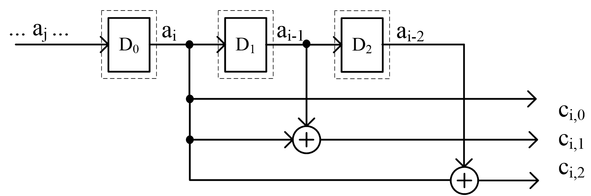
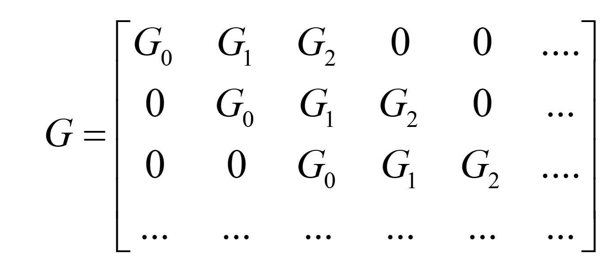
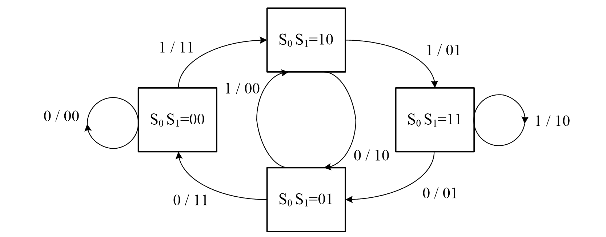
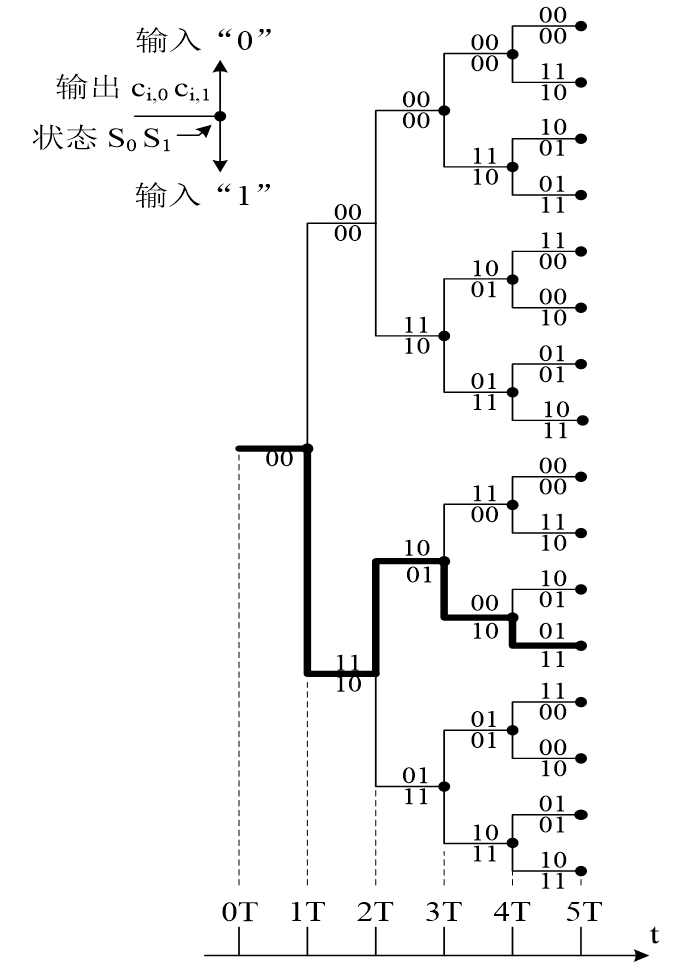
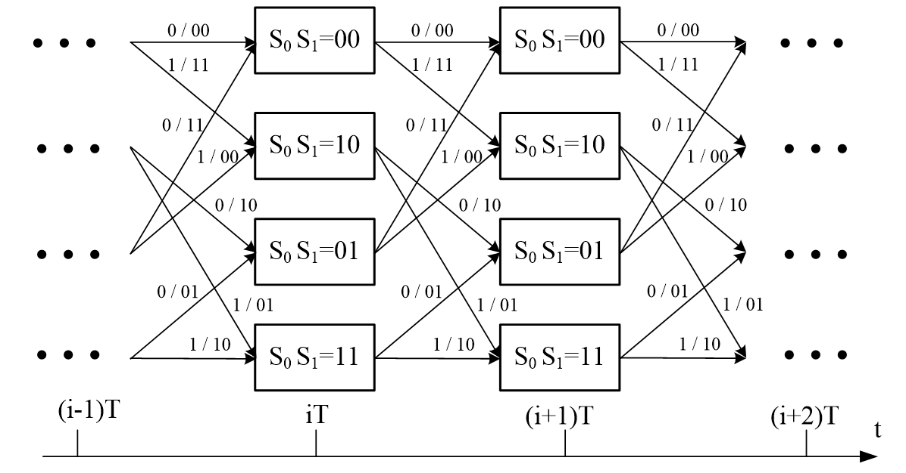

### **一、卷积码基础 📚**

#### **1. 基本概念**

卷积码是一种有记忆的信道编码方式。与无记忆的分组码不同，卷积码的编码过程具有关联性。

*   **分组码**: 当前的 `n` 位编码输出，**仅**取决于当前的 `k` 位信息输入。它是无记忆的。
*   **卷积码**: 当前的编码分组不仅取决于当前时刻的 `k` 比特信息组，还与前面 `m` 个信息组有关。

简单来说，编码器中包含了移位寄存器等记忆元件，使得编码输出具有“记忆”效应。

#### **2. 编码器结构与参数**

一个卷积码编码器通常由 `k` 个输入比特的移位寄存器和 `n` 个模2加法器（异或门）构成。

*   **参数 `(n, k, L)`**:
    *   `k`: 每次输入到编码器的信息比特数。
    *   `n`: 对应每次 `k` 比特输入，编码器产生的输出比特数。
    *   `L`: 约束长度 (Constraint Length)，表示当前编码输出与多少个输入信息码组有关。它等于移位寄存器的最大级数加1。

*   **编码效率 (码率)**:
    $R_c = \frac{k}{n}$

*   **状态 (State)**: 编码器中所有寄存器中保存的输入码组，称为编码器当前的状态。状态数决定了编码的复杂性。

---

### **二、(3,1,3) 卷积码示例 ⭐**

这是一个非常经典的入门例子，我们以此来深入理解卷积码的工作原理。

*   **参数**: `n=3`, `k=1`, `L=3`。
*   **含义**: 每次输入 **1** 比特信息，输出 **3** 比特码字，约束长度为 **3**。
*   **编码效率**: $R_c = 1/3$

#### **1. 编码器结构**

#### **2. 输入输出关系**

根据上图的连接关系，可以写出三个输出比特与输入比特 `aᵢ` 及其前序比特 `aᵢ₋₁` 和 `aᵢ₋₂` 的关系（`⊕` 代表模2加）：

*   $c_{i,0} = a_i$
*   $c_{i,1} = a_i \oplus a_{i-1}$
*   $c_{i,2} = a_i \oplus a_{i-2}$

#### **3. 编码过程示例**

假设初始状态为全0，输入信息序列 `M = 1011...`，编码过程如下表：

| 序号 | 输入 `aᵢ` | 寄存器状态 `(aᵢ₋₁ aᵢ₋₂)` | 输出 `(cᵢ,₀ cᵢ,₁ cᵢ,₂)` |
| :--: | :-------: | :-----------------------: | :---------------------: |
| 0 | - | (0 0) | - |
| 1 | **1** | (0 0) | (1 1 1) |
| 2 | **0** | (1 0) | (0 1 0) |
| 3 | **1** | (0 1) | (1 1 0) |
| 4 | **1** | (1 0) | (1 0 1) |
| ... | ... | ... | ... |

所以，输入 `M = 1011...` 对应的输出码字序列为 `C = 111 010 110 101 ...`。

---

### **三、卷积码的数学表示 🧮**

#### **1. 卷积关系与单位脉冲响应**

卷积码的输入输出是一种线性关系，可以用卷积运算来表示。

*   **单位脉冲响应 `g`**: 指当输入序列为单位脉冲 `Mᵟ = 1000...` 且编码器初始状态为全0时，编码器的输出序列。

对于 (3,1,3) 码，我们有3个输出，因此有3个单位脉冲响应序列：
*   第0位输出的脉冲响应: $g^{(0)} = (g_{0,0}, g_{1,0}, g_{2,0}, ...) = (1, 0, 0, 0, ...)$
*   第1位输出的脉冲响应: $g^{(1)} = (g_{0,1}, g_{1,1}, g_{2,1}, ...) = (1, 1, 0, 0, ...)$
*   第2位输出的脉冲响应: $g^{(2)} = (g_{0,2}, g_{1,2}, g_{2,2}, ...) = (1, 0, 1, 0, ...)$

任意输入序列 $M = (a_0, a_1, a_2, ...)$ 产生的第 `j` 位输出序列 $C^{(j)}$ 都可以表示为 `M` 与 $g^{(j)}$ 的卷积：
$\boxed{C^{(j)} = M * g^{(j)}}$

#### **2. 生成矩阵 (Generator Matrix)**

卷积码的编码过程也可以用矩阵乘法 `C = M·G` 来表示。这里的 `G` 就是生成矩阵。它由单位脉冲响应序列构成，是一个向右下方无限延伸的矩阵。

其中，$G_i$ 是由脉冲响应在第 `i` 时刻的输出构成的子矩阵。对于 (3,1,3) 码：
*   $G_0 = [g_{0,0} g_{0,1} g_{0,2}] = [111]$
*   $G_1 = [g_{1,0} g_{1,1} g_{1,2}] = [010]$
*   $G_2 = [g_{2,0} g_{2,1} g_{2,2}] = [001]$

#### **3. 多项式表示 (Polynomial Representation)**

这是描述卷积码最常用和最简洁的方法。我们将比特序列看作是多项式的系数。

*   **输入信息多项式**: $M(X) = a_0 + a_1X + a_2X^2 + \dots$
*   **生成多项式**: 将每个单位脉冲响应序列写成多项式形式。
    对于 (3,1,3) 码：
    *   $g_0(X) = 1 + 0X + 0X^2 = 1$
    *   $g_1(X) = 1 + 1X + 0X^2 = 1+X$
    *   $g_2(X) = 1 + 0X + 1X^2 = 1+X^2$
*   **生成多项式矩阵**: $G(X) = [g_0(X), g_1(X), g_2(X), \dots, g_{n-1}(X)]$
    对于 (3,1,3) 码：$G(X) = [1 \quad 1+X \quad 1+X^2]$

编码过程可以简洁地表示为：
$\boxed{C(X) = M(X)G(X)}$
其中，$C(X) = [c_0(X), c_1(X), c_2(X)]$ 是输出码字多项式向量。

---

### **四、系统码结构**

如果编码后的码字中，完整地包含了未经改变的输入信息位，则称该码为**系统码**。

*   **生成多项式矩阵的一般形式**:
    $\boxed{G(X) = [I_k \quad P(X)]}$
    其中 $I_k$ 是 `k×k` 的单位矩阵，$P(X)$ 是一个 `k×(n-k)` 的多项式矩阵，用于生成监督位。

*   **示例**:
    *   我们前面讨论的 (3,1,3) 码是系统码，因为它的输出 $c_{i,0} = a_i$，信息位 `aᵢ` 直接出现在输出中。其生成多项式矩阵 $G(X) = [1 \quad 1+X \quad 1+X^2]$ 可以看作 $[I_1 \quad P(X)]$ 的形式。

---

### **五、卷积码的图形表示 🗺️**

图形表示法对于理解卷积码的动态行为和译码（尤其是维特比译码）至关重要。

#### **1. 状态图 (State Diagram)**

*   **节点 (Node)**: 代表编码器的不同状态。对于约束长度为 `L`，输入为 `k` 比特的编码器，共有 $2^{k(L-1)}$ 个状态。
*   **有向边 (Branch)**: 代表状态之间的转移。
*   **标签 (Label)**: 每条边上都标有 `输入/输出`。
**优点**: 简洁地表示了所有可能的状态和转移。
**缺点**: 看不到编码过程的时间序列。

#### **2. 树图 (Tree Diagram)**

树图是状态图按时间展开的形式，从初始状态开始，每个分支代表一个输入，路径则是一条编码序列。

**优点**: 直观地展示了随时间变化的编码过程。
**缺点**: 图的规模随时间指数增长，很快变得非常复杂。

#### **3. 网格图 (Trellis Diagram)**

网格图是状态图在时间轴上的展开，但它将同一时刻的相同状态合并在一起，解决了树图指数增长的问题。它是维特比译码的基础。

*   **横轴**: 时间 `t`
*   **纵轴**: 编码器状态
*   **路径**: 从左到右的一条路径代表一个完整的编码序列。
**注意点** ⚠️: 状态图、树图和网格图本质上是等价的，都描述了编码器的状态转换行为，但网格图在译码算法中最为实用。

---

### **六、距离特性与自由距离**

*   **汉明距离**: 仍然是衡量码字差异的基本度量。
*   **自由距离 `d_free`**: 对于线性卷积码，它等于非全零码字路径中的最小汉明重量。具体来说，是指从全零状态出发，经过一系列非全零状态后，首次返回全零状态的所有路径中，码重最小的那条路径的码重。
    *   `d_free` 是卷积码最重要的性能指标之一，它决定了码的纠错能力，类似于分组码中的最小距离 `d_min`。`d_free` 越大，性能越好。
![[Pasted image 20251121150328.png]]
---

### **七、维特比译码 💡**

维特比译码是一种高效的最大似然译码算法，它能够在网格图上找到一条与接收序列最“接近”的路径，从而实现最佳译码。

#### **1. 核心思想**

维特比算法是一种动态规划算法。它不是盲目地搜索所有可能的路径，而是在每个时间步（每个节点）都做出局部最优决策。

**幸存者原则 (Survivor Principle)**: 如果有两条路径在某一时刻进入了同一个状态，那么其中路径度量值（累计距离）较差的那条路径可以被丢弃，因为它不可能成为全局最优路径的一部分。

#### **2. 关键术语**

*   **部分路径 (Partial Path)**: 网格图上从开始到某个中间时刻 `t` 的一条路径。
*   **路径度量值 (Path Metric)**: 到达某个状态的幸存路径所对应的累计距离。通常是接收序列与该路径对应输出码字之间的汉明距离（硬判决）或欧氏距离（软判决）。
*   **幸存路径 (Survivor Path)**: 在每个时刻 `t`，对于每一个状态，都保留一条路径度量值最优（距离最小）的路径，称之为幸存路径。

#### **3. 译码步骤**

1.  **初始化**: `t=0` 时，从全零状态开始，路径度量值为0。
2.  **迭代计算 (Add-Compare-Select)**:
    *   在时刻 `t`，对于网格图中的每一个状态，计算所有到达该状态的路径的路径度量值。
    *   **Add**: 将上一时刻 `t-1` 幸存路径的度量值，与当前分支的度量值（当前接收码组与分支标签码组的距离）相加。
    *   **Compare**: 比较所有到达该状态的新路径度量值。
    *   **Select**: 选择度量值最优（距离最小）的路径作为该状态在时刻 `t` 的幸存路径，并记录其度量值。丢弃其他路径。
3.  **终止**: 当处理完所有接收序列后，算法终止。
4.  **回溯 (Traceback)**: 从最终时刻度量值最优的状态开始，沿着幸存路径反向回溯到初始状态。这条回溯路径就是译码得到的最佳路径，其对应的输入序列即为译码结果。

**易错点** 💥: 在计算路径度量值时，是**累计**距离，而不是只看当前一步的距离。在选择幸存路径时，如果有两条路径的度量值相同，可以任选其一。

---

### **本章学习总结 🌟**

本节课我们系统学习了卷积码，这是通信系统中一种非常重要的差错控制编码技术。

1.  **核心特征**: 卷积码是**有记忆**的编码，其输出不仅与当前输入有关，还与历史输入有关，这通过编码器中的移位寄存器实现。
2.  **关键参数**: 用 `(n, k, L)` 描述，分别代表输出比特数、输入比特数和约束长度。码率 $R_c = k/n$。
3.  **数学工具**: 我们可以用**生成矩阵**和**生成多项式**来精确描述卷积码的编码规则，其中多项式表示法最为简洁和常用。
4.  **图形表示**: **状态图**、**树图**和**网格图**是从不同角度描述编码器动态行为的工具。其中，网格图是理解和实现维特比译码算法的基础。
5.  **性能衡量**: 自由距离 `d_free` 是衡量卷积码性能的核心指标，决定了其纠错能力。
6.  **核心算法**: **维特比算法**是卷积码的经典译码算法。它利用动态规划思想，在网格图上高效地寻找最大似然路径，以最小的计算复杂度实现了最优译码。