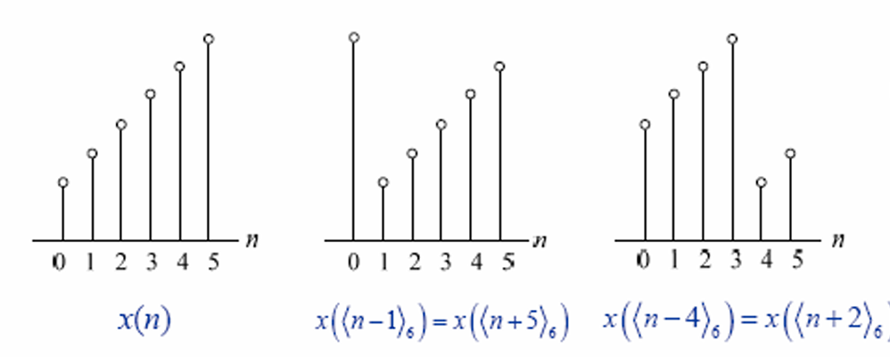

本章我们进入数字信号处理的核心工具——离散傅里叶变换 (DFT)。在此之前，我们已经接触了多种傅里叶分析工具，但它们都无法直接被计算机处理。

*   **CTFT (连续时间傅里叶变换)**: 时间和频率都连续。
*   **CFS (连续时间傅里叶级数)**: 时间连续周期，频率离散。
*   **DTFT (离散时间傅里叶变换)**: 时间离散，频率连续周期。
*   **DFS (离散傅里叶级数)**: 时间和频率都离散周期。

🤔 **计算机处理的需要**：计算机只能处理有限长、离散的数值。因此，我们需要一种在时域和频域上都是离散且有限长的变换，这就是DFT。

---

### 1. 离散傅里叶变换 (DFT)

#### 1.1 DFT 的定义

DFT可以看作是对一个有限长序列的 **DTFT** 在一个周期内 ($[0, 2\pi]$) 进行均匀采样得到的。

对于一个长度为 $N$ 的序列 $x[n]$ ($0 \le n \le N-1$)，其 N 点 DFT 定义为：

$$\boxed{X[k] = \sum_{n=0}^{N-1} x[n] W_N^{kn}, \quad 0 \le k \le N-1}$$

其对应的 **离散傅里叶逆变换 (IDFT)** 为：

$$\boxed{x[n] = \frac{1}{N} \sum_{k=0}^{N-1} X[k] W_N^{-kn}, \quad 0 \le n \le N-1}$$

其中，$W_N$ 被称为旋转因子 (Twiddle Factor)，定义为：

$W_N = e^{-j\frac{2\pi}{N}}$

📝 **旋转因子的性质**：
*   **周期性**: $W_N^{k+mN} = W_N^k$
*   **对称性**: $W_N^{k + N/2} = -W_N^k$
*   **共轭对称性**: $W_N^{-k} = W_N^{N-k} = (W_N^k)^*$

💡 **重要特性**：DFT 及其逆变换都具有周期性，周期为 $N$。即 $X[k+N] = X[k]$ 和 $x[n+N] = x[n]$。

#### 1.2 DFT 的矩阵表示

DFT 变换可以表示为矩阵乘法的形式：$\mathbf{X} = \mathbf{D}_N \mathbf{x}$。
其中 $\mathbf{x}$ 和 $\mathbf{X}$ 是序列的列向量，$\mathbf{D}_N$ 是一个 $N \times N$ 的 DFT 矩阵，其元素为 $[\mathbf{D}_N]\_{kn} = W_N^{kn}$。
*   **$\mathbf{x}$ (小写 x)**：表示**时域**信号的列向量。
    *   即输入信号：$\mathbf{x} = [x[0], x[1], \dots, x[N-1]]^T$。
*   **$\mathbf{X}$ (大写 X)**：表示**频域**信号的列向量。
    *   即变换后的结果：$\mathbf{X} = [X[0], X[1], \dots, X[N-1]]^T$。
$$
\mathbf{D}_N =
\begin{bmatrix}
1 & 1 & 1 & \dots & 1 \\\\
1 & W_N^1 & W_N^2 & \dots & W_N^{N-1} \\\\
1 & W_N^2 & W_N^4 & \dots & W_N^{2(N-1)} \\\\
\vdots & \vdots & \vdots & \ddots & \vdots \\\\
1 & W_N^{N-1} & W_N^{2(N-1)} & \dots & W_N^{(N-1)(N-1)}
\end{bmatrix}
$$
这种表示方法直观，但也揭示了其计算复杂度为 $O(N^2)$。

#### 1.3 DTFT 与 DFT 的关系

这个关系是理解 DFT 的关键！

1.  **DFT 是 DTFT 的频域采样**
    $X[k] = X(e^{j\omega})|_{\omega = \frac{2\pi k}{N}}$
    这说明 DFT 提供了 DTFT 频谱的样本点。

2.  **频域采样导致时域周期延拓**
    对 DTFT 进行频域采样后，其对应的时域序列 $y[n]$ 是原始序列 $x[n]$ 以 $N$ 为周期的周期延拓之和。

    $y[n] = \sum_{m=-\infty}^{\infty} x[n-mN]$

    ⚠️ **注意点**：
    *   如果原始序列 $x[n]$ 的长度 $L$ **小于等于** DFT 的点数 $N$ ($L \le N$)，那么在一个周期内 $y[n]$ 和 $x[n]$ 是完全相同的，可以通过 $y[n]$ 无失真地恢复 $x[n]$。
    *   如果 $L > N$，则会发生时域混叠，$y[n]$ 将不再是 $x[n]$ 的简单截断，无法恢复原始信号。

3.  **用 DFT 数值计算 DTFT**
    可以通过计算一个足够长的 M 点 DFT 来逼近原始 N 点序列的 DTFT。只需将 $x[n]$ 补零到 M 点 ($M > N$)，再做 M 点 DFT，得到的结果就是 DTFT 在 M 个频率点上的采样。M 越大，对 DTFT 的描述越精细。

---

### 2. 有限长序列的运算及分类

#### 2.1 圆周移位 (Circular Shift)

由于 DFT 的周期性，对序列的移位操作也是循环的。一个 N 点序列 $x[n]$ 移位 $n_0$ 位后的序列 $x_s[n]$ 定义为：

$x_s[n] = x((n-n_0)_N) = x((n-n_0) \mod N)$

这相当于将序列看作一个首尾相连的圆环，在环上进行旋转。

#### 2.2 圆周卷积 (Circular Convolution)

两个 N 点序列 $g[n]$ 和 $h[n]$ 的 N 点圆周卷积定义为：

$$\boxed{y_c[n] = g[n] \circledast_N h[n] = \sum_{m=0}^{N-1} g[m]h((n-m)_N)}$$

✅ **圆周卷积与线性卷积的关系**:
这是本章最重要的概念之一。直接计算圆周卷积的结果通常与线性卷积不同。但是，如果我们将两个长度分别为 $M$ 和 $N$ 的序列都补零到长度 $L \ge M+N-1$，再进行 L 点圆周卷积，那么得到的结果将与这两个序列的线性卷积完全相同！

#### 2.3 序列的对称性分类

*   **圆周共轭对称/反对称**:
    *   **对称部分**: $x_{pcs}[n] = \frac{1}{2}(x[n] + x^*((-n)_N))$
    *   **反对称部分**: $x_{pca}[n] = \frac{1}{2}(x[n] - x^*((-n)_N))$

*   **对于实序列，这简化为圆周偶对称/奇对称**:
    *   **偶部**: $x_{pe}[n] = \frac{1}{2}(x[n] + x((-n)_N))$
    *   **奇部**: $x_{po}[n] = \frac{1}{2}(x[n] - x((-n)_N))$

---

### 3. DFT 的性质

DFT 的许多性质与 DTFT 类似，但都附加了“圆周”的特性。

| 性质         | 时域序列 (长度N)                | 频域序列 (N点DFT)                          |
| :--------- | :------------------------ | :------------------------------------ |
| **线性**     | $ag[n] + \beta h[n]$      | $aG[k] + \beta H[k]$                  |
| **圆周时移**   | $g((n-n_0)_N)$            | $W_N^{kn_0} G[k]$                     |
| **圆周频移**   | $W_N^{-kn_0} g[n]$        | $G((k-k_0)_N)$                        |
| **圆周卷积**   | $g[n] \circledast_N h[n]$ | $G[k]H[k]$                            |
| **时域相乘**   | $g[n]h[n]$                | $\frac{1}{N} G[k] \circledast_N H[k]$ |

| **信号名称**   | **时域序列 x[n] (0≤n≤N−1)**             | **频域序列 X[k] (0≤k≤N−1)**                                |
| ---------- | ----------------------------------- | ------------------------------------------------------ |
| **单位脉冲**   | $\delta[n]$                         | $1$                                                    |
| **移位脉冲**   | $\delta[n-m]$                       | $W_N^{km} = e^{-j\frac{2\pi}{N}km}$                    |
| **直流/矩形窗** | $1$ (即 $R_N[n]$)                    | $N\delta[k]$                                           |
| **复指数信号**  | $e^{j\frac{2\pi}{N}ln} = W_N^{-ln}$ | $N\delta[((k-l))_N]$                                   |
| **余弦信号**   | $\cos(\frac{2\pi}{N}ln)$            | $\frac{N}{2} [\delta[((k-l))_N] + \delta[((k+l))_N]]$  |
| **正弦信号**   | $\sin(\frac{2\pi}{N}ln)$            | $\frac{N}{2j} [\delta[((k-l))_N] - \delta[((k+l))_N]]$ |

#### 3.1 实序列的 DFT 对称性

这是一个非常重要的性质，可以大大减少计算和存储量。
如果 $x[n]$ 是一个实序列，那么它的 DFT $X[k]$ 具有共轭对称性：

$$\boxed{X[k] = X^\*((-k)_N) = X^*(N-k)}$$

这导致：
*   **幅度谱是偶对称的**: $|X[k]| = |X[N-k]|$
*   **相位谱是奇对称的**: $\arg(X[k]) = -\arg(X[N-k])$
*   **实部是偶对称的**: $\text{Re}\{X[k]\} = \text{Re}\{X[N-k]\}$
*   **虚部是奇对称的**: $\text{Im}\{X[k]\} = -\text{Im}\{X[N-k]\}$

因此，对于 N 点实序列的 DFT，我们只需要计算并存储前 $N/2+1$ 个点（从 k=0 到 k=N/2）即可。

---

### 4. DFT 的计算与应用

#### 4.1 利用对称性高效计算 DFT

1.  **用一次 N 点复数 DFT 计算两个 N 点实数 DFT**
    *   构造复序列 $x[n] = g[n] + jh[n]$。
    *   计算 $X[k] = \text{DFT}\{x[n]\}$。
    *   利用对称性恢复 $G[k]$ 和 $H[k]$：
        $G[k] = \frac{1}{2}(X[k] + X^\*((N-k)_N))$
        $H[k] = \frac{1}{2j}(X[k] - X^\*((N-k)_N))$

2.  **用一次 N 点 DFT 计算一个 2N 点实数 DFT**
    *   将 2N 点实序列 $v[n]$ 分解为偶数项 $g[n]=v[2n]$ 和奇数项 $h[n]=v[2n+1]$。
    *   $g[n]$ 和 $h[n]$ 都是 N 点实序列，可以用上面的方法计算出 $G[k]$ 和 $H[k]$。
    *   最后合成 $V[k]$：
        $V[k] = G((k)_N) + W\_{2N}^k H((k)_N), \quad 0 \le k \le 2N-1$

#### 4.2 🌟 利用 DFT 实现线性卷积

这是 DFT 最重要的应用之一，特别是在处理长序列滤波时。

*   **核心思想**：时域卷积等价于频域相乘。
*   **实现方法**：
    1.  对信号和滤波器冲激响应进行补零，使其长度 $L \ge M+N-1$。
    2.  计算 L 点 DFT。
    3.  将 DFT 结果相乘。
    4.  进行 L 点 IDFT，得到的结果就是线性卷积。

当输入信号非常长时，我们使用分段卷积的方法，主要有两种：

1.  **重叠相加法 (Overlap-Add)**
    *   将长序列 $x[n]$ 切分为不重叠的段。
    *   每段与 $h[n]$ 做线性卷积（通过补零和 DFT 实现）。
    *   由于卷积后长度会增加，输出段会相互重叠，将这些重叠部分相加即可得到最终结果。
    *   **特点**: 帧长 $L=M+N-1$，计算出的值全部有用。

2.  **重叠保留法 (Overlap-Save)**
    *   将长序列 $x[n]$ 切分为有重叠的段，重叠长度为 $M-1$。
    *   每段与 $h[n]$ 做圆周卷积（长度为 N）。
    *   由于圆周卷积的“卷绕”效应，每段输出的前 $M-1$ 个点是错误的（混叠），需要丢弃。
    *   保留每段后面正确的部分，然后拼接起来。
    *   **特点**: 帧长 $L=N \ge M$，计算出的值部分有用。

---

### 📖 本章学习总结

1.  **核心工具**: DFT 是数字信号处理中进行频域分析和滤波实现的基石，因为它在时域和频域都是离散且有限长的，完美契合计算机处理的需求。

2.  **核心关系**: 深刻理解 DFT 与 DTFT 的关系至关重要。**频域采样 ↔ 时域周期延拓**。这个对偶关系解释了时域混叠现象，并指导我们如何用 DFT 逼近 DTFT。

3.  **核心应用**: DFT 最强大的应用之一是快速计算线性卷积。必须牢记，只有通过正确的**补零**，才能使 DFT 域的乘积（即圆周卷积）等价于时域的线性卷积。

4.  **效率为王**: 实序列的共轭对称性以及由此衍生的各种高效计算技巧，是实际工程中必须掌握的知识。重叠相加/保留法是处理长数据流滤波的标准方法。

总之，DFT 不仅仅是一个数学变换，更是一个连接理论分析与工程实践的强大桥梁。