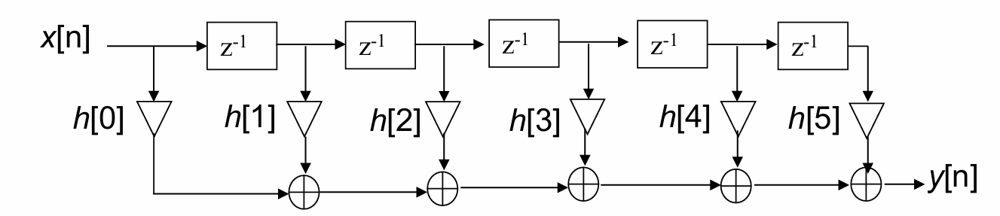
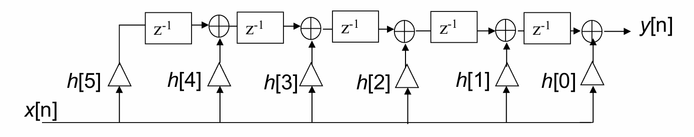
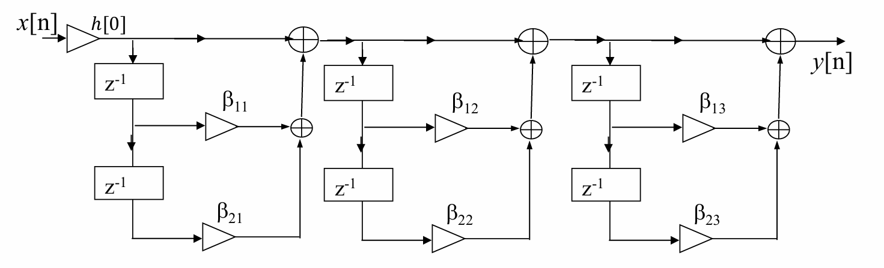
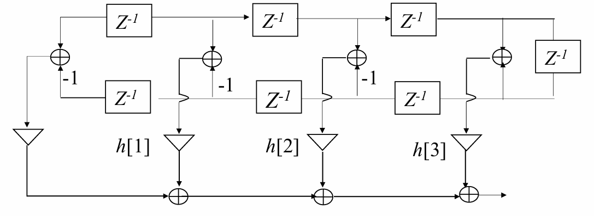
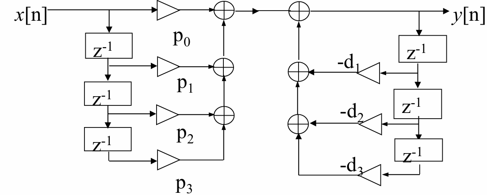
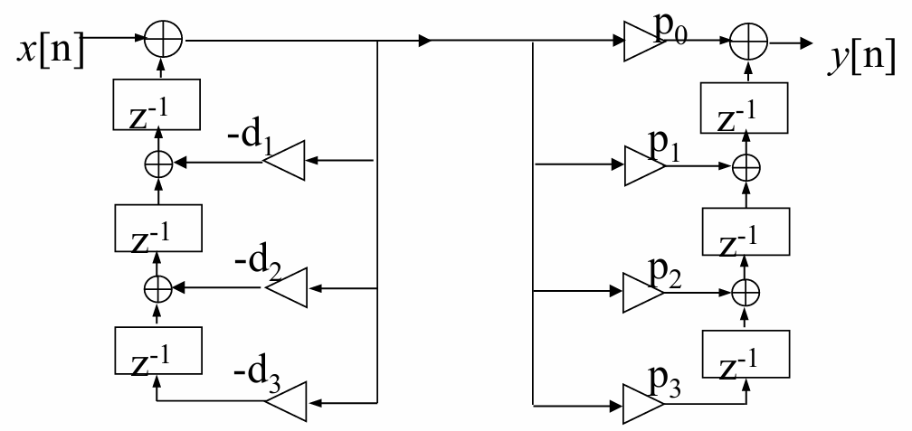
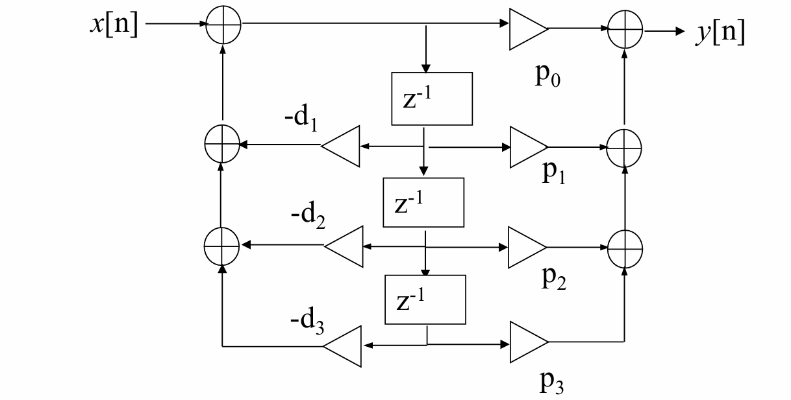
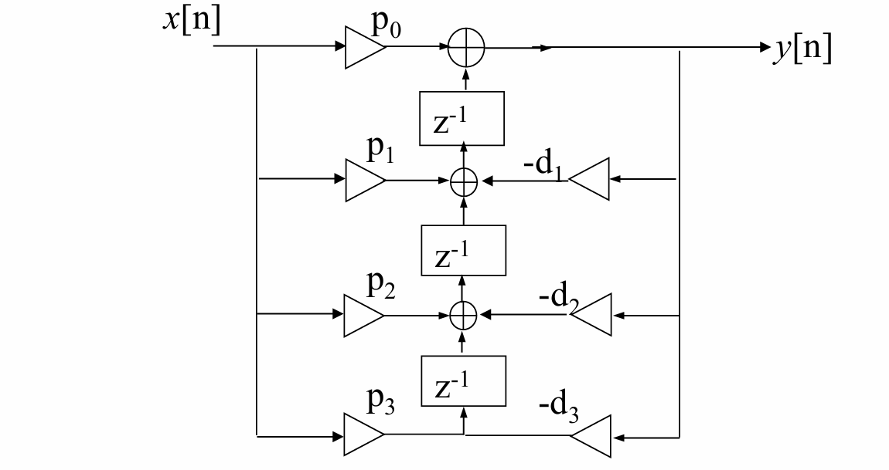
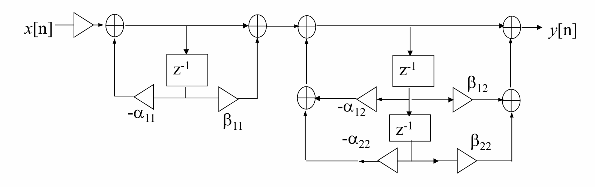

### 一、 滤波器的方框图表示 🖼️

#### 1. 🤔 为什么要研究滤波器结构？

我们不仅仅满足于得到一个滤波器的数学表达式，如何高效、稳定地实现它同样重要。研究其结构主要基于以下几点考虑：

*   **实现方式**: 滤波器最终需要通过软件或硬件来实现。
*   **数学模型的等价性**: 同一个滤波器可以有多种数学表达式，例如直接计算、分解为多个函数相加（并联）或相乘（级联）。
    *   不同的计算形式 ➡️ 不同的计算结构。
    *   不同的计算结构 ➡️ 不同的实现效果。
*   **有限字长效应**: 在数字系统中，数值的表示精度是有限的。不同的结构对这种精度限制的敏感度不同，会影响滤波器的性能和稳定性。
*   **结构优化**: 我们希望采用合适的结构，使得滤波器：
    *   在有限字长下仍有较好的性能。
    *   在某些场景下，占用最少的延迟单元（存储器）。

#### 2. ✨ 方框图表示法的优点

使用方框图（或流程图）来表示滤波器结构，具有以下优点：

*   **算法直观**: 容易根据图示写出滤波器的可计算算法。
*   **关系清晰**: 便于分析输入、输出以及内部信号之间的关系。
*   **推导方便**: 可以方便地推导出各种功能相同的“等效结构”。
*   **硬件预估**: 能从结构中分析出所需的硬件资源（如乘法器、加法器、延迟单元）。

#### 3. 🧩 方框图的基本结构单元

| 单元名称 | 方框图 (Block Diagram) | 流程图 (Flow Chart) |
| :--- | :--- | :--- |
| **乘法器** (Multiplier) | x[n] → [a] → ax[n] | → a → |
| **加法器** (Adder) | x₁[n] → ⊕ → y[n] (x₂[n] 输入⊕) | (两条线汇入一个节点) |
| **单位延时** (Unit Delay) | x[n] → [z⁻¹] → x[n-1] | → z⁻¹ → |

#### 4. 📈 从方框图分析系统函数 H(z)

**一般步骤**:

1.  **设立中间变量**: 将每个加法器的输出定义为一个中间变量。
2.  **建立方程组**: 根据加法器的输入，为每个中间变量以及最终输出列出方程。
3.  **求解消元**: 解这个方程组，消除所有中间变量，最终得到只含输入 `X(z)` 和输出 `Y(z)` 的关系式，从而求得 $H(z) = Y(z)/X(z)$。

#### 5. ⚠️ 无延时回路问题

*   **定义**: 指信号经过一个反馈回路后没有经过任何延时单元（`z⁻¹`）就回到自身输入端。
*   **问题**: 这种结构在物理上是不可实现的。因为计算当前时刻的输出 `y[n]` 需要用到 `y[n]` 自身的值，造成逻辑死锁。
*   **解决方法**: 通过代数变换，将其转换为一个不含无延时回路的等效结构。

#### 6. 📏 规范结构与非规范结构

*   **规范结构 (Canonical)**: 滤波器结构中所使用的延迟单元数目与其阶数相同。这是最节省存储资源的结构。
*   **非规范结构 (Non-canonical)**: 延迟单元的数目多于其阶数。
*   **滤波器阶数**:
    $y[n] = \sum_{k=1}^{N} a_k y[n-k] + \sum_{k=0}^{M} b_k x[n-k]$
    其阶数为 **max(M, N)**。

---

### 二、 等效结构 🔄

*   **定义**: 如果两个或多个滤波器结构具有完全相同的传输函数 H(z)，则称它们是等效的。
*   **理论 vs. 现实**:
    *   **理论上**: 所有等效结构的性能都应相同。
    *   **现实中**: 由于有限字长效应，不同等效结构在实现时的性能（如误差、稳定性、运算速度）可能差异巨大。
*   **如何产生等效结构？—— 转置运算法**
    1.  反转所有路径中信号的流动方向。
    2.  将所有网络节点（信号分支点）变成加法器。
    3.  将所有加法器变成网络节点。
    4.  将输入和输出端互换。

---

### 三、 FIR 和 IIR 滤波器对比 🆚

| 特性         | FIR 滤波器 (有限脉冲响应)                          | IIR 滤波器 (无限脉冲响应)                                                              |
| :--------- | :---------------------------------------- | :---------------------------------------------------------------------------- |
| **定义**     | $h[n]$ 在 $0 \le n \le N$ 范围非零             | $h[n]$ 在 $0 \le n \le \infty$ 范围非零                                            |
| **时域模型**   | $y[n] = \sum_{k=0}^{N} b_k x[n-k]$ (无反馈)  | $\sum_{k=0}^{N} a_k y[n-k] = \sum_{k=0}^{M} b_k x[n-k]$ (有反馈)                 |
| **单位脉冲响应** | $h[n] = \sum_{k=0}^{N} b_k \delta[n-k]$   | $h[n] = \mathcal{F}^{-1}[H(e^{j\omega})]$                                     |
| **系统函数**   | $H(z) = \sum_{k=0}^{N} b_k z^{-k}$ (只有零点) | $H(z) = \frac{\sum_{k=0}^{M} b_k z^{-k}}{\sum_{k=0}^{N} a_k z^{-k}}$ (有零点和极点) |
| **稳定性**    | 🌟 **总是稳定**                               | 稳定性由极点位置决定，可能不稳定                                  |
| **相位**     | ✅ 容易实现严格的线性相位 | ❌ 难以实现线性相位                                                                    |
| **阶数**     | N                                         | max(N, M)                                                                     |

---

### 四、 FIR 数字滤波器的基本结构 🔨

N阶FIR滤波器的系统函数为：
$H(z) = \sum_{k=0}^{N} h[k]z^{-k}$
它总共有 **N+1** 个参数（滤波器系数）。

#### 1. 直接型 (Direct Form)

*   也称为抽头延迟线结构或横向滤波器结构。
*   **结构**: 将输入信号通过一串延迟单元，每个延迟单元的输出乘以对应的系数 `h[k]`，最后将所有乘积相加得到输出。
*   **特点**:
    *   实现简单直观。
    *   **缺点**: 系数 `h[k]` 与滤波器的零点之间关系复杂，不方便精确控制零点位置。

#### 2. 级联型 (Cascade Form)

*   **原理**: 将系统函数 $H(z)$ 分解为多个一阶或二阶因子的乘积。
    $\boxed{H(z) = h[0] \prod_{k=1}^{K} (1 + \beta_{1k}z^{-1} + \beta_{2k}z^{-2})}$
*   **结构**: 将这些一阶或二阶系统串联起来。
*   **特点**:
    *   每一节控制一对零点，非常适合需要精确控制传输零点位置的应用。
    *   是规范型结构。
#### 3. 多相结构 (Polyphase Structure) 

*   **原理**: 将一个高阶FIR滤波器 $H(z)$ 的冲激响应 $h[n]$ 按一定规则（L个分支）分组，分解成多个并联的低阶子滤波器（称为多相分量）。
*   **数学分解**:
    $H(z) = \sum_{m=0}^{L-1} z^{-m} E_m(z^L)$
    其中，第 $m$ 个多相分量 $E_m(z)$ 是由原冲激响应 $h[n]$ 中每隔 $L$ 个点取一个系数构成的：
    $E_m(z) = \sum_{n=0}^{\infty} h[Ln+m]z^{-n}$
*   **举例 (L=2)**: 将 $H(z)$ 分解为2个分支。
    1.  **分组**: 将系数分为偶数下标 $(h[0], h[2], \dots)$ 和奇数下标 $(h[1], h[3], \dots)$ 两组。
    2.  **构建多相分量**:
        $E_0(z) = h[0] + h[2]z^{-1} + h[4]z^{-2} + \dots$
        $E_1(z) = h[1] + h[3]z^{-1} + h[5]z^{-2} + \dots$
    3.  **重构 H(z)**:
        $H(z) = (h[0] + h[2]z^{-2} + \dots) + z^{-1}(h[1] + h[3]z^{-2} + \dots)$
        $H(z) = E_0(z^2) + z^{-1}E_1(z^2)$
*   **结构**: 输入信号 `x[n]` 分成两条支路：
    *   上支路：直接输入子滤波器 $E_0(z^2)$。
    *   下支路：先经过一个单位延时 $z^{-1}$，再输入子滤波器 $E_1(z^2)$。
    *   两支路的输出相加得到最终结果 `y[n]`。
*   💡 **应用场景**: 多相结构在多速率信号处理（如插值和抽取）中极为重要，可以大幅提高计算效率。

#### 4. 线性相位 FIR 结构

*   **原理**: 线性相位FIR滤波器的冲激响应具有对称性或反对称性。
    $h[n] = \pm h[N-n]$
*   **优势**: 利用这个对称性，可以在实现时将对称位置的系数对应的信号先相加，再进行一次乘法，从而使乘法器数量减少约一半，大大节省计算资源。
*   区分对称性或反对称性看加法器有无标注“-1”。

---

### 五、 IIR 数字滤波器的基本结构 🛠️

N阶IIR滤波器的系统函数为有理分式：
$\boxed{H(z) = \frac{\sum_{k=0}^{M} p_k z^{-k}}{1 + \sum_{k=1}^{N} d_k z^{-k}}}$

#### 1. 直接I型 (Direct Form I)

*   **原理**: 将 $H(z)$ 看作一个全零点系统 $H_1(z)$ 和一个全极点系统 $H_2(z)$ 的级联。
    $H(z) = H_1(z) H_2(z)$
*   **结构**: 先实现FIR部分（分子），再实现反馈部分（分母）。
*   **特点**:
    *   需要 M+N 个延迟单元，是非规范结构。共需N+M+1个乘法器、N+M个双输入加法器。
    *   **缺点**: 极点对系数变化非常敏感，有限字长效应下容易不稳定。

#### 2. 直接II型 (Direct Form II)

*   **原理**: 将直接I型中的全零点和全极点两个子系统交换次序。由于中间的延迟线完全相同，可以合并。
*   **结构**: 输入信号先经过反馈（极点）部分，再经过前向（零点）部分。
*   **特点**:
    *   ✨ **优点**: 只需要 max(M, N) 个延迟单元，是规范结构，最节省存储单元。
    *   **缺点**: 仍然具有直接型实现的一般缺点，即对系数精度敏感。

#### 3. 级联型 (Cascade Form)

*   **原理**: 将 $H(z)$ 的分子和分母都分解成一阶或二阶多项式的乘积，然后将它们配对，形成多个二阶子系统（Biquad Section）。
    $H(z) = p_0 \prod_{k} \frac{1 + \beta_{1k}z^{-1} + \beta_{2k}z^{-2}}{1 + \alpha_{1k}z^{-1} + \alpha_{2k}z^{-2}}$
*   **结构**: 将这些二阶子系统串联起来。
*   **特点**:
    *   每个二阶模块的系数单独控制一对零点和一对极点。
    *   对系数的量化误差不那么敏感，比直接型结构鲁棒性更好。

#### 4. 并联I型 (Parallel Form I)

1.  **数学基础**: 对 $H(z)$ 直接进行关于 $z^{-1}$ 的部分分式展开。
    $$
    H(z) = \gamma_0 + \sum_{k=1}^{K} H_k(z) = \gamma_0 + \sum_{k=1}^{K} \frac{\gamma_{0k} + \gamma_{1k}z^{-1}}{1 + \alpha_{1k}z^{-1} + \alpha_{2k}z^{-2}}
    $$
    *   **关键点**: 注意看分子的形式 $(\gamma_{0k} + \gamma_{1k}z^{-1})$。它也是一个关于 $z^{-1}$ 的多项式。$\gamma_0$ 是通过多项式长除法得到的常数项（如果分子阶数 $\ge$ 分母阶数）。

2.  **结构特点**: **每个并联支路**的内部结构类似于**直接I型**。
    
    *   **信号流**: 输入信号 `X` 进入一个求和节点，与来自反馈环路的信号相加。
    *   这个求和节点的输出，我们称之为中间信号 `w[n]`。
    *   然后，这个中间信号 `w[n]` 和它的延迟版本 `w[n-1]` 分别乘以分子系数 $\gamma_{0k}$ 和 $\gamma_{1k}$，再相加得到该支路的输出。
    *   **本质**: "先实现极点（分母），再用中间结果去实现零点（分子）"。

3.  **MATLAB 实现**: 使用 `residuez` 函数。
    `[r, p, k] = residuez(b, a)`
    *   `b` 和 `a` 是关于 $z^{-1}$ 的分子和分母系数向量。
    *   `r` 返回的是每个分式项的**分子系数向量**，`p` 是极点，`k` 是常数项。

#### 5. 并联II型 (Parallel Form II)

1.  **数学基础**: 对 $H(z)$ 进行关于 $z$ 的标准部分分式展开。
    $$
    H(z) = \delta_0 + \sum_{k=1}^{K} H_k(z) = \delta_0 + \sum_{k=1}^{K} \frac{\delta_{1k}z^{-1} + \delta_{2k}z^{-2}}{1 + \alpha_{1k}z^{-1} + \alpha_{2k}z^{-2}}
    $$
    *   **看起来一样？** 公式形式看起来和I型非常相似，但请注意，系数 $\delta_{ik}$ 的值与 $\gamma_{ik}$ 是**完全不同**的，因为它们是通过不同的数学过程（对 $z$ 而不是 $z^{-1}$ 展开）得到的。

2.  **结构特点**: **每个并联支路**的内部结构类似于**直接II型**。
    
    *   **信号流**: 输入信号 `X` 进入求和节点，与反馈信号相加后，进入一个共享的延迟链。
    *   分子系数 $\delta_{1k}$, $\delta_{2k}$ 是从这个**共享延迟链**的不同节点（即状态变量）抽头并加权求和，得到支路输出。
    *   **本质**: "极点和零点共享同一组延迟单元"。这使得每个支路都是**规范结构**，存储效率最高。

3.  **MATLAB 实现**: 使用 `residue` 函数。
    `[r, p, k] = residue(b, a)`
    *   `b` 和 `a` 是关于 **$z$ 的降幂排列**的分子和分母系数向量。
    *   `r` 返回的是每个分式项的**分子（通常是常数）**，`p` 是极点，`k` 是多项式部分。你需要对结果进行一些转换才能得到课件幻灯片中的 $H(z)$ 表达式。

---

### 六、 基本结构的 MATLAB 实现 💻

*   **级联实现 (Cascade)**:
    *   `[z,p,k] = tf2zp(num, den)`: 从传输函数求零极点。
    *   `sos = zp2sos(z,p,k)`: 将零极点转换成级联的二阶节 (Second-Order Sections)。
*   **并联实现 (Parallel)**:
    *   `[r,p,k] = residuez(num, den)`: 对 $z^{-1}$ 多项式进行部分分式展开 (用于并联I型)。
    *   `[r,p,k] = residue(num, den)`: 对 $z$ 多项式进行部分分式展开 (用于并联II型)。

---

### 七、 🧠 本章学习总结

本讲我们系统学习了数字滤波器的各种实现结构，核心思想是在保证传输函数不变的前提下，寻找性能更优、资源消耗更少的实现方式。

1.  **为何重要**: 滤波器的实现结构直接影响其在有限精度计算环境下的性能，包括稳定性、噪声和计算复杂度。
2.  **FIR 结构**:
    *   **直接型**最简单，但灵活性差。
    *   **级联型**通过分解，可以精确控制每一对零点。
    *   **线性相位结构**是利用系数对称性来优化计算量的典范。
3.  **IIR 结构**:
    *   **直接I型**直观但非规范，存储开销大。
    *   **直接II型**是规范结构，存储效率最高。
    *   **直接型**（I和II）对系数敏感，容易因量化误差导致性能下降甚至不稳定。
    *   **级联型**和**并联型**将高阶系统分解为多个低阶（通常是二阶）系统的组合，大大增强了对系数误差的鲁棒性。其中，并联型的误差累积最小，性能最好。

在实际应用中，对于要求较高的IIR滤波器，通常会优先选择级联型或并联型结构，而不是直接型。
