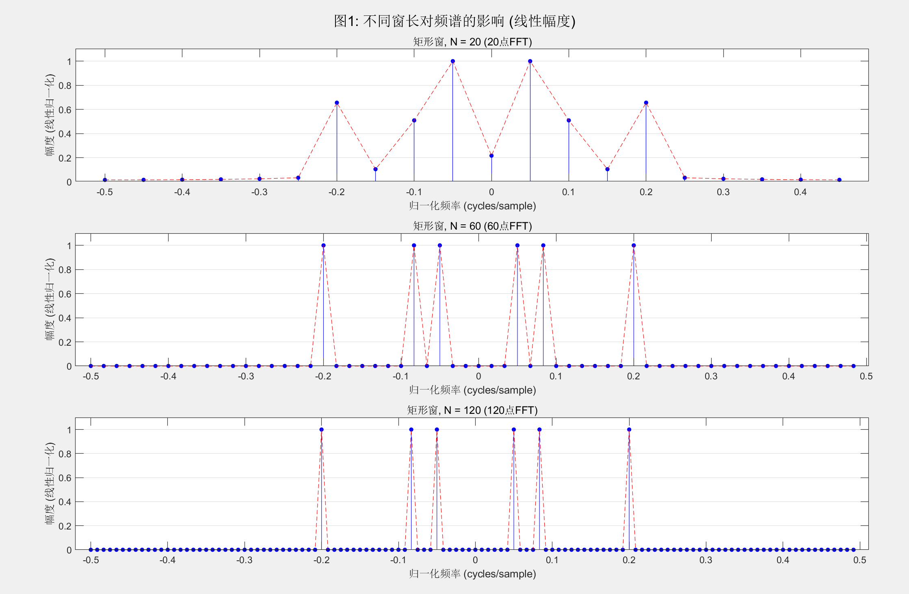
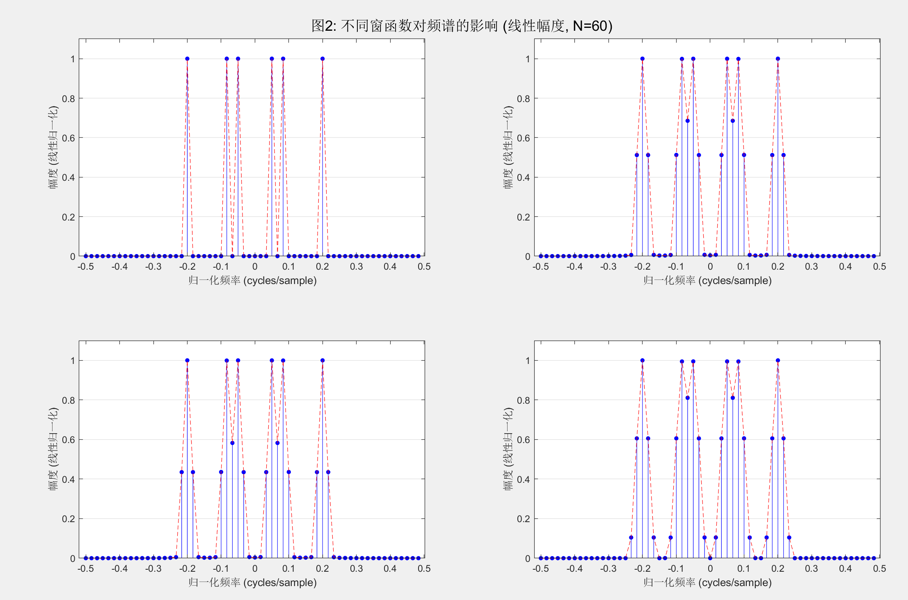
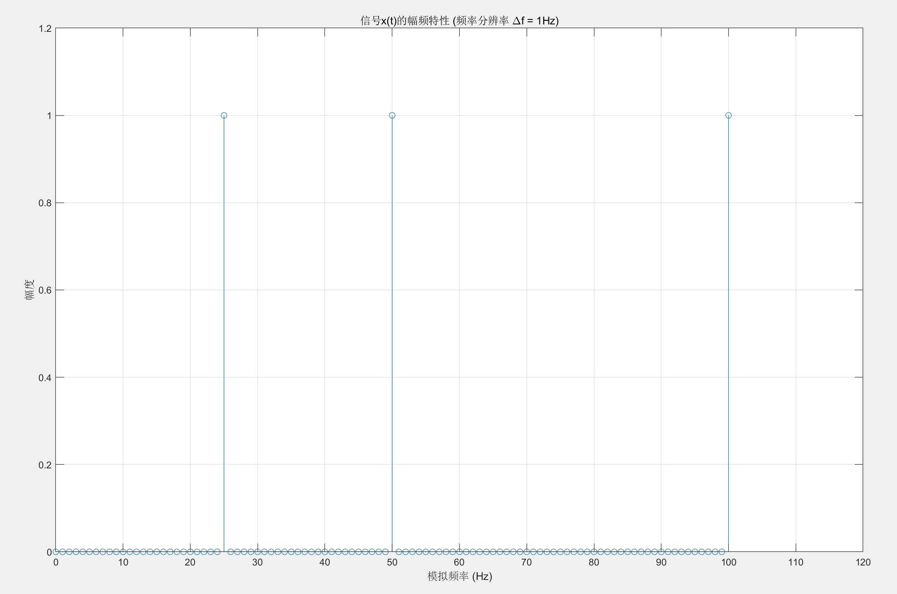
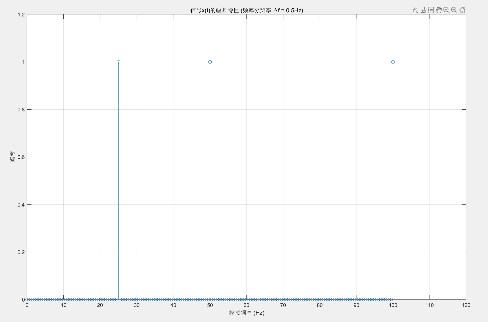
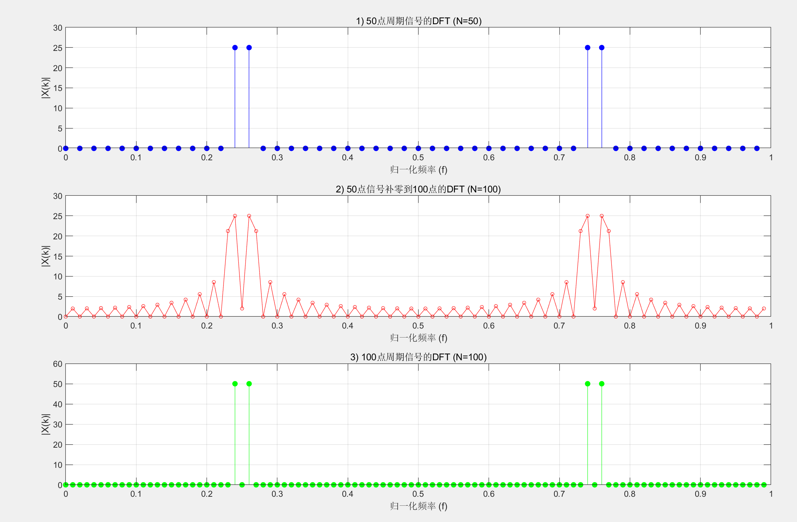

## 1. 实验目的

1.1加深对离散信号频谱分析的理解；

1.2分析不同加窗长度对信号频谱的影响；

1.3理解频率分辨率的概念，并分析其对频谱的 影响；

1.4窗长和补零对DFT的影响

## 2. 实验原理
#### **2.1 离散傅里叶变换 (DFT) 的定义**

离散傅里叶变换（DFT）是数字信号处理中的一种基本工具，用于将一个有限长离散时间序列转换为其离散频域表示。

对于一个长度为 *N* 的离散序列 *x*[*n*]，其 *N* 点DFT定义为 *X*[*k*]：

$$
X[k] = \sum_{n=0}^{N-1} x[n] e^{-j \frac{2\pi k}{N} n}
$$

为了简化表示，通常引入旋转因子 (Twiddle Factor)  $W_N = e^{-j \frac{2\pi}{N}}$ ，则DFT公式可以写为：

$$
X[k] = \sum_{n=0}^{N-1} x[n] W_N^{kn} \quad , \quad 0 \le k \le N-1
$$

其中：
-   *x*[*n*] 是时域离散信号。
-   *X*[*k*] 是频域离散频谱。
-   *n* 是时域样本的索引 (0, 1, ..., *N*-1)。
-   *k* 是频域样本（频率点）的索引 (0, 1, ..., *N*-1)。

#### **2.2 DFT与DTFT的关系**

DFT与离散时间傅里叶变换（DTFT）之间存在着密切的联系。**DFT可以看作是对DTFT频谱进行均匀采样得到的。**

DTFT将一个无限长离散序列 *x*[*l*] 变换为一个连续的、以 2π 为周期的频谱 *X*(*e*<sup>jω</sup>)。

$$
X(e^{j\omega}) = \sum_{l=-\infty}^{\infty} x[l] e^{-j\omega l}
$$

如果我们对DTFT的频谱 *X*(*e*<sup>jω</sup>) 在一个周期 [0, 2π] 内进行 *N* 点均匀采样，采样点为 $\omega_k = \frac{2\pi k}{N}$，其中 *k* = 0, 1, ..., *N*-1，得到的采样结果记为 *Y*[*k*]：

$$
Y[k] = X(e^{j\omega}) \Big|\_{\omega = \frac{2\pi k}{N}} = X(e^{j\frac{2\pi k}{N}}) = \sum_{l=-\infty}^{\infty} x[l] W_N^{kl}
$$

现在，我们对这个频域采样序列 *Y*[*k*] 进行逆离散傅里叶变换（IDFT），看看能恢复出什么样的时域信号 *y*[*n*]：

$$
y[n] = \frac{1}{N} \sum_{k=0}^{N-1} Y[k] W_N^{-kn}
$$

将 *Y*[*k*] 的表达式代入上式：

$$
y[n] = \frac{1}{N} \sum_{k=0}^{N-1} \left( \sum_{l=-\infty}^{\infty} x[l] W_N^{kl} \right) W_N^{-kn}
$$

交换求和顺序：

$$
y[n] = \sum_{l=-\infty}^{\infty} x[l] \left[ \frac{1}{N} \sum_{k=0}^{N-1} W_N^{k(l-n)} \right]
$$

根据旋转因子的正交性，方括号中的求和项满足以下关系：

$$
\frac{1}{N} \sum_{k=0}^{N-1} W_N^{k(l-n)} = \begin{cases} 1 & \text{if } l = n + mN \\ 0 & \text{otherwise} \end{cases}
$$

其中 *m* 是任意整数。这意味着，只有当 *l* 与 *n* 相差 *N* 的整数倍时，求和才不为零。因此，*y*[*n*] 的最终表达式为：

$$
y[n] = \sum_{m=-\infty}^{\infty} x[n + mN] \quad , \quad 0 \le n \le N-1
$$

#### **2.3 结论与时域混叠**

上述推导得出了一个至关重要的结论：**对一个信号的DTFT频谱进行采样，再进行IDFT，得到的时域信号 *y*[*n*] 并不是原始信号 *x*[*n*]，而是原始信号以 *N* 为周期进行周期延拓后叠加的结果。**

这种现象被称为 **时域混叠 (Time-Domain Aliasing)**。

**重要推论：**
如果原始信号 *x*[*n*] 本身就是一个长度为 *L* 的有限长序列（即当 *n*<0 或 *n*≥*L* 时，*x*[*n*]=0），并且我们选择的DFT点数 *N* ≥ *L*，那么在求和过程中就不会发生重叠。在这种情况下，恢复出的 *y*[*n*] 就等于原始的 *x*[*n*]（在 0 ≤ *n* ≤ *N*-1 范围内）。

这就是为什么在实际应用中，我们总是确保DFT的点数 *N* 大于或等于信号的实际长度，以避免时域混叠，从而保证DFT和IDFT能够构成一个无损的可逆变换对。
## 3.  预习要求

为确保顺利完成实验并深刻理解实验内容，请在实验前完成以下预习要求：
#### **3.1 核心概念复习**
*   **离散傅里叶变换 (DFT):** 复习离散傅里叶变换（DFT）的定义、物理意义和数学公式。理解DFT是如何将一个时域的离散信号 `x[n]` 映射到频域的离散频谱 `X[k]` 的。
*   **频谱分析:** 理解频谱分析的根本目的：即如何从时域信号中提取其包含的频率成分、各频率分量的幅度和相位信息。
*   **快速傅里叶变换 (FFT):** 了解快速傅里叶变换（FFT）是DFT的一种高效计算方法，在实验中我们将使用FFT进行计算。
#### **3.2 窗函数与信号截断**
*   **“加窗”的必要性:** 理解为什么在进行信号的DFT分析时，我们必须处理有限长度的信号，这个过程被称为“截断”或“加窗”。
*   **矩形窗:** 了解对信号的直接截断，等效于对原始信号施加了一个**矩形窗**。思考矩形窗的频谱特性，特别是其导致的**谱泄漏**（Spectral Leakage）问题。
#### **3.3 频率分辨率**
*   **定义:** 明确“频率分辨率”的物理定义。它指的是频谱分析中能够区分两个相邻频率分量的最小频率间隔。
*   **与窗长的关系:** 预习**窗长**（即信号的观测时长或采样点数N）与频率分辨率之间的关系。思考并回答：**窗长越长，频率分辨率是变好还是变差？为什么？**
#### **3.4 补零 (Zero-Padding) 的影响**
*   **定义:** 理解什么是“补零”（Zero-Padding）操作，即在有限长信号的末尾添加若干个零点以增加序列的总长度。
*   **作用辨析:** 这是本次预习的重点。请重点思考并区分**“增加窗长（采集更多有效信号点）”**和**“对短序列补零”**这两种操作对频谱分析结果的根本不同。
    *   **补零能否提高频率分辨率？**
    *   如果不能，它的主要作用是什么？（提示：与DFT计算出的频谱点密度或“栅栏效应”有关）
#### **3.5 MATLAB/编程准备**
*   预习MATLAB中用于计算快速傅里叶变换的核心函数 `fft()` 的用法。
*   了解如何使用 `abs()` 函数计算FFT结果的幅度。
*   学习如何构建正确的频率轴用于绘图，以便将DFT输出的序列索引 `k` 转换为有物理意义的频率值。

## 4. 实验内容

### 4.1 对无限长时域离散信号进行频谱分析
**信号:**
```
x[n] = cos(πn/10) + sin(πn/6) + cos(2πn/5)
```
试用 DFT 对其进行频谱分析。使用矩形窗进行截取，并分别选择三种不同的窗长，即 N=20, 60, 120。

**实验要求:**
1.  画出不同窗长截取后的信号的频谱；
2.  窗固定为矩形窗，分析不同窗长对频谱的影响；
3.  窗长固定，分析不同窗（包括矩形, Hann, Hamming, Blackman.）对频谱的影响。

#### 4.1.1 实验原理与公式推导

##### 4.1.1.1 从 DTFT 到 DFT——频域采样
对无限长离散信号 x[n] 进行频谱分析的数学工具是离散时间傅里叶变换 (DTFT)，其定义为：
$$
X(e^{j\omega}) = \sum_{n=-\infty}^{\infty} x[n]e^{-j\omega n}
$$
DTFT 的结果 $X(e^{j\omega})$ 是一个关于频率 $\omega$ 的连续函数，不便于计算机直接处理。为了在计算机上进行分析，我们需要对其频谱进行采样。

离散傅里叶变换 (DFT) 可以被视为对 DTFT 在一个周期 [0, 2π] 内的 N 点均匀采样。设采样点为：
$$
\omega_k = \frac{2\pi k}{N}
$$
则 DFT 定义为：
$$
X[k] = X(e^{j\omega}) |\_{\omega = \frac{2\pi k}{N}} = \sum_{n=0}^{N-1} x[n]e^{-j\frac{2\pi k}{N}n}
$$
通常引入旋转因子 $W_N = e^{-j\frac{2\pi}{N}}$，公式简化为：
$$
X[k] = \sum_{n=0}^{N-1} x[n]W_N^{kn}, \quad 0 \le k \le N-1
$$
这一过程表明，DFT 是有限长序列的离散频域表示。对无限长信号进行 DFT 分析，必须先将其截断为有限长序列。

##### 4.1.1.2 加窗与频谱泄漏
将无限长信号 x[n] 截断为有限长序列的过程，等效于将其与一个有限长度的窗函数 w[n] 相乘：
$$
x_w[n] = x[n] \cdot w[n]
$$
其中，最简单的窗是 **矩形窗**，它在 0 ≤ n < N 的范围内值为1，其余为0。根据傅里叶变换的性质，时域的乘积对应于频域的卷积：
$$
X_w(e^{j\omega}) = \frac{1}{2\pi} X(e^{j\omega}) * W(e^{j\omega})
$$
其中 $X_w(e^{j\omega})$ 是加窗后信号的频谱，$X(e^{j\omega})$ 是原始信号的频谱，$W(e^{j\omega})$ 是窗函数的频谱。

这个卷积操作会产生两个主要影响：
*   **频谱泄漏**: 理想窗函数的频谱应为一个冲激函数，但实际窗函数的频谱（如矩形窗的 sinc 函数）都包含一个 **主瓣** 和多个 **旁瓣**。卷积后，原始信号的频谱会被窗函数的频谱“涂抹”开，导致能量从主瓣泄漏到旁瓣，使得本不存在信号的频率点上出现能量，干扰了对弱信号的检测。
*   **频率分辨率**: 窗函数频谱的 **主瓣宽度** 决定了我们能分辨两个相近频率的能力。主瓣越窄，频率分辨率越高；主瓣越宽，则两个靠得很近的谱峰可能会合并成一个，无法分辨。

##### 4.1.1.3 窗函数的选择
不同的窗函数在主瓣宽度和旁瓣抑制能力上各有优劣，存在一个固有的权衡关系：
*   **矩形窗**: 主瓣最窄，频率分辨率最高；但旁瓣最高(-13dB)，频谱泄漏最严重。
*   **汉宁窗、海明窗**: 主瓣比矩形窗宽，频率分辨率稍差；但旁瓣抑制能力大大提升，频谱泄漏较小。
*   **布莱克曼窗**: 主瓣最宽，频率分辨率最差；但旁瓣抑制能力最强，频谱泄漏最小。

本实验旨在通过改变窗的长度和类型，直观地观察它们对信号频谱分析结果的影响。

#### 4.1.2 程序源代码与注释
```matlab
% 清理工作区和命令行

clear;

clc;

close all;

%% 实验设置

% 原始信号 x[n] = cos(πn/10) + sin(πn/6) + cos(2πn/5)

%% 要求1 & 2: 固定矩形窗，不同窗长 (线性幅度)

N_values = [20, 60, 120];

figure('Name', '影响: 矩形窗长度 (线性幅度)', 'NumberTitle', 'off');

for i = 1:length(N_values)

N = N_values(i);

n = 0:N-1;

x = cos(pi*n/10) + sin(pi*n/6) + cos(2*pi*n/5);

w_rect = rectwin(N);

x_w = x .* w_rect';

N_fft = N; % 不进行补零

X_w = fft(x_w, N_fft);

% --- 关键修改部分 1: 计算线性幅度 ---

% 将 20*log10(abs(...)) 改为直接 abs(...)

mag_linear = abs(fftshift(X_w));

% 为了便于比较，将最大幅度归一化到1

if max(mag_linear) > 0

mag_linear = mag_linear / max(mag_linear);

end

% ----------------------------------------

f = (-N_fft/2 : N_fft/2 - 1) / N_fft;

subplot(3, 1, i);

stem(f, mag_linear, 'b', 'filled', 'MarkerSize', 4);

hold on;

plot(f, mag_linear, 'r--');

hold off;

grid on; ax = gca; ax.XGrid = 'off';

title(['矩形窗, N = ', num2str(N), ' (', num2str(N), '点FFT)']);

xlabel('归一化频率 (cycles/sample)');

% --- 关键修改部分 2: 修改Y轴标签和范围 ---

ylabel('幅度 (线性归一化)');

ylim([0, 1.1]); % 设置Y轴范围为0到1.1

% ------------------------------------------

end

sgtitle('图1: 不同窗长对频谱的影响 (线性幅度)');

%% 要求3: 固定窗长，不同窗函数 (线性幅度)

N_fixed = 60;

window_funcs = {@rectwin, @hann, @hamming, @blackman};

window_names = {'矩形窗', '汉宁窗', '海明窗', '布莱克曼窗'};

figure('Name', '影响: 不同窗函数 (线性幅度)', 'NumberTitle', 'off');

n_fixed = 0:N_fixed-1;

x_fixed = cos(pi*n_fixed/10) + sin(pi*n_fixed/6) + cos(2*pi*n_fixed/5);

for i = 1:length(window_funcs)

win_func = window_funcs{i};

w = win_func(N_fixed);

x_w_fixed = x_fixed .* w';

N_fft_fixed = N_fixed;

X_w_fixed = fft(x_w_fixed, N_fft_fixed);

% --- 关键修改部分 1: 计算线性幅度 ---

mag_linear_fixed = abs(fftshift(X_w_fixed));

if max(mag_linear_fixed) > 0

mag_linear_fixed = mag_linear_fixed / max(mag_linear_fixed);

end

% ----------------------------------------

f_fixed = (-N_fft_fixed/2 : N_fft_fixed/2 - 1) / N_fft_fixed;

subplot(2, 2, i);

stem(f_fixed, mag_linear_fixed, 'b', 'filled', 'MarkerSize', 4);

hold on;

plot(f_fixed, mag_linear_fixed, 'r--');

hold off;

grid on; ax = gca; ax.XGrid = 'off';

xlabel('归一化频率 (cycles/sample)');

% --- 关键修改部分 2: 修改Y轴标签和范围 ---

ylabel('幅度 (线性归一化)');

ylim([0, 1.1]);

% ------------------------------------------

end

sgtitle(['图2: 不同窗函数对频谱的影响 (线性幅度, N=60)']);
```
#### 4.1.3 运行结果与波形
运行 MATLAB 代码后，将生成以下图形窗口：
* 
*   **图1: 不同窗长对频谱的影响 (矩形窗)**
* 
*   **图2: 不同窗函数对频谱的影响 (窗长 N = 60)**

#### 4.1.4 结果分析

##### 4.1.4.1 窗长对频谱分析的影响 (分析图1)
*   **频率分辨率**
    *   **现象**: 观察图 1, 随着窗长 N 从 20 增加到 120, 频谱图中的三个主瓣（对应信号的三个频率分量）变得越来越尖锐和狭窄。
    *   **分析**: 这表明 **窗长越长，频率分辨率越高**。在 N=20 时, 两个靠得最近的频率分量 (f=0.05 和 f≈0.0833) 的谱峰几乎重叠在一起, 难以分辨。当 N 增加到 60 时, 它们开始分离。在 N=120 时, 三个频率分量被清晰地区分开。这是因为更长的时域窗口提供了更多的信号信息，使得频域的定位更加精确。

*   **频谱泄漏**
    *   **现象**: 在三种窗长下, 主瓣周围都存在明显的旁瓣, 并且基底（谱峰之间的部分）起伏较大。
    *   **分析**: 矩形窗的频谱泄漏问题比较严重，其最高的旁瓣幅度仅比主瓣低约 13dB。增加窗长可以提高主瓣的分辨率，但 **不能改善矩形窗固有的高旁瓣和严重频谱泄漏的问题**。

##### 4.1.4.2 窗函数类型对频谱分析的影响 (分析图2)
*   **主瓣宽度与频率分辨率**
    *   **现象**: 在四种窗函数中, **矩形窗** 的主瓣最窄, 其次是海明窗和汉宁窗, **布莱克曼窗** 的主瓣最宽。
    *   **分析**: 这验证了理论：主瓣宽度决定了频率分辨率。因此, 在分辨相近频率的能力上, 矩形窗 > 海明/汉宁窗 > 布莱克曼窗。

*   **旁瓣抑制与频谱泄漏**
    *   **现象**: **矩形窗** 的旁瓣最高, 谱图基底噪声水平也最高。**汉宁窗和海明窗** 的旁瓣被显著抑制。**布莱克曼窗** 的旁瓣最低, 谱图基底最为平坦和干净。
    *   **分析**: 这表明不同窗函数的旁瓣抑制能力有巨大差异。在抑制频谱泄漏的能力上, 布莱克曼窗 > 汉宁/海明窗 > 矩形窗。

##### 4.1.4.3 结论
*   **窗长的选择**: 更长的窗口可以提供 **更高** 的频率分辨率，但需要更多的采样点和计算量。
*   **窗类型的选择**: 这是一个在 **频率分辨率** 和 **频谱泄漏** 之间的权衡。
    *   若首要任务是 **区分两个非常接近的频率**，应选择主瓣窄的窗，如 **矩形窗**。
    *   若首要任务是 **检测强信号旁边的弱信号**，则需要避免强信号的能量泄漏掩盖弱信号，应选择旁瓣抑制能力强的窗，如 **汉宁窗或布莱克曼窗**。

---

### 4.2 对连续信号进行谱分析
**信号:**
$$
x(t) = \cos(200\pi t) + \sin(100\pi t) + \cos(50\pi t)
$$
试用 DFT 进行频谱分析，要求频率分辨率为 1Hz。

> 注：频率分辨率是指频谱分析中能够分辨的两个相邻频率点谱线的最小距离，即频率域的采样间隔。

**实验要求:**
1.  确定对 x(t) 采样的最大采样间隔和频域采样的最少采样点数。
2.  画出该信号的幅频特性。
3.  分析该信号的幅频特性，考虑频域采样的采样点数对频谱的影响。
4.  如果频率分辨率为 0.5Hz，重新确定问题1、2、3。

#### 4.2.1 实验原理与公式

##### 4.2.1.1 信号分析
给定的连续时间信号为 $x(t) = \cos(200\pi t) + \sin(100\pi t) + \cos(50\pi t)$。
根据三角函数 $\cos(2\pi f t)$ 和 $\sin(2\pi f t)$ 的标准形式，可以确定该信号由三个不同频率的正弦分量叠加而成：
*   $2\pi f_1 = 200\pi \implies f_1 = 100 \text{ Hz}$
*   $2\pi f_2 = 100\pi \implies f_2 = 50 \text{ Hz}$
*   $2\pi f_3 = 50\pi \implies f_3 = 25 \text{ Hz}$
因此，信号的最高频率为 $f_{\max} = 100 \text{ Hz}$。

##### 4.2.1.2 奈奎斯特采样定理
为了用数字系统处理连续信号 x(t)，必须先对其进行采样。为保证采样后的离散信号 x[n] 能够无失真地恢复出原始信号，采样频率 $f_s$ 必须大于信号最高频率 $f_{\max}$ 的两倍：
$$
f_s > 2 \cdot f_{\max}
$$
临界采样频率为 $f_{s\_\min} = 2 \cdot f_{\max}$。对应的最大采样间隔为 $T_{s\_\max} = 1 / f_{s\_\min}$。

##### 4.2.1.3 离散傅里叶变换 (DFT)
DFT 是将时域离散信号 x[n] 变换到频域的数学工具。对于一个长度为 N 的序列 x[n]，其 DFT 定义为 X[k]。在实践中，通常使用计算效率更高的快速傅里叶变换 (FFT) 算法来实现 DFT。

##### 4.2.1.4 频率分辨率
频率分辨率 $\Delta f$ 指在频谱图上能够分辨的最小频率间隔，它取决于采样频率 $f_s$ 和采样点数 N。
$$
\Delta f = \frac{f_s}{N}
$$
这个公式表明，在 $f_s$ 确定的情况下，增加采样点数 N 可以提高频率分辨率。同时, $\Delta f$ 也等于采样总时长 $T_{\text{duration}}$ 的倒数：
$$
T_{\text{duration}} = N \cdot T_s = N / f_s \implies \Delta f = 1 / T_{\text{duration}}
$$

##### 4.2.1.5 频率轴的确定
FFT 运算后得到的频谱 X[k] 的横坐标是离散频率点 k (k = 0, 1, ..., N-1)。为了得到对应模拟信号的真实频率 f，需要进行转换：
$$
f = k \cdot \frac{f_s}{N} = k \cdot \Delta f
$$

#### 4.2.2 程序源代码与注释
```matlab
%% Part 1: 频率分辨率 Δf = 1Hz

clear; clc; close all;

% --- 1. 确定采样参数 ---

f1 = 100; % Hz

f2 = 50; % Hz

f3 = 25; % Hz

f_max = 100; % 信号最大频率

% 根据奈奎斯特理论，确定最小采样频率

fs = 2 * f_max; % 采样频率 (Hz)，取临界值

Ts = 1/fs; % 最大采样间隔 (s)

% 根据要求的频率分辨率，确定最少采样点数

delta_f = 1; % 要求的频率分辨率 (Hz)

N = fs / delta_f; % 所需的最少采样点数

fprintf('--- Part 1: 频率分辨率 Δf = 1Hz ---\n');

fprintf('信号最高频率 f_max = %.1f Hz\n', f_max);

fprintf('根据奈奎斯特理论, 采样频率 fs >= %.1f Hz\n', 2*f_max);

fprintf('我们选择 fs = %.1f Hz\n', fs);

fprintf('1. 确定的最大采样间隔 Ts = 1/fs = %.4f s\n', Ts);

fprintf(' 确定的最少采样点数 N = fs/Δf = %d\n\n', N);

% --- 2. 采样并绘制幅频特性 ---

% 创建时间向量

t = (0:N-1) * Ts;

% 对连续信号进行采样

xt = cos(2*pi*f1*t) + sin(2*pi*f2*t) + cos(2*pi*f3*t);

% 执行DFT (使用FFT算法)

Xk = fft(xt,200);

% 计算双边频谱的幅值，并进行归一化

P2 = abs(Xk/N);

% 计算单边频谱 (0 到 fs/2)

P1 = P2(1:N/2+1);

P1(2:end-1) = 2*P1(2:end-1); % 非直流和奈奎斯特频率分量幅值加倍

% 创建频率轴 (对应模拟频率)

f_axis = (0:(N/2)) * fs / N; % f = k * (fs/N)

% 绘图

figure('Name', '频谱分析 (Δf = 1Hz)');

stem(f_axis, P1);

grid on;

title('信号x(t)的幅频特性 (频率分辨率 \Deltaf = 1Hz)');

xlabel('模拟频率 (Hz)'); % 关键：横坐标用模拟频率

ylabel('幅度');

xlim([0, 120]); % 限制x轴范围，以便更清晰地观察

xticks(0:10:120); % 设置x轴刻度

%% Part 2: 频率分辨率 Δf = 0.5Hz

% --- 4.1. 重新确定采样参数 ---

% fs 和 Ts 保持不变，因为 f_max 没有变

delta_f_new = 0.5; % 新的频率分辨率 (Hz)

N_new = fs / delta_f_new; % 新的最少采样点数

fprintf('--- Part 2: 频率分辨率 Δf = 0.5Hz ---\n');

fprintf('新的频率分辨率 Δf = %.1f Hz\n', delta_f_new);

fprintf('4.1. 确定的最大采样间隔 Ts 保持不变，为 %.4f s\n', Ts);

fprintf(' 确定的最少采样点数 N_new = fs/Δf = %d\n\n', N_new);

% --- 4.2. 重新采样并绘制幅频特性 ---

% 创建新的时间向量

t_new = (0:N_new-1) * Ts;

% 对连续信号进行采样

xt_new = cos(2*pi*f1*t_new) + sin(2*pi*f2*t_new) + cos(2*pi*f3*t_new);

% 执行DFT

Xk_new = fft(xt_new,400);

% 计算单边频谱

P2_new = abs(Xk_new/N_new);

P1_new = P2_new(1:N_new/2+1);

P1_new(2:end-1) = 2*P1_new(2:end-1);

% 创建新的频率轴

f_axis_new = (0:(N_new/2)) * fs / N_new;

% 绘图

figure('Name', '频谱分析 (Δf = 0.5Hz)');

plot(f_axis_new, P1_new);

grid on;

title('信号x(t)的幅频特性 (频率分辨率 \Deltaf = 0.5Hz)');

xlabel('模拟频率 (Hz)');

ylabel('幅度');

xlim([0, 120]);

xticks(0:10:120);
```
#### 4.2.3 运行结果和各种波形

##### 4.2.3.1 命令行输出结果
```
====== 第一部分: 频率分辨率 Δf = 1Hz ======
1. 参数计算结果:
信号最高频率 f_max = 100.0 Hz
根据奈奎斯特理论, 最小采样频率 fs = 200.0 Hz
最大采样间隔 Ts = 1/fs = 0.0050 s
要求频率分辨率 Δf = 1.0 Hz
计算得到的最少采样点数 N = 200

====== 第二部分: 频率分辨率 Δf = 0.5Hz ======
2. 参数计算结果:
采样频率 fs 保持不变, fs = 200.0 Hz
要求频率分辨率 Δf = 0.5 Hz
计算得到的最少采样点数 N_new = 400
```

##### 4.2.3.2 波形图
* 
*   **图1: 频率分辨率为 1Hz 时的幅频特性图**
* 
*   **图2: 频率分辨率为 0.5Hz 时的幅频特性图**

#### 4.2.4 对结果作出分析

##### 4.2.4.1 第一部分结果分析 (Δf = 1Hz)
1.  **参数的正确性**: 根据命令行输出，我们首先确定了信号最高频率为 100Hz，并依据奈奎斯特定理选择了最小采样频率 $f_s = 200 \text{ Hz}$，这可以保证信号不发生混叠。在要求频率分辨率为 1Hz 的条件下，计算出最少需要 200 个采样点。
2.  **频谱图分析**: 如图1所示，频谱图非常清晰。
    *   在横坐标（模拟频率）的 **25Hz、50Hz 和 100Hz** 处出现了三个非常尖锐的峰值。这与我们对原始信号 x(t) 的频率分量分析完全一致。
    *   三个峰值的幅度（纵坐标）都精确地等于 1，这也与原始信号中 cos 和 sin 函数的幅度相符。
    *   谱线非常“干净”，没有出现频谱泄漏（即能量没有扩散到相邻频率点）。这是因为我们的采样总时长 $T_{\text{duration}} = N \cdot T_s = 200 \cdot 0.005 = 1$ 秒，恰好是三个频率分量周期 (0.04s, 0.02s, 0.01s) 的整数倍，满足了 **整周期采样** 的条件。

##### 4.2.4.2 第二部分结果分析 (Δf = 0.5Hz)
1.  **参数的变化**: 为了将频率分辨率提高到 0.5Hz，在保持采样频率 $f_s = 200 \text{ Hz}$ 不变的情况下，需要的采样点数增加到了 N = 400。这意味着我们需要采集更长时间的信号 ($T_{\text{duration}} = 400 \cdot 0.005 = 2$ 秒)。
2.  **频谱图对比分析**: 如图2所示，其频谱图与图1非常相似，同样在 25Hz、50Hz、100Hz 处有幅度为1的谱线。这说明两种参数设置都成功地分析出了信号的频谱结构。
3.  **频率分辨率的影响**:
    *   对比图1和图2，虽然主要谱线的位置和幅度相同，但图2的频率轴更加精细。图1的频率点间隔为 1Hz，而图2的间隔为 0.5Hz。
    *   对于本题中频率间隔较大（最小间隔为 25Hz）的信号，1Hz 的分辨率已经足够。
    *   然而，如果信号中包含两个非常接近的频率，例如 50Hz 和 50.6Hz，那么第一部分的设置 (Δf=1Hz) 将无法将它们分辨出来，它们会合并成一个峰；而第二部分的设置 (Δf=0.5Hz) 则能够清晰地将它们分辨成两个独立的峰。
    *   因此，**提高频率分辨率（减小 Δf）的本质是增强了频谱分析系统分辨相近频率的能力**，其代价是需要更多的采样数据和更大的计算量。

---

### 4.3 信号分析
对信号 `x[n] = cos(0.48*pi*n) + cos(0.52*pi*n)` 进行分析。

**实验要求:**
1.  编程实现以下三个步骤：
    1)  取一个周期，计算其 DFT；
    2)  将 1) 中的 x[n] 补零，使 0 ≤ n ≤ 99，计算其 DFT；
    3)  对 x[n] 取 0 ≤ n ≤ 99，计算其 DFT。
2.  分析上述三个步骤得到的频谱有什么区别和联系。

#### 4.3.1 实验原理与公式

##### 4.3.1.1 离散傅里叶变换 (DFT)
对于一个长度为 N 的离散时间信号 x[n]，其 N 点离散傅里叶变换 (DFT) 定义为：
$$
X[k] = \sum_{n=0}^{N-1} x[n]e^{-j\frac{2\pi}{N}kn}, \quad k=0,1,...,N-1
$$
DFT 将一个时域信号转换到频域，X[k] 表示信号在第 k 个频率点 $\omega_k = 2\pi k/N$ 上的复数幅值。

##### 4.3.1.2 谱泄漏 (Spectral Leakage)
DFT 本质上假设被分析的有限长序列 x[n] 是一个无限周期序列的主值序列。如果截取的信号长度 N 恰好是信号中所有频率分量周期的整数倍（即 **整周期截断**），那么 DFT 的结果将是离散的谱线。

然而，如果截断的长度 N 不是周期的整数倍，那么在进行周期延拓时，序列的端点会产生不连续性。这等效于将原始无限长信号与一个长度为 N 的矩形窗相乘。时域的乘积对应于频域的卷积。矩形窗的傅里叶变换是 Sinc 函数，它有主瓣和旁瓣。原始信号的频谱与 Sinc 函数卷积后，能量会从主谱线“泄漏”到其相邻的频率点上，形成旁瓣，这种现象称为 **谱泄漏**。

##### 4.3.1.3 频率分辨率 (Frequency Resolution)
频率分辨率指区分两个相近频率分量的能力。在 DFT 中，有两个关键概念：
*   **物理分辨率**: 由信号的观测时长 $T = N \cdot T_s$ (N 为有效采样点数, $T_s$ 为采样周期) 决定，分辨率约为 1/T。增加信号的 **有效采样点数** 可以提高物理分辨率。
*   **DFT 栅栏分辨率**: DFT 计算出的频率点之间的间隔，为 $\Delta f = f_s / N$ ($f_s$ 为采样频率)。**补零** 可以增加 DFT 的点数 N，从而使频率栅栏变密，但这并不能提高物理分辨率，其作用是在原始信号的频谱包络上进行更密集的采样，看得更清楚，但包络形状（由物理分辨率决定）不变。

##### 4.3.1.4 补零 (Zero-Padding)
在时域序列 x[n] 后面补充若干个零以增加序列的总长度 N，这个过程称为补零。补零不会改变原始信号的离散时间傅里叶变换 (DTFT) 的形状，但会增加 DFT 的点数，相当于对 DTFT 进行了更密集的采样。因此，补零可以更精细地观察频谱，但 **不能提高物理分辨率**，也 **不能消除谱泄漏**。

#### 4.3.2 程序源代码与注释
```matlab
% 清理工作区

clear;

clc;

close all;

% 定义信号 x[n] = cos(0.48*pi*n) + cos(0.52*pi*n)

%% 步骤 1: 取一个周期，计算其DFT

N1 = 50;

n1 = 0:N1-1;

x1 = cos(0.48*pi*n1) + cos(0.52*pi*n1);

% 计算 N1 点 DFT

X1 = fft(x1);

mag_X1 = abs(X1);

% 频率轴 (归一化频率)

f1 = n1/N1;

%% 步骤 2: 将步骤1中的x[n]补零至100点，计算其DFT

N2 = 100;

% 在 x1 后面补 50 个零

x2 = [x1, zeros(1, N2 - N1)];

n2 = 0:N2-1;

% 计算 N2 点 DFT

X2 = fft(x2);

mag_X2 = abs(X2);

% 频率轴 (归一化频率)

f2 = n2/N2;

%% 步骤 3: 对x[n]取 0<=n<=99，计算其DFT

N3 = 100;

n3 = 0:N3-1;

% 直接生成 100 个点的信号，这正好是两个周期

x3 = cos(0.48*pi*n3) + cos(0.52*pi*n3);

% 计算 N3 点 DFT

X3 = fft(x3);

mag_X3 = abs(X3);

% 频率轴 (归一化频率)

f3 = n3/N3;

%% 绘图

figure('Name', 'DFT 分析', 'Position', [100, 100, 800, 900]);

% 绘制图1

subplot(3, 1, 1);

stem(f1, mag_X1, 'b', 'filled');

title('1) 50点周期信号的DFT (N=50)');

xlabel('归一化频率 (f)');

ylabel('|X(k)|');

grid on;

xlim([0, 1]); % 显示完整的归一化频率

% 绘制图2

subplot(3, 1, 2);

plot(f2, mag_X2, 'r-o', 'MarkerSize', 4);

title('2) 50点信号补零到100点的DFT (N=100)');

xlabel('归一化频率 (f)');

ylabel('|X(k)|');

grid on;

xlim([0, 1]);

% 绘制图3

subplot(3, 1, 3);

stem(f3, mag_X3, 'g', 'filled');

title('3) 100点周期信号的DFT (N=100)');

xlabel('归一化频率 (f)');

ylabel('|X(k)|');

grid on;

xlim([0, 1]);
```
#### 4.3.3 运行结果和各种波形

*   **图1: 三种情况下信号 x[n] 的 DFT 幅度谱**

#### 4.3.4 结果分析
本实验中的信号 x[n] 包含两个频率分量，其归一化数字频率分别为 $f_1 = 0.48\pi / 2\pi = 0.24$ 和 $f_2 = 0.52\pi / 2\pi = 0.26$。

##### 4.3.4.1 分析1: 50点周期信号的DFT (图 subplot 1)
*   **现象描述**: 频谱图非常“干净”，仅在归一化频率 f=0.24 和 f=0.26 处（以及其对称频率 f=0.76 和 f=0.74）出现了两对尖锐的谱线，其他频率点上的幅度均为0。
*   **原因分析**:
    1.  **整周期截断**: 我们截取了 N=50 个点，这恰好是信号的一个完整周期（因为两个频率分量的周期分别是 2π/0.48π = 4.16... 和 2π/0.52π = 3.84...，它们的最小公倍周期是50）。
    2.  **频率点对齐**: DFT 的频率栅栏间隔为 $\Delta f = 1/N = 1/50 = 0.02$。信号的两个频率分量 0.24 和 0.26 恰好是 $12 \cdot 0.02$ 和 $13 \cdot 0.02$，即它们正好落在 DFT 的频率采样点上 (k=12 和 k=13)。
*   **结论**: 由于满足了整周期截断条件，避免了端点效应，因此没有发生谱泄漏，频谱非常理想。

##### 4.3.4.2 分析2: 50点信号补零到100点的DFT (图 subplot 2)
*   **现象描述**: 频谱图变得复杂。虽然在 f=0.24 和 f=0.26 附近有明显的峰值，但峰值不再是尖锐的谱线，而是展宽的主瓣。同时，在主瓣周围出现了许多幅度较小的旁瓣，能量从主频率泄漏到了其他频率点。
*   **原因分析**:
    1.  **谱泄漏**: 补零操作相当于将原始的 50 点信号乘以一个 100 点的矩形窗（前50个值为1，后50个值为0）。这个操作破坏了信号的周期性，导致了严重的谱泄漏。泄漏的形状是两个 Sinc 函数的叠加。
    2.  **频率栅栏变密**: DFT 的点数增加到 N=100，频率栅栏间隔变为 $\Delta f = 1/N = 1/100 = 0.01$。这使得我们能够更清晰地观察到由 50 点截断引起的 Sinc 函数形状的频谱包络。这是一种 **频域插值**，它没有增加新的信息或提高物理分辨率，只是让我们把原有的频谱看得更清楚。
*   **结论**: 补零不能消除谱泄漏，反而因为它引入了更强的截断效应而使谱泄漏问题显现出来。但补零确实通过加密频率点，让我们能更细致地观察频谱结构。

##### 4.3.4.3 分析3: 100点周期信号的DFT (图 subplot 3)
*   **现象描述**: 频谱图再次变得非常干净，与图1类似，只在 f=0.24 和 f=0.26 (及对称点) 有尖锐谱线，无谱泄漏。谱线的幅度大约是图1中的两倍。
*   **原因分析**:
    1.  **整周期截断**: 我们截取了 N=100 个点，这恰好是信号的两个完整周期 (2 * 50 = 100)。
    2.  **频率点对齐**: 新的频率栅栏间隔为 $\Delta f = 1/N = 1/100 = 0.01$。信号频率 0.24 和 0.26 仍然落在栅栏点上 (k=24 和 k=26)。
    3.  **幅度变化**: 由于 DFT 是求和运算，信号长度加倍（能量加倍），因此计算出的谱线幅度也相应加倍。
*   **结论**: 只要满足整周期截断，无论截取一个还是多个周期，都可以得到无泄漏的理想频谱。并且，**增加有效的信号观测长度（从50点到100点）是提高频谱物理分辨率和信噪比的正确方法**。