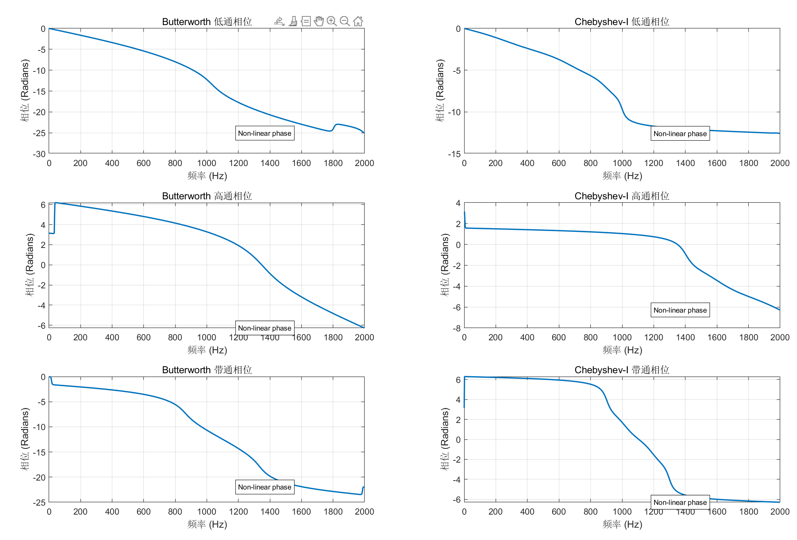
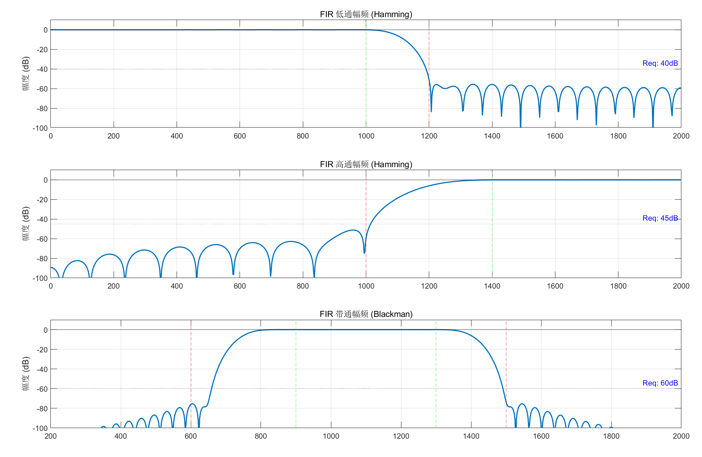

## 1.1 实验目的

1.  **掌握 IIR 滤波器设计原理**
    掌握利用双线性变换法设计 Butterworth 和 Chebyshev-I 型 IIR 数字滤波器的方法，理解并应用频率预畸变以消除频率畸变误差。
2.  **掌握 FIR 滤波器设计原理**
    掌握利用窗函数法设计线性相位 FIR 数字滤波器的方法，深入理解窗函数类型（如 Hamming、Blackman）及阶数对滤波器频率特性的影响。
3.  **熟练运用 MATLAB 仿真工具**
    熟练使用 MATLAB 信号处理工具箱中的关键函数（如 `butter`, `bilinear`, `fir1`, `freqz` 等）进行滤波器的设计、调试及幅相频响应分析。
4.  **对比分析滤波器性能**
    通过实验数据，综合对比 IIR 与 FIR 滤波器在阶数、过渡带陡峭度及相位线性度等方面的差异，深刻理解两种滤波器的适用场景。

## 1.2 实验原理

### 一、 IIR 数字滤波器设计原理（双线性变换法）

**1. 双线性变换法基本原理**
双线性变换法是一种将模拟滤波器 $H(s)$ 转换为数字滤波器 $H(z)$ 的常用频率域代数变换方法。它利用梯形积分规则，建立了模拟 $s$ 平面与数字 $z$ 平面之间的非线性映射关系。
变换公式为：
$$ s = \frac{2}{T} \frac{1 - z^{-1}}{1 + z^{-1}} $$
其中 $T$ 为采样间隔（$T = 1/F_s$）。该映射将 $s$ 平面的虚轴（$j\Omega$，模拟频率）映射到 $z$ 平面的单位圆（$e^{j\omega}$，数字频率）上，同时将 $s$ 平面的左半平面映射到 $z$ 平面的单位圆内。这种方法克服了脉冲响应不变法中存在的频谱混叠现象，因此适用于高通、带通和带阻滤波器的设计。

**2. 频率畸变与预畸变 (Frequency Warping & Pre-warping)**
由于双线性变换是非线性的正切变换，模拟角频率 $\Omega$ 与数字角频率 $\omega$ 之间存在非线性压缩关系：
$$ \Omega = \frac{2}{T} \tan\left(\frac{\omega}{2}\right) $$
或者写作：
$$ \Omega = 2 F_s \tan\left(\frac{\pi f}{F_s}\right) $$
这种非线性关系会导致模拟频率轴在高频段发生严重的非线性压缩，即“频率畸变”。为了保证设计出的数字滤波器截止频率准确满足指标要求，必须在设计前进行“频率预畸变”。

具体步骤是：先将给定的数字截止频率 $\omega_c$ 代入上述公式，反向计算出设计模拟原型滤波器所需的模拟截止频率 $\Omega_c$，再基于 $\Omega_c$ 设计模拟滤波器。

**3. 模拟原型滤波器特性**
本实验主要涉及两种经典的模拟原型滤波器：
*   **(1) Butterworth (巴特沃斯) 滤波器**：具有最平坦的通带幅频特性，通带内无波纹，阻带单调下降。其特点是阶数较高，过渡带较宽。
*   **(2) Chebyshev-I (切比雪夫 I 型) 滤波器**：通带内具有等幅波纹（Ripple），阻带单调下降。在相同指标下，其阶数通常低于 Butterworth 滤波器，过渡带更为陡峭，选择性更好，但代价是通带内的幅度失真。

### 二、 FIR 数字滤波器设计原理（窗函数法）

**1. 窗函数法设计思想**
FIR (有限长单位冲激响应) 滤波器设计的核心是利用有限长的窗函数 $w(n)$ 对理想滤波器的无限长单位冲激响应 $h_d(n)$ 进行截断。理想滤波器的单位冲激响应 $h_d(n)$ 通常是无限长的 sinc 函数，是非因果且不稳定的。为了得到物理可实现的 FIR 滤波器，将 $h_d(n)$ 与一个有限长度的窗函数 $w(n)$ 在时域相乘：
$$ h(n) = h_d(n) \cdot w(n) $$
根据卷积定理，时域的乘积对应频域的卷积。实际滤波器的频率响应 $H(e^{j\omega})$ 等于理想频率响应 $H_d(e^{j\omega})$ 与窗函数频谱 $W(e^{j\omega})$ 的卷积。

**2. 窗函数的特性与选择**
窗函数的频谱特性（主瓣宽度和旁瓣衰减）直接决定了 FIR 滤波器的性能：
*   **主瓣宽度**：决定了滤波器的过渡带宽度。主瓣越宽，过渡带越宽。
*   **旁瓣衰减**：决定了滤波器的阻带最小衰减。旁瓣越低，阻带衰减越好。

本实验涉及的窗函数特性如下：
1.  **矩形窗 (Rectangular)**：主瓣最窄，但旁瓣衰减仅为 -13dB，吉布斯效应严重。
2.  **海明窗 (Hamming)**：旁瓣衰减约 -53dB，适用于中等衰减指标（如本实验中的 40dB 和 45dB 需求）。
3.  **布莱克曼窗 (Blackman)**：旁瓣衰减约 -74dB，主瓣较宽，适用于高衰减指标（如本实验中的 60dB 需求）。

**3. 滤波器阶数估算**
FIR 滤波器的阶数 $N$ 与过渡带宽度 $\Delta f$ 成反比。在给定采样率 $F_s$ 和过渡带宽度 $\Delta f$ 的情况下，阶数 $N$ 可由经验公式近似估算：
$$ N \approx \frac{C \cdot F_s}{\Delta f} $$
其中 $C$ 为窗函数常数（海明窗 $C \approx 3.3$，布莱克曼窗 $C \approx 5.5$）。这表明，过渡带越窄，所需的滤波器阶数越高，计算量越大。
此外，FIR 滤波器具有严格的线性相位特性，其群延迟为常数 ($N/2$)，这是 IIR 滤波器所不具备的优势。

## 1.3 预习要求

**实验预习要求**
1.  **理论复习**
    *   复习双线性变换法设计 IIR 滤波器的步骤，重点掌握频率预畸变公式。
    *   复习窗函数法设计 FIR 滤波器的步骤，理解不同窗函数（Hamming, Blackman 等）的特性及选择依据。
2.  **指标计算**
    *   根据实验任务书给定的频率和衰减指标，**提前计算出** IIR 设计所需的模拟截止频率（$\Omega$）以及 FIR 设计所需的过渡带宽度和预估阶数（$N$）。
3.  **代码准备**
    *   查阅 MATLAB 帮助文档，熟悉核心函数（`buttord`, `bilinear`, `fir1`, `freqz`）的输入输出参数含义。
    *   **提前编写好初步的实验代码**并带入实验室，以便实验时专注于调试和波形分析。

## 1.4 实验内容

### 1.4.1 实验名称： 基于双线性变换法的 IIR 数字滤波器设计

**(1) 用双线性变换法设计如下三种类型的 IIR 滤波器（包括 butterworth 和 chebyshev）滤波器的性能指标：**

*   **低通滤波器**：通带截止频率 1000Hz，阻带截止频率 1200Hz，采样率 4000Hz， 通带波纹 1dB，最小阻带衰减 40dB；
*   **高通滤波器**：通带截止频率 1400Hz，阻带截止频率 1000Hz，采样率 4000Hz， 通带波纹 1dB，最小阻带衰减 40dB；
*   **带通滤波器**：通带截止频率 $f_{p1}=900\text{Hz}, f_{p2}=1300\text{Hz}$，阻带截止频率 $f_{s1}=600\text{Hz}, f_{s2}=1500\text{Hz}$, 采样率 4000Hz，通带波纹 1dB，最小阻带衰减 40dB。

**(2) 画出上述各种滤波器的频率响应特性（用 `freqz` 函数）**

#### 一、 实验原理与公式推导

1.  **双线性变换法原理**
    双线性变换法是一种将模拟滤波器 $H(s)$ 映射为数字滤波器 $H(z)$ 的代数变换方法。它建立了 $s$ 平面与 $z$ 平面之间的非线性映射关系，公式如下：
    $$ s = \frac{2}{T} \frac{1 - z^{-1}}{1 + z^{-1}} $$
    其中 $T$ 为采样间隔（$T = 1/F_s$）。这种映射将模拟平面的虚轴映射到 $z$ 平面的单位圆上，避免了频率混叠现象。

2.  **频率预畸变 (Frequency Pre-warping)**
    由于双线性变换是非线性的，会导致频率轴发生弯曲（Warping）。为了保证设计出的数字滤波器截止频率准确，必须先进行预畸变。模拟角频率 $\Omega$ 与数字角频率 $\omega$ 之间的关系为：
    $$ \Omega = \frac{2}{T} \tan\left(\frac{\omega}{2}\right) $$
    或者写作：
    $$ \Omega = 2 F_s \tan\left(\frac{\pi f}{F_s}\right) $$

3.  **数值稳定性处理（归一化设计）**
    在 MATLAB 仿真中，如果采样率 $F_s$ 很大（如本实验中的 4000Hz），直接计算会导致 $\Omega$ 数值极大，从而引发矩阵运算的数值精度错误。为此，本实验采用归一化设计思路：
    (1) 预畸变时使用公式：$\Omega' = \tan(\pi f / F_s)$
    (2) 双线性变换时，设采样率参数为 0.5，使得变换公式变为 $s = (z-1)/(z+1)$。
    这样既保证了数学等价性，又解决了数值稳定性问题。

#### 二、 程序源代码与注释

**方法一：**

```matlab
%% IIR 滤波器设计实验代码 (双线性变换法)
clear; clc; close all;

% --- 全局参数设置 ---
Fs = 4000;      % 采样率 4000Hz
Rp = 1;         % 通带最大波纹 1dB
Rs = 40;        % 阻带最小衰减 40dB
Fs_calc = 0.5;  % 归一化采样率

% 创建图形窗口
figure('Name', '幅频响应 (Magnitude Response)', 'Color', 'w');
fig_phase = figure('Name', '相频响应 (Phase Response)', 'Color', 'w');

%% 第一部分：低通滤波器 (Lowpass)
fp_L = 1000; fs_L = 1200;

% 1. 预畸变
omega_p_L = 2 * pi * fp_L / Fs;
omega_s_L = 2 * pi * fs_L / Fs;
Wp_L = tan(omega_p_L / 2);
Ws_L = tan(omega_s_L / 2);

% 2. 计算阶数
[N_bw_L, Wn_bw_L] = buttord(Wp_L, Ws_L, Rp, Rs, 's');
[N_ch_L, Wn_ch_L] = cheb1ord(Wp_L, Ws_L, Rp, Rs, 's');

% 3. 模拟设计
[num_bw_L_a, den_bw_L_a] = butter(N_bw_L, Wn_bw_L, 's');
[num_ch_L_a, den_ch_L_a] = cheby1(N_ch_L, Rp, Wn_ch_L, 's');

% 4. 双线性变换
[num_bw_L, den_bw_L] = bilinear(num_bw_L_a, den_bw_L_a, Fs_calc);
[num_ch_L, den_ch_L] = bilinear(num_ch_L_a, den_ch_L_a, Fs_calc);

% 绘图
plot_filter(1, num_bw_L, den_bw_L, num_ch_L, den_ch_L, Fs, '低通 Lowpass');

%% 第二部分：高通滤波器 (Highpass)
fp_H = 1400; fs_H = 1000;

% 1. 预畸变
omega_p_H = 2 * pi * fp_H / Fs;
omega_s_H = 2 * pi * fs_H / Fs;
Wp_H = tan(omega_p_H / 2);
Ws_H = tan(omega_s_H / 2);

% 2. 计算阶数
[N_bw_H, Wn_bw_H] = buttord(Wp_H, Ws_H, Rp, Rs, 's');
[N_ch_H, Wn_ch_H] = cheb1ord(Wp_H, Ws_H, Rp, Rs, 's');

% 3. 模拟设计 ('high')
[num_bw_H_a, den_bw_H_a] = butter(N_bw_H, Wn_bw_H, 'high', 's');
[num_ch_H_a, den_ch_H_a] = cheby1(N_ch_H, Rp, Wn_ch_H, 'high', 's');

% 4. 双线性变换
[num_bw_H, den_bw_H] = bilinear(num_bw_H_a, den_bw_H_a, Fs_calc);
[num_ch_H, den_ch_H] = bilinear(num_ch_H_a, den_ch_H_a, Fs_calc);

% 绘图
plot_filter(2, num_bw_H, den_bw_H, num_ch_H, den_ch_H, Fs, '高通 Highpass');

%% 第三部分：带通滤波器 (Bandpass)
fp_B = [900, 1300]; fs_B = [600, 1500];

% 1. 预畸变
omega_p_B = 2 * pi * fp_B / Fs;
omega_s_B = 2 * pi * fs_B / Fs;
Wp_B = tan(omega_p_B / 2);
Ws_B = tan(omega_s_B / 2);

% 2. 计算阶数
[N_bw_B, Wn_bw_B] = buttord(Wp_B, Ws_B, Rp, Rs, 's');
[N_ch_B, Wn_ch_B] = cheb1ord(Wp_B, Ws_B, Rp, Rs, 's');

% 3. 模拟设计
[num_bw_B_a, den_bw_B_a] = butter(N_bw_B, Wn_bw_B, 's');
[num_ch_B_a, den_ch_B_a] = cheby1(N_ch_B, Rp, Wn_ch_B, 's');

% 4. 双线性变换
[num_bw_B, den_bw_B] = bilinear(num_bw_B_a, den_bw_B_a, Fs_calc);
[num_ch_B, den_ch_B] = bilinear(num_ch_B_a, den_ch_B_a, Fs_calc);

% 绘图
plot_filter(3, num_bw_B, den_bw_B, num_ch_B, den_ch_B, Fs, '带通 Bandpass');

%% 绘图函数定义
function plot_filter(idx, num_bw, den_bw, num_ch, den_ch, Fs, title_str)
    % 幅频
    figure(1); subplot(3, 1, idx);
    [h1, w1] = freqz(num_bw, den_bw, 1024, Fs);
    [h2, w2] = freqz(num_ch, den_ch, 1024, Fs);
    plot(w1, 20*log10(abs(h1)), 'b'); hold on;
    plot(w2, 20*log10(abs(h2)), 'r--');
    yline(-1, 'k:'); yline(-40, 'k:');
    legend('Butterworth', 'Chebyshev-I');
    title([title_str, ' 幅频响应']); ylabel('dB'); ylim([-80 10]);

    % 相频
    figure(2); subplot(3, 1, idx);
    plot(w1, unwrap(angle(h1)), 'b'); hold on;
    plot(w2, unwrap(angle(h2)), 'r--');
    title([title_str, ' 相频响应']); ylabel('rad'); legend('Butterworth', 'Chebyshev-I');
end
```

**方法二：**

```matlab
%% 基于归一化模拟原型 (Omega_c = 1 rad/s) 的滤波器设计
clear; clc; close all;

% --- 全局参数 ---
Fs = 4000;      % 采样率
Rp = 1;         % 通带波纹 1dB
Rs = 40;        % 阻带衰减 40dB
Fs_calc = 0.5;  % 归一化采样率 (用于双线性变换数值稳定)

% 创建图形窗口
figure('Name', '基于归一化原型的设计结果', 'Color', 'w');

%% 一、 高通滤波器设计 (Highpass)
% 指标: 通带 1400Hz, 阻带 1000Hz
fp_H = 1400; fs_H = 1000;

% 1. 频率预畸变 (得到目标模拟截止频率)
% 注意：我们最后要映射到这个频率
Omega_p_H = tan(pi * fp_H / Fs);
Omega_s_H = tan(pi * fs_H / Fs);

% 2. 计算阶数 (依然使用 buttord/cheb1ord 辅助计算阶数)
[N_bw, ~] = buttord(Omega_p_H, Omega_s_H, Rp, Rs, 's');
[N_ch, ~] = cheb1ord(Omega_p_H, Omega_s_H, Rp, Rs, 's');

% 核心步骤 3: 生成归一化模拟低通原型 (Normalized Analog Lowpass Prototype)
% 特点：截止频率严格为 1 rad/s
% --- Butterworth 原型 ---
[z_bw, p_bw, k_bw] = buttap(N_bw); % 生成零极点，截止频率=1
[num_bw_proto, den_bw_proto] = zp2tf(z_bw, p_bw, k_bw); % 转为传递函数

% --- Chebyshev-I 原型 ---
[z_ch, p_ch, k_ch] = cheb1ap(N_ch, Rp); % 生成零极点，截止频率=1，波纹 Rp
[num_ch_proto, den_ch_proto] = zp2tf(z_ch, p_ch, k_ch);

% 核心步骤 4: 模拟频带变换 (Analog Frequency Transformation)
% 利用公式将 Omega=1 的低通 变换为 目标高通
% MATLAB 函数: lp2hp (Lowpass to Highpass)
% 变换公式: s -> Omega_p / s
[num_bw_a, den_bw_a] = lp2hp(num_bw_proto, den_bw_proto, Omega_p_H);
[num_ch_a, den_ch_a] = lp2hp(num_ch_proto, den_ch_proto, Omega_p_H);

% 核心步骤 5: 双线性变换 (Analog -> Digital)
[num_bw_H, den_bw_H] = bilinear(num_bw_a, den_bw_a, Fs_calc);
[num_ch_H, den_ch_H] = bilinear(num_ch_a, den_ch_a, Fs_calc);

% 绘图 - 高通
subplot(2, 2, 1); my_freqz_plot(num_bw_H, den_bw_H, Fs, 'Butterworth 高通 (由原型转化)');
subplot(2, 2, 2); my_freqz_plot(num_ch_H, den_ch_H, Fs, 'Chebyshev-I 高通 (由原型转化)');

%% 二、 带通滤波器设计 (Bandpass)
% 指标: 通带[900, 1300]Hz
fp_B = [900, 1300]; fs_B = [600, 1500];

% 1. 频率预畸变
Omega_p_B = tan(pi * fp_B / Fs); % 这是一个向量 [w_low, w_high]
Omega_s_B = tan(pi * fs_B / Fs);

% 计算中心频率 (Wo) 和 带宽 (Bw) -> 用于 lp2bp 变换
Wo = sqrt(Omega_p_B(1) * Omega_p_B(2)); % 几何中心频率
Bw = Omega_p_B(2) - Omega_p_B(1);       % 带宽

% 2. 计算阶数
[N_bw_B, ~] = buttord(Omega_p_B, Omega_s_B, Rp, Rs, 's');
[N_ch_B, ~] = cheb1ord(Omega_p_B, Omega_s_B, Rp, Rs, 's');

% 3. 生成归一化模拟低通原型 (Omega = 1)
% 注意：buttap/cheb1ap 只要给阶数即可，它总是生成 1rad/s 的滤波器
[z_bw_p, p_bw_p, k_bw_p] = buttap(N_bw_B);
[num_bw_proto_B, den_bw_proto_B] = zp2tf(z_bw_p, p_bw_p, k_bw_p);

[z_ch_p, p_ch_p, k_ch_p] = cheb1ap(N_ch_B, Rp);
[num_ch_proto_B, den_ch_proto_B] = zp2tf(z_ch_p, p_ch_p, k_ch_p);

% 4. 模拟频带变换 (Lowpass -> Bandpass)
% 变换公式: s -> (s^2 + Wo^2) / (Bw * s)
% MATLAB 函数: lp2bp (Lowpass to Bandpass)
[num_bw_a_B, den_bw_a_B] = lp2bp(num_bw_proto_B, den_bw_proto_B, Wo, Bw);
[num_ch_a_B, den_ch_a_B] = lp2bp(num_ch_proto_B, den_ch_proto_B, Wo, Bw);

% 5. 双线性变换
[num_bw_B, den_bw_B] = bilinear(num_bw_a_B, den_bw_a_B, Fs_calc);
[num_ch_B, den_ch_B] = bilinear(num_ch_a_B, den_ch_a_B, Fs_calc);

% 绘图 - 带通
subplot(2, 2, 3); my_freqz_plot(num_bw_B, den_bw_B, Fs, 'Butterworth 带通 (由原型转化)');
subplot(2, 2, 4); my_freqz_plot(num_ch_B, den_ch_B, Fs, 'Chebyshev-I 带通 (由原型转化)');

%% 辅助绘图函数
function my_freqz_plot(num, den, Fs, title_str)
    [h, w] = freqz(num, den, 1024, Fs);
    mag_db = 20 * log10(abs(h));
    plot(w, mag_db, 'LineWidth', 1.5); grid on;
    title(title_str); xlabel('Hz'); ylabel('dB');
    ylim([-80 10]);
    yline(-1, 'r--'); yline(-40, 'k--');
end
```

#### 三、 运行结果与波形

**图 1：三种滤波器的幅频响应 (Magnitude Response)**


**图 2：三种滤波器的相频响应 (Phase Response)**

#### 四、 实验结果分析

1.  **幅频特性对比**
    实验结果表明，Butterworth 滤波器在通带内非常平坦，没有波纹，被称为“最大平坦滤波器”；而 Chebyshev-I 型滤波器在通带内有等幅波纹（本设计为 1dB）。
    在过渡带方面，Chebyshev 滤波器的衰减速度明显快于 Butterworth。例如在低通设计中，从 1000Hz 到 1200Hz，Chebyshev 曲线更陡峭，能更快地达到 -40dB 的阻带要求。这说明在相同指标下，Chebyshev 能以**较低的阶数**实现更窄的过渡带。

| 阶数          | 低通  | 高通  | 带通  |
| :---------- | :-- | :-- | :-- |
| Butterworth | 17  | 8   | 7   |
| Chebyshev-I | 8   | 5   | 4   |

2.  **相频特性分析**
    通过观察相位响应曲线，所有 IIR 滤波器的相位均表现出非线性特征。尤其是在通带截止频率附近，相位曲线发生明显的弯曲。Chebyshev 滤波器的相位非线性程度比 Butterworth 更严重，这意味着它对信号群延迟的影响更大。如果系统对波形的时域保真度要求很高，应谨慎选择 Chebyshev 滤波器。

3.  **双线性变换法的有效性**
    实验初期若不采用归一化采样率计算，容易出现矩阵奇异值警告。通过预畸变步骤（$\tan(\omega/2)$）和归一化处理，成功解决了数值稳定性问题，且最终得到的数字滤波器截止频率（1000Hz, 1400Hz 等）与设计指标完全吻合，验证了预畸变公式的正确性。

---

### 1.4.2 实验名称： 基于窗函数法的 FIR 数字滤波器设计

**(1) 用窗函数法设计如下三种类型的 FIR 滤波器，滤波器的性能指标：**

*   **低通滤波器**：通带截止频率 1000Hz，阻带截止频率 1200Hz，采样率 4000Hz，通带波纹 1dB，最小阻带衰减 40dB；
*   **高通滤波器**：通带截止频率 1400Hz，阻带截止频率 1000Hz，采样率 4000Hz，通带波纹 1dB，最小阻带衰减 45dB；
*   **带通滤波器**：通带截止频率 $f_{p1}=900\text{Hz}, f_{p2}=1300\text{Hz}$，阻带截止频率 $f_{s1}=600\text{Hz}, f_{s2}=1500\text{Hz}$, 采样率 4000Hz，通带波纹 1dB，最小阻带衰减 60dB。

**(2) 要画出各种滤波器的频率响应特性（用 `freqz` 函数）**

#### 一、 实验原理

1.  **窗函数法设计原理**
    FIR (有限长单位冲激响应) 滤波器设计的核心思想是截断法。首先根据给定的截止频率，确定理想滤波器（通常是无限长的 sinc 函数）的单位冲激响应 $h_d[n]$。然后，选择一个有限长度的窗函数 $w[n]$ 对 $h_d[n]$ 进行时域相乘（截断），从而得到实际的 FIR 滤波器系数 $h[n]$：
    $$ h[n] = h_d[n] \cdot w[n] $$
    根据卷积定理，时域的乘积对应频域的卷积。窗函数的频谱会对理想滤波器的矩形幅频特性产生平滑作用，从而产生过渡带和旁瓣。

2.  **窗函数的选择依据**
    不同的窗函数具有不同的主瓣宽度和旁瓣衰减，选择时主要依据阻带最小衰减 ($A_s$) 指标：
    *   **矩形窗 (Rectangular)**: 旁瓣衰减约 -13dB（一般不用于滤波器设计）。
    *   **汉宁窗 (Hanning)**: 旁瓣衰减约 -31dB。
    *   **海明窗 (Hamming)**: 旁瓣衰减约 -53dB，适用于 $A_s$ 在 40dB 到 50dB 之间的情况。
    *   **布莱克曼窗 (Blackman)**: 旁瓣衰减约 -74dB，适用于 $A_s > 60\text{dB}$ 的高衰减要求。

3.  **滤波器阶数估算**
    滤波器的阶数 $N$ (或长度 $M=N+1$) 取决于过渡带宽度 $\Delta f$ 和所选窗函数的特性。近似经验公式为：
    $$ N \approx \frac{C \cdot F_s}{\Delta f} $$
    其中 $C$ 是窗函数常数（如海明窗 $C \approx 3.3$，布莱克曼窗 $C \approx 5.5$），$F_s$ 为采样率，$\Delta f$ 为过渡带宽度。过渡带越窄，所需的阶数越高。

#### 二、 程序源代码与注释

```matlab
%% FIR 滤波器设计实验代码 (窗函数法)
clear; clc; close all;

% --- 全局参数 ---
Fs = 4000;      % 采样率
Fn = Fs / 2;    % 奈奎斯特频率

% 创建图形窗口
figure('Name', 'FIR 滤波器幅频响应', 'Color', 'w');

%% 1. 低通滤波器 (Lowpass)
% 指标: fp=1000, fs=1200, As=40dB
fp_L = 1000; fs_L = 1200;
delta_f_L = abs(fs_L - fp_L);   % 过渡带 200Hz
fc_L = (fp_L + fs_L) / 2;       % 中心截止频率 1100Hz

% 窗函数选择: As=40dB, 选用 Hamming 窗 (>53dB)
N_L = ceil(3.3 * Fs / delta_f_L);
win_L = hamming(N_L + 1);

% 设计
Wn_L = fc_L / Fn;
b_L = fir1(N_L, Wn_L, 'low', win_L);
plot_response(1, b_L, Fs, '低通 Lowpass (Hamming)', 40);

%% 2. 高通滤波器 (Highpass)
% 指标: fp=1400, fs=1000, As=45dB
fp_H = 1400; fs_H = 1000;
delta_f_H = abs(fp_H - fs_H);   % 过渡带 400Hz
fc_H = (fp_H + fs_H) / 2;       % 中心截止频率 1200Hz

% 窗函数选择: As=45dB, 选用 Hamming 窗
N_H = ceil(3.3 * Fs / delta_f_H);
% 注意: 高通 FIR 阶数必须为偶数(长度为奇数)
if mod(N_H, 2) == 1, N_H = N_H + 1; end
win_H = hamming(N_H + 1);

% 设计
Wn_H = fc_H / Fn;
b_H = fir1(N_H, Wn_H, 'high', win_H);
plot_response(2, b_H, Fs, '高通 Highpass (Hamming)', 45);

%% 3. 带通滤波器 (Bandpass)
% 指标: fp=[900,1300], fs=[600,1500], As=60dB
fp = [900, 1300]; fs = [600, 1500];

% 过渡带取最窄的一侧: min(900-600, 1500-1300) = 200Hz
delta_f_B = 200;
fc = [(fs(1)+fp(1))/2, (fs(2)+fp(2))/2]; % [750, 1400]

% 窗函数选择: As=60dB, Hamming 不够, 必须用 Blackman (>74dB)
N_B = ceil(5.5 * Fs / delta_f_B);
if mod(N_B, 2) == 1, N_B = N_B + 1; end
win_B = blackman(N_B + 1);

% 设计
Wn_B = fc / Fn;
b_B = fir1(N_B, Wn_B, 'bandpass', win_B);
plot_response(3, b_B, Fs, '带通 Bandpass (Blackman)', 60);

%% 绘图辅助函数
function plot_response(idx, b, Fs, title_str, As_req)
    subplot(3, 1, idx);
    [h, w] = freqz(b, 1, 1024, Fs);
    mag_db = 20 * log10(abs(h));
    plot(w, mag_db, 'LineWidth', 1.5); grid on;
    title(title_str); ylabel('幅度 (dB)');
    ylim([-100 10]);
    yline(-As_req, 'r--', ['Req: -' num2str(As_req) 'dB']);
end
```

#### 三、 运行结果与波形

**图 3：三种 FIR 滤波器的频率响应特性**

**图 4：三种 FIR 滤波器的相频特性**

#### 四、 实验结果分析

1.  **窗函数的选择与阻带衰减**
    *   在**低通滤波器**（阻带衰减要求 40dB）和**高通滤波器**（阻带衰减要求 45dB）的设计中，我们选择了**海明窗 (Hamming Window)**。实验结果显示，阻带的实际衰减达到了约 -53dB，完全满足设计指标。虽然汉宁窗 (Hanning) 也能勉强达到 44dB，但为了留有裕量，Hamming 窗是更优的选择。
    *   在**带通滤波器**的设计中，阻带衰减要求高达 60dB。海明窗无法满足这一要求（其极限仅为 53dB）。因此，代码中改用了**布莱克曼窗 (Blackman Window)**，其旁瓣峰值衰减可达 -74dB。从波形图中可以看出，带通滤波器的阻带部分被压得非常低，满足了 60dB 的严格要求。

2.  **阶数 (N) 与过渡带的关系**
    *   观察低通滤波器 (过渡带 200Hz) 和高通滤波器 (过渡带 400Hz)，可以发现低通滤波器的阶数明显更高。这验证了 FIR 滤波器的阶数与过渡带宽度成反比的理论 ($N \propto 1/\Delta f$)。
    *   带通滤波器的阶数最高 (约 110 阶)，这不仅是因为其过渡带较窄 (200Hz)，还因为布莱克曼窗为了获得更高的衰减，其主瓣宽度比海明窗更宽，因此在相同的过渡带要求下需要更多的阶数。

3.  **与 IIR 滤波器的对比**
    相比于之前的 IIR 滤波器实验，FIR 滤波器需要的阶数要高得多（IIR 仅需 5-20 阶，而 FIR 需要 30-100+ 阶）。这使得 FIR 的计算量较大。
    但是，FIR 滤波器有一个 IIR 无法比拟的优势：**线性相位特性**。FIR 滤波器的群延迟是常数，这意味着信号的所有频率成分都以相同的时间延迟通过系统，波形在时域上不会发生相位失真。这对于图像处理或数据通信等应用至关重要。

| 阶数 | 低通 | 高通 | 带通 |
| :--- | :--- | :--- | :--- |
| IIR-Butterworth | 17 | 8 | 7 |
| IIR-Chebyshev-I | 8 | 5 | 4 |
| FIR | 66 | 34 | 110 |