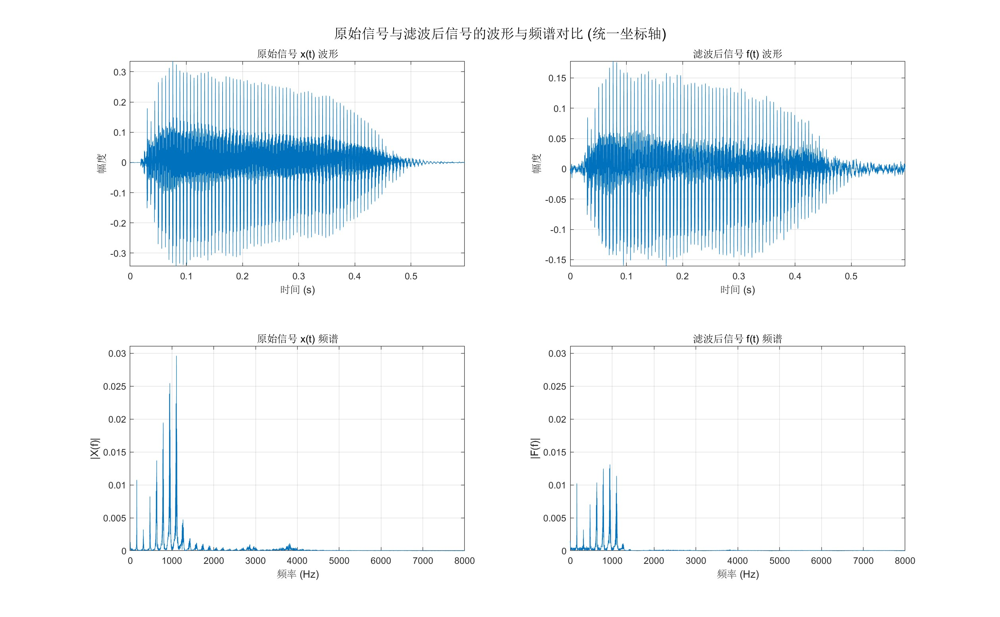
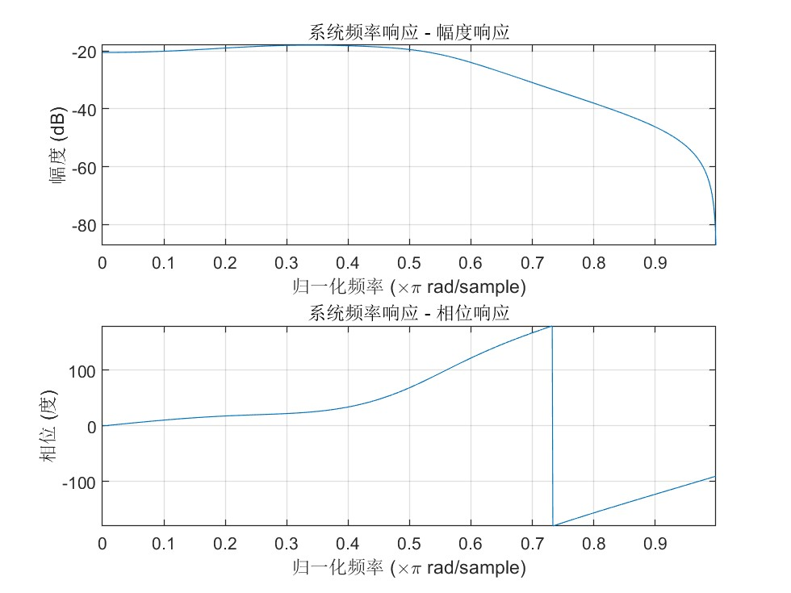

### 1.1 实验目的
*   综合运用数字信号处理的理论知识进行信号分析, 并利用MATLAB 作为编程工具进行计算机实现, 从而加深对所学知识的理解, 建立概念。
*   掌握数字信号处理的基本概念、基本理论和基本方法。
*   学会用 MATLAB 对信号进行分析和处理。
*   用 FFT 实现有限长(或无限长)序列的线性卷积, 熟悉使用 MATLAB 产生零极点分布图, 部分分式展开。

### 1.2 实验原理
本次系列实验涵盖了数字信号处理中的三个核心主题：利用 FFT 实现线性卷积、对信号进行滤波处理，以及 LTI 系统的综合分析。其实验原理主要基于以下理论。

**2.1 离散傅里叶变换(DFT)与线性卷积**

离散傅里叶变换 (DFT) 是连接信号时域与频域的桥梁。对于一个长度为 $N$ 的有限长序列 $x[n]$，其 $N$ 点 DFT $X[k]$ 和逆 DFT (IDFT) $x[n]$ 定义如下：

*   **DFT:**
    $$
    X[k] = \sum_{n=0}^{N-1} x[n]W_N^{kn}, \quad k = 0,1, ..., N-1
    $$
*   **IDFT:**
    $$
    x[n] = \frac{1}{N} \sum_{k=0}^{N-1} X[k]W_N^{-kn}, \quad n = 0,1,..., N-1
    $$
其中，$W_N = e^{-j\frac{2\pi}{N}}$ 是旋转因子。在 MATLAB 中，这两个变换的快速算法 (FFT) 由 `fft(x, N)` 和 `ifft(X, N)` 函数实现。

根据卷积定理，两个信号在时域的卷积等价于它们在频域的乘积。然而，DFT 直接计算的是循环卷积。为了利用 DFT (或 FFT) 得到线性卷积的结果，必须对原始序列进行**补零 (Zero-padding)** 操作以避免时域混叠。

**2.2 数字滤波器与窗函数**

滑动平均滤波器是一种简单的有限冲激响应 (FIR) 低通滤波器。它通过计算输入信号在某一窗口内的算术平均值来实现信号的平滑和高频噪声的滤除。一个 $M$ 点滑动平均滤波器的差分方程定义为：
$$
y[n] = \frac{1}{M} \sum_{k=0}^{M-1} x[n-k]
$$
该滤波器的点数 $M$ 越大，平滑效果越强，低通特性越明显，但同时也会对信号的细节造成更大的损失。

窗函数在数字信号处理中，尤其是在滤波器设计和频谱分析中，扮演着重要角色。**高斯窗**是一种常用的平滑窗，其时域波形形似高斯函数（正态分布曲线）。它具有非常好的时频特性，主瓣较宽，旁瓣衰减很大。在 MATLAB 中，可以使用 `gausswin(N)` 生成一个长度为 $N$ 的高斯窗，其中 $N$ 表示窗口大小。通过 `wvtool` 工具可以方便地可视化窗函数的时域和频域特性。

**2.3 LTI 系统的Z域分析**

线性时不变 (LTI) 系统可以通过其系统函数 $H(z)$ 在Z域中进行全面分析。一个由线性常系数差分方程描述的系统，其系统函数通常为有理分式形式：
$$
\sum_{k=0}^{N} a_k y[n-k] = \sum_{k=0}^{M} b_k x[n-k] \quad \xrightarrow{Z \text{变换}} \quad H(z) = \frac{\sum_{k=0}^{M} b_k z^{-k}}{\sum_{k=0}^{N} a_k z^{-k}}
$$
为了分析和实现，高阶系统函数通常被分解为更简单的形式：

*   **零极点增益形式**: 将系统函数分解为其最基本的构成元素：零点 (Zeros)、极点 (Poles) 和增益 (Gain)。这有助于理解系统的基本特性。在 MATLAB 中，可使用 `[z,p,k] = tf2zp(b,a)` 实现。
*   **二阶系统级联**: 将高阶系统分解为一系列二阶系统 (Second-Order Sections, SOS) 的级联。这种结构在硬件实现时具有更好的数值稳定性和模块化特性。在 MATLAB 中，可使用 `[sos, G] = tf2sos(b,a)` 实现。

系统的零点和极点位置决定了其所有特性。

*   **零极点图**: 将零点 (用 'o' 表示) 和极点 (用 'x' 表示) 绘制在 Z 平面上，可以直观地分析系统。MATLAB 函数为 `zplane(b,a)` 或 `zplane(z,p)`。
*   **稳定性判断**: 系统的稳定性完全由极点的位置决定。若所有极点都在 Z 平面的**单位圆内部**，则系统是**稳定**的。

将系统函数 $H(z)$ 在单位圆上 (即 $z = e^{j\omega}$) 进行取值，即可得到系统的频率响应 $H(e^{j\omega})$。它描述了系统对不同频率正弦信号的响应特性，包括**幅度响应**和**相位响应**。在 MATLAB 中，可以使用 `[H,f] = freqz(b,a,N)` 来计算并绘制频率响应曲线。

<div style="page-break-after: always;"></div>

### 1.3 预习要求

#### 1.3.1 理论知识准备
1.  **线性卷积与循环卷积:**
    *   **复习:** 熟记有限长序列线性卷积的定义公式
        $$
        y[n] = \sum_{k} x[k]h[n-k]
        $$
    *   **掌握:** 深刻理解**卷积定理**，即时域卷积等价于频域乘积。掌握为用 FFT 计算线性卷积而必须进行**补零**的原理，并能独立计算出所需的最小补零长度 $L = M + N - 1$。
2.  **数字滤波器基础:**
    *   **掌握:** 理解**滑动平均滤波器**的差分方程及其作为一种简单低通 FIR 滤波器的原理。思考滤波器点数 $M$ 的大小对滤波效果（去噪能力与信号保真度）的影响。
    *   **了解:** 初步了解**高频提升滤波器**（如 $H(z) = G(1-\alpha z^{-1})$）和**均衡器 (EQ)** 的概念（如高架式、峰值式），知道它们是用来调整信号频率分量的工具。

#### 1.3.2 MATLAB 技能准备
1.  **核心函数功能:** 预先查阅并理解以下 MATLAB 核心函数的功能、输入/输出参数及用法：
    *   **卷积与变换:** `conv`, `fft`, `ifft`
    *   **音频处理:** `audioread`, `sound`, `awgn`
    *   **系统分析与滤波:** `filter`, `fftfilt`, `tf2zp`, `tf2sos`, `zplane`, `freqz`
    *   **绘图:** `plot`, `subplot`, `title`, `xlabel`, `ylabel`, `grid`, `xlim`, `ylim`, `legend`
2.  **代码阅读与调试:**
    *   **预读:** 提前阅读实验指导书中的示例代码，尝试理解每一行代码的作用。
    *   **环境配置:** 确保MATLAB软件已正确安装, 并且音频文件 (`male.wav`) 已放置在 MATLAB 当前工作目录或路径下。
    *   **调试准备:** 了解如何在 MATLAB 中设置断点、单步执行代码，以便在实验中快速定位和解决问题。

---
### 1.4 实验内容

#### 1.4.1 用 FFT 实现有限长序列的线性卷积
给定两个序列 $x=[2,1,1,2], h=[1,-1,-1,1]$

1.  直接计算两个序列的线性卷积；
2.  用FFT 实现线性卷积，并和1的结果对比分析。

##### 一、实验原理与公式推导

对于两个有限长离散序列 $x(n)$ (长度为M) 和 $h(n)$ (长度为N), 它们的线性卷积定义为：
$$
y(n) = x(n) * h(n) = \sum_{k=-\infty}^{\infty} x(k)h(n-k)
$$
由于序列是有限长的, 求和的范围也是有限的。线性卷积的结果 $y(n)$ 是一个长度为 $L = M+N-1$ 的新序列。

直接使用离散傅里叶变换(DFT)或其快速算法(FFT)计算的是**循环卷积**，而非线性卷积。为了利用FFT计算线性卷积，我们必须依据**卷积定理**，并采取关键的补零操作。

**卷积定理:**
时域中的两个序列的卷积，其傅里叶变换等于这两个序列傅里叶变换的乘积。
$$
\text{DFT}[x(n) * h(n)] = X(k) \cdot H(k)
$$
其中, $*$ 代表卷积, $\cdot$ 代表逐点相乘。

**实现步骤:**
为了避免循环卷积带来的时域混叠效应，从而得到与线性卷积相同的结果，必须对原始序列进行补零，使其长度满足 $L \geq M+N-1$。

##### 二、实验内容与代码实现

```matlab
%% --- 0. 初始化环境 ---
clc;         % 清除命令行窗口
clear;       % 清除工作区变量
close all;   % 关闭所有图形窗口

%% --- 1. 定义给定的序列 ---
x = [2, 1, 1, 2];
h = [1, -1, -1, 1];

fprintf('给定的序列为:\n');
fprintf('x = '); disp(x);
fprintf('h = '); disp(h);
fprintf('------------------------------------------\n');

%% --- 2. 方法一: 直接计算线性卷积 ---
fprintf('方法一: 直接使用 conv 函数计算线性卷积\n');
% 使用 MATLAB 內置的 conv 函数, 它实现了线性卷积的定义
y1 = conv(x, h);
fprintf('直接计算的结果 y1 = \n');
disp(y1);
fprintf('------------------------------------------\n');

%% --- 3. 方法二: 用FFT 实现线性卷积 ---
fprintf('方法二: 使用 FFT 实现线性卷积\n');

% 步骤 3.1: 确定 FFT 的计算长度 L
M = length(x); % x 的长度
N = length(h); % h 的长度
L = M + N - 1; % 避免时域混叠所需的最小长度
fprintf('序列 x 的长度 M = %d\n', M);
fprintf('序列 h 的长度 N = %d\n', N);
fprintf('为避免混叠, FFT 长度 L 必须 >= M+N-1 = %d\n', L);

% 步骤 3.2: 对序列进行补零并进行 L 点 FFT
% fft(sequence, L) 函数会自动对序列补零到长度 L
X = fft(x, L);
H = fft(h, L);
fprintf('已完成对两个序列的 %d 点 FFT。\n', L);

% 步骤 3.3: 在频域中逐点相乘
Y = X .* H;
fprintf('已完成频域逐点相乘。\n');

% 步骤 3.4: 进行 L 点 IFFT 返回时域
y2_complex = ifft(Y);

% 由于浮点数计算可能存在微小的虛部, 取实部作为最终结果
y2 = real(y2_complex);
fprintf('IFFT 后的结果 y2 = \n');
disp(y2);
fprintf('------------------------------------------\n');
```

##### 三、实验结果
程序在 MATLAB 中运行后, 命令行窗口输出的计算结果如下:

```
给定的序列为:
x = 
     2     1     1     2
h = 
     1    -1    -1     1
------------------------------------------
方法一: 直接使用 conv 函数计算线性卷积
直接计算的结果 y1 = 
     2    -1    -2     0     2     1     2
------------------------------------------
方法二: 使用 FFT 实现线性卷积
序列 x 的长度 M = 4
序列 h 的长度 N = 4
为避免混叠, FFT 长度 L 必须 >= M+N-1 = 7
已完成对两个序列的 7 点 FFT。
已完成频域逐点相乘。
IFFT 后的结果 y2 = 
    2.0000   -1.0000   -2.0000    0.0000    2.0000    1.0000    2.0000
------------------------------------------
```

##### 四、结果分析与讨论
1.  **结果一致性**: 从实验结果可以看出, 通过方法一 (直接定义法) 计算得到的线性卷积结果 `y1 = [2, -1, -2, 0, 2, 1, 2]`, 与通过方法二 (FFT 法) 计算得到的结果 `y2 = [2, -1, -2, 0, 2, 1, 2]` 完全相同。这有力地验证了卷积定理的正确性, 证明了只要对输入序列进行正确的补零操作, 就可以利用 FFT 精确地计算出线性卷积。
2.  **补零的重要性**: 在方法二中, 关键步骤是确定 FFT 的点数 `L` 必须大于等于 `M+N-1`。如果 `L` 取值过小 (例如取 `max(M,N)`), FFT 计算出的将是循环卷积, 其结果会因为时域混叠而与线性卷积不同。本实验中 `M=4, N=4`, 因此 `L` 至少为 `4+4-1=7`, 程序正确地选择了 `L=7`。
3.  **计算效率分析**:
    *   直接法 (方法一) 的计算复杂度约为 O(M×N)。
    *   FFT法 (方法二) 的计算复杂度主要由三次 FFT/IFFT 和一次乘法构成, 总复杂度约为 O(L log L)。
    *   对于本实验中的短序列 (M=4, N=4), 两种方法的计算速度差异可以忽略不计, 直接法甚至更直观。
    *   然而, 对于长序列 (例如M 和N 达到数千甚至上万点), L log L 的增长速度远小于 M×N。因此, 在处理音频、图像等长信号的卷积运算时, 基于 FFT 的方法具有巨大的计算效率优势, 是实际工程应用中的标准算法。

<div style="page-break-after: always;"></div>

#### 1.4.2 音频信号滤波处理
**题目:** 选择音频信号 `male.wav` 进行如下实验:
1.  读出音频信号 x(t), 确定采样率, 画出时域波形和频谱图。
2.  对音频信号人为加噪声, 回放并感受与原来的不同。
3.  对加噪声后的信号, 用滑动平均滤波器进行滤波 (用 `fftfilt` 实现)。
4.  对比原始信号 x(t) 和滤波后信号 f(t) 的波形及频谱, 播放这两个音频信号, 感受前后声音的变化。

##### 一、实验原理与公式推导
1.  音频信号是模拟信号, 通过采样和量化可以转换为数字信号 x(n)。
    *   **时域波形:** 直接描绘了信号幅度随时间 (或采样点) 变化的图形。
    *   **频谱分析:** 使用离散傅里叶变换 (DFT) 或其快速算法 (FFT) 可以将时域信号 x(n) 变换到频域 X(k), 从而分析信号的频率构成。频谱图通常绘制幅度谱 $|X(k)|$ 随频率 f 变化的曲线。
2.  高斯白噪声是一种理想化的随机信号, 其特点是:
    *   **高斯性:** 信号的瞬时幅度值呈高斯分布 (正态分布)。
    *   **白噪声:** 信号的功率谱密度在整个频域内是均匀分布的, 即它包含了所有频率的成分, 且各频率分量的强度相等。在听感上, 它表现为持续的“嘶嘶”声。
3.  滑动平均滤波器是一种简单的有限冲激响应 (FIR) 滤波器。一个M点滑动平均滤波器的输出 y(n) 是当前及过去 M-1 个输入 x(n) 的算术平均值。其差分方程为：
    $$
    y(n) = \frac{1}{M}\sum_{k=0}^{M-1} x(n-k)
    $$
    它的系统函数 H(z) 为：
    $$
    H(z) = \frac{1}{M}\sum_{k=0}^{M-1} z^{-k} = \frac{1}{M} \frac{1-z^{-M}}{1-z^{-1}}
    $$
    从频率响应上看, 滑动平均滤波器是一个**低通滤波器**。它能够有效地平滑信号, 滤除高频噪声, 但同时也会削弱信号中的高频细节。
4.  对于长信号的滤波 (卷积) 操作, 直接按定义计算效率很低。`fftfilt` 函数利用**重叠相加法 (Overlap-Add Method)**, 通过分块 FFT 来实现快速卷积, 极大地提高了计算效率。其基本思想是: 将长输入信号分段, 每段与滤波器冲激响应进行FFT卷积, 最后将各段卷积结果重叠相加得到最终输出。

##### 二、实验内容与代码实现
```matlab
%% --- 0. 初始化环境 ---
clc; clear; close all;

% 定义要处理的文件名
audioFile = 'male.wav';

%% --- 1. 读出并分析原始音频信号 x(t) ---
fprintf('--- 步骤 1: 读取并分析原始音频信号 ---\n');
[x, Fs] = audioread(audioFile); % 读取音频文件和采样率
if size(x, 2) > 1, x = mean(x, 2); end % 转为单声道
x = x(:); % 确保为列向量
fprintf('音频 "%s" 读取成功, 采样率 Fs = %d Hz\n', audioFile, Fs);
N = length(x);
t = (0:N-1) / Fs; % 时间轴

% --- 绘制原始信号的独立分析图 ---
figure('Name', '原始信号分析 (male.wav)', 'NumberTitle', 'off');
subplot(2, 1, 1);
plot(t, x);
title('原始音频信号 x(t) 的时域波形');
xlabel('时间 (s)'); ylabel('幅度'); grid on; axis tight;

% 计算并绘制频谱图
X_fft = fft(x);
P2 = abs(X_fft / N);
P1 = P2(1:floor(N/2)+1);
P1(2:end-1) = 2*P1(2:end-1);
f = Fs * (0:(N/2)) / N;
subplot(2, 1, 2);
plot(f, P1);
title('原始音频信号 x(t) 的频谱图');
xlabel('频率 (Hz)'); ylabel('|X(f)|'); grid on; xlim([0 Fs/2]);
fprintf('已生成 "原始信号分析" 图形窗口。\n\n');

%% --- 2. 对音频信号人为加噪声 ---
fprintf('--- 步骤 2: 添加高斯白噪声 ---\n');
snr_dB = 15; % 设置信噪比为 15dB
x_noisy = awgn(x, snr_dB, 'measured');
fprintf('已向信号中添加了 %d dB 的高斯白噪声。\n\n', snr_dB);

%% --- 3. 对加噪声后的信号进行滑动平均滤波 ---
fprintf('--- 步骤 3: 使用滑动平均滤波器进行滤波 ---\n');
filter_order = 10; % 设计一个10点的滑动平均滤波器
b = ones(1, filter_order) / filter_order; % 滤波器系数
a = 1; % FIR 滤波器的分母系数为 1
f_t = fftfilt(b, x_noisy); % 使用 fftfilt 进行高效滤波
fprintf('已使用 %d 点滑动平均滤波器完成滤波。\n\n', filter_order);

%% --- 4. 对比原始信号和滤波后信号 ---
fprintf('--- 步骤 4: 对比原始信号与滤波后信号 ---\n');
% 计算滤波后信号的频谱
F_t_fft = fft(f_t);
P2_f = abs(F_t_fft / N);
P1_f = P2_f(1:floor(N/2)+1);
P1_f(2:end-1) = 2*P1_f(2:end-1);

% 计算统一的坐标轴范围以便公平对比
min_amp = min([x; f_t]); max_amp = max([x; f_t]);
amp_margin = (max_amp - min_amp) * 0.05;
y_lim_wave = [min_amp - amp_margin, max_amp + amp_margin];
max_mag = max([P1; P1_f]);
y_lim_spec = [0, max_mag * 1.05];

% 绘制对比图
figure('Name', '原始信号与滤波后信号对比 (统一坐标轴)', 'NumberTitle', 'off');
subplot(2, 2, 1); plot(t, x); title('原始信号 x(t) 波形');
xlabel('时间 (s)'); ylabel('幅度'); grid on; ylim(y_lim_wave); axis tight;
subplot(2, 2, 2); plot(t, f_t); title('滤波后信号 f(t) 波形');
xlabel('时间 (s)'); ylabel('幅度'); grid on; ylim(y_lim_wave); axis tight;
subplot(2, 2, 3); plot(f, P1); title('原始信号 x(t) 频谱');
xlabel('频率 (Hz)'); ylabel('|X(f)|'); grid on; ylim(y_lim_spec); xlim([0 Fs/2]);
subplot(2, 2, 4); plot(f, P1_f); title('滤波后信号 f(t) 频谱');
xlabel('频率 (Hz)'); ylabel('|F(f)|'); grid on; ylim(y_lim_spec); xlim([0 Fs/2]);
sgtitle('原始信号与滤波后信号的波形与频谱对比');
fprintf('已生成 "原始信号与滤波后信号对比" 图形窗口。\n\n');

%% --- 5. 最终音频回放对比 ---
fprintf('--- 步骤 5: 最终音频回放对比 ---\n');
fprintf('将按顺序播放三段音频, 请仔细聆听区别。\n\n');
pause(2);
fprintf('第一遍: 正在播放【原始音频】 ...\n'); sound(x, Fs); pause(length(x)/Fs + 1);
fprintf('第二遍: 正在播放【加噪后音频】...\n'); sound(x_noisy, Fs); pause(length(x_noisy)/Fs + 1);
fprintf('第三遍: 正在播放【滤波后音频】 ...\n'); sound(f_t, Fs); pause(length(f_t)/Fs + 1);
```

##### 三、实验结果与波形

```
--- 步骤 1: 读取并分析原始音频信号 ---
音频 "male.wav" 读取成功, 采样率 Fs = 44100 Hz
已生成 "原始信号分析" 图形窗口。

--- 步骤 2: 添加高斯白噪声 ---
已向信号中添加了 15 dB 的高斯白噪声。

--- 步骤 3: 使用滑动平均滤波器进行滤波 ---
已使用 10 点滑动平均滤波器完成滤波。

--- 步骤 4: 对比原始信号与滤波后信号 ---
已生成 "原始信号与滤波后信号对比" 图形窗口。

--- 步骤 5: 最终音频回放对比 ---
将按顺序播放三段音频, 请仔细聆听区别。

第一遍: 正在播放【原始音频】 ...
第二遍: 正在播放【加噪后音频】...
第三遍: 正在播放【滤波后音频】...
```

**图1: 原始信号分析 (male.wav)**


**图2: 原始信号与滤波后信号对比 (统一坐标轴)**



##### 四、结果分析与讨论

1.  **原始信号分析 (图1):**
    *   **时域波形:** 显示了语音信号幅度随时间的变化, 可以清晰地看到语音的起伏、停顿和能量分布。
    *   **频谱图:** 显示该男声音频的能量主要集中在 4000Hz 以下的中低频区域, 高频分量相对较少, 这符合一般男声的频谱特性。
2.  **加噪信号听感分析:**
    *   在播放第二段音频时, 可以明显听到在原始语音背景上叠加了一层持续的“嘶嘶”声, 这是典型的高斯白噪声听感。噪声的存在使得原始语音的清晰度和可懂度下降, 听感变得嘈杂。
3.  **滤波前后对比分析 (图2):**
    *   **时域波形对比 (左上 vs. 右上):** 滤波后的信号 f(t)波形 (右上) 相比原始信号 x(t) (左上) 和加噪信号 (未画出) 都显得更加平滑。原始信号中的一些细小的、快速变化的毛刺 (高频成分) 被有效抑制, 证明了滤波器的平滑作用。
    *   **频谱图对比 (左下 vs. 右下):** 这是最关键的对比。可以看到, **滤波后信号 f(t)的频谱 (右下) 在高频区域有非常明显的衰减**, 而低频部分基本保持不变。这直观地证明了我们设计的滑动平均滤波器确实起到了**低通滤波**的作用, 成功地滤除了主要分布在高频区域的噪声。
4.  **滤波后信号听感分析:**
    *   在播放第三段音频时, 与第二段加噪音频相比, 背景的“嘶嘶”声几乎消失了, 证明噪声得到了有效抑制, 声音变得比加噪后“干净”了许多。
    *   然而, 与第一段原始音频相比, 滤波后的声音听起来有些**“沉闷”、“模糊”**, 不如原始声音那样清晰和明亮。这是因为滑动平均滤波器在滤除高频噪声的同时, 也无差别地滤掉了原始语音中同样处于高频区域的成分 (如齿音 s、sh 等), 这些成分对于语音的清晰度和质感至关重要。

<div style="page-break-after: always;"></div>

#### 1.4.3 LTI 系统函数分析
对给定的LTI 系统函数进行分析:
$$
H(z) = \frac{0.1 + 0.12z^{-1} + 0.02z^{-2}}{1 - 0.2z^{-1} + 2.42z^{-2} - 1.312z^{-3} + 0.64z^{-4}}
$$
1.  分解成2阶系统的级联;
2.  分解成1阶系统的级联; (即零极点增益形式)
3.  画零极点分布图; (要求分别用 `zplane(b,a)` 和 `zplane(z,p)` 画)
4.  画出系统的频率响应的幅度响应和相位响应。

##### 一、实验原理与公式推导
对于一个 LTI 系统, 其系统函数 $H(z)$ 定义为其单位冲激响应 $h(n)$ 的Z变换。它通常表示为 $z^{-1}$ 的两个多项式的比值形式：
$$
H(z) = \frac{Y(z)}{X(z)} = \frac{\sum_{k=0}^{M} b_k z^{-k}}{1+\sum_{k=1}^{N} a_k z^{-k}}
$$
其中 $b_k$ 是前向路径的系数 (分子), $a_k$ 是反馈路径的系数 (分母)。一个高阶系统函数 $H(z)$ 可以分解为多个低阶 (一阶或二阶) 系统函数的乘积, 这称为级联结构。
$$
H(z) = G \cdot H_1(z) \cdot H_2(z) \cdots H_L(z)
$$
*   **分解为二阶系统 (SOS):** 将系统分解为一系列二阶节 (Second-Order Sections) 和一个总增益 G 的乘积。这种结构在硬件实现时具有很好的数值稳定性和模块化特性。
*   **分解为一阶系统:** 这等同于将系统函数表示为其零点、极点和增益的形式。
*   **零点 (Zeros):** 使系统函数 $H(z)$ 分子为 0 的 z 值。
*   **极点 (Poles):** 使系统函数 $H(z)$ 分母为 0 的 z 值 (即 $H(z)$ 趋于无穷)。

系统的特性完全由其零极点的位置决定。特别是**系统稳定性**, 完全由极点的位置决定：
*   如果所有极点都在 Z 平面的**单位圆内部**, 则系统是**稳定**的。
*   如果存在极点在**单位圆上** (且为单极点), 则系统是**临界稳定**的。
*   如果存在任何极点在**单位圆外部**, 则系统是**不稳定**的。

系统对不同频率正弦信号的响应特性称为频率响应 $H(e^{j\omega})$。它是通过在系统函数 $H(z)$ 中令 $z=e^{j\omega}$ 得到的。频率响应是一个复数, 可以表示为幅度和相位的形式：
$$
H(e^{j\omega}) = |H(e^{j\omega})| e^{j \angle H(e^{j\omega})}
$$
*   **幅度响应** $|H(e^{j\omega})|$: 描述了系统对不同频率信号的增益或衰减。
*   **相位响应** $\angle H(e^{j\omega})$: 描述了不同频率信号通过系统后产生的相位偏移。

##### 二、实验内容与代码实现

```matlab
%% --- 0. 初始化环境和定义系统 ---
clc; clear; close all;

% 根据给定的 H(z) 定义分子 b 和分母 a 的系数
b = [0.1, 0.12, 0.02];
a = [1, -0.2, 2.42, -1.312, 0.64];

fprintf('LTI 系统函数 H(z) 的系数为:\n');
disp('b (分子) = '); disp(b);
disp('a (分母) = '); disp(a);
fprintf('----------------------------------------\n');

%% --- 1. 分解成2阶系统的级联 ---
fprintf('1、分解成2阶系统的级联 (Second-Order Sections):\n');
% 使用 tf2sos 函数将传递函数转换为二阶节形式
[sos, g] = tf2sos(b, a);
fprintf('系统分解为 H(z) = G * H1(z) * H2(z)\n');
fprintf('总增益 G = %f\n', g);
fprintf('二阶节 (SOS) 矩阵为:\n'); disp(sos);
fprintf('----------------------------------------\n');

%% --- 2. 分解成1阶系统的级联 (零极点增益形式) ---
fprintf('2、分解成1阶系统的级联 (零极点增益形式):\n');
% 使用 tf2zp 函数将传递函数转换为零极点增益形式
[z, p, k] = tf2zp(b, a);
fprintf('增益 k = %f\n', k);
fprintf('系统的零点 (zeros) z:\n'); disp(z);
fprintf('系统的极点 (poles) p:\n'); disp(p);
fprintf('----------------------------------------\n');

%% --- 3. 画零极点分布图 ---
fprintf('3、正在绘制零极点分布图...\n');
% 方法一: 直接使用系统系数 b 和 a
figure('Name', '零极点分布图', 'NumberTitle', 'off');
subplot(1, 2, 1);
zplane(b, a);
title('方法一: zplane(b,a)');
xlabel('实部'); ylabel('虛部'); grid on;
% 方法二: 使用求出的零点 z 和极点 p
subplot(1, 2, 2);
zplane(z, p);
title('方法二: zplane(z,p)');
xlabel('实部'); ylabel('虛部'); grid on;
sgtitle('零极点分布图对比');
fprintf('已生成零极点分布图。\n');
fprintf('----------------------------------------\n');

%% --- 4. 画出系统的频率响应 ---
fprintf('4、正在绘制系统的频率响应图...\n');
% 使用 freqz 函数计算频率响应
[H, w] = freqz(b, a, 1024);
figure('Name', '系统频率响应', 'NumberTitle', 'off');
% 绘制幅度响应 (单位: dB)
subplot(2, 1, 1);
plot(w/pi, 20*log10(abs(H)));
title('幅度响应');
xlabel('归一化频率 (\times\pi rad/sample)');
ylabel('幅度 (dB)'); grid on; axis tight;
% 绘制相位响应 (单位: 度)
subplot(2, 1, 2);
plot(w/pi, angle(H)*180/pi);
title('相位响应');
xlabel('归一化频率 (\times\pi rad/sample)');
ylabel('相位 (度)'); grid on; axis tight;
fprintf('已生成系统频率响应图。\n');
```

##### 三、实验结果与波形

```
LTI 系统函数 H(z) 的系数为:
b (分子) = 
    0.1000    0.1200    0.0200
a (分母) = 
    1.0000   -0.2000    2.4200   -1.3120    0.6400
----------------------------------------
1、分解成2阶系统的级联 (Second-Order Sections):
系统分解为 H(z) = G * H1(z) * H2(z)
总增益 G = 0.100000
二阶节 (SOS) 矩阵为:
    1.0000    1.0000         0    1.0000    0.8000    1.0000
    1.0000    0.2000         0    1.0000   -1.0000    0.6400
----------------------------------------
2、分解成1阶系统的级联 (零极点增益形式):
增益 k = 0.100000
系统的零点 (zeros) z:
  -1.0000
  -0.2000
系统的极点 (poles) p:
   0.5000 + 0.8000i
   0.5000 - 0.8000i
  -0.4000 + 0.9000i
  -0.4000 - 0.9000i
----------------------------------------
3、正在绘制零极点分布图...
已生成零极点分布图。
----------------------------------------
4、正在绘制系统的频率响应图...
已生成系统频率响应图。
```
**图1: 零极点分布图对比**


**图2: 系统频率响应**



##### 五、结果分析与讨论

1.  **系统分解分析:**
    *   从第1步结果看, 该4阶系统被成功分解为一个增益 G=0.1 和两个2阶系统的级联, 这为系统实现提供了数值稳定的结构。
    *   从第2步结果看, 系统有2个实数零点 (-1 和 -0.2) 和 2 对共轭复数极点, 增益为 0.1。
2.  **零极点分布图与稳定性分析 (图1):**
    *   两幅零极点图直观展示了零点 ('o') 和极点 ('x') 在 Z 平面的位置。图中虚线为单位圆。
    *   **稳定性判断:** 观察图1可见, **所有4个极点 ('x') 都严格位于单位圆内部**, 因此可以判定该 LTI 系统是**稳定**的。
    *   **方法对比:** `zplane(b,a)` (左图) 比 `zplane(z,p)` (右图) 多画出了两个在原点 z=0 的零点。这是因为这是一个4阶系统, 必须有4个零点和4个极点。当分子阶数(2)小于分母阶数(4)时, 系统在原点处补充了 4-2=2 个零点以配平。`zplane(b,a)`能智能识别这一点, 而`zplane(z,p)`只画出了通过 `tf2zp` 计算出的显式零点。因此, **`zplane(b,a)`的图是更完整的系统描述**。
3.  **频率响应分析 (图2):**
    *   **幅度响应:** 该图显示了系统对不同频率分量的增益。可以看到, 在归一化频率约为 0.4 (即 0.4π rad/sample) 处, 系统有一个明显的增益峰值, 而在低频和高频区域, 增益则较低。这表明该系统具有**带通滤波器**的特性, 它会优先放大处于某个中心频率附近的信号, 同时抑制远低于或远高于该频率的信号。
    *   **相位响应:** 该图显示了不同频率信号通过系统后发生的相位变化。可以看到, 在幅度响应出现峰值的频率附近, 相位发生了剧烈的变化, 这也是谐振系统的典型特征。