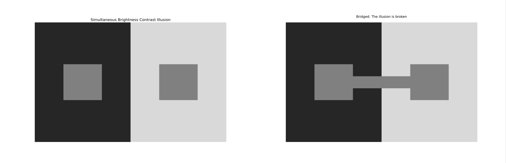
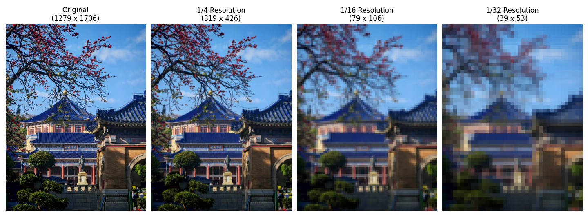
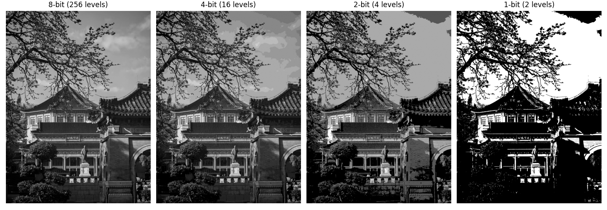

## 实验一：同时对比错觉验证

### 1. 实验题目

验证人眼对亮度的感知受周围背景影响的现象。

### 2. 实验代码

本实验使用 Python 及其科学绘图库 `matplotlib` 进行视觉错觉图像的生成。第一段代码用于复现对比错觉，第二段代码通过在两个中心块之间添加同色的“连接桥”来打破错觉，进行客观验证。

**基础错觉生成代码：**

```python
import matplotlib.pyplot as plt

def generate_brightness_illusion():
    # 创建一块比例为 2:1 的画布
    fig, ax = plt.subplots(figsize=(10, 5))
    ax.axis('off')
    
    # 定义灰度参数
    bg_dark = 0.15     # 左侧深色背景
    bg_light = 0.85    # 右侧浅色背景
    inner_gray = 0.5   # 内部中心方块颜色
    
    # 绘制背景与中心灰块
    ax.add_patch(plt.Rectangle((0, 0), 0.5, 1, facecolor=str(bg_dark)))
    ax.add_patch(plt.Rectangle((0.5, 0), 0.5, 1, facecolor=str(bg_light)))
    ax.add_patch(plt.Rectangle((0.15, 0.35), 0.2, 0.3, facecolor=str(inner_gray)))
    ax.add_patch(plt.Rectangle((0.65, 0.35), 0.2, 0.3, facecolor=str(inner_gray)))
    
    plt.title("Simultaneous Brightness Contrast Illusion", fontsize=14, pad=20)
    plt.show()

if __name__ == "__main__":
    generate_brightness_illusion()
```

**添加连接桥的验证代码：**

```python
def generate_bridged_illusion():
    fig, ax = plt.subplots(figsize=(10, 5))
    ax.axis('off')
    
    bg_dark, bg_light, inner_gray = 0.15, 0.85, 0.5
    
    ax.add_patch(plt.Rectangle((0, 0), 0.5, 1, facecolor=str(bg_dark)))
    ax.add_patch(plt.Rectangle((0.5, 0), 0.5, 1, facecolor=str(bg_light)))
    ax.add_patch(plt.Rectangle((0.15, 0.35), 0.2, 0.3, facecolor=str(inner_gray)))
    ax.add_patch(plt.Rectangle((0.65, 0.35), 0.2, 0.3, facecolor=str(inner_gray)))
    
    # 核心验证：画一条连接两个色块的桥梁，颜色同为 inner_gray (0.5)
    ax.add_patch(plt.Rectangle((0.35, 0.45), 0.3, 0.1, facecolor=str(inner_gray)))
    
    plt.title("Bridged: The illusion is broken", fontsize=14, pad=20)
    plt.show()

generate_bridged_illusion()
```
### 3. 实验结果

运行上述代码后，生成了两副包含左右对比区域的图像。



**视觉观察结果：**

- **错觉现象**：在第一张图中，尽管左右两个内部小矩形使用了完全相同的颜色参数（`inner_gray = 0.5`），左侧被深灰色背景包围的矩形在视觉上显得明显更亮，而右侧被浅灰色背景包围的矩形显得更暗。
    
- **现象打破**：在第二张图中，当使用同样为 `0.5` 灰度的矩形将左右两个中心块连接起来后，大脑的错觉瞬间消失，视觉系统能够清晰地识别出这是一个横跨两种背景的、颜色完全单一均匀的整体图形，左右两端的亮度差异感被消除。

### 4. 结果分析

本实验通过正反两方面的现象成功验证了“人眼对亮度的感知并非绝对，而是受周围背景强烈影响”的机制。产生这种现象的主要原因在于人类视觉系统的**侧抑制**机制以及**格式塔连续性原则**。

1. **相对对比度与侧抑制**：视网膜神经节细胞在受到光刺激时，会向相邻细胞发送抑制信号。浅色背景下的感受器被强烈激活，对中心区域产生了更强的侧抑制，导致大脑感知其“更暗”；反之，深色背景下的侧抑制较弱，中心区域显得“更亮”。视觉系统通过这种方式强化了物体的边缘对比度。
    
2. **连接桥打破错觉的原理**：当加入连接桥后，左右两个原本孤立的色块在空间上形成了一个连续的整体。大脑在处理视觉信息时，会优先进行“对象识别”。连续的色带破坏了原有的局部边界隔离，强制视觉中枢将其判定为一个跨越不同光照环境的单一物体，从而校正了底层视网膜由于侧抑制带来的局部误差反馈。这说明人类的亮度感知不仅受底层神经元机制的影响，还受到高层大脑认知（物体连续性）的调控。

---

## 实验二：空间分辨率变化实验

### 1. 实验题目

观察并分析图像空间分辨率降低时，图像细节特征的变化及其产生的视觉效果。

### 2. 实验代码

本实验使用 Python 的 `Pillow` (PIL) 库和 `matplotlib` 库来处理和显示图像。代码将原始图像按不同比例进行下采样（降低空间分辨率），再使用最近邻插值恢复到原尺寸显示，以直观呈现空间分辨率下降带来的像素化（马赛克）现象。

```python
import matplotlib.pyplot as plt
from PIL import Image

def spatial_resolution_experiment(image_path):
    # 读取原始高分辨率图像
    try:
        original_img = Image.open(image_path).convert('RGB')
    except FileNotFoundError:
        print(f"未找到图片 {image_path}，请确保路径正确。")
        return

    # 获取原始尺寸
    width, height = original_img.size
    
    # 定义不同的分辨率缩放因子 (1为原图，依次降低分辨率)
    scale_factors = [1, 1/4, 1/16, 1/32]
    titles = ['Original', '1/4 Resolution', '1/16 Resolution', '1/32 Resolution']
    
    fig, axes = plt.subplots(1, 4, figsize=(16, 5))
    
    for i, scale in enumerate(scale_factors):
        # 计算降低分辨率后的新尺寸
        new_width = int(width * scale)
        new_height = int(height * scale)
        
        # 步骤 1：下采样（降低分辨率）
        # 使用双线性插值缩小图像，模拟空间采样点减少
        downsampled_img = original_img.resize((max(1, new_width), max(1, new_height)), Image.BILINEAR)
        
        # 步骤 2：上采样恢复原尺寸（仅为了在同一屏幕大小下对比显示）
        # 使用最近邻插值放大，这样可以清晰地看到降低分辨率后产生的“像素块”
        display_img = downsampled_img.resize((width, height), Image.NEAREST)
        
        # 绘制图像
        axes[i].imshow(display_img)
        axes[i].set_title(f"{titles[i]}\n({new_width} x {new_height})", fontsize=12)
        axes[i].axis('off')
        
    plt.tight_layout()
    plt.show()

if __name__ == "__main__":
    # 请将 'test_image.jpg' 替换为您要测试的图像文件名
    spatial_resolution_experiment('test_image.jpg')
```

### 3. 实验结果



**视觉观察结果：**

- **原始图像（Original）**：边缘平滑，纹理清晰，能分辨出非常微小的细节。
    
- **1/4 分辨率**：图像整体依然清晰，但如果仔细观察，一些非常细微的高频细节（如发丝、细小文字或细密的网格纹理）开始出现轻微的模糊。
    
- **1/16 分辨率**：图像质量显著下降，边缘开始呈现明显的锯齿状（阶梯状效应），细小的局部特征已经完全丢失，只能看清物体的基本轮廓和较大的色块。
    
- **1/32 分辨率**：图像出现了严重的“马赛克”现象。整幅图像被分割成了一个个明显的纯色方块，物体的边界难以辨认，高频细节彻底丢失，仅保留了图像极其低频的宏观亮度/色彩分布。
    

### 4. 结果分析

图像的空间分辨率本质上反映了数字图像在空间上的采样密度。当降低图像的空间分辨率时，实际上是在降低二维空间中的**采样率**。

1. **高频信息的丢失（细节丧失）**：图像中的细节（如锐利的边缘、复杂的纹理）对应于二维空间信号中的**高频分量**。根据奈奎斯特-香农采样定理，当采样频率降低时，系统所能记录的最高空间频率也会随之降低。因此，随着分辨率的下降，图像的高频细节被不可逆转地截断或滤除，导致图像变得模糊。
    
2. **像素化与锯齿效应**：数字图像由离散的像素阵列构成。当分辨率极度降低（如 1/32）时，单个采样点（像素）需要代表原图中一大片区域的平均光学信息。此时，连续的物理世界被粗略地量化成了巨大的离散色块，破坏了视觉上的连续性，也就是我们常说的“马赛克”或“锯齿”现象。
    
3. **视觉认知的宏观提取**：尽管在极低分辨率下细节尽失，但由于图像的低频分量（整体明暗对比、大面积色彩分布）得以保留，人类的视觉认知系统依然能够勉强识别出图像的主体轮廓，这说明人眼在进行目标识别时，低频轮廓信息起到了基础的锚定作用。

---

## 实验三：幅度分辨率变化实验

### 1. 实验题目

观察并分析幅度分辨率（灰度级）减少对图像质量的影响。

### 2. 实验代码

本实验使用 Python 的 `numpy` 和 `Pillow` 库处理图像的幅度分辨率。代码首先将图像转换为 8 位灰度图（256 个灰度级），然后通过数学量化算法，逐步将图像的灰度级压缩到 16 级（4-bit）、4 级（2-bit）和 2 级（1-bit/二值图），以直观展示量化位数减少带来的视觉影响。

```python
import matplotlib.pyplot as plt
import numpy as np
from PIL import Image

def amplitude_resolution_experiment(image_path):
    try:
        # 读取图像并转换为标准 8 位灰度图 (L模式)
        img = Image.open(image_path).convert('L')
    except FileNotFoundError:
        print(f"未找到图片 {image_path}，请确保路径正确。")
        return

    # 将图像转换为 numpy 数组以便进行矩阵运算
    img_array = np.array(img)
    
    # 定义要测试的比特深度 (8-bit, 4-bit, 2-bit, 1-bit)
    bits_list = [8, 4, 2, 1]
    
    fig, axes = plt.subplots(1, 4, figsize=(16, 5))
    
    for i, bits in enumerate(bits_list):
        # 计算当前比特深度对应的灰度级数量 (例如 8-bit 为 256 级)
        levels = 2 ** bits
        
        # 均匀量化过程
        quantized_img_array = np.round((img_array / 255.0) * (levels - 1)) * (255.0 / (levels - 1))
        
        # 转换回图像对象
        quantized_img = Image.fromarray(quantized_img_array.astype(np.uint8))
        
        # 绘制图像
        axes[i].imshow(quantized_img, cmap='gray', vmin=0, vmax=255)
        axes[i].set_title(f"{bits}-bit ({levels} levels)", fontsize=12)
        axes[i].axis('off')
        
    plt.tight_layout()
    plt.show()

if __name__ == "__main__":
    amplitude_resolution_experiment('test_image.jpg')
```

### 3. 实验结果



**视觉观察结果：**

- **8-bit (256 levels)**：这是标准的灰度图像，光影过渡非常平滑，细节丰富，人眼基本察觉不到颜色之间的断层。
    
- **4-bit (16 levels)**：图像的整体轮廓依然清晰，但在一些原本亮度渐变平滑的区域（如天空、人脸光影过渡区），开始出现类似等高线一样的可见斑块和断层。
    
- **2-bit (4 levels)**：图像质量严重退化，只能显示黑、深灰、浅灰、白四种颜色。大面积的灰度渐变区塌陷成纯色色块，图像细节大量丢失，暗部和亮部糊成一片。
    
- **1-bit (2 levels)**：这是极端的二值化图像，只有纯黑和纯白。所有中间调的灰度信息完全丢失，图像看起来像是高反差的版画或印章，仅保留了最强烈的边缘对比。
    

### 4. 结果分析

数字图像在计算机中是典型的二维离散信号，降低幅度分辨率本质上就是减少对连续光强信号进行**量化**时的比特数，这会导致量化误差显著增大。

1. **伪轮廓现象**：这是幅度分辨率降低时最典型的视觉特征。在自然界或高比特图像中，亮度的变化通常是平缓且连续的。当灰度级数量被强制减少（例如从 256 级降到 16 级）时，原本平滑过渡的微小亮度差异被强行归入同一个量化区间。当亮度跨越量化阈值时，就会产生突变，导致原本不存在的“阶梯状”假边缘出现，即伪轮廓。
    
2. **量化噪声的增加**：用更少的比特数来表示像素的亮度，意味着量化步长变大。原始连续信号与量化后离散信号之间的差值即为量化误差（或量化噪声）。随着灰度级的减少，信号的信噪比（SNR）急剧下降，图像原有的纹理和微小细节被淹没在巨大的量化误差中，导致视觉上细节的完全丧失。
    
3. **空间与幅度的相互关系**：虽然实验二和实验三分别独立展示了空间采样和幅度量化，但在实际视觉感知中，如果图像包含了大量的高频细节（如密集的细小纹理），人眼对幅度分辨率下降的容忍度会略微提高；反之，在包含大面积平缓渐变的图像中，灰度级的轻微减少就会极其刺眼。
