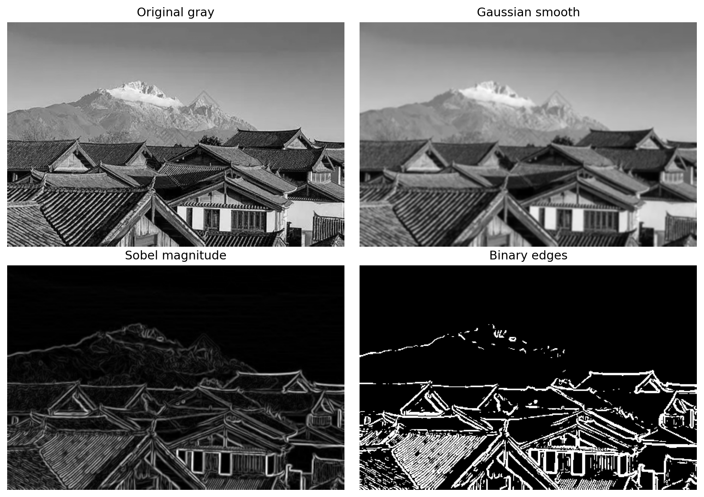
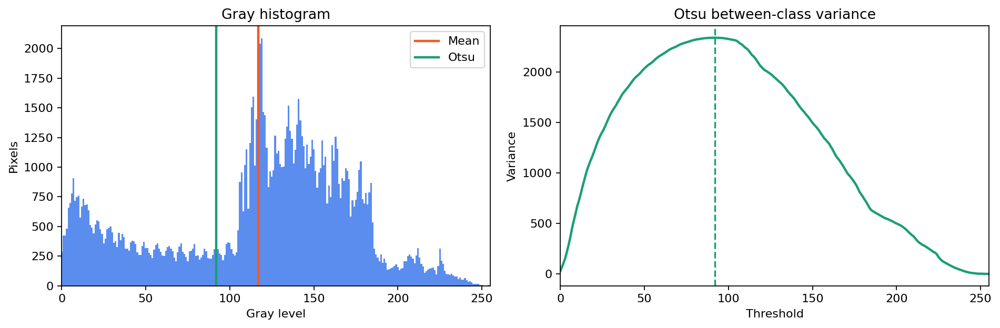
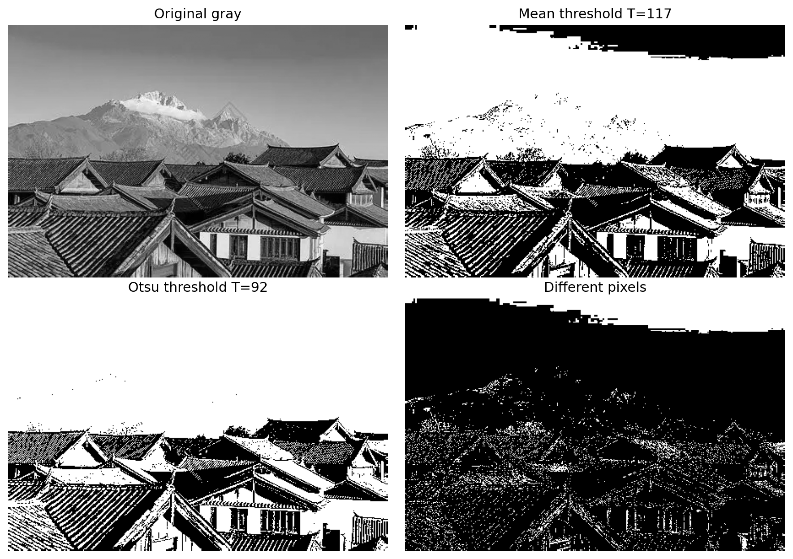

<h1 align="center">实验七 报告</h1>
<div style="text-align: center;">

专业：信息工程5班  姓名：张哲轩  学号：202330352051

</div>

## 一、 实验题目

1. 实现一种基于梯度算子的边缘检测。
2. 实现一种基于阈值的分割方法（利用简单的阈值确定方法）。
3. 实现基于类间方差最大（Otsu's）的图像阈值分割，和题目 2 的分割结果做对比分析。


## 二、 实验环境与代码说明

- 语言：Python 3
- 依赖：`numpy`, `opencv-python`, `matplotlib`
- 源码：实验目录下 `experiment7_edge_threshold_otsu.py`
- 测试图像：实验目录下 `OIP.webp`
- 输出结果：`Figure_sobel_edge_detection.png`, `Figure_threshold_histogram.png`, `Figure_threshold_comparison.png`, `metrics.txt`

主要实现要点：

- 边缘检测采用 Sobel 梯度算子。先用 5×5 高斯模板平滑图像，再分别计算水平方向和垂直方向梯度，最后由梯度幅值获得边缘强度图。
- 简单阈值分割采用全局均值阈值法，即把整幅灰度图的平均灰度作为阈值。
- Otsu 阈值分割通过遍历 0 到 255 的所有候选阈值，计算每个阈值对应的类间方差，选择类间方差最大的阈值。
- 为了体现算法过程，卷积、Sobel 梯度、均值阈值和 Otsu 阈值均在代码中手工实现，OpenCV 只用于图像读写和基础缩放。


## 三、 实现代码

### 3.1 二维卷积实现

梯度算子和高斯平滑都可以写成模板卷积。实验中使用反射填充处理边界，再逐像素计算模板加权和：

```python
def convolve2d(image, kernel):
    image = image.astype(np.float32)
    kernel = np.flipud(np.fliplr(kernel.astype(np.float32)))
    kh, kw = kernel.shape
    pad_h, pad_w = kh // 2, kw // 2
    padded = np.pad(image, ((pad_h, pad_h), (pad_w, pad_w)), mode="reflect")
    result = np.zeros_like(image, dtype=np.float32)

    for y in range(result.shape[0]):
        for x in range(result.shape[1]):
            region = padded[y : y + kh, x : x + kw]
            result[y, x] = float(np.sum(region * kernel))
    return result
```

### 3.2 Sobel 梯度边缘检测

Sobel 算子分别估计横向和纵向灰度变化，梯度幅值越大，说明该位置越可能是边缘。

```python
sobel_x = np.array(
    [[-1, 0, 1], [-2, 0, 2], [-1, 0, 1]],
    dtype=np.float32,
)
sobel_y = np.array(
    [[-1, -2, -1], [0, 0, 0], [1, 2, 1]],
    dtype=np.float32,
)

grad_x = convolve2d(smoothed, sobel_x)
grad_y = convolve2d(smoothed, sobel_y)
magnitude = np.hypot(grad_x, grad_y)
magnitude_u8 = normalize_to_uint8(magnitude)

edge_threshold = float(magnitude_u8.mean() + magnitude_u8.std())
edge_mask = magnitude_u8 > edge_threshold
```

其中梯度幅值计算公式为：

$$
G(x,y)=\sqrt{G_x(x,y)^2+G_y(x,y)^2}
$$

为了得到二值边缘图，本实验对归一化后的梯度幅值使用 `均值 + 标准差` 作为边缘阈值。

### 3.3 简单阈值分割

题目 2 使用简单的全局均值阈值。设图像灰度为 \(f(x,y)\)，图像尺寸为 \(M \times N\)，则阈值为：

$$
T_{mean}=\frac{1}{MN}\sum_{x=0}^{M-1}\sum_{y=0}^{N-1} f(x,y)
$$

代码实现如下：

```python
def mean_threshold_segment(gray):
    threshold = int(round(float(gray.mean())))
    return threshold, gray > threshold
```

该方法计算简单，但只考虑全局平均亮度，不能保证分割后两类灰度差异最大。

### 3.4 Otsu 类间方差最大阈值分割

Otsu 方法把图像像素按阈值 \(T\) 分为背景 \(C_0\) 和前景 \(C_1\)。若两类概率分别为 \(\omega_0,\omega_1\)，两类均值分别为 \(\mu_0,\mu_1\)，则类间方差为：

$$
\sigma_b^2(T)=\omega_0(T)\omega_1(T)[\mu_0(T)-\mu_1(T)]^2
$$

遍历所有候选阈值后，取 \(\sigma_b^2\) 最大的位置作为最佳阈值。

```python
def otsu_threshold_segment(gray):
    hist = np.bincount(gray.ravel(), minlength=256).astype(np.float64)
    prob = hist / hist.sum()
    levels = np.arange(256, dtype=np.float64)

    weight0 = np.cumsum(prob)
    weight1 = 1.0 - weight0
    mean0_numerator = np.cumsum(prob * levels)
    total_mean = mean0_numerator[-1]

    denominator = weight0 * weight1
    between_var = np.zeros(256, dtype=np.float64)
    valid = denominator > 0
    between_var[valid] = (
        (total_mean * weight0[valid] - mean0_numerator[valid]) ** 2
        / denominator[valid]
    )

    threshold = int(np.argmax(between_var))
    return threshold, gray > threshold, between_var
```


## 四、 实验结果

运行脚本：

```powershell
..\.venv\Scripts\python.exe .\experiment7_edge_threshold_otsu.py
```

脚本会在当前实验目录生成所有结果图和 `metrics.txt`。

### 4.1 Sobel 边缘检测结果



Sobel 梯度检测结果如下：

| 指标 | 数值 |
| --- | ---: |
| 归一化梯度二值化阈值 | 62.10 |
| 边缘像素占比 | 14.18% |

从结果图可以看到，Sobel 算子对屋顶轮廓、瓦片纹理、建筑边界和山体边缘都有较明显响应。高斯平滑减少了部分细碎噪声，使边缘图更集中在主要结构上。

### 4.2 阈值分割结果





简单均值阈值法与 Otsu 方法的定量结果如下：

| 方法 | 阈值 T | 前景占比 | 背景均值 | 前景均值 | 类间方差 |
| --- | ---: | ---: | ---: | ---: | ---: |
| 均值阈值分割 | 117 | 59.91% | 61.35 | 155.04 | 2108.11 |
| Otsu 阈值分割 | 92 | 73.12% | 37.74 | 146.79 | 2337.56 |

两种方法的阈值差为 25，分割结果中有 13.21% 的像素不同。


## 五、 对比分析

### 5.1 简单均值阈值法的特点

均值阈值法得到的阈值为 117。该阈值直接由整幅图像的平均灰度确定，实现非常简单，运算速度快，适合灰度分布比较均匀、目标与背景亮度差异明显的图像。

但是本实验图像中同时存在天空、雪山、建筑墙面、深色屋顶和阴影区域，灰度分布并不是理想的双峰结构。均值阈值 117 相对偏高，使得部分中灰度的山体纹理、屋顶纹理和建筑暗部被划入背景，分割结果更强调高亮区域。

### 5.2 Otsu 阈值法的特点

Otsu 方法得到的阈值为 92，低于均值阈值。原因是 Otsu 不直接追随平均亮度，而是寻找能让前景和背景两类灰度差异最大的分割点。从直方图和类间方差曲线可以看出，阈值 92 附近使类间方差达到最大。

Otsu 分割的前景占比为 73.12%，高于均值阈值法的 59.91%。这说明 Otsu 把更多中等亮度区域归入前景，山体、屋顶和建筑墙面中的中灰度细节保留得更多。其类间方差为 2337.56，高于均值阈值法的 2108.11，说明按 Otsu 准则得到的两类灰度可分性更强。

### 5.3 两种阈值分割结果差异

两种二值图的不同像素占比为 13.21%，差异主要集中在山体纹理、屋顶暗部和建筑中灰度区域。均值阈值法由于阈值更高，会把这些区域更多判为背景；Otsu 阈值较低，因此保留了更多中间灰度层次。

如果只从类间方差准则评价，Otsu 的分割效果更优；如果目标任务只希望提取最亮的天空、雪山和墙面区域，均值阈值法的结果也具有一定意义。因此，阈值分割的“好坏”不仅取决于算法指标，也取决于具体希望提取的目标。

### 5.4 边缘检测与阈值分割的关系

Sobel 边缘检测关注的是灰度变化剧烈的位置，输出的是轮廓和纹理边界；阈值分割关注的是像素灰度属于哪一类，输出的是区域划分。二者对图像信息的利用方式不同：Sobel 更适合提取结构边界，阈值法更适合在目标和背景灰度差异明显时提取区域。

在本实验图像中，屋顶瓦片虽然在阈值分割中容易被分散为黑白碎片，但在 Sobel 梯度图中可以形成清晰纹理边缘；天空区域在阈值分割中较容易成为大片前景，但在 Sobel 图中响应较弱。这说明边缘检测和区域分割可以互补使用。


## 六、 总结

### 6.1 实现总结

本实验完成了三部分内容：

1. 使用高斯平滑和 Sobel 梯度算子实现边缘检测，并生成梯度幅值图和二值边缘图。
2. 使用全局灰度均值作为简单阈值，实现基础二值分割。
3. 手工实现 Otsu 类间方差最大阈值选择，并与均值阈值法进行定量和视觉对比。

### 6.2 关键结论

- Sobel 算子能够突出图像中的主要轮廓和纹理边界，对建筑边缘、屋顶纹理和山体轮廓响应明显。
- 均值阈值法实现简单，但容易受整幅图像亮度分布影响，在灰度分布复杂时不一定能得到最优分割点。
- Otsu 方法通过最大化类间方差自动选择阈值。本实验中 Otsu 阈值为 92，类间方差为 2337.56，高于均值阈值法的 2108.11，说明其灰度可分性更好。
- 在没有人工标注真值的情况下，阈值分割结果需要结合直方图、类间方差和具体分割目标共同判断。

### 6.3 可改进方向

1. 对边缘检测结果加入非极大值抑制和双阈值连接，可进一步形成类似 Canny 的细边缘结果。
2. 对阈值分割结果加入形态学开运算、闭运算，可减少孤立噪点并填补区域空洞。
3. 对光照不均匀图像，可尝试局部自适应阈值方法，使不同区域使用不同阈值。
4. 若需要更准确评价分割质量，可引入人工标注真值，并计算准确率、IoU、Dice 系数等指标。
