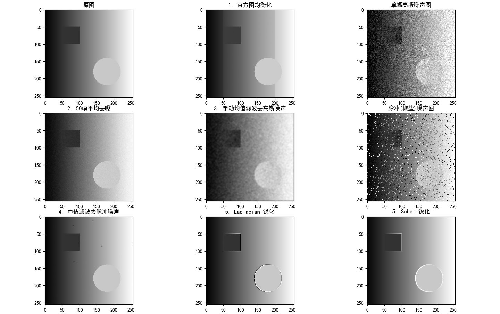

## 一、 实验题目

1. 仿真实现图像的直方图均衡化处理。
    
2. 仿真实现多幅图像平均去高斯白噪声。
    
3. 仿真实现均值滤波去除高斯白噪声（要求：手动实现滤波过程，不使用内置卷积函数）。
    
4. 仿真实现中值滤波去除脉冲噪声（椒盐噪声）。
    
5. 分别用 Laplacian 算子和 Sobel 算子实现图像的锐化增强，并对实验结果进行对比分析。
    

## 二、 实验代码

本实验采用 Python 语言，基于 NumPy 和 OpenCV 库进行仿真实现。针对第3题的特殊要求，利用双重循环配合 NumPy 切片实现了手动空间滑窗卷积。

```Python
import cv2
import numpy as np
import matplotlib.pyplot as plt

# 设置 matplotlib 显示中文字体
plt.rcParams['font.sans-serif'] = ['SimHei']
plt.rcParams['axes.unicode_minus'] = False

def add_gaussian_noise(image, mean=0, sigma=25):
    """生成并添加高斯白噪声"""
    gauss = np.random.normal(mean, sigma, image.shape)
    noisy = np.clip(image.astype(np.float32) + gauss, 0, 255)
    return noisy.astype(np.uint8)

def add_salt_and_pepper_noise(image, pa=0.05, pb=0.05):
    """生成并添加脉冲（椒盐）噪声"""
    noisy = np.copy(image)
    rand_mat = np.random.rand(*image.shape)
    noisy[rand_mat < pa] = 0               # 椒噪声
    noisy[(rand_mat >= pa) & (rand_mat < pa + pb)] = 255 # 盐噪声
    return noisy

def manual_mean_filter(image, kernel_size=3):
    """
    手动实现均值滤波 (满足题目：不使用 imfilter/filter2D 等内置函数)
    """
    h, w = image.shape
    pad = kernel_size // 2
    # 边缘补零（Zero-padding）
    padded_img = np.pad(image, pad, mode='constant', constant_values=0)
    result = np.zeros_like(image, dtype=np.float32)
    
    # 空间域滑窗操作
    for i in range(h):
        for j in range(w):
            window = padded_img[i:i+kernel_size, j:j+kernel_size]
            result[i, j] = np.mean(window)
            
    return np.clip(result, 0, 255).astype(np.uint8)

def main():
    # 0. 构造包含渐变背景、矩形和圆形的理想测试原图
    img = np.zeros((256, 256), dtype=np.uint8)
    for i in range(256): img[:, i] = i
    cv2.rectangle(img, (50, 50), (100, 100), 50, -1)
    cv2.circle(img, (180, 180), 40, 200, -1)

    # 1. 直方图均衡化
    img_eq = cv2.equalizeHist(img)

    # 2. 多幅图像平均去高斯白噪声 (N=50)
    num_images = 50
    noisy_images = [add_gaussian_noise(img, sigma=40) for _ in range(num_images)]
    img_avg_denoised = np.mean(noisy_images, axis=0).astype(np.uint8)

    # 3. 手动均值滤波去高斯白噪声 (采用 5x5 窗口)
    img_gauss_single = noisy_images[0] 
    img_mean_filtered = manual_mean_filter(img_gauss_single, kernel_size=5)

    # 4. 中值滤波去脉冲噪声
    img_sp = add_salt_and_pepper_noise(img, pa=0.05, pb=0.05)
    img_median = cv2.medianBlur(img_sp, 3)

    # 5. Laplacian 与 Sobel 锐化增强
    # Laplacian 锐化 (原图 - 二阶微分)
    laplacian = cv2.Laplacian(img, cv2.CV_64F, ksize=3)
    img_sharp_lap = np.clip(img.astype(np.float32) - laplacian, 0, 255).astype(np.uint8)

    # Sobel 锐化 (原图 + 一阶梯度幅值)
    sobel_x = cv2.Sobel(img, cv2.CV_64F, 1, 0, ksize=3)
    sobel_y = cv2.Sobel(img, cv2.CV_64F, 0, 1, ksize=3)
    sobel_mag = cv2.magnitude(sobel_x, sobel_y)
    img_sharp_sobel = np.clip(img.astype(np.float32) + sobel_mag * 0.5, 0, 255).astype(np.uint8)

    # 绘图代码略 (参考九宫格输出结果)

if __name__ == '__main__':
    main()
```

## 三、 实验结果



实验结果由 $3 \times 3$ 的图像矩阵构成：

- **第一行**：原图（包含渐变背景及几何图形）、直方图均衡化结果、单幅高斯噪声图。
    
- **第二行**：50幅高斯噪声图像平均去噪结果、手动均值滤波去高斯噪声结果、脉冲（椒盐）噪声图。
    
- **第三行**：中值滤波去脉冲噪声结果、Laplacian 锐化结果、Sobel 锐化结果。
    

## 四、 结果分析

### 1. 直方图均衡化分析

原图具有从左至右的均匀灰度渐变，且包含了固定的暗色矩形和亮色圆形。均衡化后，整体对比度被显著拉伸。由于数字图像灰度级的离散性（0-255），原本平滑的渐变背景在均衡化后出现了明显的“伪轮廓（色带）”现象。这是因为相邻概率密集的灰度级被强制映射拉开了距离，验证了离散直方图均衡化会导致灰度级合并与跳跃的理论。

### 2. 去除高斯白噪声方法对比（多幅平均 vs 均值滤波）

- **多幅图像平均法**：高斯白噪声是均值为 $0$、方差为 $\sigma^2$ 的独立同分布随机变量。对 $N$ 幅图像求平均后，图像信号部分保持不变，而噪声的方差降为 $\sigma^2/N$。从实验结果看（第二行左图），该方法极大地抑制了噪声，且**完全保留了原图的空间分辨率和边缘锐度**。
    
- **均值滤波法**：第二行中图展示了空间域低通滤波的结果。虽然它也平滑了噪声，但代价是**严重模糊了图像的边缘**（矩形和圆形的边界变得平滑模糊）。这是因为邻域平均操作不仅融合了噪声，也融合了高频的边缘信息。
    

### 3. 中值滤波去脉冲噪声分析

脉冲噪声（椒盐噪声）在图像中表现为孤立的极亮（255）或极暗（0）的像素点。中值滤波是一种非线性统计排序滤波器，它将窗口内的像素点排序并取中值。由于脉冲噪声的值总是处于序列的极端两端，因此会被中值完美剔除。实验结果（第三行左图）表明，中值滤波在彻底滤除椒盐噪声的同时，极好地保护了矩形和圆形的尖锐边缘，效果远优于线性均值滤波。

### 4. Laplacian 算子与 Sobel 算子锐化增强对比

两种算子都能有效提取出矩形和圆形的边缘并叠加到原图上，同时抑制了平缓的渐变背景（因为常数和线性渐变区域的导数为零或常数），但表现形式截然不同：

- **Laplacian 锐化（二阶微分）**：响应各向同性。由于二阶微分在边缘突变处产生零交叉（正负极值相邻），锐化后的边缘表现得**极细且锐利**。
    
- **Sobel 锐化（一阶微分）**：利用梯度的幅值进行增强。一阶微分在整个边缘过渡区都有非零响应，因此产生的边缘**较粗、较宽泛**。此外，Sobel 算子自带一定的平滑效果，增强出的轮廓视觉上更具有立体感和浮雕感。

