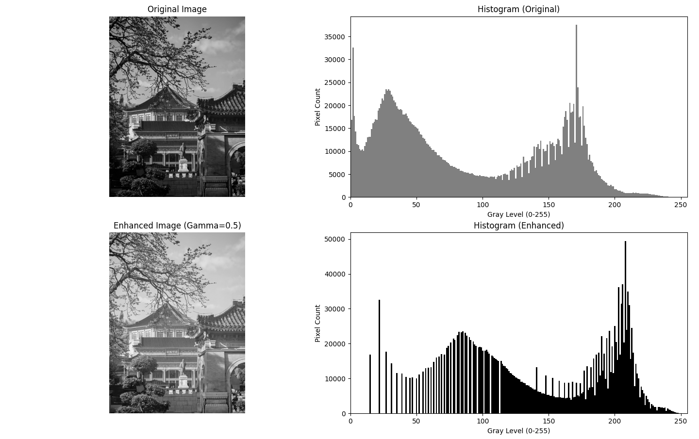

## 实验一：灰度变换增强图像（伽马变换）

### 1. 实验题目

仿真实现一种灰度变换增强图像。本实验采用幂律（伽马）变换对偏暗的图像进行对比度增强。

### 2. 实验代码

```Python
import matplotlib.pyplot as plt
import numpy as np
from PIL import Image

def gamma_transformation(image_path, gamma=0.5):
    # 1. 读取图像并转换为灰度图
    try:
        img = Image.open(image_path).convert('L')
    except FileNotFoundError:
        print(f"未找到图片 {image_path}，请确保路径正确。")
        return

    img_array = np.array(img)
    
    # 2. 归一化图像数据到 [0, 1] 范围
    img_normalized = img_array / 255.0
    
    # 3. 应用伽马变换公式: s = c * r^gamma (此处令 c=1)
    img_gamma = np.power(img_normalized, gamma)
    
    # 4. 反归一化回到 [0, 255] 并转换为 uint8
    img_enhanced = np.uint8(img_gamma * 255.0)
    
    # 5. 绘制对比图
    fig, axes = plt.subplots(1, 2, figsize=(10, 5))
    
    axes[0].imshow(img_array, cmap='gray', vmin=0, vmax=255)
    axes[0].set_title('Original Image', fontsize=12)
    axes[0].axis('off')
    
    axes[1].imshow(img_enhanced, cmap='gray', vmin=0, vmax=255)
    axes[1].set_title(f'Enhanced Image (Gamma={gamma})', fontsize=12)
    axes[1].axis('off')
    
    plt.tight_layout()
    plt.show()

if __name__ == "__main__":
    # 请准备一张稍微偏暗的测试图片 'dark_image.jpg'
    gamma_transformation('dark_image.jpg', gamma=0.5)
```

### 3. 实验结果

![[content/notes/数字图像处理/实验二/Figure_1.png]]

**视觉观察结果：**

- 原始图像整体偏暗，部分暗部细节隐藏在阴影中难以分辨。
    
- 经过 $\gamma = 0.5$ 的幂律变换后，图像的整体亮度得到显著提升，原本隐藏在暗部的纹理和细节变得清晰可见，同时亮部区域并未出现严重的过曝现象，图像的整体视觉质量得到增强。
    

### 4. 结果分析

本实验使用的灰度增强方法是基于空间域的**幂律变换（Gamma Transformation）**。其基本公式为 $s = c r^\gamma$，其中 $r$ 为输入像素值，$s$ 为输出像素值。

- 当 $\gamma < 1$ 时（如本实验中的 0.5），变换曲线在低灰度区域的斜率较大，在高灰度区域的斜率较小。
    
- 这种非线性映射的特点是：**极大地拉伸了暗部区域的灰度级，同时压缩了亮部区域的灰度级**。
    
- 因此，对于曝光不足或整体偏暗的图像，这种变换能够有效扩展低灰度范围，增强暗部细节对比度，符合人眼对亮度非线性感知的视觉特性。
    

---

## 实验二：手工实现图像的直方图统计与增强对比

### 1. 实验题目

仿真实现图像的直方图（禁用 `imhist` 或 `hist()` 函数），并对比原始图像与经过伽马变换增强后图像的直方图变化。

### 2. 实验代码

本实验首先定义了一个纯手工的直方图统计函数 `compute_custom_histogram`，通过遍历像素矩阵数组实现频次统计。随后，对原图进行伽马变换增强，并分别调用该函数绘制增强前后的直方图对比。

```Python
import matplotlib.pyplot as plt
import numpy as np
from PIL import Image

def compute_custom_histogram(img_array):
    """手工统计直方图频次"""
    # 初始化一个长度为 256 的全零数组
    hist_counts = np.zeros(256, dtype=int)
    # 展平二维数组并遍历每一个像素
    flat_pixels = img_array.flatten()
    for pixel_value in flat_pixels:
        hist_counts[pixel_value] += 1
    return hist_counts

def histogram_comparison(image_path, gamma=0.5):
    # 1. 读取原图
    try:
        img = Image.open(image_path).convert('L')
    except FileNotFoundError:
        print(f"未找到图片 {image_path}，请确保路径正确。")
        return
    img_array = np.array(img)
    
    # 2. 生成增强后的图像 (伽马变换)
    img_normalized = img_array / 255.0
    img_gamma = np.power(img_normalized, gamma)
    img_enhanced = np.uint8(img_gamma * 255.0)

    # 3. 手工计算两者的直方图
    hist_orig = compute_custom_histogram(img_array)
    hist_enhanced = compute_custom_histogram(img_enhanced)

    # 4. 绘制 2x2 对比图
    fig, axes = plt.subplots(2, 2, figsize=(12, 10))
    gray_levels = np.arange(256)
    
    # [左上] 原图
    axes[0, 0].imshow(img_array, cmap='gray', vmin=0, vmax=255)
    axes[0, 0].set_title('Original Image', fontsize=12)
    axes[0, 0].axis('off')
    
    # [右上] 原图直方图
    axes[0, 1].bar(gray_levels, hist_orig, width=1, color='gray')
    axes[0, 1].set_title('Histogram (Original)', fontsize=12)
    axes[0, 1].set_xlabel('Gray Level (0-255)')
    axes[0, 1].set_ylabel('Pixel Count')
    axes[0, 1].set_xlim([0, 255])
    
    # [左下] 增强图
    axes[1, 0].imshow(img_enhanced, cmap='gray', vmin=0, vmax=255)
    axes[1, 0].set_title(f'Enhanced Image (Gamma={gamma})', fontsize=12)
    axes[1, 0].axis('off')
    
    # [右下] 增强图直方图
    axes[1, 1].bar(gray_levels, hist_enhanced, width=1, color='black')
    axes[1, 1].set_title('Histogram (Enhanced)', fontsize=12)
    axes[1, 1].set_xlabel('Gray Level (0-255)')
    axes[1, 1].set_ylabel('Pixel Count')
    axes[1, 1].set_xlim([0, 255])

    plt.tight_layout()
    plt.show()

if __name__ == "__main__":
    # 请准备一张稍微偏暗的测试图片 'dark_image.jpg'
    histogram_comparison('dark_image.jpg', gamma=0.5)
```

### 3. 实验结果



**视觉观察结果：**

- **原图及其直方图**：原图整体偏暗，对应到右上角的直方图中，可以看到绝大多数像素集中分布在左侧（低灰度值区间），右侧高亮区域几乎没有像素分布。
    
- **增强图及其直方图**：图像亮度提升，细节显现。对应到右下角的直方图中，原本拥挤在左侧的像素被大幅度向右（中高灰度区域）“拉伸”和“推移”，整个直方图的动态范围变宽。
    

### 4. 结果分析

本次实验通过手工编写像素统计逻辑，成功复现了直方图的底层计算过程，并直观展示了空间域灰度变换对图像统计特征的改变：

1. **直方图的物理意义**：手工统计过程（建立长度为 256 的数组进行频次累加）验证了直方图本质上是图像灰度概率密度函数的离散化表示。它不包含像素的空间位置信息，但精准地反映了图像总体的曝光和对比度状态。
    
2. **灰度变换对直方图的映射作用**：伽马变换（$\gamma < 1$）属于一种非线性的点运算。从实验对比可以看出，这种变换在直方图上的表现不是简单的整体平移，而是一种**非均匀的拉伸**。它将低灰度区间“放大”（拉宽直方图左侧间距），并将高灰度区间“压缩”，从而让大量暗部像素向更高灰度级迁移，增加了暗部细节的可区分度。这种对比证明了通过改变直方图分布来改善图像视觉质量的有效性。
    