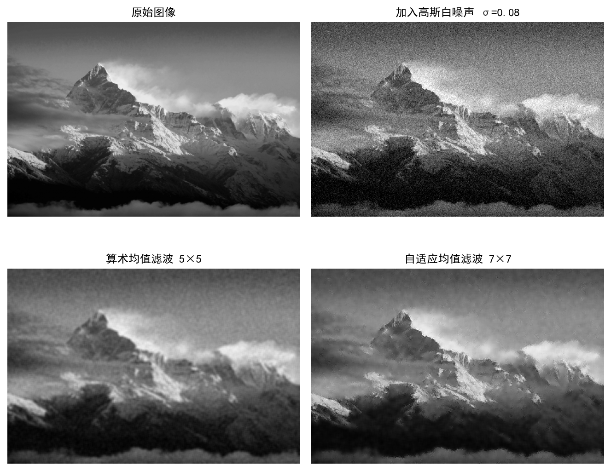
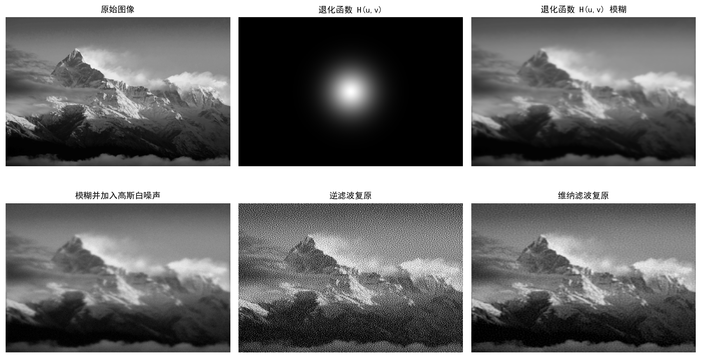
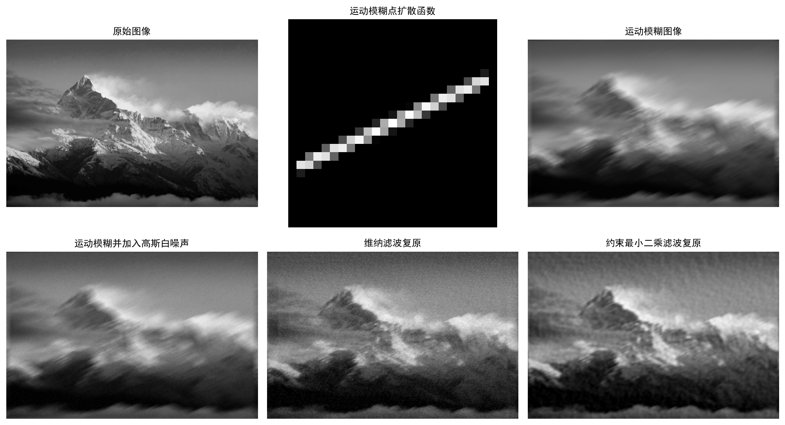

<h1 align="center">4月28号实验报告</h1>
<div style="text-align: center;">

专业：信息工程5班  姓名：张哲轩  学号：202330352051

</div>

## 一、 实验题目

1. 实验作业一选做第 1 题：实现自适应均值滤波，并和算术均值滤波的结果做对比。
    
2. 实验作业二第 1 题：用式
    
    $$H(u,v)=e^{-k(u^2+v^2)^{5/6}}$$
    
    对图像进行模糊处理，然后加入白高斯噪声，得到降质图像。用逆滤波和维纳滤波恢复图像，并对结果进行分析。
    
3. 实验作业二第 2 题：用运动模糊对图像进行模糊处理，然后加入白高斯噪声，得到降质图像。用维纳滤波和约束最小二乘滤波恢复图像，约束线性算子采用拉普拉斯算子，并对实验结果进行对比分析。
    

## 二、 实验代码

本实验基于 Python 环境，使用 `opencv-python` 读取图像和进行局部均值计算，使用 `numpy` 进行快速傅里叶变换与频域复原，使用 `matplotlib` 保存实验结果图。测试图像统一使用 `homepage-bg.jpg`，程序保存为 `experiment_homework.py`，运行后会生成三张结果图和 `experiment_metrics.txt` 指标文件。

``` Python
import cv2
import matplotlib
import numpy as np

matplotlib.use("Agg")
import matplotlib.pyplot as plt


IMG_PATH = "homepage-bg.jpg"
RANDOM_SEED = 20260428


def read_gray_image(path, max_side=512):
    img = cv2.imread(path, cv2.IMREAD_GRAYSCALE)
    h, w = img.shape
    scale = max_side / max(h, w)
    if scale < 1:
        img = cv2.resize(img, (int(round(w * scale)), int(round(h * scale))),
                         interpolation=cv2.INTER_AREA)
    return img.astype(np.float32) / 255.0


def clip01(img):
    return np.clip(np.real(img), 0.0, 1.0)


def add_gaussian_noise(img, sigma, rng):
    noise = rng.normal(0.0, sigma, img.shape)
    return clip01(img + noise)


def psnr(ref, test):
    mse = np.mean((ref - test) ** 2)
    return 10 * np.log10(1.0 / mse)


def arithmetic_mean_filter(img, kernel_size=5):
    return cv2.blur(img, (kernel_size, kernel_size), borderType=cv2.BORDER_REFLECT)


def adaptive_mean_filter(img, noise_var, kernel_size=7):
    local_mean = cv2.blur(img, (kernel_size, kernel_size), borderType=cv2.BORDER_REFLECT)
    local_mean_sq = cv2.blur(img * img, (kernel_size, kernel_size),
                             borderType=cv2.BORDER_REFLECT)
    local_var = np.maximum(local_mean_sq - local_mean * local_mean, 0.0)
    weight = np.clip(noise_var / (local_var + 1e-8), 0.0, 1.0)
    return clip01(img - weight * (img - local_mean))


def fft2c(img):
    return np.fft.fftshift(np.fft.fft2(img))


def ifft2c(freq):
    return np.real(np.fft.ifft2(np.fft.ifftshift(freq)))


def frequency_grid(shape):
    rows, cols = shape
    u = np.arange(rows) - rows // 2
    v = np.arange(cols) - cols // 2
    vv, uu = np.meshgrid(v, u)
    return uu.astype(np.float32), vv.astype(np.float32)


def atmospheric_otf(shape, k=0.0016):
    u, v = frequency_grid(shape)
    return np.exp(-k * np.power(u * u + v * v, 5.0 / 6.0))


def inverse_filter(degraded, h, eps=0.06):
    g = fft2c(degraded)
    h_safe = np.where(np.abs(h) < eps, eps, h)
    return clip01(ifft2c(g / h_safe))


def wiener_filter(degraded, h, k=0.02):
    g = fft2c(degraded)
    restored_freq = np.conj(h) / (np.abs(h) ** 2 + k) * g
    return clip01(ifft2c(restored_freq))


def motion_psf(length=25, angle=25):
    psf = np.zeros((length, length), dtype=np.float32)
    center = length // 2
    psf[center, :] = 1.0
    matrix = cv2.getRotationMatrix2D((center, center), angle, 1.0)
    psf = cv2.warpAffine(psf, matrix, (length, length), flags=cv2.INTER_CUBIC)
    psf = np.maximum(psf, 0.0)
    return psf / np.sum(psf)


def psf2otf(psf, shape):
    pad = np.zeros(shape, dtype=np.float32)
    kh, kw = psf.shape
    pad[:kh, :kw] = psf
    pad = np.roll(pad, -kh // 2, axis=0)
    pad = np.roll(pad, -kw // 2, axis=1)
    return np.fft.fftshift(np.fft.fft2(pad))


def degrade_with_otf(img, h, noise_sigma, rng):
    blurred = clip01(ifft2c(fft2c(img) * h))
    degraded = add_gaussian_noise(blurred, noise_sigma, rng)
    return blurred, degraded


def constrained_least_squares_filter(degraded, h, gamma=0.1):
    laplacian = np.array([[0, -1, 0], [-1, 4, -1], [0, -1, 0]], dtype=np.float32)
    p = psf2otf(laplacian, degraded.shape)
    g = fft2c(degraded)
    restored_freq = np.conj(h) / (np.abs(h) ** 2 + gamma * np.abs(p) ** 2) * g
    return clip01(ifft2c(restored_freq))
```

完整程序中还包含结果图保存函数与主函数，主要流程如下：先读取并归一化图像；实验作业一加入高斯白噪声，分别进行算术均值滤波和自适应均值滤波；实验作业二第 1 题构造指定退化函数并进行逆滤波、维纳滤波；实验作业二第 2 题构造运动模糊点扩散函数，再用维纳滤波和约束最小二乘滤波复原。

## 三、 实验结果

### 1. 自适应均值滤波与算术均值滤波对比



| 图像结果 | PSNR |
| --- | ---: |
| 加入高斯白噪声 | 22.22 dB |
| 算术均值滤波 | 29.26 dB |
| 自适应均值滤波 | 30.43 dB |

### 2. 指定退化函数下的逆滤波与维纳滤波



| 图像结果 | PSNR |
| --- | ---: |
| 模糊并加入高斯白噪声后的降质图像 | 28.72 dB |
| 逆滤波复原图像 | 13.50 dB |
| 维纳滤波复原图像 | 29.91 dB |

### 3. 运动模糊下的维纳滤波与约束最小二乘滤波



| 图像结果 | PSNR |
| --- | ---: |
| 运动模糊并加入高斯白噪声后的降质图像 | 24.92 dB |
| 维纳滤波复原图像 | 26.82 dB |
| 约束最小二乘滤波复原图像 | 28.64 dB |

## 四、 结果分析

### 1. 自适应均值滤波结果分析

算术均值滤波的基本思想是用邻域灰度平均值代替中心像素。对于含高斯白噪声的图像，均值操作可以降低随机噪声的方差，因此图像整体明显变平滑。但是它对所有区域采用同一处理强度，在边缘、山峰纹理和云层细节处也会直接平均，导致图像细节被削弱，轮廓变钝。

自适应均值滤波根据局部方差调节滤波强度。设局部均值为 $m_L$，局部方差为 $\sigma_L^2$，噪声方差为 $\sigma_n^2$，则采用：

$$\hat f(x,y)=g(x,y)-\frac{\sigma_n^2}{\sigma_L^2}\left[g(x,y)-m_L\right]$$

当局部区域较平坦时，$\sigma_L^2$ 较小，噪声占主导，滤波结果更接近局部均值，降噪效果较强；当局部区域包含边缘和纹理时，$\sigma_L^2$ 较大，滤波强度减弱，从而尽量保留细节。实验中自适应均值滤波 PSNR 为 30.43 dB，高于算术均值滤波的 29.26 dB，说明它在降噪和保边之间取得了更好的平衡。

### 2. 指定退化函数复原结果分析

实验作业二第 1 题使用的退化函数为：

$$H(u,v)=e^{-k(u^2+v^2)^{5/6}}$$

该函数随频率半径增大快速衰减，具有低通特性。因此原图经过该退化函数后，高频细节被削弱，山体边缘和云层纹理变模糊；再加入白高斯噪声后，降质图像同时包含模糊和随机噪声。

逆滤波的频域表达式为：

$$\hat F(u,v)=\frac{G(u,v)}{H(u,v)}$$

理论上，当无噪声且 $H(u,v)$ 不为零时，逆滤波可以直接补偿退化函数。但实际图像中存在高斯噪声，而 $H(u,v)$ 在高频处很小，除以很小的数会把高频噪声严重放大。因此实验中逆滤波图像出现大量颗粒噪声，PSNR 下降到 13.50 dB，复原效果较差。

维纳滤波的频域表达式为：

$$\hat F(u,v)=\frac{H^*(u,v)}{|H(u,v)|^2+K}G(u,v)$$

其中 $K$ 相当于噪声功率和图像功率的比值。它不是简单地对 $H(u,v)$ 求倒数，而是在分母中加入噪声抑制项，避免高频处过度放大噪声。实验中维纳滤波复原图像的 PSNR 为 29.91 dB，高于降质图像的 28.72 dB，也明显优于逆滤波，说明维纳滤波对有噪声退化图像更加稳定。

### 3. 运动模糊复原结果分析

实验作业二第 2 题使用长度为 25、角度为 $25^\circ$ 的运动模糊核模拟相机或目标沿某一方向运动造成的退化。运动模糊会把图像中的能量沿运动方向扩散，使山体轮廓和雪线细节产生明显方向性拖影。加入白高斯噪声后，复原问题变得更加病态。

维纳滤波仍然可以通过退化函数的共轭项补偿运动模糊，同时利用参数 $K$ 抑制噪声放大。实验中维纳滤波把 PSNR 从降质图像的 24.92 dB 提升到 26.82 dB，说明它能够恢复部分边缘和纹理，但图像中仍保留一定噪声和残余拖影。

约束最小二乘滤波的表达式为：

$$\hat F(u,v)=\frac{H^*(u,v)}{|H(u,v)|^2+\gamma |P(u,v)|^2}G(u,v)$$

其中 $P(u,v)$ 是拉普拉斯算子的频率响应，$\gamma$ 是约束强度。拉普拉斯算子对高频变化敏感，因此 $\gamma |P(u,v)|^2$ 可以在复原时约束图像的剧烈振荡，减少噪声和伪影。实验中约束最小二乘滤波的 PSNR 为 28.64 dB，高于维纳滤波的 26.82 dB，复原图像也更加平滑稳定，说明拉普拉斯约束对运动模糊加噪声图像有较好的正则化作用。

---

## 五、 实验总结

本次实验完成了三部分内容：第一，选做了自适应均值滤波，并与算术均值滤波进行比较；第二，对指定退化函数造成的模糊加噪图像分别进行逆滤波和维纳滤波复原；第三，对运动模糊加噪图像进行维纳滤波和约束最小二乘滤波复原。

实验结果表明，空间域降噪中，自适应均值滤波能根据局部统计特性调整平滑程度，比固定窗口的算术均值滤波更能保留边缘；频率域复原中，逆滤波对噪声非常敏感，容易放大高频噪声，而维纳滤波通过引入噪声约束提高了复原稳定性；对于运动模糊问题，加入拉普拉斯约束的最小二乘滤波能够进一步抑制噪声和振荡伪影，整体复原效果最好。
