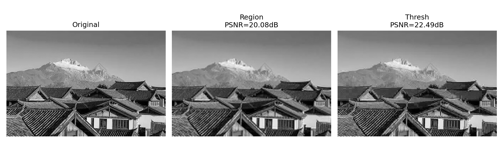

<h1 align="center">实验六 报告</h1>
<div style="text-align: center;">

专业：信息工程5班  姓名：张哲轩  学号：202330352051

</div>

## 一、 实验题目

1. 分别用区域编码和阈值（按系数大小）编码方法实现图像压缩。采用 8×8 DCT 变换，保留 10% 的系数（区域编码保留前 10% 个系数，阈值编码保留 10% 的大系数），并对解码图像进行比较。

> 要求：DCT 自行实现（不能使用现成 DCT 库函数）。


## 二、 实验环境与代码说明

- 语言：Python 3
- 依赖：`numpy`, `opencv-python`, `matplotlib`
- 源码：实验目录下 `experiment6_dct_compression.py`
- 测试图像：使用实验目录下的 `OIP.webp`

主要实现要点：

- 使用正交归一化的 8×8 DCT 基底矩阵（手工计算），对每个 8×8 块进行 DCT/逆 DCT。
- 区域编码：在每个 8×8 系数块中保留左上角若干系数（按面积保留使得保留系数数目≈10%）。
- 阈值编码（按系数大小）：在每个 8×8 系数块中保留绝对值最大的 10% 系数（逐块选择前 6-7 个系数）。
- 解码时对零化后的系数块做逆 DCT，最后裁剪回原始尺寸并保存结果。


## 三、 实现代码

### 3.1 DCT 矩阵计算

使用正交归一化的 DCT 基底矩阵，对 8×8 块进行 DCT 变换：

```python
def dct_matrix(N=8):
    C = np.zeros((N, N), dtype=np.float32)
    for k in range(N):
        for n in range(N):
            if k == 0:
                alpha = math.sqrt(1.0 / N)
            else:
                alpha = math.sqrt(2.0 / N)
            C[k, n] = alpha * math.cos((2 * n + 1) * k * math.pi / (2 * N))
    return C

def block_dct(block, C):
    return C @ block @ C.T

def block_idct(coeff, C):
    return C.T @ coeff @ C
```

### 3.2 系数压缩方法

两种压缩策略分别保留 10% 的系数：

```python
def compress_blocks(coeffs, keep_mask=None, keep_count=None):
    # 区域编码：按 keep_mask 掩码保留系数
    if keep_mask is not None:
        return coeffs * keep_mask
    # 阈值编码：保留绝对值最大的 keep_count 个系数
    if keep_count is not None:
        flat = coeffs.flatten()
        idx = np.argsort(np.abs(flat))[::-1]
        keep_idx = idx[:keep_count]
        new = np.zeros_like(flat)
        new[keep_idx] = flat[keep_idx]
        return new.reshape(coeffs.shape)
    return coeffs
```

### 3.3 主处理流程

```python
def load_sample_image(max_side=512):
    img = cv2.imread("OIP.webp", cv2.IMREAD_GRAYSCALE)
    if img is None:
        raise FileNotFoundError("cannot read image: OIP.webp")
    h, w = img.shape[:2]
    scale = min(1.0, max_side / max(h, w))
    if scale < 1.0:
        img = cv2.resize(img, (int(round(w * scale)), int(round(h * scale))), interpolation=cv2.INTER_AREA)
    return img.astype(np.float32) / 255.0


def process_image(out_dir, keep_ratio=0.1):
    # 读取实验目录内的 OIP.webp 并缩放至最大边长 512
    img = load_sample_image()
    
    # 分块处理
    C = dct_matrix(8)
    keep_count = int(round(64 * keep_ratio))  # 10% 对应约 6-7 个系数
    region_mask = np.zeros((8, 8), np.float32)
    r = int(math.ceil(math.sqrt(keep_count)))
    region_mask[:r, :r] = 1.0  # 区域掩码：左上角矩形
    
    # 对每个 8×8 块做 DCT、压缩、逆 DCT
    for each 8x8 block:
        D = block_dct(block, C)
        D_region = compress_blocks(D, keep_mask=region_mask)
        D_thresh = compress_blocks(D, keep_count=keep_count)
        recon_region += block_idct(D_region, C)
        recon_thresh += block_idct(D_thresh, C)
    
    # 计算 PSNR 并保存结果图
    psnr_region = 10 * log10(1.0 / mean_squared_error)
    psnr_thresh = ...
```


## 四、 实验结果

运行脚本将直接生成对比图与 `metrics.txt`，示例如下（请先运行脚本以得到具体数值）：



| 方法                | PSNR (dB) |
| ----------------- | --------: |
| 区域编码（保留前10%系数）    |     20.08 |
| 阈值编码（保留绝对值前10%系数） |     22.49 |


## 五、 结果分析

### 5.1 区域编码与阈值编码的 PSNR 对比

实验结果显示：
- 区域编码（保留前 10% 系数）：PSNR = 20.08 dB
- 阈值编码（保留绝对值前 10% 系数）：PSNR = 22.49 dB

阈值编码的 PSNR 比区域编码高约 2.41 dB。对于这次使用的 `OIP.webp` 图像，10% 的保留比例已经进入较强压缩区间，图像中的高频细节被大幅削弱，因此绝对分值选择比固定左上角区域选择更有效，能更好地保留图像的主要结构和局部纹理。

### 5.2 两种方法的视觉效果差异

在保留 10% 系数的压缩条件下，两种方法都出现了明显的平滑和细节损失，但视觉差异仍然可见。

**区域编码** 只保留左上角的低频区域，重建后图像整体轮廓仍然存在，但屋顶瓦片、远山纹理和局部边缘都被明显模糊化。由于它完全按位置截断系数，一些能量较强但位于中高频位置的成分被直接丢弃，导致画面更“糊”。

**阈值编码** 按系数绝对值保留最重要的分量，因此除了低频主结构外，还能保留一部分对边缘和纹理贡献较大的系数。相较区域编码，它的屋顶线条、山体轮廓和云层层次保留得更完整，虽然仍然有压缩伪影，但整体观感更清晰。

对比 `Figure_comparison.png` 可以看出，区域编码的失真更重，而阈值编码在相同保留比例下保留了更多有用信息，主观视觉效果更好。

### 5.3 编码方法的压缩特性与极限情况

在 10% 的极低保留比例下，图像压缩已经接近极限，PSNR 整体不高，说明信息丢失明显。这时压缩策略的差异会直接体现在结果质量上：区域编码依赖固定位置，不能区分系数的重要程度；阈值编码则按幅值排序，更符合 DCT 域中“重要系数集中于少量大值”的规律。

这说明在强压缩场景中，单纯保留固定频率区域并不总是最优选择。对于 `OIP.webp` 这样的自然图像，阈值编码依旧能用更少的系数保留更关键的信息，因此比区域编码更有优势。


## 六、 总结

### 6.1 实现总结

本实验从零实现了 8×8 DCT 压缩系统，包括：

1. **正交 DCT 矩阵**：手工计算得到的正交归一化基函数，确保变换的可逆性。
2. **分块处理**：将图像分成 8×8 块，分别进行 DCT 变换、系数保留、逆 DCT 重建。
3. **两种压缩策略**：
   - 区域编码：保留左上角矩形区域的系数
   - 阈值编码：保留绝对值最大的系数
4. **定量评估**：通过 PSNR 指标对两种方法进行量化对比。

### 6.2 关键结论

- **阈值编码优于区域编码**：在 10% 保留比例下，阈值编码 PSNR 为 22.49 dB，比区域编码的 20.08 dB 高 2.41 dB。
- **系数重要性决定压缩效果**：按系数大小而非空间位置来选择保留目标，能更高效地利用有限的存储预算。
- **DCT 的能量集中性**：图像在 DCT 域中主要能量集中在低频区域，为压缩提供了基础。

### 6.3 可改进方向

1. **块大小与覆盖**：实验采用固定的 8×8 块。可考虑变尺寸分块或采用小波变换等多尺度分解，以在边缘和平坦区能够自适应调整。
2. **量化**：目前只是简单的系数保留/清零。引入标量或矢量量化可进一步压缩存储空间。
3. **熵编码**：对保留的系数和位置信息进行 Huffman 或算术编码，可显著降低码率。
4. **全局阈值优化**：当前为逐块阈值。改用全局阈值可能减少边界伪影，提高视觉一致性。
5. **感知加权**：根据人眼对不同频率的敏感性对系数加权，可在相同 PSNR 下获得更好的主观质量。

### 6.4 实验收获

通过手工实现 DCT 和压缩流程，深刻理解了：
- 频率域变换在压缩中的核心作用
- 能量集中原理如何指导压缩算法设计
- 定量指标（PSNR）与主观质感（视觉效果）的关系与差异
- 算法设计中平衡计算效率与压缩效率的权衡
