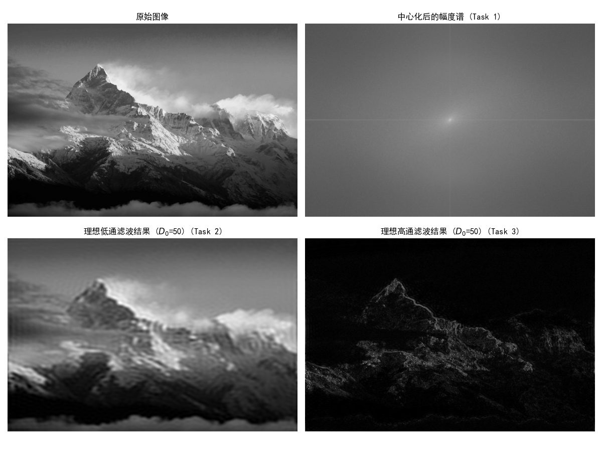
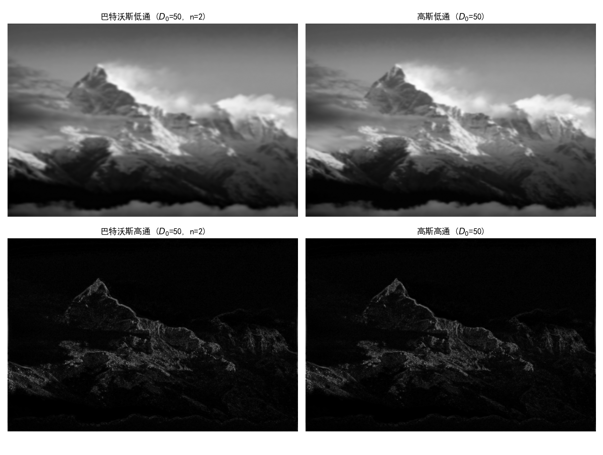

<h1 align="center">4月14号实验报告</h1>
<div style="text-align: center;">

专业：信息工程5班  姓名：张哲轩  学号：202330352051

</div>

## 一、 实验题目

1. 实现图像的傅里叶变换，显示其幅度谱的图像（要求其 0 频在显示图像的中间位置）。
    
2. 用理想低通滤波器在频率域实现低通滤波。
    
3. 用理想高通滤波器在频率域实现高频增强。
    

## 二、 实验代码

本实验基于 Python 环境，使用 `numpy` 进行快速傅里叶变换（FFT），使用 `opencv-python` 读取图像，并使用 `matplotlib` 进行结果可视化。

``` Python
import cv2
import numpy as np
import matplotlib.pyplot as plt
# 1. 读取图像并转换为灰度图
img_path = 'homepage-bg.jpg'
img = cv2.imread(img_path, cv2.IMREAD_GRAYSCALE)
rows, cols = img.shape
crow, ccol = rows // 2, cols // 2  # 图像中心点坐标

# ==========================================
# Task 1: 图像的傅里叶变换及幅度谱显示 (0频居中)
# ==========================================
f = np.fft.fft2(img)
fshift = np.fft.fftshift(f) # 零频分量移到频谱中心
# 计算幅度谱并取对数映射
magnitude_spectrum = 20 * np.log(np.abs(fshift) + 1)

# ==========================================
# 构建滤波器掩膜基础
# ==========================================
x, y = np.ogrid[:rows, :cols]
distance = np.sqrt((x - crow)**2 + (y - ccol)**2)
D0 = 50 # 设定截止频率

# ==========================================
# Task 2: 理想低通滤波器 (ILPF)
# ==========================================
mask_lpf = np.zeros((rows, cols), dtype=np.float32)
mask_lpf[distance <= D0] = 1

fshift_lpf = fshift * mask_lpf
f_ishift_lpf = np.fft.ifftshift(fshift_lpf)
img_lpf = np.abs(np.fft.ifft2(f_ishift_lpf))

# ==========================================
# Task 3: 理想高通滤波器 (IHPF)
# ==========================================
mask_hpf = np.ones((rows, cols), dtype=np.float32)
mask_hpf[distance <= D0] = 0

fshift_hpf = fshift * mask_hpf
f_ishift_hpf = np.fft.ifftshift(fshift_hpf)
img_hpf = np.abs(np.fft.ifft2(f_ishift_hpf))

plt.rcParams['font.sans-serif'] = ['SimHei'] 
plt.rcParams['axes.unicode_minus'] = False 

plt.figure(figsize=(12, 10))

plt.subplot(221), plt.imshow(img, cmap='gray'), plt.title('原始图像'), plt.axis('off')
plt.subplot(222), plt.imshow(magnitude_spectrum, cmap='gray'), plt.title('中心化后的幅度谱'), plt.axis('off')
plt.subplot(223), plt.imshow(img_lpf, cmap='gray'), plt.title(f'理想低通滤波 ($D_0$={D0})'), plt.axis('off')
plt.subplot(224), plt.imshow(img_hpf, cmap='gray'), plt.title(f'理想高通滤波 ($D_0$={D0})'), plt.axis('off')

plt.tight_layout()
plt.show()
```

## 三、 实验结果



## 四、 结果分析

### 1. 傅里叶变换与幅度谱分析

图像经过二维快速傅里叶变换（2D-FFT）后，从空间域转换到了频率域。默认情况下，低频分量位于矩阵的四个角。通过 `fftshift` 操作，将零频（直流分量）平移至图像的几何中心。

在可视化幅度谱时，由于直流分量和低频能量远大于高频分量，直接显示会导致除中心外的区域一片漆黑。因此采用了对数变换公式进行动态范围压缩：

$$S(u,v) = c \cdot \log(1 + |F(u,v)|)$$

从幅度谱图中可以看出，中心区域呈现高亮，这代表了图像中平缓变化的大面积背景区域（低频）；而四周发散的暗淡纹理则代表了图像的边缘、细节以及噪声（高频）。

### 2. 理想低通滤波 (ILPF) 结果分析

理想低通滤波器的传递函数为：

$$H(u,v) = \begin{cases} 1, & D(u,v) \le D_0 \\ 0, & D(u,v) > D_0 \end{cases}$$

实验中设定截止频率 $D_0 = 50$。通过将频率域图像与该滤波器相乘，滤除了高频成分。

**现象与原因**：

- **图像模糊**：因为代表边缘和细节的高频分量被截断，图像失去了锐利度，整体变得平滑模糊。
    
- **振铃效应：由于理想滤波器在频率域呈现硬截断（阶跃函数），其反傅里叶变换到空间域表现为 $Sinc$ 函数。这种类似于水波纹的旁瓣效应作用于图像边缘，导致低通滤波后的图像周围出现了明显的波纹状伪影。
    

### 3. 理想高通滤波 (IHPF) 结果分析

理想高通滤波器与低通滤波器刚好相反，它滤除了中心区域的低频直流分量，仅保留外围的高频信息。

**现象与原因**：

- **边缘提取与背景丢失**：滤波后的图像呈现出一种类似于“线稿”的视觉效果。由于代表灰度平缓过渡的低频分量被置零，图像失去了原本的对比度和背景亮度，整体偏暗。
    
- **细节增强**：图像中的突变区域（如物体轮廓、线条边缘）对应于高频分量，这些部分得到了完整的保留甚至在视觉上被突出放大。

---

## 五、 提升作业：巴特沃斯与高斯滤波器的实现

### 1. 实验原理与数学模型

在频率域滤波中，令 $D(u,v)$ 为频率域上点 $(u,v)$ 到中心原点的距离，$D_0$ 为截止频率。

- **巴特沃斯滤波器**：具有平滑的过渡带。阶数 $n$ 控制着截断的陡峭程度。阶数越高，越接近理想滤波器。
    
    - 低通 (BLPF)：
        
        $$H(u,v) = \frac{1}{1 + [D(u,v)/D_0]^{2n}}$$
        
    - 高通 (BHPF)：
        
        $$H(u,v) = \frac{1}{1 + [D_0/D(u,v)]^{2n}}$$
        
- **高斯滤波器：过渡最为平缓，在空间域和频率域的形态都是高斯钟形曲线，**完全没有振铃效应**。
    
    - 低通 (GLPF)：
        
        $$H(u,v) = e^{-D^2(u,v) / 2D_0^2}$$
        
    - 高通 (GHPF)：
        
        $$H(u,v) = 1 - e^{-D^2(u,v) / 2D_0^2}$$
        

### 2. 实验代码

```Python
import cv2
import numpy as np
import matplotlib.pyplot as plt

# 1. 读取图像并完成傅里叶变换及中心化
img_path = 'homepage-bg.jpg'
img = cv2.imread(img_path, cv2.IMREAD_GRAYSCALE)

rows, cols = img.shape
crow, ccol = rows // 2, cols // 2

f = np.fft.fft2(img)
fshift = np.fft.fftshift(f)

# 2. 计算距离矩阵 D(u,v)
x, y = np.ogrid[:rows, :cols]
distance = np.sqrt((x - crow)**2 + (y - ccol)**2)
# 将距离为 0 的中心点设为一个极小值，避免巴特沃斯高通滤波中出现除以 0 的错误
distance[distance == 0] = 1e-5 

D0 = 50  # 设定截止频率
n = 2    # 巴特沃斯滤波器阶数
# ==========================================
# 3. 构建滤波器掩膜 (Masks)
# ==========================================
# (1) 巴特沃斯低通滤波器 (BLPF)
mask_blpf = 1 / (1 + (distance / D0)**(2 * n))
# (2) 高斯低通滤波器 (GLPF)
mask_glpf = np.exp(-(distance**2) / (2 * (D0**2)))

# (3) 巴特沃斯高通滤波器 (BHPF)
mask_bhpf = 1 / (1 + (D0 / distance)**(2 * n))
# (4) 高斯高通滤波器 (GHPF)
mask_ghpf = 1 - np.exp(-(distance**2) / (2 * (D0**2)))
# ==========================================
# 4. 定义应用滤波器并逆变换的函数
# ==========================================
def apply_filter(fshift_img, mask):
    # 频域相乘
    fshift_filtered = fshift_img * mask
    # 逆平移
    f_ishift = np.fft.ifftshift(fshift_filtered)
    # 逆傅里叶变换取绝对值
    img_back = np.abs(np.fft.ifft2(f_ishift))
    return img_back
# 生成滤波结果
img_blpf = apply_filter(fshift, mask_blpf)
img_glpf = apply_filter(fshift, mask_glpf)
img_bhpf = apply_filter(fshift, mask_bhpf)
img_ghpf = apply_filter(fshift, mask_ghpf)

plt.rcParams['font.sans-serif'] = ['SimHei'] 
plt.rcParams['axes.unicode_minus'] = False 
plt.figure(figsize=(12, 10))
plt.subplot(221), plt.imshow(img_blpf, cmap='gray'), plt.title(f'巴特沃斯低通 ($D_0$={D0}, n={n})'), plt.axis('off')
plt.subplot(222), plt.imshow(img_glpf, cmap='gray'), plt.title(f'高斯低通 ($D_0$={D0})'), plt.axis('off')
plt.subplot(223), plt.imshow(img_bhpf, cmap='gray'), plt.title(f'巴特沃斯高通 ($D_0$={D0}, n={n})'), plt.axis('off')
plt.subplot(224), plt.imshow(img_ghpf, cmap='gray'), plt.title(f'高斯高通 ($D_0$={D0})'), plt.axis('off')
plt.tight_layout()
plt.show()
```

### 3. 结果分析与对比总结

- **低通滤波对比**：与基础作业中的“理想低通滤波”相比，巴特沃斯和高斯低通滤波得到的图像边缘更加自然。由于截断过程是渐进的，图像四周没有明显的波纹状伪影（振铃效应）。其中，高斯滤波器的平滑效果最为柔和。
    
- **高通滤波对比**：理想高通滤波在提取边缘时往往显得非常生硬，而巴特沃斯和高斯高通滤波提取出的边缘更加连续且平滑。高频增强不仅提取了轮廓，同时也保留了部分低频信息过渡区的自然质感。