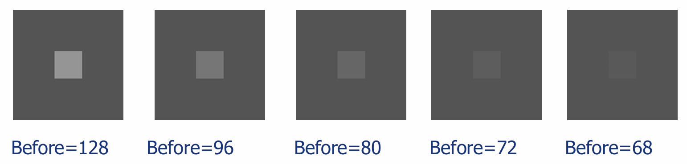
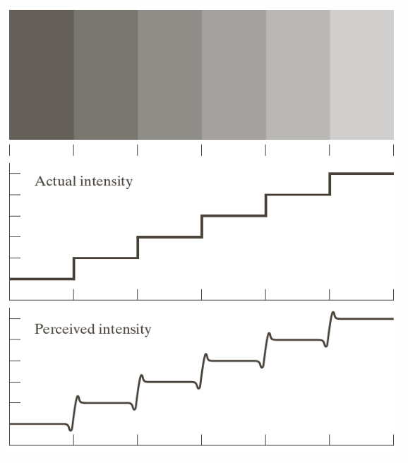
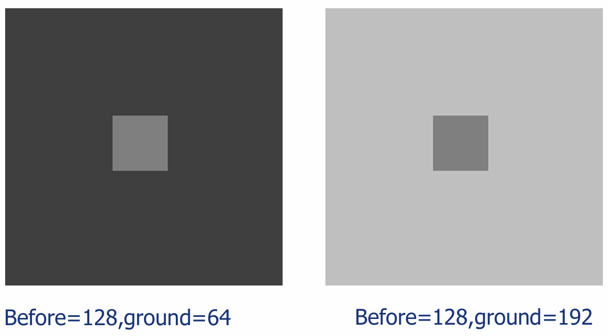
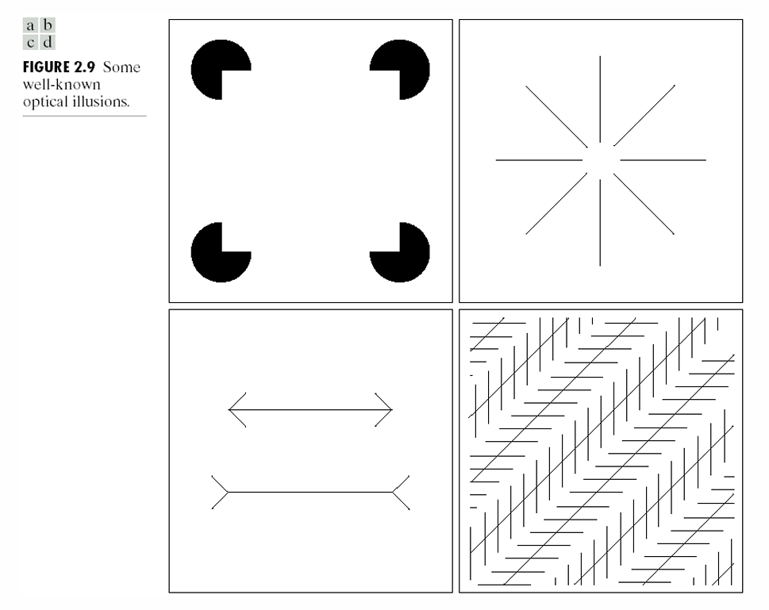
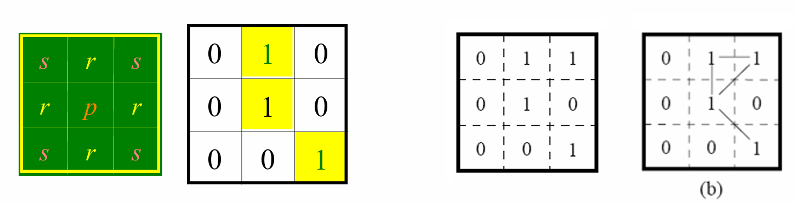
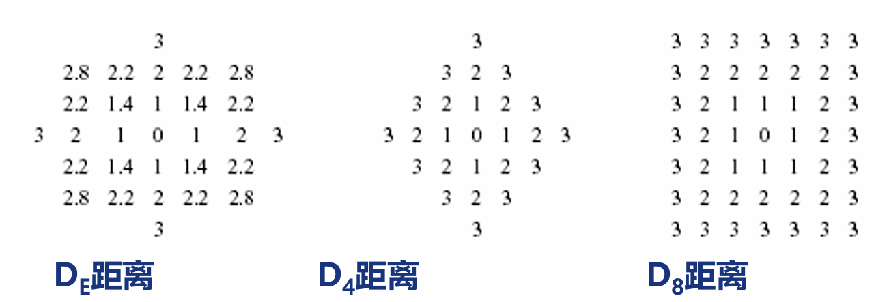

## 👁️ 2.1 视觉感知要素（视觉现象）

了解人眼的视觉特性，有助于我们在处理图像时知道哪些细节是可以被容忍或忽略的。

### 一、 亮度感知的自适应性与对比灵敏度

- **人眼对亮度感知的自适应性**：人眼的视觉系统能够适应极宽的光强度范围，但在给定的任何时刻，人眼的主观亮度感觉只能覆盖整个范围的一小部分（适应范围）。
    
- **对比灵敏度**：在均匀照度背景（$I$）上，眼睛刚好能分辨出的光斑照度差（$\Delta I$）与 $I$ 的比值 。
    
    - 在相当宽的强度范围内，这个比值是一个常数（约等于0.02），称为韦伯比（Weber比）。公式表示为：
        
        $$\boxed{\frac{\Delta I}{I}=0.02}$$
        
    - 当亮度极强或极弱时，该比值不再是常数 。
        

### 二、 典型视觉现象

- **马赫带（Mach带）**：在亮度变化（明暗边界）区域，人眼感觉会存在更暗和更亮条带的现象 。这种现象表明，主观感知到的强度并非实际强度的简单函数 。

*  **同时对比度（亮度对比）**：在相同亮度的前景刺激下，由于背景亮度不同，人眼所感受到的主观亮度不同的现象 。

*  **错觉**：人眼的视觉感知有时会产生几何错觉（如平行线看作非平行线等）。

> 💡 **核心注意点**： 同时对比度和马赫带效应都充分说明：**人眼感觉到的亮度并不是光强度的简单函数** 。对比灵敏度则提示我们，在数字图像处理与压缩时，人眼是可以容忍一定限度的图像失真的 。

---

## 🌈 2.2 光和电磁波谱与图像获取

- **电磁波谱**：包括伽马射线、X射线、紫外线、可见光、红外线、微波和无线电波等 。其中，可见光光谱只是整个电磁波谱中非常狭窄的一小部分 。
* **简单的成像模型**：成像过程通常包括：照明（能量）源 $\rightarrow$ 场景元素 $\rightarrow$ 成像系统 $\rightarrow$ （内部）图像平面 $\rightarrow$ 输出数字化图像 。
    

---

## 🧮 2.4 图像取样与量化（核心基础）

### 一、 空间采样与量化概念

要将连续图像转换为计算机可处理的数字图像，必须经过两步：

1. **空间采样**：将空间坐标离散化的过程 。
    
    - 设 $f(x,y)$ 为连续图像，$S(x,y)$ 为空间取样函数，采样后的图像 $F(x,y) = f(x,y)S(x,y)$ 。
        
    - **均匀采样**：等距采样 。
        
    - **非均匀采样**：在尖锐灰度过渡区（细节多）密集采样，在平滑过渡区稀疏采样 。缺点是需要先确定边缘，过程复杂 。
        
2. **量化**：将性质空间（灰度值）离散化的过程 。
    
    - 通过模/数转换，将模拟量变为数字量，得到具体的灰度级 。
        
    - 灰度量化级数一般取 $2^n$，如8 bits 表示 $2^8=256$ 级灰度；1 bit 则为黑白二值图像 。
        

### 二、 数字图像的数学表示

- **确定性表示**：
    
    - **矩阵表示**：直观对应二维图像，矩阵运算易处理 。
        
    - **向量表示**：按行堆叠成列向量 $\overline{f}=[f(0,0), \dots, f(M-1,N-1)]^T$ 。优点是能量表示极其简洁：$\boxed{E=f^Tf=\sum_i f_i^2}$ 。
        
- **随机性表示**：将图像看作二维随机场的一个样本 。
    
    - **统计特征**：包含均值 $\overline{f}=E(f(x,y))$、方差 $\sigma^2=E[(f(x,y)-\overline{f})^2]$、自相关函数等 。
        
    - **图像信息量（熵）**：$q$ 为灰度级数，$p_i$ 为出现概率，平均信息量公式为：
        
        $$\boxed{H=\sum_{i=1}^{q}p_i \log_2(1/p_i) \quad bits/pel}$$
        

### 三、 分辨率与插值

- **空间分辨率**：反映图像的空间细节。常用 dpi (dots per inch) 或图像总像素大小（如 $512 \times 512$）表示 。降低空间分辨率会使图像出现马赛克模糊 。
    
- **灰度分辨率**：反映灰度的量化级数（如 8 bits 为 256 级）。降低灰度分辨率会产生“假轮廓”现象。
    
- **图像插值**：主要用于图像的放大、缩小、旋转等几何操作中分配像素值 。包含：
    
    - 最近邻插值
        
    - 双线性插值
        
    - 双三次插值（效果通常最好）
        

---

## 🔗 2.4.5 像素间的基本关系

### 一、 邻域与连接（连通）

设坐标为 $p(x,y)$。

- **像素的邻域** ：
	* **4-邻域 $N_4(p)$**：上下左右四个相邻像素。
    
    - **对角邻域 $N_D(p)$**：四个对角相邻像素。
        
    - **8-邻域 $N_8(p)$**：$N_4(p) \cup N_D(p)$，周围一圈的八个像素。
        
- **连接（Adjacency）** ：需要满足两个条件：① 像素位置相邻；② 灰度值属于同一个相似集合 $V$（例如 $V=\{1\}$）。
    
    - **4-连接**：$r$ 在 $N_4(p)$ 中且灰度满足条件 。
        
    - **8-连接**：$r$ 在 $N_8(p)$ 中且灰度满足条件（会产生多路连接的歧义） 。
        
    - **m-连接（混合连接）**：是8-连接的改进，**为了消除多路连接歧义** 。条件为：① $r$ 在 $N_4(p)$ 中；或者 ② $r$ 在 $N_D(p)$ 中，且它们的共同 4-邻域交集 $N_4(p) \cap N_4(r)$ 中没有属于集合 $V$ 的像素 。
        

> 🚨 **易错点提醒（m-连接的判断）**：
> 
> 在判断两个对角像素是否是 m-连接时，一定要去检查与它们**同时构成三角形的另外两个候选 4-邻域像素**。如果那两个像素中有一个也属于集合 $V$，则这两点之间**不是** m-连接（这截断了斜向通路，强迫走直角通路，从而消除了歧义）。

### 二、 像素间的距离度量

一个满足要求的距离函数 $D(p,q)$ 必须满足非负性、对称性以及三角不等式（两边之和大于第三边）。常见的三种距离：

1. **欧氏（Euclidean）距离 $D_E$**（最短直线距离）：
    
    $$\boxed{D_E(p,q)=[(x-s)^2 + (y-t)^2]^{1/2}}$$
    
2. **城区（City-block）距离 $D_4$**（只能走上下左右的曼哈顿距离）：
    
    $$\boxed{D_4(p,q)=|x-s| + |y-t|}$$
    
3. **棋盘（Chessboard）距离 $D_8$**（允许走对角线的切比雪夫距离）：
    
    $$\boxed{D_8(p,q)=\max(|x-s|, |y-t|)}$$
    

---

## 🛠️ 2.5 数学工具概览与几何变换

数字图像处理依赖一系列数学工具，包括算术运算、逻辑操作、空间操作、概率方法等 。 其中**几何变换**负责改变图像中像素的空间关系，由**坐标的空间变换**和**灰度内插**两步组成 。

- **仿射变换（Affine Transform）** 坐标空间变换的通用矩阵形式 ：
    
    $$\boxed{\begin{bmatrix}x'\\ y'\\ 1\end{bmatrix} = A \begin{bmatrix}x\\ y\\ 1\end{bmatrix}}$$
    
    通过改变仿射矩阵 $A$ 中的元素，可以实现恒等、平移、缩放、旋转以及剪切等操作 。例如旋转变换矩阵的左上角核心部分为：$\begin{bmatrix}\cos\theta & -\sin\theta \\ \sin\theta & \cos\theta\end{bmatrix}$ 。
    

---

## 🎓 本章学习总结

> 第二章《数字图像基础》为整个学科铺垫了最底层的理论基石。我们首先从**人类视觉特性**出发，理解了亮度适应、对比灵敏度、马赫带等生理效应，明确了人眼的主观感受与物理亮度的差异。随后，学习了图像从模拟到数字的必经之路——**空间采样**与**灰度量化**，并掌握了利用矩阵和向量表示数字图像的数学形式。
> 
> 重点与难点集中在**像素间关系**和**距离度量**。我们需要深刻理解邻域的概念，特别是**m-连接**是如何巧妙地解决8-连接中的通路歧义问题的。最后，利用欧氏、城区、棋盘三种距离公式，以及仿射变换矩阵模型，我们获得了能够在计算机内存中精确操纵、位移、测量图像的强大数学工具。