## 🧭 本章定位

本章围绕图像恢复与重建展开。与图像增强不同，图像复原不是单纯让图像“看起来更好”，而是根据退化过程和噪声模型，尽量估计原始图像。

图像复原和图像增强的不同主要体现在三点：

- 🎯 **目的不同**：增强偏向主观视觉改善；复原偏向恢复退化前的图像。
- 🧮 **方法不同**：增强多依赖经验性处理；复原强调退化模型、噪声模型和数学估计。
- 📏 **标准不同**：增强常用视觉效果评价；复原常用均方误差、信噪比等准则。

⚠️ 注意点：本章的核心不是“滤波器越强越好”，而是在去噪、去模糊、保边缘、抑制噪声放大之间做权衡。

## 🧩 5.1 图像退化/复原过程模型

图像退化/复原过程可以看成：原图像经过退化函数，再叠加噪声，得到退化图像；然后通过复原滤波器估计原图像。

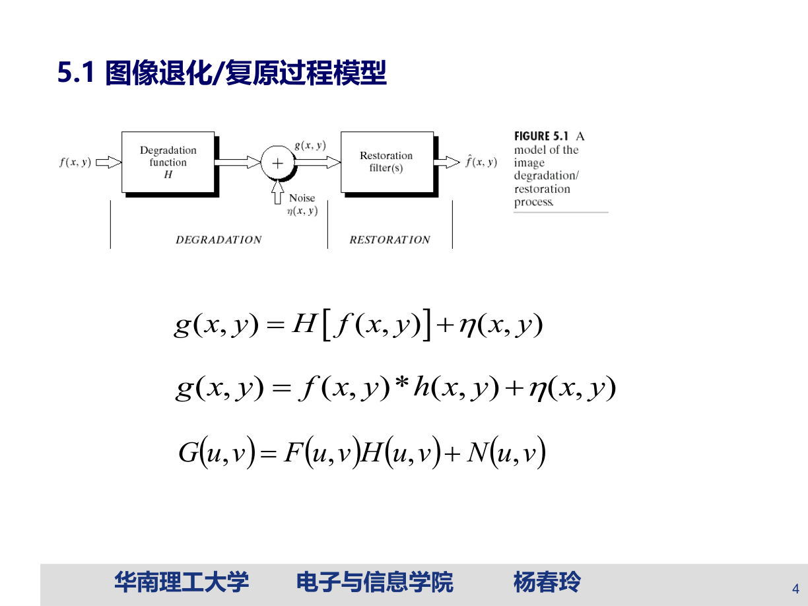

一般退化模型为：

$$
\boxed{g(x,y)=H[f(x,y)]+\eta(x,y)}
$$

当退化系统是线性移不变系统时，空域模型可写成卷积形式：

$$
\boxed{g(x,y)=f(x,y)*h(x,y)+\eta(x,y)}
$$

对应的频域模型为：

$$
\boxed{G(u,v)=F(u,v)H(u,v)+N(u,v)}
$$

其中：

- $f(x,y)$：原图像。
- $g(x,y)$：退化图像。
- $h(x,y)$：空域退化函数。
- $H(u,v)$：频域退化函数。
- $\eta(x,y)$、$N(u,v)$：噪声及其频域表示。

⚠️ 易错点：$H$ 在一般模型中表示退化算子；在线性移不变情况下，才可以进一步写成卷积核 $h(x,y)$ 或频域传递函数 $H(u,v)$。

## 🌫️ 5.2 噪声模型

### 5.2.1 噪声的特性

课件从两个角度描述噪声：

- 空间特性：噪声与空间位置无关，且与图像不相关。
- 频率特性：描述噪声的频谱内容。

白噪声的频谱是常数。

### 5.2.2 常见噪声的概率密度函数

课件列出的常见噪声包括：高斯噪声、瑞利噪声、伽马噪声、指数噪声、均匀噪声、脉冲噪声。

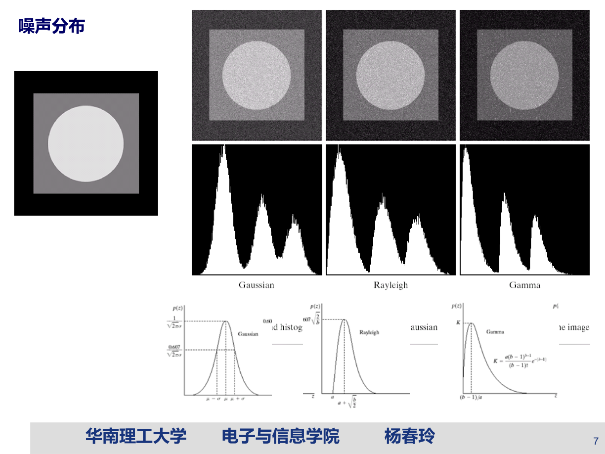

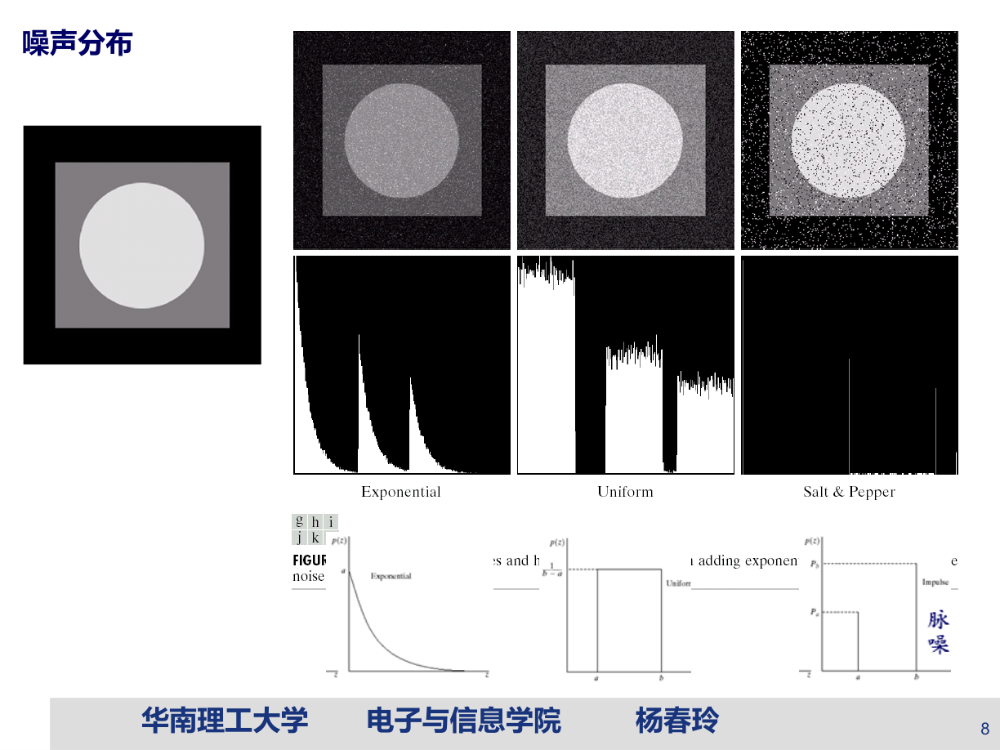

高斯噪声概率密度函数：

$$
\boxed{p(z)=\frac{1}{\sqrt{2\pi}\sigma}e^{-\frac{(z-\mu)^2}{2\sigma^2}}}
$$

均匀噪声概率密度函数：

$$
\boxed{
p(z)=
\begin{cases}
\dfrac{1}{b-a}, & a\le z\le b\\
0, & \text{其他}
\end{cases}}
$$

脉冲噪声概率密度函数：

$$
\boxed{
p(z)=
\begin{cases}
P_a, & z=a\\
P_b, & z=b\\
0, & \text{其他}
\end{cases}}
$$

其中脉冲噪声常表现为椒盐噪声。

### 5.2.3 周期噪声

周期噪声通常在频域表现为集中的亮点或成对谱线，适合用频率域滤波消除。课件后续使用带阻、带通、陷波滤波器处理这类噪声。

### 5.2.4 噪声参数的估计

噪声均值估计：

$$
\boxed{\mu=\sum_{z_i\in S} z_i p(z_i)}
$$

噪声方差估计：

$$
\boxed{\sigma^2=\sum_{z_i\in S}(z_i-\mu)^2p(z_i)}
$$

对于均匀噪声：

$$
\boxed{\mu=\frac{a+b}{2}}
$$

$$
\boxed{\sigma^2=\frac{(b-a)^2}{12}}
$$

⚠️ 注意点：估计噪声参数时，应尽量选取图像中灰度变化较平坦的小区域，否则图像自身结构会被误当成噪声。

## 🧹 5.3 空间域去噪复原

空间域去噪主要基于加性噪声模型：

$$
g(x,y)=f(x,y)+\eta(x,y)
$$

设 $S_{xy}$ 是以 $(x,y)$ 为中心的 $m\times n$ 邻域。

### 5.3.1 均值滤波器

算术均值滤波器：

$$
\boxed{\hat f(x,y)=\frac{1}{mn}\sum_{(s,t)\in S_{xy}}g(s,t)}
$$

特点：可以去除加性白高斯噪声，但会使图像模糊。

几何均值滤波器：

$$
\boxed{\hat f(x,y)=\left[\prod_{(s,t)\in S_{xy}}g(s,t)\right]^{\frac{1}{mn}}}
$$

特点：同样用于去除加性白高斯噪声，并且比算术均值滤波器更能保持边沿、保留细节。

谐波均值滤波器：

$$
\boxed{\hat f(x,y)=\frac{mn}{\sum_{(s,t)\in S_{xy}}\dfrac{1}{g(s,t)}}}
$$

特点：可去除白高斯噪声和盐噪声，但不能去除椒噪声。

逆谐波均值滤波器：

$$
\boxed{
\hat f(x,y)=
\frac{\sum_{(s,t)\in S_{xy}}g(s,t)^{Q+1}}
{\sum_{(s,t)\in S_{xy}}g(s,t)^Q}}
$$

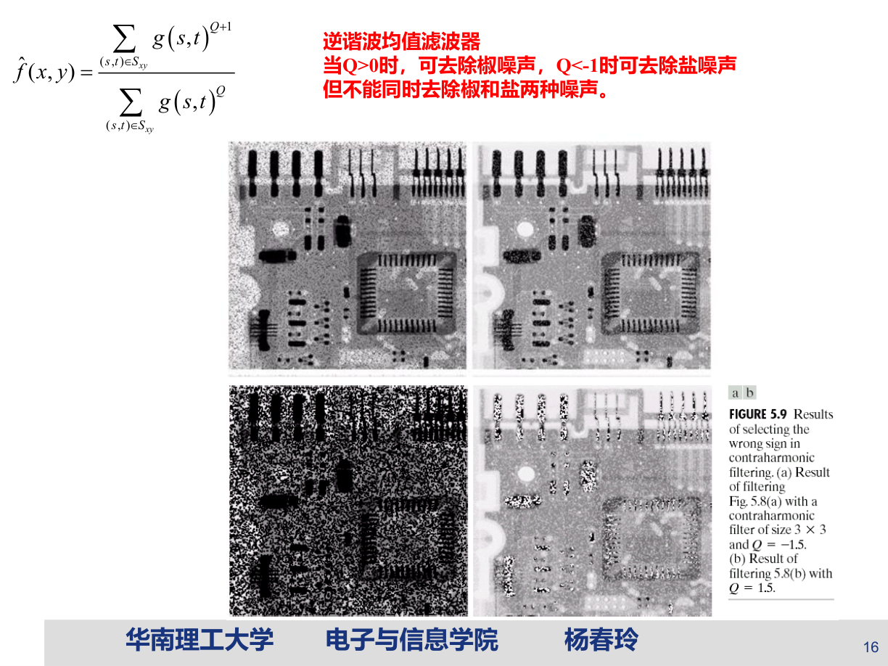

逆谐波均值滤波器的参数规律：

- $Q=0$：退化为算术均值滤波器。
- $Q=-1$：退化为谐波均值滤波器。
- $Q>0$：可去除椒噪声。
- $Q<-1$：可去除盐噪声。
- 不能同时去除椒噪声和盐噪声。

⚠️ 易错点：椒盐噪声同时存在时，不能简单依赖一个 $Q$ 值全部解决；课件明确指出逆谐波均值滤波器不能同时去除椒、盐两种噪声。

### 5.3.2 顺序统计滤波器

顺序统计滤波器根据邻域像素排序后的统计量进行处理。

最大值滤波器：

$$
\boxed{\hat f(x,y)=\max_{(s,t)\in S_{xy}}g(s,t)}
$$

最小值滤波器：

$$
\boxed{\hat f(x,y)=\min_{(s,t)\in S_{xy}}g(s,t)}
$$

中点滤波器：

$$
\boxed{
\hat f(x,y)=\frac{1}{2}
\left[
\max_{(s,t)\in S_{xy}}g(s,t)
+
\min_{(s,t)\in S_{xy}}g(s,t)
\right]}
$$

阿尔法修正均值滤波器：

$$
\boxed{
\hat f(x,y)=\frac{1}{mn-2d}
\sum_{(s,t)\in S_{xy}}g_r(s,t)}
$$

其中 $g_r(s,t)$ 表示排序后保留下来的像素值。课件指出它可以去除多种类型的加性噪声。

### 5.3.3 自适应滤波器

#### 一、自适应均值滤波

噪声图像模型：

$$
g(x,y)=f(x,y)+\eta(x,y)
$$

自适应均值滤波公式：

$$
\boxed{
\hat f(x,y)=g(x,y)-\frac{\sigma_\eta^2}{\sigma_L^2}
\left[g(x,y)-m_L\right]}
$$

其中：

- $\sigma_\eta^2$：噪声方差。
- $\sigma_L^2$：局部方差。
- $m_L$：局部均值。

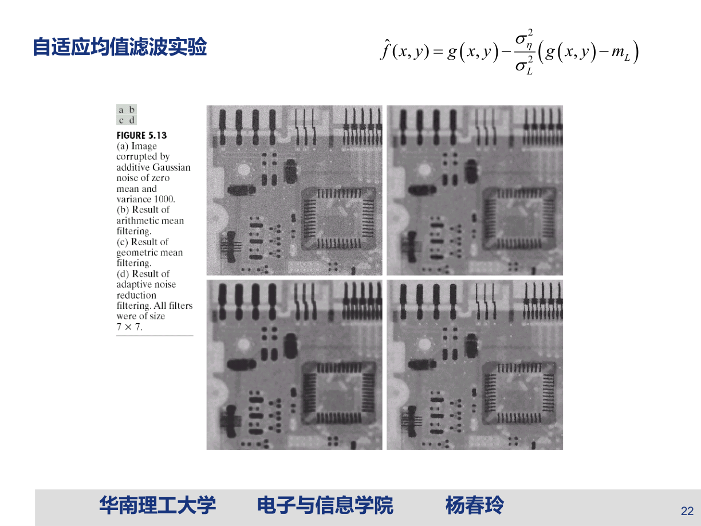

课件中的分析：

- 当 $\sigma_\eta^2=0$ 时，不处理。
- 当 $\sigma_\eta^2\ll\sigma_L^2$ 时，此处多为边缘，应尽量保留。
- 当 $\sigma_\eta^2\approx\sigma_L^2$ 时，接近均值滤波。
- 约定条件：$\sigma_\eta^2\le\sigma_L^2$。

#### 二、自适应中值滤波器

自适应中值滤波分为两层判断。

重要参数：

- $z_{\min}$：邻域 $S_{xy}$ 中最小值。
- $z_{\max}$：邻域 $S_{xy}$ 中最大值。
- $z_{\mathrm{med}}$：邻域 $S_{xy}$ 中中值。
- $z_{xy}$：$(x,y)$ 处的像素值。
- $S_{\max}$：允许的最大窗口尺寸。

A 层判断：

$$
z_{\min}<z_{\mathrm{med}}<z_{\max}
$$

若成立，则转到 B 层；否则，若窗口尺寸小于 $S_{\max}$，增大窗口尺寸并重复 A 层；若已经达到最大尺寸，则输出 $z_{\mathrm{med}}$。

B 层判断：

$$
z_{\min}<z_{xy}<z_{\max}
$$

若成立，输出 $z_{xy}$；否则输出 $z_{\mathrm{med}}$。

课件中的分析：

- 当 $z_{xy}$ 不是噪声点时，可以保留原像素。
- 当噪声密度较大时，也能滤除噪声。

⚠️ 易错点：普通中值滤波窗口固定；自适应中值滤波的关键是窗口可以逐步增大，但不能超过 $S_{\max}$。

## 📡 5.4 频率域滤波消除周期噪声

周期噪声在频域中通常较集中，因此常用带阻、带通、陷波滤波器处理。

### 5.4.1 带阻滤波器

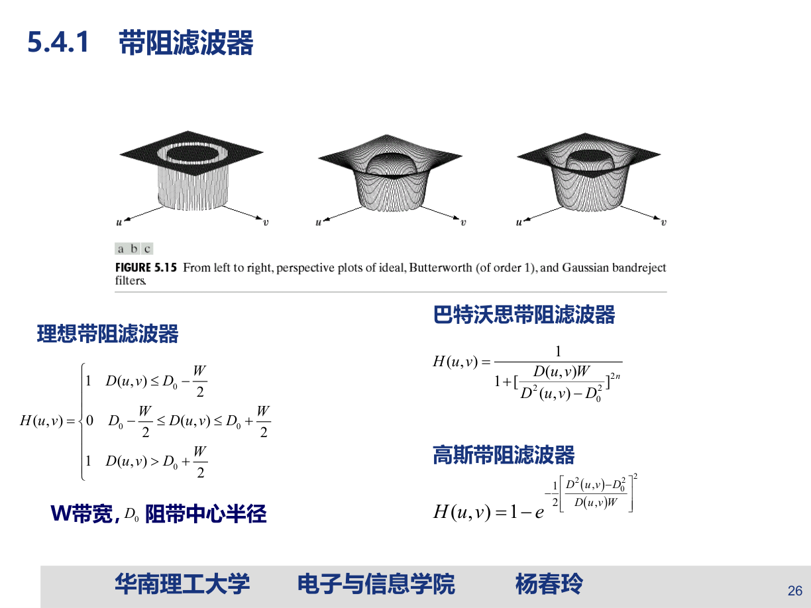

理想带阻滤波器：

$$
\boxed{
H(u,v)=
\begin{cases}
1, & D(u,v)\le D_0-\dfrac{W}{2}\\
0, & D_0-\dfrac{W}{2}\le D(u,v)\le D_0+\dfrac{W}{2}\\
1, & D(u,v)>D_0+\dfrac{W}{2}
\end{cases}}
$$

其中 $W$ 为带宽，$D_0$ 为阻带中心半径。

巴特沃思带阻滤波器：

$$
\boxed{
H(u,v)=
\frac{1}
{1+\left[
\dfrac{D(u,v)W}{D^2(u,v)-D_0^2}
\right]^{2n}}}
$$

高斯带阻滤波器：

$$
\boxed{
H(u,v)=
1-
e^{-\frac{1}{2}
\left[
\dfrac{D^2(u,v)-D_0^2}{D(u,v)W}
\right]^2}}
$$

### 5.4.2 带通滤波器

带通滤波器与带阻滤波器互补：

$$
\boxed{H_{bp}(u,v)=1-H_{br}(u,v)}
$$

### 5.4.3 陷波滤波器

陷波滤波器用于抑制频域中特定位置的噪声分量。

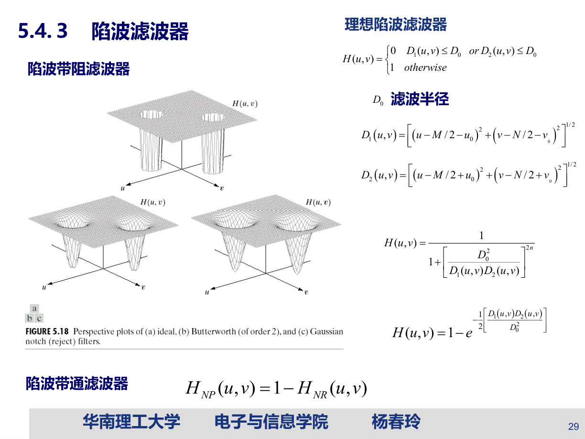

理想陷波带阻滤波器：

$$
\boxed{
H(u,v)=
\begin{cases}
0, & D_1(u,v)\le D_0 \text{ 或 } D_2(u,v)\le D_0\\
1, & \text{其他}
\end{cases}}
$$

滤波半径为 $D_0$，两个对称距离为：

$$
\boxed{
D_1(u,v)=
\left[
\left(u-\frac{M}{2}-u_0\right)^2+
\left(v-\frac{N}{2}-v_0\right)^2
\right]^{1/2}}
$$

$$
\boxed{
D_2(u,v)=
\left[
\left(u-\frac{M}{2}+u_0\right)^2+
\left(v-\frac{N}{2}+v_0\right)^2
\right]^{1/2}}
$$

巴特沃思陷波带阻滤波器：

$$
\boxed{
H(u,v)=
\frac{1}
{1+\left[
\dfrac{D_0^2}{D_1(u,v)D_2(u,v)}
\right]^{2n}}}
$$

高斯陷波带阻滤波器：

$$
\boxed{
H(u,v)=
1-e^{-\frac{1}{2}
\left[
\dfrac{D_1(u,v)D_2(u,v)}{D_0^2}
\right]}}
$$

陷波带通滤波器：

$$
\boxed{H_{NP}(u,v)=1-H_{NR}(u,v)}
$$

课件示例展示了遥感图像中的水平扫描线、对应频谱、陷波滤波器和复原结果。

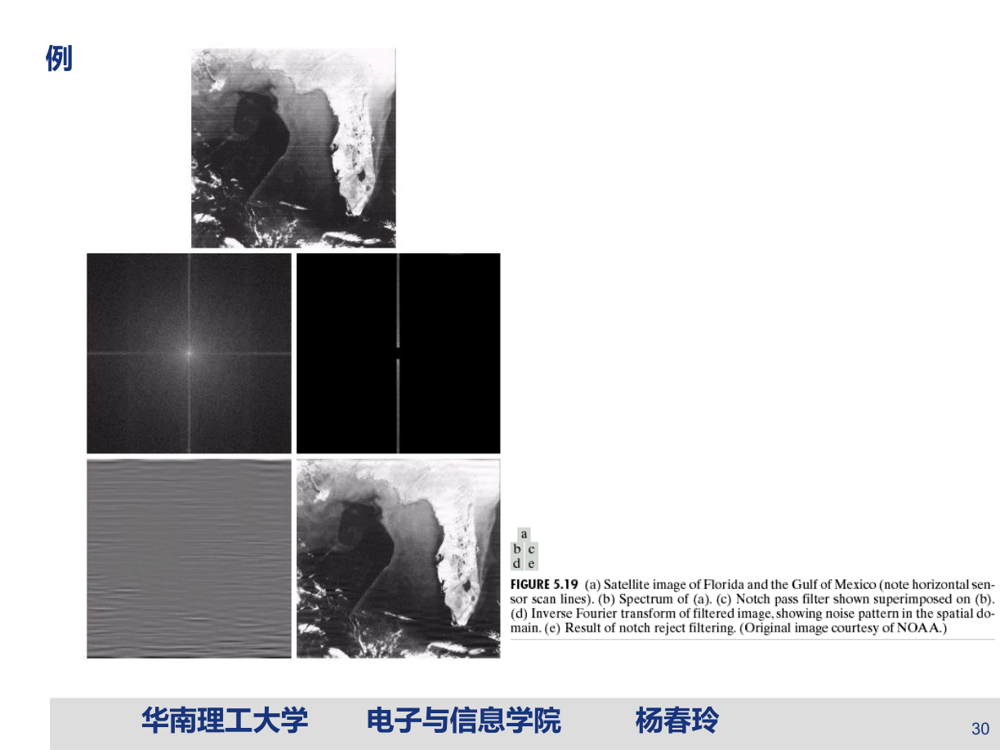

### 5.4.4 最优陷波滤波

最优陷波滤波的思想是：先估计噪声图像，再从退化图像中减去带权噪声，并令邻域方差最小来求权值。

频域估计噪声：

$$
\boxed{N(u,v)=H_{NP}(u,v)G(u,v)}
$$

空域估计噪声：

$$
\boxed{\eta(x,y)=\mathcal{F}^{-1}\{H_{NP}(u,v)G(u,v)\}}
$$

复原图像：

$$
\boxed{\hat f(x,y)=g(x,y)-w(x,y)\eta(x,y)}
$$

权值：

$$
\boxed{
w(x,y)=
\frac{\overline{g(x,y)\eta(x,y)}-\overline{g(x,y)}\,\overline{\eta(x,y)}}
{\overline{\eta^2(x,y)}-\overline{\eta}^2(x,y)}}
$$

⚠️ 注意点：陷波滤波要找准频域噪声位置；位置不准会把图像细节也一起抑制。

## 🔁 5.5 线性移不变退化模型

线性移不变退化模型是本章后半部分频域复原方法的基础。

空域：

$$
\boxed{g(x,y)=f(x,y)*h(x,y)+\eta(x,y)}
$$

频域：

$$
\boxed{G(u,v)=F(u,v)H(u,v)+N(u,v)}
$$

这个模型把退化拆成两部分：

- 模糊退化：由 $H(u,v)$ 描述。
- 噪声干扰：由 $N(u,v)$ 描述。

## 🔍 5.6 降质函数的估计

课件给出三种估计降质函数的方法：

- 观察法。
- 实验法。
- 模型估计。

### 观察法

从图像中选取子图像，估计局部降质函数：

$$
\boxed{\hat H(u,v)=\frac{G_s(u,v)}{F_s(u,v)}}
$$

### 实验法

实验法通过冲激响应估计退化函数：

$$
\boxed{H(u,v)=\frac{G(u,v)}{A}}
$$

### 模型估计

空气湍流数学模型：

$$
\boxed{H(u,v)=e^{-k(u^2+v^2)^{5/6}}}
$$

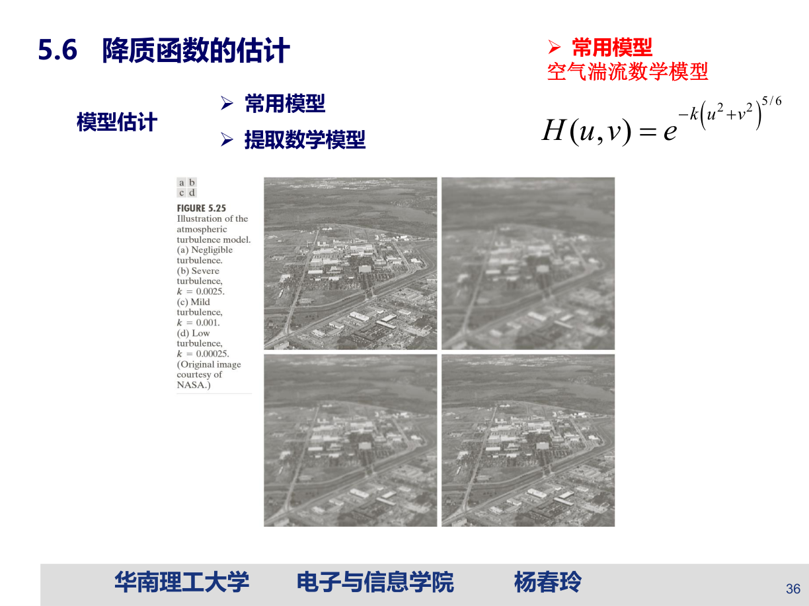

运动模糊的退化模型来自景物与摄像设备的相对运动。课件列出的退化原因包括：

- 相对运动速度快，例如比赛图片。
- 曝光时间长，例如遥感图像、照度低。
- 曝光期间抖动。

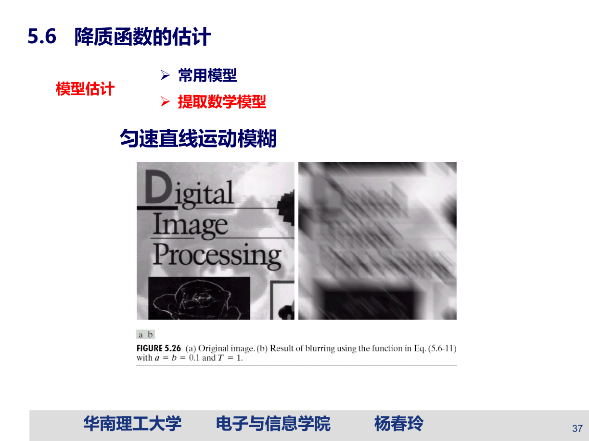

设曝光时间为 $T$，图像存在平移运动，$x_0(t)$、$y_0(t)$ 分别为 $x,y$ 方向的瞬时位移，则输出图像为：

$$
\boxed{
g(x,y)=\int_0^T f[x-x_0(t),y-y_0(t)]\,dt}
$$

两边取傅里叶变换：

$$
G(u,v)=F(u,v)\int_0^T e^{-j2\pi[ux_0(t)+vy_0(t)]}\,dt
$$

因此降质系统的传递函数为：

$$
\boxed{
H(u,v)=\int_0^T e^{-j2\pi[ux_0(t)+vy_0(t)]}\,dt}
$$

仅考虑沿 $x$ 方向匀速直线运动模糊：

$$
y_0(t)=0,\qquad x_0(t)=\frac{at}{T}
$$

则：

$$
\boxed{
H(u)=\frac{T}{\pi ua}\sin(\pi ua)e^{-j\pi ua}}
$$

一般特点：

- 具有低通性质。
- 存在零点，当 $u=n/a$ 且 $n$ 为整数时，$H(u,v)=0$。

考虑沿 $x,y$ 方向的匀速直线运动模糊：

$$
y_0(t)=\frac{bt}{T},\qquad x_0(t)=\frac{at}{T}
$$

则：

$$
\boxed{
H(u,v)=
\frac{T}{\pi(ua+vb)}
\sin[\pi(ua+vb)]e^{-j\pi(ua+vb)}}
$$

⚠️ 易错点：运动模糊的 $H(u,v)$ 有零点，因此后面的逆滤波会遇到除零或近似除零导致的严重噪声放大问题。

## 🪞 5.7 逆滤波

逆滤波使用恢复滤波器 $P(u,v)$ 来抵消退化函数。

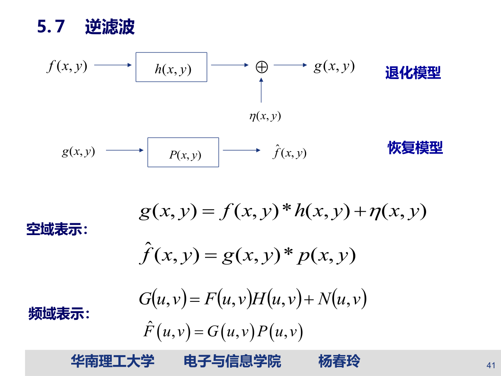

逆滤波器：

$$
\boxed{P(u,v)=\frac{1}{H(u,v)}}
$$

复原结果：

$$
\boxed{\hat F(u,v)=\frac{G(u,v)}{H(u,v)}}
$$

由退化模型：

$$
G(u,v)=F(u,v)H(u,v)+N(u,v)
$$

可得：

$$
\boxed{
\hat F(u,v)=F(u,v)+\frac{N(u,v)}{H(u,v)}}
$$

因此逆滤波的问题很明显：

- 当 $H(u,v)$ 存在零点时，$\frac{1}{H(u,v)}$ 无意义。
- 在零点附近，$\frac{N(u,v)}{H(u,v)}$ 很大，输出噪声很大。
- 由于 $H(u,v)$ 通常具有低通性质，高频端 $H(u,v)$ 幅度下降，而白噪声幅度不变，所以高频噪声会被放大。

课件给出的处理方法之一是限制复原范围：

$$
\boxed{
P(u,v)=
\begin{cases}
\dfrac{1}{H(u,v)}, & u^2+v^2\le \omega_0^2\\
1\text{ 或 }0, & u^2+v^2>\omega_0^2
\end{cases}}
$$

另一种处理方法是对 $H(u,v)$ 的小值设限：

$$
\boxed{
P(u,v)=
\begin{cases}
\dfrac{1}{H(u,v)}, & H(u,v)>d\\
\dfrac{1}{k}, & 0<H(u,v)\le d
\end{cases}}
$$

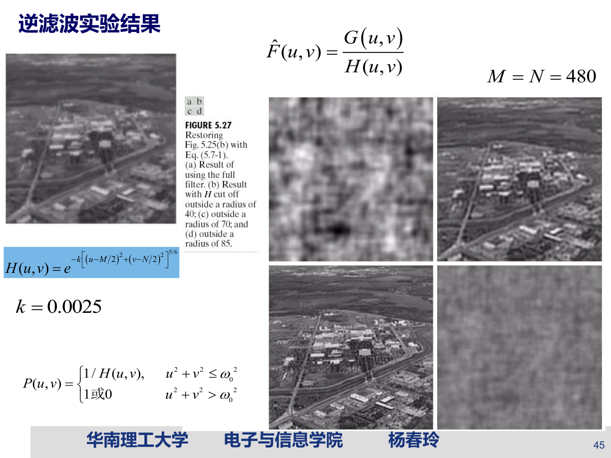

⚠️ 注意点：逆滤波能很好地去模糊，但同时会放大噪声。课件实验图中，完整逆滤波与不同半径限制的结果差异非常明显。

## 🎛️ 5.8 最小均方误差滤波器

这一部分对应维纳滤波。它以均方误差最小为准则：

$$
\boxed{mse=E\{(\hat f-f)^2\}=\min}
$$

质量评价准则包括均方误差：

$$
\boxed{
MSE=
\frac{1}{MN}
\sum_{x=0}^{M-1}\sum_{y=0}^{N-1}
[\hat f(x,y)-f(x,y)]^2}
$$

频域信噪比：

$$
\boxed{
SNR=
\frac{\sum_{u=0}^{M-1}\sum_{v=0}^{N-1}|F(u,v)|^2}
{\sum_{u=0}^{M-1}\sum_{v=0}^{N-1}|N(u,v)|^2}}
$$

空域信噪比：

$$
\boxed{
SNR=
\frac{\sum_{x=0}^{M-1}\sum_{y=0}^{N-1}\hat f^2(x,y)}
{\sum_{x=0}^{M-1}\sum_{y=0}^{N-1}[\hat f(x,y)-f(x,y)]^2}}
$$

维纳滤波器：

$$
\boxed{
P(u,v)=
\frac{H^*(u,v)}
{|H(u,v)|^2+\dfrac{S_\eta(u,v)}{S_f(u,v)}}}
$$

等价写法：

$$
\boxed{
P(u,v)=
\frac{1}{H(u,v)}
\frac{|H(u,v)|^2}
{|H(u,v)|^2+\dfrac{S_\eta(u,v)}{S_f(u,v)}}}
$$

其中：

- $H^*(u,v)$：$H(u,v)$ 的共轭。
- $S_f(u,v)=|F(u,v)|^2$：原图像功率谱。
- $S_\eta(u,v)=|N(u,v)|^2$：噪声功率谱。
- $\dfrac{S_\eta(u,v)}{S_f(u,v)}$：信噪比的倒数。

讨论：

- 当 $S_\eta\to0$ 时，维纳滤波退化为逆滤波。
- 有噪声时，维纳滤波可以抑制噪声。
- 维纳滤波往往会引起复原图像边缘模糊。
- 相对逆滤波，维纳滤波需要知道更多先验知识。

当 $S_f$、$S_\eta$ 未知时，课件给出近似公式：

$$
\boxed{
P(u,v)=
\frac{1}{H(u,v)}
\frac{|H(u,v)|^2}
{|H(u,v)|^2+K}}
$$

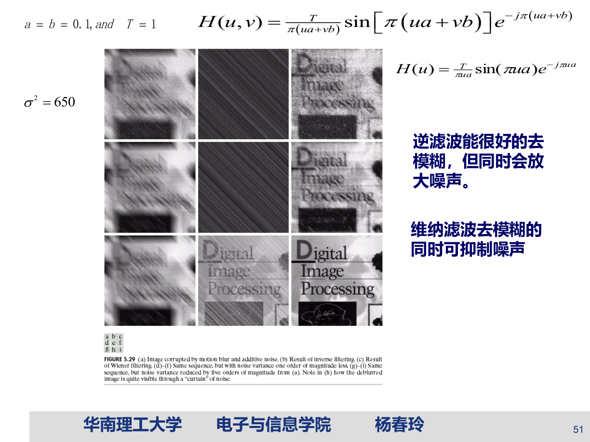

⚠️ 易错点：逆滤波主要抵消模糊，但会放大噪声；维纳滤波同时考虑噪声，所以更稳，但边缘可能更模糊。

## 🧮 5.9 约束最小二乘滤波

退化模型的矩阵形式：

$$
\boxed{g=Hf+\eta}
$$

由于 $H$ 对噪声非常敏感，在重构过程中希望限制噪声，因此采用约束形式：

$$
\|g-H\hat f\|^2=\|\eta\|^2
$$

同时希望 $P\hat f$ 较小，其中 $P$ 为线性算子：

$$
\|P\hat f\|^2
$$

采用拉格朗日乘子法，使准则函数取极值：

$$
\boxed{
J(\hat f)=
\|P\hat f\|^2+
\lambda(\|g-H\hat f\|^2-\|\eta\|^2)}
$$

令：

$$
\frac{\partial J(\hat f)}{\partial \hat f}=0
$$

可得约束最小二乘恢复表示：

$$
\boxed{
\hat f=
(H^T H+\gamma P^T P)^{-1}H^Tg}
$$

其中：

$$
\gamma=\frac{1}{\lambda}
$$

频域求解形式：

$$
\boxed{
\hat F(u,v)=
\frac{H^*(u,v)}
{|H(u,v)|^2+\gamma|P(u,v)|^2}
G(u,v)}
$$

空间域迭代求解：

$$
\boxed{
\hat f_{k+1}=
\hat f_k+
\beta\left[
H^Tg-(H^TH+\gamma P^TP)\hat f_k
\right]}
$$

参数 $\gamma$ 的迭代求解：

1. 给出参数 $\gamma$ 的初始值。
2. 计算 $\hat F(u,v)$。
3. 若满足

$$
\|\eta\|^2-a\le \|r\|^2\le \|\eta\|^2+a
$$

则结束并输出；否则调整参数并返回第 2 步。

参数调整规则：

- 若 $\|r\|^2<\|\eta\|^2-a$，增大 $\gamma$。
- 若 $\|r\|^2>\|\eta\|^2+a$，减小 $\gamma$。

与维纳滤波的比较：

- 模糊且有噪声时，约束最小二乘滤波效果较好。
- 仅有模糊、没有噪声时，两者基本一致。
- 维纳滤波是统计最优。
- 约束最小二乘滤波是每个图像最优。

## 🧬 5.10 几何均值滤波

维纳滤波可以推广为更一般的表达形式：

$$
\boxed{
\hat F(u,v)=
\left[
\frac{H^*(u,v)}{|H(u,v)|^2}
\right]^\alpha
\left[
\frac{H^*(u,v)}
{|H(u,v)|^2+\beta\dfrac{S_{nn}(u,v)}{S_{ff}(u,v)}}
\right]^{1-\alpha}
G(u,v)}
$$

参数讨论：

- 当 $\alpha=0$ 时，得到带参数 $\beta$ 的维纳滤波形式。
- 当 $\alpha=1$ 时，得到逆滤波形式。
- 当 $\alpha=\frac{1}{2}$ 时，是几何均值滤波。

⚠️ 注意点：几何均值滤波把逆滤波和维纳滤波统一到一个表达式中，关键是理解 $\alpha$ 对两类滤波的权衡作用。

## 🏥 5.11 投影重建

投影重建部分包括理论基础、计算机断层成像原理、投影与拉东变换、傅里叶切片定理和平行射线滤波反投影重构。

### 5.11.1 理论基础简介

重建问题的目标是：由多个方向上的投影数据恢复二维图像。

### 5.11.2 计算机断层成像原理

计算机断层成像通过不同角度的投影数据来恢复物体内部图像。本章重点放在平行射线投影模型及其数学重建。

### 5.11.3 投影和拉东变换

直线的一般形式：

$$
\boxed{x\cos\theta+y\sin\theta=\rho}
$$

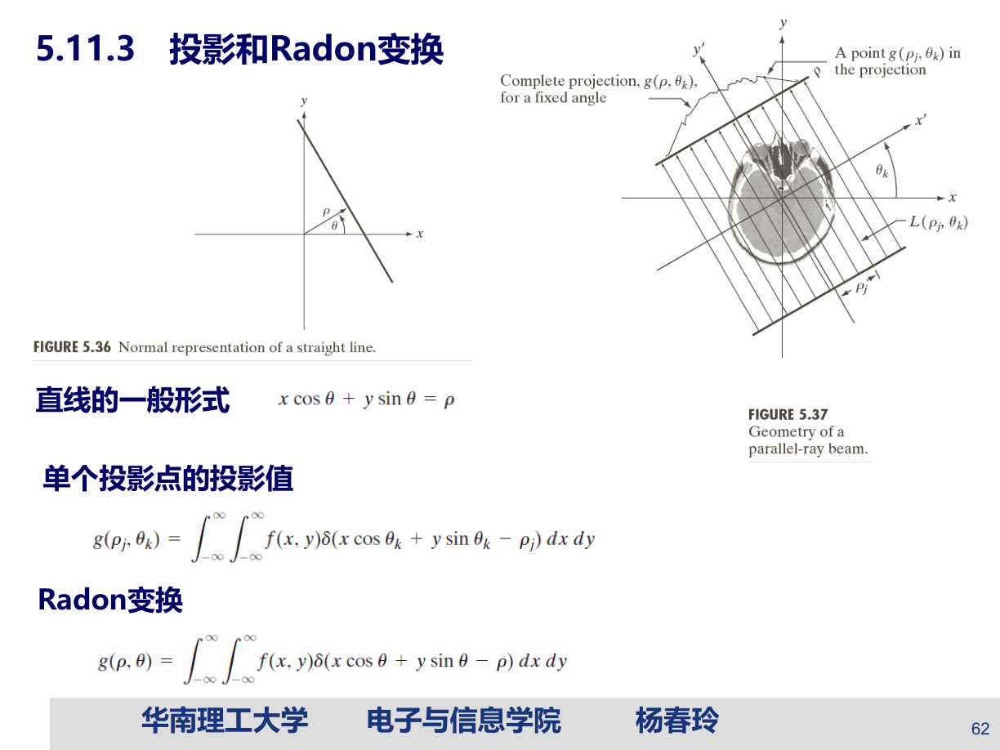

单个投影点的投影值：

$$
\boxed{
g(\rho_j,\theta_k)=
\int_{-\infty}^{\infty}
\int_{-\infty}^{\infty}
f(x,y)
\delta(x\cos\theta_k+y\sin\theta_k-\rho_j)
\,dx\,dy}
$$

拉东变换：

$$
\boxed{
g(\rho,\theta)=
\int_{-\infty}^{\infty}
\int_{-\infty}^{\infty}
f(x,y)
\delta(x\cos\theta+y\sin\theta-\rho)
\,dx\,dy}
$$

### 5.11.4 傅里叶切片定理

投影 $g(\rho,\theta)$ 的一维傅里叶变换为：

$$
G(\omega,\theta)
=
\int_{-\infty}^{\infty}
g(\rho,\theta)e^{-j2\pi\omega\rho}\,d\rho
$$

由课件推导可得：

$$
\boxed{
G(\omega,\theta)
=
F(\omega\cos\theta,\omega\sin\theta)}
$$

含义：某一角度投影的一维傅里叶变换，等于原图像二维傅里叶变换中同角度的一条切片。

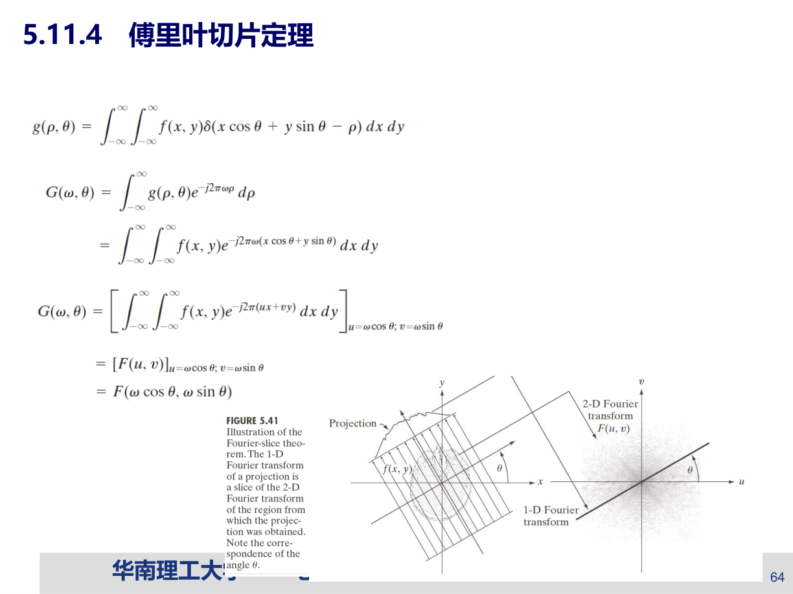

### 5.11.5 平行射线滤波反投影重构

由傅里叶切片定理可得：

$$
\boxed{
f(x,y)=
\int_0^\pi
\left[
\int_{-\infty}^{\infty}
|\omega|G(\omega,\theta)e^{j2\pi\omega\rho}\,d\omega
\right]_{\rho=x\cos\theta+y\sin\theta}
d\theta}
$$

课件进一步写成卷积形式：

$$
\boxed{
f(x,y)=
\int_0^\pi
\left[
s(\rho)*g(\rho,\theta)
\right]_{\rho=x\cos\theta+y\sin\theta}
d\theta}
$$

其中 $|\omega|$ 对应斜坡滤波器。课件示例展示了斜坡滤波器与汉明窗斜坡滤波器的重建效果：加窗后振铃减少，但图像会更平滑。

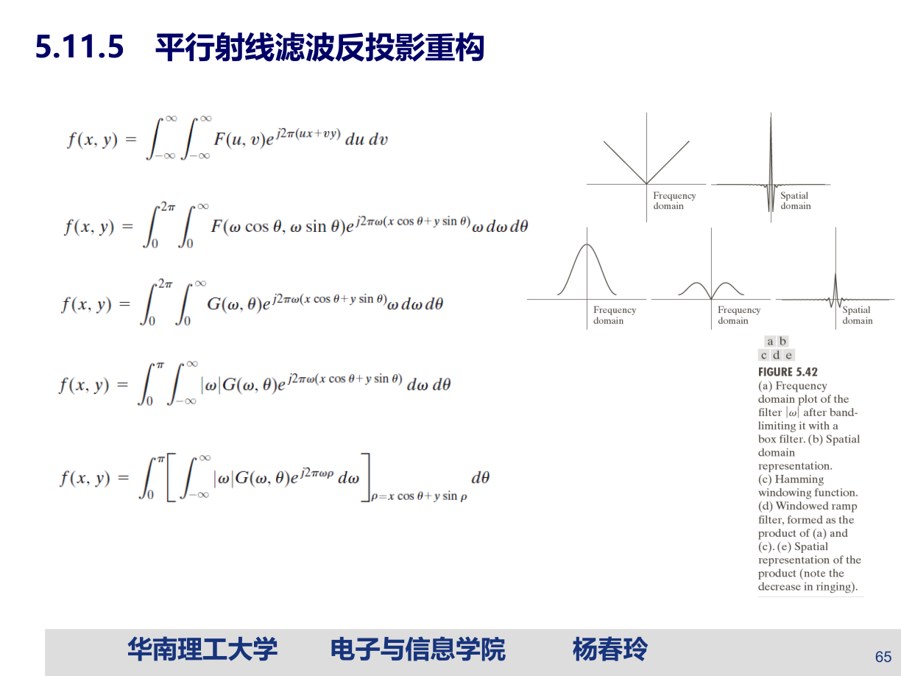

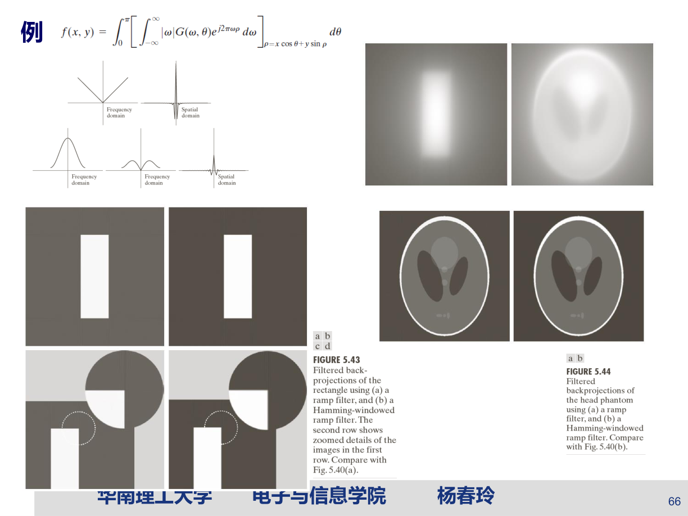

⚠️ 易错点：普通反投影会产生模糊；滤波反投影需要先对投影做滤波，再反投影。

## 📝 课件示例题目

### 示例 1：噪声参数估计

题目：已知某平坦小区域内噪声灰度分布为 $p(z_i)$，求噪声均值和方差；若噪声为均匀噪声且灰度范围为 $[a,b]$，写出均值和方差。

解答：

$$
\mu=\sum_{z_i\in S}z_i p(z_i)
$$

$$
\sigma^2=\sum_{z_i\in S}(z_i-\mu)^2p(z_i)
$$

均匀噪声：

$$
\mu=\frac{a+b}{2},\qquad
\sigma^2=\frac{(b-a)^2}{12}
$$

### 示例 2：逆谐波均值滤波参数选择

题目：若图像受到椒噪声污染，逆谐波均值滤波器参数 $Q$ 应如何选择？若图像受到盐噪声污染，又应如何选择？

解答：

- 椒噪声：取 $Q>0$。
- 盐噪声：取 $Q<-1$。
- 若椒噪声和盐噪声同时存在，逆谐波均值滤波器不能同时去除两者。

### 示例 3：周期噪声的频率域处理

题目：课件中的遥感图像存在水平扫描线，频谱中出现对应噪声分量，应选择哪类滤波器？

解答：应在频域定位周期噪声分量，并使用陷波带阻滤波器抑制这些位置的噪声，再变换回空域得到复原结果。

### 示例 4：逆滤波与维纳滤波比较

题目：运动模糊图像中同时存在加性噪声时，逆滤波和维纳滤波的效果有何差异？

解答：

- 逆滤波能较好去模糊，但会放大噪声。
- 维纳滤波在去模糊的同时可以抑制噪声，但可能引起边缘模糊。

### 示例 5：滤波反投影重构

题目：为什么投影重建中不能只做普通反投影，而要进行滤波反投影？

解答：普通反投影会产生模糊。根据傅里叶切片定理，滤波反投影需要先在频域引入 $|\omega|$ 斜坡滤波，再将不同角度的投影反投影回图像空间。

## ✅ 本章学习总结

本章的主线可以概括为：先建立退化模型，再根据噪声和退化函数选择复原方法。

- 🧩 退化模型是全章基础：$g=H[f]+\eta$，在线性移不变时变成卷积和频域乘积。
- 🌫️ 噪声模型决定空间域滤波器选择：均值类滤波适合加性噪声，顺序统计滤波适合脉冲类噪声。
- 🧹 自适应滤波通过局部统计量调整处理强度，比固定窗口滤波更灵活。
- 📡 周期噪声适合在频率域处理，典型方法是带阻、带通和陷波滤波。
- 🔍 降质函数估计有观察法、实验法和模型估计；运动模糊模型和空气湍流模型是重点。
- 🪞 逆滤波思路直接，但对零点和噪声非常敏感。
- 🎛️ 维纳滤波以均方误差最小为准则，在去模糊和抑制噪声之间折中。
- 🧮 约束最小二乘滤波通过约束噪声能量来恢复图像，适合模糊且有噪声的情况。
- 🧬 几何均值滤波统一了逆滤波和维纳滤波的形式。
- 🏥 投影重建的核心是拉东变换、傅里叶切片定理和滤波反投影。

🎯 复习时建议按“模型 → 噪声 → 空间域复原 → 频率域复原 → 投影重建”的顺序串联公式，尤其要理解每种方法适合什么退化情况，以及它的主要副作用。
