## 7.1 概述 🌟

在数字电子技术中，矩形脉冲是极其重要的信号形式。了解脉冲的各项参数是分析电路的基础。

### 1. 脉冲波形的主要参数
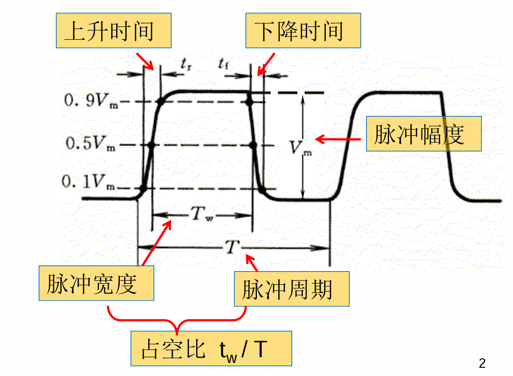
对于一个实际的矩形脉冲，其边沿并非绝对垂直，而是有一定的倾斜。

- **上升时间** ($t_r$)：脉冲幅度从 $0.1V_m$ 上升到 $0.9V_m$ 所经历的时间。
    
- **下降时间** ($t_f$)：脉冲幅度从 $0.9V_m$ 下降到 $0.1V_m$ 所经历的时间。
    
- **脉冲宽度** ($t_w$)：脉冲幅度在 $0.5V_m$ 处的持续时间。
    
- **脉冲幅度** ($V_m$)：脉冲电压的最大变化量。
    
- **脉冲周期** ($T$)：周期性脉冲序列中，相邻两个脉冲起点之间的时间间隔。
    
- 占空比：脉冲宽度与脉冲周期的比值，公式为 $t_w / T$。
    

### 2. 获得矩形脉冲的两个途径

1. 利用**多谐振荡电路**直接产生。
    
2. 将其它形状的周期波形**变换（整形）**成矩形脉冲（本节重点）。常用的 波形变换电路 包括：施密特触发电路、单稳态触发电路。
    

---

## 7.2 施密特触发电路 ⚡

施密特触发电路是一类常用的脉冲整形电路，常用于将边沿变化缓慢的波形整形为边沿陡峭的矩形波，或者清除叠加在脉冲电平上的噪声。

### 1. 主要特点

- **双阈值特性**：输入信号在上升和下降过程中，电路状态转换的输入电平不同。存在 正向阈值电压 ($V_{T+}$) 和 负向阈值电压 ($V_{T-}$)。
    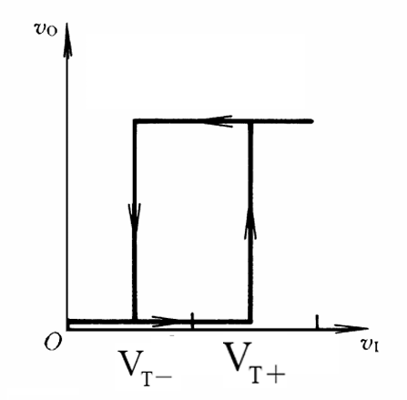
- **正反馈过程**：电路状态转换时具有正反馈过程，使得输出波形边沿变得很陡。
    
- 有两个稳定状态。
    

### 2. 用门电路组成的施密特触发电路
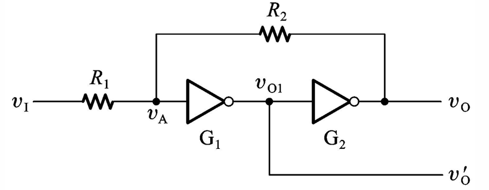
该电路通常由两级 CMOS 反相器（$G_1$、$G_2$）串接，并通过分压电阻（$R_1$、$R_2$）引入正反馈构成。

- **前提条件**：必须满足 $R_1 < R_2$。
    
- **CMOS 反相器阈值**：$V_{TH} = V_{DD} / 2$。
    

**关键公式：**

对于同相输出的门电路施密特触发器，其阈值电压计算如下：

$$\boxed{V_{T+} = (1 + \frac{R_1}{R_2}) V_{TH}}$$

$$\boxed{V_{T-} = (1 - \frac{R_1}{R_2}) V_{TH}}$$

- 回差电压 ($\Delta V_T$)：正向阈值与负向阈值之差。
    

$$\boxed{\Delta V_T = V_{T+} - V_{T-} = 2\frac{R_1}{R_2} V_{TH}}$$

> 💡 **易错点提醒**：
> 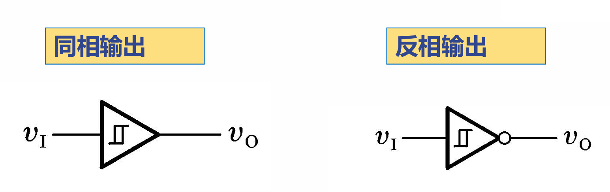
> 施密特触发电路有**同相输出**和**反相输出**两种形式。同相输出时，输入超过 $V_{T+}$ 输出变高电平，低于 $V_{T-}$ 输出变低电平；而反相输出则刚好相反，在做题和画波形图时千万要注意区分输出端的极性！

### 3. 示例题目 ✏️

**题目**：由 CMOS 反相器构成的施密特触发电路，设 $V_{TH} = 3V$，$V_{DD} = 6V$，电阻 $R_1 = 50k\Omega$，$R_2 = 100k\Omega$。输入电压为峰-峰值 6V 的三角波。试求正负阈值电压和回差电压，并定性分析输出波形。
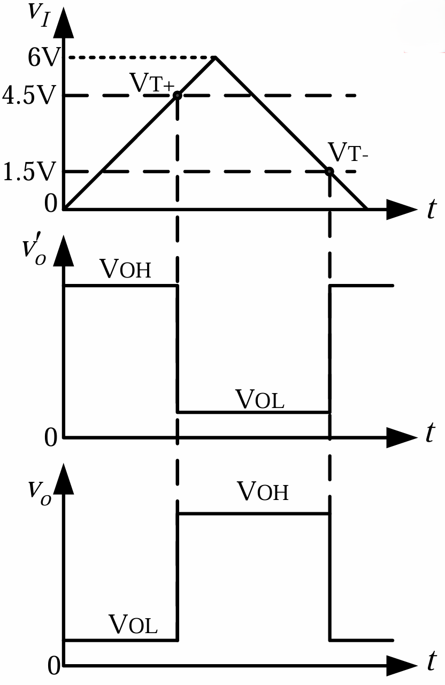
**解答**：

1. 计算正向阈值电压 $V_{T+}$：
    
    $V_{T+} = (1 + \frac{50}{100}) \times 3 = 1.5 \times 3 = 4.5V$
    
2. 计算负向阈值电压 $V_{T-}$：
    
    $V_{T-} = (1 - \frac{50}{100}) \times 3 = 0.5 \times 3 = 1.5V$
    
3. 计算回差电压 $\Delta V_T$：
    
    $\Delta V_T = 4.5 - 1.5 = 3V$
    
4. **波形分析**：当输入三角波从 $0V$ 升高到 $4.5V$ 之前，同相输出端保持低电平（$\approx 0V$）；一旦超过 $4.5V$，输出迅速跳变为高电平（$6V$）。当输入波形从峰值下降，直到低于 $1.5V$ 时，输出才会再次跳变回低电平。
    

### 4. 施密特触发电路的应用

1. **用于波形变换**：将正弦波、三角波等边沿缓慢的信号变换为边沿陡峭的矩形脉冲。
    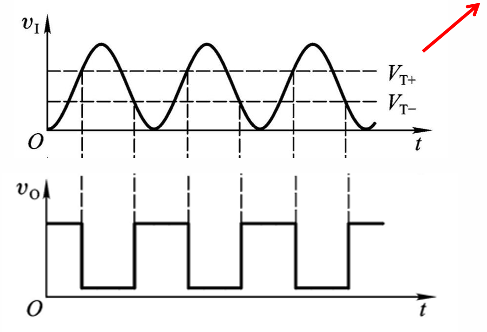
2. **用于脉冲整形**：消除叠加在脉冲高、低电平上的干扰信号和噪声。
    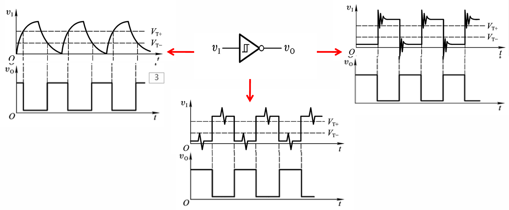
3. **用于鉴幅**：从一系列幅度不同的脉冲信号中，鉴别并提取出幅度大于 $V_{T+}$ 的信号。
    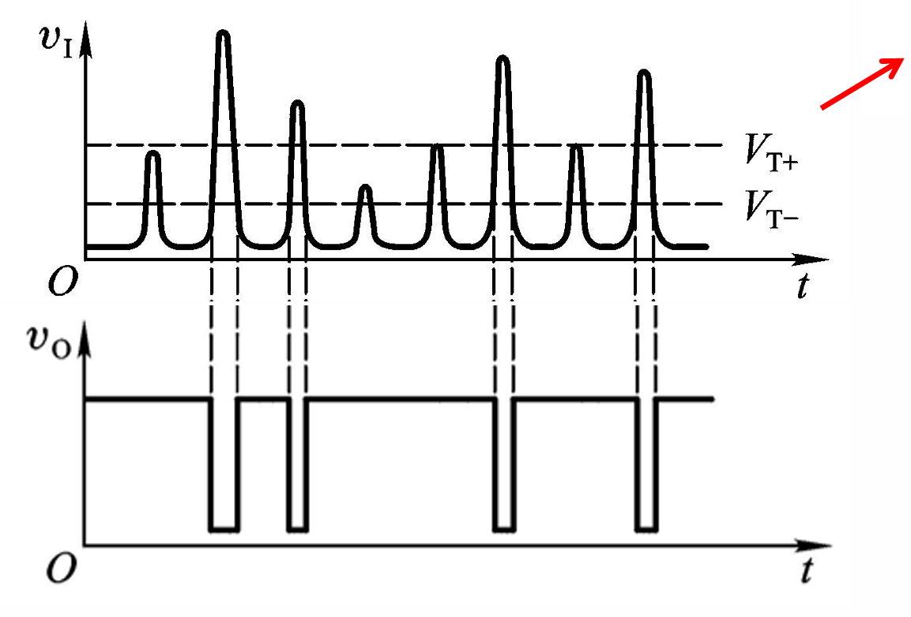

---

## 7.3 单稳态电路 ⏱️

### 1. 性能特点

- 有**一个稳态**和**一个暂稳态**。
    
- 在外界触发脉冲的作用下，能从稳态翻转到暂稳态；在暂稳态维持一段时间以后，会**自动返回**稳态。
    
- 暂稳态维持的时间长短（脉冲宽度）仅取决于电路本身的参数（如 R、C 的大小），与触发脉冲的宽度和幅度无关。
    

### 2. 微分型单稳态电路（门电路组成）
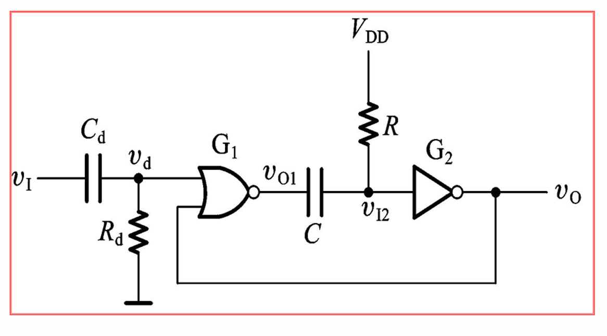
电路由输入微分电路（$C_d$、$R_d$）、或非门（$G_1$）、RC 耦合网络和反相器（$G_2$）组成。

**工作原理与过程：**
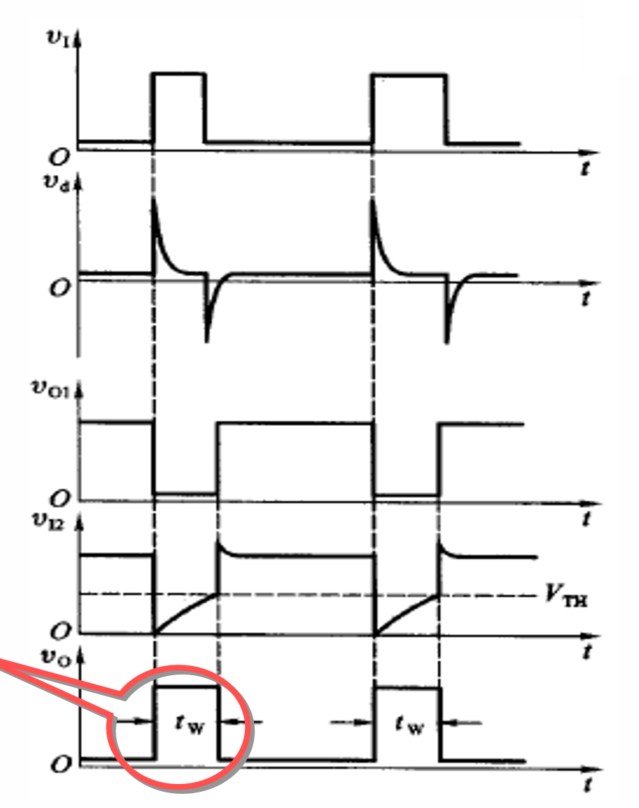
1. **稳态**：无触发信号时，电路保持稳定的状态。
    
2. **触发进入暂稳态**：当输入端加入正脉冲时，经过微分电路产生尖峰脉冲，使 $G_1$ 翻转，进而通过电容 C 将 $G_2$ 输入端拉低，$G_2$ 输出跳变为高电平。此时电路进入暂稳态。
    
3. **电容充电与自动返回**：进入暂稳态后，电源 $V_{DD}$ 通过电阻 R 对电容 C 充电，导致 $G_2$ 输入端电压逐渐升高。当升高到 $V_{TH}$ 时，$G_2$ 再次翻转，输出变回低电平，电路自动恢复到稳态。
    

**关键公式：**

输出脉冲宽度（暂稳态维持时间）$t_w$ 由充电速度决定：

$$\boxed{t_w = RC \ln \frac{V_{DD} - 0}{V_{DD} - V_{TH}}}$$

由于 CMOS 门的 $V_{TH} \approx V_{DD}/2$，所以公式可简化为：

$$\boxed{t_w \approx RC \ln 2 \approx 0.7RC}$$

**时间参数概念：**

- **恢复时间** ($t_{re}$)：输出返回低电平后，还需要等电容放电完毕，电路才完全恢复到起始的稳态。$t_{re} \approx (3 \sim 5) R_{ON} C$。
    
- 分辨时间 ($t_d$)：为保证单稳态电路正常工作，两相邻触发脉冲之间的最小时间间隔。$t_d = t_w + t_{re}$。
    

> 💡 **注意点提醒**：
> 
> 单稳态电路在被触发产生一个脉冲后，必须等待 $t_{re}$ 的恢复时间让电容放电。如果下一个触发脉冲来得太快（间隔小于分辨时间 $t_d$），电路将无法正常响应！

---

## 7.5 555定时器及其应用 ⏱️

555定时器是一种多用途的数字-模拟混合的集成电路 。利用它可以非常方便地构成施密特触发电路、单稳态电路和多谐振荡电路 。

#### 1. 555定时器的电路结构
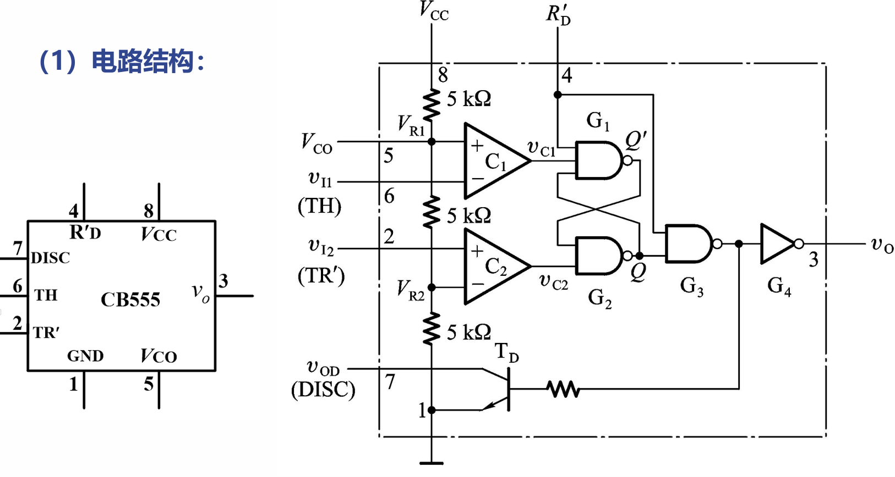
555定时器的内部核心结构主要由以下几个部分组成：

- **电阻分压器**：包含三个 $5~k\Omega$ 的分压电阻 。
    
- **电压比较器**：两个比较器 $C_{1}$ 和 $C_{2}$ 。
    
- **锁存器**：一个 SR锁存器 。
    
- **输出级**：一个输出缓冲器 。
    
- **放电管**：一个 OC输出（开路集电极输出）的放电晶体管 $T_{D}$ 。
    

#### 2. 参考电压 $V_{R1}$ 与 $V_{R2}$ 的确定 ⚖️

比较器的参考电压由控制电压端（$V_{CO}$，即第5脚）的状态决定：

- **若 $V_{CO}$ 悬空**：
    
    分压电路由三个 $5~k\Omega$ 电阻均分电源电压 $V_{CC}$。
    
    $\boxed{V_{R1} = \frac{2}{3}V_{CC}}$ $\boxed{V_{R2} = \frac{1}{3}V_{CC}}$
    
- **若 $V_{CO}$ 不悬空（外接参考电压）**：
    
    $\boxed{V_{R1} = V_{CO}}$ $\boxed{V_{R2} = \frac{1}{2}V_{CO}}$
    

#### 3. 555定时器的工作原理与功能表 ⚙️

根据控制端和输入端（$v_{I1}$, $v_{I2}$）的电平，输出 $v_o$ 和放电管 $T_D$ 的状态如下：

1. **强行置零**：当复位端 $R'_D = 0$ 时，不受输入端状态的影响，输出 $v_o$ 强制为低电平，放电管 $T_{D}$ 导通 。
    
2. **正常工作**（当 $R'_D = 1$ 时）：
    
    - 若 $v_{I1} > \frac{2}{3}V_{CC}$ 且 $v_{I2} > \frac{1}{3}V_{CC}$，则输出 $v_o$ 为低电平，放电管 $T_{D}$ 导通 。
        
    - 若 $v_{I1} < \frac{2}{3}V_{CC}$ 且 $v_{I2} > \frac{1}{3}V_{CC}$，则输出 $v_o$ 和放电管 $T_{D}$ 均保持状态不变 。
        
    - 若 $v_{I1} < \frac{2}{3}V_{CC}$ 且 $v_{I2} < \frac{1}{3}V_{CC}$，则输出 $v_o$ 为高电平，放电管 $T_{D}$ 截止 。
        
    - 若 $v_{I1} > \frac{2}{3}V_{CC}$ 且 $v_{I2} < \frac{1}{3}V_{CC}$，则输出 $v_o$ 为高电平，放电管 $T_{D}$ 截止 。
        

---

#### 4. 用555定时器构成施密特触发电路 ⚡

将555定时器按特定方式连接，即可组成一个反相输出的施密特触发器 。
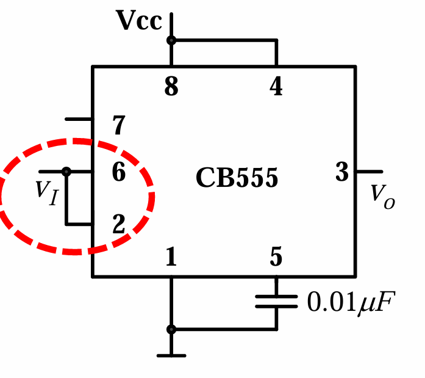
**1. 电路连接方法**

- 把 $v_{I1}$ 和 $v_{I2}$ 两个输入端连在一起作为信号输入端 $v_I$ 。
    
- 置零端（4脚）必须接高电平 $V_{CC}$ 。
    
- 第5脚接一个 $0.01\mu F$ 的滤波电容接地，用以提高电路稳定性 。
    

**2. 电路工作过程分析**

- **电压上升过程** 📈：
    
    - 初始当 $v_I < \frac{1}{3}V_{CC}$ 时，输出 $v_o$ 为高电平（1） 。
        
    - 当 $\frac{1}{3}V_{CC} < v_I < \frac{2}{3}V_{CC}$ 时，输出状态维持不变 。
        
    - 当输入继续上升至 $v_I > \frac{2}{3}V_{CC}$ 时，输出 $v_o$ 翻转为低电平（0） 。
        
- **电压下降过程** 📉：
    
    - 当输入回落至 $\frac{1}{3}V_{CC} < v_I < \frac{2}{3}V_{CC}$ 时，输出状态再次维持不变 。
        
    - 当输入继续下降至 $v_I < \frac{1}{3}V_{CC}$ 时，输出 $v_o$ 重新翻转回高电平（1） 。
        

**3. 关键特性参数公式**

施密特触发器最重要的特征是具有两个阈值电压，从而产生回差。

- **情况一：$V_{CO}$ 悬空**
    
    - 正向阈值电压：$\boxed{V_{T+} = \frac{2}{3}V_{CC}}$
        
    - 负向阈值电压：$\boxed{V_{T-} = \frac{1}{3}V_{CC}}$
        
    - 回差电压：$\boxed{\Delta V_T = \frac{1}{3}V_{CC}}$
        
- **情况二：$V_{CO}$ 外接参考电压**
    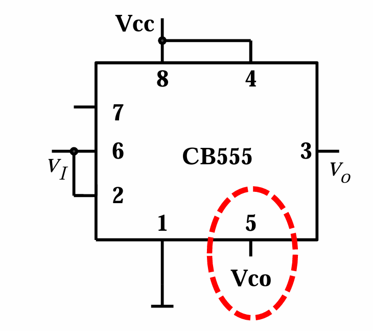
    - 正向阈值电压：$\boxed{V_{T+} = V_{CO}}$
        
    - 负向阈值电压：$\boxed{V_{T-} = \frac{1}{2}V_{CO}}$
        
    - 回差电压：$\boxed{\Delta V_T = \frac{1}{2}V_{CO}}$
        
    - **结论**：若参考电压由 $V_{CO}$ 提供，则可以通过改变 $V_{CO}$ 的值来灵活调节回差电压的大小 。
        

#### ⚠️ 注意点 & 易错点提醒

- **📌 注意点 (滤波电容不可省)**：在555定时器的控制端（第5脚）如果不接外部参考电压时，为了防止干扰，务必要接一个 $0.01\mu F$ 的电容到地，这是为了“提高稳定性” 。
    
- **❌ 易错点 (反相输出的判断)**：用555定时器构成的基础施密特触发器，其输出端 $v_o$ 与输入端 $v_I$ 在逻辑上是**反相输出**的 。很多同学容易记混，一定要记住：输入信号“超过”高阈值 $\frac{2}{3}V_{CC}$ 时，输出变“低”；输入信号“低于”低阈值 $\frac{1}{3}V_{CC}$ 时，输出变“高” 。
    

---

### 5. 用555定时器构成单稳态电路 ⏱️
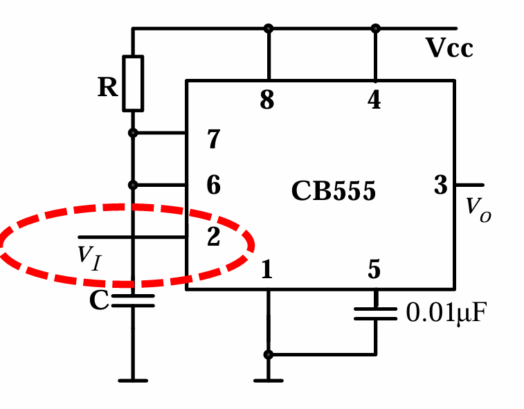
单稳态电路只有一个稳定的状态，在外部触发信号的作用下，电路会进入“暂稳态”，维持一段时间后，会自动自动返回到原来的稳态。

**1. 电路结构**

- 第2脚（$TR'$）单独作为信号的触发输入端 $v_I$ 。
    
- 第6脚（$TH$）与第7脚（$DISC$ 放电端）短接，并接在外部的充放电电容 $C$ 上 。
    
- 电阻 $R$ 连接在电源 $V_{CC}$ 和第7脚之间，为电容提供充电回路 。
    

**2. 工作原理与稳态分析**

- **稳态 (低电平)**：假设没有触发信号（$v_I$ 保持高电平），此时电路处于稳态，输出 $v_O = 0$（低电平） 。由于放电管 $T_D$ 导通，电容 $C$ 被短路放电，电容电压 $v_C \approx 0$ 。
    
- **暂稳态 (高电平)**：当输入端 $v_I$ 到来一个负脉冲（即 $v_I < \frac{1}{3}V_{CC}$）时，电路被触发翻转，输出 $v_O$ 变为高电平（1），进入暂稳态 。此时放电管 $T_D$ 截止，电源通过电阻 $R$ 开始向电容 $C$ 充电 。
    
- **自动返回稳态**：随着充电进行，当电容电压 $v_C$ 充电上升到 $\frac{2}{3}V_{CC}$ 时，内部比较器翻转，使得输出 $v_O$ 重新回到低电平（0） 。同时放电管 $T_D$ 重新导通，电容 $C$ 迅速放电至 $0V$，电路恢复并停留在稳态 。
    

**3. 脉冲宽度计算** 输出的高电平脉冲宽度（即暂稳态的持续时间）取决于外部 $RC$ 电路的充电速度 ：

$$\boxed{t_w = RC \ln \frac{V_{CC} - 0}{V_{CC} - \frac{2}{3}V_{CC}} = RC \ln 3 \approx 1.1RC}$$

---

### 6. 用555定时器构成多谐振荡电路 〰️

多谐振荡电路没有稳态，只有两个暂稳态，它能在接通电源后自动产生一定频率的矩形波输出 。

**1. 基本电路结构**
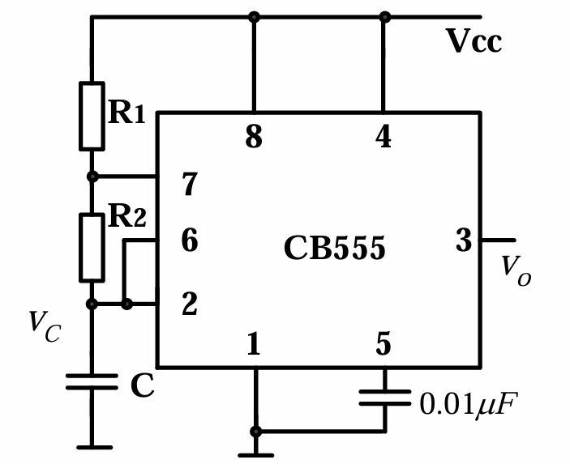
- 将第2脚和第6脚短接在一起，接在电容 $C$ 上 。
    
- 外部接有两个电阻 $R_1$ 和 $R_2$。$R_1$ 接在电源与第7脚之间，$R_2$ 接在第7脚与第2/6脚之间 。
    

**2. 周期与占空比计算**
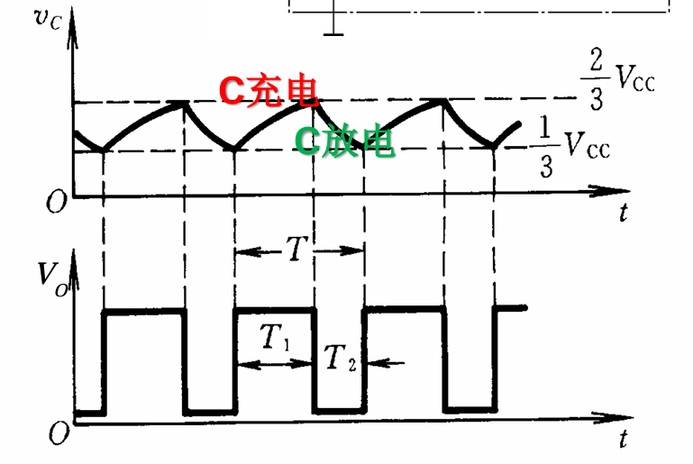
- **电容充电过程**：电源通过 $R_1$ 和 $R_2$ 向电容 $C$ 充电，充电时间为 $T_1$ 。
    
- **电容放电过程**：电容 $C$ 通过 $R_2$ 和内部放电管放电，放电时间为 $T_2$ 。
    
- 振荡周期：
    
    $$\boxed{T = T_1 + T_2 = (R_1 + 2R_2)C \ln 2}$$
    
- 占空比：高电平时间在整个周期中的占比。
    
    $$\boxed{q = \frac{T_1}{T} = \frac{R_1 + R_2}{R_1 + 2R_2} > 50\%}$$
    

**3. 改善占空比的方法** 由于基础电路中充电必定经过 $R_1+R_2$，放电只经过 $R_2$，因此占空比永远大于 $50\%$ 。若要实现可调占空比（甚至小于 $50\%$），可以接入二极管 $D_1$ 和 $D_2$ 分离充放电回路 。
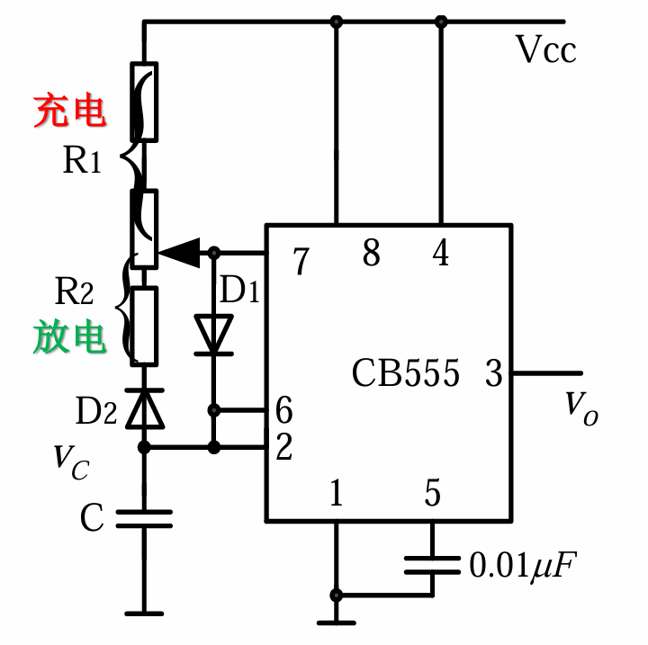
- 此时充电仅经过 $R_1$，放电仅经过 $R_2$ 。
    
- 改善后的占空比：$\boxed{q = \frac{R_1}{R_1 + R_2}}$
    
- 改善后的周期：$\boxed{T = (R_1 + R_2)C \ln 2}$
    

---

### 7. 典型示例题目演练 ✏️

**【例1】用555定时器组成的开机延时电路**
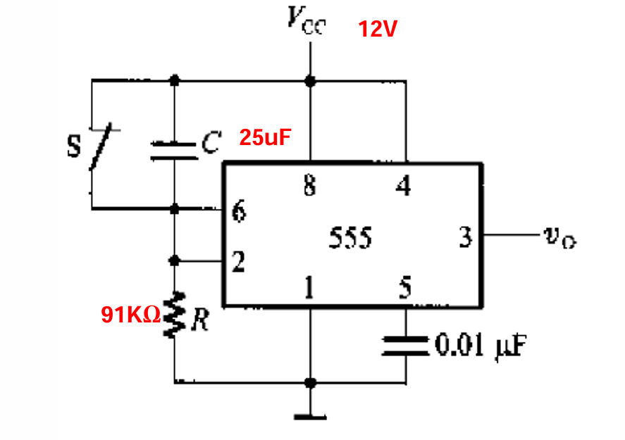
**题目**：计算常闭开关 $S$ 断开后经过多长的延迟时间 $v_O$ 才跳变为高电平（已知 $R=91k\Omega, C=25\mu F, V_{CC}=12V$） 。 **分析**：

1. $S$ 闭合时，输入端被短路到 $V_{CC}$，此时输入为 $12V$，输出 $v_O$ 维持在低电平 。
    
2. $S$ 断开后，电容 $C$ 开始充电，输入端电压 $v_I$ 开始下降 。
    
3. 当 $v_I$ 下降到 $\frac{1}{3}V_{CC}$ 时，电路翻转，输出变为高电平 。 **解答**：延迟时间即为电容电压从 $V_{CC}$ 放电（下降）到 $\frac{1}{3}V_{CC}$ 的时间（利用三要素法公式）：
    
    $$t_d = RC \ln \frac{V_C(\infty) - V_C(0)}{V_C(\infty) - V_C(t)} = RC \ln \frac{0 - V_{CC}}{0 - \frac{1}{3}V_{CC}} = RC \ln 3$$
    
    （注：课件中将此过程等效视为电容从 $0$ 充电至 $\frac{2}{3}V_{CC}$ 对等的时间，最终公式一致 ）。 计算得：$t_d = 91 \times 10^3 \times 25 \times 10^{-6} \times \ln 3 \approx 2.5s$ 。
    

**【例2】延时报警器综合分析**
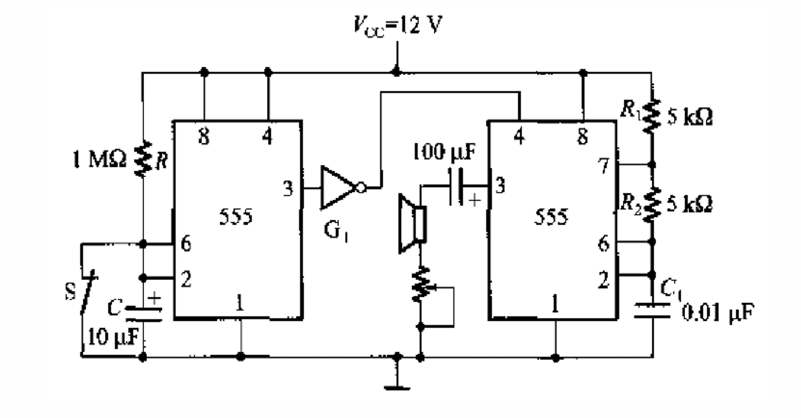
**电路结构**：左侧为一个由555构成的施密特触发电路（控制延时），右侧为一个555构成的多谐振荡电路（驱动扬声器发声） 。 **工作原理**：

- 稳态时开关 $S$ 闭合，左侧输出高电平，经过反相器后变为低电平，强制将右侧的555振荡器“清零”（复位端接低电平），振荡器不工作 。
    
- 当 $S$ 断开后，左侧电容 $C$ 开始充电，当电平升至 $\frac{2}{3}V_{CC}$ 时，左侧输出翻转为低电平 。
    
- 经过反相器变为高电平，解除了对右侧振荡器的封锁，右侧开始振荡，发出报警音 。
    

---

## 💡 本章学习总结

本章完美展示了555定时器的极强通用性：

1. **施密特触发器**：利用其滞回特性，常用于波形整形和抗干扰。
    
2. **单稳态电路**：利用外部触发信号产生固定宽度的脉冲，常用于**定时、延时控制** 。
    
3. **多谐振荡器**：无需外部触发自动产生方波，常用于**信号源、报警音发生器** 。
    

### ⚠️ 注意点 & 易错点提醒

- **📌 注意点（复位端的妙用）**：在综合电路（如延时报警器）中，第4脚（复位端 $R'_D$）常被用来作为**使能控制端** 。当4脚为低电平时，无论外部输入如何，555定时器都被强行“锁死”在低电平输出；只有4脚为高电平时，电路才能正常发挥其单稳态或振荡功能。
    
- **❌ 易错点（占空比公式）**：在多谐振荡器中，很多同学会将基础电路的周期公式错记为 $(R_1+R_2)C\ln 2$。一定要牢记，由于放电不经过 $R_1$，所以充电是 $R_1+R_2$，放电是 $R_2$，加起来是 **$(R_1 + 2R_2)$** 。
    

### 一、 施密特触发电路 🎛️

- **稳态数量**：双稳态（输出高电平或低电平都能稳定保持，直至输入信号打破平衡）。
    
- **触发条件**：受外部输入的**模拟电压幅度**控制。
    
- **核心特点**：具有**电压滞回**特性，即输入电平上升和下降时，电路翻转的阈值不同，存在正向阈值电压和负向阈值电压的差值（即回差电压 $\boxed{\Delta V_T}$ ）。
    
- **主要用途**：
    
    - **波形整形**：将缓慢变化的非标准波形（如正弦波、三角波）整形为边沿陡峭的矩形波。
        
    - **抗干扰**：利用回差特性，消除输入信号中叠加的噪声引起的误翻转。
        

### 二、 单稳态电路 ⏱️

- **稳态数量**：**一个稳态**（通常是输出低电平）和**一个暂稳态**（输出高电平）。
    
- **触发条件**：必须依赖**外部触发信号**（通常是第2脚引入的负脉冲）的刺激。
    
- **核心特点**：平时安静地待在稳态；一旦被触发，输出会瞬间跃迁到暂稳态。经过由外部电阻电容决定的固定时间（$\boxed{t_w \approx 1.1RC}$）后，电路会**自动**回到原来的稳态，无需外部干预。
    
- **主要用途**：
    
    - **延时控制**：例如开机延时电路，触发后延迟一段时间才执行动作。
        
    - **定时与脉冲整形**：不管输入的触发脉冲有多宽或多窄，输出都能给出一个宽度绝对标准的高电平脉冲。
        

### 三、 多谐振荡电路 〰️

- **稳态数量**：**零个稳态**（具有两个互相交替的暂稳态）。
    
- **触发条件**：**完全不需要外部触发信号**（自激振荡）。
    
- **核心特点**：只要接通电源，电路就会利用外部电容的自动充放电过程，在两个暂稳态之间周而复始地自动翻转，永不停息。
    
- **主要用途**：
    
    - **信号源**：作为数字系统的时钟脉冲发生器，产生连续的矩形波或方波。
        
    - **音频发生器**：通过改变外部 $RC$ 参数调节振荡频率 $\boxed{T = (R_1 + 2R_2)C \ln 2}$，用于报警音发生器、闪烁灯控制等。
        

---

### ⚠️ 注意点 & 易错点提醒

- **📌 注意点 (引脚连接规律)**：
    
    - 看到 **第2脚和第6脚短接** 作为信号输入，大概率是施密特触发电路。
        
    - 看到 **第2脚单独接触发信号**，第6脚和第7脚接在一起连电容，必定是单稳态电路。
        
    - 看到 **第2脚和第6脚短接且连在电容上**，没有外部信号输入端，绝对是多谐振荡电路。
        
- **❌ 易错点 (稳态的区别)**：不要把施密特触发器和单稳态电路搞混。施密特触发器如果不改变输入电压，输出会永远保持当前状态；而单稳态电路即使你撤掉触发信号，它在暂稳态停留一定时间后也会自己“跑回”稳态。