门电路：实现基本逻辑运算和复合运算的单元电路。常用的门电路有非门（反相器）、与非门、或非门、异或门、与或非门等。本章主要探索它们的内部结构。

---

## 3.1 概述 📖

在二值逻辑电路中有两种逻辑状态：`1`和`0`，分别用高电平和低电平表示。
在数字电路中，输入输出的二值逻辑及其高低电平的获得是通过**开关电路**来实现的。

### 1. 获得高、低电平的基本原理
*   **单开关电路**：
    *   开关断开时：输出电压 $V_o = V_{cc}$，为高电平 `1`。
    *   开关闭合时：输出电压 $V_o = 0$，为低电平 `0`。
    *   *弊端*：当开关闭合时，电流从 $V_{cc}$ 经电阻 $R$ 直接流向地，会产生较大的静态功耗。
*   **互补开关电路（改进）**：
    *   使用两个开关 $S1$ 和 $S2$ 串联，受同一个输入信号控制，且它们的**导通和断开状态相反**。
    *   当 $S1$ 闭合、$S2$ 断开时，输出高电平 `1`。
    *   当 $S1$ 断开、$S2$ 闭合时，输出低电平 `0`。
    *   *优点*：由于两个开关总有一个是断开的，流过两者的电流理论上为零，故互补开关电路的**功耗非常低**。
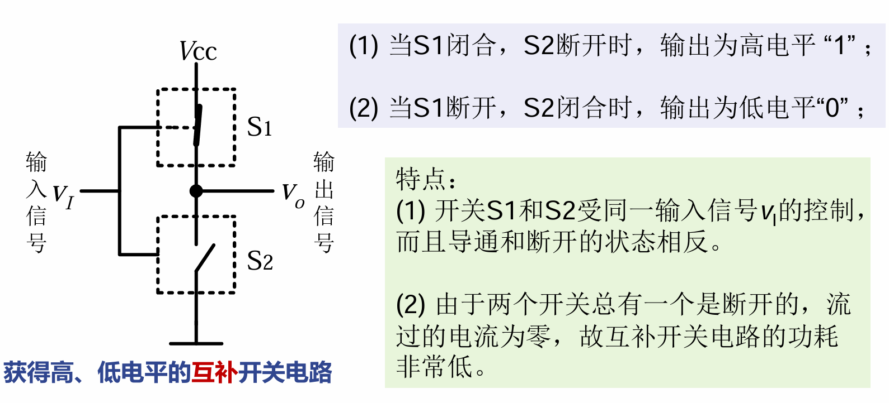

### 2. 正负逻辑系统
在数字电路中，高低电平的定义不限定在某个具体值，而是一个**允许的范围**（如 $V_{IH}$ 允许一定波动，不一定非得是完美的 5V）。
*   **优点**：对元器件的精度和电源的稳定性的要求比模拟电路要低，抗干扰能力更强。
*   **正逻辑**：高电平代表 `1`，低电平代表 `0`（本课程默认使用）。
*   **负逻辑**：低电平代表 `1`，高电平代表 `0`。

### 3. 分类
*   按构成：分立元件逻辑门电路、集成逻辑门电路。
*   集成电路按导电类型：单极型（FET）、双极型（BJT）、兼容型（FET+BJT）。

---

## 3.2 半导体二极管门电路 🔌

### 3.2.1 二极管的开关特性
二极管（D）就相当于一个受电压控制的开关：
*   **高电平输入 ($V_{IH} = V_{CC}$)**：二极管**截止**，相当于开关断开。
*   **低电平输入 ($V_{IL} = 0$)**：二极管**导通**，相当于开关闭合，此时正向压降 $V_O = V_{OL} = 0.7V$。
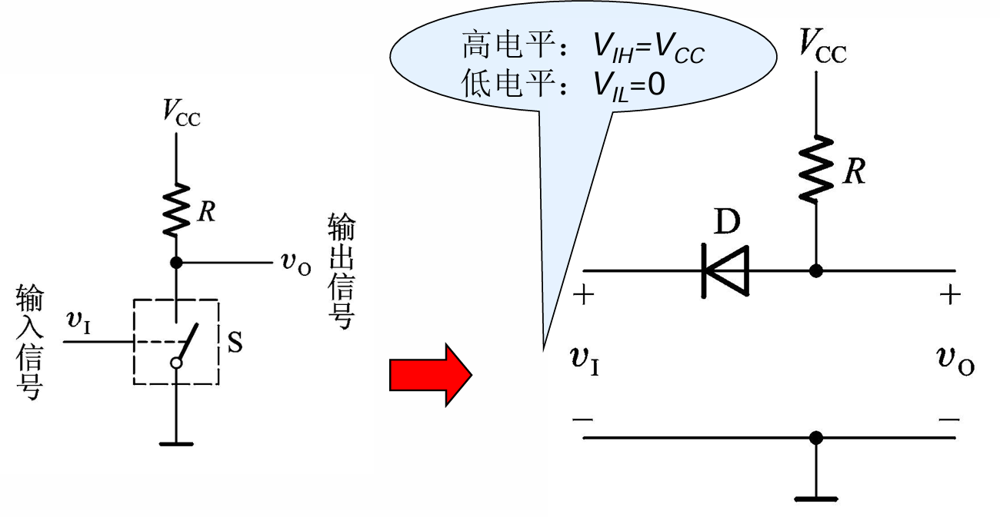
### 3.2.2 二极管与门 (AND)
*   **结构**：二极管的阴极接输入端，阳极通过电阻接电源 $V_{CC}$，输出取自阳极。
*   **原理**：只有当所有输入端都接高电平时，所有二极管截止，输出才被电阻拉高至高电平。只要有一个输入端接低电平（0V），对应的二极管就会导通，将输出端电压钳位在 0.7V（视为低电平 `0`）。
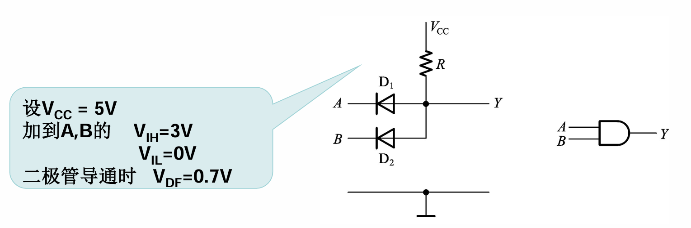
### 3.2.3 二极管或门 (OR)
*   **结构**：二极管的阳极接输入端，阴极通过电阻接地，输出取自阴极。
*   **原理**：只要有一个输入端接高电平，对应的二极管就会导通，将输出端拉高至高电平。只有所有输入端都接低电平时，所有二极管不导通，输出才被电阻拉低至 0V。
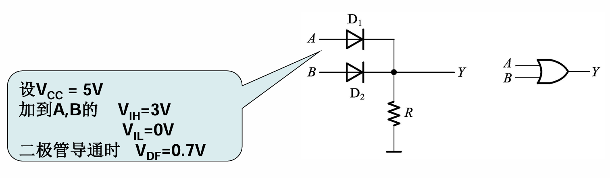
### ⚠️ 二极管门电路的致命缺点：
1.  **电平偏移**：输出的高低电平数值与输入数值相差一个二极管的压降（0.7V）。如果串联多级门电路，电平会逐级衰减/抬升，最终导致逻辑错误。
2.  **带负载能力差**：输出端对地接负载电阻时，负载电阻的改变会严重影响输出电平的分压。
*   **结论**：因此，二极管门电路**只用于 IC 内部电路的逻辑单元**，不能作为独立的集成门电路使用。

---

## 3.3 CMOS门电路 💻 (核心重点⭐)

### 3.3.1 MOS管的开关特性
MOS管：金属-氧化物-半导体 场效应管。
*   **结构**：包含 源极(S)、栅极(G)、漏极(D)、衬底(B)。
*   **分类**：
    *   **N沟道**（导电载流子为电子）：高电平导通，低电平截止。
    *   **P沟道**（导电载流子为空穴）：低电平导通，高电平截止。
*   **特性**：
    *   **输入特性**：绝缘层导致**栅极直流电流为0**，看进去等效为一个输入电容，对动态特性有影响。
    *   **输出特性**：分为截止区（开关断开，电阻极大）、恒流区、可变电阻区（开关导通，电阻极小）。
*   **开关等效**：在数字电路中，MOS管的D-S之间相当于一个**受栅极电压 $V_I$ 控制的开关**。
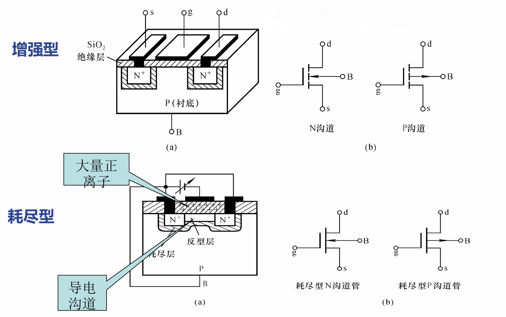
### 注：四种CMOS管的区分方法
#### 1. 名字字面记忆法

- **增强型 = “无中生有”**。本来没有沟道（断路），需要加电压去**增强**出一条路。
    
- **耗尽型 = “过河拆桥”**。本来有现成的沟道（通路），需要加电压去把资源**耗尽**才能截断。
    
- **N沟道 = Needs Positive**（N型载流子是带负电的电子，异性相吸，需要**正**电压来吸引开启）。
    
- **P沟道 = Needs Negative**（P型载流子是带正电的空穴，需要**负**电压来吸引开启）。

#### 2. 电路符号记忆法 (非常重要)

在看电路图时，通过符号的三要素就能一眼看穿：

- **看中间的线（判断增强/耗尽）：**
    
    - 如果是**断开的三段虚线**：代表沟道默认是断开的 $\rightarrow$ **增强型**。
        
    - 如果是**连在一起的实线**：代表沟道默认是连通的 $\rightarrow$ **耗尽型**。
        
- **看箭头的方向（判断N/P沟道）：**
    
    - 箭头代表的是内部PN结（从P型衬底指向N型沟道）的方向。
        
    - **口诀：“N进P出”**。
        
    - 箭头**向内指**（指向栅极） $\rightarrow$ **N沟道**。
        
    - 箭头**向外指**（背离栅极） $\rightarrow$ **P沟道**。

---

### 3.3.2 CMOS反相器 (非门) 的电路结构与工作原理 🔄

**CMOS** 代表互补金属氧化物半导体（Complementary MOS）。
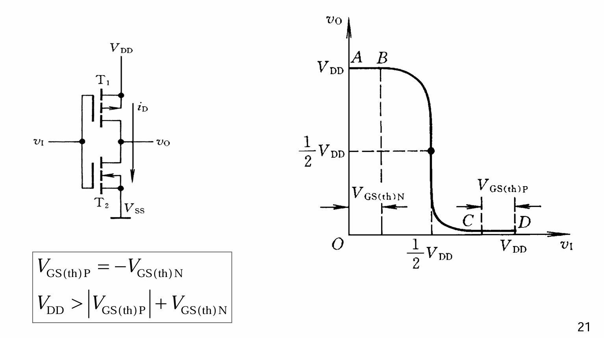
*   **结构**：由一个 P沟道MOS管 ($T_1$，在上) 和一个 N沟道MOS管 ($T_2$，在下) 串联构成。栅极连在一起作为输入，漏极连在一起作为输出。
*   **工作原理**：
    1.  **输入低电平 ($V_I = 0$)**：
        $T_1$ (P管) 满足导通条件 $\rightarrow$ 导通；
        $T_2$ (N管) 不满足导通条件 $\rightarrow$ 截止。
        此时输出端 $V_o$ 被 $T_1$ 拉高至电源电压 $V_{DD}$，**输出高电平**。
    2.  **输入高电平 ($V_I = V_{DD}$)**：
        $T_1$ (P管) $\rightarrow$ 截止；
        $T_2$ (N管) $\rightarrow$ 导通。
        此时输出端 $V_o$ 被 $T_2$ 拉低至地，**输出低电平 ($V_{OL} \approx 0$)**。

> 💡 **CMOS反相器的核心特点**：
> 1.  **互补特性**：无论输入是高还是低，$T_1$ 和 $T_2$ 的状态总是**一个导通、另一个截止**。
> 2.  **极低功耗**：因为总有一个管子处于截止状态（电阻极高），从电源到地几乎没有静态电流流过，因此 CMOS 电路的**静态功耗极小**。

#### 电压与电流传输特性
*   **电压传输特性**：分为五个区。中间段（BC段）当 $V_I = \frac{1}{2}V_{DD}$ 时，$V_O = \frac{1}{2}V_{DD}$，这个点称为反相器的**阈值电压**（发生跳变的临界点）。
*   **电流传输特性**：在输入高或低电平时，漏极电流几乎为0。**仅在状态翻转的瞬间（输入电压在 $V_{DD}/2$ 附近时）**，$T_1$ 和 $T_2$ 短暂同时导通，此时会产生一个**很大的尖峰电流 $i_D$**。
    *(⚠️注意：因此CMOS电路不能长时间停留在跳变区，否则会因功耗过大而损坏)*

#### 输入端噪声容限
指在保证输出高、低电平基本不变时，允许输入信号高、低电平波动的最大范围。
*   **提高方法**：输入噪声容限和电源电压 $V_{DD}$ 有关，可以通过**提高 $V_{DD}$** 来提高电路的抗干扰能力（噪声容限）。
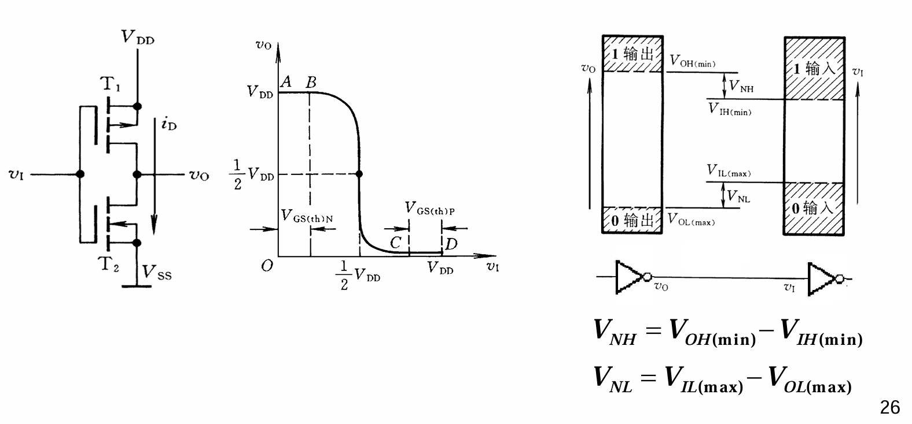

---

### 3.3.3 CMOS反相器的静态特性

*   **静态输入特性**：从输入端看进去，等效输入电阻极大（$10M\Omega$ 以上），输入电流极小；但有一个约 $5pF$ 的**等效输入电容**（使得输入信号不能发生理想的瞬间跳变）。
    *   *保护电路*：内部自带钳位二极管，防止静电高压击穿绝缘层。
*   **静态输出特性**：
    *   低电平输出时：输出电平会随着吸收负载电流的增加而略微**提高**。
    *   高电平输出时：输出电平会随着拉出负载电流的增加而略微**下降**。

---

### 3.3.4 CMOS反相器的动态特性 ⏱️

#### 1. 传输延迟时间
由于 MOS 管寄生电容和外接负载电容的充放电需要时间，导致输出电压的变化**滞后**于输入电压的变化。
*   $t_{PHL}$：输出由高变低的延迟。
*   $t_{PLH}$：输出由低变高的延迟。
*   平均延迟时间 $t_{pd} = (t_{PHL} + t_{PLH}) / 2$。（理想对称的CMOS电路中 $t_{PHL} = t_{PLH}$）。

#### 2. 扇出系数
指该门电路能够驱动同类门电路的**最大个数**。
*   **静态情况下**：因为CMOS输入电阻极大，几乎不吸取电流，所以理论上可以驱动**很多个**。
*   **动态情况下（高频工作时）**：**可驱动个数严重受限！**
    *   *原因*：后级驱动的门越多，挂在输出端的总负载电容就越大，充放电时间越长，导致传输延迟严重恶化，影响工作频率。
    *   *结论*：CMOS 门的扇出系数跟**工作频率**有密切关系，频率越高，能驱动的个数越少。

### 3.3.5 其它类型CMOS门电路 🔀

在基本的CMOS反相器基础上，通过改变MOS管的串并联组合，可以构成各种复杂的逻辑门电路。

#### 一、 各种逻辑功能的CMOS门电路

###### 1. CMOS与非门
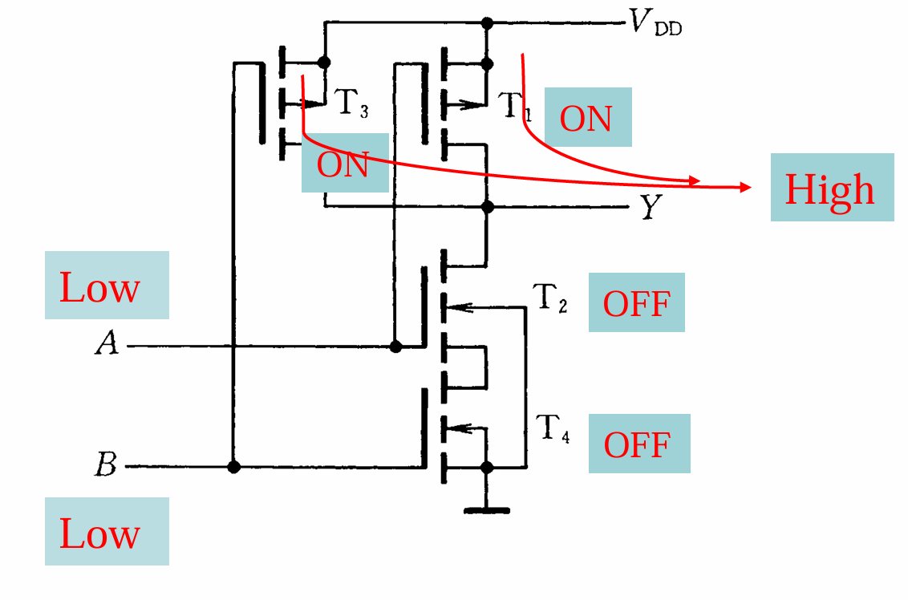
*   **内部结构**：顶部为**两个并联**的PMOS管，底部为**两个串联**的NMOS管。
*   **工作原理**：
    *   只要 $A$、$B$ 中有一个为低电平 `0`，底部串联的NMOS管就会断开，顶部并联的PMOS管至少有一个导通，输出被拉高为高电平 `1`。
    *   只有 $A$、$B$ 同时为高电平 `1` 时，底部NMOS全导通，顶部PMOS全截止，输出才为低电平 `0`。
*   **逻辑式**：$$ \boxed{Y = (AB)'} $$

###### 2. CMOS或非门
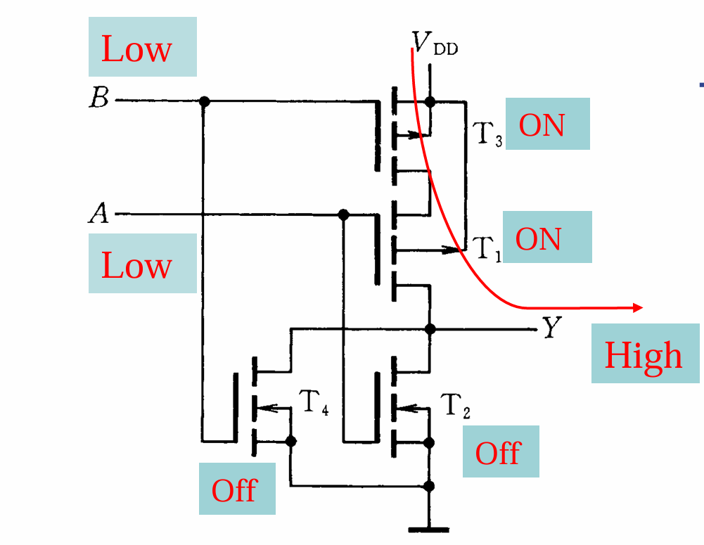
*   **内部结构**：顶部为**两个串联**的PMOS管，底部为**两个并联**的NMOS管。
*   **工作原理**：
    *   只要 $A$、$B$ 中有一个为高电平 `1`，底部并联的NMOS管至少有一个导通，顶部串联的PMOS管断开，输出被拉低为低电平 `0`。
    *   只有 $A$、$B$ 同时为低电平 `0` 时，顶部PMOS全导通，底部NMOS全截止，输出才为高电平 `1`。
*   **逻辑式**：$$ \boxed{Y = (A+B)'} $$

###### 3. 带缓冲级的CMOS门电路
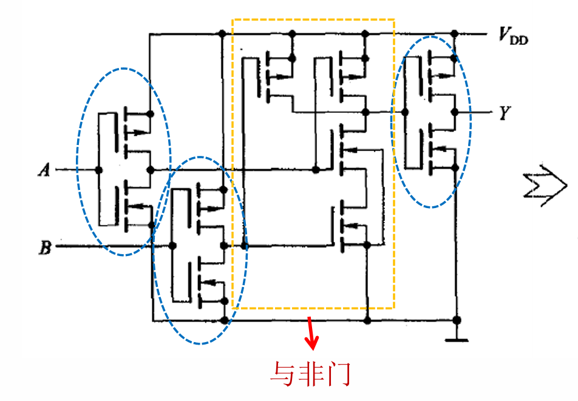
*   **无缓冲级CMOS门电路的不足**：
    1.  **输出电阻受输入状态的影响**：输入状态不同，导通的MOS管数量不同，导致输出电阻值相差可达4倍之多。
    2.  **输出电平受输入端数目的影响**：输入端越多，串联或并联的内阻越大，影响输出的 $V_{OL}$ 和 $V_{OH}$。
    3.  **电压传输特性受影响**。
*   **解决办法**：在门电路的每个输入端和输出端各增设一级标准参数的反相器（缓冲器）。这使得电压传输特性的转折区变得更陡，更接近理想开关特性。
*   ⚠️ **易错点**：输入、输出端加进缓冲器（反相器）后，**电路的逻辑功能会发生变化**！
    *   与非门 + 缓冲器 $\rightarrow$ 或非门
    *   或非门 + 缓冲器 $\rightarrow$ 与非门
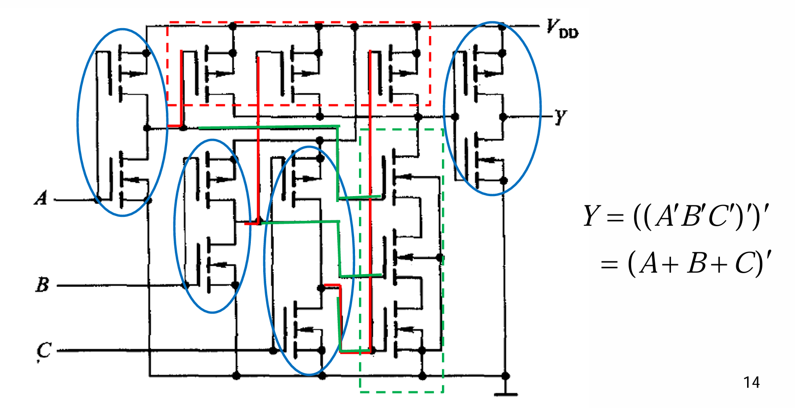
---

#### 二、 漏极开路输出门电路（OD门） 🚪

###### 1. OD门的结构与特点
*   **结构**：把普通CMOS门电路**上半支路的PMOS管去掉**，输出端直接从内部NMOS管的漏极（Drain）引出。OD代表 Open-Drain。
*   **作用**：为了满足输出电平变换、吸收大负载电流以及实现**线与**连接的需要。
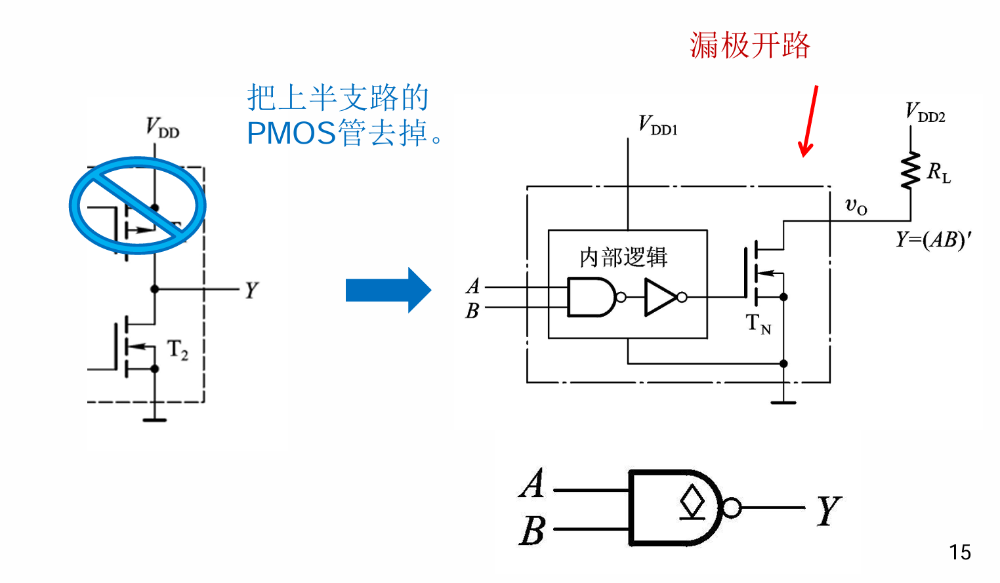
> 🛑 **绝对注意点**：
> 在使用OD门时，**必须将输出端通过电阻（上拉电阻 $R_L$）接到电源上**，否则电路无法输出高电平！

###### 2. OD门的应用
*   **实现电平变换**：通过改变上拉电阻连接的电源 $V_{DD2}$ 的电压值，可以将输出高电平转换为所需的特定电压。
*   **实现线与接法**：将多个OD门的输出端**直接相连**（共用一个上拉电阻）。
    *   只要其中一个门输出低电平，总输出 $Y$ 就是低电平。
    *   只有所有门都输出高阻态（NMOS全截止）时，总输出 $Y$ 才被上拉电阻拉高为高电平。
    * 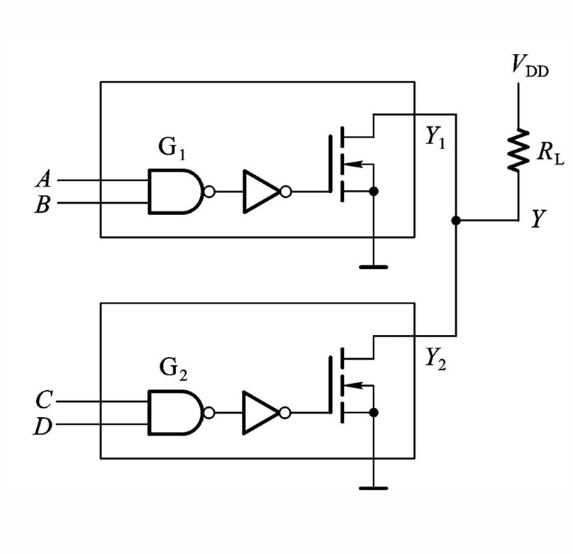
    *   逻辑式：$$ \boxed{Y = Y_1 \cdot Y_2 = (AB)' \cdot (CD)' = (AB + CD)'} $$

###### 3. OD输出门的上拉电阻 $R_L$ 阻值计算 (⭐难点)
上拉电阻不能太大，也不能太小，必须在一个合理区间内 $[R_{L(min)}, R_{L(max)}]$。
*   **计算 $R_{L(max)}$（上限值）**：
    *   **最坏情况**：当所有OD门输出高电平（全部NMOS截止）时。
    *   **目标**：确保漏电流（前面的漏电流 $I_{OH}$ + 后面的输入电流 $I_{IH}$）在 $R_L$ 上产生的压降，不会把输出高电平拉低到 $V_{OH(min)}$ 以下。
    *   **公式**：$$ \boxed{R_{L(max)} = \frac{V_{DD} - V_{OH(min)}}{n I_{OH} + m I_{IH}}} $$ *(n为线与的OD门数，m为驱动的负载门输入端数)*

*   **计算 $R_{L(min)}$（下限值）**：
    *   **最坏情况**：当有OD门输出低电平时，且**只有1只驱动管导通**。
    *   **目标**：确保这1只导通的NMOS管承受的总灌电流，不超出它允许的最大负载电流 $I_{OL(max)}$。
    *   **公式**：$$ \boxed{R_{L(min)} = \frac{V_{DD} - V_{OL}}{I_{OL(max)} - m' |I_{IL}|}} $$ *(m'为驱动的负载门输入端数)*

*   **💡 示例题目**：
* 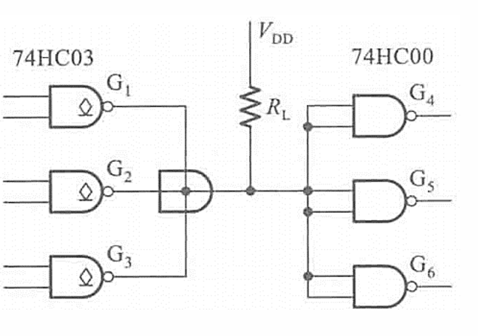
    已知 $V_{DD}=5V$，$V_{OH(min)}=4.4V$，$V_{OL}=0.33V$，$I_{OH}=I_{IH}=1\mu A$，$I_{OH(max)}=5\mu A$，$I_{OL(max)}=5.2mA$，计算 $n=3, m=6$ 时的范围。
    代入公式得：$R_{L(max)} = \frac{5 - 4.4}{3 \times 1\mu + 6 \times 1\mu} = 28.6 k\Omega$
    代入公式得：$R_{L(min)} = \frac{5 - 0.33}{5.2m - 6 \times 1\mu} = 0.9 k\Omega$

---

#### 三、 CMOS传输门 (TG) 🌉

*   **电路结构**：由一个 NMOS 管和一个 PMOS 管**并联**而成。两者的源极和漏极分别相连。
*   **控制信号**：由一对**互补**的控制信号 $C$ 和 $C'$ 控制。
*   **工作特性**：
    *   当 $C=0, C'=1$ 时：两个管子同时截止，输入和输出呈**高阻态**（相当于开关断开）。
    *   当 $C=1, C'=0$ 时：无论输入 $v_I$ 在 $0 \sim V_{DD}$ 之间怎么变化，两个管子至少有一个导通，使得整个传输门导通（相当于开关闭合），输出 $v_o = v_I$。
*   **特点与应用**：漏、源极完全对称，是**双向器件**（输入输出可互换）。常作**模拟开关**使用，传输连续变化的模拟信号。

---

#### 四、 三态输出的CMOS门电路 🚦

*   **状态定义**：输出状态不仅有高电平、低电平，还有第三态 —— **高阻态**（相当于悬空，与电路断开）。
*   **工作原理**：增加了一个使能端（如 $EN$ 或 $EN'$）。
    *   当使能端有效时（如 $EN'=0$），电路正常工作，输出等于输入的逻辑结果（如 $Y = A'$）。
    *   当使能端无效时（如 $EN'=1$），内部上下MOS管**同时截止**，输出呈**高阻态 (Z)**。
*   **典型应用**：
    *   **总线结构**：三态门可以将输出端并联挂在同一条数据总线上。只要分时控制各三态门的使能端，就能实现数据依次传输而不会发生冲突。
    *   **数据的双向传输**：利用两个三态门反向并联，通过一个方向控制信号（如 $EN$）决定数据是发出去还是读进来。

---

### 3.3.6 CMOS集成电路的正确使用 🛡️

由于CMOS电路输入阻抗极高、绝缘层极薄，使用时必须注意以下防护：

1.  **静电防护**：
    *   储存和运输时采用金属屏蔽层作包装材料。
    *   组装调试时，工具仪表人员服装等注意接地。
    *   ⚠️ **核心注意点**：**不用的输入端不应悬空！** 悬空的输入端极易感应静电导致内部MOS管击穿损坏，或者造成逻辑状态混乱。应根据逻辑需要接 $V_{DD}$ 或地。
2.  **过流防护**：
    *   输入端接低内阻信号源、大电容或长线时，应串入保护电阻，防止瞬间大电流损坏输入保护电路。

---

## 3.4 TTL 门电路 ⚡

TTL（Transistor-Transistor Logic）代表晶体管-晶体管逻辑电路，其核心元件是**双极型三极管（BJT）**。

### 3.4.1 双极型三极管的开关特性

#### 一、 双极型三极管的结构及工作原理 (以NPN为例)
*   **结构**：由发射区（高掺杂）、基区（极薄且低掺杂）、集电区（大面积且低掺杂）组成。分为发射结（b-e结）和集电结（b-c结）。
*   **放大原理（复习）**：当 $V_{CC} \gg V_{BB}$，且 **be结正偏，bc结反偏** 时。
    *   发射区发射大量电子到基区。
    *   基区很薄且空穴少，只有少量电子与空穴复合形成基极电流 $I_B$。
    *   在bc结强电场（反偏）作用下，绝大多数电子被收集到集电区，形成强大的集电极电流 $I_C$。

#### 二、 三极管的输入与输出特性
*   **输入特性曲线（b-e之间）**：类似二极管特性。
    *   开启电压 $V_{ON}$：硅管约为 0.5 ~ 0.7V。
    *   近似认为：当 $V_{BE} < V_{ON}$ 时，基极电流 $i_B = 0$。当 $V_{BE} \ge V_{ON}$ 时，$i_B$ 的大小由外接电压和电阻决定：$i_B = \frac{V_{BB} - V_{BE}}{R_b}$。
*   **输出特性曲线（c-e之间，分三个区）**：
    1.  **截止区**：条件 $V_{BE} = 0V, i_B = 0$，此时 $i_C = 0$。**c-e之间相当于“断开”（开关断开）**。
    2.  **放大区**：条件 $V_{CE} > 0.7V, i_B > 0$，此时 $i_C$ 随 $i_B$ 成正比变化（$\Delta i_C = \beta \Delta i_B$）。
    3.  **饱和区**：条件 $V_{BE} = 0.7V, i_B > 0$，但 $V_{CE}$ 很低（深度饱和时降到0.2V以下）。此时 $i_C$ 不再随 $i_B$ 的增加而明显增加。**c-e之间压降极小，相当于“闭合”（开关闭合）**。

#### 三、 双极型三极管的基本开关电路
将三极管的输入 $v_I$ 接基极，输出 $v_o$ 接集电极，就构成了一个受控开关。
*   **开关断开（截止）**：输入低电平 $v_I < V_{ON}$ $\rightarrow$ 三极管截止 $\rightarrow$ 输出高电平 $V_{OH} = V_{CC}$。
*   **开关闭合（深度饱和）**：输入高电平 $v_I \ge V_{ON}$ 且满足深度饱和条件（驱动电流 $i_B \ge I_{BS}$） $\rightarrow$ 输出低电平 $V_{OL} = V_{CE(sat)} \approx 0.2V$。
    *(注：临界饱和基极电流 $I_{BS} \approx \frac{V_{CC}}{\beta R_C}$)*

---

### 3.4.2 TTL 反相器 (非门) 的电路结构和工作原理 🔄

#### 一、 电路结构
典型的 TTL 反相器分为三个部分：
1.  **输入级**：多发射极晶体管 $T_1$ 和基极偏置电阻 $R_1$ 组成。
2.  **倒相级**：晶体管 $T_2$ 和电阻 $R_2$、$R_3$ 组成，用于控制输出级的两个管子交替导通。
3.  **输出级**：由 $T_4$、$T_5$、二极管 $D_2$ 和电阻 $R_4$ 组成的**推拉式（Totem-pole）输出结构**。

> 💡 **推拉式输出的优势**：
> 与CMOS的互补输出类似，$T_4$ 和 $T_5$ 总是**一个导通、一个截止**。这大大降低了输出级的静态功耗，同时极大提高了带负载能力（充电和放电都有低阻抗通路）。

#### 二、 工作原理推导 (核心难点⭐)
*   **前提条件**：假设 $V_{CC}=5V, V_{IL}=0.2V, V_{IH}=3.4V, V_{ON}=0.7V$（PN结导通压降）。
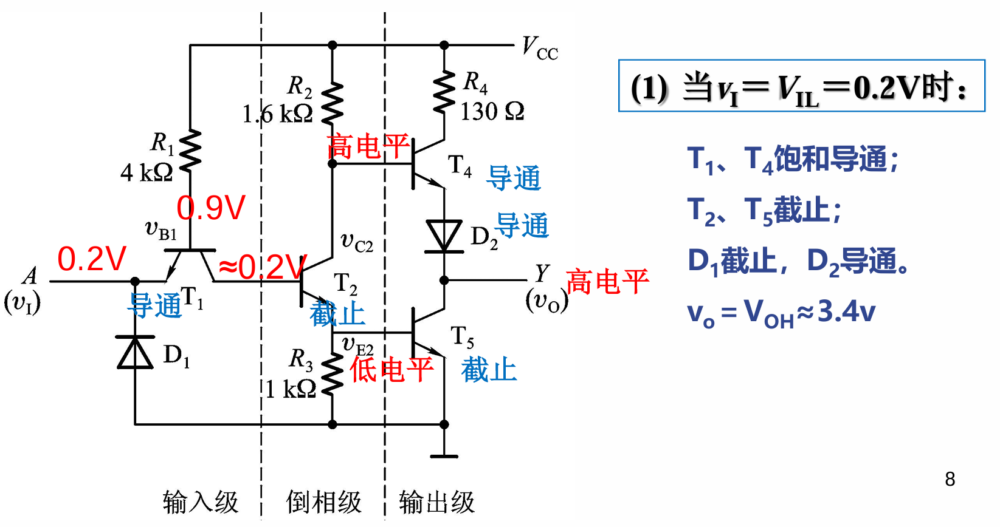
1.  **输入低电平（如 $v_I = 0.2V$） $\rightarrow$ 期望输出高电平**
    *   $T_1$ 的基极接电源（通过$R_1$），发射极接 $0.2V$，故 **$T_1$ 的b-e结正偏导通**。
    *   $T_1$ 的基极电压被钳位在 $V_{B1} = v_I + V_{ON} = 0.2 + 0.7 = 0.9V$。
    *   要使后级 $T_2$、$T_5$ 导通，$V_{B1}$ 至少需要 $0.7+0.7+0.7 = 2.1V$。目前 $0.9V$ 显然不够。
    *   因此，**$T_2$、$T_5$ 截止**。
    *   由于 $T_2$ 截止，其集电极电位升高，使 **$T_4$ 和 $D_2$ 导通**。
    *   **结论**：$T_4$ 导通、$T_5$ 截止 $\rightarrow$ 输出拉至电源 $\rightarrow$ **输出高电平 ($v_o \approx 3.4V$)**。
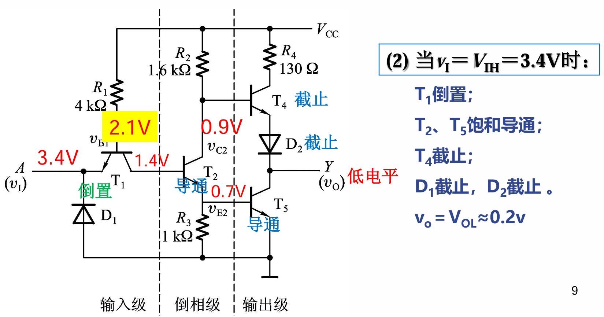
2.  **输入高电平（如 $v_I = 3.4V$） $\rightarrow$ 期望输出低电平**
    *   如果 $T_1$ 的b-e结仍然导通，则 $V_{B1} = 3.4 + 0.7 = 4.1V$。
    *   此时由于 $V_{CC}$ 电源通过 $R_1$ 提供电流，电流会优先流向集电结（bc结），因为导通 $T_2$、$T_5$ 只需要 $2.1V$。
    *   因此，$T_1$ 的集电结正偏，电流流入 $T_2$ 的基极，使得 **$T_2$ 和 $T_5$ 饱和导通**。
    *   $T_1$ 的基极电压被 $T_2, T_5$ 钳位：$V_{B1} = V_{BE2} + V_{BE5} + V_{BC1} = 0.7 + 0.7 + 0.7 = 2.1V$。
    *   此时 $T_1$ 的发射极电位 $3.4V > V_{B1}$ (2.1V)，所以 **$T_1$ 的b-e结实际上是反偏的**。*(这种发射结反偏、集电结正偏的状态称为 $T_1$ **倒置**)*。
    *   由于 $T_2$ 饱和导通，其集电极电位极低（约1V），不足以让 $T_4$ 和 $D_2$ 同时导通，故 **$T_4$、$D_2$ 截止**。
    *   **结论**：$T_4$ 截止、$T_5$ 饱和导通 $\rightarrow$ 输出被拉向地 $\rightarrow$ **输出低电平 ($v_o \approx 0.2V$)**。

#### 三、 TTL 反相器的电压传输特性
电压传输曲线分为四个区域：
1.  **AB段（截止区）**：输入低电平，输出高电平。
2.  **BC段（线性区）**：输入电压增大，$T_2$ 导通进入放大区，$T_5$ 仍截止。由于放大作用，输出电平随输入电平线性下降。
3.  **CD段（转折区）**：$T_2, T_5$ 均导通，$T_4$ 截止。输出电压迅速跳变为低电平（阈值电压 $V_{TH}$ 通常在 1.4V 左右）。
4.  **DE段（饱和区）**：输入继续增大，输出维持在低电平（约 0.2V）。

#### 四、 输入端噪声容限
与CMOS类似，允许输入信号在一定范围内波动而不影响逻辑输出。
典型 74 系列值：$V_{NH} = 0.4V, V_{NL} = 0.4V$。

---

### 3.4.3 TTL 反相器的静态特性

#### 一、 输入特性（输入电压与输入电流的关系）
*   **输入电流方向定义为从外往内**。
*   **输入低电平 ($V_I = 0.2V$) 时**：
    电流从电源 $V_{CC}$ $\rightarrow$ $R_1$ $\rightarrow$ $T_1$的发射极 $\rightarrow$ 外部信号源（地）。
    电流实际流出，故为**负值**，称为**输入短路电流 ($I_{IL} \approx -1mA$)**。
*   **输入高电平 ($V_I = 3.4V$) 时**：
    $T_1$ b-e 结反偏，倒置状态。只有极小的反向饱和电流流入输入端。
    电流实际流入，为**正值**，数值极小（$I_{IH} < 40\mu A$）。

#### 二、 输入端的负载特性
当输入端外接一个电阻 $R_P$ 到地时：
*   **低电平输入方式**：当 $R_P$ 很小（通常 $\le 0.7k\Omega$）时，相当于输入低电平。
*   **高电平输入方式**：当 $R_P$ 较大（通常 $\ge 1.5k\Omega$，或者悬空）时，相当于输入高电平。
> ⚠️ **注意点**：**TTL 门电路的输入端悬空相当于接高电平！** 这与 CMOS 门完全不同（CMOS 绝不允许悬空）。

#### 三、 扇出系数 (带负载能力) 🏋️‍♂️
定义为一个门电路能驱动同类门电路的个数。
*   **输出低电平时**：驱动门要**吸收**负载门的电流（灌电流）。$N_1 \le \frac{I_{OL(max)}}{|I_{IL}|}$
*   **输出高电平时**：驱动门要**提供**负载门的电流（拉电流）。$N_2 \le \frac{I_{OH(max)}}{I_{IH}}$
*   **最终扇出系数**：$N = \min(N_1, N_2)$。
*(示例：已知参数代入计算，得出扇出系数一般为10个左右)*。

### 3.4.5 其他类型的TTL门电路 🧩

与 CMOS 门电路类似，TTL 门电路也能通过内部结构的变形，实现除反相器之外的各种逻辑功能。

#### 一、 其他逻辑功能的TTL门电路

##### 1. TTL 与非门
*   **电路结构变化**：将反相器输入端的单发射极三极管 $T_1$，替换为**多发射极三极管**。发射极数量代表输入端数量（如 $A$、$B$）。
*   **工作原理**：
    *   只要 $A$、$B$ 中**有一个输入低电平 ($0.2V$)**：$T_1$ 对应发射结正偏导通。其基极电压被拉低至 $0.9V$。不足以让 $T_2$ 和 $T_5$ 导通，所以 $T_2, T_5$ 截止，输出级 $T_4$ 导通，**输出高电平**。
    *   只有 $A$、$B$ **同时为高电平 ($3.4V$)**：$T_1$ 倒置，电流流向基极使 $T_2, T_5$ 饱和导通，输出级 $T_4$ 截止，**输出低电平**。
*   **输入端特性注意**：
    *   **输入低电平**：电流从多发射极流出，**整个门只计算一份输入短路电流 $I_{IL}$** （通常为 $1mA$ 左右），因为只要一个管脚拉低，电流就主要从该管脚流走。
    *   **输入高电平**：**按输入端个数计算**，因为每个高电平端都有极小的反向漏电流 $I_{IH}$ 流入。

##### 2. TTL 或非门
*   **电路结构变化**：将中间的**倒相级晶体管 ($T_2$) 并联**，输入端各自用一个单发射极管 ($T_1$, $T_1'$) 驱动并联的 $T_2, T_2'$。
*   **工作原理**：
    *   因为 $T_2$ 和 $T_2'$ 并联，**只要 $A$、$B$ 任何一个为高电平**，对应的 $T_2$ 或 $T_2'$ 就会导通，进而使输出管 $T_5$ 导通，$T_4$ 截止，**输出低电平**。
    *   只有 $A$、$B$ **同为低电平**时，$T_2, T_2'$ 均截止，**输出高电平**。
*   **输入端特性注意**：
    *   无论是输入低电平还是高电平，因为是独立的输入结构，输入电流**都是单个输入端电流的倍数**。

##### 3. TTL 与或非门
*   **电路结构变化**：结合了上述两者。输入级用**多个多发射极管**（构成与逻辑），倒相级将**多个 $T_2$ 并联**（构成或逻辑）。

##### 4. TTL 异或门
*   **逻辑式**：$Y = A \oplus B = A'B + AB'$。利用特定的晶体管排布，实现相异为1，相同为0的逻辑。

---

#### 二、 集电极开路输出的TTL门电路（OC门） 🔌

与 CMOS 的 OD 门非常相似，TTL 电路中也有去掉推拉式结构上半部分的设计，称为 **OC 门 (Open Collector)**。

*   **为什么需要 OC 门？**
    普通的 TTL 推拉式输出端**绝对不能直接并联使用**。如果一个门输出高电平（内部 $T_4$ 导通接 $V_{CC}$），另一个输出低电平（内部 $T_5$ 导通接地），两者并联会形成极低阻抗的通路，导致极大的短路电流烧毁门电路。
*   **OC 门结构**：去掉了输出级的 $T_4$ 和 $D_2$，**$T_5$ 管的集电极处于开路状态**。
*   **使用方法**：**必须外接上拉电阻 $R_L$ 和电源 $V_{CC2}$**。
*   **功能应用**：
    1.  **实现线与**：将多个 OC 门的输出端直接相连，共用一个上拉电阻。只要有一个输出低电平，总线就是低电平。$Y = Y_1 \cdot Y_2 \dots$
    2.  **实现电平转换**：上拉电源 $V_{CC2}$ 可以不是标准的 5V，可以是 12V、24V 等，从而驱动高压负载。

##### 🛑 OC 门上拉电阻 $R_L$ 阻值计算 (极其重要)
计算逻辑与 CMOS OD 门完全一致，需满足下限和上限。
（设外接电源为 $V'_{CC}$，线与门个数为 $n$，负载门输入端个数为 $m$）

1.  **最大值 $R_{L(max)}$（确保高电平达标）**
    *   **最坏情况**：所有 OC 门全截止（输出高电平）。
    *   **限制条件**：高电平不能低于 $V_{OH(min)}$。
    *   $$ \boxed{ R_{L(max)} = \frac{V'_{CC} - V_{OH(min)}}{n \cdot I_{OH} + m \cdot I_{IH}} } $$
    *   *注：$I_{OH}$ 是每个截止 OC 门的漏电流（算 $n$ 份）；$I_{IH}$ 是每个负载门的高电平输入电流（按输入端算 $m$ 份）。*

2.  **最小值 $R_{L(min)}$（确保低电平不过载）**
    *   **最坏情况**：只有一个 OC 门导通（其他都截止），它要承受所有从 $R_L$ 灌入的电流以及负载门流出的电流。
    *   **限制条件**：灌入这只管子的总电流不能超过其允许的最大值 $I_{OL(max)}$。
    *   $$ \boxed{ R_{L(min)} = \frac{V'_{CC} - V_{OL(max)}}{I_{OL(max)} - m' \cdot |I_{IL}|} } $$
    *   *注：如果负载是 TTL **与非门**，并联端接低电平时，电流只流出一份，所以 $m'$ 为负载门的个数；如果负载是 TTL **或非门**，各输入端独立，$m'$ 为输入端总个数。*
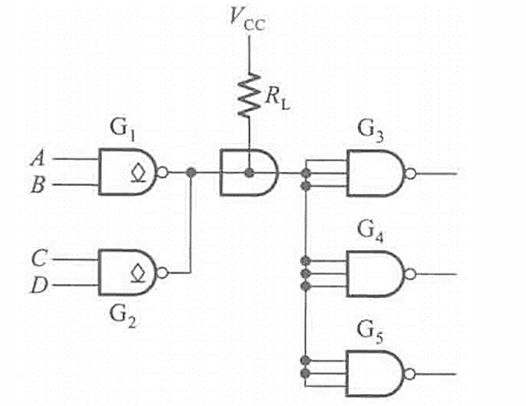
---

#### 三、 三态输出 TTL 门电路 (TS门) 🚦

*   **电路结构**：在普通与非门的基础上，增加了一个**使能端 $EN'$** 和一个控制二极管 $D$（或者利用多发射极的其中一个极）。
*   **工作原理（以低电平有效 $EN'$ 为例）**：
    1.  **当 $EN' = 0$ 时（正常工作）**：控制二极管 $D$ 截止，不影响后续电路。此时 TS 门相当于一个**普通的 TTL 与非门**，正常输出高低电平。
    2.  **当 $EN' = 1$ 时（高阻态）**：
        *   控制电流流入，迫使内部节点电位降低。
        *   二极管 $D$ 导通，把输出级推管 $T_4$ 的基极电压拉低（钳位在 $0.9V$ 左右），导致 **$T_4$ 截止**。
        *   同时，倒相级 $T_2$ 和输出级下管 **$T_5$ 也截止**。
        *   输出端上下管全截止，悬空断开，呈现**高阻态 (Z)**。
*   **应用**：同 CMOS 三态门，主要用于**数据总线共享**和**双向数据传输**。

---

## 🎯 本章学习总结

本章是数字逻辑的硬件基础，要求理解各种门电路的外部特性，不需要死记硬背内部电路图，但必须懂其**工作原理**和**应用计算**。

### 🔑 1. 两大门派对比：CMOS vs TTL
| 特性 | CMOS (互补金属氧化物半导体) | TTL (双极型晶体管) |
| :--- | :--- | :--- |
| **核心元件** | PMOS + NMOS 互补对 | 双极型晶体管 (BJT) |
| **功耗** | **极低**（静态几乎为0） | 较高（有静态电流） |
| **抗干扰能力** | 强（噪声容限大，可调） | 一般（噪声容限固定） |
| **输入端悬空** | **绝对禁止！** 易击穿损坏 | **相当于接高电平** (1) |
| **扇出受限因素**| **动态频率**（电容充放电） | **直流电流**（拉/灌电流） |
| **发展趋势** | 现代数字芯片绝对主流 | 逐渐被替代 |

### 🔑 2. 特殊门电路的三大天王
在数字系统设计中，除了普通的逻辑门，这三个特殊门必须掌握用法：
1.  **推拉式 (Totem-pole) / 互补输出**：
    *   绝大多数标准门的输出结构。
    *   **禁忌：输出端严禁直接并联！** 会短路烧毁。
2.  **开漏 (OD) / 开集 (OC) 门**：
    *   为了解决推拉式不能并联而生。去掉了上半截管子。
    *   **必做：必须外接上拉电阻 $R_L$。**
    *   **绝技：线与（线连在一起就是与逻辑）、电平转换**。
    *   *必考题：$R_L$ 阻值上下限的公式计算。*
3.  **三态门 (TS / Tri-state)**：
    *   有三种输出：高、低、**高阻态(Z)**。
    *   **必有：使能控制端 (EN)**。
    *   **绝技：总线复用、双向通信**。

### 🔑 3. 重要特性指标理解
*   **噪声容限**：信号波动的安全区。$V_{NH}$（高电平噪声容限）和 $V_{NL}$（低电平噪声容限）。
*   **扇出系数**：能带多少个“小弟”。计算时需要分别算高电平扇出和低电平扇出，取**最小值**。
*   **传输延迟**：任何门都不是瞬间反应的，存在 $t_{pd}$。多级门级联时，延迟会累加。

## 注意事项
### 1.上拉电阻的计算
计算集电极开路（OC门）或漏极开路（OD门）的**外接上拉电阻 $R_L$** 的阻值范围，是数字电子技术考试中极易出错的重点难点。

为了保证电路既能输出标准的高电平，又能在输出低电平时不烧毁内部管子，$R_L$ 必须满足：**$R_{L(min)} \le R_L \le R_{L(max)}$**。

以下是计算该范围时必须高度警惕的**核心注意事项**与**“避坑指南”**：

---

#### 一、 计算上限值 $R_{L(max)}$（确保高电平达标）

**1. 物理意义与最坏情况：**
*   **最坏情况**：线与在一起的**所有驱动门全截止**（打算输出高电平）。
*   **物理意义**：上拉电阻 $R_L$ 必须足够小，以便提供足够的电流（填补所有驱动门的漏电流 + 提供所有负载门的高电平输入电流），同时保证在 $R_L$ 上产生的压降不会把输出电平拉低到 $V_{OH(min)}$ 以下。

**2. 计算公式：**
$$ \boxed{ R_{L(max)} = \frac{V'_{CC} - V_{OH(min)}}{n \cdot I_{OH} + m \cdot I_{IH}} } $$

**3. ⚠️ 注意事项（参数取值）：**
*   **$V'_{CC}$**：指**外接的上拉电源电压**，不一定是芯片自身的工作电压 $V_{CC}$（因为OC门常用于电平转换）。
*   **$V_{OH(min)}$**：必须取代入题目给定的“**高电平最小允许值**”。
*   **$n$ 的取值**：线与在一起的**驱动门的总个数**。
*   **$m$ 的取值**：作为负载的**输入端总个数**。在高电平输入时，无论负载是与非门还是或非门，只要连了一个引脚，就要算一份 $I_{IH}$。

---

#### 二、 计算下限值 $R_{L(min)}$（确保低电平达标且不烧管）

**1. 物理意义与最坏情况：**
*   **最坏情况**：线与在一起的驱动门中，**只有 1 只管子导通**（其他全截止），打算输出低电平。
*   **物理意义**：上拉电阻 $R_L$ 必须足够大，以限制从电源灌入的总电流。这 1 只导通的管子，不仅要吃掉从 $R_L$ 流下来的电流，还要吃掉所有负载门反灌回来的低电平电流。总电流不能超过该管子的最大吸收电流 $I_{OL(max)}$。

**2. 计算公式：**
$$ \boxed{ R_{L(min)} = \frac{V'_{CC} - V_{OL(max)}}{I_{OL(max)} - m' \cdot |I_{IL}|} } $$

**3. ⚠️ 注意事项（参数取值）：**
*   **$V'_{CC}$**：同上。
*   **$V_{OL(max)}$**：必须取代入题目给定的“**低电平最大允许值**”。
*   **$I_{OL(max)}$**：查表或题目给定，这是那只“独挑大梁”导通的晶体管能承受的最大灌电流。
*   **核心易错点：负载门输入低电平电流 $m' \cdot |I_{IL}|$**。TTL 门电路的输入低电流 $I_{IL}$ 往往给的是**负值（表示流出）**，计算时务必取**绝对值**。

---

#### 三、 🛑 重点避坑总结：关于负载门个数的计算

这是失分重灾区！在计算 $R_{L(min)}$ 时，负载门向驱动门反灌的电流计算，与负载门的逻辑类型密切相关：

 陷阱一：负载为 **TTL与非门**（多发射极输入）
*   **高电平输入时（算 $R_{L(max)}$）**：每个输入引脚都会消耗微小的漏电流 $I_{IH}$，所以 **$m$ = 并联连接的所有输入端总数**。
*   **低电平输入时（算 $R_{L(min)}$）**：只要有一个输入引脚接低电平，内部电流就主要从这个引脚流出，其他引脚再接低电平，电流几乎不再增加。因此，如果把一个与非门的多个输入端并联在一起接驱动门，它**只反灌出相当于 1 个输入端的低电平电流 $I_{IL}$**。所以 **$m'$ = 并联连接的与非门的总个数**。

 陷阱二：负载为 **TTL或非门**（并联输入级）
*   **高电平输入时（算 $R_{L(max)}$）**：同上，每个输入端算 1 份，**$m$ = 输入端总数**。
*   **低电平输入时（算 $R_{L(min)}$）**：由于内部结构是各自独立的输入晶体管，每个引脚接低电平时，其对应的晶体管都会产生低电平输入电流。因此，哪怕是把一个或非门的多个引脚并联在一起，反灌出的电流也会**加倍**。所以 **$m'$ = 并联连接的输入端总数**。

 陷阱三：负载为 **CMOS门电路**
*   CMOS门电路输入阻抗极高，不管是高电平还是低电平，输入电流 $I_{IH}, I_{IL}$ 都在 pA 或 nA 级别。在一些简化的计算题中，往往可以近似忽略不计，计算大为简化。但在精确设计时，同样遵循公式计算。