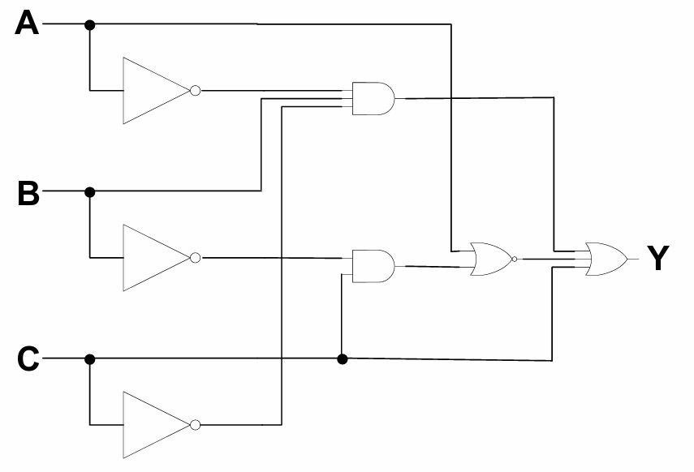
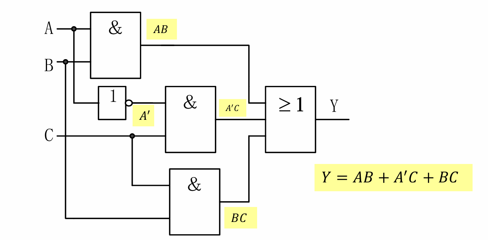
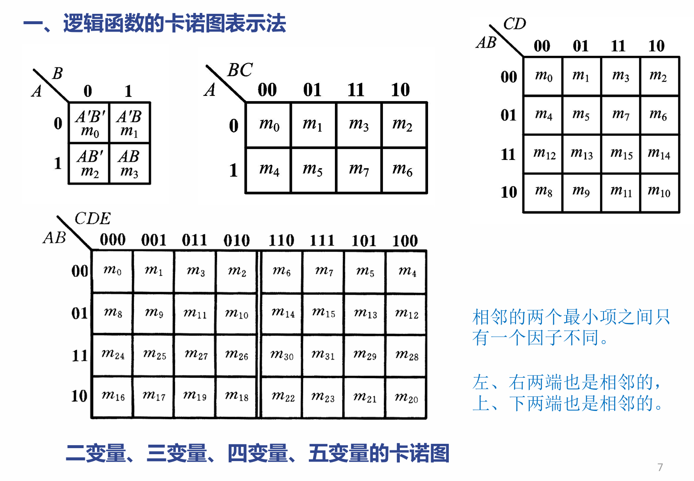

## 2.1 概述 📖

*   **二值逻辑**：只有两种对立状态的逻辑关系。如：对/错，好/坏，有/无，开/关等。
*   **逻辑运算**：当二进制数码“0”和“1”表示二值逻辑，并按指定的某种因果关系进行推理运算时，称为逻辑运算。（注意与算术运算区别）
*   **逻辑变量**：逻辑代数中用字母表示变量。

> ⚠️ **注意点：逻辑代数 vs 普通代数**
> *   **相似之处**：都有交换律、结合律、分配律等运算律。
> *   **本质区别**：普通代数变量取值范围广，有数值意义；而逻辑代数中变量的取值只有两个：“0”和“1”，并且**没有数值意义**，它只是表示事物的两种逻辑状态。

---

## 2.2 逻辑代数中的三种基本运算 ⚙️

在二值逻辑函数中，最基本的逻辑运算有三种。逻辑赋值通常用“1”表示开关闭合/灯亮，“0”表示开关断开/灯灭。

### 1. 与 (AND)
*   **逻辑关系**：当所有的条件都满足时，事件才会发生，即“**缺一不可**”。（类似开关串联）
*   **公式**：$$ \boxed{Y = A \cdot B} $$

### 2. 或 (OR)
*   **逻辑关系**：当其中一个条件满足时，事件就会发生，即“**有一即可**”。（类似开关并联）
*   **公式**：$$ \boxed{Y = A + B} $$

### 3. 非 (NOT)
*   **逻辑关系**：条件不具备时，事件发生。即“**黑白颠倒**”。
*   **公式**：$$ \boxed{Y = \overline{A}} \text{ 或 } Y = A' $$

---

## 🔗 复合逻辑运算

由基本逻辑运算组合实现的逻辑运算：

*   **与非 (NAND)**：$Y = \overline{A \cdot B}$
*   **或非 (NOR)**：$Y = \overline{A + B}$
*   **与或非 (AND-NOR)**：$Y = \overline{A \cdot B + C \cdot D}$
*   **异或**：当A、B取值**不同**时输出为1；相同时输出为0。
    $$ \boxed{Y = A \oplus B = A B' + A' B} $$
*   **同或**：当A、B取值**不同**时输出为0；相同时输出为1。
    $$ \boxed{Y = A \odot B = (A \oplus B)' = A B + A' B'} $$

> 💡 **异或的重要性质**：
> 1. $A \oplus A' = 1$
> 2. $A \oplus A = 0$
> 3. $A \oplus 1 = A'$
> 4. $A \oplus 0 = A$
> 
> 🌟 **多变量异或规律**：
> 当 $n$ 个变量做异或运算时，若有**偶数**个变量取“1”时，则函数为“**0**”；若**奇数**个变量取“1”时，则函数为“**1**”。

---

## 2.3 逻辑代数的基本公式和常用公式 🧮

### 1. 关于0和1的公式
*   $1' = 0$ ， $0' = 1$
*   $1 \cdot A = A$ ， $0 \cdot A = 0$
*   $1 + A = 1$ ， $0 + A = A$

### 2. 关于变量自身的公式
*   $A + A = A$ ， $A \cdot A = A$
*   $A' + A = 1$ ， $A' \cdot A = 0$
*   $(A')' = A$

### 3. 基本定律
*   **交换律**：$A + B = B + A$ ， $A \cdot B = B \cdot A$
*   **结合律**：$(A + B) + C = A + (B + C)$ ， $(A \cdot B) \cdot C = A \cdot (B \cdot C)$
*   **分配律**：
    *   $A(B + C) = AB + AC$
    *   $$ \boxed{A + BC = (A + B)(A + C)} $$ *(❗️这是普通代数中没有的，极易出错！)*
*   **反演律（德·摩根定理）**：
    *   $$ \boxed{(A \cdot B)' = A' + B'} $$
    *   $$ \boxed{(A + B)' = A' \cdot B'} $$

### 4. 若干常用公式 (吸收律等)
*   $A + A \cdot B = A$
*   $A + A'B = A + B$
*   $A \cdot B + A' \cdot C + BC = A \cdot B + A' \cdot C$

---

## 2.4 逻辑代数的基本定理 ⚖️

### 2.4.1 代入定理
在任何一个包含A的逻辑等式中，若以另外一个逻辑式代入式中A的位置，则等式依然成立。（德·摩根定理可以通过代入定理推广到任意多个变量）
*   **示例**：已知 $A + BC = (A + B)(A + C)$，以 $CD$ 代入 $C$ 的位置：
    $A + B(CD) = (A + B)(A + CD)$
    进一步展开：$= (A + B)(A + C)(A + D)$

### 2.4.2 反演定理
对于任意一个逻辑式 $Y$，主要用于求逻辑函数的**反函数 $Y'$**。
**规则（三换）**：
1.  “$\cdot$”换成“$+$”，“$+$”换成“$\cdot$”
2.  “$0$”换成“$1$”，“$1$”换成“$0$”
3.  原变量换成反变量，反变量换成原变量

> ⚠️ **易错点：反演运算的优先顺序**
> 1. 运算优先顺序不变（先括号、后乘、再加）。
> 2. **不属于单个变量上的反号保留不变**（即长非号保留）。

*   **示例**：求 $Y = ((A \cdot B' + C)' + D)' + C$ 的反函数 $Y'$
    根据反演定理可得：
    $$ Y' = (((A' + B) \cdot C')' \cdot D')' \cdot C' $$

### 2.4.3 对偶定理
对于任意一个逻辑式 $Y$，用于求其**对偶式 $Y^D$**。
**规则（两换一不换）**：
1.  “$\cdot$”换成“$+$”，“$+$”换成“$\cdot$”
2.  “$0$”换成“$1$”，“$1$”换成“$0$”
3.  **变量保持不变！**

**定理应用**：若两逻辑式相等，则它们的对偶式也相等。为证明两个逻辑式相等，可通过证明它们的对偶式相等来完成。
*   **示例**：
    式子：$Y = A \cdot (B + C)$ ，其对偶式：$Y^D = A + B \cdot C$
    式子：$Y = (A \cdot B + C \cdot D)'$ ，其对偶式：$Y^D = ((A + B) \cdot (C + D))'$

 🛑 **核心对比：反演定理 vs 对偶定理**
*   求反函数 ($Y'$)：运算符变，常量变，**变量也要变**。
*   求对偶式 ($Y^D$)：运算符变，常量变，**变量绝对不变**。

---

## 2.5 逻辑函数及其描述 📉

### 2.5.1 逻辑函数定义
以**逻辑变量**作为输入，以运算结果作为输出。当输入变量的取值确定后，输出的取值也随之而定。这种输出与输入之间的函数关系称为逻辑函数。
*   **二值逻辑函数**：输入变量和输出的取值都只有0和1两种状态。
    $$ Y = F(A_1, A_2, \dots, A_n) $$

**逻辑函数的四种基本描述方法**：
1.  逻辑函数式：将逻辑关系写成与、或、非等运算组合的代数式。
2.  逻辑真值表：将输入变量所有取值对应的输出值计算出来列成表格。
3.  逻辑图：将函数式中各变量的关系用图形符号表示出来。
4.  波形图（时序图）：将输入变量的每种可能取值与对应的输出值按时间顺序依次排列。

> 💡 **注意点**：如果面对形式不同、难以直观判断关系的两个逻辑函数式（如判断是否相等或相反），最直接有效的方法是列出它们的逻辑真值表进行比对！

---

### 2.5.2 各种描述方法间的相互转换 🔄

#### 1. 逻辑函数式 -> 逻辑真值表
*   **常规方法**：将输入变量所有组合（如000到111）逐一代入算式求解。
*   **🌟 推荐快捷方法（按“或”项分解）**：
    以式子 $Y = A + B'C + A'BC'$ 为例，这是一个“或”运算，只要其中**一个条件为1，整体输出 $Y$ 就为1**。
    1.  看第一项 $A$：当 $A=1$ 时（对应100, 101, 110, 111四行），$Y=1$。
    2.  看第二项 $B'C$：要求 $B=0$ 且 $C=1$ 时（对应001, 101，其中101已填），$Y=1$。
    3.  看第三项 $A'BC'$：要求 $A=0, B=1, C=0$ 时（对应010），$Y=1$。
    4.  剩余其他所有情况，$Y=0$。

#### 2. 逻辑真值表 -> 逻辑函数式
*   **步骤**：
    1.  找出真值表中使逻辑函数 **$Y=1$** 的那些输入变量取值的组合。
    2.  每组组合对应一个**乘积项**。
        $$ \boxed{ \text{规则：取值为1的写为原变量，取值为0的写为反变量} } $$
    3.  将这些乘积项进行“**或**”运算（相加）。
*   **示例**：真值表中 $Y=1$ 出现在 $011$、$101$、$110$ 三行。
    对应的乘积项分别为：$A'BC$、$AB'C$、$ABC'$。
    得出逻辑式：$Y = A'BC + AB'C + ABC'$

#### 3. 逻辑函数式 <-> 逻辑图
*   **式 -> 图**：用逻辑图形符号代替函数式中的运算符号，**严格按照运算优先顺序**逐级连接。
*   **图 -> 式**：从逻辑图的输入端到输出端，逐级写出每个图形符号的输出逻辑式，直到最末端。
    
    

#### 4. 波形图 <-> 逻辑真值表
波形图中高电平对应逻辑“1”，低电平对应逻辑“0”。在同一个时间区间内读取各输入变量和输出变量的高低电平，填入真值表即可。

---

### 2.5.3 逻辑函数的标准形式 🎯

为了方便化简以及计算机辅助设计，我们需要将逻辑函数化为标准形式，最常用的是标准与或式（也叫最小项之和式）。

#### 一、 什么是最小项？
在乘积项中，**所有变量均出现（以原变量或反变量的形式，且仅出现一次）**，这样的乘积项称为最小项。对于 $n$ 个变量，共有 $2^n$ 个最小项。

> ⚠️ **易错点：最小项的编号（二进制转化）**
> 将最小项转换为对应的二进制值并编序号：**若是以反变量出现则取0，以原变量出现则取1**。
> *示例（三变量A,B,C）*：
> $A'B'C' \rightarrow 000 \rightarrow m_0$
> $A'BC \rightarrow 011 \rightarrow m_3$
> $ABC \rightarrow 111 \rightarrow m_7$

#### 二、 最小项的四大重要性质
1.  对于任一个最小项，**仅有一组取值**使它的值为“1”，而其它所有取值均使它为“0”。
2.  **全体最小项之和为1**。 （即 $\sum m_i = 1$）
3.  **任意两个不同最小项的乘积为0**。 （即 $m_i \cdot m_j = 0, i \neq j$）
4.  **具有相邻性的两个最小项之和可以合并成一项并消去一对因子**。
    *   相邻定义：**仅有一个因子不同**的两个最小项。（例如 $A'BC$ 和 $ABC$ 相邻，相加后提取公因式变为 $BC(A'+A) = BC$）

#### 三、 化为标准与或式的方法
所有的逻辑函数都可以展开为若干个最小项相加的形式。
**目标**：将式子化为乘积和的形式，且**每一个乘积项都必须是“最小项”**。

**转换方法**：
*   **方法1：真值表法（万能但较慢）**
    画出真值表，找出所有 $Y=1$ 的行，直接写出对应的最小项并相加。
    如真值表中 0, 1, 3, 4, 6, 7 行输出为1，则可以直接写为：$$ \boxed{Y = \sum m(0,1,3,4,6,7)} $$
*   **方法2：代数配项法（利用 $X + X' = 1$）**
    如果乘积项中缺少某个变量，就乘以该变量的原变量与反变量之和。
    *   **示例**：将 $Y = AB + A'C + B'C'$ 化为标准与或式（三变量 A,B,C）
        第一项缺 C：$AB \cdot (C + C') = ABC + ABC'$
        第二项缺 B：$A'C \cdot (B + B') = A'BC + A'B'C$
        第三项缺 A：$B'C' \cdot (A + A') = AB'C' + A'B'C'$
        将所有项相加，去掉重复项（根据 $X+X=X$），最终得到：
        $Y = A'B'C' + A'B'C + A'BC + AB'C' + ABC' + ABC$
        转换为编号形式即为：$Y = \sum m(0,1,3,4,6,7)$

---

## 2.6 逻辑函数的化简 ✂️

### 化简的意义与标准
*   **化简的意义**：降低电路的复杂性，提高电路的可靠性，同时有效控制成本。
*   **化简的标准**：
    *   **最简与或式**：所含乘积项最少（加号最少），且每个乘积项中的因子也最少（字母最少）。
    *   **最简或与式**：所含和项最少，且每个和项中的相加项也最少。
    *   ⚠️ **注意区分**：“标准与或式”（包含了所有的最小项）与“最简与或式”（经过化简后的最短形式）是完全不同的概念。

---

### 2.6.1 公式化简法 🧮
**核心思想**：反复使用逻辑代数的基本公式和常用公式，消去函数中多余的乘积项和多余的因子。

**常用的化简技巧与公式**：
1.  **并项法**：$AB + AB' = A$ （消去变量 $B$）
2.  **吸收法**：$A + AB = A$
3.  **消因子法**：$A + A'B = A + B$
4.  **冗余项定律（配项法）**：$AB + A'C + BC = AB + A'C$ （$BC$ 是多余的）
5.  **恒等变换法**：有时为了化简，需要主动乘以 $(A + A') = 1$ 来“脑补”展开变量，然后再重新组合。

*   **示例（德·摩根定理化简）**：
    $$ Z = ((A + BC')' + D(E + F')')' $$
    设 $X = (A + BC')'$， $Y = D(E + F')'$，运用反演律 $\boxed{(X + Y)' = X' \cdot Y'}$：
    $$ Z = (A + BC')'' \cdot (D(E + F')')' $$
    双重非号抵消，并再次对后半部分使用德·摩根定理：
    $$ Z = (A + BC') \cdot (D' + (E + F')'') $$
    $$ \boxed{Z = (A + BC') \cdot (D' + E + F')} $$

---

### 2.6.2 卡诺图化简法 🗺️ (重点⭐)

公式化简法依赖经验，而**卡诺图（Karnaugh map）**提供了一种直观、系统的图形化简方法。

#### 一、 逻辑函数的卡诺图表示法
*   **定义**：将 $n$ 变量的每个最小项用一个小方块表示，并使逻辑相邻的最小项在几何位置上也相邻地排列起来。
*   ⚠️ **极易错点：卡诺图的变量排列顺序**
    卡诺图的表头变量排列**绝不是**按照二进制大小顺序（00, 01, 10, 11），而是必须按照**相邻性（格雷码规律）**排列：
    $$ \boxed{00, \quad 01, \quad \color{red}{11}, \quad \color{red}{10}} $$
    相邻的两个格子之间，**只有一个变量发生改变**。
*   **空间相邻性**：卡诺图在几何上是卷曲的。
    *   **左右两端**是相邻的。
    *   **上下两端**也是相邻的。
    *   （四角边缘的四个格子也是互相相邻的）。

#### 二、 如何画卡诺图？
将逻辑函数化为最小项之和的形式（或者“脑补”分解成最小项），然后在卡诺图上对应的最小项位置填入 `1`，其余位置填入 `0`（0通常为了简洁可省略不写）。

#### 三、 用卡诺图化简成“最简与或式”的规则（⭕ 圈1规则）
卡诺图化简的核心原理是：**任何 $2^n$ 个标“1”的相邻最小项，可以合并成一项，并消去 $n$ 个取值不同的变量。**

执行“圈1”时，必须严格遵循以下原则：
1.  **圈的数量要求**：圈内的 “1” 的个数必须是 $\boxed{2^n}$ 个（即 1, 2, 4, 8, 16...个）。
2.  **贪心原则**：每个圈包含的 “1” 的个数要**尽可能多**（圈越大，消去的变量越多）。
3.  **精简原则**：圈的总数要**尽可能少**（圈越少，最后的乘积项越少）。
4.  **全覆盖原则**：要圈完卡诺图上所有的 “1”。
5.  **重叠原则**：“1”可以被重复圈，但**每次画一个新圈时，必须至少包含一个之前没被圈过的“1”**。
6.  **形状原则**：圈必须是**矩形**（正方形或长方形）。

 💡 **卡诺图化简注意点**：
 *   化简结果可能**不唯一**（如果有不同的、等效的圈法），但它们实现的最简逻辑功能是完全相同的。
 *   如果四个角落都有 `1`，可以将四个角圈成一个包含4个 `1` 的大圈。
 *   写出圈对应的乘积项时，只需观察这个圈覆盖的区域内，**哪个变量的值没有发生改变**，就保留该变量（取1写原变量，取0写反变量）；发生改变的变量直接消去。

---

## 🎯 本章学习总结

本章是数字电子技术的基础数学工具，整个章节围绕**“如何用数学公式描述电路，以及如何将电路化到最简”**展开。请重点掌握以下四大板块：

### 1. 概念与基本运算 🛠️
*   **二值逻辑**：所有变量只有 `0` 和 `1` 两种状态，没有数值大小意义。
*   **基本运算**：与（乘 $\cdot$ ）、或（加 $+$）、非（反 $'$）。
*   **复合运算**：与非、或非、与或非，以及极其重要的**异或**（相异为1）和**同或**（相同为1）。

### 2. 定理与公式 📜
*   **特殊分配律**：$A + BC = (A+B)(A+C)$，这与普通代数不同，必须刻在脑子里。
*   **三大基本定理**：
    *   代入定理：变量可被表达式整体替换。
    *   反演定理：求反函数（$Y'$）。长非号保留，符号全变，变量全变。
    *   对偶定理：求对偶式（$Y^D$）。符号全变，**变量绝对不变**。用于证明等式。

### 3. 逻辑函数的描述与标准形式 📊
*   **四种描述转换**：函数式、真值表、逻辑图、波形图之间可以互相无缝转换。真值表是最底层的检验标准。
*   **最小项（$m_i$）**：包含所有变量的乘积项。记住口诀：“**原变量为1，反变量为0**”对应其二进制编号。
*   **标准与或式**：即所有使函数为1的最小项相加（$\sum m_i$）。

### 4. 逻辑函数的化简 ✂️
*   **目标**：化为最简与或式，降低硬件成本。
*   **卡诺图化简法**：
    *   画图必须按照**相邻性（00, 01, 11, 10）**排列。
    *   “圈1”时要“**圈大、圈少、可重叠、必包新**”，数量必须是 $2^n$ 个。
    *   利用卡诺图的“上下相连、左右相卷”的特性去寻找相邻的 `1`。