## 5.1 概述 🌟

在学习本章前，需要明确**组合逻辑电路**与**时序逻辑电路**的本质区别：
*   **组合逻辑电路**：任意时刻的输出仅取决于该时刻的输入，与电路原来的状态无关。不含记忆元件。
*   **时序逻辑电路**：包含记忆元件，本章的主角即为最基本的记忆元件。

### 存储电路的基本概念
存储电路的基本功能是存储各种数据和信息，根据规模和结构可分为三类：
1.  **触发器**：能够存储**1位二值信号**的基本单元电路。
2.  **寄存器**：存储**一组数据**的电路，结构为一组具有公共时钟信号输入端的触发器。
3.  **存储器**：存储**大量数据**的电路，基本结构由存储矩阵和读/写控制电路组成。

---

## 5.2 SR锁存器 (SR Latch) 🔒

**SR锁存器**（又叫基本SR触发器）是构成各种触发器的基本单元，也是电路结构最简单的一种触发器。
*   **特点**：输入信号直接作用在触发器上，**无需触发（时钟）信号**。
*   **端口命名**：$S$ 代表 Set（置位，使 $Q=1$）；$R$ 代表 Reset（复位，使 $Q=0$）。

### 1. 工作原理（以或非门构成的交叉耦合电路为例）
*输入无圈圈，表示高电平有效。*
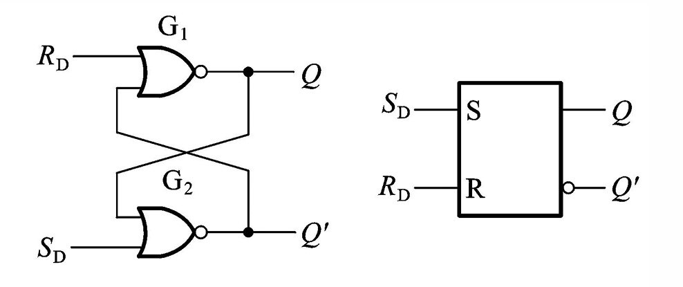
*   **(1) 当 S=1，R=0 时**：
    推导：$S=1 \Rightarrow Q'=0 \Rightarrow$ 结合 $R=0$，得出 $Q=1$。
    此为锁存器的 1状态（置1）。
*   **(2) 当 S=0，R=1 时**：
    推导：$R=1 \Rightarrow Q=0 \Rightarrow$ 结合 $S=0$，得出 $Q'=1$。
    此为锁存器的 0状态（置0）。
*   **(3) 当 S=1，R=1 时**：
    推导：$S=1 \Rightarrow Q'=0$；$R=1 \Rightarrow Q=0$。
    正常情况下 $Q$ 和 $Q'$ 必须互反，此时两者皆为0，此为锁存器的 禁止态。
*   **(4) 当 S=0，R=0 时（撤销有效信号）**：
    此时需要看 $Q$ 和 $Q'$ 原来的状态（现态）。
    经过推导（$0$ 和原状态作或非），得出新状态（次态）完全保持原样：$Q^* = Q$。
    这就是所谓的 锁存 功能，即有效信号撤掉后，输出端的状态维持不变。此为 保持态。

 💡 **易错点提醒**：
 如果 $S$ 和 $R$ 从 $1, 1$ **同时**撤掉变成 $0, 0$，由于两个或非门内部动作快慢的微小差异，锁存器的新状态将**无法确定**（可能全0，也可能1/0，随机）。因此，**禁止 S 和 R 同时有效**。
 约束条件公式：
 $$ \boxed{S \cdot R = 0} $$

### 2. 特性表（功能表）

| $S$ | $R$ | 现态 $Q$ | 次态 $Q^*$ | 锁存器状态                  |
| :-: | :-: | :----: | :------: | :--------------------- |
|  0  |  0  |  0/1   |   0/1    | **保持** ($Q^* = Q$)     |
|  0  |  1  |  0/1   |    0     | **置0**                 |
|  1  |  0  |  0/1   |    1     | **置1**                 |
|  1  |  1  |  0/1   |    0     | **禁止** ($Q=Q'=0$，次态不定) |

### 3. 另一种结构：与非门构成的SR锁存器
由一对与非门交叉耦合组成，输入端有圈圈，代表**低电平有效**（输入标记为 $S'$ 和 $R'$）。
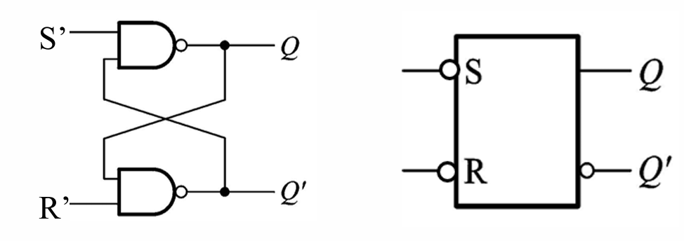
*   **状态逻辑**：
    *   $S'=1, R'=1 \Rightarrow$ **保持**
    *   $S'=0, R'=1 \Rightarrow$ **置1**
    *   $S'=1, R'=0 \Rightarrow$ **置0**
    *   $S'=0, R'=0 \Rightarrow$ **禁止**（约束条件：$S'+R'=1$）

---

## 5.3 触发器 (Flip-flops) ⏱️

为了控制状态翻转的时间，相比于SR锁存器，增加了一个触发信号，即 （CLOCK，记为 **CLK**）。

触发器具有两个重要属性：
1.  **逻辑功能**：SR触发器、JK触发器、D触发器、T触发器。
2.  **触发方式**：电平触发、脉冲触发、边沿触发。

---

### 5.3.1 电平触发的触发器

#### 一、 电平触发 S-R 触发器
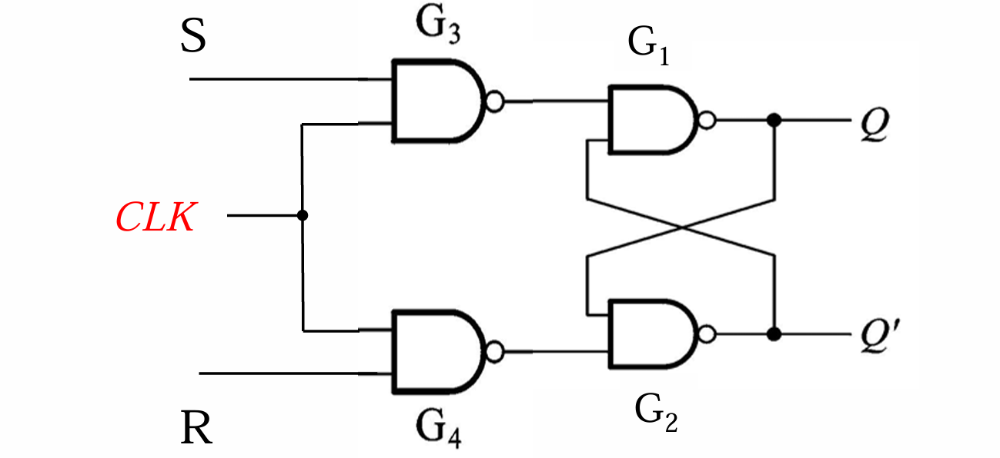
**电路结构**：在 SR 锁存器前面加上两个与非门作为控制门，由 CLK 控制。
*   **当 CLK = 0 时**：
    前面的控制门被封锁，输出恒为高电平。后面的锁存器相当于输入 $1, 1$（低电平有效锁存器的保持条件），触发器**保持原态** ($Q^* = Q$)。
*   **当 CLK = 1 时**：
    控制门开启，$S$ 和 $R$ 经过反相后作用于后面的锁存器。此时功能与普通的 SR 锁存器完全一致。

> 📌 **注意点**：
> 因为内部加了两个与非门，外接的输入 $S$ 和 $R$ 经过了两次反相，所以输入又变回了**高电平有效**。

**带异步置位/复位端的电平触发器**：
有时我们需要在 CLK 信号到来之前预置状态，此时可以使用异步置位/复位端 ($S'_D$ 和 $R'_D$)。
*   带圈圈表示低电平有效。
*   **若不用此端时，应接高电平**（防止意外干扰清零或置位）。

#### 二、 电平触发 D 触发器
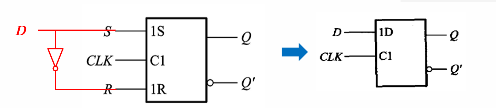
为了适应单端输入信号的需要，避免出现 SR 触发器中的“禁止态”，将 $S$ 端接 $D$，$R$ 端接 $D$ 的反相器。
*   **功能**：在 CLK 为高电平期间，**$Q$ 始终跟随 $D$ 的状态**。
*   **特性**：无禁止态，仅有置0和置1功能。

#### 三、 电平触发 JK 触发器
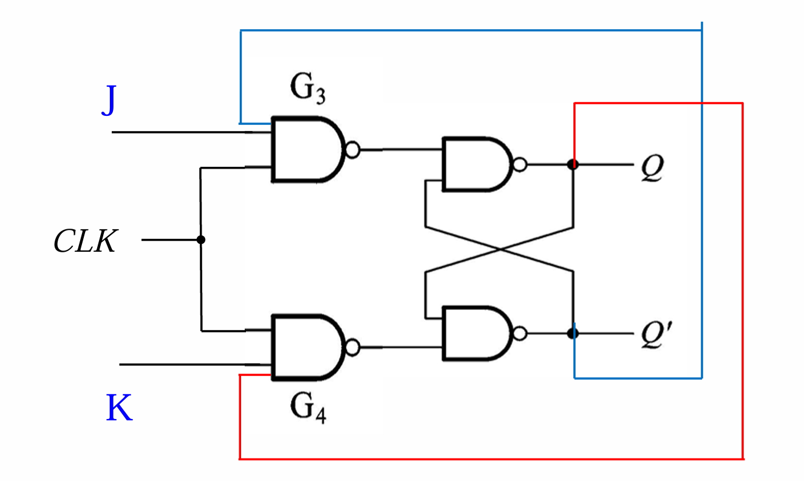
为了保留 SR 触发器的“保持”功能，同时彻底解决“禁止态”下输出不确定的问题，引入了从输出端到输入端的**交叉反馈**连线。
*   **工作原理**（当 CLK = 1 时）：
    *   只要 $J=1, K=0$，次态必被**置1**。
    *   只要 $J=0, K=1$，次态必被**置0**。
    *   当 $J=0, K=0$ 时，触发器**保持**原样不动。
    *   当 $J=1, K=1$ 时，利用输出的反馈限制，次态必然与现态相反，实现 翻转 功能。
    翻转公式：
    $$ \boxed{Q^* = \overline{Q}} $$

#### ⚡ 电平触发方式的动作特点与致命弱点
所有电平触发的触发器（无论是SR, D还是JK）都有一个共同的动作特点：
**在时钟 CLK 处于有效电平（高或低）的整个期间，输出 $Q$ 的状态都可以随输入的改变而改变。**

> ⚠️ **典型考点与易错点（波形图描绘）**：
> 在画波形图时必须注意：如果在一个 CLK 高电平期间内，输入信号（如 $D$ 或 $J,K$）发生了多次变化，那么输出 $Q$ 也会**跟着发生多次翻转**。这种现象被称为“空翻”（虽然课件未直接用此词，但例2明确指出了“*在一个高电平期间，输出状态翻转了多次*”）。
> 时钟信号无效时，触发器状态才会彻底锁死不改变。

---
### 5.3.2 脉冲触发的触发器

1. 脉冲触发的SR触发器
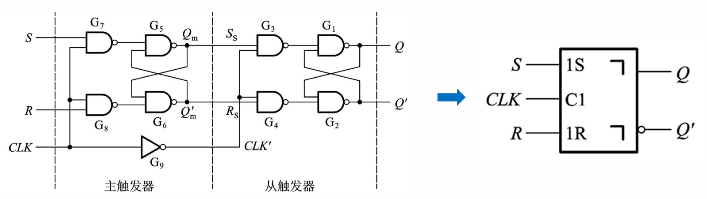
- **电路结构**：由两个电平触发的SR触发器（分别称为主触发器和从触发器）加上一个非门组成 。
    
- **工作原理**：
    
    - **第一步（$CLK=1$ 时）**：主触发器正常工作，根据输入端S、R的值变化；从触发器被时钟信号封锁，输出端保持不变 。
        
    - **第二步（$CLK=0$ 时）**：主触发器被封锁，输出端不变；从触发器正常工作，根据主触发器的输出状态进行变化 。
        
- **特性表与约束条件**：其逻辑功能与基本SR触发器相同（包含保持、置0、置1、不定态），约束条件为 $\boxed{SR=0}$ 。在 $CLK$ 的一个周期内，触发器的输出状态只改变一次，状态改变发生在时钟脉冲结束时（下降沿） 。
    

> ⚠️ **易错点提醒**： 在脉冲触发的SR触发器中，不能仅仅根据 $CLK$ 下降沿到来时刻输入端S和R的状态来确定输出端Q的状态，而**必须考察全部 $CLK=1$ 期间主触发器状态的变化情况** 。

- **波形分析示例**：
    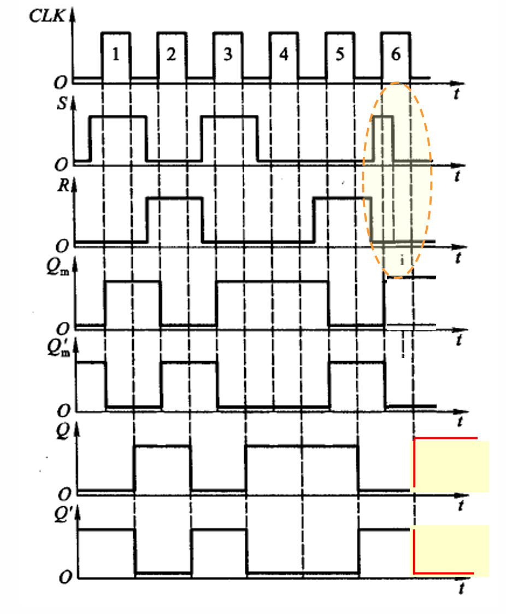
    - 假设初态为0。如果在某一个脉冲周期内（例如第6个脉冲），S和R经历了：置1 $\rightarrow$ 保持 $\rightarrow$ 置0，最后停在“置0”的状态，那么在该脉冲结束时，从触发器接收到的就是“置0”指令，最终 $Q^*=0$ 。
        

2. 脉冲触发的JK触发器
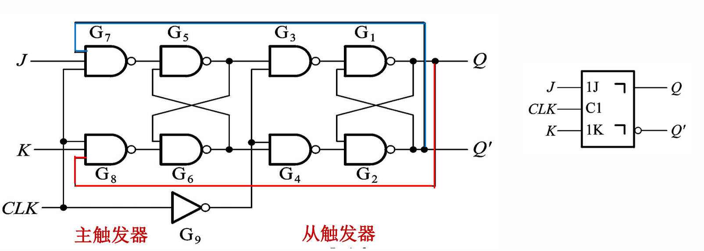
- **电路结构**：在脉冲触发的SR触发器基础上引入反馈，将输出 $Q$ 和 $Q'$ 分别连回输入端的与门 。
    
- **工作原理**：分为 $CLK=1$（主工作、从锁定）和 $CLK=0$（主锁定、从工作）两步，与脉冲触发的SR触发器相似 。
    
- **动作特点（一次翻转现象）**：
    
    - 当 $Q=1, Q'=0$ 时：J输入被封锁无效。只有K的输入影响主触发器，主触发器要么保持，要么置0 。
        
    - 当 $Q=0, Q'=1$ 时：K输入被封锁无效。只有J的输入影响主触发器，主触发器要么保持，要么置1 。
        
    - **结论**：根据 $Q$ 和 $Q'$ 的现状态，主触发器的输入J和K总有一个被封锁 。这导致主触发器的状态要么不变，要么翻转一次，绝对不可能出现“翻来覆去”的情况 。
        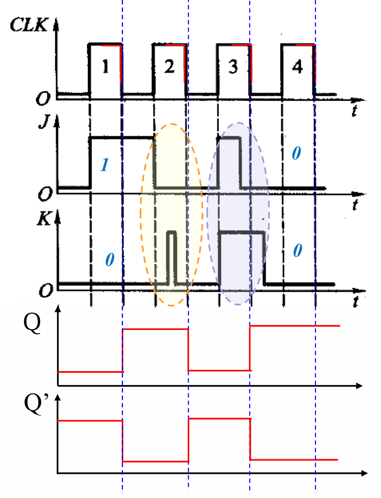
- **特性表**：具有保持（$J=0, K=0$）、置0（$J=0, K=1$）、置1（$J=1, K=0$）和翻转（$J=1, K=1$）功能 。
    

---

### 5.3.3 边沿触发的触发器

1. 边沿触发的D触发器
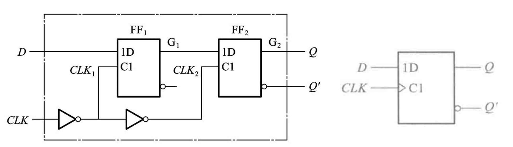
- **电路结构**：由两个D触发器级联组成 。
    
- **工作原理**：
    
    - 当 $CLK=0$ 时：触发器状态不变 。
        
    - 当 $CLK$ 从0变为1时：输出 $Q$ 的状态被置成**前沿到来之前的D的状态**，而与其他时刻D的状态无关 。
        
- **逻辑功能**：输出 $Q$ 始终跟随输入 $D$ 的状态 。
    

> 💡 **核心注意点**： 表面上看，脉冲触发和边沿触发的状态变化时刻都在时钟边沿，但原理完全不同。边沿触发的触发器输出 $Q$ 的状态**仅仅取决于**边沿到达前输入端的状态，而与其它时刻的状态无关 。而脉冲触发必须考察整个高电平期间的变化 。

2. 边沿触发的JK触发器

- **触发条件**：只有在 $CLK$ 的有效边沿（上升沿或下降沿）到达时，$Q$ 和 $Q'$ 的状态才会发生改变 。
    
- **符号识别**：逻辑符号中的“>”符号代表 边沿触发。如果没有小圆圈，表示上升沿触发；如果有小圆圈，则表示下降沿触发 。
    
- **逻辑功能**：
    
    - $J=0, K=0$：状态保持 。
        
    - $J=0, K=1$：状态置0（$Q=0, Q'=1$） 。
        
    - $J=1, K=0$：状态置1（$Q=1, Q'=0$） 。
        
    - $J=1, K=1$：状态翻转 。
        

3. 边沿触发的T触发器

- **引出**：在某些场合下，需要输入为1时状态翻转，输入为0时状态保持。只要把JK触发器的两个输入端并联（即 $J=K=T$），即可得到T触发器 。
    
- **工作原理**：
    
    - 当 $T=0$ 时：相当于 $J=0, K=0$，触发器状态保持 。
        
    - 当 $T=1$ 时：相当于 $J=1, K=1$，触发器状态翻转 。
        
- **典型应用（二分频）**：如果让T输入固定为高电平，则每一次时钟上升沿 $Q$ 都要发生翻转。此时输出 $Q$ 的频率和 $CLK$ 频率之比为 $\boxed{1:2}$ 。
    

---

📌 触发器逻辑功能和触发方式小结

逻辑功能和触发方式是触发器的两个重要属性 。

- **按逻辑功能分类**：
    
    - **SR触发器**：具备置1、置0、保持、禁止功能 。
        
    - **JK触发器**：具备置1、置0、保持、翻转功能 。
        
    - **D触发器**：输出 $Q$ 跟随输入 $D$ 。
        
    - **T触发器**：具备保持、翻转功能 。
        
- **按触发方式分类**：
    
    - **电平触发**：在时钟处于有效电平的整个期间，输出可随输入改变。其它时刻锁死不变 。
        
    - **脉冲触发**：主/从触发器轮流工作；在时钟脉冲结束时状态才变化。由于反馈线存在，JK触发器具有“一次翻转”特点 。
        
    - **边沿触发**：只在时钟的上升沿（或下降沿）到达的瞬间，状态才会改变。其它时刻锁死不变 。
        

---

### 5.3.4 触发器按逻辑功能的分类

逻辑功能和触发方式是触发器的两个重要属性 。**注意：逻辑功能和触发方式并不是一一对应的** 。 同一个逻辑功能的触发器（例如SR触发器、JK触发器或D触发器）可以由不同的触发方式（电平触发、脉冲触发、边沿触发）来实现 。

描述触发器逻辑功能的方式主要有三种 ：

1. **特性表**
2. **特性方程**
3. **状态转换图**

---

#### 1. SR触发器

**定义**：凡是在时钟信号作用下，逻辑功能符合SR特性表的，无论触发方式如何，均称为SR触发器 。

- **特性表**：
    
    - $S=0, R=0$ $\rightarrow$ 状态保持 ($Q^* = Q$)
        
    - $S=0, R=1$ $\rightarrow$ 置0 ($Q^* = 0$)
        
    - $S=1, R=0$ $\rightarrow$ 置1 ($Q^* = 1$)
        
    - $S=1, R=1$ $\rightarrow$ 不定态 ($Q^* = 1^*$)
        
- **特性方程**：
    
    $\boxed{\begin{cases} Q^* = S + R'Q \\ SR = 0 \end{cases}}$
    
- **状态转换图**：
    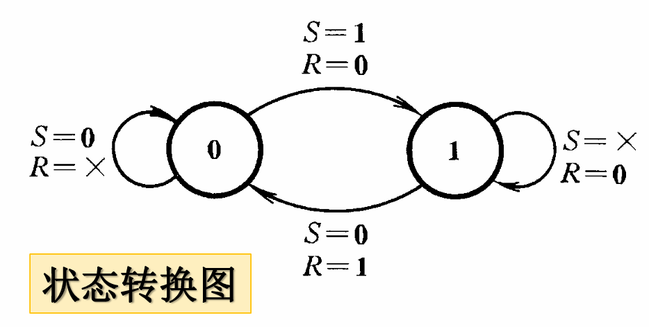
    $Q=0$ 时：若 $S=0, R=\times$，则保持为 0；若 $S=1, R=0$，则转换为 1 。 $Q=1$ 时：若 $S=\times, R=0$，则保持为 1；若 $S=0, R=1$，则转换为 0 。
    

> ⚠️ **约束条件提醒**： SR触发器必须遵守 $SR=0$ 的约束条件，即 S 和 R 不能同时为 1 。

---

#### 2. JK触发器

**定义**：凡是在时钟信号作用下，逻辑功能符合JK特性表的，无论触发方式如何，均称为JK触发器 。

- **特性表**：
    
    - $J=0, K=0$ $\rightarrow$ 状态保持 ($Q^* = Q$)
        
    - $J=0, K=1$ $\rightarrow$ 置0 ($Q^* = 0$)
        
    - $J=1, K=0$ $\rightarrow$ 置1 ($Q^* = 1$)
        
    - $J=1, K=1$ $\rightarrow$ 状态翻转 ($Q^* = Q'$)
        
- **特性方程**：
    
    $\boxed{Q^* = JQ' + K'Q}$
    
- **状态转换图**：
    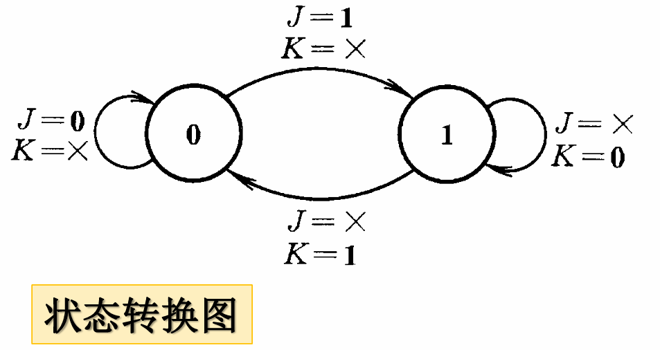
    $Q=0$ 时：若 $J=0, K=\times$，则保持为 0；若 $J=1, K=\times$，则转换为 1 。 $Q=1$ 时：若 $J=\times, K=0$，则保持为 1；若 $J=\times, K=1$，则转换为 0 。
    

---

#### 3. D触发器

**定义**：凡是在时钟信号作用下，逻辑功能符合D特性表的，无论触发方式如何，均称为D触发器 。

- **特性表**：
    
    - $D=0$ $\rightarrow$ $Q^* = 0$
        
    - $D=1$ $\rightarrow$ $Q^* = 1$
        
- **特性方程**：
    
    $\boxed{Q^* = D}$
    
- **状态转换图**： 不论现态是 0 还是 1，次态 $Q^*$ 完全由输入 $D$ 决定（跟随D） 。
    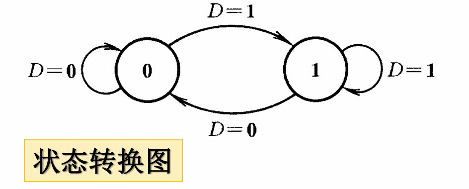

---

#### 4. T触发器

**定义**：凡是在时钟信号作用下，逻辑功能符合T特性表的，无论触发方式如何，均称为T触发器 。

- **特性表**：
    
    - $T=0$ 时：时钟边沿到达时触发器状态不变 ($Q^* = Q$) 。
        
    - $T=1$ 时：时钟边沿（上升沿或下降沿）到达时触发器状态翻转一次 ($Q^* = Q'$) 。
        
- **特性方程**：
    
    $\boxed{Q^* = TQ' + T'Q}$
    
- **状态转换图**：
    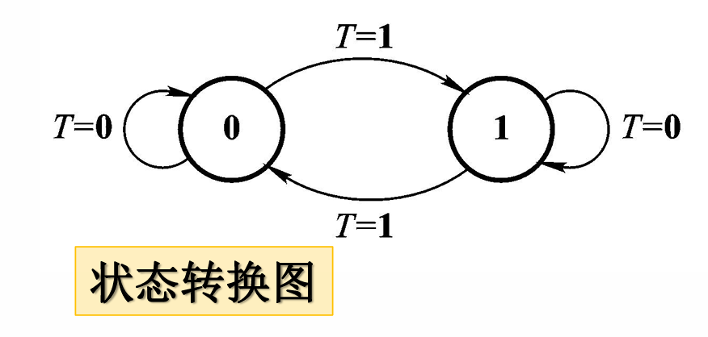
    $T=0$ 时，0 保持为 0，1 保持为 1；$T=1$ 时，0 变为 1，1 变为 0 。
    
- **实现方式**： T触发器无专用电路，可由JK触发器实现，只需将 J 和 K 并联即可（$T=J=K$） 。
    

---

#### 💡 扩展：用JK触发器构成其他触发器
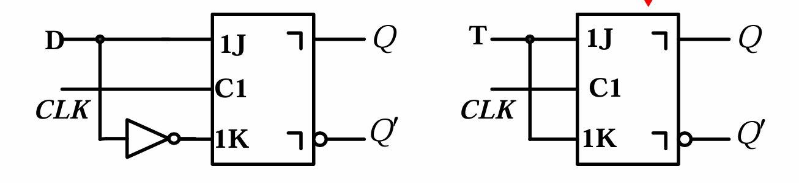
- **构成D触发器**：令 $J=D, K=D'$ 。推导过程：$Q^* = JQ' + K'Q = DQ' + (D')'Q = DQ' + DQ = D(Q' + Q) = D$ 。
    
- **构成T触发器**：令 $J=K=T$ 。推导过程：$Q^* = JQ' + K'Q = TQ' + T'Q$ 。
    

---

#### 📌 带异步复位和置位端的触发器

除了时钟和数据输入，有些触发器带有异步控制端，它们**不需要等待时钟信号，立刻生效** ：

- **$S'$ (Set) 置位端**：使 $Q=1, Q'=0$ 。
    
- **$R'$ (Reset) 复位端**：使 $Q=0, Q'=1$ 。
    
- **有效电平判定**：引脚上有小圈圈代表低电平有效，无小圈圈代表高电平有效 。
    

波形图分析时，一旦 $S'$ 或 $R'$ 有效，触发器输出立刻改变，不管此时的时钟状态。

---
## 5.4 半导体存储器概述
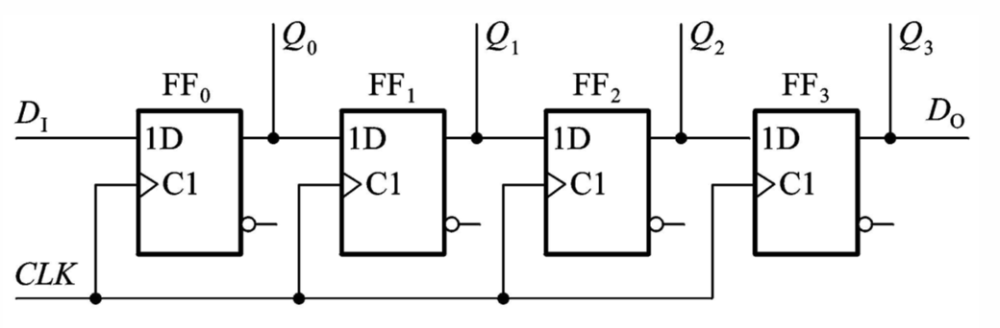
触发器和锁存器只能存储1位（1 bit）的二进制信息，而在实际的数字系统中，通常需要存储大量的数据。这就需要用到**半导体存储器**。

- **基本结构**：通常由**存储矩阵**（Memory Matrix）、**地址译码器**（Address Decoder）和**读/写控制电路**三部分组成。
    
- **存储容量**：衡量存储器能装多少数据的指标，通常用“字数 $\times$ 位数”来表示。
    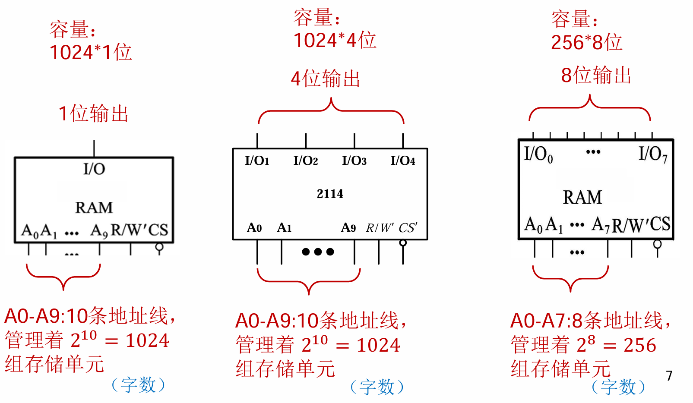
    - 公式：$\boxed{Capacity = 2^n \times m}$
        
    - 其中，$n$ 是地址线的根数（决定了有多少个字），$m$ 是数据线的根数（决定了每个字有多少位）。
        

> 💡 **注意点**：如果题目说有 10 根地址线和 8 根数据线，那么存储容量就是 $2^{10} \times 8 = 1024 \times 8$ bit（即 1KB）。

---

## 5.5 只读存储器 (ROM)

ROM (Read-Only Memory) 正常工作时只能读出数据，不能随时写入。

- **核心特点**：掉电后数据 不丢失（属于非易失性存储器）。
    
- **内部结构**：可以看作是由一个**与门阵列**（作为地址译码器）和一个**或门阵列**（作为存储矩阵）组成的组合逻辑电路。
    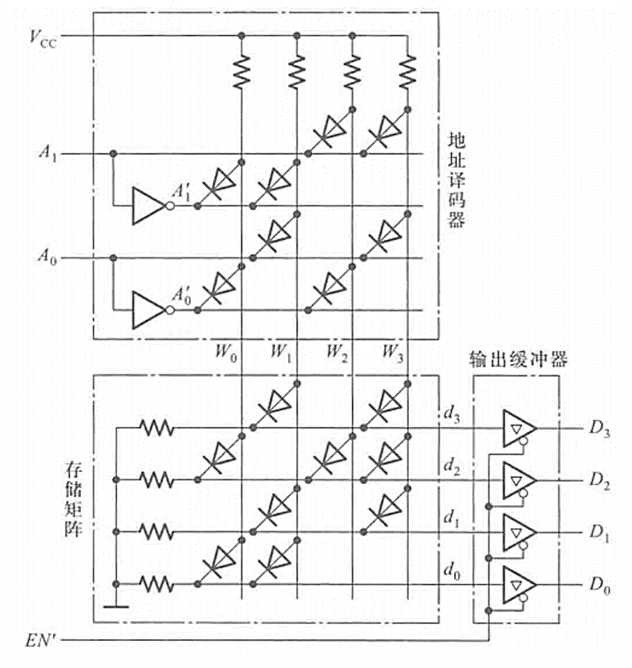
- **ROM 的分类**：
    
    1. **掩膜ROM (Mask ROM)**：出厂时数据已固化，不可更改。
        
    2. **可编程ROM (PROM)**：用户只能进行一次写入操作。
        
    3. **可擦除可编程ROM (EPROM)**：用紫外线擦除，可多次改写。
        
    4. **电可擦除可编程ROM (EEPROM/E²PROM)**：用电信号擦除，更加方便。
        
    5. **闪存 (Flash Memory)**：目前U盘、固态硬盘(SSD)的主流技术，擦写速度快，集成度高。
        

---

## 5.6 随机存取存储器 (RAM)

RAM (Random Access Memory) 正常工作时既可以快速读出数据，也可以快速写入数据。

- **核心特点**：掉电后数据会 丢失（属于易失性存储器）。
    
- **RAM 的分类**（根据存储原理不同）：
    
    1. **静态RAM (SRAM)**：
        
        - **原理**：利用双稳态触发器（由交叉耦合的逻辑门构成）来锁存信息。
            
        - **特点**：只要不断电，数据就能一直保持。读写速度极快，但集成度相对较低，成本较高（常用于 CPU Cache）。
            
    2. **动态RAM (DRAM)**：
        
        - **原理**：利用栅极电容上是否存储电荷来表示“1”或“0”。
            
        - **特点**：因为电容会漏电，所以必须进行 定时刷新 才能保持数据。集成度极高，单价便宜（常用于电脑的主内存条）。
            

> ⚠️ **易错点提醒**：
> 
> SRAM 和 DRAM 虽然都是断电丢失数据，但 **DRAM 在不断电的情况下也需要周期性刷新**，否则数据一样会因为电容漏电而丢失。不要把“掉电丢失”和“需要刷新”混为一谈。

---

## 5.7 存储器容量的扩展

当单片存储芯片的容量无法满足设计需求时，需要将多片存储器组合起来进行扩展。主要有以下两种方式：

- **1. 位扩展（增加字长）**
    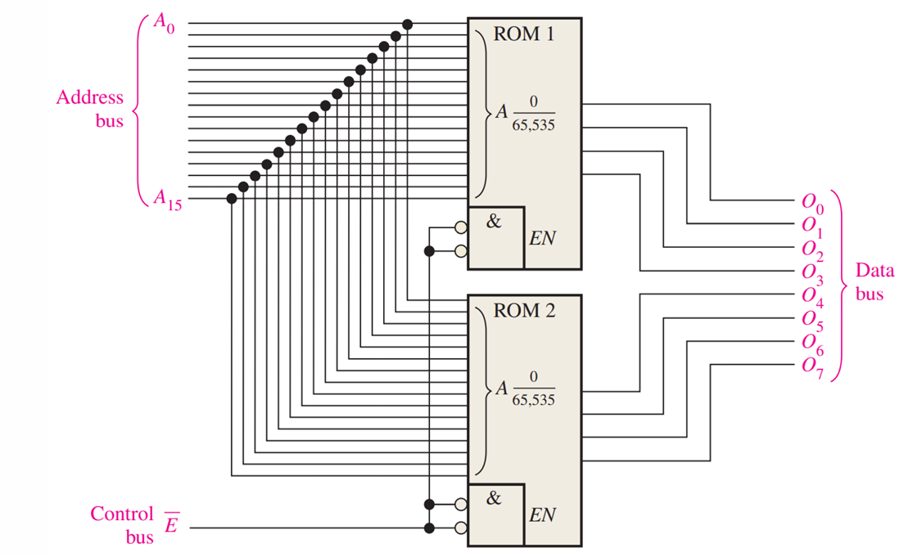
    - **适用场景**：字数够用，但每个字的位数不够。例如，用 $1024 \times 4$ 位的芯片拼出 $1024 \times 8$ 位的存储器。
        
    - **连接方法**：地址线并联连接；控制线（片选端、读写端）并联连接；数据线分别引出。
        
- **2. 字扩展（增加字数）**
    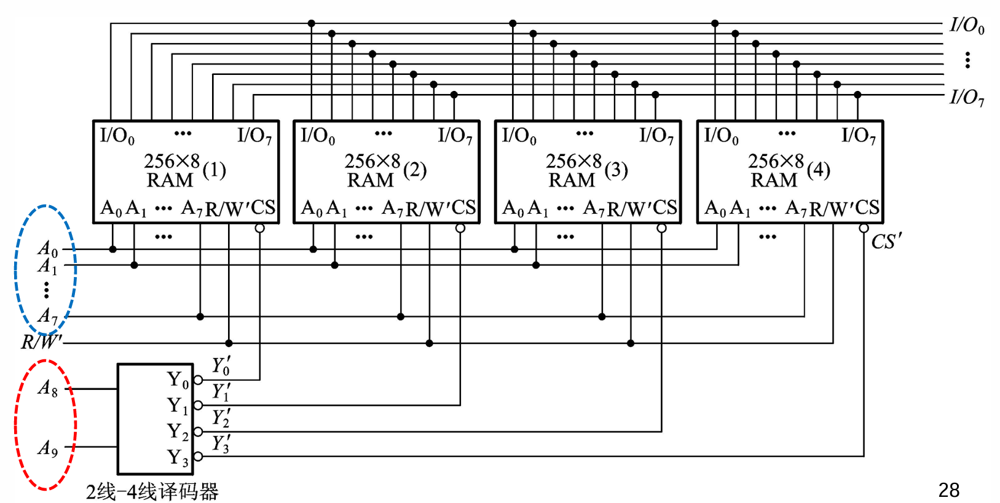
    - **适用场景**：字长够用，但字数不够。例如，用两片 $1024 \times 8$ 位的芯片拼出 $2048 \times 8$ 位的存储器。
        
    - **连接方法**：数据线并联连接；低位地址线并联连接；新增的高位地址线需要连接到译码器，用于控制各个芯片的 片选端 (CS)，保证同一时刻只有一片存储器被选中工作。
* **3.用存储器实现组合逻辑函数**
	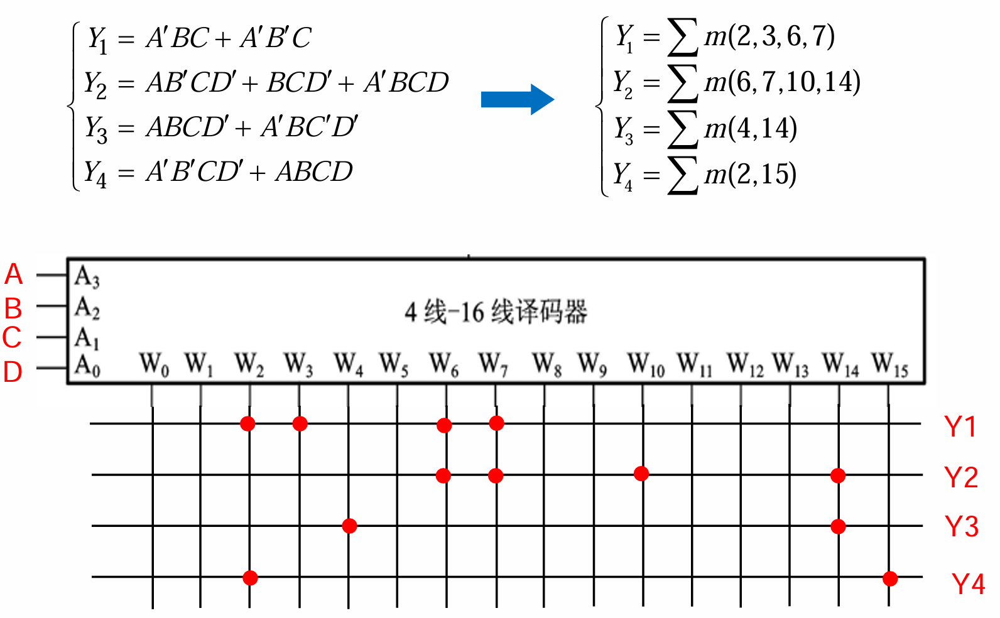
---

## 附录 
### 1.触发器逻辑功能与触发方式小结
| **属性分类**     | **类型/方式** | **核心动作与具体特点描述**                                                                             |
| ------------ | --------- | ------------------------------------------------------------------------------------------- |
| 🎛️ **逻辑功能** | **SR触发器** | 置1、置0、保持、禁止                                                                                 |
|              | **JK触发器** | 置1、置0、保持、翻转                                                                                 |
|              | **D触发器**  | $Q$ 跟随 $D$                                                                                  |
|              | **T触发器**  | 保持、翻转                                                                                       |
| ⚡ **触发方式**   | **电平触发**  | 在时钟处于有效电平（高或低）的整个期间，$Q$ 的状态都可以根据输入而改变。其它时刻 $Q$ 状态锁死不变。                                      |
|              | **脉冲触发**  | 主/从触发器轮流工作；在时钟脉冲结束时，$Q$ 的状态才变化。 注意：对于JK触发器，由于反馈线，存在“一次翻转”特点。 |
|              | **边沿触发**  | 只在时钟的上升沿（或下降沿）到达时，$Q$ 的状态才会改变。其它时刻 $Q$ 状态锁死不变。                                              |

---

| **器件名称**                 | **控制信号与输入** | **逻辑功能**        | **具体状态与次态 Q∗**                                                                                           | **注意点与特点**                              |
| ------------------------ | ----------- | --------------- | -------------------------------------------------------------------------------------------------------- | ------------------------------------------------------------------- |
| **SR锁存器** (电平触发SR触发器) | $S, R$      | 保持、置0、置1、禁止     | • $S=0, R=0$：保持 • $S=0, R=1$：置0 • $S=1, R=0$：置1 • $S=1, R=1$：禁止                                 | 存在强制约束条件 $\boxed{SR=0}$ 。在有效电平期间，输出会随时响应输入变化 。                      |
| **SR触发器** (脉冲/边沿触发)   | $S, R, CLK$ | 保持、置0、置1、禁止     | 同上                                                                                                       | 同样受 $\boxed{SR=0}$ 约束，但只在时钟脉冲结束或有效边沿到来时才改变状态 。                      |
| **JK触发器**                | $J, K, CLK$ | 保持、置0、置1、翻转     | • $J=0, K=0$：状态保持 • $J=0, K=1$：置0 ($Q=0, Q'=1$) • $J=1, K=0$：置1 ($Q=1, Q'=0$) • $J=1, K=1$：状态翻转 | 完美解决了SR触发器的约束问题。脉冲触发的JK触发器具有“一次翻转”特点 。                              |
| **D触发器**                 | $D, CLK$    | 输出 $Q$ 跟随输入 $D$ | • 任何有效触发时刻，$Q^*$ 的状态始终被置为边沿/脉冲到来前 $D$ 的状态                                                                | 结构简单，逻辑明确。输出仅仅取决于触发条件满足前瞬间 $D$ 的状态 。                                |
| **T触发器**                 | $T, CLK$    | 保持、翻转           | • $T=0$：相当于 $J=0, K=0$，状态保持 • $T=1$：相当于 $J=1, K=1$，状态翻转                                               | 将 $T$ 极固定接高电平（$T=1$），可实现二分频功能（输出 $Q$ 频率与 $CLK$ 频率比为 $\boxed{1:2}$）。 |

### 2.集成电路实现组合逻辑的方法

#### 🧩 1. 使用多路选择器 (Multiplexer / MUX) 实现

**核心思想**：多路选择器本质上是一个受控的数据路由开关，可以看作是“折叠的真值表”。一个拥有 $n$ 个选择端的 $2^n$ 选 1 多路选择器，可以直接实现任意 $n$ 变量的逻辑函数；如果配合数据输入端，甚至可以实现 $n+1$ 变量的逻辑函数。

- **实现步骤**：
    
    1. **写出真值表**：列出所需逻辑函数的真值表。
        
    2. **分配选择端**：将逻辑函数的 $n$ 个输入变量直接连接到 MUX 的 $n$ 个选择控制端。
        
    3. **接线数据端**：将真值表中的输出列（0 或 1）依次硬连线到 MUX 的 $2^n$ 个数据输入端（例如接到高电平 $V_{CC}$ 或低电平 $GND$）。
        
- **降维应用**（实现 $n+1$ 变量）：将前 $n$ 个变量接选择端，最后 1 个变量（假设为 $A$）作为数据端输入。此时数据端接入的信号可能是 $0$、$1$、$A$ 或 $A'$。
    

---

#### 🎛️ 2. 使用译码器 (Decoder) 实现

**核心思想**：$n$ 线-$2^n$ 线译码器（如 74LS138）在工作时，本质上是一个**最小项发生器**。当输入 $n$ 个变量时，它的 $2^n$ 个输出端会分别对应这 $n$ 个变量的全部最小项。根据布尔代数原理，任何逻辑函数都可以展开为“最小项之和”（标准与或式）。

- **实现步骤**：
    
    1. **求标准与或式**：将待实现的逻辑函数化简或展开为最小项之和（$\Sigma m_i$）的形式。
        
    2. **连接输入端**：将逻辑变量接入译码器的地址输入端。
        
    3. **附加外部门电路**：
        
        - 如果译码器是**高电平有效**输出：用一个**或门 (OR)** 将函数包含的那些最小项对应的输出端相加。
            
        - 如果译码器是**低电平有效**输出（最常见，如 138 译码器）：由于输出的是最小项的非（$m_i'$），根据德·摩根定律，只需用一个**与非门 (NAND)** 将对应的输出端连起来即可。
            

---

#### 💾 3. 使用只读存储器 (ROM) 实现

**核心思想**：ROM 可以直接看作是一个**硬件查找表 (Look-Up Table, LUT)**。从内部结构来看，ROM 本身就是一个完全译码器（与阵列）和一个可编程的或阵列的结合体。ROM 实现组合逻辑是最简单粗暴且最通用的方法。

- **实现步骤**：
    
    1. **确定容量**：对于一个 $n$ 输入、$m$ 输出的组合逻辑网络，需要选择一个地址线为 $n$、数据线为 $m$ 的 ROM（容量为 $2^n \times m$ 位）。
        
    2. **地址映射**：将 $n$ 个逻辑输入变量连接到 ROM 的 $n$ 根地址线上。
        
    3. **烧录数据**：将真值表的输出部分作为数据，直接烧录（编程）写入到 ROM 对应的地址单元中。ROM 的 $m$ 根数据输出线即为逻辑函数的输出。
        
- **优点**：无需任何逻辑化简，非常适合多输入、多输出的复杂组合逻辑电路设计。
    