### 6.1 概述

#### 1. 时序逻辑电路的特点

- **功能上**：任一时刻的输出不仅取决于该时刻的输入，还与电路原来的状态有关 。例如：串行加法器，两个多位二进制数从低位到高位逐位相加 。
    
- **电路结构上**：
    
    - 包含存储电路和组合逻辑电路 。
        
    - 存储器状态和输入变量共同决定输出 。
        
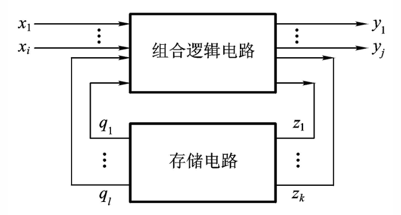

#### 2. 时序电路的一般结构及功能描述

时序电路的功能通常用以下**三大方程**来描述：

- **输出方程**：描述当前输出与当前输入、当前状态的关系。
    
    $\boxed{Y=F(X,Q)}$
    
- **驱动方程**：描述存储电路（触发器）的输入控制信号与外部输入、当前状态的关系。
    
    $\boxed{Z=G(X,Q)}$
    
- **状态方程**：描述存储电路的次态与驱动信号、当前状态的关系。
    
    $\boxed{Q^*=H(Z,Q)}$
    

#### 3. 时序电路的分类

- **按时钟控制方式分类**：
    
    - 同步时序电路：存储电路中所有触发器使用统一的时钟，状态变化发生在同一时刻 。
        
    - 异步时序电路：没有统一的时钟，各个触发器的时钟条件不一致，触发器状态的变化有先有后 。
        
- **按输出与输入的依赖关系分类**：
    
    - Mealy型：$Y=F(X,Q)$，输出与当前的输入 $X$ 和当前的状态 $Q$ 都有关 。
        
    - Moore型：$Y=F(Q)$，输出仅取决于电路当前的状态 $Q$ 。
        

> 💡 **注意点提醒**：
> 
> 区分 Mealy 型和 Moore 型的关键在于**输出方程中是否包含输入变量 X**。如果输出波形会随着输入信号的瞬间毛刺发生变化，那它通常是 Mealy 型。

---

### 6.2 时序逻辑电路的分析方法

1. 必备基础：各触发器的功能及特征方程回顾

在推导状态方程前，必须熟记四大基本触发器的特征方程：

- **SR触发器**（置1、置0、保持、禁止）：$\boxed{\begin{cases}Q^{*}=S+R^{\prime}Q\\ SR=0\end{cases}}$
    
- **JK触发器**（置1、置0、保持、翻转）：$\boxed{Q^{*}=JQ^{\prime}+K^{\prime}Q}$
    
- **D触发器**（Q跟随D）：$\boxed{Q^{*}=D}$
    
- **T触发器**（保持、翻转）：$\boxed{Q^{*}=TQ^{\prime}+T^{\prime}Q}$
    

2. 同步时序逻辑电路的分析步骤 (状态方程推导法)

3. **写出驱动方程**：根据电路逻辑门连线，写出每个触发器输入端的表达式 。
    
4. **求状态方程**：将驱动方程代入对应触发器的特征方程中，求出各触发器的新状态（次态）表达式 。
    
5. **列状态转换表**：根据状态方程和输出方程，列出现态、输入与次态、输出的真值表 。
    
6. **画状态转换图和时序图**：用圆圈表示状态，箭头表示状态转换，在箭头上标明 `输入/输出` 。
    
7. **总结逻辑功能**：观察状态的循环规律，得出电路的整体功能（如几进制计数器、是否可自启动等） 。
    

> ⚠️ **易错点提醒**： 判断触发器状态变化时，**不但要看时钟条件，还要看输入条件**！只有在时钟有效沿到来，并且满足翻转的输入条件时，触发器状态才会改变 。

---

### 🔍 典型示例解析

🌟 示例 1：由3个JK触发器构成的同步电路
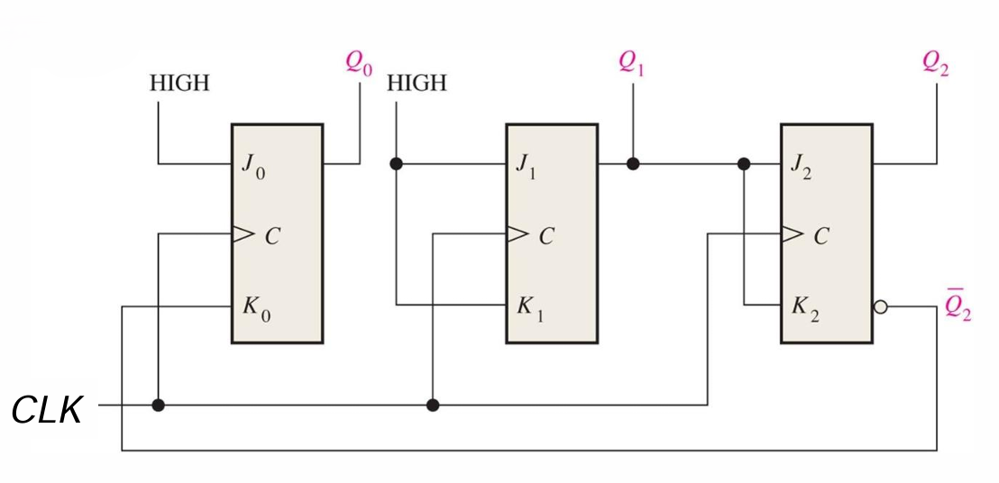
- **写出驱动方程**：
    
    - $FF_0$: $\begin{cases}J_{0}=1\\ K_{0}=Q_{2}^{\prime}\end{cases}$
        
    - $FF_1$: $\begin{cases}J_{1}=1\\ K_{1}=1\end{cases}$
        
    - $FF_2$: $\begin{cases}J_{2}=Q_{1}\\ K_{2}=Q_{1}\end{cases}$
        
- **求出状态方程**（代入JK特征方程 $\boxed{Q^{*}=JQ^{\prime}+K^{\prime}Q}$ ）：
    
    - $Q_{0}^{*}=1\cdot Q_{0}^{\prime}+(Q_{2}^{\prime})^{\prime}Q_{0} = Q_{0}^{\prime}+Q_{2}$
        
    - $Q_{1}^{*}=1\cdot Q_{1}^{\prime}+1^{\prime}Q_{1} = Q_{1}^{\prime}$
        
    - $Q_{2}^{*}=Q_{1}Q_{2}^{\prime}+Q_{1}^{\prime}Q_{2}$
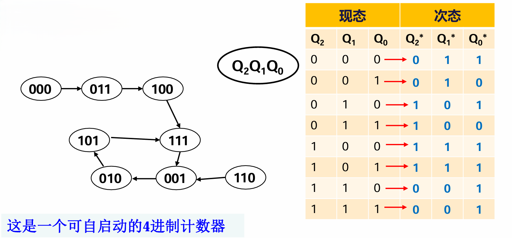
- **功能分析**： 列出状态转换表后发现，3个触发器共有8个状态 。有效状态转换路径为：`000` $\rightarrow$ `011` $\rightarrow$ `100` $\rightarrow$ `111` $\rightarrow$ `001` $\rightarrow$ `010` 。 偏离状态（如 `101`, `110`）最终也会回归主循环 。 **结论**：这是一个可自启动的4进制计数器 。
    

🌟 示例 2：由2个D触发器构成的带输入电路
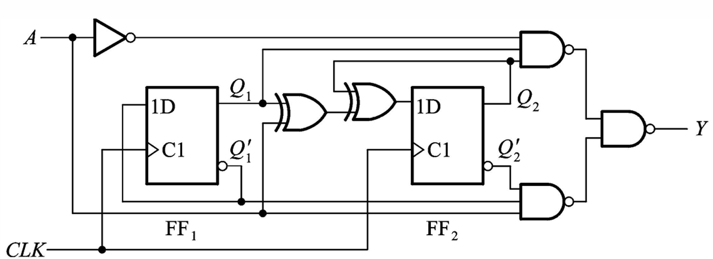
- **写出驱动方程**：
    
    - $D_{2}=A\oplus Q_{1}\oplus Q_{2}$
        
    - $D_{1}={Q_{1}}^{\prime}$
        
- **求出状态方程**（代入D特征方程 $\boxed{Q^{*}=D}$）：
    
    - $Q_{2}^{*}=A\oplus Q_{1}\oplus Q_{2}$
        
    - $Q_{1}^{*}=Q_{1}'$
        
- **写出输出方程**：
    
    - $Y=A^{\prime}Q_{1}Q_{2}+AQ_{1}^{\prime}Q_{2}^{\prime}$
        
- **功能分析**： 2个触发器共有4个状态 。状态转换受到输入信号 $A$ 的控制：
    
    - 当 $A=0$ 时，状态按 `00` $\rightarrow$ `01` $\rightarrow$ `10` $\rightarrow$ `11` 递增 。
        
    - 当 $A=1$ 时，状态按 `11` $\rightarrow$ `10` $\rightarrow$ `01` $\rightarrow$ `00` 递减 。 **结论**：这是一个可自启动的4进制可逆计数器 。
    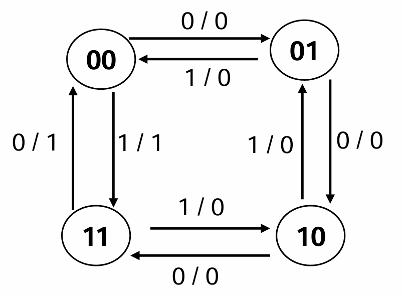

---

### 6.3 若干常用时序逻辑电路

#### 6.3.1 移位寄存器 (Shift Register)

**1. 基本概念与功能**
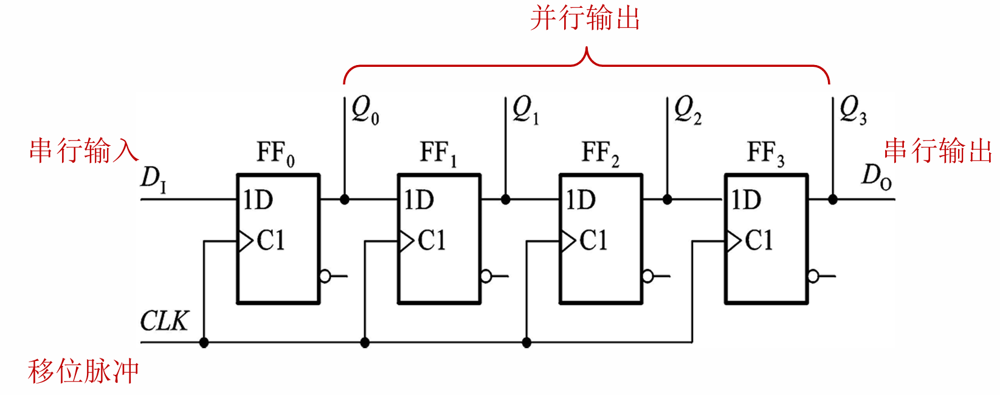
- **原理**：由多个触发器（通常为D触发器）级联构成。在时钟 $CLK$ 上升沿到达时，触发器翻转1次，数据沿着级联方向移动一位 。
    
- **核心功能**：不仅具备 存储数据 的功能，还能在移位脉冲作用下实现数据的左移或右移 。
    
- **实际应用**：广泛用于实现**串并转换**（串行输入转并行输出）和**并串转换**（并行输入转串行输出），以及数值运算（如乘法、除法）和数据处理 。
    

---

**2. 典型器件：4位双向移位寄存器 74LS194A**

这是本章最重要的中规模集成(MSI)时序逻辑器件之一。

- **引脚功能分布** ：
    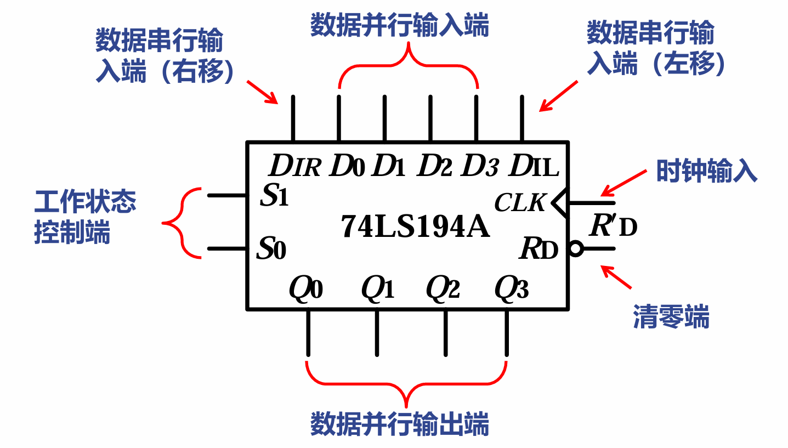
    - **并行数据端口**：输入 $D_0, D_1, D_2, D_3$；输出 $Q_0, Q_1, Q_2, Q_3$。
        
    - **串行数据输入**：$D_{IR}$ (用于右移时的串行输入补充)；$D_{IL}$ (用于左移时的串行输入补充)。
        
    - **控制与时钟**：$CLK$ (时钟有效沿触发)；$R_D'$ (低电平异步清零端)。
        
    - **工作模式选择端**：$S_1, S_0$（决定了芯片当前干什么活）。
        
- **工作模式真值表** ： 只要 $R_D' = 1$（不清零），其功能完全由 $S_1 S_0$ 决定：
    
    - **$S_1 S_0 = 00$：保持状态**。触发器状态不变，$\boxed{Q_n^* = Q_n}$。
        
    - **$S_1 S_0 = 01$：右移状态**。数据从高位移向低位方向（电路图上从左往右移）。
        
        $\boxed{Q_0^* = D_{IR}, \quad Q_1^* = Q_0, \quad Q_2^* = Q_1, \quad Q_3^* = Q_2}$
        
    - **$S_1 S_0 = 10$：左移状态**。数据从低位移向高位方向（电路图上从右往左移）。
        
        $\boxed{Q_3^* = D_{IL}, \quad Q_2^* = Q_3, \quad Q_1^* = Q_2, \quad Q_0^* = Q_1}$
        
    - **$S_1 S_0 = 11$：并行输入**。相当于普通的寄存器工作。
        
        $\boxed{Q_0^* = D_0, \quad Q_1^* = D_1, \quad Q_2^* = D_2, \quad Q_3^* = D_3}$
        

> ⚠️ **易错点提醒（高频考点）**： 在硬件接线上，所谓的“右移”（$Q_0 \rightarrow Q_1 \rightarrow Q_2 \rightarrow Q_3$），如果 $Q_0$ 接的是数值的最低位（$2^0$），$Q_1$ 接的是次低位（$2^1$），那么数据从 $Q_0$ 移动到 $Q_1$，在数学意义上是将数字向高位推进，相当于**数值乘以 2**！千万不要和软件编程里“右移=除以2”混淆。电路里的左右移只代表管脚方向，实际数学意义要看管脚连的是高位还是低位 ！

---

**3. 移位寄存器的级联扩展** 当4位不够用时，我们可以将两片 74LS194A 连成一个 **8位双向移位寄存器** 。
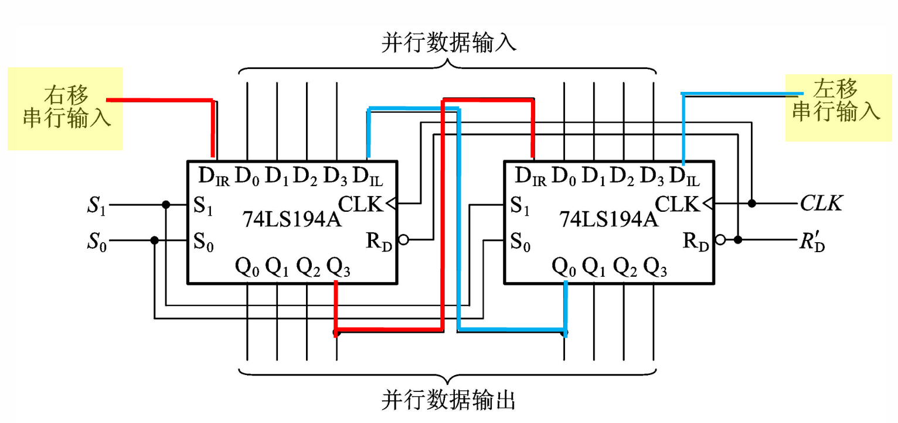
- **公共端并联**：两片芯片的 $S_1, S_0, CLK, R_D'$ 必须并联在一起，保证步调一致 。
    
- **串行线交叉相连**（关键接线） ：
    
    - **右移扩展**：左侧芯片的最高位 $Q_3$ 必须接到右侧芯片的右移串行输入端 $D_{IR}$。
        
    - **左移扩展**：右侧芯片的最低位 $Q_0$ 必须接到左侧芯片的左移串行输入端 $D_{IL}$。
        

---

**4. 综合实战大题解析（74LS194A + 74283 综合电路）** 课件最后给出了一道极具代表性的分析题：利用 4片 74LS194A 组成两个 8 位寄存器（存数据 M 和 N），结合 74283（全加器），求不同时钟控制下的输出 $Y$ 。
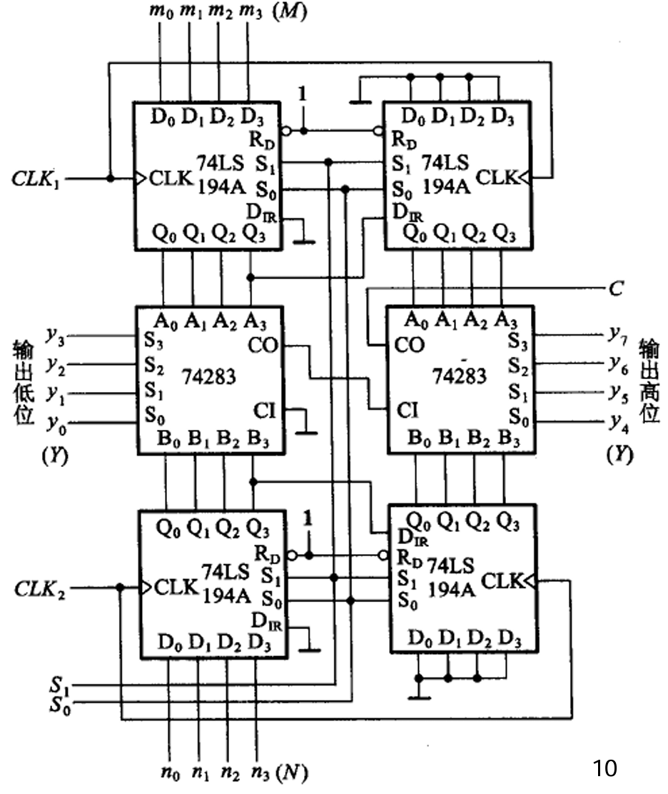
- **电路初始分析**：
    
    - 上方两片 194A 组成 8 位寄存器存变量 $M$；下方两片 194A 存变量 $N$ 。
        
    - 它们的并联输出接入全加器，所以最终加法器输出的是 $M$ 与 $N$ 移位后的和 。
        
    - $CLK_1$ 控制 $M$ 所在的寄存器；$CLK_2$ 控制 $N$ 所在的寄存器 。
        
- **时序过程步步拆解**：
    
    - **$t_1$ 时刻**：控制端 $S_1S_0 = 11$。此时为并行输入状态，$M$ 和 $N$ 的初始值被同步存入对应的寄存器中 。
        
    - **$t_2$ 时刻**：控制端变为 $S_1S_0 = 01$。此时电路进入右移状态。看波形图，此时 $CLK_1$ 和 $CLK_2$ 都有上升沿脉冲触发！因此 $M$ 和 $N$ **同时右移 1 位**。正如上文“易错点”所述，在此接线中右移1位相当于乘2 。
        
    - **$t_3$ 和 $t_4$ 时刻**：控制端保持 $S_1S_0 = 01$（右移状态）。但是，仔细观察波形图会发现，这两个时刻 **只有 $CLK_1$ 给出了脉冲，$CLK_2$ 始终为 0** 。
        
        - 结果是：只有寄存器 $M$ 继续响应，又发生了2次右移（每次乘2）；而寄存器 $N$ 因为没有时钟脉冲，状态保持原样 。
            
- **最终公式推导**：
    
    - 经过完整的四个时刻，变量 $M$ 一共移动了 3 次（$t_2, t_3, t_4$），相当于乘以 $2^3 = 8$。
        
    - 变量 $N$ 只在 $t_2$ 时刻移动了 1 次，相当于乘以 $2^1 = 2$。
        
    - 由于全加器时刻计算两者的和，因此最终输出 $Y$ 的逻辑表达式为：
        
        $\boxed{Y = M \times 8 + N \times 2}$ 。
        

> 💡 **解题思路总结**：
> 
> 面对这类时序与组合逻辑混合的题目，**第一步看 $S_1S_0$ 确定工作模式**，**第二步看 $CLK$ 判断当前模块是否被触发**。利用时钟信号的“数量差”，可以巧妙地实现不同变量的不等比例乘法运算。

---

#### 6.3.2 计数器概述

##### 1. 计数器的核心功能

- 记录输入的脉冲个数
    
- 频率分配（分频）
    
- 定时
    
- 产生顺序脉冲和序列信号
    

##### 2. 计数器的分类
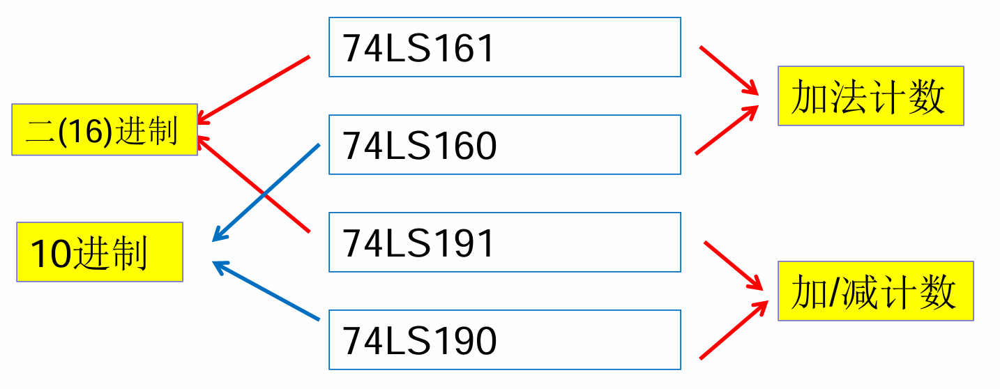
- **按翻转时刻**：同步计数器（所有触发器共用同一时钟，同时翻转）、异步计数器（触发器时钟不统一，翻转有先后） 。
    
- **按数字编码**：二进制计数器、十进制计数器、格雷码计数器 。
    
- **按数字增减**：加法计数器、减法计数器、可逆计数器（加减双向） 。
    
- **按计数容量**：十进制计数器、六十进制计数器、任意 $N$ 进制计数器 。
    

---

#### 📌 核心芯片一：4位同步二进制加法计数器 74LS161

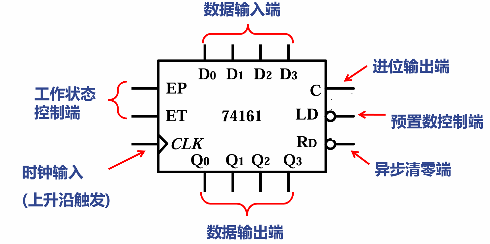
74LS161 是一款极为基础且常考的集成计数器，属于 16 进制计数器（状态从 `0000` 到 `1111`） 。

##### 1. 引脚功能说明

- **$CLK$**：时钟输入端，上升沿有效。
    
- **$\overline{R_D}$ (或 $\overline{CR}$)**：清零端，低电平有效。
    
- **$\overline{LD}$**：预置数（加载）端，低电平有效。
    
- **$EP, ET$**：计数使能端（也叫工作状态控制端）。
    
- **$D_0 \sim D_3$**：并行数据输入端。
    
- **$Q_0 \sim Q_3$**：数据输出端。
    
- **$C$**：进位输出端。
    

##### 2. 逻辑功能与工作模式（优先级从高到低）

- **第一优先：异步清零**
    
    当 $\overline{R_D} = 0$ 时，无论时钟 $CLK$ 和其他控制信号如何，输出立刻变为 $\boxed{Q_3 Q_2 Q_1 Q_0 = 0000}$。
    
- **第二优先：同步置数**
    
    当 $\overline{R_D} = 1$ 且 $\overline{LD} = 0$ 时，计数器在**下一个时钟上升沿**到来时，将输入端的数据同步加载到输出端，即 $\boxed{Q_n^* = D_n}$。
    
- **第三优先：正常计数**
    
    当 $\overline{R_D} = 1, \overline{LD} = 1$，且 $EP = 1, ET = 1$ 时，每来一个时钟脉冲，计数器加 1。
    
- **第四优先：保持状态**
    
    当 $\overline{R_D} = 1, \overline{LD} = 1$，且 $EP$ 或 $ET$ 中有一个为 0 时，计数器暂停计数，保持当前状态不变。
    

##### 3. 进位输出方程

当计数器计满（即 $Q_3 Q_2 Q_1 Q_0 = 1111$）且 $ET=1$ 时，进位输出端 $C$ 才会输出高电平脉冲：

$\boxed{C = ET \cdot Q_3 Q_2 Q_1 Q_0}$

> ⚠️ **易错点提醒**：
> 
> **“异步”与“同步”的区别极其重要！**
> 
> 1. 异步清零：**不需要**等待时钟信号（$CLK$）的上升沿，只要 $\overline{R_D}$ 给低电平，瞬间清零。在波形图上表现为一个极短的毛刺后立刻归零。
>     
> 2. 同步置数：**必须**等待下一个时钟上升沿到来时，置数操作才会生效。
>     

---

#### 📌 核心芯片二：4位同步十进制加法计数器 74LS160

74LS160 的引脚和大部分控制逻辑与 74LS161 **完全一致**（同样具备异步清零和同步置数功能），其唯一的区别在于**计数容量和进位条件** 。
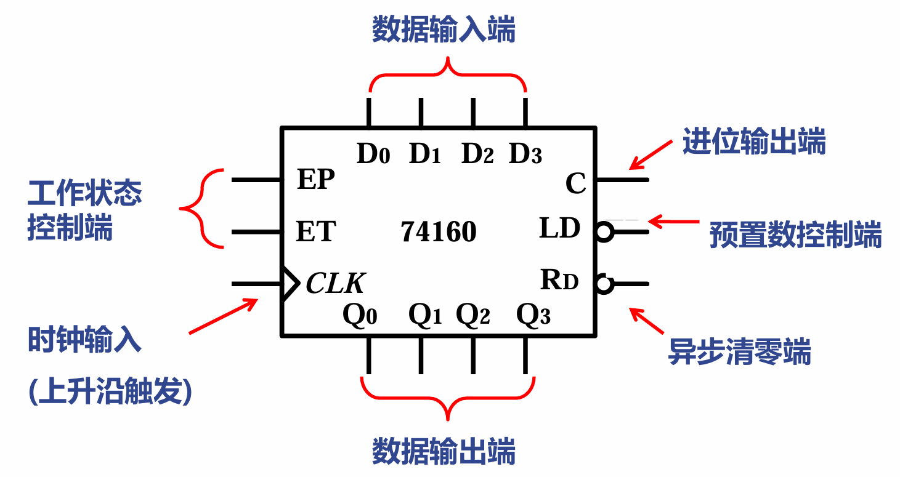
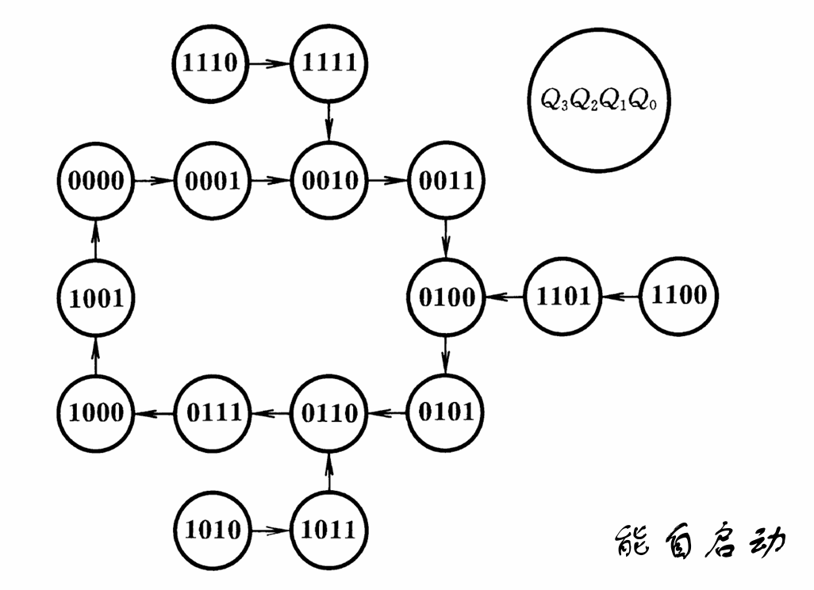
- **状态范围**：只在 `0000` 到 `1001`（即 0 ~ 9）之间循环计数 。当计到 `1001` 后，下一个时钟会使其自动清零回到 `0000` 。
    
- **进位输出方程**：
    
    当计到 9（即 $Q_3 Q_2 Q_1 Q_0 = 1001$）且 $ET=1$ 时产生进位脉冲：
    
    $\boxed{C = ET \cdot Q_3 Q_0}$
    
    _(注：因为在合法状态 0~9 内，只有 9 满足 $Q_3=1$ 且 $Q_0=1$，所以不需要把 $Q_2, Q_1$ 写进方程中进行化简)_
    

---

##### 🔍 经典功能分析示例 (综合实战)

**📝 示例：分析采用 74LS161 构成的电路逻辑功能**
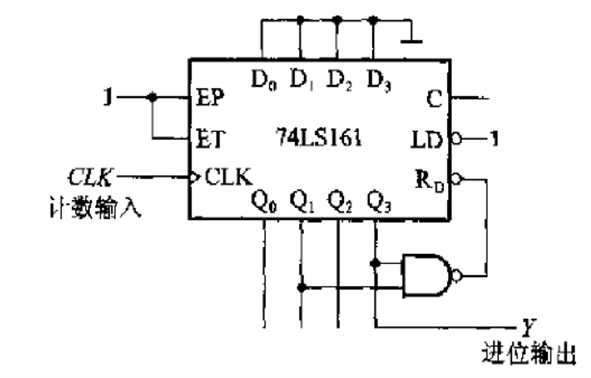
- **电路连线情况**： 芯片使用的是 74LS161。并行输入端 $D_3 D_2 D_1 D_0 = 0000$ 接地 。 将输出端 $Q_3$ 和 $Q_1$ 接入一个与非门，该与非门的输出连接到了 $RD$（异步清零端） 。
    
- **分析过程**：
    
    1. 计数器正常从 `0000` 开始往上加 。
        
    2. 当计数到 `1010`（十进制的 10）时，由于 $Q_3 = 1, Q_1 = 1$，与非门输出为 `0` 。
        
    3. 此时 ${RD} = 0$，触发了异步清零功能 。
        
    4. 状态转换序列为：$0 \rightarrow 1 \rightarrow \dots \rightarrow 8 \rightarrow 9 \rightarrow 0$ 循环 。
        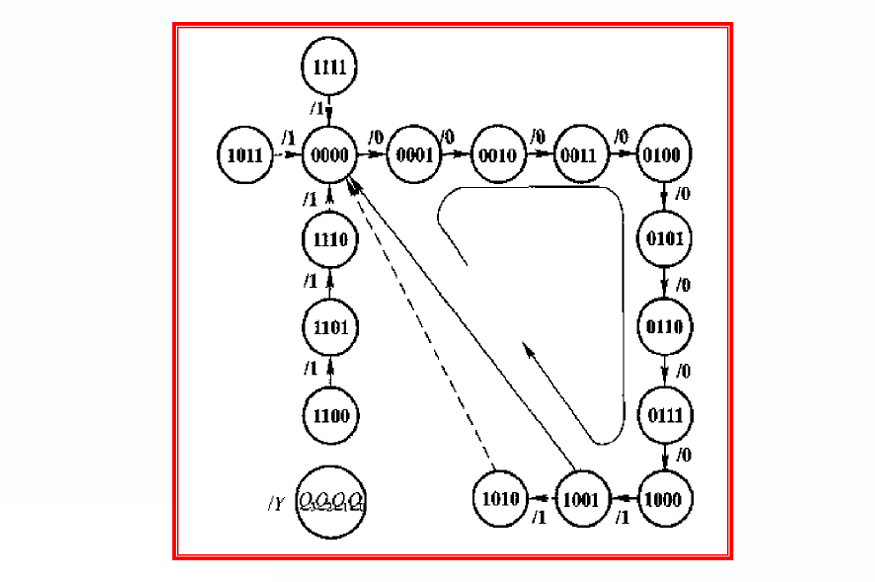
- **结论**：这是一个由同步置数法构成的 **十进制（Mod-10）计数器** 。
    

> 💡 **总结小贴士**：
> 
> 在利用同步置数端 $\overline{LD}$ 设计 $N$ 进制计数器时，若从 0 开始计数，我们总是让它计到 **$N-1$** 这个状态时，使得译码电路输出低电平反馈给 $\overline{LD}$ 端，从而在下一个时钟归零。

#### 📌 核心芯片三：同步可逆计数器 74LS191 与 74LS190

前面学习的 74LS161/160 主要是加法计数器，而 74LS191 和 74LS190 则是具备加减双向计数功能的芯片。
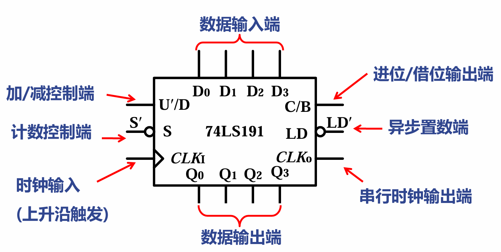
- **74LS191**：4位同步可逆二进制计数器 。
    
- **74LS190**：4位同步可逆十进制计数器（仅用到 `0000` ~ `1001` 状态），各端口功能与 191 完全相同 。
    

**核心控制引脚与工作状态** ：

1. **预置数端 $\overline{LD}$**：异步置数。只要 $\overline{LD}=0$，不管时钟状态，立刻将输入端 $D_0 \sim D_3$ 的数据置入输出端 $Q_0 \sim Q_3$ 。
    
2. **计数控制端 $\overline{S}$**：低电平有效。当 $\overline{S}=0$ 时才允许计数；当 $\overline{S}=1$ 时，计数暂停，状态保持 。
    
3. **加/减控制端 $\overline{U}/D$**：
    
    - 当 $\overline{U}/D = 0$ 时，进行加法计数 。
        
    - 当 $\overline{U}/D = 1$ 时，进行减法计数 。
        
4. **进位/借位输出与串行时钟输出**：当有进位或借位时，会在下一个时钟上升沿之前，从串行时钟输出端 $\overline{CLK_O}$ 给出一个负脉冲 。
    

⚠️ **易错点提醒（芯片对比）** ：
 
 - **“异步”** 意味着立刻生效；**“同步”** 意味着必须等待下一个 $CLK$ 上升沿到达时才生效。
     
 - **74x16x 系列** (如161/160)：具有异步清零、同步置数功能。
     
 - **74x19x 系列** (如191/190)：没有专门的清零端，只有异步置数功能（置 `0000` 即为清零）。

---

#### 📌 核心芯片四：异步计数器与 74LS290

- **异步计数器的特点**：在进行加法或减法（进位或借位）时，是从低位到高位逐位进行的，并不是所有触发器同时翻转，因此存在累积的传输延迟时间 ($t_{pd}$) 。
    
- **典型芯片 74LS290 (二-五-十进制异步计数器)** ：
    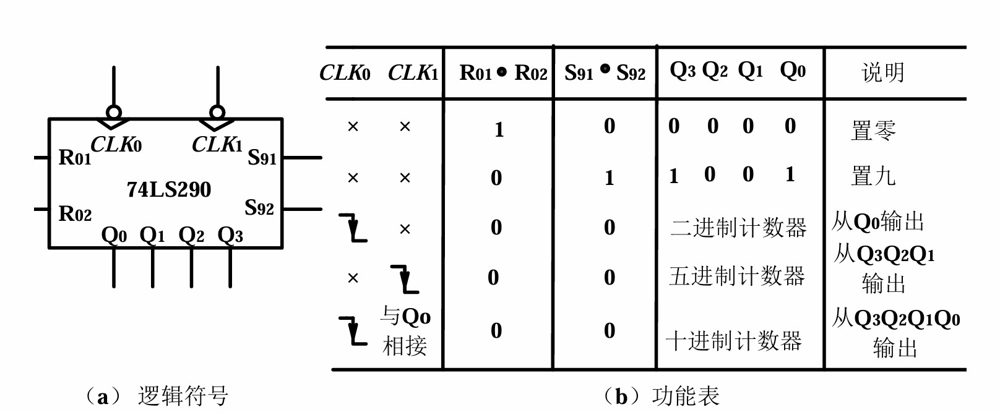
    - **逻辑功能**：内部包含一个二进制计数器（从 $Q_0$ 输出）和一个五进制计数器（从 $Q_3 Q_2 Q_1$ 输出） 。
        
    - **组合方式** ：
        
        - 若将 $CLK_0$ 作为输入，$Q_0$ 作为输出，则是二分频。
            
        - 若将 $CLK_1$ 作为输入，$Q_3$ 作为输出，则是五分频。
            
        - 若将 $CLK_1$ 与 $Q_0$ 相接，并将 $CLK_0$ 作为系统输入，则构成一个完整的十进制计数器（十分频）。
            
    - **清零与置九**：具有 $R_{01}, R_{02}$（清零端）和 $S_{91}, S_{92}$（置九端） 。
        

---

#### 任意进制计数器的构成方法（🔥 重点大题）

实际应用中常需要非标准容量的计数器（如 6进制、7进制、60进制等）。利用现有的中规模集成计数器（M进制），可以构成任意进制（N进制）计数器 。

分为两种情况：$\boxed{M < N}$（小拼大，需多片级联） 和 $\boxed{M > N}$（大改小，单片截取） 。
##### 大改小
**🌟 情况：大改小 ($M > N$)** 在 M 进制计数器的顺序计数过程中，只要设法跳过 $(M-N)$ 个状态，就可以得到 N 进制计数器 。主要有三种状态截取方法：

1. **“去尾”法 (从 0 开始计数)**
    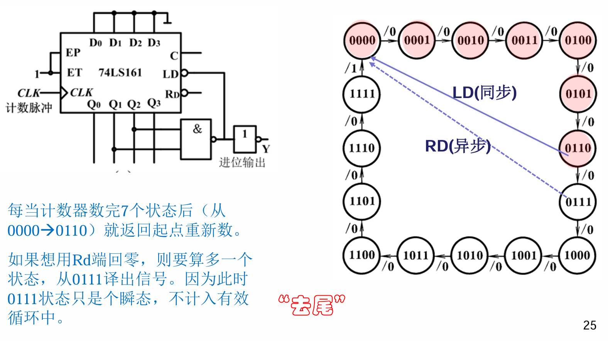
    - **原理**：计数从 `0000` 开始，当计到第 N 个状态（即数值 $N-1$）时，生成一个反馈信号，使计数器在下一步回到 `0000`。
        
    - **示例 (用 74LS161 同步置数端实现 7 进制)** ： 让芯片从 `0000` 计到 `0110` (6)。在状态 `0110` 时，译码输出有效信号给到同步置数端 $\overline{LD}$（置入 `0000`）。等待下一个时钟沿到来，状态直接回到 `0000`。
        
    - **示例 (用 74LS161 异步清零端实现 7 进制)** ： 如果使用异步清零端 $\overline{R_D}$，则必须让其计到 `0111` (7)。因为异步清零是瞬间生效的，`0111` 只是一个极短暂的**暂态**，一旦出现立刻清零，有效循环依然只有 0~6 这 7 个状态。
        
2. **“掐头”法 (数到最大值再跳回)**
    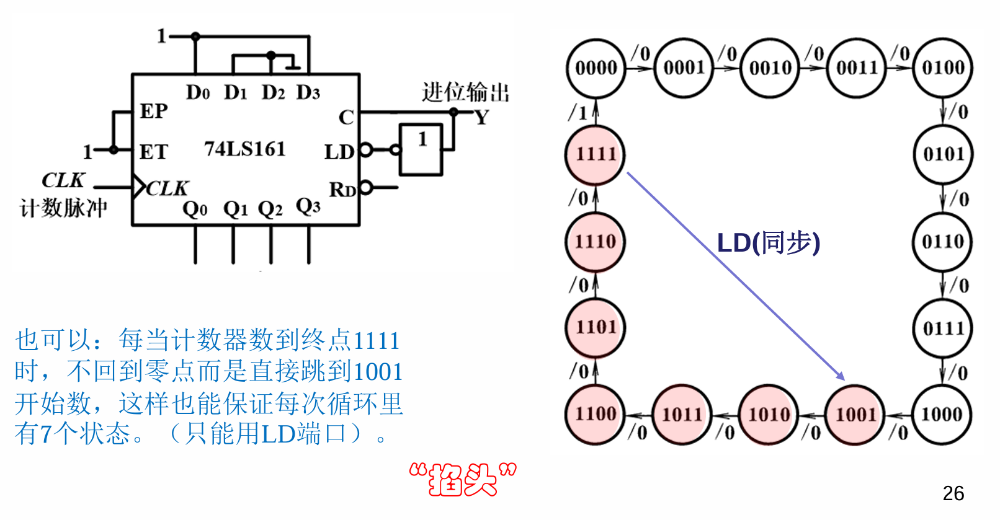
    - **原理**：计数器的终点固定为最大值（如 161 的 `1111` 或 160 的 `1001`），当计数器到达终点时，通过同步置数端使其在下一个时钟跳回到某个非零的起始点 。
        
    - **示例 (实现 7 进制)** ：让芯片数到 `1111` 时反馈置数信号，使其下一个状态强制跳回到 `1001` (9)，从而在 `1001` ~ `1111` 之间产生 7 个状态的循环。
        
3. **“拦腰砍”法**
    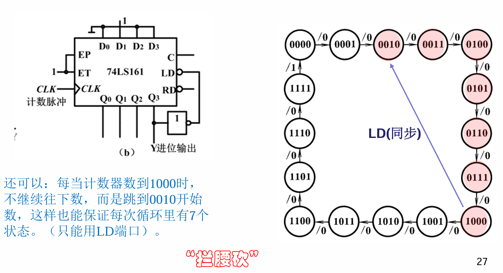
    - **原理**：既不从 0 开始，也不以最大值结束，而是在中间任意截取一段连续的 N 个状态循环 。
        

> 💡 **核心设计总结与进位输出**： 除了改造循环路径，还必须构造**“进位输出 (Y)”** 。进位输出的要求是：**每一个循环周期产生一个有效脉冲**。通常可以将跳回起点的那个反馈信号取反后作为进位输出。

---

**📝 对比实战：用 74LS161 与 74LS191 构成 7进制计数器（状态暂态对比）**

为了深刻理解同步置数与异步置数的区别，看以下对比：

- **用 74LS161 (同步置数)** ：要想得到 `1001` ~ `1111` 这 7 个状态。当状态到达 `1111` 时，译码反馈给 $\overline{LD}$ 端置 `1001`。此时 `1111` 是**稳态**，下一个时钟沿才跳跃。
    
- **用 74LS191 (异步置数)** ：同样想得到 `1000` ~ `1110` 这 7 个状态。如果用 `1110` 去译码，由于异步立刻生效，`1110` 根本停不住！所以必须让其计到 `1111`。在出现 `1111` 的瞬间（**暂态**）立刻触发置数，瞬间回到 `1000`。因为 `1111` 是暂态，所以还需要另外引出进位信号 。

##### **小改大**
当目标进制数 $M$ 大于单片集成计数器的最大进制数 $N$ 时，必须使用两片或以上的芯片进行级联扩展。

**1. 基础级联：构成 $N_1 \times N_2$ 进制计数器**

例如，用两片 74LS160（十进制）构成 100 进制计数器。
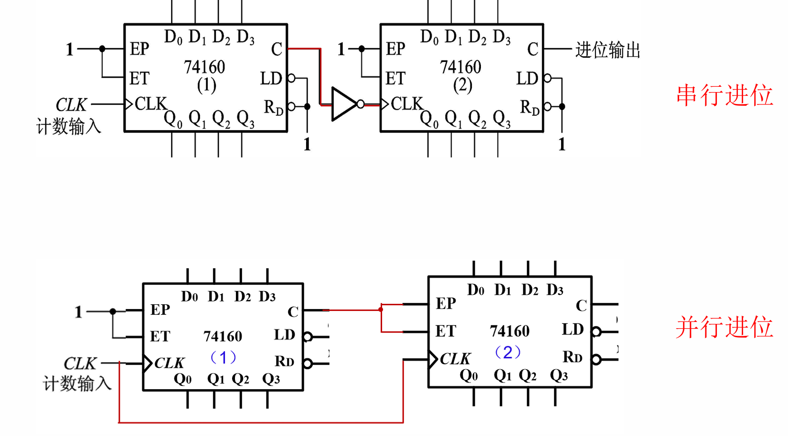
- **连接原则**：两片芯片共用同一个时钟信号 $CLK$（同步级联）。
    
- **进位控制**：
    
    - “个位”芯片：计数使能端 $EP=1, ET=1$（始终允许计数）。
        
    - “十位”芯片：其计数使能端 $EP, ET$ 接在“个位”芯片的**进位输出端 $C$** 上。
        
- **工作过程**：只有当个位计满（达到 9），产生进位信号 $C=1$ 时，十位芯片才在下一个时钟沿“逢十进一” 。
    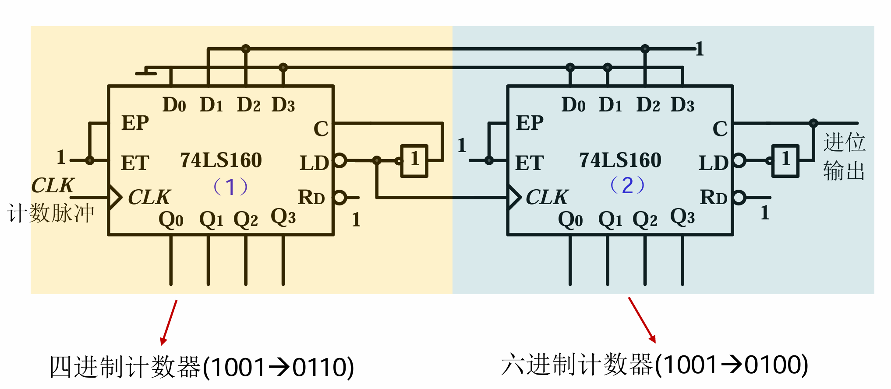

---

**2. 核心设计：构成任意 $M$ 进制计数器 (以构成 29 进制为例)**

假设使用两片 74LS160 构成 29 进制计数器。首先按上述方法将两片级联成 100 进制，然后通过以下两种核心方法截取 29 个状态：

🌟 **方法一：整体清零法（利用异步清零端 $\overline{R_D}$）**
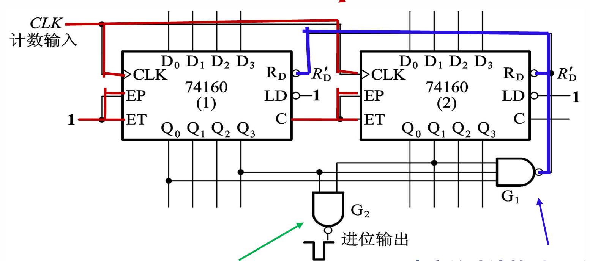
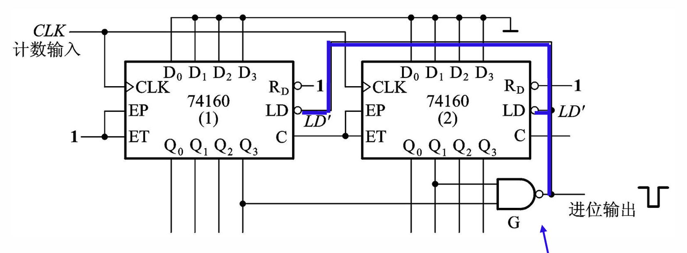
- **原理**：计数从 `00` 开始，数到 $M$（即 29）时产生清零信号。
    
- **状态分析**：有效状态为 `00` $\sim$ `28`。当状态变为 `29` 时（十位为 `0010`，个位为 `1001`），提取十位的 $Q_2$ 和个位的 $Q_3, Q_0$，接入与非门，输出连接到两片芯片的 $\overline{R_D}$ 端。
    
- **状态特点**：`29` 是一个**暂态**，瞬间闪过即刻清零。
    

🌟 **方法二：整体置数法（利用同步置数端 $\overline{LD}$）**

利用同步置数端有两种绝妙的设计思路：

- **思路 A：“去尾法” (从 0 开始计，数到 $M-1$ 跳回)**
    
    - 计数范围：`00` $\sim$ `28`。
        
    - 译码条件：当状态到达 `28`（十位 `0010`，个位 `1000`）时，译码产生低电平送到 $\overline{LD}$ 端。数据输入端全部接 `0`。
        
    - 状态特点：`28` 是**稳态**，必须等下一个 $CLK$ 上升沿到来才同步置入 `00`。
        
- **思路 B：“掐头法” (数到最大值再跳回 —— 最简连线法)**
    
    - **原理**：不从 0 开始数，而是让计数器的终点固定在芯片的最大值 `99`。
        
    - **计算起点 $X$**：$\boxed{X = N_{total} - M}$（即 $X = 100 - 29 = 71$）。
        
    - **巧妙接线**：将数据输入端硬接线为 71（十位 `0111`，个位 `0001`）。当计数器计到 `99` 时，十位芯片的**进位输出 $C$ 自然变为 1**！将这个 $C$ 经过一个非门，直接连回两片芯片的 $\overline{LD}$ 端。
        
    - **优势**：完全不需要外加复杂的与非门去译码，直接利用芯片自带的进位端，极大地简化了电路逻辑！
        

> ⚠️ **易错点提醒**：
> 
> 考卷上如果让你用“整体置数法”设计，强烈推荐使用**思路 B（掐头法）**。只需要算出一个起点数字并固定接线，然后把进位 $C$ 反相接给 $\overline{LD}$ 即可，能有效避免译码连线画错的风险！

---

#### 6.3.3 顺序脉冲发生器

在数字系统中，常需要一组按一定顺序依次出现的高/低电平脉冲，用来控制不同设备按序动作。
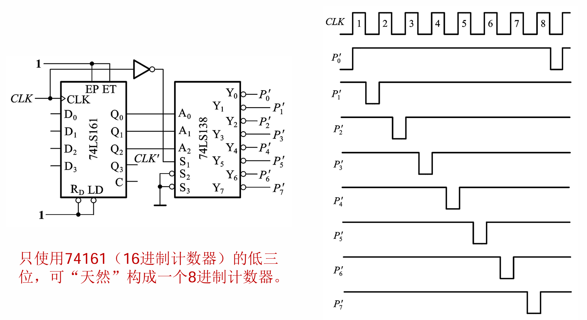
- **核心结构**：$\boxed{\text{计数器} + \text{译码器}}$
    
- **工作原理**：
    
    1. **计数器**：在时钟脉冲驱动下，不断循环产生状态码（例如使用 74LS161 的低三位，产生 `000` $\sim$ `111` 的 8 进制地址码）。
        
    2. **译码器**：将计数器输出的地址码作为输入，译码器的各个输出端（如 74LS138 的 $Y_0 \sim Y_7$）就会依次轮流输出有效的低电平脉冲 。
        

---

#### 6.3.4 序列信号发生器

有时我们需要发送一串特定的自定义数字密码串（例如 `00101110`），这就需要用到序列信号发生器。
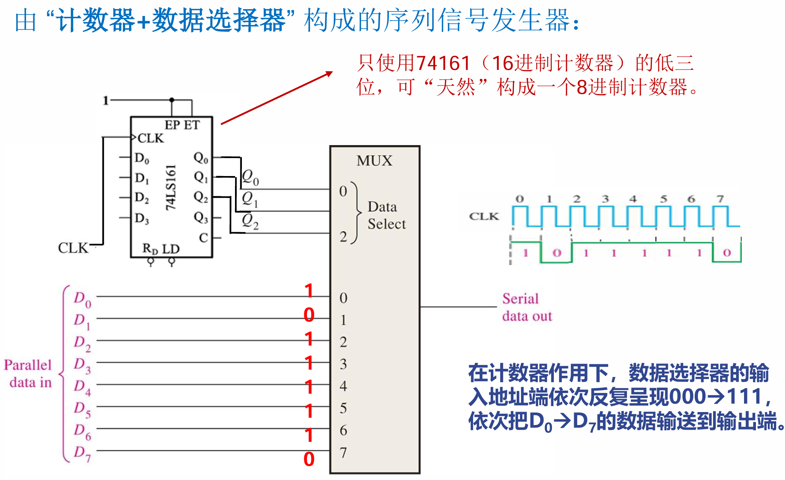
- **核心结构**：$\boxed{\text{计数器} + \text{数据选择器}}$
    
- **工作原理**：
    
    1. **计数器**：提供循环变化的地址码（如 8 进制计数器产生 `000` $\sim$ `111` 接入选择器的地址端）。
        
    2. **数据选择器**：将所需序列的每一位固定接在其数据输入端（如要求序列为 `01010110`，则 $D_0 \sim D_7$ 依次硬接线到地或电源）。
        
    3. 随着计数器地址的循环，数据选择器就会把接好的这串密码像“走马灯”一样从输出端串行“吐”出来 。
        

---

#### 6.4 时序逻辑电路的设计方法

设计同步时序逻辑电路，本质上就是根据给定的逻辑功能要求，一步步推导出具体的电路连接图。整个设计过程可以标准化为以下 **7个核心步骤** ：

##### 1. 逻辑抽象

- **目标**：将实际问题转化为逻辑关系 。
    
- **动作**：确定输入变量、输出变量以及电路的状态，并定义它们的含义，赋予相应的字母代号 。最终画出 状态转换图 或列出状态转换表 。
    

##### 2. 状态化简

- **目标**：求得最简的状态数，以节省触发器的使用 。
    
- **动作**：寻找等价状态并将其合并 。
    

> 💡 **注意点**：课件中明确标注，**本课程对状态化简不作要求** 。在辅导JRX时，这一步可以直接略过，让他把精力集中在画状态转换图上！

##### 3. 状态分配（又称状态编码）

- **目标**：将抽象的状态用二进制代码表示出来 。
    
- **动作**：确定触发器的个数 $n$ 。计算公式取决于有效状态的总数 $M$ ： $\boxed{2^{n-1} < M \le 2^n}$ _(例如：如果有 6 个状态，即 $M=6$，那么需要 $n=3$ 个触发器，因为 $2^2 < 6 \le 2^3$)_
    

##### 4. 选定触发器的类型

- 根据题目要求或实际需要，选择使用 D 触发器、JK 触发器或 T 触发器等 。
    

##### 5. 求解三大方程

- 结合状态转换图（或状态表）和选定触发器的特性表，通过卡诺图化简，求出：
    
    1. **状态方程**
        
    2. **驱动方程**
        
    3. **输出方程**
        

##### 6. 画出逻辑电路图

- 根据求出的驱动方程和输出方程，将触发器和逻辑门连接起来 。
    

##### 7. 检查电路能否自启动

- **目标**：确保电路即使由于干扰进入了无效状态（偏离状态），也能在时钟脉冲的作用下自动回到有效循环中 。
    
- **动作**：将无效状态的代码代入求得的状态方程和输出方程中，计算其次态，看它是否能导向有效状态 。如果能，则电路可自启动；如果陷入死循环，则需修改设计 。
    