## 4.1 概述 📖

*   **组合逻辑电路**：电路没有“记忆”，任意时刻的输出**仅取决于该时刻的输入**，与电路原来的状态无关。
    *   *特点*：信号流向单向，没有从输出到输入的反馈。基本组成单元是不含记忆元件的逻辑门电路。
*   **时序逻辑电路**：电路有“记忆”，当前的输出不仅取决于当前的输入，还取决于电路过去的状态。

---

## 4.2 组合逻辑电路的分析方法 🔍

**任务**：给定某逻辑电路，分析其逻辑功能。
**分析步骤**：
1.  由所给电路图，**写出逻辑函数式**（从输入到输出逐级写出）。
2.  将所得的逻辑式进行**化简**（利用公式法或卡诺图）。
3.  由化简后的逻辑式，**列出真值表**。
4.  由真值表归纳**分析电路的逻辑功能**（用一句话描述它能干什么）。

 💡 **典型示例分析**：
### 📝 例1：组合逻辑电路的分析

**【题目任务】**
给定一个由多个与非门组成的逻辑电路图，请分析该电路的逻辑功能。
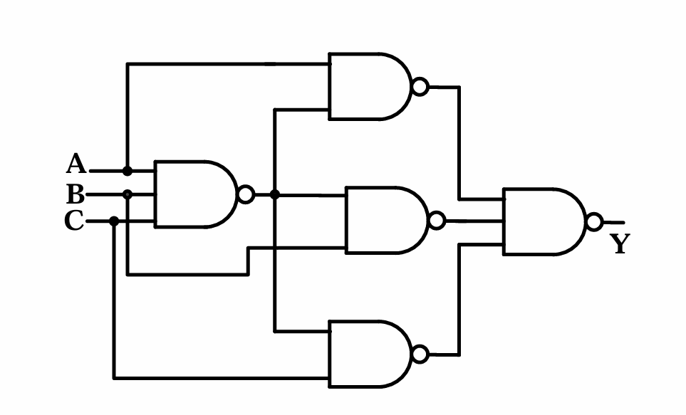
#### 步骤 1：由逻辑图写出输出端的逻辑函数式 ✍️

观察给定的电路图，我们可以看到电路分为三级，我们从输入端 $A, B, C$ 开始，逐级向后写出逻辑表达式：

1.  **第一级（最左侧的一个与非门）**：
    该门的三个输入端分别连接了 $A, B, C$。
    其输出为： $\overline{A \cdot B \cdot C}$ ，即 $(ABC)'$

2.  **第二级（中间的三个与非门）**：
    这三个门都有两个输入端，其中一个输入端是各自对应的原始变量 ($A$ 或 $B$ 或 $C$)，另一个输入端共同连接到了第一级与非门的输出 $(ABC)'$ 上。
    *   上面与非门的输出： $\overline{A \cdot (ABC)'}$
    *   中间与非门的输出： $\overline{B \cdot (ABC)'}$
    *   下面与非门的输出： $\overline{C \cdot (ABC)'}$

3.  **第三级（最右侧的输出与非门）**：
    该门的三个输入端分别连接了第二级的三个输出。
    因此，最终输出 $Y$ 的逻辑表达式为这三个信号先“与”再“非”：
    $$ \boxed{Y = \Big( \overline{A \cdot (ABC)'} \cdot \overline{B \cdot (ABC)'} \cdot \overline{C \cdot (ABC)'} \Big)'} $$

---

#### 步骤 2：对逻辑函数式进行化简 ✂️

我们得到的是一个非常复杂的嵌套式子，必须利用**逻辑代数基本定律（主要是德·摩根定理即反演律）**进行化简。

*   **第一步：处理最外层的“大非号”**
    根据德·摩根定理 $\overline{X \cdot Y \cdot Z} = \overline{X} + \overline{Y} + \overline{Z}$，我们将最外层的非号拆开，内部的“乘($\cdot$)”变“加($+$)”：
    $$ Y = \overline{ \Big(\overline{A \cdot (ABC)'}\Big) } + \overline{ \Big(\overline{B \cdot (ABC)'}\Big) } + \overline{ \Big(\overline{C \cdot (ABC)'}\Big) } $$

*   **第二步：消除双重“非号”**
    根据非非定律 $\overline{\overline{X}} = X$，上面式子中每一项头上的两层非号互相抵消：
    $$ Y = A \cdot (ABC)' + B \cdot (ABC)' + C \cdot (ABC)' $$

*   **第三步：提取公因式**
    观察发现，这三项都有公共因子 $(ABC)'$，将其提取出来：
    $$ Y = (A + B + C) \cdot (ABC)' $$

*   **第四步：展开内部的“非号”并相乘**
    再次使用德·摩根定理展开 $(ABC)' = A' + B' + C'$：
    $$ Y = (A + B + C) \cdot (A' + B' + C') $$

*   **第五步：多项式展开（分配律）**
    将两个括号内的项逐一相乘展开，得到 9 项：
    $$ Y = AA' + AB' + AC' + BA' + BB' + BC' + CA' + CB' + CC' $$

*   **第六步：利用恒等式消去冗余项**
    根据逻辑代数定律 $X \cdot X' = 0$，我们可以消去 $AA'$、$BB'$ 和 $CC'$ 这三项。
    剩下的项为：
    $$ Y = AB' + AC' + BA' + BC' + CA' + CB' $$
    整理一下字母顺序（通常按字母表顺序写）：
    $$ Y = A'B + AB' + A'C + AC' + B'C + BC' $$

*   **第七步（可选）：利用卡诺图进一步寻找最简形式**
    为了确保式子是最简的（或者为了更容易看出逻辑关系），我们可以把上述式子画入 3 变量 ($A,B,C$) 卡诺图中（参考课件第9页）。
    通过卡诺图圈“1”发现，最简与或式其实可以写成：
    $$ \boxed{Y = AB' + A'C + BC'} $$

---

#### 步骤 3：根据化简后的表达式列出真值表 📊

我们根据化简后的表达式 $Y = AB' + A'C + BC'$，或者直接根据化简过程中的第四步 $Y = (A+B+C)(A'+B'+C')$ 来列真值表，穷举 $A, B, C$ 的 8 种可能组合（$000 \sim 111$）。

*   当 $A=0, B=0, C=0$ 时：代入 $Y = (0+0+0)(1+1+1) = 0 \cdot 1 = 0$
*   当 $A=0, B=0, C=1$ 时：代入 $Y = (0+0+1)(1+1+0) = 1 \cdot 1 = 1$
*   当 $A=0, B=1, C=0$ 时：代入 $Y = (0+1+0)(1+0+1) = 1 \cdot 1 = 1$
*   当 $A=0, B=1, C=1$ 时：代入 $Y = (0+1+1)(1+0+0) = 1 \cdot 1 = 1$
*   当 $A=1, B=0, C=0$ 时：代入 $Y = (1+0+0)(0+1+1) = 1 \cdot 1 = 1$
*   当 $A=1, B=0, C=1$ 时：代入 $Y = (1+0+1)(0+1+0) = 1 \cdot 1 = 1$
*   当 $A=1, B=1, C=0$ 时：代入 $Y = (1+1+0)(0+0+1) = 1 \cdot 1 = 1$
*   当 $A=1, B=1, C=1$ 时：代入 $Y = (1+1+1)(0+0+0) = 1 \cdot 0 = 0$

**完整真值表如下**：

|   A   |   B   |   C   |   Y   |
| :---: | :---: | :---: | :---: |
| **0** | **0** | **0** | **0** |
|   0   |   0   |   1   |   1   |
|   0   |   1   |   0   |   1   |
|   0   |   1   |   1   |   1   |
|   1   |   0   |   0   |   1   |
|   1   |   0   |   1   |   1   |
|   1   |   1   |   0   |   1   |
| **1** | **1** | **1** | **0** |

---

#### 步骤 4：分析并归纳电路的逻辑功能 💡

观察我们列出的真值表：
*   当输入 $A, B, C$ **全为 0** 时（取值一致），输出 $Y = 0$。
*   当输入 $A, B, C$ **全为 1** 时（取值一致），输出 $Y = 0$。
*   当输入 $A, B, C$ **不全相同** 时（即有0有1），输出 $Y = 1$。

**【最终结论】**
该组合逻辑电路的功能是：**判断输入信号是否一致**。
当输入信号 $A, B, C$ 取值不一致时，输出高电平（1）；当取值完全一致时，输出低电平（0）。因此，该电路被称为 **非一致电路**（或称为不全等判定电路）。

### 📝 例2：组合逻辑电路的分析 (含多输出端)

**【题目任务】**
给定一个由两个非门和三个与非门组成的逻辑电路图，请分析该电路的逻辑功能。
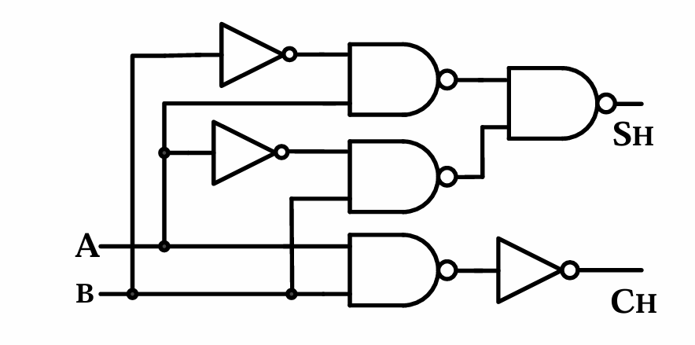
*注意：这个电路有 **两个输入端** ($A, B$) 和 **两个输出端** ($S_H, C_H$)。我们需要分别对这两个输出端进行分析。*

---

#### 步骤 1：由逻辑图写出输出端的逻辑函数式 ✍️

观察给定的电路图，按照信号从左到右（从输入到输出）的流向，逐级写出逻辑表达式：

**1. 首先分析共同的中间节点（输入级）**
*   电路中最上面有一个非门，输入是 $A$，输出是 $\overline{A}$（即 $A'$）。
*   中间有一个非门，输入是 $B$，输出是 $\overline{B}$（即 $B'$）。
*   最下面有一个与非门，输入是 $A$ 和 $B$，输出是 $\overline{A \cdot B}$（即 $(AB)'$）。

**2. 分析第一个输出端 $S_H$ 的路径**
*   $S_H$ 是由一个 **与非门** 产生的，该门有两个输入端：
    *   上方的输入端连接的是一个**与非门**的输出，该与非门的输入是 $\overline{A}$ 和 $B$。所以这个中间节点的输出为：$\overline{\overline{A} \cdot B}$ ，即 $(A'B)'$。
    *   下方的输入端连接的也是一个**与非门**的输出，该与非门的输入是 $A$ 和 $\overline{B}$。所以这个中间节点的输出为：$\overline{A \cdot \overline{B}}$ ，即 $(AB')'$。
*   因此，最终输出 $S_H$ 的逻辑表达式为这两个中间信号先“与”再“非”：
    $$ \boxed{S_H = \Big( (A'B)' \cdot (AB')' \Big)'} $$

**3. 分析第二个输出端 $C_H$ 的路径**
*   $C_H$ 是由一个 **非门** 产生的，该非门的输入连接的是前面提到的、最下面的那个**与非门**的输出，即 $(AB)'$。
*   因此，最终输出 $C_H$ 的逻辑表达式为对 $(AB)'$ 再次求非：
    $$ \boxed{C_H = \Big( (AB)' \Big)'} $$

---

#### 步骤 2：对逻辑函数式进行化简 ✂️

现在，我们分别对 $S_H$ 和 $C_H$ 的表达式使用逻辑代数公式进行化简。

**1. 化简 $S_H$ 的表达式**
*   初始表达式：$S_H = \Big( (A'B)' \cdot (AB')' \Big)'$
*   **第一步：使用德·摩根定理（反演律）脱去最外层大非号**
    根据 $\overline{X \cdot Y} = \overline{X} + \overline{Y}$，将乘变加，非号分配到每一项：
    $$ S_H = \overline{ (A'B)' } + \overline{ (AB')' } $$
*   **第二步：消除双重非号**
    根据非非定律 $\overline{\overline{X}} = X$，上下两层非号互相抵消：
    $$ S_H = A'B + AB' $$
*   **第三步：识别标准逻辑形式**
    我们发现 $A'B + AB'$ 正是 **异或门（XOR）** 的标准逻辑表达式。
    因此，最简形式为：
    $$ \boxed{S_H = A \oplus B} $$

**2. 化简 $C_H$ 的表达式**
*   初始表达式：$C_H = \Big( (AB)' \Big)'$
*   **第一步：消除双重非号**
    直接应用非非定律 $\overline{\overline{X}} = X$：
    $$ \boxed{C_H = AB} $$

---

#### 步骤 3：根据化简后的表达式列出真值表 📊

我们根据化简后的表达式 $S_H = A \oplus B$（相异为1，相同为0）和 $C_H = AB$（全1才为1，否则为0），列出包含两个输入和两个输出的联合真值表。输入 $A, B$ 只有 4 种组合（$00 \sim 11$）。

*   当 $A=0, B=0$ 时： $S_H = 0 \oplus 0 = 0$ ； $C_H = 0 \cdot 0 = 0$
*   当 $A=0, B=1$ 时： $S_H = 0 \oplus 1 = 1$ ； $C_H = 0 \cdot 1 = 0$
*   当 $A=1, B=0$ 时： $S_H = 1 \oplus 0 = 1$ ； $C_H = 1 \cdot 0 = 0$
*   当 $A=1, B=1$ 时： $S_H = 1 \oplus 1 = 0$ ； $C_H = 1 \cdot 1 = 1$

**完整真值表如下**：

| A (加数) | B (被加数) | $S_H$ (本位和) | $C_H$ (向高位的进位) |
| :---: | :---: | :---: | :---: |
| 0 | 0 | **0** | **0** |
| 0 | 1 | **1** | **0** |
| 1 | 0 | **1** | **0** |
| 1 | 1 | **0** | **1** |

---

#### 步骤 4：分析并归纳电路的逻辑功能 💡

为了分析这个真值表代表什么实际意义，我们可以把输入 $A, B$ 想象成两个1位的二进制数字进行**加法运算**。

让我们模拟一下二进制加法（$A + B$）：
*   $0 + 0 = 0$  $\rightarrow$ 结果是 $0$，进位是 $0$。（对应第一行：$S_H=0, C_H=0$）
*   $0 + 1 = 1$  $\rightarrow$ 结果是 $1$，进位是 $0$。（对应第二行：$S_H=1, C_H=0$）
*   $1 + 0 = 1$  $\rightarrow$ 结果是 $1$，进位是 $0$。（对应第三行：$S_H=1, C_H=0$）
*   $1 + 1 = 10$ (二进制的2) $\rightarrow$ 结果当前位是 $0$，向高位进位是 $1$。（对应第四行：$S_H=0, C_H=1$）

**【最终结论】**
我们惊奇地发现，输出 $S_H$ 完美对应了两个1位二进制数相加的**本位和（Sum）**，而输出 $C_H$ 完美对应了相加产生的**向高位的进位（Carry）**。

因此，该组合逻辑电路的功能是：**实现两个1位二进制数的加法运算**。
由于这个电路在做加法时，**只考虑了本位的两个数 $A$ 和 $B$，而没有考虑低位传来的进位信号**，所以这个电路在数字逻辑中有一个专有名称，叫做 **半加器（Half Adder）**。

---

## 4.3 组合逻辑电路的基本设计方法 🛠️

**任务**：根据实际需求（文字描述），设计实现该逻辑功能的最简单逻辑电路。
**设计步骤**（与分析过程正好相反）：
1.  **明确逻辑功能**：抽象出输入、输出变量（定义0和1的含义）。
2.  **列出真值表**：根据文字描述的因果关系填写真值表。
3.  **写出逻辑函数式**：通过真值表写出最小项之和，并用卡诺图或公式进行**化简**。
4.  **画出逻辑图**：根据化简后的表达式（可能需要转换成与非-与非形式以适应特定的器件），画出逻辑图。

> 💡 **设计示例**：
> 设计一个4人投票表决电路，3个或以上赞成（输入1）时通过（输出1），否则不通过（输出0）。
>  列真值表 $\rightarrow$ 写出函数式 $\rightarrow$ 卡诺图化简 $\rightarrow$ 得到 $Y = ABC + ABD + ACD + BCD$ $\rightarrow$ 用门电路实现。

---

## 4.4 若干常用的组合逻辑电路 📦

为使用方便，将常用逻辑功能做成标准化集成电路芯片。

### 4.4.1 加法器 ➕
计算机中所有算术运算的基础。

*   **半加器**：只考虑两个1位二进制数相加，**不考虑**低位进位。
	* 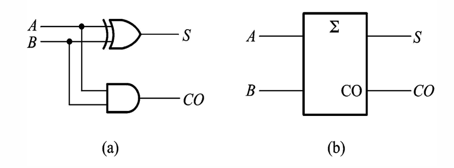
    *   本位和：$S = A \oplus B$
    *   进位输出：$CO = AB$
*   **全加器**：除了加数和被加数，还要考虑**低位传来的进位 ($CI$)**。
	* 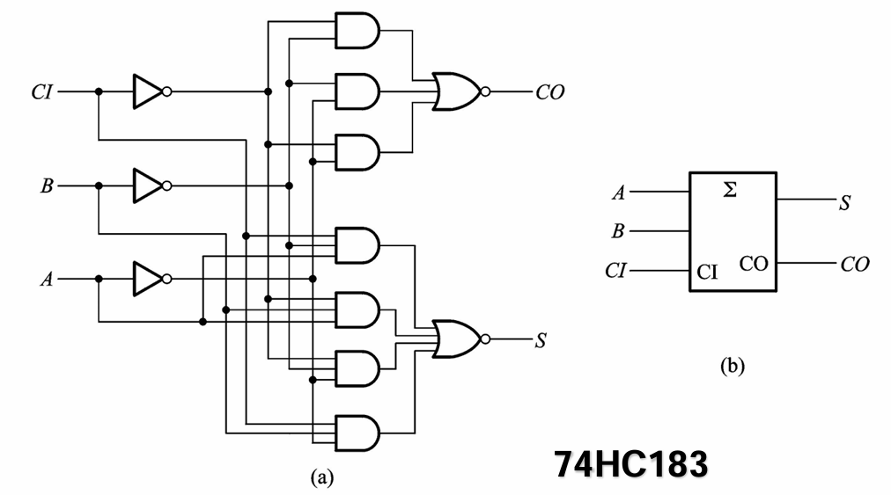
    *   本位和：$S = A \oplus B \oplus CI$
    *   进位输出：$CO = AB + (A \oplus B)CI$
*   **多位加法器**：
	* 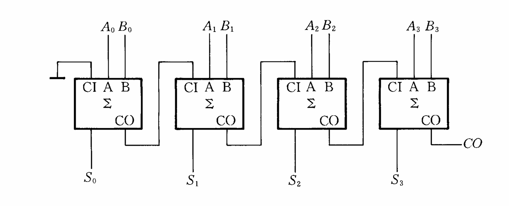
    *   **串行进位加法器**：低位的 $CO$ 接高位的 $CI$。优点是电路简单，缺点是进位信号需要逐级传递，**运算速度慢**。
    *   **超前进位加法器 (Look-ahead carry)**：进位信号不逐级传递，而是运算开始时用额外的复杂逻辑电路直接由 $A, B$ 算出各位的进位信号。代价是电路极其复杂，换取了**极快的运算速度**。（如 74LS283）

### 4.4.2 数值比较器 ⚖️
比较两个多位数值大小。原理是从高位比起，只有高位相等，才比较下一位。
*   **1位数值比较**
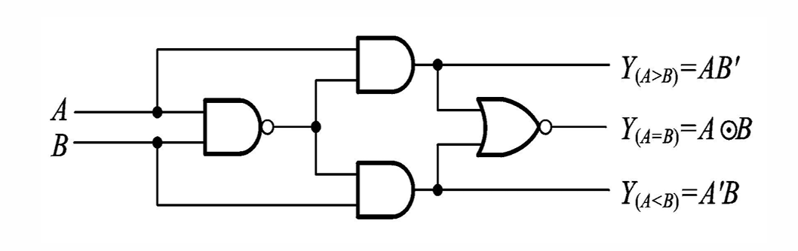
*   **4位数值比较器 (74HC85)**：
 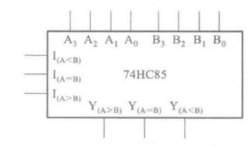
    *   **数据输入端**：$A_3 \sim A_0$, $B_3 \sim B_0$
    *   **级联输入端（扩展端）**：$I_{(A>B)}, I_{(A=B)}, I_{(A<B)}$。用于接收来自更低位比较器的结果。
    *   **输出端**：$Y_{(A>B)}, Y_{(A=B)}, Y_{(A<B)}$
*   **级联使用方法**：低位芯片的输出端直接连到高位芯片的扩展输入端。
* 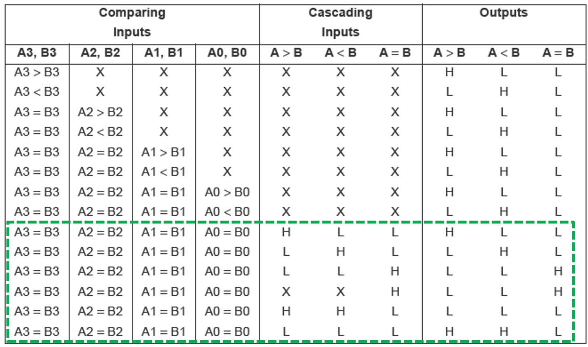
* 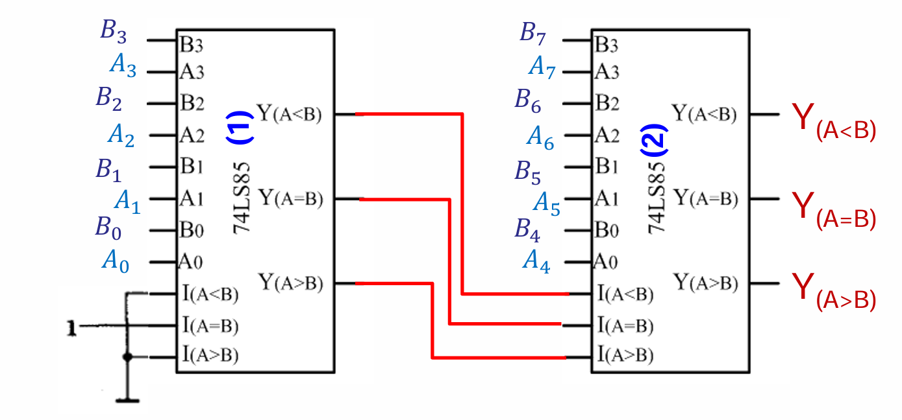

### 4.4.3 数据选择器🔀
功能：从一组输入数据中选出某一个送到输出端。

*   **双4选1数据选择器 (74HC153)**：
	* 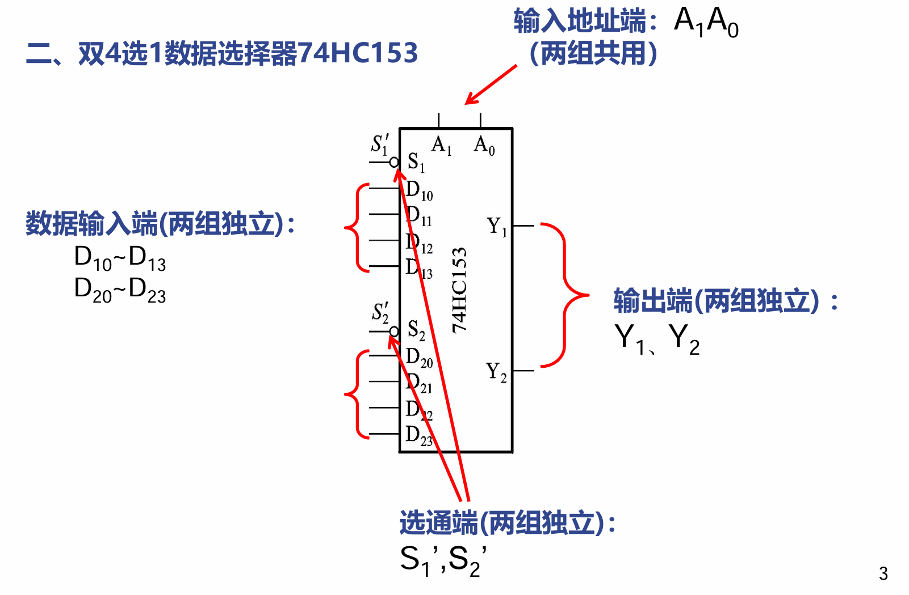
    *   内部有两组独立的 4选1 选择器，共用两个**地址端 ($A_1, A_0$)**。
    *   具有选通端（使能端） $S'$，低电平有效。
    *   逻辑式：$Y = S_1' [D_0(A_1'A_0') + D_1(A_1'A_0) + D_2(A_1A_0') + D_3(A_1A_0)]$
    * 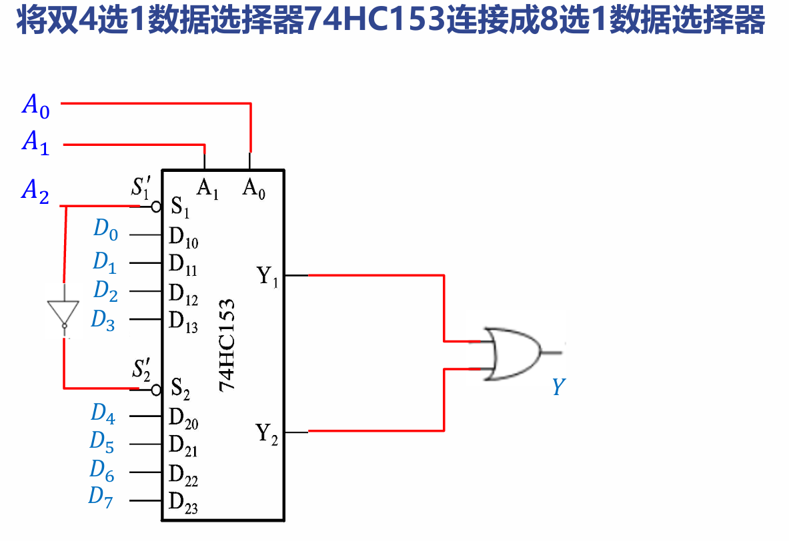
*   **8选1数据选择器 (74LS151)**：
	* 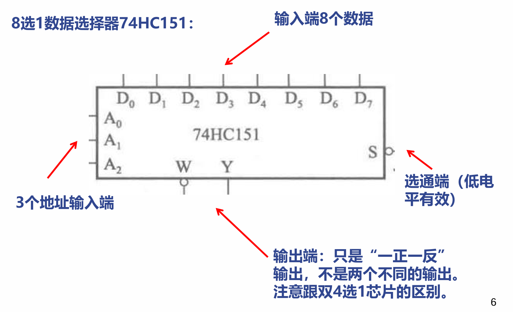
    *   3个地址端（$A_2, A_1, A_0$），8个数据输入端（$D_0 \sim D_7$），一正一反两个输出端（$Y, Y'$）。
    *   逻辑式：$Y = D_0 \cdot m_0 + D_1 \cdot m_1 + \dots + D_7 \cdot m_7$

 🌟 **核心考点：利用数据选择器实现任意组合逻辑函数**
 *   **原理**：数据选择器的输出式本质上就是**最小项之和**的形式。
 *   **步骤**（以8选1实现3变量函数为例）：
     1.  将目标逻辑函数化成**标准与或式（最小项之和）**。
     2.  令输入变量接地址端（如 $A=A_2, B=A_1, C=A_0$）。
     3.  函数式中包含的最小项，其对应的数据输入端**接高电平(1)**；不包含的最小项对应输入端**接低电平(0)**。
* 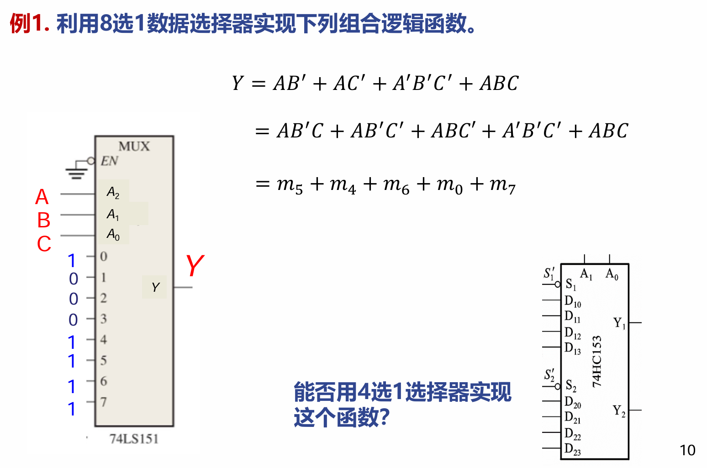
* 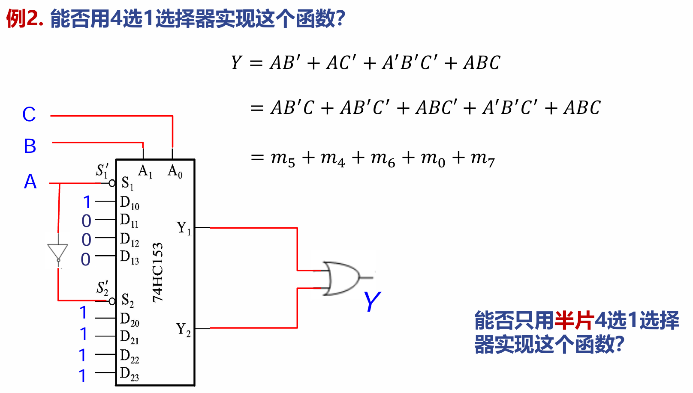
* 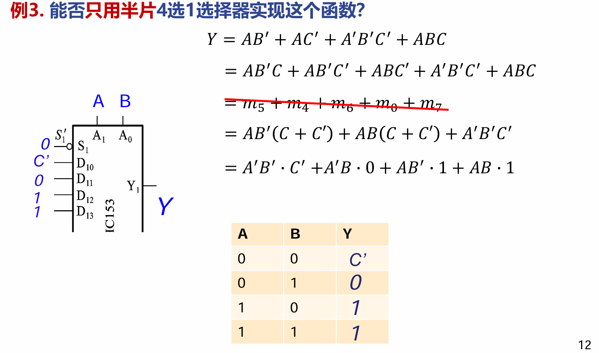

### 4.4.4 译码器 🔡
功能：将输入的二进制代码译成对应的输出高、低电平信号。

#### 一、 二进制译码器
*   **3线-8线译码器 (74HC138)**：
	* 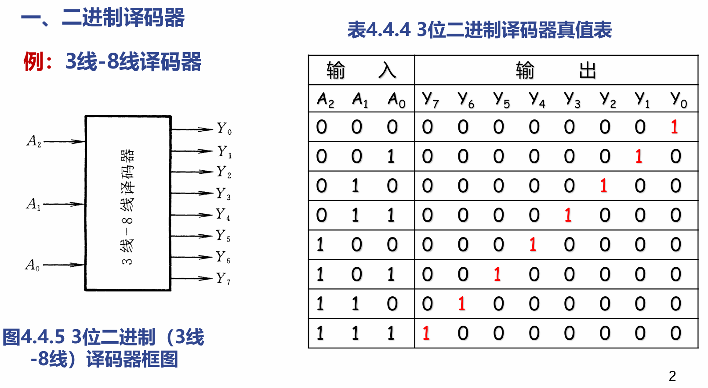
    *   输入：3个地址端 ($A_2, A_1, A_0$)。
    *   输出：8个输出端 ($Y_0' \sim Y_7'$)，**低电平有效**（被选中的端输出0，其余输出1）。
    *   **附加控制端（使能端）**：$S_1, S_2', S_3'$。只有当 $S_1 S_2' S_3' = 100$ 时译码器才工作；否则所有输出全被锁定为高电平(1)。
*   🌟 **核心考点：利用译码器实现任意组合逻辑函数**
    *   **原理**：译码器的每个输出端对应一个最小项的反码 $Y_i' = m_i'$。
    *   **步骤**：
        1.  将目标逻辑函数写成**最小项之和**的形式。
        2.  根据反演律，$Y = m_1 + m_2 + m_3 = (m_1' \cdot m_2' \cdot m_3')'$。
        3.  将函数包含的最小项对应的译码器输出端（$Y_1', Y_2', Y_3'$），统一接入一个**与非门**，该与非门的输出即为所求逻辑函数。
    
    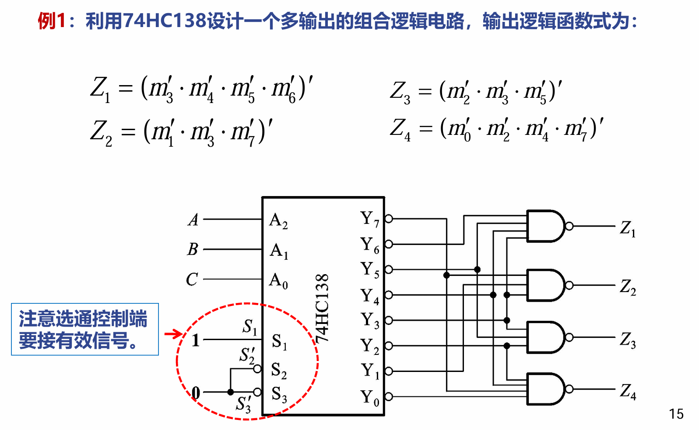
*   **译码器的级联**：利用使能端，可将两片 3线-8线译码器扩展为一片 4线-16线译码器（第4个变量接使能端）。
	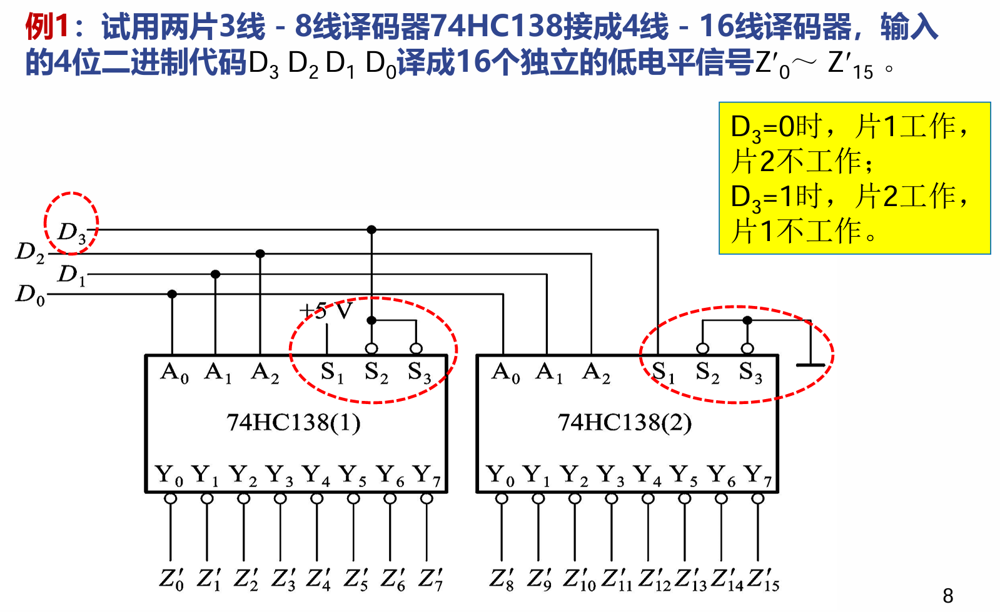
#### 二、 二-十进制译码器 / 显示译码器
*   **显示译码器 (7448)**：将 BCD 码转化为七段数码管（a~g）能识别的高低电平。
*   **附加控制端**：
    *   $LT'$ (灯测试)：接0时，无论输入什么，数码管所有段全亮（显示"8"），用于检查数码管是否损坏。
    *   $RBI'$ (灭零输入)：接0且输入为 0000 时，数码管熄灭不显示 0（常用于多位数字消隐前导零）。
    *   $BI'/RBO'$ (灭灯/灭零输出)：接0时强制熄灭数码管。

---

## 4.9 组合逻辑电路中的竞争-冒险现象 ⚠️

*   **竞争**：门电路的两个输入信号**同时向相反的逻辑电平跳变**的现象。
*   **冒险 (竞争-冒险)**：由于信号路径延迟不同，导致竞争信号到达时间不一致，从而在电路输出端产生**错误的尖峰脉冲**（毛刺）现象。
*   **判断方法（代数法）**：
    *   如果逻辑函数在特定条件下可化简为 $\boxed{Y = A + A'}$（有产生低电平0尖峰的危险）或 $\boxed{Y = A \cdot A'}$（有产生高电平1尖峰的危险），则存在竞争冒险。
    * 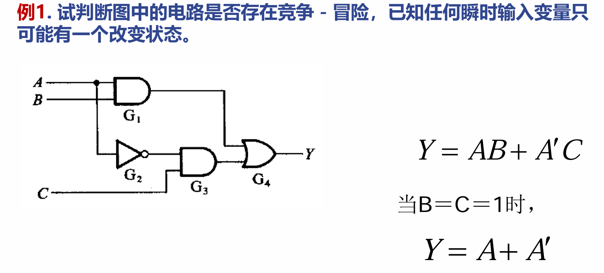
*   **消除方法**：
    1.  **接入滤波电容**：在输出端接小电容吸收尖峰脉冲（最简单物理方法）。
    2.  **引入选通脉冲**：等电路状态稳定后，再给一个选通信号让输出生效。
    3.  **修改逻辑函数（增加冗余项）**：在卡诺图中，将相切但未被同一个圈包含的“1”用一个冗余的圈包围起来。例如原式 $Y = AB + A'C$，存在冒险，增加冗余项 $BC$ 变为 $Y = AB + A'C + \color{red}{BC}$ 即可消除。
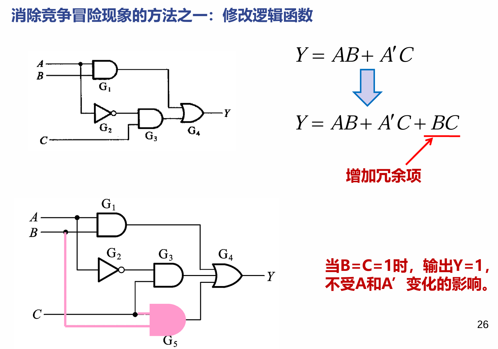