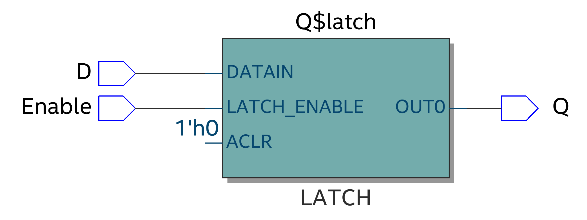
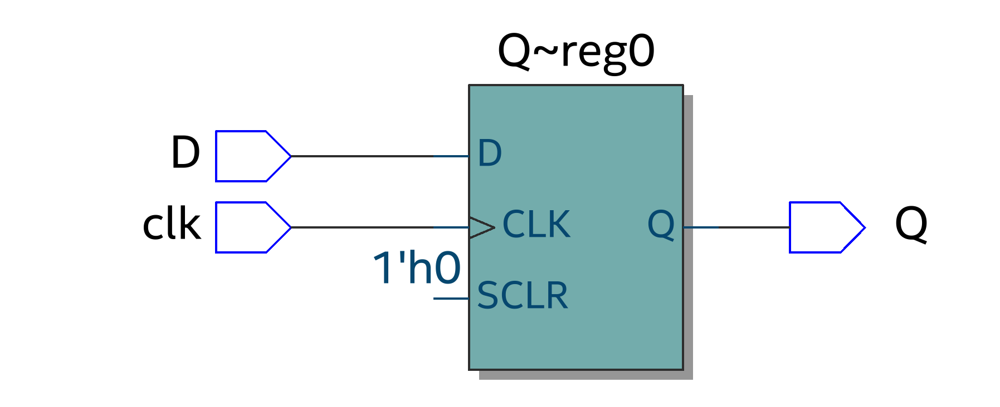
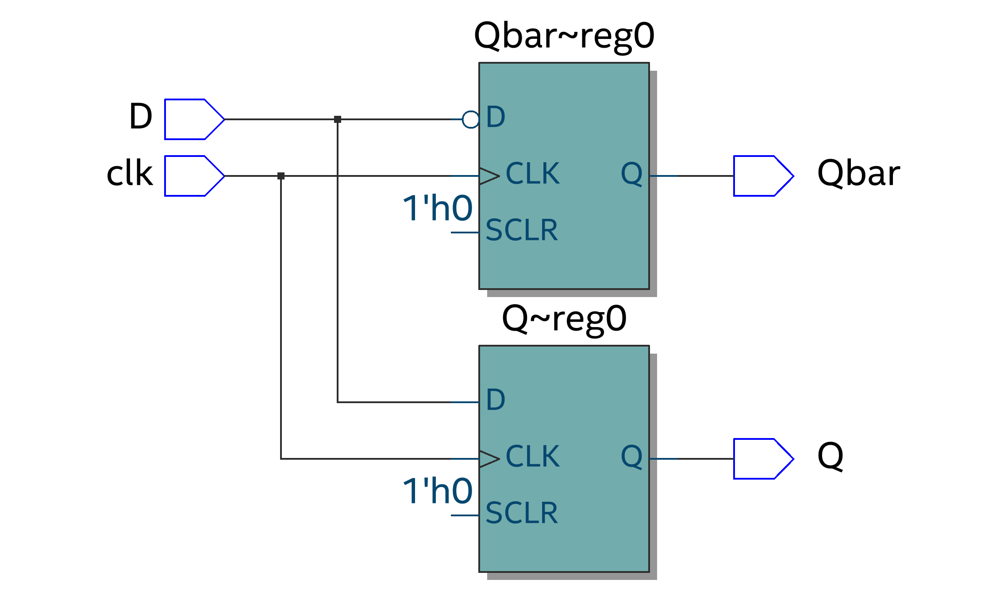
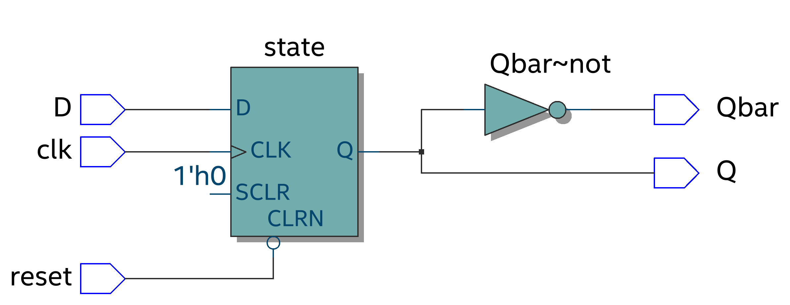
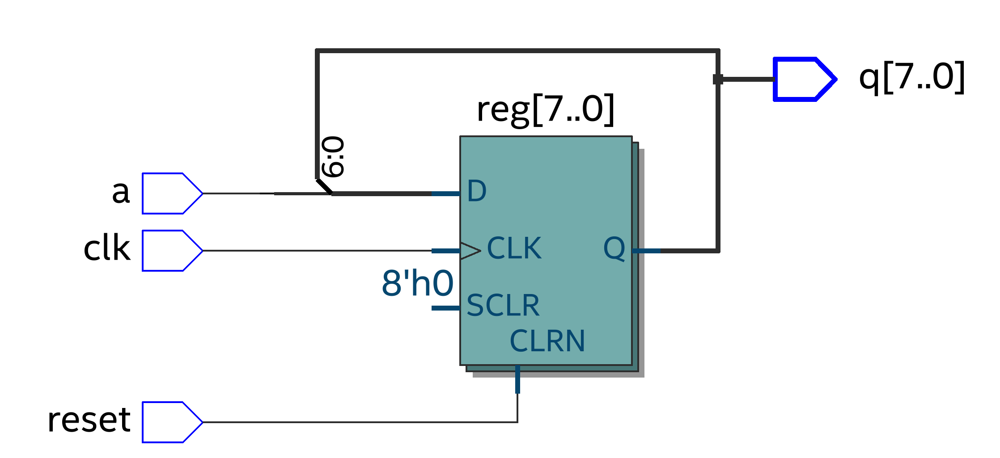
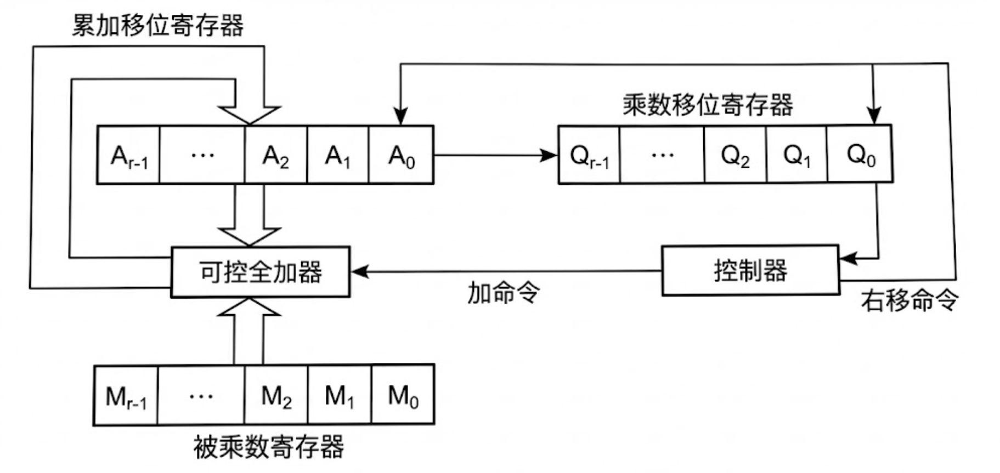
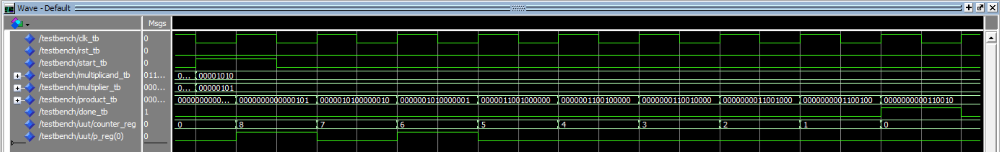

### 📜 本章内容

*    📜 **概述**
*    🔒 **锁存器的设计**
*    ⏰ **触发器的设计**
*    📦 **寄存器的设计**
*    🔢 **计数器的设计**
*    ✖️ **乘法器的设计**

---

## 一、概述 🧐

数字电路根据其逻辑功能特点，可以分为两大类：组合逻辑电路和时序逻辑电路。

### 什么是时序逻辑电路？

时序逻辑电路是一种其<font color="orange">**输出不仅取决于当前的输入，还与电路之前的状态（原始状态）有关**</font>的电路。

*   **结构上**：它由<font color="orange">**组合逻辑电路**</font>和<font color="orange">**存储电路**</font>两部分组成。存储电路的输出会作为反馈信号，再次输入到组合逻辑电路中，从而实现了“记忆”功能。
*   **逻辑上**：它引入了**现态**（当前状态）和**次态**（下一个状态）的概念。


#### 逻辑关系表达式

时序逻辑电路的行为可以通过一组方程来描述：

$$
\boxed{
    \begin{cases}
        z_m = f_m(x_1, \dots, x_n, q_1^n, \dots, q_j^n) & \text{-- 输出方程} \\\\\\
        y_k = g_k(x_1, \dots, x_n, q_1^n, \dots, q_j^n) & \text{-- 驱动方程} \\\\\\
        q_j^{n+1} = h_j(y_1, \dots, y_k, q_1^n, \dots, q_j^n) & \text{-- 状态方程}
    \end{cases}
}
$$

其中，$x$ 是输入，$z$ 是输出，$q^n$ 是现态，$q^{n+1}$ 是次态，$y$ 是存储电路的激励（驱动信号）。

### 时序电路的分类

#### 1. 按触发器动作特点分

*   **同步时序逻辑电路** ⏱️
    *   所有存储元件（触发器）的状态变化都在**同一个时钟信号**的有效边沿同步发生。
    *   这是目前绝大多数数字系统采用的设计方式。
*   **异步时序逻辑电路** 🌊
    *   没有统一的时钟信号，各个存储元件的状态变化有先有后，不是同时发生的。
    *   设计复杂，通常只用于小型、特定的应用。

#### 2. 按输出信号的特点分

*   **米里 (Mealy) 型**
    *   输出不仅与存储电路的**当前状态 (Q)** 有关，还与**外部输入 (X)** 直接相关。
*   **摩尔 (Moore) 型**
    *   输出**仅**与存储电路的**当前状态 (Q)** 有关，与当前输入无直接关系。

### 同步时序逻辑电路详解

*   **优点** 👍：
    *   设计简单、可靠。电路中的所有运算必须在一个时钟周期内完成。
*   **缺点** 👎：
    *   **功耗大**：时钟信号需要驱动电路中所有的触发器，无论其是否需要更新状态。
    *   **频率受限**：最高工作频率由电路中<font color="orange">最慢的逻辑路径（关键路径）</font>决定。

---

## 二、锁存器的设计 🔒

<font color="orange">**锁存器 (Latch)**</font> 是一种对**电平敏感**的存储元件。当使能信号有效时，输出会跟随输入变化；当使能信号无效时，输出保持不变。

### 1. RS锁存器

由两个交叉耦合的与非门构成。

*   **电路结构图**


*   **真值表**

| S | R | Q | Q' | 状态 |
| :-: | :-: | :-: | :-: | :--- |
| 0 | 0 | 1 | 1 | **禁用** |
| 0 | 1 | 1 | 0 | 置位 (Set) |
| 1 | 0 | 0 | 1 | 复位 (Reset) |
| 1 | 1 | Q | Q' | **保持** |

*   **VHDL描述**
    ```vhdl
    -- 注意: 这里的VHDL代码与上图电路的逻辑行为(与非门)略有不同
    -- 它是基于行为描述的，并且(0,0)是无效态。
    -- 实际电路中，与非门RS锁存器是低电平有效。
    case rs is
        when "00" => Q<='1'; Qbar<='1'; -- 无效态
        when "01" => Q<='1'; Qbar<='0'; -- 置位
        when "10" => Q<='0'; Qbar<='1'; -- 复位
        when others=>null;              -- 保持 (R&S = "11")
    end case;
    ```
    💡 **注意点**：在顺序结构的 `case` 或 `if` 语句中，`null` 状态会指示综合器生成存储元件（锁存器或触发器），它等同于并行结构中的 `unaffected` 关键字。

### 2. D锁存器

D锁存器解决的RS锁存器输入不确定的问题。

*   **功能**：当使能端 `Enable` 为高电平时，输出 `Q` 跟随输入 `D` 的值；当 `Enable` 为低电平时，`Q` 保持之前的值不变。

*   **VHDL描述**
    ```vhdl
    library ieee;
    use ieee.std_logic_1164.all;

    entity D_latch is
        port ( D, Enable: in  std_logic;
               Q:         out std_logic);
    end D_latch;

    architecture behav of D_latch is
    begin
        process(D, Enable)
        begin
            if (Enable='1') then
                Q <= D;
            end if;
            -- 此处没有 else 分支
        end process;
    end behav;
    ```
    ⚠️ **注意点**：
    *   在VHDL中，一个<font color="orange">不完整的 `if` 语句</font>（即缺少 `else` 分支）会综合成一个锁存器，因为当条件不满足时，信号需要保持原来的值。
    *   该进程的**敏感参数列表**中包含了 `D` 和 `Enable`，综合后会形成一个电平敏感的锁存器。

*   **仿真波形**：从仿真波形可以看出，只要 `Enable` 是高电平，`Q` 就会像一根导线一样直通 `D` 的值。

---

## 三、触发器的设计 ⏰

<font color="orange">**触发器 (Flip-Flop)**</font> 是一种对**时钟边沿敏感**的存储元件。数据的锁存只在时钟的上升沿或下降沿的瞬间发生。

### 1. D触发器

D触发器是最常用、最基本的触发器。

*   **功能**：在时钟 `clk` 的**上升沿**（或下降沿）到来时，将输入 `D` 的值锁存到输出 `Q`，并在下一个有效的时钟沿到来之前保持不变。

*   **VHDL描述 (上升沿触发)**

    有多种等效的描述方法：

    **方法一：使用 `event` 属性 (最标准)**
    ```vhdl
   -- 1. 库声明 (Library Declaration)
LIBRARY IEEE;
USE IEEE.std_logic_1164.ALL; -- 使用标准逻辑类型 std_logic

-- 2. 实体声明 (Entity Declaration)
ENTITY d_flip_flop IS
    PORT (
        clk : IN  std_logic; -- 时钟输入
        D   : IN  std_logic; -- 数据输入
        Q   : OUT std_logic  -- 数据输出
    );
END d_flip_flop;

-- 3. 架构体 (Architecture Body)
ARCHITECTURE Behavioral OF d_flip_flop IS
BEGIN

    PROCESS(clk)
    BEGIN
        -- 检测时钟上升沿：clk 发生变化(event) 且 当前值为 '1'
        IF (clk'event AND clk = '1') THEN
            Q <= D; -- 在上升沿将 D 的值锁存到 Q
        END IF;
    END PROCESS;

END Behavioral;
    ```
    
    **方法二：使用 `rising_edge` 函数 (推荐)**
    ```vhdl
    -- 需要 use ieee.std_logic_1164.all;
    process(clk)
    begin
        if rising_edge(clk) then
            Q <= D;
        end if;
    end process;
    ```
    **方法三：使用 `wait until` (多用于测试平台)**
    ```vhdl
    process
    begin
        wait until rising_edge(clk);
        Q <= D;
    end process;
    ```

*   **仿真波形**：从仿真波形可以看出，`Q` 的值只在 `clk` 的上升沿发生跳变，去采样当时 `D` 的值。在时钟的其他时刻，无论 `D` 如何变化，`Q` 都保持不变。

### 2. 带有Q非和异步复位的D触发器

在实际应用中，触发器通常还带有反向输出 `Qbar` 和异步复位 `reset` 信号。

🚨 **易错点：如何正确描述Q和Qbar？**

**错误描述** ❌
```vhdl
IF rising_edge(clock) THEN
    Q    <= D;
    Qbar <= NOT D; -- 错误！
END IF;
```

这样描述会被综合器认为是两个独立的寄存器，一个输出 `D`，一个输出 `NOT D`，浪费资源且不符合原意。

**正确描述（信号法）** ✅
使用一个内部信号 `state` 来存储状态，然后在进程外将 `state` 和 `NOT state` 分别赋给 `Q` 和 `Qbar`。
```vhdl
architecture sig of D_FF is
    signal state: std_logic;
begin
    process(clk, reset)
    begin
        if (reset='0') then
            state <= '0';
        elsif rising_edge(clk) then
            state <= D;
        end if;
    end process;

    Q    <= state;
    Qbar <= not state;
end sig;
```

**正确描述（变量法）** ✅
使用一个进程内的变量 `state` 存储状态，并在进程结束前将值赋给输出端口。
```vhdl
architecture var of D_FF is
begin
    process(clk, reset)
        variable state: std_logic;
    begin
        if (reset='0') then
            state := '0';
        elsif rising_edge(clk) then
            state := D;
        end if;
        Q <= state;
        Qbar <= not state;
    end process;
end var;
```
💡 **点评**：当 `state` 定义为<font color="orange">变量</font>时，其有效范围仅在 `process` 内部，因此对 `Q` 和 `Qbar` 的赋值语句也必须放在 `process` 内部。
### 3. D触发器的数量
最核心的判断标准只有一条：**只有在时钟沿（Clock Edge）控制下的信号赋值，才会生成触发器。**
#### （1）寻找“时钟沿”包裹区域

首先，找到所有的 `PROCESS`，并看里面是否有边沿检测语句。
- `IF rising_edge(clk) THEN ...`
- `IF clk'event AND clk='1' THEN ...`
- `WAIT UNTIL rising_edge(clk);`
**原则：** 只有被这些语句**包裹在内部**的赋值操作，才**可能**生成 DFF。写在这些语句外面的（或者是没有时钟的 PROCESS），生成的都是组合逻辑（门电路）或锁存器（Latch）。
#### （2）数“左边的信号”的位宽
在时钟沿内部，找到所有被赋值的信号（位于 `<=` 左边的变量）。
- **公式：** `DFF 数量 = 信号 A 的位宽 + 信号 B 的位宽 + ...`
```vhdl
SIGNAL a : std_logic;                     -- 1位
SIGNAL b : std_logic_vector(7 DOWNTO 0);  -- 8位
SIGNAL c : std_logic_vector(3 DOWNTO 0);  -- 4位

PROCESS(clk)
BEGIN
    IF rising_edge(clk) THEN
        -- 【生成 1 个 DFF】
        a <= '1';

        -- 【生成 8 个 DFF】
        b <= "00001111";

        -- 【生成 0 个 DFF】
        -- c 在这里没有被赋值，所以 c 不会产生触发器（除非在这个 Process 的其他分支赋值）
    END IF;
    
    -- 【生成 0 个 DFF】
    -- 这里的赋值在 rising_edge 之外，是组合逻辑（直通线或逻辑门）
    d <= e; 
END PROCESS;
```
在这个例子中，预判的 DFF 总数 = 1 (a) + 8 (b) = **9 个**。
#### （3）注意三个“陷阱”

- **陷阱 A：变量 (Variable)** 如果在 `PROCESS` 内部定义了 `VARIABLE`，且该变量**先赋值、后使用**（作为中间计算），它通常会被综合成连线，**不消耗 DFF**。
    - _例外：_ 如果变量在赋值前被读取（Read-before-Write），或者变量要把值保持到下一个周期，它也会变成 DFF。
        
- **陷阱 B：条件分支不完整** 在时序逻辑（`rising_edge` 内部）中，即使你没有写 `ELSE`，或者没有覆盖所有 `CASE`，**保持原值**也是触发器的天然特性，所以**依然会生成 DFF**。这与组合逻辑（生成 Latch）不同。
	- 在 **组合逻辑** 中，不写 `ELSE` = **生成锁存器 (Latch)** $\rightarrow$ **大忌，通常是错误**。
	- 在 **时序逻辑** (即 `rising_edge` 内) 中，不写 `ELSE` = **保持原值 (Keep)** $\rightarrow$ **这正是 D 触发器的核心功能，是正常的**。
    
- **陷阱 C：同一个信号在多处赋值** 一个信号只能在一个 Process 中被驱动。如果你在一个 `rising_edge` 里写了 `a <= '1';` 又写了 `a <= '0';`，综合器会按最后一条执行，这仍然只算 **1 个** DFF（位宽为1）。
### 4. JK触发器和T触发器

*   **JK触发器**：功能比D触发器更丰富，可以实现保持、置位、复位和**翻转**功能。
*   **T触发器**：功能最简单，当输入 `T=1` 时，每个时钟有效沿输出状态**翻转**一次；当 `T=0` 时，输出保持不变。常用于计数器和分频器。

它们的VHDL描述与带异步复位的D触发器类似，只是在 `elsif rising_edge(clock)` 分支内部根据其各自的真值表逻辑进行赋值。

⚠️ **注意点**：在VHDL中，`CASE` 语句必须是完备的。对于JK触发器，其输入 `jk` 组合有四种情况(`"00"`, `"01"`, `"10"`, `"11"`)，因此在描述时需要加上 `when others => null;` 来覆盖所有可能，以确保逻辑的严谨性。

---

## 四、寄存器的设计 📦

<font color="orange">**寄存器**</font>用于存储一组（多位）二进制数据。一个N位寄存器可以由N个触发器构成。

### 1. 多位寄存器

一个D触发器就是一位寄存器。多位寄存器由多个D触发器并联，并共享同一个时钟和复位信号。

*   **VHDL描述**：
    使用 `std_logic_vector` 类型来定义多位数据端口。使用 `generic` 参数可以方便地定义寄存器的位宽。
```vhdl
LIBRARY ieee;
USE ieee.std_logic_1164.ALL;
ENTITY reg IS
    GENERIC (
        n : natural := 4 -- 定义一个默认位宽为 4 的泛型参数
    );
    PORT (
        D     : IN  std_logic_vector(n-1 DOWNTO 0); -- 数据输入
        clock : IN  std_logic;                      -- 时钟输入
        reset : IN  std_logic;                      -- 复位输入
        Q     : OUT std_logic_vector(n-1 DOWNTO 0)  -- 数据输出
    );
END reg;
ARCHITECTURE Behavioral OF reg IS
BEGIN
    PROCESS(clock, reset)
    BEGIN
        -- 异步复位判断：优先级最高，与时钟无关
        IF (reset = '0') THEN
            Q <= (OTHERS => '0'); -- 将 Q 的所有位赋为 '0'
        -- 时钟上升沿触发：正常数据锁存
        ELSIF rising_edge(clock) THEN
            Q <= D;
        END IF;
    END PROCESS;

END Behavioral;
```

- **`OTHERS`**：关键字，表示“所有未被显式指定的位”。在这里，因为没有指定具体的某一位（比如没有写 `0 => '1'`），所以它代表“所有的位”。**例如**：最低位是 1，其余是 0：`Q <= (0 => '1', OTHERS => '0');` (这在写计数器初始值时很有用)。

### 2. 移位寄存器

移位寄存器中的数据可以在时钟脉冲的作用下，逐位向左或向右移动。

*   **串进并出 (SIPO) 移位寄存器**
    数据从串行输入端 `a` 一位一位地移入，同时所有位的数据可以从并行输出端 `q` 读出。
*   **VHDL描述 (左移)**
    使用**并置操作符 `&`** 来实现数据的移位和拼接。
```vhdl
library IEEE;
use IEEE.STD_LOGIC_1164.ALL;

entity shift_register is
    Generic ( 
        n : integer := 8  -- 默认位宽为 8
    );
    Port ( 
        clk   : in  STD_LOGIC;                     -- 时钟信号
        reset : in  STD_LOGIC;                     -- 复位信号
        a     : in  STD_LOGIC;                     -- 串行输入 
        q     : out STD_LOGIC_VECTOR (n-1 downto 0) -- 并行输出 
    );
end shift_register;

architecture Behavioral of shift_register is
begin
    process(clk, reset)
        -- 定义一个变量 reg 来存储寄存器的状态
        variable reg : std_logic_vector(n-1 downto 0);
    begin
        -- 异步复位逻辑
        if reset = '1' then
            reg := (others => '0'); -- 清零
	    -- 上升沿触发
        elsif rising_edge(clk) then
	        -- 左移
            reg := reg(n-2 downto 0) & a;  
            -- 右移
            -- reg := a & reg(n-1 downto 1);
        end if;
        q <= reg;
    end process;
end Behavioral;
```

---

## 五、计数器的设计 🔢

<font color="orange">**计数器**</font>是实现计数、分频和定时等功能的基本时序电路。

### 计数器的实现

#### 1. 使用 “+” 运算符 (行为描述)
这是最简单直观的方法。需要包含 `ieee.std_logic_unsigned.all` 库。
```vhdl
LIBRARY ieee;
USE ieee.std_logic_1164.ALL;
-- 【关键点】引入这个库，才能直接对 std_logic_vector 进行 +1 操作
USE ieee.std_logic_unsigned.ALL; 

ENTITY counter IS
    GENERIC (
        n : integer := 8  -- 定义计数器的位宽，默认为 8 位
    );
    PORT (
        clk   : IN  std_logic;                     -- 时钟
        reset : IN  std_logic;                     -- 复位
        count : OUT std_logic_vector(n-1 DOWNTO 0) -- 计数输出
    );
END counter;

ARCHITECTURE Behavioral OF counter IS
	-- 定义一个内部信号，用于读取当前值并进行加法 
	-- 因为输出端口 'count' 在实体内部通常只能写，不能读
    SIGNAL temp_count : std_logic_vector(n-1 DOWNTO 0);
BEGIN
    PROCESS (clk, reset)
    BEGIN
        IF reset = '0' THEN
            temp_count <= (OTHERS => '0'); 
        -- 正常计数：在时钟上升沿加 1
        ELSIF rising_edge(clk) THEN
            temp_count <= temp_count + 1;
        END IF;
    END PROCESS;
    count <= temp_count;
END Behavioral;
```
#### 2. 结构化描述 (使用T触发器级联)
使用T触发器（置T=1时为翻转模式）可以构成一个二进制计数器。前一级的输出作为后一级的时钟（异步）或时钟使能（同步）。课件中展示的是一个**异步纹波计数器**。

*   **VHDL描述 (使用 `generate` 语句)**
    ```vhdl
    -- g0 是循环标签
    g0: for i in 0 to n-1 generate
        -- T1 是元件例化标签
        -- 将T触发器元件T_FF例化n次
        T1: T_FF port map ('1', carry(i), reset, count(i), carry(i+1));
    end generate g0;
    ```

⚠️ **注意点：纹波计数器的延迟**
在异步（串行进位）计数器中，进位信号是逐级传递的，这会产生延迟。例如，当计数器从 `011` 变为 `100` 时，状态变化不是瞬时的，中间可能会短暂出现 `010` 等毛刺状态。这是异步设计的固有缺点。

---

## 六、乘法器的设计 ✖️

### 无符号数乘法器

采用“<font color="orange">**移位相加**</font>”的算法。

*   **过程**：逐位检查乘数的每一位。如果当前位为 `1`，则将被乘数加到部分积累加器上。然后，被乘数左移一位（或累加器右移一位），乘数右移一位。循环此过程直到乘数的所有位都被检查完毕。
*   **硬件结构**：通常由一个加法器、一个存放部分积的累加寄存器和一个存放乘数的移位寄存器组成。
```vhdl
library ieee;
use ieee.std_logic_1164.all;
use ieee.numeric_std.all;

entity unsigned_multiplier is
    generic (
        R : integer := 8  -- 定义操作数位宽 (r)
    );
    port (
        -- 控制信号
        clk             : in  std_logic;
        rst             : in  std_logic;
        start           : in  std_logic; -- 开始信号，高电平脉冲
        
        -- 数据输入
        multiplicand_i  : in  std_logic_vector(R-1 downto 0); -- 被乘数 (M)
        multiplier_i    : in  std_logic_vector(R-1 downto 0); -- 乘数 (Q)
        
        -- 数据输出
        product_o       : out std_logic_vector(2*R-1 downto 0); -- 乘积 (P)
        done_o          : out std_logic
    );
end entity unsigned_multiplier;

architecture behavioral of unsigned_multiplier is

    -- 定义状态机状态
    type state_t is (S_IDLE, S_MULTIPLY, S_DONE);
    signal state_reg, state_next : state_t;

    -- 内部寄存器
    signal p_reg        : unsigned(2*R-1 downto 0);
    signal m_reg        : unsigned(R-1 downto 0); 
    signal counter_reg  : integer range 0 to R;

begin

    -- ===================================================================
    --  同步进程: 更新所有寄存器状态
    -- ===================================================================
    process (clk, rst)
        variable a_part      : unsigned(R-1 downto 0);
        variable sum_result  : unsigned(R downto 0);
    begin
        if rst = '1' then
            state_reg   <= S_IDLE;
            p_reg       <= (others => '0');
            m_reg       <= (others => '0');
            counter_reg <= 0;
        elsif rising_edge(clk) then
            state_reg   <= state_next;
            
            if state_reg = S_IDLE and start = '1' then
                p_reg(2*R-1 downto R) <= (others => '0');
                p_reg(R-1 downto 0)   <= unsigned(multiplier_i);
                m_reg                 <= unsigned(multiplicand_i);
                counter_reg           <= R;
            elsif state_reg = S_MULTIPLY then
                
                -- 从 p_reg 中提取 A 部分
                a_part := p_reg(2*R-1 downto R);
                
                -- 检查 P 的最低位
                if p_reg(0) = '1' then
                    -- 执行 A = A + M
                    sum_result := ('0' & a_part) + m_reg;
                else
                    -- A 不变
                    sum_result := ('0' & a_part);
                end if;
                
                -- 执行算术右移
                p_reg <= sum_result & p_reg(R-1 downto 1);
                
                -- 计数器减一
                counter_reg <= counter_reg - 1;
            end if;
        end if;
    end process;
    
    -- ===================================================================
    --  组合逻辑进程: 控制状态转换和输出
    -- ===================================================================
    process (state_reg, start, counter_reg)
    begin
        -- 默认输出
        done_o <= '0';
        state_next <= state_reg;

        case state_reg is
            when S_IDLE =>
                if start = '1' then
                    state_next <= S_MULTIPLY;
                end if;
                
            when S_MULTIPLY =>
                if counter_reg = 1 then
                    state_next <= S_DONE;
                end if;
                
            when S_DONE =>
                done_o <= '1';
                if start = '0' then
                    state_next <= S_IDLE;
                end if;
                
        end case;
    end process;

    -- 将最终结果 p_reg 赋值给输出端口
    product_o <= std_logic_vector(p_reg);

end architecture behavioral;
```
*  $10*5$ **仿真结果**：


---

## 七、本章总结 🎓

1.  **锁存器 vs 触发器** 🔍
    *   **D锁存器**是<font color="orange">电平敏感</font>的。VHDL中，不完整的 `if` 语句且敏感列表中包含数据输入 `D` 时，会综合成锁存器。
    *   **D触发器**是<font color="orange">边沿敏感</font>的。VHDL中，不完整的 `if` 语句，但敏感列表中**不包含**数据输入 `D`（只包含时钟和异步控制信号）时，会综合成触发器。

2.  **时钟上升沿检测** 🕒
    *   标准方法：`Clock'event and clock='1'`
    *   函数方法：`rising_edge(clock)` (推荐)
    *   `wait` 语句：`wait until rising_edge(clock)`

3.  **VHDL设计技巧** ✨
    *   为了避免无意中生成多余的寄存器（例如同时对 `Q` 和 `Qbar` 在时钟边沿下赋值），推荐使用一个内部的**信号 (signal)** 或**变量 (variable)** 来代表触发器的状态。
    *   **信号**的赋值在进程外，是并行语句。
    *   **变量**的有效范围在进程内，其赋值语句也必须在进程内。