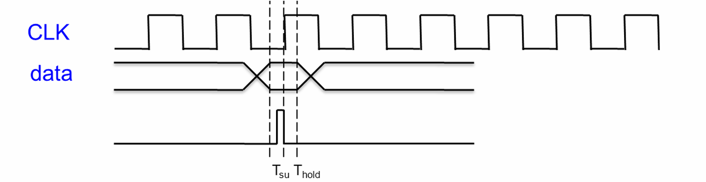
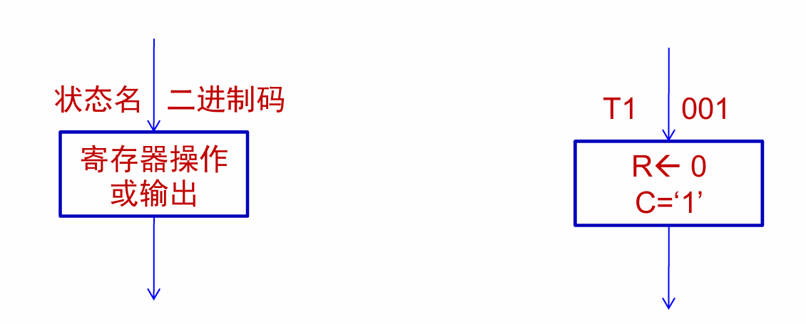

## 一、时序电路的概念

### 1.1 时序电路与组合电路的核心区别


*   **组合电路**：任一时刻的稳定输出**仅取决于当时的输入**。
*   **时序电路**：任一时刻的稳定输出**不仅取决于当时的输入，还取决于电路原来的状态**（即与过去的输入情况有关）。

### 1.2 时序电路结构示例 — 三位计数器
#### 设计要求

*   由时钟上升沿触发，计数范围为 000~111，计到 111 后重新回到 000。
*   采用上升沿触发的 D 触发器作为状态寄存器，D 触发器真值表如下：

| D | C | Q⁺ |
| - |---|---|
| 0 | 上升沿 | 0 |
| 1 | 上升沿 | 1 |
| - | 0 | Q |
| - | 1（非上升沿） | Q |

#### 三位计数器真值表

设 A、B、C 分别表示 3 个位，A⁺、B⁺、C⁺ 表示次态，真值表如下：

| A | B | C | A⁺ | B⁺ | C⁺ |
| - | - | - | -- | -- | -- |
| 0 | 0 | 0 | 0 | 0 | 1 |
| 0 | 0 | 1 | 0 | 1 | 0 |
| 0 | 1 | 0 | 0 | 1 | 1 |
| 0 | 1 | 1 | 1 | 0 | 0 |
| 1 | 0 | 0 | 1 | 0 | 1 |
| 1 | 0 | 1 | 1 | 1 | 0 |
| 1 | 1 | 0 | 1 | 1 | 1 |
| 1 | 1 | 1 | 0 | 0 | 0 |

#### 次态逻辑方程推导

通过卡诺图化简，得出次态逻辑方程：

*   $\boxed{A^+ = A \cdot \overline{B} \cdot \overline{C} + \overline{A} \cdot B \cdot C}$
*   $\boxed{B^+ = B \cdot \overline{C} + \overline{B} \cdot C}$
*   $\boxed{C^+ = \overline{C}}$

#### 三位计数器结构
由 3 个 D 触发器（状态寄存器）和次态逻辑电路组成，CP 为时钟信号，A、B、C 为现态输出，A⁺、B⁺、C⁺ 为次态输入。

## 二、时序电路与状态机的关系
### 2.1 状态机的本质
状态机是对**具有逻辑顺序或时序规律事件的描述方法**，所有符合该特征的事件（如同步时序逻辑电路）都可用状态机描述。

### 2.2 状态机的基本要素

1.  **状态（状态变量）**：划分逻辑顺序和时序规律的核心，是电路当前的工作模式。
2.  **输出**：在某个特定状态下发生的事件（如信号灯亮灭、计数器数值）。
3.  **输入**：触发状态转移的条件，部分简单状态机可无输入，状态转移固定。

### 2.3 日常生活中的状态机示例 — 学生在校生活

| 地点 | 功能 | 触发条件 |
|---|---|---|
| 宿舍 | 睡觉 | 周末 |
| 教室 | 学习 | 非周末 |
| 花前月下 | 休闲 | 周末下午 7 点 |
| 食堂 | 吃饭 | 非周末下午 6 点 / 周末特定时间 |
| 体育馆 | 运动 | 非周末下午 2 点 |

### 2.4 描述时序电路的状态机组成

1.  **组合逻辑**：分为次态逻辑和输出逻辑
    *   **次态逻辑**：确定状态机的下一个状态。
    *   **输出逻辑**：确定状态机的输出信号。
2.  **存储逻辑（寄存器）**：存储状态机的内部状态，维持电路当前工作模式。

## 三、电路的竞争与冒险
### 3.1 竞争与冒险的定义


*   **竞争**：组合电路中，信号经不同路径传输后，到达汇合点的时间有先有后的现象。
*   **冒险**：因竞争导致电路输出出现瞬间错误（如毛刺）的现象。

### 3.2 时序电路中的风险
时序电路的次态产生电路和输出电路属于组合逻辑，存在竞争与冒险，可能导致时序系统进入*不正确的状态*。

### 3.3 克服竞争与冒险的方法

1.  采用**同步时序逻辑电路**，利用时钟信号同步信号传输，消除毛刺影响。
2.  在次态产生组合逻辑电路中，通过时序逻辑（如寄存器）隔离竞争信号。
> ⚠️ **注意点**：异步时序电路无统一时钟同步，更容易出现竞争与冒险，实际设计中优先选择同步时序电路。

## 四、有限状态机的描述方式
有限状态机主要有 4 种描述方法，本章重点讲解 ASM 图法。

1.  **ASM 图法**（核心）：精准表示状态转换的时间关系，与硬件对应性强。
2.  **状态转移图**：直观展示状态间的转移路径和条件。
3.  **状态转移列表**：用表格形式呈现不同输入下的状态转移和输出，示例如下：

| 状态 \ 输入 | a='1' | b='1' | default |
|---|---|---|---|
| S0 | S1 | S2 | - |
| S1 | S2 | S0 | - |
| S2 | - | - | S0 |

4.  **MDS 图**：用于复杂状态机的多层级描述。

## 五、ASM 图法状态机设计

### 5.1 ASM 图的组成元素

#### 1. 状态框

*   **形状**：矩形框。
*   **内容**：左上角写状态名，右上角写二进制编码，框内写寄存器操作或输出。
*   **时序**：同步系统中，一个状态框对应至少一个时钟周期。
*   **示例**：

#### 2. 判断框

*   **形状**：单入口双出口（菱形）或多出口（多边形）。
*   **内容**：框内写检测条件，分支出口注明满足的条件。
*   **时序**：与前一个状态框在**同一时钟周期**内执行，必须紧跟状态框。
*   **示例**：

#### 3. 条件框
*   **形状**：椭圆框。
*   **内容**：写寄存器操作或输出，仅当对应判断框的条件满足时执行。
*   **与状态框的区别**：状态框的操作在整个状态周期内有效，条件框的操作仅在判断条件满足时有效。

#### 4. 状态单元
*   **组成**：由一个状态框或“状态框 + 判断框 + 条件框”组成。
*   **时序**：一个状态单元对应一个时钟周期，入口必须是状态框，出口必须指向状态框。
*   **简单块**：仅包含一个状态框，无判断框和条件框的状态单元。

### 5.2 ASM 图的硬件实现方法
有 4 种实现方法，重点讲解计数器法。
1.  **计数器法**（重点）
2.  **多路选择器法**
3.  **每个状态一个触发器**（定序型）
4.  **基于 ROM 法**（微程序型）

#### 计数器法实现流程
1.  **状态分配**：根据状态数确定状态变量个数（n 个状态变量可描述 2ⁿ个状态），分配二进制编码。
2.  **构建状态转换表**：明确现态、输入、次态和输出的对应关系，需考虑未指定状态的处理（如强迫回到有用状态）。
3.  **推导触发器驱动方程**：通过卡诺图化简状态转换表，得到触发器的输入逻辑方程。
4.  **搭建硬件电路**：根据驱动方程和输出方程，连接计数器、触发器和组合逻辑器件。

#### 计数器法实现示例
以含 3 个状态的 ASM 图为例：
1.  **状态分配**：2 个状态变量 Q2、Q1，编码为 S0 (00)、S1 (10)、S2 (11)，未指定状态 01 强迫回到 00。
2.  **状态转换表**：

| 现态 Q2 | 现态 Q1 | 输入 X | 次态 Q2⁺ | 次态 Q1⁺ | 输出 Z1 | 输出 Z2 |
|---|---|---|---|---|---|---|
| 0 | 0 | 0 | 1 | 0 | 1 | 1 |
| 0 | 0 | 1 | 1 | 1 | 1 | 0 |
| 0 | 1 | X | 0 | 0 | 0 | 0 |
| 1 | 0 | X | 0 | 0 | 0 | 0 |
| 1 | 1 | X | 0 | 0 | 0 | 0 |

3.  **驱动方程推导**：通过卡诺图化简，得到 Q2⁺、Q1⁺ 的逻辑方程。
4.  **硬件电路**：由 2 个 D 触发器、与门、或门等组成，实现状态转换和输出。

> ⚠️ **易错点**：未指定状态（如示例中的 01）若不处理，可能导致电路进入无效循环，需强制其回到有效状态。

### 5.3 ASM 图设计实例 — 交叉路口交通信号灯
#### 设计要求
*   **输入**：`clock`（时钟）、`car`（支线有车信号，`car=1` 表示有车）、`timed`（计时结束信号，`timed=1` 表示计时完成）。
*   **输出**：`start_timer`（启动计时器）、`major_green`（干线绿灯）、`minor_green`（支线绿灯）。
*   **逻辑**：正常时干线绿灯、支线红灯；`car=1` 时，干线红灯、支线绿灯并启动计时；`timed=1` 时回到正常状态。

#### 设计步骤

1.  **确定状态**：
    *   **G 状态**：干线绿灯 (`major_green=1`)、支线红灯 (`minor_green=0`)。
    *   **R 状态**：干线红灯 (`major_green=0`)、支线绿灯 (`minor_green=1`)。
2.  **绘制 ASM 图**：

3.  **后续实现**：基于 ASM 图推导状态转换表、驱动方程，或用 VHDL 编程实现。

## 六、有限状态机的分类
### 6.1 按信号输出方式分类
#### 1. Moore 型状态机
*   **输出逻辑**：输出*仅与当前状态有关*，与输入无关，输出是当前状态的函数。
*   **结构框图**：
*   **特点**：输入对输出的影响延迟一个时钟周期，输入与输出隔离，稳定性高。

#### 2. Mealy 型状态机
*   **输出逻辑**：输出*既与当前状态有关，也与输入有关*，输出是当前状态和输入的函数。
*   **结构框图**：
*   **特点**：输入变化可在一个时钟周期内影响输出，响应速度快，但抗干扰能力较弱。

#### 两类状态机的区别与选择

| 对比项 | Moore 型 | Mealy 型 |
|---|---|---|
| **输出依赖** | 仅当前状态 | 当前状态 + 输入 |
| **状态数量** | 可能更多 | 相对较少 |
| **输出延迟** | 一个时钟周期 | 无延迟（输入变化即影响输出） |
| **抗干扰性** | 强（输入输出隔离） | 弱（输入噪声直接影响输出） |
| **适用场景** | 对输出稳定性要求高的场景 | 对响应速度要求高的场景 |

### 6.2 按结构分类
#### 1. 单进程状态机

*   **结构**：将状态寄存器、次态逻辑、输出逻辑**合并为一个进程**描述。
*   **适用场景**：简单状态机设计。
*   **优点**：代码简洁，易于入门。
*   **缺点**：复杂状态机可读性差、易出错，不利于 EDA 软件优化，可能引入不必要的寄存器。
*   **VHDL 代码框架（交通信号灯示例）**：
```vhdl
LIBRARY IEEE;
USE IEEE.STD_LOGIC_1164.ALL;
ENTITY traffic IS
    PORT( clock, timed, car : IN std_ulogic;
          start_timer, major_green, minor_green : OUT std_ulogic );
END ENTITY traffic;
ARCHITECTURE asm1 OF traffic IS
BEGIN
    PROCESS (clock, timed, car)
        TYPE state_type IS (G, R);  -- 符号化状态
        VARIABLE state: state_type;
    BEGIN
        IF (rising_edge(clock)) THEN
            CASE state IS
                WHEN G =>
                    major_green <= '1'; minor_green <= '0';
                    IF (car = '1') THEN
                        start_timer <= '1';
                        state := R;
                    END IF;
                WHEN R =>
                    major_green <= '0'; minor_green <= '1';
                    IF (timed = '1') THEN
                        start_timer <= '1';
                        state := G;
                    END IF;
            END CASE;
        END IF;
    END PROCESS;
END ARCHITECTURE;
```

#### 2. 双进程状态机
*   **结构**：
    *   第一个进程（同步时序）：描述次态到现态的转移，仅敏感于时钟。
    *   第二个进程（纯组合逻辑）：描述状态转移条件判断与输出，敏感于现态和输入。
*   **优点**：时序逻辑与组合逻辑分离，可读性强，利于优化，减少冗余寄存器。
*   **VHDL 代码框架（交通信号灯示例）**：
```vhdl
LIBRARY IEEE;
USE IEEE.STD_LOGIC_1164.ALL;
ENTITY traffic IS
    PORT( clock, timed, car : IN std_ulogic;
          start_timer, major_green, minor_green : OUT std_ulogic );
END ENTITY traffic;
ARCHITECTURE asm2 OF traffic IS
    TYPE state_type IS (G, R);
    SIGNAL pr_state, nx_state : state_type;  -- 现态、次态为信号
BEGIN
    -- 同步时序进程：次态→现态
    seq: PROCESS (clock)
    BEGIN
        IF (rising_edge(clock)) THEN
            pr_state <= nx_state;
        END IF;
    END PROCESS seq;

    -- 组合逻辑进程：状态转移与输出
    com: PROCESS (pr_state, car, timed)
    BEGIN
        start_timer <= '0';  -- 初始值，避免 latch
        CASE pr_state IS
            WHEN G =>
                major_green <= '1'; minor_green <= '0';
                IF (car = '1') THEN
                    start_timer <= '1';
                    nx_state <= R;
                ELSE
                    nx_state <= G;
                END IF;
            WHEN R =>
                major_green <= '0'; minor_green <= '1';
                IF (timed = '1') THEN
                    nx_state <= G;
                ELSE
                    nx_state <= R;
                END IF;
        END CASE;
    END PROCESS com;
END ARCHITECTURE;
```

#### 3. 三进程状态机

*   **结构**：
    *   第一个进程（同步时序）：描述次态到现态的转移。
    *   第二个进程（组合逻辑）：仅描述状态转移条件判断。
    *   第三个进程（组合逻辑）：仅描述输出逻辑。
*   **优点**：功能划分最清晰，综合效果好，便于维护和修改，推荐复杂状态机使用。
*   **VHDL 代码框架（交通信号灯示例）**：
```vhdl
LIBRARY IEEE;
USE IEEE.STD_LOGIC_1164.ALL;
ENTITY traffic IS
    PORT( clock, timed, car : IN std_ulogic;
          start_timer, major_green, minor_green : OUT std_ulogic );
END ENTITY traffic;
ARCHITECTURE asm3 OF traffic IS
    TYPE state_type IS (G, R);
    SIGNAL pr_state, nx_state : state_type;
BEGIN
    -- 进程1：同步时序（次态→现态）
    seq: PROCESS (clock)
    BEGIN
        IF (rising_edge(clock)) THEN
            pr_state <= nx_state;
        END IF;
    END PROCESS seq;

    -- 进程2：组合逻辑（状态转移）
    ns: PROCESS (pr_state, car, timed)
    BEGIN
        CASE pr_state IS
            WHEN G =>
                IF (car = '1') THEN
                    nx_state <= R;
                ELSE
                    nx_state <= G;
                END IF;
            WHEN R =>
                IF (timed = '1') THEN
                    nx_state <= G;
                ELSE
                    nx_state <= R;
                END IF;
        END CASE;
    END PROCESS ns;

    -- 进程3：组合逻辑（输出）
    op: PROCESS (pr_state, car)
    BEGIN
        start_timer <= '0';
        IF (pr_state = G) THEN
            major_green <= '1'; minor_green <= '0';
            IF (car = '1') THEN
                start_timer <= '1';
            END IF;
        ELSE
            major_green <= '0'; minor_green <= '1';
        END IF;
    END PROCESS op;
END ARCHITECTURE;
```

> 💡 **注意点**：三进程状态机的输出逻辑也可用并行语句改写（如 WHEN-ELSE），但需注意并行语句不能放在进程内。

### 6.3 按表达方式分类
#### 1. 符号化状态机

*   **定义**：用 `TYPE` 语句定义枚举类型，状态变量用状态名（如 S0、S1）表示，而非直接用二进制数。
*   **优点**：代码可读性强，无需手动分配状态编码，综合器自动优化。
*   **类型定义示例**：
```vhdl
-- 枚举类型定义
TYPE m_state IS (st0, st1, st2, st3);
-- 状态变量定义（多进程需用 SIGNAL，单进程可用 VARIABLE）
SIGNAL present_state, next_state : m_state;
```

#### 2. 确定状态编码状态机

*   **定义**：手动指定状态的二进制编码，而非依赖综合器自动分配。
*   **常用编码方式**：

| 编码方式 | 原理 | 优点 | 缺点 | 适用场景 |
|---|---|---|---|---|
| **二进制编码** | n 个寄存器描述 2ⁿ个状态（如 4 状态用 2 个寄存器：00, 01, 10, 11） | 寄存器数量最少 | 需更多组合逻辑，速度慢 | CPLD（组合逻辑资源丰富）、小型状态机 |
| **格雷码编码** | 相邻状态仅 1 位二进制变化（如 4 状态：00, 01, 11, 10） | 无两位同时翻转，抗干扰强 | 寄存器数量与二进制编码相同，速度慢 | 异步输出场景、小型状态机 |
| **独热码（One-hot）** | 每个状态用 1 个寄存器表示（如 4 状态用 4 个寄存器：0001, 0010, 0100, 1000） | 逻辑简单，速度快，无竞争冒险 | 寄存器数量多 | FPGA（触发器资源丰富）、大型状态机 |

*   **手动指定编码示例（VHDL）**：

```vhdl
-- 二进制编码指定
ARCHITECTURE BEHAV OF BINARY IS
    TYPE STATE_TYPE IS (S1, S2, S3, S4, S5, S6, S7);
    ATTRIBUTE ENUM_ENCODING : STRING;
    ATTRIBUTE ENUM_ENCODING OF STATE_TYPE : TYPE IS "001 010 011 100 101 110 111";
BEGIN
    -- 状态机逻辑...
END ARCHITECTURE;

-- 独热码编码指定
ARCHITECTURE BEHAV OF ONE_HOT IS
    TYPE STATE_TYPE IS (S1, S2, S3, S4, S5, S6, S7);
    ATTRIBUTE ENUM_ENCODING : STRING;
    ATTRIBUTE ENUM_ENCODING OF STATE_TYPE : TYPE IS "0000001 0000010 0000100 0001000 0010000 0100000 1000000";
BEGIN
    -- 状态机逻辑...
END ARCHITECTURE;
```

> ⚠️ **易错点**：若开启 EDA 软件的 “FSM Explorer” 选项，即使手动指定编码，综合后仍可能为独热码，需注意软件设置。

## 七、状态机 VHDL 实现举例

### 7.1 Mealy 型状态机（输出同步与非同步）
#### 设计要求
实现 ASM 图描述的状态机：stateA（输出 a）和 stateB（输出 b），输入 d=1 时状态转移。

#### 1. 输出非同步实现
*   **特点**：输出直接由现态和输入决定，与时钟不同步，可能出现毛刺。
*   **VHDL 代码核心片段**：
```vhdl
CASE pr_state IS
    WHEN stateA =>
        x <= a;  -- 输出直接赋值，非同步
        IF (d = '1') THEN
            nx_state <= stateB;
        ELSE
            nx_state <= stateA;
        END IF;
    WHEN stateB =>
        x <= b;  -- 输出直接赋值，非同步
        IF (d = '1') THEN
            nx_state <= stateA;
        ELSE
            nx_state <= stateB;
        END IF;
END CASE;
```
*   **仿真结果**：输出 x 与时钟不同步，输入变化时输出可能出现瞬间错误。

#### 2. 输出同步实现

*   **特点**：增加输出寄存器（如 temp 信号），输出与时钟同步，消除毛刺。
*   **VHDL 代码核心片段**：
```vhdl
-- 同步时序进程：输出与状态同步
PROCESS (rst, clk)
BEGIN
    IF (rst = '1') THEN
        pr_state <= stateA;
    ELSIF (clk'EVENT AND clk = '1') THEN
        pr_state <= nx_state;
        x <= temp;  -- 输出同步到时钟
    END IF;
END PROCESS;

-- 组合逻辑进程：计算 temp（输出暂存）
PROCESS (a, b, d, pr_state)
BEGIN
    CASE pr_state IS
        WHEN stateA =>
            temp <= a;  -- 暂存输出
            IF (d = '1') THEN
                nx_state <= stateB;
            ELSE
                nx_state <= stateA;
            END IF;
        WHEN stateB =>
            temp <= b;  -- 暂存输出
            IF (d = '1') THEN
                nx_state <= stateA;
            ELSE
                nx_state <= stateB;
            END IF;
    END CASE;
END PROCESS;
```
*   **仿真结果**：输出 x 与时钟同步，无毛刺，稳定性高。

#### 结论

*   Mealy 型状态机需通过**输出同步**实现稳定输出。
*   Moore 型状态机输出仅与现态有关，无需额外同步即可实现时钟同步输出。

### 7.2 进程结构对 RTL 的影响
以含 4 个状态（S0~S3）的状态机为例，对比单进程、双进程、三进程的 RTL 结构。

| 进程结构 | RTL 特点 | 综合效果 | 推荐度 |
|---|---|---|---|
| **单进程** | 多产生 1 个输出寄存器，时序与组合逻辑混合 | 冗余寄存器多，不利于优化 | ⭐⭐ |
| **双进程** | 时序与组合逻辑分离，无冗余寄存器 | 综合效果好，可读性强 | ⭐⭐⭐⭐ |
| **三进程** | 功能划分最细（状态转移与输出分离） | 综合效果最佳，便于维护 | ⭐⭐⭐⭐⭐ |

> 💡 **注意点**：简单状态机用双进程即可，复杂状态机优先用三进程，避免用单进程。

### 7.3 状态编码对 RTL 的影响
以串行数据流检测器（检测连续 3 个及以上的“1”并输出 1）为例：
#### 1. 默认编码（独热码）
*   **综合后状态编码**：zero (0001)、one (0010)、two (0100)、three (1000)。
*   **RTL 特点**：触发器多（4 个），组合逻辑少，速度快。

#### 2. 手动指定二进制编码
*   **编码设置**：`ATTRIBUTE ENUM_ENCODING OF state : TYPE IS "00 01 10 11";`
*   **综合后状态编码**：zero (00)、one (01)、two (10)、three (11)。
*   **RTL 特点**：触发器少（2 个），组合逻辑多，速度慢。

#### 结论

*   FPGA 优先用独热码（触发器资源丰富）。
*   CPLD 优先用二进制 / 格雷码（组合逻辑资源丰富）。
*   小型状态机用二进制 / 格雷码，大型状态机用独热码。

## 八、本章学习总结

### 8.1 核心知识梳理

1.  **时序电路**：输出依赖当前输入和历史状态，由组合逻辑和存储逻辑（寄存器）组成。
2.  **状态机本质**：描述时序规律事件的工具，基本要素为状态、输入、输出。
3.  **ASM 图设计**：核心描述方法，包含状态框、判断框、条件框，与硬件对应性强。
4.  **状态机分类**：
    *   **按输出**：Moore 型（输出仅依赖现态）、Mealy 型（输出依赖现态 + 输入）。
    *   **按结构**：单进程（简单）、双进程（常用）、三进程（复杂推荐）。
    *   **按编码**：符号化（易读）、确定编码（二进制 / 格雷码 / 独热码，按需选择）。
5.  **VHDL 实现**：关键是区分时序与组合逻辑，避免冗余寄存器，根据器件选择编码方式。

### 8.2 常见问题与解决方案

1.  **竞争与冒险**：采用同步时序电路，用时钟同步信号。
2.  **无效状态循环**：未指定状态需强制回到有效状态（如计数器法中的 01 状态回到 00）。
3.  **输出毛刺**：Mealy 型状态机需增加输出同步寄存器，Moore 型无需额外处理。
4.  **编码设置无效**：检查 EDA 软件 “FSM Explorer” 选项，避免覆盖手动编码。

### 8.3 设计流程与技巧

1.  **设计流程**：需求分析 → 确定状态/输入/输出 → 绘制 ASM 图 → 状态分配 → 推导方程 / VHDL 编程 → 仿真验证 → 综合实现。
2.  **技巧**：
    *   复杂状态机优先用三进程结构，功能划分清晰；
    *   FPGA 用独热码，CPLD 用二进制 / 格雷码；
    *   组合逻辑进程需赋初始值（如 `start_timer <= '0'`），避免产生 latch。