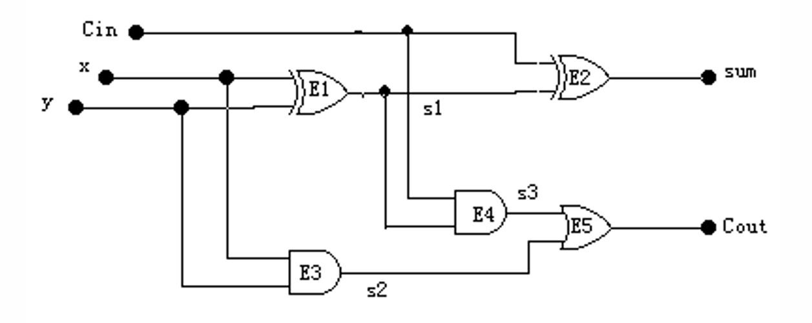
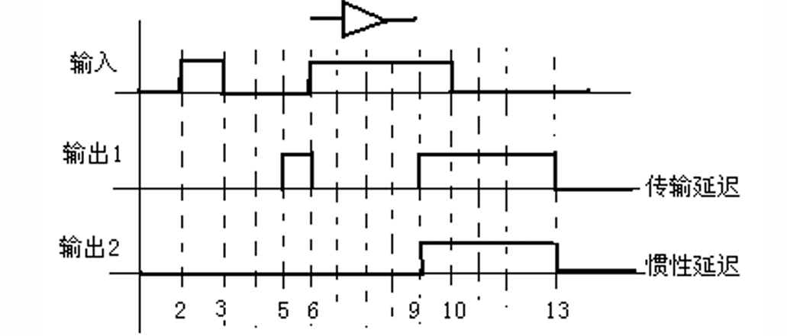

### **1. 仿真 (模拟) 概述** 🧐

#### **什么是仿真？**

*   **核心定义**：对设计的硬件描述和设计结果通过<font color="orange">计算机</font>进行<font color="orange">查错</font>、<font color="orange">验证</font>的过程。
*   **详细过程**：所谓仿真（模拟），是指从电路的描述（语言描述或图形描述）中抽象出<font color="orange">模型</font>，然后将外部<font color="orange">激励</font>信号或数据施加于此模型，通过观察该模型在外部激励下的反应来判断该电路系统是否实现预期的功能。

#### **仿真的目的** 🎯

1.  ✅ **检查原始描述的正确性**：确保最初的设计意图被正确地表达。
2.  ✅ **检查设计结果在逻辑功能和时序上的正确性**：验证电路的功能是否符合规格，时序是否满足要求。
3.  ✅ **检查设计结果中不含违反设计规则的错误**：例如建立时间、保持时间等物理规则的检查。

#### **仿真的级别** 📊

仿真是分层次的，从高层抽象到低层具体，不同级别的仿真关注点不同。

*   **高层次仿真**：对系统的抽象行为算法或混合描述进行仿真。重点是<font color="orange">系统功能</font>和系统内部运算过程。
*   **RTL级仿真**：对基于RTL（寄存器传输级）方法描述的电路进行仿真。重点是仿真数据在系统内<font color="orange">元件之间</font>的流动关系。此时通常认为是“理想时序”，不包含真实的电路延迟。
*   **逻辑仿真**：对基于门、触发器和功能块构成的系统进行仿真。重点是检查其<font color="orange">逻辑功能</font>、<font color="orange">延迟特性</font>和<font color="orange">负载特性</font>等。引入了 SDF (Standard Delay Format) 文件，可能会出现竞争冒险产生的毛刺。
*   **电路级仿真**：对基于晶体管、电阻、电容等构成的电路进行仿真（如PSPICE）。通过求解电路方程得出电压电流。特点是<font color="orange">精度高</font>但<font color="orange">仿真时间长</font>。
*   **开关级仿真**：介于电路级和逻辑级之间的模拟。将晶体管视为开关，其复杂度和仿真时间也介于两者之间。

| **层级**   | **抽象对象** | **信号表示** | **时间精度** | **速度** | **主要用途**        |
| -------- | -------- | -------- | -------- | ------ | --------------- |
| **高层次**  | 算法/模块    | 整数/浮点    | 粗略/无     | 极快     | 验证算法可行性         |
| **RTL级** | 寄存器/总线   | 0/1 (逻辑) | 时钟周期     | 快      | **逻辑功能验证 (常用)** |
| **逻辑级**  | 与或非门     | 0/1 (逻辑) | 门延迟      | 慢      | 综合后检查、时序检查      |
| **开关级**  | 晶体管(开关)  | 强/弱 0/1  | RC延迟     | 较慢     | 验证驱动能力、低功耗电路    |
| **电路级**  | 晶体管(物理)  | 电压/电流    | 连续时间     | 极慢     | 模拟电路、单元库设计      |

> **注意点** 📌
> 仿真的级别越高，抽象程度越高，仿真速度越快，但精度越低。反之，级别越低，越接近物理实现，仿真精度越高，但速度非常慢。在实际设计中，需要根据验证的目的选择合适的仿真级别。

---

### **2. 模拟系统的构成** ⚙️

一个典型的模拟（仿真）系统由以下几个部分构成，它们协同工作完成验证任务。

*   **输入模块** 📥
    *   **硬件描述语言** (如VHDL, Verilog)：通过代码描述电路。
    *   **图形输入** (如原理图)：通过图形化方式描述电路。
*   **处理核心** 🖥️
    *   **编译器/转换器**：将硬件描述或图形输入转换成仿真器可以理解的内部<font color="orange">模拟数据</font>（如网表），并存入数据库。
    *   **模拟器**：仿真的核心引擎，根据模拟数据和激励信号，计算电路的响应。
*   **激励与控制** 📈
    *   **激励波形/控制命令**：定义输入信号的变化和仿真控制指令，作为模拟器的输入。
*   **输出模块** 📤
    *   **输出波形**：以图形化的波形或文本形式展示仿真结果，供设计者分析。

---

### **3. 逻辑模拟模型** 🧩

为了进行仿真，我们需要用计算机可以理解的方式来对电路进行建模。逻辑模拟模型主要包含四个方面：

#### **3.1 电路模型：电路网表** 🔗

*   **什么是电路网表？**
    *   逻辑电路是元件的集合。
    *   所谓<font color="orange">电路网表</font>，是指描述电路拓扑关系的一种数据结构。它详细说明了每个元件的类型、名称以及各个端口连接到了哪个信号线上。
*   **元件描述**
    *   一个元件E的描述通常包含四个部分：元件名N、模型M、输入端信号PI和输出端信号PO。
    *   可以表示为： $\boxed{E = (N, M, PI, PO)}$

*   **举例：一位加法器的网表**
    下图是一个一位全加器的电路图及其对应的网表描述。


 * **网表描述**:
    *   `E1, XOR, (X, Y), S1;`  (元件E1是XOR门，输入是X,Y，输出是S1)
    *   `E2, XOR, (CIN, S1), SUM;`
    *   `E3, AND, (X, Y), S2;`
    *   `E4, AND, (S1, CIN), S3;`
    *   `E5, OR, (S3, S2), Cout;`

*   **负载表**
    *   在仿真时，当一个信号发生变化，仿真器需要知道这个信号驱动了哪些元件，这些被驱动的元件称为该信号的<font color="orange">负载元件</font>。
    *   负载表就是记录每个信号所连接的负载元件的列表。
    *   **一位加法器的负载表**:
        *   **X**: E1, E3
        *   **Y**: E1, E3
        *   **CIN**: E2, E4
        *   **S1**: E2, E4
        *   **S2**: E5
        *   **S3**: E5
        *   **SUM**: Ø (空，驱动的是顶层输出端口)
        *   **COUT**: Ø (空，驱动的是顶层输出端口)

#### **3.2 元件模型** 🧱

*   **门的模型**：描述基本逻辑门（与、或、非等）。包含其<font color="orange">功能</font>、参数、扇入、扇出、<font color="orange">延迟时间</font>等信息。
*   **功能块的模型**：描述更复杂的模块（如加法器、计数器）。通常只进行功能和行为描述，不关心其内部的具体门级结构和组成。

#### **3.3 信号模型** ⚡

信号模型定义了在仿真中，信号线可以具有哪些值。

*   **二值模型 (0, 1)**
    *   最简单的模型，只有逻辑0和逻辑1。
    *   优点是简单，但缺点是不能模拟<font color="orange">竞争冒险</font>等特殊情况。
*   **三值模型 (0, 1, X)**
    *   增加了 **X** 态，X可以表示：
        *   **不定态**：无法确定是0还是1（如上电瞬间）。
        *   **过渡态**：信号在0和1之间跳变的过程。
        *   **无关态**：该信号的值不影响电路功能。
    *   **三值逻辑与门真值表**:

| 与 | 0 | 1 | X |
| :--: | :-: | :-: | :-: |
| **0** | 0 | 0 | 0 |
| **1** | 0 | 1 | X |
| **X** | 0 | X | X |

*   **四值模型 (0, 1, X, Z)**
    *   增加了 **Z** 态，表示<font color="orange">高阻态</font> (High Impedance)。当一个输出端没有驱动时，它就处于高阻态，常见于三态门和总线结构。
    *   **四值逻辑线与/线或真值表**:

| S1 | S2 | 与 | 或 | 线或 |
| :--: | :-: | :-: | :-: | :--: |
| Z | 0 | 0 | 0 | 0 |
| Z | 1 | 1 | 1 | 1 |
| Z | X | X | X | X |
| Z | Z | X | X | Z |

*   **更复杂的模型**
    *   **五值模型**：(0, 1, U(上跳), D(下跳), E(不定态))
    *   **九值模型**：引入了<font color="orange">信号强度</font>的概念。

*   **信号值强度** 💪
    *   强度用来表示信号的<font color="orange">驱动能力</font>。
    *   **强制级 (Forcing, F)**：信号直接连接电源或地，或由强驱动单元（如CMOS门输出）驱动。
    *   **电阻级 (Resistive, R)**：信号通过一个较大的电阻与电源或地相连。
    *   **高阻级 (High-Impedance, Z)**：信号与电源和地相隔离。

*   **九值模型详解**
    九值模型是<font color="orange">逻辑电平</font> (0, 1, X) 与<font color="orange">信号强度</font> (强制F, 弱W, 高阻Z, 未定U, 无关-) 的组合。
    *   `0` (Forcing 0): 强制0
    *   `1` (Forcing 1): 强制1
    *   `X` (Forcing Unknown): 强制未知
    *   `L` (Weak 0): 弱0
    *   `H` (Weak 1): 弱1
    *   `W` (Weak Unknown): 弱未知
    *   `Z` (High-Impedance): 高阻
    *   `U` (Uninitialized): 未定（未初始化）
    *   `-` (Don't Care): 无关

#### **3.4 延迟模型** ⏳

延迟模型用于描述信号通过元件或连线所需的时间。

*   **1. 元件延迟**
    *   **零延迟模型**：理想元件，没有延迟。
    *   **单位延迟模型**：所有元件延迟时间相同，为一个单位时间。
    *   **标准延迟模型**：为每种元件设定一个固定的标准延迟时间。
    *   **上升下降延迟模型**：分别考虑信号从0变1（上升）和从1变0（下降）的不同延迟时间。
    *   **模糊延迟模型**：给出一个元件延迟时间的范围（最大/最小值），用于最差情况分析。

*   **2. 惯性延迟与传输延迟**
    这是两种非常重要的延迟类型，尤其在VHDL等硬件描述语言中。

    *   **惯性延迟 (Inertial Delay)**
        *   这是系统或器件的<font color="orange">固有延迟</font>。输出信号要发生变化，输入信号必须稳定维持一段时间。
        *   **关键特性**：如果输入信号的脉冲宽度<font color="orange">小于</font>器件的惯性延迟时间，该脉冲将被<font color="orange">滤除</font>，输出不会有任何响应。
        *   在VHDL中，如果没有特别指明，默认就是惯性延迟。
        *   `Z <= X;` (惯性延迟，时间由仿真器决定)
        *   `Z <= X AFTER 3 ns;` (3ns的惯性延迟，如果 X 的脉冲宽度小于 3ns，Z 不发生变化) 

    *   **传输延迟 (Transport Delay)**
        *   常用于描述<font color="orange">连线</font>、总线或ASIC芯片中路径的延迟。
        *   **关键特性**：无论输入信号的脉冲多窄，它都会<font color="orange">完整地</font>在输出端复现，只是时间上延迟了指定量。它不会滤除窄脉冲。
        *   `Z <= TRANSPORT X AFTER 3 ns;` (3ns的传输延迟，如果 X 的脉冲宽度小于 3ns，Z 会发生变化)

    *   **波形对比**
        下图清晰地展示了两种延迟的区别。输入是一个窄脉冲，输出1（传输延迟）复现了脉冲，而输出2（惯性延迟）将脉冲滤除了。
        

> **易错点提醒** ⚠️
*   **惯性延迟**：模拟**器件**行为，会**滤除**小于其延迟时间的窄脉冲。
*   **传输延迟**：模拟**导线**行为，**不滤除**任何脉冲，忠实传递。

---

### **4. 仿真过程** 🏃‍♂️

仿真过程可以分为两大阶段：

1.  **准备工作 (编译阶段)**
    *   **输入**：逻辑图或电路描述语言（HDL）。
    *   **转换/编译**：将输入源文件编译成中间格式，生成<font color="orange">数据库</font>。
    *   **生成驱动程序**：根据激励波形文件，生成用于仿真的驱动程序。
2.  **运行模拟 (执行阶段)**
    *   **启动**：读取数据库和驱动程序。
    *   **模拟**：模拟器核心开始逐时间步地计算电路状态。
    *   **观察与交互**：用户可以观察输出波形，甚至在仿真过程中修改信号状态。
    *   **输出**：最终生成仿真结果，通常是波形文件或报告。
---

### **5. VHDL仿真概述** 🧐

#### **VHDL仿真器与输入**

*   **仿真器**：是执行VHDL代码、模拟硬件行为的软件工具，例如 <font color="orange">ModelSim</font>。
*   **仿真所需输入**：
    1.  **设计的描述**：即我们编写的项目的VHDL程序，通常被称为<font color="orange">被测设计</font> (DUT - Design Under Test)。
    2.  **驱动设计的激励**：一系列输入信号，用于测试DUT在各种情况下的响应。
*   **基本结构**：
    仿真的顶层结构包含两个主要部分：
    *   **被测设计 (DUT)**：我们想要验证的VHDL元件。
    *   **激励驱动器 (Stimulus Driver)**：也就是测试平台，它产生信号来“驱动”DUT。
    这两部分通过内部信号连接在一起。

#### **VHDL一般仿真过程**

一个完整的VHDL设计与验证流程通常包括以下步骤：

1.  📝 **编写代码**：首先，编写设计项目元件（DUT）和用于测试它的激励文件（Testbench）。
2.  ⚙️ **编译与综合**：其次，编译VHDL程序，并使用综合工具将其转换为门级<font color="orange">网表</font>（Netlist）。
3.  🧪 **功能仿真**：再次，对综合前的代码或综合后的网表进行功能仿真，验证设计的<font color="orange">逻辑功能</font>是否正确。
4.  ⏱️ **时序仿真**：最后，在布局布线后，进行时序仿真。这时仿真会包含实际的门延迟和线延迟信息，用于验证设计是否满足<font color="orange">时序要求</font>。

---

### **6. 仿真测试平台文件 (Testbench)** 🛠️

#### **什么是测试平台文件？**

*   **定义**：测试平台文件（Testbench）本身也是一个VHDL模型，它的唯一目的是用来<font color="orange">验证</font>所设计的硬件模型（DUT）的正确性。
*   **作用**：
    *   为所测试的DUT提供<font color="orange">激励信号</font>。
    *   接收DUT的输出，仿真结果可以以<font color="orange">波形</font>的方式显示，或将测试结果存储到文件中。
*   **激励信号来源**：激励信号可以直接硬编码在测试平台文件中，也可以从外部文件中加载。

#### **测试平台文件的基本结构**

一个典型的VHDL测试平台文件结构如下：

```vhdl
-- 1. 库声明
LIBRARY IEEE;
USE IEEE.STD_LOGIC_1164.ALL;

-- 2. 实体 (通常为空)
ENTITY TEST_BENCH IS
END TEST_BENCH;

-- 3. 结构体
ARCHITECTURE TB_BEHAVIOR OF TEST_BENCH IS
    
    -- 4. 元件声明 (声明要测试的DUT)
    COMPONENT ENTITY_UNDER_TEST
        PORT (
            -- DUT的端口列表
        );
    END COMPONENT;

    -- 5. 内部信号声明 (用于连接DUT)
    -- ... signal declarations ...

BEGIN

    -- 6. 元件例化 (将DUT实例化并连接信号)
    Instatiation: ENTITY_UNDER_TEST PORT MAP (
        -- ... port associations ...
    );

    -- 7. 激励进程 (产生时钟和各种输入激励)
    PROCESS
    BEGIN
        -- ... 产生时钟信号 ...
    END PROCESS;

    PROCESS
    BEGIN
        -- ... 产生激励源 ...
    END PROCESS;

END TB_BEHAVIOR;
```

**核心组成部分**：

*   **实体的定义**：测试平台的实体通常是<font color="orange">空的</font>，因为它没有外部输入输出端口。
*   **被测元件的例化**：使用`COMPONENT`声明DUT，并使用`PORT MAP`将其例化，通过内部信号连接。
*   **产生时钟信号**：通常在一个独立的进程中产生周期性的时钟信号。
*   **产生激励源**：在另一个进程中，根据时间顺序产生各种输入激励信号。

> **注意点** 📌
> 测试平台文件（Testbench）本身是**不可综合**的。它只用于仿真环境，其中的`after`, `wait`等语句是综合工具无法转换为实际硬件的。

---

### **7. 激励信号的产生** 🌊

激励信号是测试平台的核心，用于模拟DUT可能遇到的各种输入情况。

- after **安排**一个未来的信号赋值事件，然后代码**立即继续**执行下一行（它是<font color="orange">非阻塞式</font>的）。
    ```vhdl
    PROCESS
	BEGIN
	    -- 这是一个"任务清单"，瞬间发完
	    A <= '1' AFTER 10 ns;  -- 预约：10ns时把A变1
	    B <= '1' AFTER 20 ns;  -- 预约：20ns时把B变1
	    C <= '1' AFTER 30 ns;  -- 预约：30ns时把C变1
	    -- 这三行在 0ns 时立刻执行！
	    -- 进程虽然发出了3个预约，马上就挂起了
	    -- A在10ns变，B在20ns变，C在30ns变。
	    WAIT; 
	END PROCESS;
    ```
- wait for **暂停**整个进程的执行，代码**停止**在这一行，直到指定的时间过去（它是<font color="orange">阻塞式</font>的）。
	```vhdl
	PROCESS
	BEGIN
	    A <= '1';        -- 0ns: A变1
	    WAIT FOR 10 ns;  -- 挂起 10ns
	    B <= '1';        -- 10ns: B变1
	    WAIT FOR 10 ns;  -- 挂起 10ns... 
	    C <= '1';        -- 20ns: C变1
	    WAIT;
	END PROCESS;
	```
* 一个 PROCESS **要么**有一个**敏感列表**，**要么**有 wait 语句，但**绝对不能两者都有**。因为两者都是用来定义“进程何时挂起/何时唤醒”的，同时出现会产生冲突。
---
#### **时钟信号 (Clock)**

*   **并行信号赋值语句**：最简洁的产生对称时钟的方法。
    `CLK <= not CLK after 10 ns;` -- 产生一个周期为20ns的时钟信号。

    > **注意点** 📌
    > 使用这种方法时，信号的初始值不能是 'U' (Uninitialized)，需要给定一个明确的初值，如 `'0'` 或 `'1'`。

*   **使用进程 (Process)**：更灵活，可以方便地产生对称和非对称时钟。
    *   **对称时钟 (50%占空比)**:
        ```vhdl
        CONSTANT CLK_PERIOD : TIME := 20 NS;
        PROCESS
        BEGIN
            CLK <= '1';
            WAIT FOR CLK_PERIOD / 2;
            CLK <= '0';
            WAIT FOR CLK_PERIOD / 2;
        END PROCESS;
        ```
    *   **非对称时钟 (例如25%占空比)**:
        ```vhdl
        CONSTANT CLK_PERIOD : TIME := 20 NS;
        PROCESS
        BEGIN
            CLK <= '1';
            WAIT FOR CLK_PERIOD / 4;
            CLK <= '0';
            WAIT FOR 3 * CLK_PERIOD / 4;
        END PROCESS;
        ```

#### **复位信号 (Reset)**

通常是一个在仿真开始时有效，然后恢复无效的脉冲信号。可以使用并行赋值语句轻松实现。
`RESET <= '1', '0' after 20 ns;` -- 仿真开始时RESET为'1'，20ns后变为'0'。

#### **一般激励信号**

通常在一个进程中使用`WAIT`语句来按时间顺序地改变输入信号的值。
```vhdl
STIMULI: PROCESS
BEGIN
    A <= "00"; B <= '0';
    WAIT FOR 10 ns;
    A <= "01"; B <= '1';
    WAIT FOR 10 ns;
    A <= "10";
    WAIT; -- 等待仿真结束
END PROCESS;
```

#### **动态激励信号**

激励信号的产生与DUT的输出相关。例如，当计数器`Count`的输出为2时，才改变输入`Sig_A`。这实际上描述了一种惯性延时。当 `Count` 等于 `2` 的时间小于 $10ms$ 时 `Sig_A` 不会发生变化。
```vhdl
PROCESS(Count)
BEGIN
    CASE Count IS
        WHEN 2 => Sig_A <= '1' after 10 ns;
        WHEN OTHERS => Sig_A <= '0' after 10 ns;
    END CASE;
END PROCESS;
```

#### **使用测试矢量 (Test Vectors)**

当激励组合很多时，可以将它们预先定义在一个常量数组中，然后按顺序施加给DUT。

1.  **定义矢量类型和常量**:
    ```vhdl
    TYPE TABLE_TYPE IS ARRAY (1 TO 5) OF STD_LOGIC_VECTOR(3 DOWNTO 0);
    CONSTANT INPUT_VECTORS: TABLE_TYPE := (
        "1001", "1000", "0010", "0000", "0110"
    );
    ```
2.  **施加矢量**:
    可以使用`GENERATE`语句或并行信号赋值语句将矢量按时间间隔施加到输入信号上。

---

### **8. 仿真响应与控制** 🚦

#### **断言语句 (ASSERT)**

`ASSERT`语句是VHDL中用于自动检查和报告的强大工具。

*   **作用**：
    *   检查一个条件是否为真。
    *   如果条件为`FALSE`，则报告一条信息，并根据设定的严重级别决定后续操作。
    *   可以用来在满足特定条件时自动<font color="orange">终止仿真</font>。
*   **语法**：
    `ASSERT <条件> REPORT "<消息字符串>" SEVERITY <严重级别>;`
*   **严重级别 (SEVERITY)**：
    *   `NOTE`：注释信息。
    *   `WARNING`：警告，仿真继续。
    *   `ERROR`：错误，仿真默认<font color="orange">停止</font>。
    *   `FAILURE`：致命错误，仿真停止。

> **易错点提醒** ⚠️
> `ASSERT`语句的条件判断逻辑是：当条件为 **FALSE** 时，才会执行后面的`REPORT`和`SEVERITY`动作。如果条件为 **TRUE**，则什么也不做。

*   **示例1：在1000ns时终止仿真**
    ```vhdl
    ASSERT (NOW < 1000 ns)
        REPORT "Simulation completed successfully"
        SEVERITY ERROR; -- 当 NOW >= 1000 ns 时, 报告并停止
    ```
*   **示例2：检查输出值**
    ```vhdl
    -- 当计数器输出 CT_RESULT 等于 "1001" 时，报告并停止仿真
    PROCESS(CT_RESULT)
    BEGIN
        ASSERT (CT_RESULT /= "1001")
            REPORT "The counter gets to nine!!"
            SEVERITY ERROR;
    END PROCESS;
    ```
    当 `CT_RESULT` 变为 "1001" 时，条件 `CT_RESULT /= "1001"` 为`FALSE`，仿真器会输出报告信息并因`ERROR`级别而停止。

---

### **9. 文件I/O的读写** 📂

在仿真时，我们可以从文件中读取激励数据，或将仿真结果写入文件，这对于复杂的测试非常有用。

> **注意点** 📌
> 文件I/O操作是**不可综合**的，仅用于仿真环境。需要包含`STD.TEXTIO.ALL`库。

#### **文件操作流程**

1.  **定义文件句柄**：`FILE file_handle : TEXT;`
2.  **打开文件**：`FILE_OPEN(file_handle, "filename.txt", <mode>);`
    *   **模式 (mode)**: `READ_MODE`, `WRITE_MODE`, `APPEND_MODE`。
3.  **读/写文件**：
    *   VHDL提供了`READ`, `WRITE`过程，但它们通常与一个`LINE`类型的缓冲区变量一起使用。
    *   **写操作流程**:
        1.  `variable my_line : line;`
        2.  `write(my_line, data);` -- 将数据写入缓冲区
        3.  `writeline(file_handle, my_line);` -- 将缓冲区整行写入文件
    *   **读操作流程**:
        1.  `readline(file_handle, my_line);` -- 从文件读取一行到缓冲区
        2.  `read(my_line, data_variable);` -- 从缓冲区解析数据到变量
4.  **关闭文件**：`FILE_CLOSE(file_handle);`

#### **重要子程序**

*   `FILE_OPEN(...)`：打开文件
*   `READLINE(...)`：读取一行
*   `WRITELINE(...)`：写入一行
*   `READ(...)`：从行中读取数据
*   `WRITE(...)`：向行中写入数据
*   `ENDFILE(...)`：判断是否到达文件末尾
*   `FILE_CLOSE(...)`：关闭文件

---

### **10. 本章学习总结** 🎓

本章我们深入学习了仿真的基本概念、目的、方法和过程，以及如何为VHDL设计构建一个强大的验证环境——测试平台文件（Testbench）。
- **核心思想**：仿真是数字电路设计流程中不可或缺的<font color="orange">验证</font>手段，它通过在计算机上建立电路的<font color="orange">模型</font>并施加<font color="orange">激励</font>，来检验设计的正确性。Testbench是一个独立的、不可综合的VHDL模型，其唯一目的是<font color="orange">产生激励</font>并<font color="orange">观察响应</font>，以验证被测设计（DUT）的功能和时序正确性。
- **关键知识点**：
    - 我们了解了从高层到低层的不同**仿真级别**，以及它们在速度和精度上的权衡。
    - 我们学习了仿真系统由输入、处理、激励和输出等部分**构成**。
    - 我们深入探讨了**逻辑模拟模型**的四大组成部分：
        - **电路模型**：以<font color="orange">网表</font>的形式描述电路的连接。
        - **元件模型**：描述基本单元（门、功能块）的行为。
        - **信号模型**：从简单的二值模型发展到包含X（不定）、Z（高阻）和信号强度的九值模型，以更精确地反映真实电路。
        - **延迟模型**：这是本章的重点和难点，特别是要深刻理解**惯性延迟**和**传输延迟**的根本区别及其应用场景。
*   **关键技能**：
    *   掌握了Testbench的**基本结构**，包括空实体、元件声明与例化、以及用于产生激励的进程。
    *   学会了多种**激励信号的产生方法**，从简单的时钟、复位信号，到复杂的动态激励和基于文件或数组的测试矢量。
    *   学习了使用`ASSERT`语句进行**自动响应和检查**，这能极大地提高验证效率，使仿真能够自检查并在出错时自动停止。
    *   了解了如何在仿真中进行**文件读写（I/O）**，这为处理大规模测试数据提供了可能。

通过本章的学习，我们不仅知道了如何设计硬件，更重要的是掌握了如何系统地、高效地去验证我们的设计，这是确保设计质量、减少流片风险的关键一步。