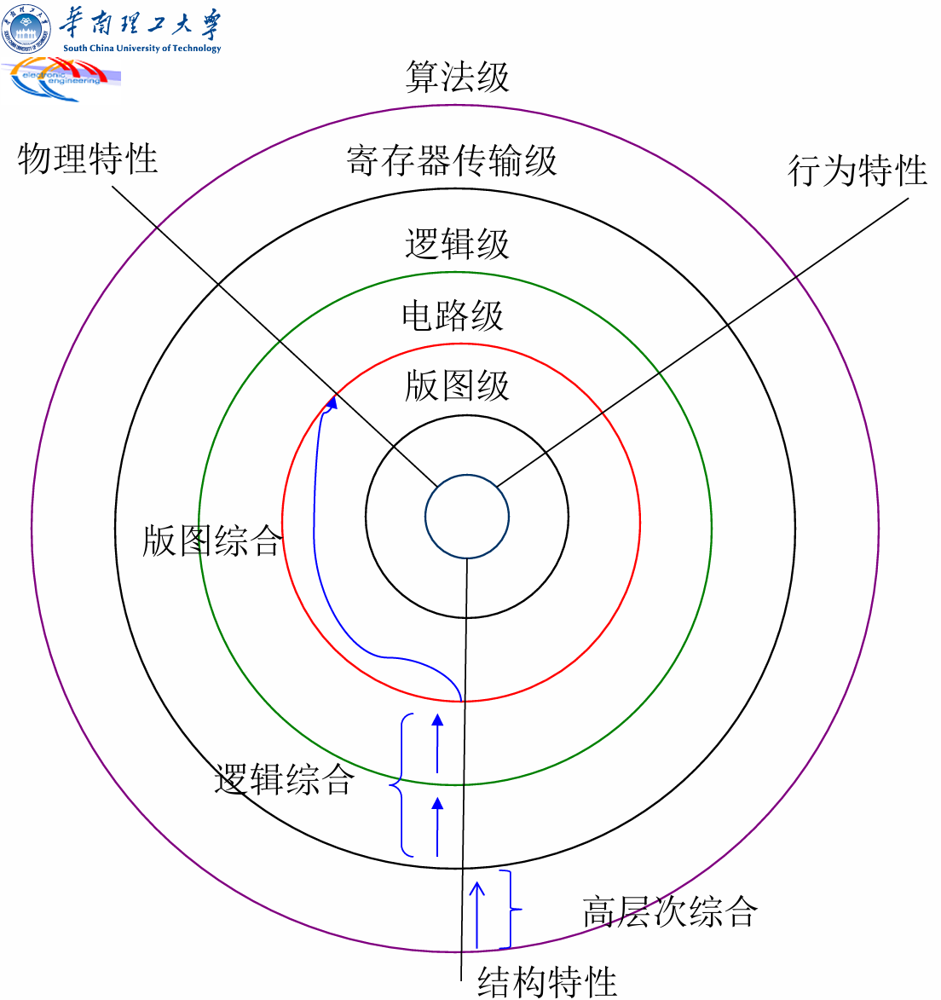
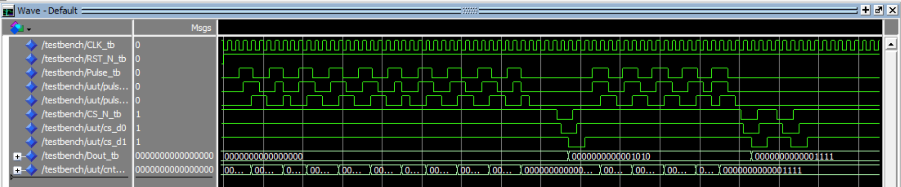

### **1. 综合的层次** 🏛️

#### **什么是综合？**

*   **核心定义**：针对一个给定的设计，根据其应实现的功能与相应的<font color="orange">约束条件</font>（如速度、面积、功耗），通过计算机的<font color="orange">优化处理</font>，获得一个满足要求的设计方案的过程。
*   **本质**：综合就是一个与<font color="orange">优化</font>的过程，它连接了抽象的设计描述和具体的硬件实现。

#### **设计的抽象层次**

数字系统可以在多个层次上进行描述，从高到低依次为：
1.  **算法层 (Algorithm Level)**：最高层的行为描述，关注“做什么”，不关心“怎么做”。
2.  **寄存器传输层 (RTL - Register Transfer Level)**：描述数据如何在寄存器之间流动和处理。
3.  **逻辑层 (Logic Level)**：由逻辑门（与、或、非）和触发器等基本单元构成的描述。
4.  **电路层 (Circuit Level)**：由晶体管、电阻、电容等组成的晶体管级描述。
5.  **版图层 (Layout Level)**：芯片上元器件和连线的物理几何图形描述。

#### **综合的三个主要层次**

对应于设计的抽象层次，综合也主要分为三个阶段：

1.  👑 **高层次综合 (High-Level Synthesis)**：从**算法层**描述转换为**RTL层**描述。
2.  🧩 **逻辑综合 (Logic Synthesis)**：从**RTL层**描述转换为逻辑层（门级网表）描述。这是目前最常用、最成熟的综合技术。
3.  🗺️ **版图综合 (Layout Synthesis)**：通常指布局布线（Place & Route），从**门级网表**生成物理**版图**。

---

### **2. 高层次综合 (HLS)** 🚀

*   **定义**：将描述系统行为的**算法级**代码（如C/C++/SystemC或VHDL的行为代码）自动转换为**RTL级**的硬件结构描述。
*   **输入**：硬件描述语言（HDL）的源描述，侧重于行为。
*   **综合结果**：通常包括两个主要部分：
    *   **数据通路 (Datapath)**：由执行数据操作和存储的硬件单元构成，如寄存器、功能单元（加法器、乘法器）、多路器和总线。
    *   **控制器 (Controller)**：通常是一个<font color="orange">有限状态机 (FSM)</font>，它产生控制信号，指挥数据通路中的数据在正确的时间进行正确的操作和传输。
*   **意义**：
    *   显著<font color="orange">提高设计速度</font>，缩短设计周期。
    *   允许非电路设计专家（如算法工程师）直接从行为描述进行硬件设计。

#### **高层次综合过程**

高层次综合是一个复杂的过程，主要包括以下步骤：
1.  **编译与转换**：将算法描述编译成内部的中间表示形式，如控制数据流图（CDFG）。
2.  **调度 (Scheduling)**：<font color="orange">确定每个操作在哪一个时钟周期执行</font>。这是时间上的分配。
3.  **分配 (Allocation)**：<font color="orange">为操作和变量分配具体的硬件资源</font>。例如，哪个加法运算由哪个加法器硬件完成，哪个变量存储在哪个寄存器中。
4.  **绑定 (Binding)**：将调度和分配的结果结合起来，生成具体的数据通路和控制器（FSM）。
5.  **生成RTL代码**：最终输出VHDL或Verilog的RTL级描述。

---

### **3. 逻辑综合** 🔧

逻辑综合是目前数字IC设计流程的基石。

*   **定义**：将**RTL级**的HDL描述自动地转换成基于特定工艺库的门级网表（Netlist）的过程。
*   **核心任务**：在满足用户指定的**约束条件**下，将RTL代码“翻译”成由与门、或门、触发器等基本单元构成的电路连接图，并对该电路进行优化。

#### **逻辑综合的过程**

逻辑综合器的工作流程可以看作一个漏斗模型，输入是抽象的RTL代码和各种设定，输出是具体的门级网表。

**输入**:
*   **RTL描述代码**：设计者编写的VHDL/Verilog代码。
*   **工艺库 (Technology Library)**：包含了目标工艺（如FPGA或特定ASIC工艺）中所有可用基本单元（标准单元）的详细信息，如逻辑功能、面积、时序（延迟）、功耗等。
*   **约束条件 (Constraints)**：设计者向综合工具提出的要求，是优化的目标。
*   **属性 (Attributes)**：对设计环境的描述，帮助综合工具更好地理解设计意图。

**输出**:
*   **门级网表 (Gate-level Netlist)**：描述了电路中基本逻辑单元及其相互连接关系的文件。

#### **逻辑综合的三个核心步骤**

1.  📜 **转换 (Translation)**
    *   将RTL代码（如`if-else`, `case`, `+`, `*`等）转换成一种不依赖于具体工艺的、通用的、未优化的布尔逻辑表达式或数据结构。这个中间格式是综合工具内部使用的。

2.  ⚙️ **逻辑优化 (Logic Optimization)**
    *   这是综合的“大脑”，也是最复杂的部分。综合工具会运用大量的算法和规则对布尔逻辑进行优化，以满足用户的约束条件。
    *   **展平设计 (Flattening)**：将多级逻辑表达式展开成“与-或”标准形式，通常速度快但面积大。
    *   **提取公因数 (Factoring)**：识别并共享公共逻辑项，以减少逻辑门的数量，从而节省面积。
    *   优化过程是在速度（Speed）、面积（Area）、功耗（Power）这几个相互制约的目标之间进行权衡（Trade-off）。

3.  🗺️ **映射 (Mapping)**
    *   将优化后的通用逻辑表达式，映射到**目标工艺库**中真实存在的、具体的逻辑单元（如AND2, OR3, DFFX1等）。
    *   例如，一个4位加法器 `c <= a + b;`，根据约束的不同，可以被映射为：
        *   **逐位进位加法器 (Ripple Carry Adder)**：<font color="orange">面积小，速度慢</font>。
        *   **超前进位加法器 (Lookahead Carry Adder)**：<font color="orange">速度快，面积大</font>。
    *   最终生成符合工艺库要求的门级网表。

---

### **4. 约束、属性及工艺库** 📝

#### **约束条件 (Constraints)**

约束是设计者对综合结果提出的**目标和要求**，主要包括：

*   🏃 **时间约束 (Timing Constraints)**：
    *   **时钟频率/周期**：规定了电路需要运行多快。例如，一个工作在20MHz的系统，其最长组合逻辑路径的延迟不能超过 $1/20\text{MHz} = 50\text{ns}$。 $\boxed{T_{delay} \le T_{clk\_period} - T_{setup} - T_{clk-q}}$
    *   输入/输出延迟等。

*   🏞️ **面积约束 (Area Constraints)**：
    *   限制设计所能使用的逻辑门数量或芯片面积。

*   🔌 **资源约束 (Resource Constraints)**：
    *   例如，在VHDL代码 `if sel = '1' then q <= a+b; else q <= c+d; end if;` 中：
        *   如果不考虑资源共享，综合器可能会使用 **2个加法器和1个多路器**（并行，速度快）。
        *   如果约束资源共享，则可以使用 **1个加法器和2个多路器**（时分复用，面积小）。

#### **属性 (Attributes)**

属性用于**描述设计所处的环境**，帮助综合工具做出更准确的分析和优化。

*   **驱动属性 (Drive Strength)**：描述输入端口的驱动能力有多强。
*   **负载属性 (Load)**：描述输出端口需要驱动多大的外部负载（如其他芯片的输入引脚电容）。
*   **到达时间 (Arrival Time)**：描述输入信号相对于时钟沿的到达时间。

#### **工艺库 (Technology Library)**

工艺库是逻辑综合的**基石**，它告诉综合工具“你有哪些砖块（逻辑单元）可以用，以及这些砖块的特性是什么”。
一个典型的库单元描述会包含：
*   **逻辑功能**：如 `"a1 * a2"` 表示一个与门。
*   **面积**：该单元占用的芯片面积。
*   **引脚信息**：输入/输出方向、电容等。
*   **时序信息**：
    *   **固有延迟 (Intrinsic Delay)**：单元本身的延迟。
    *   **负载相关延迟 (Load Delay)**：输出负载越大，延迟越大。
    *   **转换时间相关延迟 (Slew Delay)**：输入信号边沿越缓，延迟越大。
    *   **建立/保持时间**：对于时序单元。

> **注意点** 📌
> RTL代码的**写法**会直接影响综合结果。良好的代码风格，如使用同步复位、避免锁存器、模块化设计等，能帮助综合工具生成更优的电路。

---

### **5. 可编程器件（FPGA）的综合** 💡

针对FPGA的综合与ASIC综合在原理上类似，但映射阶段的目标不同。ASIC映射到标准单元库，而FPGA综合则需要将逻辑映射到FPGA特有的硬件结构上。

*   **Xilinx FPGA**：主要逻辑资源是**可配置逻辑块 (CLB)**，每个CLB通常由查找表（LUT，实现组合逻辑）、触发器和专用多路器构成。
*   **Actel FPGA**：逻辑资源是组合逻辑块和时序逻辑块。

**FPGA综合的设计考量**:
*   **资源特性**：FPGA中寄存器资源相对丰富。对于状态机设计，使用**独热码（One-hot）编码**通常比二进制编码更优，因为它能简化组合逻辑（减少LUT深度），从而提高速度，尽管会使用更多触发器。
*   **避免锁存器 (Latch)**：在设计中应尽量避免无意中产生锁存器，因为它们可能导致时序问题。不完整的`if`或`case`语句是产生锁存器的常见原因。
*   **同步/异步复位**：推荐使用**异步复位、同步释放**的策略，以兼顾复位的可靠性和时序的稳定性。

---

### **6. 本章学习总结** 🎓

本章我们学习了将抽象设计转化为具体电路的魔法——综合。

*   **核心思想**：综合是一个自动化的**<font color="orange">转换</font>**与**<font color="orange">优化</font>**过程，它遵循设计者给出的**RTL代码**，在**约束条件**的指导下，利用**工艺库**提供的元件，最终生成一个门级网表。
*   **关键知识点**：
    *   理解了综合的**三个层次**：高层次综合、逻辑综合、版图综合。
    *   掌握了**逻辑综合**的完整流程：输入（RTL, 库, 约束）、核心三步骤（**转换、优化、映射**）和输出（网表）。
    *   深刻理解了**约束条件**（特别是时间和面积）在指导综合优化方向上的决定性作用。
    *   了解了**工艺库**是逻辑综合的物理基础，它定义了所有可用的“积木”。
    *   针对**FPGA**的综合，需要考虑其独特的硬件资源（如LUT和丰富的寄存器），并采用相应的设计策略（如One-hot编码）。

通过本章的学习，我们不再仅仅是HDL代码的“编写者”，更是能够理解代码如何被翻译成硬件、并能通过良好的编码风格和恰当的约束来指导综合工具产生高性能、低成本电路的“设计者”。

### 附录
#### （1）高层次综合（HLS）的过程

##### HLS 过程全景图

**输入**: C/C++/SystemC 算法代码 + 约束条件（时钟周期、目标延迟、资源限制等）
**输出**: 可综合的RTL代码 (VHDL/Verilog)

---

##### 第1阶段：前端编译与转换 (Parsing & Elaboration)

**目标**：理解代码的“意图”，并将其转换为一种适合硬件分析的内部格式。

1.  **代码解析 (Parsing)**：
    *   HLS工具首先像一个标准的C++编译器一样，对输入的代码进行词法分析和语法分析，检查是否有语法错误。
    *   它将代码转换成一个抽象语法树（AST），这是一种树状的数据结构，表示了代码的结构。

2.  **转换到中间表示 (IR - Intermediate Representation)**：
    *   这是最关键的一步。AST被转换成一种更适合硬件优化的格式，通常是**控制数据流图 (Control Data Flow Graph - CDFG)**。
    *   **CDFG是什么？** 它是一个图形化的表示，完美地捕捉了算法的两个核心方面：
        *   **数据流 (Data Flow)**：表示数据之间的依赖关系。例如，在 `c = a + b` 中，加法操作依赖于 `a` 和 `b`。这由数据边（Data Edges）表示。
        *   **控制流 (Control Flow)**：表示代码的执行顺序和条件。例如 `if-else` 分支、`for` 循环等。这由控制边（Control Edges）表示。

**例子**: 对于代码 `if (x > 0) { y = a + b; } else { y = a - b; }`
*   CDFG会有一个“条件”节点 (`x > 0`)。
*   从这个节点分出两条控制路径（`true` 和 `false`）。
*   一条路径上有一个“加法”节点，另一条路径上有一个“减法”节点。
*   最后两条路径会合并，将结果写入 `y`。

**此阶段的输出**: 一个完整的CDFG，它是不带任何时序信息的纯粹的算法依赖关系图。

---

##### 第2阶段：调度 (Scheduling)

**目标**：回答核心问题：“**每一个操作应该在哪个时钟周期执行？**”

这是HLS的“心脏”，它将“时间”的概念引入设计中。调度器会接收CDFG以及用户的性能约束（如时钟周期为10ns，总延迟不超过20个周期等），然后为图中的每个操作（加、乘、内存读写等）分配一个或多个时钟周期。

1.  **确定操作延迟**：
    *   HLS工具知道每种操作在目标FPGA/ASIC技术库中需要多少时间。例如，一个32位整数乘法可能需要2个时钟周期，而加法只需要1个。

2.  **计算时间范围 (ASAP/ALAP)**：
    *   工具会运行**ASAP**和**ALAP**算法来确定每个操作的**最早**和**最晚**可以开始的时间，从而得到其**移动性 (Mobility)**。

3.  **执行核心调度算法**：
    *   有了移动性信息，调度器会使用更高级的算法来做出最终决定。常见算法有：
        *   **列表调度 (List Scheduling)**：一种贪心算法。它维护一个“准备好”执行的操作列表，在每个时钟周期，根据优先级（如关键路径上的操作优先）选择最优的操作来执行。速度快，效果不错。
        *   **力导向调度 (Force-Directed Scheduling)**：一种更复杂的算法。它试图通过“力”的比喻来平衡资源的使用。如果一个操作被安排在某个周期，会导致很多同类操作“挤”在一起（资源竞争大），那么它就会受到一个“斥力”。该算法的目标是最小化所有操作受到的“总力”，从而实现最佳的资源共享。

**此阶段的输出**: 一个**带时序的CDFG**。现在，图中的每个操作都被精确地标记了它所属的执行周期。同时，也确定了整个算法需要的**总时钟周期数（总延迟，Latency）**。

---

##### 第3阶段：分配与绑定 (Allocation & Binding)

**目标**：将抽象的操作和变量映射到**具体的物理硬件资源**上。

1.  **资源分配 (Allocation)**：
    *   **问题**: “我们需要多少个硬件单元？”
    *   根据调度结果，工具会分析在任何一个时钟周期内，同时有多少个同类操作在执行。例如，如果调度结果显示在第3个周期需要同时执行两个乘法，那么就至少需要分配两个乘法器硬件单元。
    *   用户也可以直接指定资源限制（例如，`#pragma HLS RESOURCE core=Mul_LUT limit=1`），强制工具只使用一个乘法器，这时调度器可能需要重新调度以满足这个约束。

2.  **资源绑定 (Binding)**：
    *   **问题**: “哪个操作/变量使用哪个具体的硬件单元？”
    *   **操作绑定**: 如果你有 `c = a * b` 和 `f = d * e` 两个乘法，但只分配了一个乘法器，绑定过程就要决定：
        *   `a` 和 `b` 连接到乘法器的输入端，执行第一个乘法。
        *   `d` 和 `e` 连接到**同一个**乘法器的输入端，执行第二个乘法（当然是在不同的时钟周期）。
        *   这就需要**多路选择器 (Multiplexer, MUX)** 来选择正确的输入。
    *   **存储绑定**: C代码中的变量（如 `a`, `b`, `c`）需要被绑定到物理存储单元上，如**寄存器 (Register)**、**LUTRAM** 或 **块RAM (BRAM)**。

**此阶段的输出**: 一张详细的硬件结构图，明确了需要哪些功能单元（ALU、乘法器等）、存储单元（寄存器、RAM）以及它们之间的连接关系（通过MUX）。

---

##### 第4阶段：数据通路与控制器生成 (Datapath & Controller Generation)

**目标**：根据上一步的绑定结果，生成最终的RTL两大组成部分。

1.  **数据通路 (Datapath) 生成**:
    *   这是电路的“肌肉”和“骨骼”，负责所有的数据处理和存储。
    *   它由第3阶段分配和绑定的所有硬件资源（加法器、乘法器、寄存器、RAM）以及连接它们的MUX和导线组成。

2.  **控制器 (Controller) 生成**:
    *   这是电路的“大脑”，负责指挥数据通路在正确的时间做正确的事。
    *   它通常被实现为一个**有限状态机 (Finite State Machine - FSM)**。
    *   FSM的每个**状态**通常对应调度后的一个**时钟周期**。
    *   在每个状态（周期）下，控制器会发出特定的**控制信号**去：
        *   设置MUX的选择线，将正确的数据送入功能单元。
        *   提供寄存器的写使能信号，在计算完成后锁存结果。
        *   控制RAM的读写地址和使能信号。

**调度结果直接决定了FSM的状态转换逻辑。**

---

##### 第5阶段：RTL代码生成 (RTL Generation)

**目标**：将内部表示的数据通路和控制器，翻译成标准的VHDL或Verilog代码。

这是最后一步。工具会遍历它内部构建的硬件结构图，并将其“打印”成人类可读的RTL代码。

*   数据通路的硬件单元（如加法器）会被实例化。
*   控制器的FSM会被描述成一个 `case` 语句（在 `always @(posedge clk)` 块内）。
*   所有的连接关系（MUX、连线）都会被正确地描述出来。

最终生成的RTL代码是结构化的、可读的，并且可以被任何标准的RTL综合工具（如Vivado Synthesis, Synopsys DC）进一步综合、布局布线，最终生成在芯片上运行的比特流。

#### （2）触发器和锁存器生成规则

##### 一、 触发器 (Flip-Flop)
触发器是**边沿敏感**（Edge-Triggered）的存储单元。只要代码逻辑中检测了时钟的跳变沿（上升沿或下降沿），综合工具就会推导出触发器。

###### 1. 标准写法 (推荐)
使用 `rising_edge(clk)` 或 `falling_edge(clk)` 函数。这是IEEE 1076标准推荐的写法。

```vhdl
process(clk)
begin
    -- 检测上升沿
    if rising_edge(clk) then
        q <= d;
    end if;
end process;
```

###### 2. 传统写法 (老式代码常见)
通过检测时钟信号的属性 `'event`（发生变化）和当前电平来判断。

```vhdl
process(clk)
begin
    -- 此时钟发生了变化 AND 变化后为'1' = 上升沿
    if clk'event and clk = '1' then 
        q <= d;
    end if;
end process;
```

###### 3. 带有异步复位的触发器 (最常用)
如果复位信号不依赖时钟，必须放在检测时钟沿的语句**之前**。

```vhdl
process(clk, rst_n) -- 敏感列表必须包含时钟和异步复位
begin
    if rst_n = '0' then
        q <= '0';            -- 异步复位
    elsif rising_edge(clk) then
        q <= d;              -- 同步数据更新
    end if;
end process;
```

###### 4. 使用 `wait until` (较少见，但有效)
这也是生成触发器的一种方式，不需要敏感列表（隐含了），通常用于Testbench或特定的综合风格。
```vhdl
process -- 没有敏感列表
begin
    wait until clk = '1'; -- 等待直到clk变成1
    q <= d;
end process;
```

---

##### 二、 锁存器 (Latch)
锁存器是**电平敏感**（Level-Sensitive）的存储单元。
**产生原因**：在**组合逻辑进程**（即没有时钟沿检测的process）中，某些信号在特定的条件分支下**没有被赋值**。
**结果**：为了保持信号原有的值，综合工具被迫生成锁存器。

> **注意**：在FPGA设计中，除非故意设计（如接口去抖动或极低功耗设计），通常应**避免生成锁存器**，因为它们会导致时序分析困难。

###### 1. `if` 语句不完整 (最常见的无意生成)
如果写了 `if` 但没有写 `else`，或者 `elsif` 没有覆盖所有情况，且该进程不是时钟触发的。

```vhdl
-- 这是一个组合逻辑进程（敏感列表没有clk，是en和d）
process(en, d)
begin
    if en = '1' then
        q <= d;
    end if;
    -- 缺少 else！
    -- 当 en = '0' 时，q 保持原值 -> 生成锁存器
end process;
```

###### 2. `case` 语句不完整
如果 `case` 语句没有覆盖所有可能的取值，且没有加 `when others`。

```vhdl
process(sel, a, b)
begin
    case sel is
        when "00" => q <= a;
        when "01" => q <= b;
        -- 缺少 "10", "11" 且没有 when others
        -- 未覆盖的情况下 q 保持原值 -> 生成锁存器
    end case;
end process;
```

###### 3. 变量赋值不完整 (特殊情况)
虽然变量通常被综合为连线，但如果变量在组合逻辑进程中被读取前没有被**无条件地**重新赋值（即利用了上一轮的值），也可能推导出锁存器。

---

##### 三、 总结对比表

| 特征 | 触发器 (Flip-Flop) | 锁存器 (Latch) |
| :--- | :--- | :--- |
| **触发方式** | **边沿触发** (时钟沿) | **电平触发** (使能信号电平) |
| **代码关键点** | `if rising_edge(clk)` | 组合逻辑进程中**赋值语句不完整** (缺少else/others) |
| **敏感列表** | 必须包含 `clk` (和异步复位) | 包含所有输入信号 (`all` 或具体信号名) |
| **应用场景** | 时序逻辑设计，状态机，流水线 | 极少使用，通常是**设计失误** |
| **记忆口诀** | “沿来了才变” | “条件不够，保持原旧” |

##### 四、 如何防止生成不需要的锁存器？

如果你写的是组合逻辑电路，请遵循以下两个原则之一：

1.  **补全所有分支**：确保每个 `if` 都有 `else`，每个 `case` 都有 `when others`。
    ```vhdl
    if en = '1' then
        q <= d;
    else
        q <= '0'; -- 明确指定 else 的值，避免保持
    end if;
    ```

2.  **设置默认值**：在进程开始时给信号赋一个默认值。
    ```vhdl
    process(en, d)
    begin
        q <= '0'; -- 1. 先赋默认值
        
        if en = '1' then
            q <= d; -- 2. 满足条件再覆盖
        end if;
        -- 即使没有 else，也不会生成锁存器，因为已经有默认值了
    end process;
    ```

#### （3）检测外部信号边沿
设计一个脉冲计数器，在脉冲**上升沿**触发计数，上位机MCU在片选的**下降沿**到来时读取一个计数值:
```vhdl
library IEEE;
use IEEE.STD_LOGIC_1164.ALL;
use IEEE.STD_LOGIC_UNSIGNED.ALL; 

entity PulseCounter is
    Port ( 
        CLK    : in  STD_LOGIC;                     -- 系统主时钟
        RST_N  : in  STD_LOGIC;                     -- 异步复位，低电平有效
        Pulse  : in  STD_LOGIC;                     -- 待计数的脉冲信号
        CS_N   : in  STD_LOGIC;                     -- 片选信号，低电平有效
        Dout   : out STD_LOGIC_VECTOR (15 downto 0) -- 输出给MCU的计数值
    );
end PulseCounter;

architecture Behavioral of PulseCounter is

    -- 定义内部信号
    signal cnt_reg     : STD_LOGIC_VECTOR(15 downto 0) := (others => '0'); -- 内部计数寄存器
    
    signal pulse_d0    : STD_LOGIC := '0';
    signal pulse_d1    : STD_LOGIC := '0';
    signal cs_d0       : STD_LOGIC := '1';
    signal cs_d1       : STD_LOGIC := '1';

begin

    process(CLK, RST_N)
    begin
        if RST_N = '0' then
            cnt_reg     <= (others => '0');
            Dout        <= (others => '0');
            pulse_d0    <= '0';
            pulse_d1    <= '0';
            cs_d0       <= '1';
            cs_d1       <= '1';
            
        elsif rising_edge(CLK) then
            pulse_d0 <= Pulse;
            pulse_d1 <= pulse_d0;
            
            cs_d0    <= CS_N;
            cs_d1    <= cs_d0;
            if (pulse_d0 = '1' and pulse_d1 = '0') then --上升沿
                cnt_reg <= cnt_reg + 1;
            end if;
            if (cs_d0 = '0' and cs_d1 = '1') then --下降沿
                Dout <= cnt_reg;
            end if;
            
        end if;
    end process;

end Behavioral;
```

在FPGA面试或实际工作中，凡是遇到“**检测外部信号边沿**”的题目，要先把信号打两拍（d0, d1），这是标准动作。
- **亚稳态是什么？**  
    如果 Pulse 跳变的瞬间，刚好撞上了 CLK 的上升沿，触发器可能会“懵圈”，它不知道该存 0 还是存 1，输出可能会在一个非 0 非 1 的中间电压震荡。这种震荡如果传导到后面的计数器，会导致系统崩溃或计数错误。
* **d0/d1 是如何保护电路的？**
	**pulse_d0**：它是第一道防线。如果发生碰撞，pulse_d0 可能会进入亚稳态（短暂的不稳定）。
	**pulse_d1**：它是第二道防线。因为它采集的是 pulse_d0 的值。经过一个时钟周期的等待，pulse_d0 通常已经从亚稳态稳定下来变成了 0 或 1。