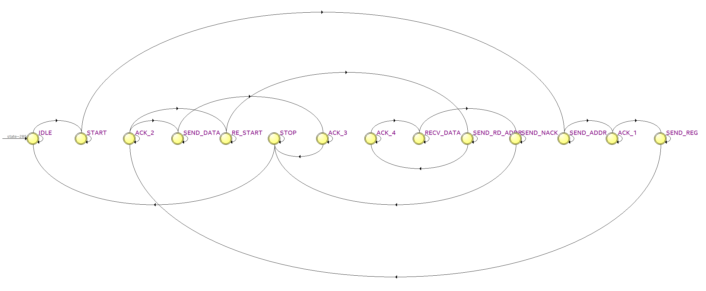

在构建基于 FPGA 的多传感器数据采集系统（如集成 MAX30102 心率血氧传感器与 MPU6050 运动姿态传感器的 IoT Sensor Hub）时，底层通信接口的稳定性直接决定了上层算法的可靠性。I2C（Inter-Integrated Circuit）总线因其引脚占用少、支持多机通信等特点，成为连接微控制器与外围传感器的首选协议。

本文将从 I2C 协议的严谨时序规范出发，结合一段工业级规范的 Verilog 状态机源码，详细解析 FPGA 如何作为主机（Master）实现标准 I2C 单字节读写及带有重复起始位（Repeated Start）的复合读操作。

## 一、 I2C 总线通信原理与时序规范

I2C 是一种半双工、同步串行总线，仅依靠两根信号线：串行数据线（SDA）和串行时钟线（SCL）即可完成复杂的寻址与数据交互。

### 1. 数据有效性与起始/停止条件

在 I2C 协议中，数据的传输受到严格的电平状态约束：

- **数据有效性：** 当 SCL 处于高电平时，SDA 上的数据必须保持稳定。SDA 的电平切换（数据移位）只能在 SCL 处于低电平时进行。
    
- **起始条件（START）：** 在 SCL 为高电平期间，SDA 产生一个由高向低的跳变，标志着一次通信的开始。
    
- **停止条件（STOP）：** 在 SCL 为高电平期间，SDA 产生一个由低向高的跳变，标志着总线被释放，通信结束。
    

### 2. 寻址机制与应答（ACK/NACK）

I2C 采用 7 位或 10 位设备地址寻址。每次通信发起时，主机首字节发送的 8 位数据由 **7 位从机地址 + 1 位读/写控制位（0表示写，1表示读）** 构成。

为了保证数据传输的可靠性，协议引入了应答机制。每传输完成一个字节（8 bit），发送方必须在第 9 个时钟周期释放 SDA 线，由接收方接管：

- **有效应答（ACK）：** 接收方将 SDA 拉低，表示成功接收该字节。
    
- **非应答（NACK）：** 接收方使 SDA 保持高电平。在主机读取数据的最后阶段，主机主动发送 NACK，告知从机停止发送数据，准备释放总线。
    

## 二、 FPGA 核心控制逻辑：四相时钟与三态门

在实际的 FPGA 开发中，不能简单地依赖分频时钟的边沿来驱动数据流，而是需要利用系统高频时钟对 I2C 时钟周期进行细分。

本设计中，状态机通过计数器 `cnt` 将一个完整的 I2C 时钟周期划分为四个象限（四相控制），满足严苛的建立时间（Setup Time）与保持时间（Hold Time）：

$$f_{SCL} = \frac{f_{sys}}{\text{CNT\_MAX} + 1}$$

- `CNT_Q1`（1/4 周期）：SCL 处于低电平中心，此时切换 SDA 数据最为安全。
    
- `CNT_Q2`（2/4 周期）：拉高 SCL。在 SCL 稳定高电平期间（如 `CNT_Q2 + 10`）进行数据采样，有效滤除毛刺。
    
- `CNT_Q3`（3/4 周期）：拉低 SCL，准备下一个比特周期的到来。
    

同时，I2C 协议要求开漏输出机制以实现“线与”逻辑。Verilog 中通过三态缓冲器实现：

Verilog

```Verilog
assign i2c_sda = (sda_out_en && (sda_out_val == 1'b0)) ? 1'b0 : 1'bz;
```

当使能且输出 0 时，主动拉低总线；输出 1 或接收状态时，设为高阻态（`1'bz`），由总线外部上拉电阻提供高电平，避免多主机冲突。

## 三、 基于 FSM 的状态流转解析

控制器的核心是一个包含 14 个状态的有限状态机（FSM）。根据读写控制位 `wr_rd`，状态机衍生出两条清晰的执行路径：

### 1. 单次寄存器写操作 (`wr_rd == 0`)

1. **握手与寻址**：`IDLE` 响应请求后触发 `START`，在 `SEND_ADDR` 移位发出设备地址与写标志。
    
2. **地址校验**：进入 `ACK_1` 等待从机响应。确认无误后，进入 `SEND_REG` 发送 8 位目标寄存器地址。
    
3. **数据写入**：通过 `ACK_2` 确认寄存器地址有效后，状态机进入 `SEND_DATA`，将待写数据串行输出至总线。
    
4. **终止通信**：收到最后的 `ACK_3` 后，进入 `STOP` 产生停止条件，通信闭环。
    

### 2. 复合寄存器读操作 (`wr_rd == 1`)

由于 I2C 在读取特定寄存器前，必须先“伪写”寄存器地址来设定从机的内部地址指针，因此读操作的前半部分与写操作一致。差异出现在 `ACK_2` 之后：

1. **重复起始（Repeated Start）**：状态机不发送 STOP，而是进入 `RE_START`。在 SCL 高电平时再次拉低 SDA，发起二次握手，无缝转换总线方向。
    
2. **读寻址**：进入 `SEND_RD_ADDR` 发送设备地址与读标志（1）。
    
3. **数据捕获**：经 `ACK_4` 确认后，进入 `RECV_DATA`。FPGA 切换为接收方，在 SCL 高电平的稳定窗口期对 SDA 进行采样移位。
    
4. **主设备非应答（Master NACK）**：读取 8 位完毕后，进入 `SEND_NACK`。FPGA 主动拉高 SDA，告知传感器终止传输，随后进入 `STOP` 释放总线。
    

## 四、 总结

该模块通过严谨的四相时钟细分与规范的 FSM 设计，实现了一个高鲁棒性的底层通信网关。它屏蔽了底层时序的复杂性，使得顶层模块（如 MAX30102 数据读取状态机、步态检测预处理模块）仅需关注业务逻辑与算法实现，极大提升了工程的可复用性。

## 代码示例
```verilog
module i2c_master #(
    parameter SYS_CLK_FREQ = 50_000_000, 
    parameter I2C_FREQ     = 100_000     
)(
    input  wire        clk,        
    input  wire        rst_n,      
    
    input  wire        req,        
    input  wire        wr_rd,      // 0: 写, 1: 读
    input  wire [6:0]  dev_addr,   
    input  wire [7:0]  reg_addr,   
    input  wire [7:0]  wr_data,    
    
    output reg  [7:0]  rd_data,    
    output reg         done,       
    output reg         ack_err,    
    
    output reg         i2c_scl,    
    inout  wire        i2c_sda     
);

    localparam CNT_MAX = (SYS_CLK_FREQ / I2C_FREQ) - 1;
    localparam CNT_Q1  = CNT_MAX / 4;
    localparam CNT_Q2  = CNT_MAX / 2;
    localparam CNT_Q3  = CNT_MAX * 3 / 4;

    reg [15:0] cnt;
    reg i2c_clk_en; 

    always @(posedge clk or negedge rst_n) begin
        if (!rst_n) begin
            cnt <= 16'd0;
            i2c_clk_en <= 1'b0;
        end else if (cnt == CNT_MAX) begin
            cnt <= 16'd0;
            i2c_clk_en <= 1'b1;
        end else begin
            cnt <= cnt + 1'b1;
            i2c_clk_en <= 1'b0;
        end
    end

    // 补全了读取需要的状态
    localparam IDLE         = 4'd0;
    localparam START        = 4'd1;
    localparam SEND_ADDR    = 4'd2;
    localparam ACK_1        = 4'd3;
    localparam SEND_REG     = 4'd4;
    localparam ACK_2        = 4'd5;
    localparam SEND_DATA    = 4'd6;
    localparam ACK_3        = 4'd7;
    localparam RE_START     = 4'd8;  
    localparam SEND_RD_ADDR = 4'd9; 
    localparam ACK_4        = 4'd10; 
    localparam RECV_DATA    = 4'd11;
    localparam SEND_NACK    = 4'd12; 
    localparam STOP         = 4'd13;

    reg [3:0]  state;
    reg [2:0]  bit_cnt;    
    reg [7:0]  tx_shift;   
    reg [7:0]  rx_shift;   
    
    reg sda_out_en; 
    reg sda_out_val;
    
    assign i2c_sda = (sda_out_en && (sda_out_val == 1'b0)) ? 1'b0 : 1'bz;

    always @(posedge clk or negedge rst_n) begin
        if (!rst_n) begin
            state       <= IDLE;
            i2c_scl     <= 1'b1;
            sda_out_en  <= 1'b0;
            sda_out_val <= 1'b1;
            done        <= 1'b0;
            ack_err     <= 1'b0;
            bit_cnt     <= 3'd0;
            rd_data     <= 8'd0;
        end else begin
            done <= 1'b0; 
            
            case(state)
                IDLE: begin
                    i2c_scl <= 1'b1;
                    sda_out_en <= 1'b1;
                    sda_out_val <= 1'b1;
                    if (req) begin
                        state <= START;
                        tx_shift <= {dev_addr, 1'b0}; // 无论读写，第一步都是写设备地址
                        ack_err <= 1'b0;
                    end
                end
                
                START: begin
                    if (cnt == CNT_Q1) sda_out_val <= 1'b0; 
                    else if (cnt == CNT_Q3) i2c_scl <= 1'b0; 
                    else if (i2c_clk_en) begin
                        state <= SEND_ADDR;
                        bit_cnt <= 3'd7;
                    end
                end
                
                SEND_ADDR: begin
                    if (cnt == CNT_Q1) sda_out_val <= tx_shift[bit_cnt]; 
                    else if (cnt == CNT_Q2) i2c_scl <= 1'b1; 
                    else if (cnt == CNT_Q3) i2c_scl <= 1'b0; 
                    else if (i2c_clk_en) begin
                        if (bit_cnt == 0) state <= ACK_1;
                        else bit_cnt <= bit_cnt - 1'b1;
                    end
                end
                
                ACK_1: begin
                    if (cnt == CNT_Q1) sda_out_en <= 1'b0; 
                    else if (cnt == CNT_Q2) i2c_scl <= 1'b1;
                    else if (cnt == CNT_Q2 + 10) ack_err <= ack_err | i2c_sda; 
                    else if (cnt == CNT_Q3) i2c_scl <= 1'b0;
                    else if (i2c_clk_en) begin
                        state <= SEND_REG;
                        tx_shift <= reg_addr;
                        bit_cnt <= 3'd7;
                        sda_out_en <= 1'b1; 
                    end
                end
                
                SEND_REG: begin
                    if (cnt == CNT_Q1) sda_out_val <= tx_shift[bit_cnt];
                    else if (cnt == CNT_Q2) i2c_scl <= 1'b1;
                    else if (cnt == CNT_Q3) i2c_scl <= 1'b0;
                    else if (i2c_clk_en) begin
                        if (bit_cnt == 0) state <= ACK_2;
                        else bit_cnt <= bit_cnt - 1'b1;
                    end
                end
                
                ACK_2: begin
                    if (cnt == CNT_Q1) sda_out_en <= 1'b0;
                    else if (cnt == CNT_Q2) i2c_scl <= 1'b1;
                    else if (cnt == CNT_Q2 + 10) ack_err <= ack_err | i2c_sda;
                    else if (cnt == CNT_Q3) i2c_scl <= 1'b0;
                    else if (i2c_clk_en) begin
                        if (wr_rd == 1'b0) begin // 写操作
                            state <= SEND_DATA;
                            tx_shift <= wr_data;
                            bit_cnt <= 3'd7;
                            sda_out_en <= 1'b1;
                        end else begin // 读操作：进入 Repeated Start
                            state <= RE_START;
                            sda_out_en <= 1'b1;
                            sda_out_val <= 1'b1; // 准备拉高SDA产生下一个下降沿
                        end
                    end
                end
                
                // --- 以下为写操作的分支 ---
                SEND_DATA: begin
                    if (cnt == CNT_Q1) sda_out_val <= tx_shift[bit_cnt];
                    else if (cnt == CNT_Q2) i2c_scl <= 1'b1;
                    else if (cnt == CNT_Q3) i2c_scl <= 1'b0;
                    else if (i2c_clk_en) begin
                        if (bit_cnt == 0) state <= ACK_3;
                        else bit_cnt <= bit_cnt - 1'b1;
                    end
                end
                
                ACK_3: begin
                    if (cnt == CNT_Q1) sda_out_en <= 1'b0;
                    else if (cnt == CNT_Q2) i2c_scl <= 1'b1;
                    else if (cnt == CNT_Q2 + 10) ack_err <= ack_err | i2c_sda;
                    else if (cnt == CNT_Q3) i2c_scl <= 1'b0;
                    else if (i2c_clk_en) begin
                        state <= STOP;
                        sda_out_en <= 1'b1;
                        sda_out_val <= 1'b0; 
                    end
                end

                // --- 以下为读操作分支 ---
                RE_START: begin
                    if (cnt == CNT_Q1) i2c_scl <= 1'b1; // SCL拉高
                    else if (cnt == CNT_Q2) sda_out_val <= 1'b0; // SCL高时拉低SDA，产生RE-START
                    else if (cnt == CNT_Q3) i2c_scl <= 1'b0; // SCL拉低准备传数据
                    else if (i2c_clk_en) begin
                        state <= SEND_RD_ADDR;
                        tx_shift <= {dev_addr, 1'b1}; // 设备地址 + 读标志位(1)
                        bit_cnt <= 3'd7;
                    end
                end

                SEND_RD_ADDR: begin
                    if (cnt == CNT_Q1) sda_out_val <= tx_shift[bit_cnt];
                    else if (cnt == CNT_Q2) i2c_scl <= 1'b1;
                    else if (cnt == CNT_Q3) i2c_scl <= 1'b0;
                    else if (i2c_clk_en) begin
                        if (bit_cnt == 0) state <= ACK_4;
                        else bit_cnt <= bit_cnt - 1'b1;
                    end
                end

                ACK_4: begin
                    if (cnt == CNT_Q1) sda_out_en <= 1'b0; // 释放SDA
                    else if (cnt == CNT_Q2) i2c_scl <= 1'b1;
                    else if (cnt == CNT_Q2 + 10) ack_err <= ack_err | i2c_sda;
                    else if (cnt == CNT_Q3) i2c_scl <= 1'b0;
                    else if (i2c_clk_en) begin
                        state <= RECV_DATA;
                        bit_cnt <= 3'd7;
                    end
                end

                RECV_DATA: begin
                    if (cnt == CNT_Q2) i2c_scl <= 1'b1;
                    else if (cnt == CNT_Q2 + 10) rx_shift[bit_cnt] <= i2c_sda; // 读总线数据
                    else if (cnt == CNT_Q3) i2c_scl <= 1'b0;
                    else if (i2c_clk_en) begin
                        if (bit_cnt == 0) state <= SEND_NACK;
                        else bit_cnt <= bit_cnt - 1'b1;
                    end
                end

                SEND_NACK: begin
                    // 单字节读取完毕后，主设备回复 NACK (SDA拉高)
                    if (cnt == CNT_Q1) begin
                        sda_out_en <= 1'b1;
                        sda_out_val <= 1'b1; // NACK
                    end
                    else if (cnt == CNT_Q2) i2c_scl <= 1'b1;
                    else if (cnt == CNT_Q3) i2c_scl <= 1'b0;
                    else if (i2c_clk_en) begin
                        rd_data <= rx_shift; // 锁存数据输出
                        state <= STOP;
                        sda_out_val <= 1'b0; // 为STOP阶段做准备
                    end
                end
                // -----------------------------
                
                STOP: begin
                    if (cnt == CNT_Q1) i2c_scl <= 1'b1;      
                    else if (cnt == CNT_Q3) sda_out_val <= 1'b1; 
                    else if (i2c_clk_en) begin
                        state <= IDLE;
                        done <= 1'b1; 
                    end
                end
                
                default: state <= IDLE;
            endcase
        end
    end
endmodule
```
