## 实验一 Quartus II 开发环境熟悉
### 一、实验目的

1. 掌握 Quartus II 集成开发环境的安装、配置及基本操作流程。
    
2. 理解 VHDL 硬件描述语言的基本程序结构（库、实体、结构体）。
    
3. 熟悉 FPGA 完整的自顶向下设计流程，包括工程建立、代码输入、语法编译、引脚锁定及时序仿真。
    

### 二、实验内容

本实验基于 Cyclone II 系列 FPGA 平台，通过 Quartus II 软件完成以下任务：

- **工程搭建**：建立符合规范的 FPGA 设计工程。
    
- **代码设计**：使用 VHDL 语言编写并通过编译一个基础逻辑电路（如 2-4 译码器）。
    
- **仿真验证**：创建波形文件，设置激励信号，通过时序仿真验证电路逻辑功能的正确性。
    
- **模块生成**：将设计文件封装为符号（Symbol），以便后续顶层原理图调用。
    

### 三、程序设计说明

本次实验主要通过实现 **2-4 译码器 (Decoder 2-to-4)** 来熟悉开发流程。

- **功能描述**：该模块具有两个输入端和四个输出端。根据输入的二进制组合（00, 01, 10, 11），在对应的输出端口产生有效电平。
    
- **代码结构**：
    
    - Entity（实体）：定义了输入端口 A、B 及输出端口 Y0~Y3。
        
    - Architecture（结构体）：描述了输入与输出之间的逻辑映射关系，利用 VHDL 并行语句或进程语句实现译码逻辑。
        

### 四、实验步骤及调试

1. **工程建立**：启动 Quartus II，利用 New Project Wizard 向导创建新工程。设置工作目录为 `.../exp1`，工程名称设为 `test1`。Target Device 系列选择 Cyclone II，芯片型号选定为 `EP2C8Q208C8`。
    
2. **设计输入与编译**：
    
    - 新建 VHDL File，输入 2-4 译码器逻辑代码，保存为 `decoder2to4.vhd`。
        
    - 在 Project 菜单中将 `decoder2to4.vhd` 设定为 **Set as Top-Level Entity**。
        
    - 启动全编译，修正语法错误。
        
    - 选中当前文件，执行 **Create Symbol Files for Current File**。
        
3. **时序仿真**：
    
    - 新建 Vector Waveform File (.vwf)，使用 Node Finder 导入所有端口。
        
    - 编辑输入信号的逻辑电平，执行 Simulator Tool 观察输出波形。
        

### 五、程序测试

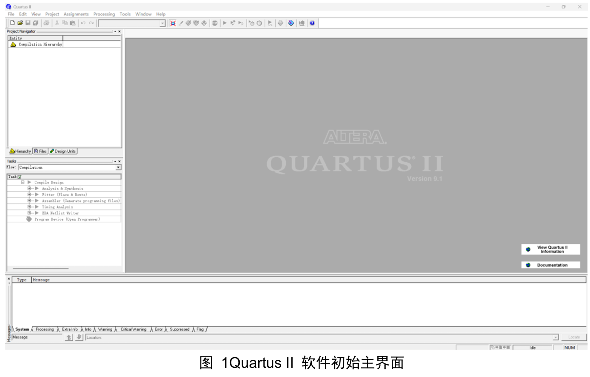
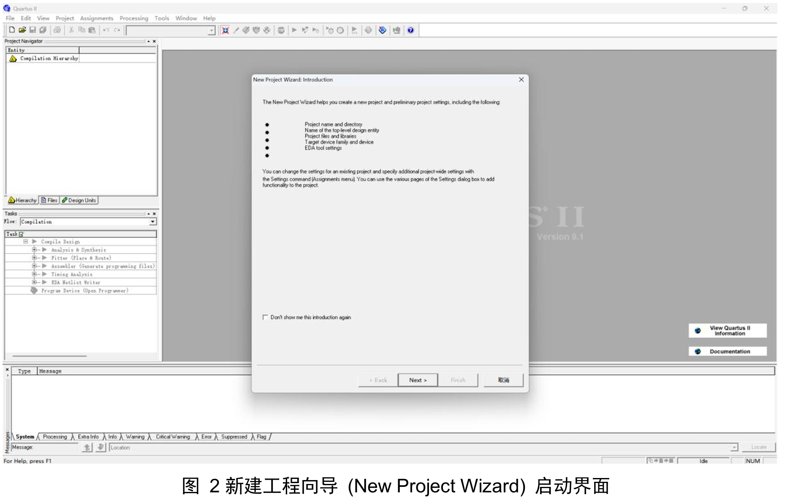
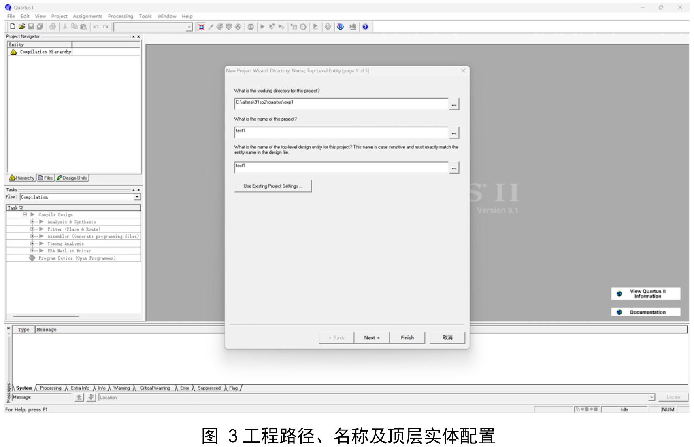
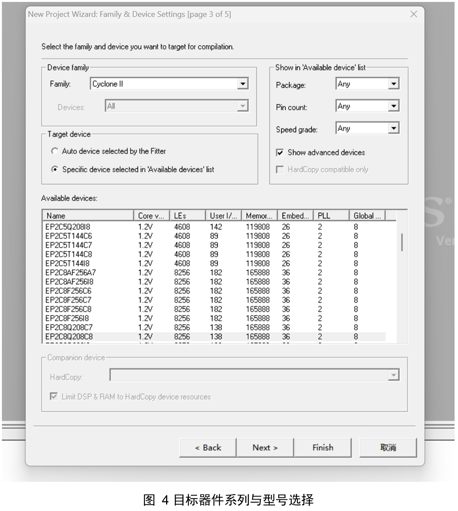
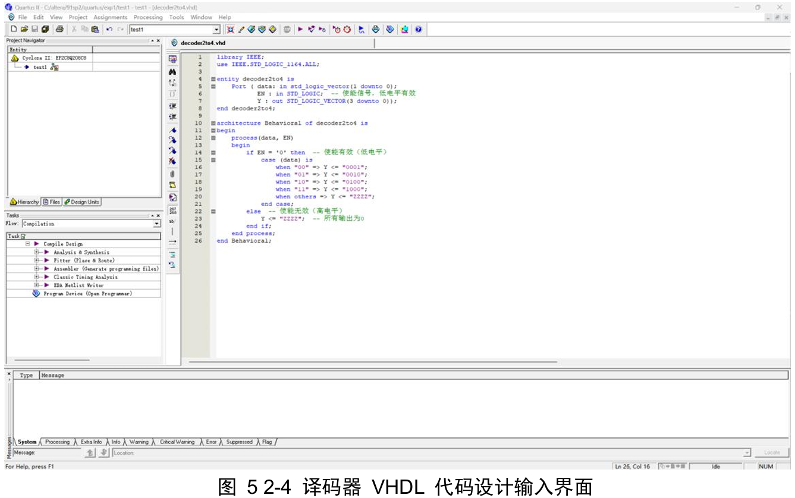
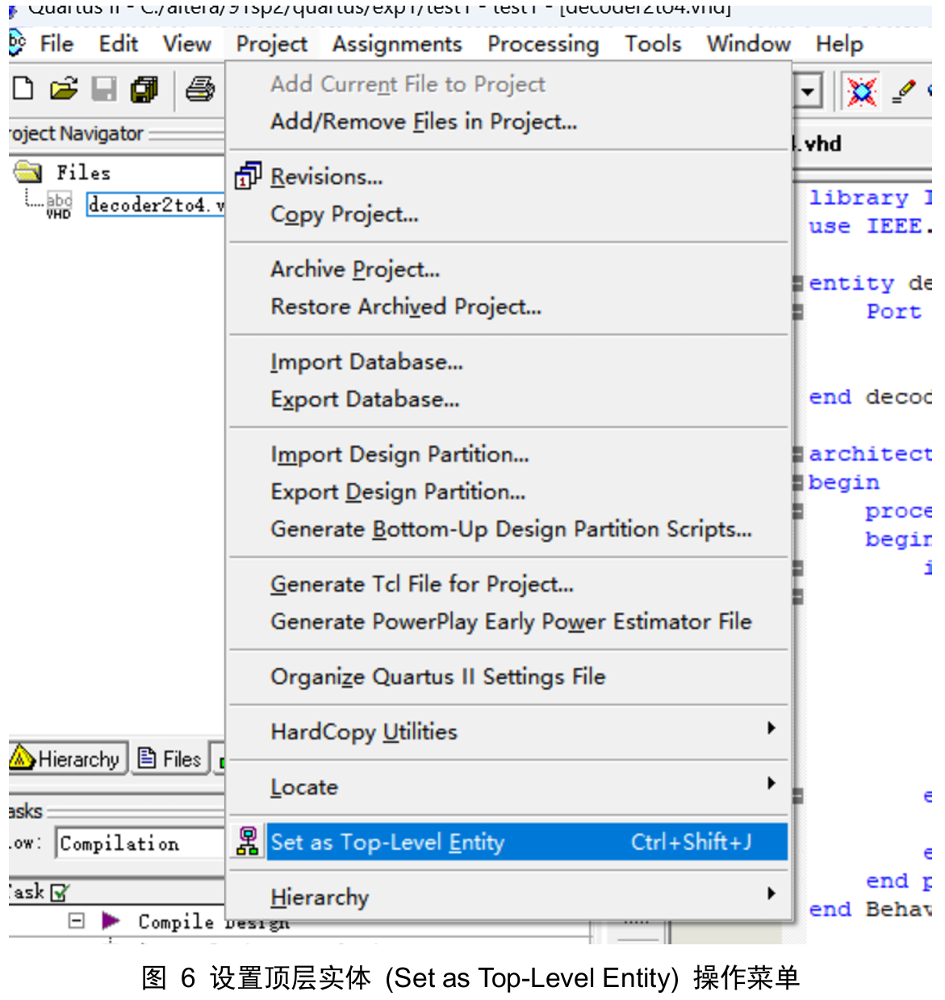


### 六、源代码及注释

由于本次熟悉软件用的代码是实验2的二四译码器的代码，因此源代码以及注释在实验2报告中说明。

### 七、总结

通过本次 Quartus II 开发环境的熟悉实验，我已系统掌握了基于 FPGA 的 EDA 设计全流程，具体心得如下：

- **工程化开发流程的掌握**：能够熟练运用 Quartus II 完成从工程建立、代码输入、全编译到时序仿真的完整闭环。深刻理解了“工程名、顶层文件名、顶层实体名”三者的一致性是工程成功建立的前提。
    
- **调试技巧与问题排查**：重点掌握了“Set as Top-Level Entity”的关键作用。若未正确设置顶层文件，编译器将无法定位入口。
    
- **模块化设计与验证思维**：学会了将 VHDL 代码封装为符号 (Symbol)，建立起“先仿真验证，后硬件实现”的严谨工程习惯。
    

---

## 实验二 组合逻辑电路设计实验

### 一、实验目的

1. 掌握 VHDL 语言中行为级描述的设计方法，重点深入理解进程语句（PROCESS）、多分支选择语句（CASE）及条件判断语句（IF-ELSE）。
    
2. 理解组合逻辑电路设计中锁存器产生的根本原因，掌握通过完善敏感信号列表和闭合条件分支来避免意外锁存器的方法。
    
3. 熟悉地址译码器的逻辑特性及高阻态（High-Z）的应用。
    

### 二、实验内容

基于 Quartus II 开发平台，使用 VHDL 语言设计一个**带低电平使能控制的 2-4 译码器**。编写完善的测试激励，验证三态特性。

### 三、程序设计原理与架构

- **逻辑架构**：输入包含2位数据信号 `data` 和1位低电平有效使能信号 `EN`；输出为4位信号 `Y`。
    
- **实现策略**：
    
    - **三态隔离技术**：当 EN 为高电平时，系统禁用，输出被强制置为高阻态（"ZZZZ"），模拟总线设备特性。
        
    - **并行与防锁存设计**：核心译码逻辑选用 CASE 语句。严格完善敏感信号列表，并添加 `others` 分支，消除意外锁存器风险。
        

### 四、实验步骤及调试过程

**调试记录与问题分析**：

|**问题现象**|**原因分析**|**解决方案**|
|---|---|---|
|**输出产生意外锁存器**：仿真时输出保持上一状态，且综合器警告发现锁存器。|**进程结构不完整**：代码中缺少 others 分支，且 IF 语句未完全覆盖所有条件。|1. 补全 `when others => Y <= "ZZZZ";`<br><br>  <br><br>2. 确保进程的敏感信号列表包含 data 和 EN 所有输入量。|
|**使能逻辑反相**：EN为高电平时进行译码，低电平时呈高阻态。|**逻辑定义理解偏差**：代码误写为 `if EN = '1'`。|将判断逻辑修正为 `if EN = '0' then`，并添加详细注释。|
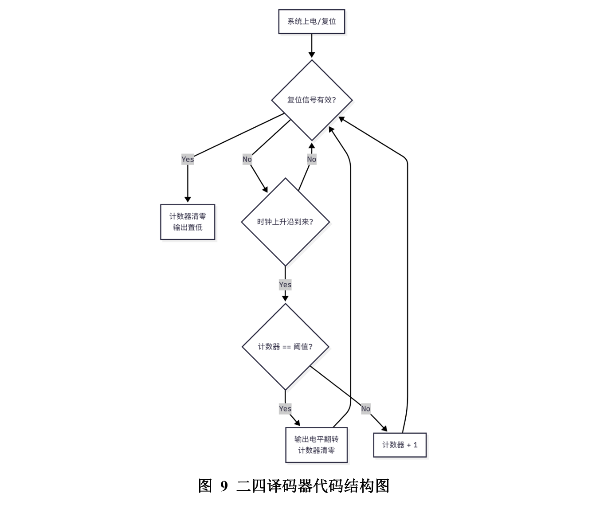
### 五、程序测试与仿真分析

1. **高阻态验证**：当 EN 信号为高电平（'1'）时，无论输入 data 如何变化，输出总线 Y 均显示为中间电平网格（High-Z），证明三态缓冲逻辑工作正常。
    
2. **译码逻辑验证**：当 EN 为低电平（'0'）时，输入 "00"~"11" 正确映射到 "0001"~"1000"。
    
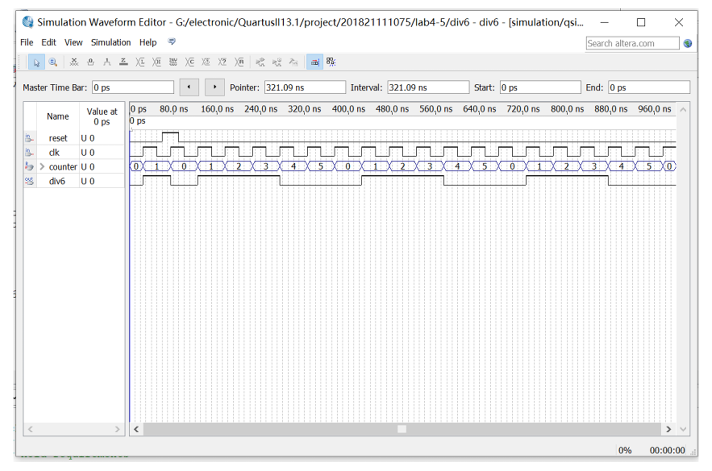
### 六、源代码及注释

VHDL

```
library IEEE;
use IEEE.STD_LOGIC_1164.ALL;

entity decoder2to4 is
    Port ( 
        data : in  STD_LOGIC_VECTOR(1 downto 0); -- 2位数据输入
        EN   : in  STD_LOGIC;                    -- 使能信号，低电平有效
        Y    : out STD_LOGIC_VECTOR(3 downto 0)  -- 4位译码输出
    );
end decoder2to4;

architecture Behavioral of decoder2to4 is
begin
    -- 组合逻辑进程，敏感列表必须包含所有输入信号以避免仿真失配
    process(data, EN)
    begin
        if EN = '0' then          -- 当使能有效（低电平）时，进行译码
            case (data) is
                when "00" => Y <= "0001";
                when "01" => Y <= "0010";
                when "10" => Y <= "0100";
                when "11" => Y <= "1000";
                when others => Y <= "ZZZZ"; -- 安全分支，防止意外锁存
            end case;
        else                      -- 当使能无效（高电平）时
            Y <= "ZZZZ";          -- 输出高阻态（断开输出），实现总线隔离
        end if;
    end process;
end Behavioral;
```

### 七、实验总结

通过本次实验，我深刻体会了“硬件思维”的重要性：

1. **逻辑完备性**：VHDL 代码中每一个条件分支的缺失都可能对应着错误的硬件电路结构（如锁存器）。
    
2. **三态逻辑的工程意义**：直观验证了高阻态与逻辑低电平的区别，理解了其在设备隔离和避免总线竞争中的作用。
    
3. **系统化调试能力**：掌握了“代码检查—综合报告分析—波形仿真反推”的调试方法。
    

---

## 实验三 基于状态机的交通灯控制
### 一、实验目的

1. 掌握有限状态机（FSM）的设计方法及其在时序逻辑电路中的应用。
    
2. 理解自顶向下（Top-Down）的层次化设计思想，熟练掌握多模块电路的构建。
    
3. 熟练运用 VHDL 描述分频电路与复杂状态逻辑。
    

### 二、实验内容与设计指标

- **系统功能**：利用红、黄、绿三个 LED 模拟交通信号灯。
    
- **状态时序**：红灯(9s) -> 绿灯(6s) -> 黄灯(3s) 循环。
    
- **显示方式**：LED 亮灭直接指示，倒计时逻辑控制切换。
    

### 三、系统架构与算法设计

系统分为 **时钟分频单元 (Divider)** 与 **主控制状态机单元 (Light)**。

1. **时钟分频模块**：采用模 N 计数器算法，将 50MHz 时钟降频为 1Hz 脉冲。
    
2. **交通灯控制模块**：
    
    - **状态机**：定义 S_RED, S_GREEN, S_YELLOW 三个状态。
        
    - **定时逻辑**：复用一个 4 位递减计数器 (cnt)，状态跳转时同步加载下一状态的时间初值。
        
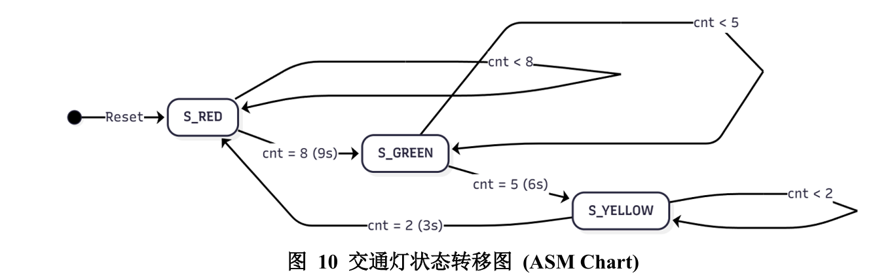
### 四、实验步骤及调试过程

- **调试记录**：
    
    - **仿真无变化**：分频系数过大导致仿真时间不足。**解决**：使用参数缩放法，临时修改分频计数上限为 5 或 10。
        
    - **LED 逻辑反相**：忽略了开发板 LED 共阳极接法。**解决**：修改 VHDL 输出逻辑或在原理图添加非门。
        

### 五、程序测试与仿真分析

- **分频器仿真**：输出信号 q 每隔固定周期产生高电平脉冲。
    
- **交通灯逻辑仿真**：
    
    - 计数器 cnt 呈现 9..0 -> 6..0 -> 3..0 的递减序列。
        
    - 状态 state 在 cnt=0 时正确翻转，输出信号 red/green/yellow 顺序正确。
        
- **引脚分配**：PIN_C11 (红), PIN_D11 (绿), PIN_E10 (黄)。
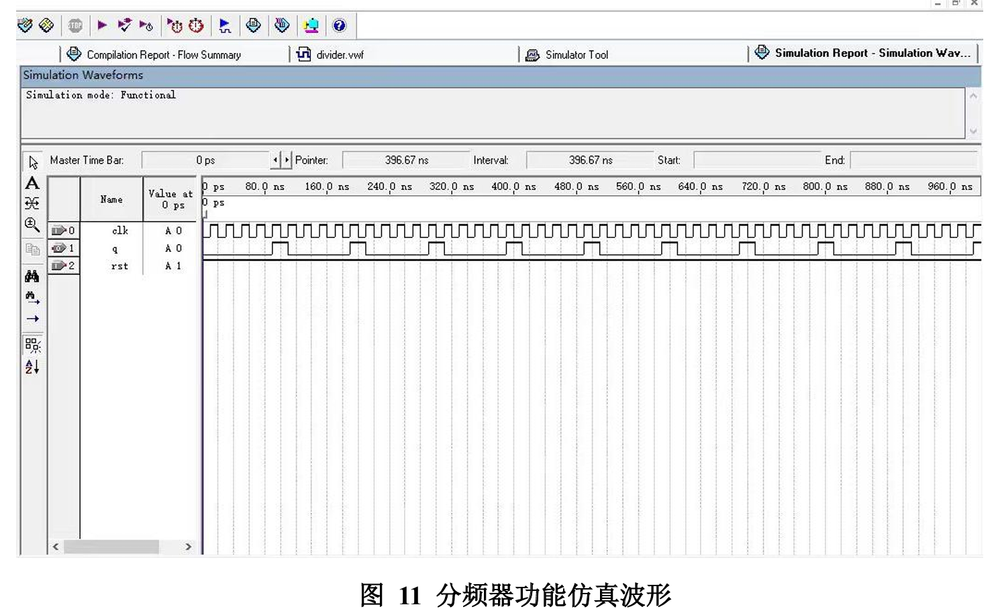
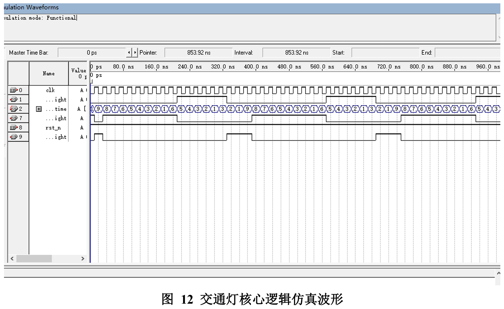
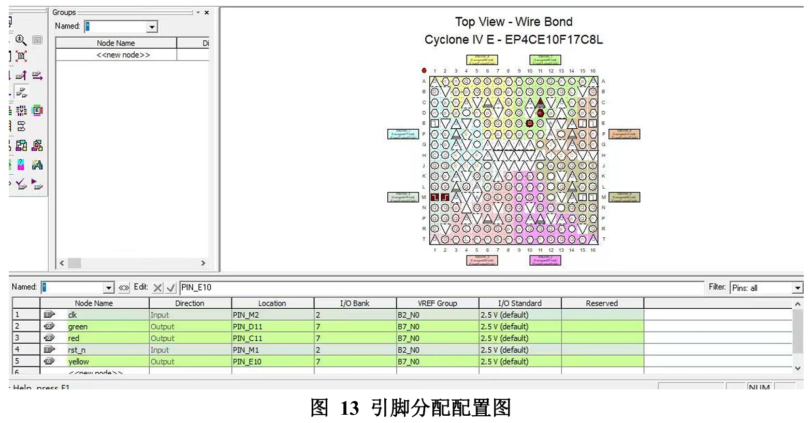
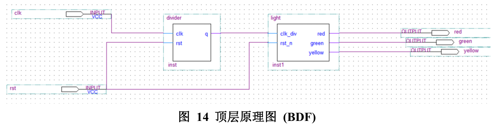

### 六、源代码及注释

#### 1. 时钟分频模块 (Divider)

VHDL

```
Library IEEE;
Use IEEE.std_logic_1164.ALL;

ENTITY divider IS
    PORT(
        clk : IN std_logic;  -- 系统主时钟输入
        rst : IN std_logic;  -- 异步复位信号
        q   : OUT std_logic  -- 1Hz 分频输出脉冲
    );
END ENTITY;

ARCHITECTURE behav of divider IS
    SIGNAL time_cnt : integer := 1;
BEGIN 
   PROCESS(clk, rst)
    BEGIN
        IF rst = '0' THEN 
            time_cnt <= 1;
            q <= '0';
        ELSIF rising_edge(clk) THEN
            -- 模N计数器逻辑
            IF time_cnt = 50000000 THEN  -- 计数达到50M (1秒)
                q <= '1'; -- 产生使能脉冲
                time_cnt <= 1; -- 计数器清零
            ELSE 
                q <= '0';
                time_cnt <= time_cnt + 1;
            END IF;
        END IF;
    END PROCESS;
END behav;
```

#### 2. 交通灯控制模块 (Light)

VHDL

```
library ieee;
use ieee.std_logic_1164.all;
use ieee.std_logic_unsigned.all;

entity light is
    port(
        clk_div : in  std_logic; -- 1Hz 基准时钟输入
        rst_n   : in  std_logic; -- 系统复位（低有效）
        red     : out std_logic; -- 红灯控制信号
        green   : out std_logic; -- 绿灯控制信号
        yellow  : out std_logic  -- 黄灯控制信号
    );
end entity light;

architecture behave of light is
    -- 定义状态枚举类型，提高代码可读性与综合效率
    type state_type is (S_RED, S_GREEN, S_YELLOW);
    signal state : state_type;
    signal cnt   : std_logic_vector(3 downto 0); -- 4位复用倒减计数器
begin
    -- 状态机主进程：同步时序逻辑
    process(clk_div, rst_n)
    begin
        if rst_n = '0' then 
            state <= S_RED;
            cnt <= "1001";      -- 复位初始值为9
            red <= '1'; green <= '0'; yellow <= '0';
        elsif rising_edge(clk_div) then
            case state is
                when S_RED =>   -- 当前状态：红灯
                    red <= '1'; green <= '0'; yellow <= '0';
                    if cnt = 0 then
                        state <= S_GREEN; -- 跳转至绿灯
                        cnt <= "0110";    -- 重载绿灯时间(6s)
                    else
                        cnt <= cnt - 1;   -- 倒计时
                    end if;
                when S_GREEN => -- 当前状态：绿灯
                    red <= '0'; green <= '1'; yellow <= '0';
                    if cnt = 0 then
                        state <= S_YELLOW; -- 跳转至黄灯
                        cnt <= "0011";     -- 重载黄灯时间(3s)
                    else
                        cnt <= cnt - 1;
                    end if;
                when S_YELLOW => -- 当前状态：黄灯
                    red <= '0'; green <= '0'; yellow <= '1';
                    if cnt = 0 then
                        state <= S_RED;   -- 跳转回红灯
                        cnt <= "1001";    -- 重载红灯时间(9s)
                    else
                        cnt <= cnt - 1;
                    end if;
            end case;
        end if;
    end process;
end architecture behave;
```

### 七、实验总结

- **工程设计方法论**：深刻体会了自顶向下（Top-Down）设计思想，解耦了时基生成与逻辑控制，提高了代码可复用性。
    
- **FSM 技术**：熟练掌握了“状态跳转+计数器重载”的协同机制，高效实现了非等时周期的状态循环。
    
- **软硬件调试**：学会了“参数缩放法”解决仿真时间尺度差异问题，并积累了处理引脚极性不匹配的经验。
    

---

## 实验四 基于状态机的按键控制
### 一、实验目的

1. 掌握有限状态机（FSM）的三段式设计方法。
    
2. 理解机械按键抖动特性，掌握全数字消抖算法及边沿检测电路设计。
    
3. 熟悉异步信号同步化机制，消除亚稳态。
    

### 二、实验内容

设计单键控制多 LED 状态切换系统。使用 1 个按键控制 4 个 LED 循环切换（全灭 -> LED1 -> LED2 -> LED3 -> LED4 -> LED1...）。要求设计 20ms 滤波消抖。

### 三、系统架构与算法设计

1. **输入预处理层**：
    
    - **亚稳态消除**：双级寄存器打拍同步。
        
    - **消抖算法**：连续采样计数法。需信号稳定保持 20ms 才更新状态。
        
    - **边沿检测**：捕捉按键“弹起”动作（上升沿），产生单脉冲。
        
2. **逻辑控制层 (FSM)**：
    
    - **状态编码**：VHDL 枚举类型 (S_OFF, S_LED1...), 综合为独热码。
        
    - **三段式描述**：时序进程（状态更新）、组合进程1（次态逻辑）、组合进程2（输出解码）。
        
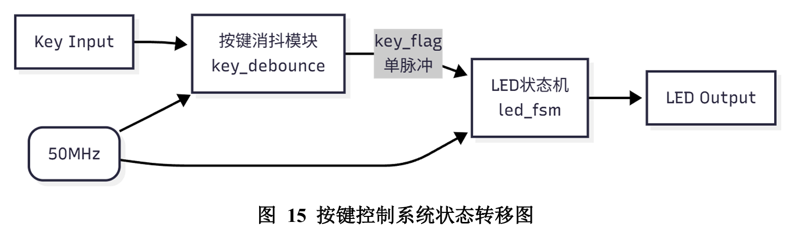
### 四、实验步骤及调试过程

- **仿真策略**：采用参数缩放法，将消抖阈值从 1,000,000 (20ms) 临时修改为 4 个时钟周期，以便在仿真中快速验证。
    
- **结果分析**：
    
    - 在 key_in 抖动期间，key_stable 保持不变，验证了消抖逻辑。
        
    - 当 key_stable 发生 0->1 跳变时，产生 key_release_pulse。
        
    - 状态机随脉冲正确循环跳转。
        

### 五、源代码及注释

VHDL

```
LIBRARY IEEE;
USE IEEE.STD_LOGIC_1164.ALL;
USE IEEE.STD_LOGIC_ARITH.ALL;
USE IEEE.STD_LOGIC_UNSIGNED.ALL;

ENTITY Key_LED_FSM IS
    PORT (
        clk     : IN STD_LOGIC;                     -- 50MHz 系统时钟
        rst_n   : IN STD_LOGIC;                     -- 异步复位，低电平有效
        key_in  : IN STD_LOGIC;                     -- 物理按键输入
        led_out : OUT STD_LOGIC_VECTOR(3 DOWNTO 0)  -- 4路LED输出
    );
END Key_LED_FSM;

ARCHITECTURE Behavioral OF Key_LED_FSM IS
    TYPE state_type IS (S_OFF, S_LED1, S_LED2, S_LED3, S_LED4);
    SIGNAL current_state, next_state : state_type;
    -- 输入处理信号
    SIGNAL key_reg1, key_reg2 : STD_LOGIC; -- 双级同步寄存器
    SIGNAL key_stable         : STD_LOGIC; -- 消抖后的稳定信号
    SIGNAL cnt_debounce       : INTEGER RANGE 0 TO 1000000 := 0; -- 20ms计数器
    SIGNAL key_stable_r       : STD_LOGIC; -- 上一周期状态缓存
    SIGNAL key_release_pulse  : STD_LOGIC; -- 按键弹起有效脉冲

BEGIN
    --================================================================
    -- 模块1：输入同步与消抖 (Input Synchronization & Debounce)
    --================================================================
    PROCESS (clk, rst_n)
    BEGIN
        IF rst_n = '0' THEN
            key_reg1 <= '1'; key_reg2 <= '1';
            cnt_debounce <= 0; key_stable <= '1';
        ELSIF rising_edge(clk) THEN
            -- 两级打拍同步
            key_reg1 <= key_in; key_reg2 <= key_reg1;
            IF (key_reg2 /= key_stable) THEN
                -- 输入值不一致，启动计数
                IF (cnt_debounce < 1000000) THEN  -- 仿真时可将此值改为 4
                    cnt_debounce <= cnt_debounce + 1;
                ELSE
                    -- 计数满20ms，确认翻转
                    cnt_debounce <= 0;
                    key_stable <= key_reg2;
                END IF;
            ELSE
                cnt_debounce <= 0;
            END IF;
        END IF;
    END PROCESS;

    --================================================================
    -- 模块2：边沿检测 (Edge Detection)
    --================================================================
    PROCESS (clk, rst_n)
    BEGIN
        IF rst_n = '0' THEN
            key_stable_r <= '1'; key_release_pulse <= '0';
        ELSIF rising_edge(clk) THEN
            key_stable_r <= key_stable;
            -- 检测上升沿：当前为1，前一刻为0
            IF (key_stable = '1' AND key_stable_r = '0') THEN
                key_release_pulse <= '1';
            ELSE
                key_release_pulse <= '0';
            END IF;
        END IF;
    END PROCESS;

    --================================================================
    -- 模块3：有限状态机 (FSM) - 三段式
    --================================================================
    -- (1) 时序进程
    PROCESS (clk, rst_n)
    BEGIN
        IF rst_n = '0' THEN
            current_state <= S_OFF;
        ELSIF rising_edge(clk) THEN
            current_state <= next_state;
        END IF;
    END PROCESS;

    -- (2) 组合进程：次态逻辑
    PROCESS (current_state, key_release_pulse)
    BEGIN
        next_state <= current_state;
        IF key_release_pulse = '1' THEN
            CASE current_state IS
                WHEN S_OFF  => next_state <= S_LED1;
                WHEN S_LED1 => next_state <= S_LED2;
                WHEN S_LED2 => next_state <= S_LED3;
                WHEN S_LED3 => next_state <= S_LED4;
                WHEN S_LED4 => next_state <= S_LED1;
                WHEN OTHERS => next_state <= S_OFF;
            END CASE;
        END IF;
    END PROCESS;

    -- (3) 组合进程：输出解码
    PROCESS (current_state)
    BEGIN
        CASE current_state IS
            WHEN S_OFF  => led_out <= "0000";
            WHEN S_LED1 => led_out <= "0001";
            WHEN S_LED2 => led_out <= "0010";
            WHEN S_LED3 => led_out <= "0100";
            WHEN S_LED4 => led_out <= "1000";
            WHEN OTHERS => led_out <= "0000";
        END CASE;
    END PROCESS;
END Behavioral;
```

### 六、实验总结

1. **软硬件鸿沟的跨越**：深刻认识到物理按键抖动（毫秒级）与数字时钟（纳秒级）的差异，掌握了通过双级寄存器同步与滤波计数算法来桥接这一鸿沟。
    
2. **结构化设计思维**：采用了“消抖-边沿检测-状态机”分层架构及 FSM 三段式写法，提升了代码的鲁棒性。
    
3. **仿真调试技巧**：针对长周期消抖逻辑，熟练运用参数缩放法，大幅缩短了验证时间。