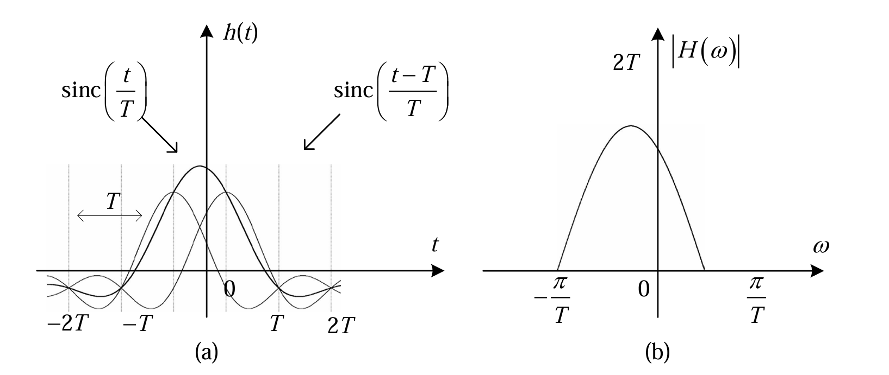
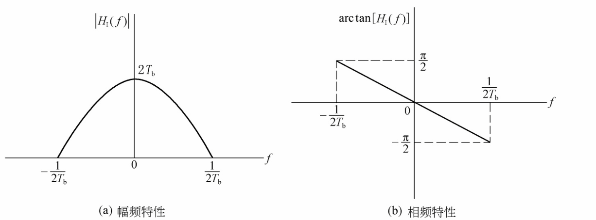
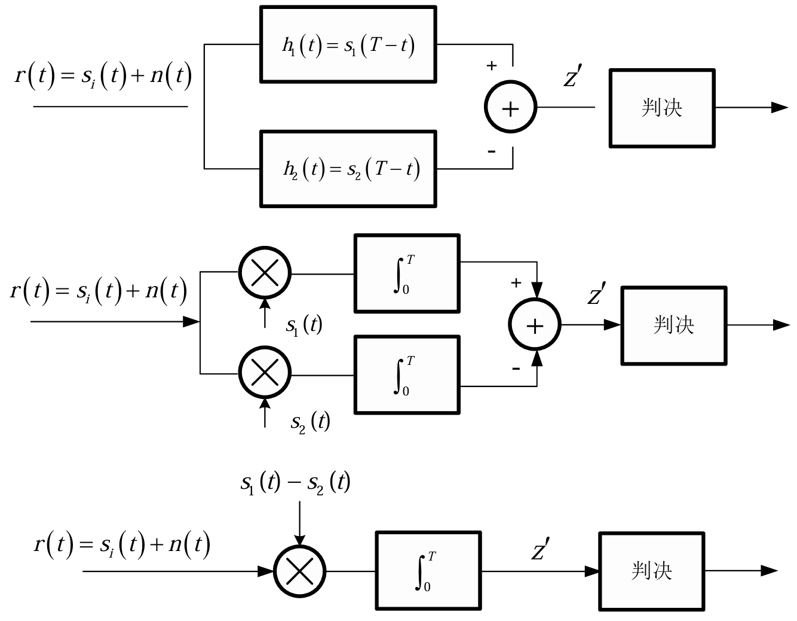
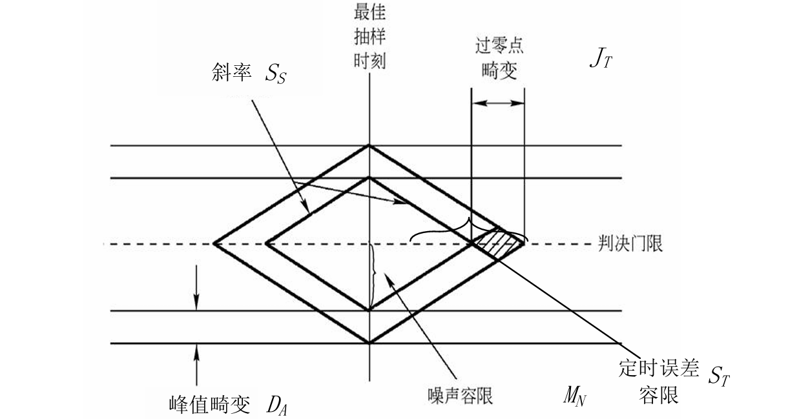

## 🎯 本章基本内容

-   **基本模型**：了解数字基带传输系统的构成。
-   **波形设计与编码**：学习常见的基带信号码型及其特性。
-   **功率谱**：分析不同码型的频谱特性，理解其对传输的影响。
-   **码间串扰**：研究码间串扰产生的原因和消除条件（奈奎斯特准则）。
-   **部分响应系统**：了解一种主动引入可控码间串扰来提高频带利用率的技术。
-   **信号检测与最佳接收**：探讨在噪声环境下如何最优地恢复信号。

---

## 5.1 引言 🗣️

-   **数字基带信号**：指未经载波调制（频谱搬移）的数字电脉冲信号。它的频谱是从零频或直流附近开始的。
-   **数字基带传输系统**：直接利用基带信号来传输信息的系统。

-   **应用场景** 🖥️
    -   短距离的数据传输。
    -   计算机局域网的构建。

-   **系统特点** ✨
    -   优点：简单、经济、易于实现。
    -   缺点：一般只适用于有线传输场景。

---

## 5.2 基带传输系统的基本模型 🏗️

一个典型的数字基带传输系统由以下几个核心部分组成：

-   **波形变换**：将二进制的数字序列（例如`0`和`1`）转换成适合在信道中传输的特定电脉冲波形。
-   **信道**：传输信号的物理媒介，对于基带系统，通常是有线信道（如同轴电缆、双绞线）。信道会引入噪声 `n(t)`。
-   **接收滤波器**：主要有两个作用：
    1.  尽可能滤除信道引入的带外噪声。
    2.  对信道特性进行校正，补偿信号失真。
-   **抽样判决器**：在特定的时刻（同步信号的指导下）对接收到的波形进行抽样，然后与预设的门限进行比较，判决出原始的数字信息是`0`还是`1`。

---

## 5.3 基带信号的波形设计与编码 📟

### 1. 基本波形

在一个码元周期内，可以用不同形状的脉冲来表示数字信号，常见的三种基本调制方式：

-   **脉冲幅度调制 (PAM)**：用脉冲的幅度变化来表示数字序列。
-   **脉冲位置调制 (PPM)**：用脉冲在码元周期内的位置变化来表示数字序列。
-   **脉冲宽度调制 (PDM)**：用脉冲的宽度变化来表示数字序列。

在实际系统中，最常用的是基于**脉冲幅度调制**的二进制基带信号。

### 2. 常用二进制码型 📈

不同的编码方式（码型）会赋予信号不同的特性，以适应不同的传输需求。

#### (1) 单极性不归零码 (Unipolar NRZ)

-   **规则**：“1”码对应正电平，“0”码对应零电平。在一个码元时间内电平不回到零。
-   **特点**：
    -   含有丰富的直流分量和低频分量，不适合经过交流耦合（会隔直）的系统传输。
    -   抗噪声性能较差。
    -   当出现连续的`1`或`0`时，信号长时间不变，难以提取同步信号，容易失步。

#### (2) 双极性不归零码 (Polar NRZ)

-   **规则**：“1”码对应正电平，“0”码对应负电平。
-   **特点**：
    -   当`1`和`0`等概率出现时，没有直流分量。
    -   判决门限为0，抗干扰能力比单极性码强。
    -   同样存在连续`1`或`0`时难以提取同步信号的问题。

#### (3) 归零码 (RZ)

-   **规则**：脉冲在码元持续时间之内会返回到零电平，即占空比小于1。分为单极性归零码和双极性归零码。
-   **特点**：
    -   由于每个码元都有电平的跳变（即使是连续的`1`），频谱中含有丰富的定时信息，便于提取同步信号。
    -   占用了更宽的频带，频带利用率较低。

#### (4) 差分码 (Differential Code)

-   **核心思想**：用码元之间的电平是否跳变来表示信息，而不是电平本身。
-   **传号差分码 (NRZ-M)**：
    -   规则：电平跳变表示`1`，电平不变表示`0`。
    -   编码公式：
        $b_n = a_n \oplus b_{n-1}$
        其中 $a_n$ 是输入信息位， $b_n$ 是编码后的输出。
-   **空号差分码 (NRZ-S)**：
    -   规则：电平跳变表示`0`，电平不变表示`1`。
-   **优点**：可以解决通信系统中可能出现的“相位模糊”或“倒码”问题。

#### (5) 交替极性码 (AMI码, Alternate Mark Inversion)

-   **规则**：“0”码对应零电平，“1”码（传号）对应交替出现的正负脉冲。
-   **特点**：
    -   没有直流分量，能量集中在低频。
    -   交替的极性提供了检错能力（如果收到两个同极性的脉冲，则一定有误码）。
    -   当出现长串`0`时，仍然存在同步困难问题。

#### (6) HDB₃码 (三阶高密度双极性码)

-   **目的**：是AMI码的改进版，为了解决AMI码中长串`0`的同步问题。
-   **规则**：
    1.  当连续`0`的个数不超过3个时，编码规则同AMI码。
    2.  当出现4个连续的`0`时，将这`0000`替换为特定的码组`B00V`或`000V`。
        -   `B`（Balance）: 破坏脉冲，极性与前一个`1`码的极性相同，以破坏AMI的交替规则。
        -   `V`（Violation）: 平衡脉冲，极性与前一个`B`码的极性相反，以维持直流平衡。
    -   选择`B00V`还是`000V`的原则是：使相邻的`V`脉冲极性交替出现，以维持整体的直流平衡。
-   **优点**：兼具AMI码的优点，同时保证了信号中有足够的跳变，确保了同步信号的提取。
- 

#### (7) 曼彻斯特码 (Manchester Code)

-   **规则**：
    -   “1”码：码元中间出现从高到低的跳变。
    -   “0”码：码元中间出现从低到高的跳变。
-   **特点**：
    -   每个码元中间都有一次跳变，蕴含了丰富的同步信息，同步性能极好。
    -   没有直流分量。
    -   编码效率低，所占用的带宽是NRZ码的两倍。常用于局域网（如以太网）。

---

## 5.4 基带信号的功率谱 📊

分析信号功率谱的目的：

1.  根据信号谱特性，选择合适的传输信道。
2.  根据信道特性，选择合适的编码码型。
3.  判断频谱中是否含有离散的线谱分量，以确定定时信号的提取方法。
### 1.模型定义

信号 $s(t)$：
$$s(t) = \sum_{n=-\infty}^{\infty} g_k(t - nT)$$
其中，$g_k(t)$ 是随机选取的脉冲：
$$g_k(t) = \begin{cases} g_1(t) & \text{以概率 } P \\ g_2(t) & \text{以概率 } 1-P \end{cases}$$
码元间隔 $T$，码元速率 $f_T = 1/T$。

### 2.信号分解：平均值与零均值随机分量

为了应用周期性随机信号的功率谱推导框架，我们首先将信号 $s(t)$ 分解为**平均周期分量 $\mu(t)$** 和**零均值随机分量 $v(t)$**：

$$s(t) = \mu(t) + v(t)$$

#### A. 平均周期分量 $\mu(t)$

$\mu(t)$ 是信号的期望值 $E[s(t)]$：

$$\mu(t) = E[s(t)] = E\left[\sum_{n} g_k(t - nT)\right] = \sum_{n} E[g_k(t - nT)]$$

由于 $g_k(t)$ 的选择是 IID 且与时间 $n$ 无关，我们计算 $E[g_k(t)]$：

$$E[g_k(t)] = P \cdot g_1(t) + (1-P) \cdot g_2(t)$$

定义平均脉冲 $\bar{g}(t) = P g_1(t) + (1-P) g_2(t)$。

$$\mu(t) = \sum_{n=-\infty}^{\infty} \bar{g}(t - nT)$$

这是一个周期信号，周期为 $T$。

#### B. 零均值随机分量 $v(t)$

$$v(t) = s(t) - \mu(t) = \sum_{n} \left[ g_k(t - nT) - \bar{g}(t - nT) \right]$$

定义零均值随机脉冲 $w_n(t) = g_k(t - nT) - \bar{g}(t - nT)$。

$$v(t) = \sum_{n} w_n(t)$$

### 3.功率谱密度 $S_s(f)$ 的推导

由于 $\mu(t)$ 是周期性的确定性信号，$v(t)$ 是零均值的随机信号，且两者正交，总功率谱 $S_s(f)$ 等于两者功率谱之和：

$$S_s(f) = S_{\mu}(f) + S_v(f)$$

---

#### I. 离散谱 $P_{\mu}(f) = S_{\mu}(f)$ 的推导

离散谱由周期平均分量 $\mu(t)$ 贡献。周期信号的功率谱是冲激串，位于谐波频率 $m f_T$ 处。

$$P_{\mu}(f) = \sum_{m=-\infty}^{\infty} |C_m|^2 \delta(f - m f_T)$$

其中 $C_m$ 是 $\mu(t)$ 的傅里叶级数系数：

$$C_m = \frac{1}{T} \int_{-T/2}^{T/2} \mu(t) e^{-j 2\pi m f_T t} dt$$

代入 $\mu(t) = \sum_{n} \bar{g}(t - nT)$，并利用**脉冲周期化公式**（这正是您在第一个问题中推导 $C_m$ 的过程）：

$$C_m = \frac{1}{T} \mathcal{F}\{\bar{g}(t)\}|_{f=m f_T} = \frac{1}{T} \bar{G}(m f_T)$$

其中，$\bar{G}(f)$ 是平均脉冲 $\bar{g}(t)$ 的傅里叶变换：
$$\bar{G}(f) = \mathcal{F}\{P g_1(t) + (1-P) g_2(t)\} = P G_1(f) + (1-P) G_2(f)$$

因此，将 $C_m$ 代入 $P_{\mu}(f)$：

$$P_{\mu}(f) = \sum_{m=-\infty}^{\infty} \left| \frac{1}{T} \left[P G_1(m f_T) + (1-P) G_2(m f_T)\right] \right|^2 \delta(f - m f_T)$$

考虑到 $f_T = 1/T$，可以写成：

$$\mathbf{P_{\mu}(f) = \sum_{m=-\infty}^{\infty} f_T^2 \left| P G_1(m f_T) + (1-P) G_2(m f_T) \right|^2 \delta(f - m f_T)}$$

---

#### II. 连续谱 $P_V(f) = S_v(f)$ 的推导

连续谱由零均值随机分量 $v(t)$ 贡献。

$v(t)$ 的自相关函数 $R_v(\tau)$ 是其期望自相关函数的时平均：

$$R_v(\tau) = \frac{1}{T} \int_{-T/2}^{T/2} E[v(t) v^*(t+\tau)] dt$$

代入 $v(t) = \sum_{n} w_n(t)$：

$$E[v(t) v^*(t+\tau)] = \sum\_{n} \sum_{k} E[w_n(t) w_k^\*(t+\tau)]$$

由于 $w_n(t)$ 也是 IID 序列（脉冲选择独立）：
*   当 $n \neq k$ 时， $E[w_n(t) w_k^\*(t+\tau)] = E[w_n(t)] E[w_k^\*(t+\tau)] = 0$ (因为 $w_n(t)$ 是零均值)。
*   当 $n = k$ 时， $E[w_n(t) w_n\*(t+\tau)] = E[|w_n(t)|^2]$。

$$E[v(t) v^\*(t+\tau)] = \sum\_{n} E[w_n(t) w_n^\*(t+\tau)]$$

将上式代入 $R_v(\tau)$：

$$R_v(\tau) = \frac{1}{T} \int_{-T/2}^{T/2} \sum_{n} E[w_n(t) w_n^*(t+\tau)] dt$$

再次利用周期性积分恒等式，将积分和求和互换，积分范围变为 $[-\infty, \infty]$：

$$R_v(\tau) = \frac{1}{T} \int_{-\infty}^{\infty} E[w_0(t) w_0^*(t+\tau)] dt$$

（注意：因为 $w_n(t)$ 的统计特性与 $n$ 无关，所以 $E[w_n]$ 与 $E[w_0]$ 相同。）

现在我们需要计算 $E[w_0(t) w_0^*(t+\tau)]$：
$$w_0(t) = g_k(t) - \bar{g}(t)$$

$$\begin{aligned} E[w_0(t) w_0^\*(t+\tau)] &= E[\{g_k(t) - \bar{g}(t)\} \{g_k^\*(t+\tau) - \bar{g}^\*(t+\tau)\}] \\\\ &= E[g_k(t) g_k^\*(t+\tau)] - E[g_k(t)] \bar{g}^\*(t+\tau) - \bar{g}(t) E[g_k^\*(t+\tau)] + \bar{g}(t) \bar{g}^\*(t+\tau) \end{aligned}$$

根据定义，$E[g_k(t)] = \bar{g}(t)$ 和 $E[g_k^\*(t+\tau)] = \bar{g}^\*(t+\tau)$。代入：

$$E[w_0(t) w_0^\*(t+\tau)] = E[g_k(t) g_k^\*(t+\tau)] - \bar{g}(t) \bar{g}^\*(t+\tau)$$

计算 $E[g_k(t) g_k^\*(t+\tau)]$：

$$E[g_k(t) g_k^\*(t+\tau)] = P g_1(t) g_1^\*(t+\tau) + (1-P) g_2(t) g_2^\*(t+\tau)$$

因此：
$$E[w_0(t) w_0^\*(t+\tau)] = P g_1(t) g_1^\*(t+\tau) + (1-P) g_2(t) g_2^\*(t+\tau) - \bar{g}(t) \bar{g}^\*(t+\tau)$$

代回 $R_v(\tau)$：
$$R_v(\tau) = \frac{1}{T} \int_{-\infty}^{\infty} \left[ P g_1(t) g_1^\*(t+\tau) + (1-P) g_2(t) g_2^\*(t+\tau) - \bar{g}(t) \bar{g}^\*(t+\tau) \right] dt$$

根据傅里叶变换的定义：$\mathcal{F}\{\int g_a(t) g_b^\*(t+\tau) dt\} = G_a(f) G_b^\*(f)$。

对 $R_v(\tau)$ 进行傅里叶变换 $S_v(f)$：

$$S_v(f) = \frac{1}{T} \left[ P |G_1(f)|^2 + (1-P) |G_2(f)|^2 - |\bar{G}(f)|^2 \right]$$

将 $\bar{G}(f) = P G_1(f) + (1-P) G_2(f)$ 代入 $|\bar{G}(f)|^2$ 并展开（假设 $g_k(t)$ 是实数，所以 $G_k^*(f) = G_k(-f)$）：

$$\begin{aligned} |\bar{G}(f)|^2 &= \left( P G_1(f) + (1-P) G_2(f) \right) \left( P G_1^\*(f) + (1-P) G_2^\*(f) \right) \\\\ &= P^2 |G_1(f)|^2 + (1-P)^2 |G_2(f)|^2 + P(1-P) [G_1(f) G_2^\*(f) + G_2(f) G_1^\*(f)]\end{aligned}$$

将其代回 $S_v(f)$ 并整理：

$$S_v(f) = \frac{1}{T} { P |G_1|^2 + (1-P) |G_2|^2 - P^2 |G_1|^2 - (1-P)^2 |G_2|^2 - P(1-P) [G_1 G_2^\* + G_2 G_1^\*] }$$

合并 $|G_1|^2$ 项：$P - P^2 = P(1-P)$

合并 $|G_2|^2$ 项：$(1-P) - (1-P)^2 = (1-P)[1 - (1-P)] = P(1-P)$。

$$S_v(f) = \frac{1}{T} P(1-P) { \|G_1\|^2 + \|G_2\|^2 - [G_1 G_2^\* + G_2 G_1^\*] }$$

观察大括号内的项，它正是平方差的展开形式：
$$\|G_1\|^2 + \|G_2\|^2 - \(G_1 G_2^\* + G_2 G_1^\*\) = \|G_1 - G_2\|^2 $$

最终，连续谱 $P_V(f)$ 为：

$$\mathbf{P_V(f) = \frac{P(1-P)}{T} |G_1(f) - G_2(f)|^2}$$

考虑到 $f_T = 1/T$，上式可以写成：

$$\mathbf{P_V(f) = f_T P(1-P) |G_1(f) - G_2(f)|^2}$$
### 4.随机序列功率谱的通用公式

对于一个由随机序列 $a_n$ 调制的脉冲信号 $g_T(t)$ 构成的平稳基带信号：
$s(t) = \sum_{n=-\infty}^{\infty} a_n g_T(t-nT)$

其功率谱密度为：
$$ \boxed{ P_s(f) = \frac{1}{T}|G_T(f)|^2 \sum_{m=-\infty}^{\infty} R_a(m) e^{-j2\pi fmT} } $$
其中：
-   $G_T(f)$ 是单个脉冲波形 $g_T(t)$ 的傅里叶变换。
-   $R_a(m) = E[a_n a_{n+m}]$ 是序列 $\{a_n\}$ 的自相关函数。

💡 **注意点**：这个公式是分析所有码型功率谱的理论基础。核心在于两部分：单个码元波形的频谱 $|G_T(f)|^2$ 和数字序列的统计特性 $R_a(m)$。

### 5.几种码型的功率谱特点

-   **不归零码 (NRZ)**：
    -   主瓣宽度为 $1/T = R_b$ (码元速率)。
    -   在 $f=0$ 处有较大的值（直流分量）。
-   **归零码 (RZ)**：
    -   主瓣宽度为 $2/T = 2R_b$，是NRZ码的两倍。
    -   在 $f=1/T, 2/T, ...$ 处有离散的线谱，便于提取定时。
-   **AMI码**：
    -   在 $f=0$ 处功率谱密度为零，无直流分量。
    -   能量主要集中在 $f = R_b/2$ 附近。
-   **曼彻斯特码**：
    -   在 $f=0$ 处功率谱密度为零，无直流分量。
    -   主瓣宽度是NRZ码的两倍，频带利用率低。

---

## 5.5 码间串扰与波形传输无失真的条件 🚦

### 1. 码间串扰 (ISI)

-   **原因**：实际的通信信道都是带限的（无法通过无限带宽的信号）。当一个脉冲信号通过带限信道后，其波形会发生展宽、拖尾。
-   **现象**：前一个码元的拖尾会延伸到当前码元的抽样时刻，对当前码元的判决造成干扰。这种由前后码元引起的干扰称为**码间串扰** (ISI)。

接收端在 $t=kT$ 时刻的抽样值为：
$y(kT) = \underbrace{a_k h(0)}\_{\text{期望信号}} + \underbrace{\sum_{n \neq k} a_n h((k-n)T)}\_{\text{码间串扰}}$
其中 $h(t)$ 是整个系统的冲激响应。

### 2. 奈奎斯特第一准则 (无码间串扰准则)

为了在抽样时刻消除码间串扰，系统的冲激响应 $h(t)$ 必须满足：

-   **时域条件**：
    $$ \boxed{ h(kT) = \begin{cases} 1, & k=0 \\ 0, & k \neq 0 \end{cases} } $$
    这意味着，在当前码元的抽样时刻，其值为1，而在所有其他码元的抽样时刻，其值都恰好为0。

-   **频域条件**：
    将 $h(t)$ 的频谱 $H(f)$ 按码元速率的倒数 $1/T$ 进行周期延拓并叠加，结果应为一个常数。
    $$ \boxed{ \sum_{i=-\infty}^{\infty} H(f - \frac{i}{T}) = T \quad (\text{常数})\ \ \ \ \ } $$

#### (1) 理想低通系统（最窄带宽）

-   满足奈奎斯特第一准则的最窄带宽系统是理想低通（矩形窗）系统。
-   其带宽被称为奈奎斯特带宽：$W = \frac{1}{2T} = \frac{R_b}{2}$。
-   对应的最高码元速率被称为奈奎斯特速率：$R_b = 2W$。
-   **缺点**：
    1.  理想矩形滤波器在物理上无法实现。
    2.  其冲激响应 `sinc(t)` 拖尾衰减慢，对抽样时刻的精度要求非常高。

#### (2) 升余弦滚降系统

-   为了克服理想系统的缺点，采用滚降特性来设计滤波器，使其频谱从通带到阻带平滑过渡。
-   **滚降系数** $\alpha$ ($0 \le \alpha \le 1$)：
    -   $\alpha = 0$: 理想矩形系统。
    -   $\alpha = 1$: 全滚降（升余弦）系统，频谱最平滑。
    -   $0 < \alpha < 1$: 部分滚降。
-   **带宽**：$W = (1+\alpha) \frac{R_b}{2}$。
-   **优点**：
    1.  物理上可实现。
    2.  冲激响应拖尾衰减快，对定时误差不敏感。
-   **代价**：牺牲了带宽，频带利用率降低。

---

## 5.6 部分响应基带传输系统 🤝

### 1. 基本思想

-   奈奎斯特准则要求在抽样点上无码间串扰，代价是带宽或实现的复杂性。
-   **部分响应**系统反其道而行之：**主动地、有规律地**在前后码元之间引入可控的码间串扰。
-   **目的**：用简单的、物理可实现的滤波器达到奈奎斯特速率（$2W$），同时保持对定时误差不敏感的优点。

### 2. 第一类部分响应（双二进制码）

-   引入的码间串扰是：当前码元的抽样值仅受前一个码元的干扰。
-   在抽样时刻 $t=nT$，接收到的值为：$c_n = d_n + d_{n-1}$
    其中 $\{d_n\}$ 是发送的符号序列。
-   解码时，可以通过减法来恢复原码：$\hat{d}_n = c_n - \hat{d}\_{n-1}$。

这里我们分析第一类部分响应系统的冲激响应和频谱特性。这类系统在数字通信中也被称为**双二进制（Duobinary）** 系统。

#### (1) 定义第一类部分响应系统的冲激响应

系统的冲激响应 `h(t)` 由两个时间上相隔为 `T` 的 `sinc` 函数叠加而成：

$$
h(t) = \text{sinc}\left(\frac{t}{T}\right) + \text{sinc}\left(\frac{t-T}{T}\right)
$$

根据归一化 `sinc` 函数的定义 $\text{sinc}(x) = \frac{\sin(\pi x)}{\pi x}$ ，上式可以展开为：

$$
h(t) = \frac{\sin\left(\frac{\pi t}{T}\right)}{\frac{\pi t}{T}} + \frac{\sin\left(\frac{\pi (t-T)}{T}\right)}{\frac{\pi (t-T)}{T}}
$$

经过化简，可以得到一个更紧凑的表达式：

$$
= \frac{T^2 \sin\left(\frac{\pi t}{T}\right)}{\pi t(T-t)}
$$

---

#### (2) 第一类部分响应系统的频谱特性

系统的频谱特性 `H(ω)`（即传递函数）是其冲激响应 `h(t)` 的傅里叶变换。

> (带宽与“最窄系统”相同)
>
> **解释**: 这句话意味着第一类部分响应系统的带宽与满足奈奎斯特第一准则的理想（最窄）系统的带宽是相同的，均为 $\frac{\pi}{T}$ (rad/s) 或 $\frac{1}{2T}$ (Hz)。

根据图片，其频谱特性 `H(ω)` 表示为：
$$
H(\omega) =
\begin{cases}
\left(Te^{j\frac{\omega \pi T}{2}} + Te^{-j\frac{\omega \pi T}{2}}\right)e^{-j\frac{\omega \pi T}{2}} = 2T \cos\left(\frac{\omega T}{2}\right)e^{-j\frac{\omega T}{2}}, & |\omega| \le \frac{\pi}{T} \\\\
0, & |\omega| > \frac{\pi}{T}
\end{cases}
$$

### 3. 误码扩散与预编码

-   **问题**：上述解码方式中，一旦某一位 $\hat{d}_{n-1}$ 判决错误，这个错误会像多米诺骨牌一样传播下去，导致后续一系列的错误。这就是**误码扩散**。
-   **解决方案：预编码**。
    -   在发送端，先对原始信息序列 $\{a_n\}$ 进行预编码，得到序列 $\{d_n\}$。
    -   预编码规则（模2加法）：$d_n = a_n \oplus d_{n-1}$。
    -   经过部分响应信道后，接收到的 $c_n = d_n + d_{n-1}$。
    -   接收端直接对 $c_n$ 进行判决，就可以恢复出原始信息 $a_n$，而无需依赖之前的判决结果，从而避免了误码扩散。
#### **预编码方法**
这里定义了几个关键序列：
*   **$\{b_n\}$**: 原始的 M 进制信息码元序列。这是我们真正想要传输的数据，每个码元 $b_n$ 的取值范围是 $\{0, 1, ..., M-1\}$。
*   **$\{d_n\}$**: 预编码之后的新序列。这个序列将被转换为相应的电平信号进行发送。

**预编码的计算公式 (*1)**:
 $$
 b_n = ( r_0 d_n + r_1 d_{n-1} + r_2 d_{n-2} + \dots + r_{N-1} d_{n-(N-1)} )<\mod M
 $$
 
 或者写成求和形式：
 $$
 b_n = \left( \sum_{i=0}^{N-1} r_i d_{n-i} \right) \mod M
 $$

这个公式定义了原始信息 $b_n$ 和预编码输出 $d_n$ 之间的关系。其中：
*   **$\{r_i\}$** 是部分响应系统的系数，它定义了码间串扰的具体形式。例如，在双二进制系统中，$r_0=1, r_1=1$，其他 $r_i=0$。
*   **mod M** 是模 M 运算，这是整个预编码技术的核心。它确保了运算结果始终在 M 进制的范围内。

**编码器的实现 (求解 $d_n$)**
图片接着给出了如何根据当前输入 $b_n$ 和过去的输出 $\{d_{n-1}, d_{n-2}, \dots\}$ 来计算当前输出 $d_n$。这是通过对公式 (*1) 进行代数移项得到的：
 $$
 d_n = \frac{1}{r_0} \left( b_n - \sum_{i=1}^{N-1} r_i d_{n-i} \right) \mod M
 $$

这是一个**递归**公式，编码器需要存储过去 $N-1$ 个输出值来计算当前的新输出值。

---
#### 无记忆判决的原理
1.  **发送端**：生成预编码序列 $\{d_n\}$，并将其映射成电平信号发送出去。

2.  **信道**：信号经过一个具有部分响应特性的信道。在第 n 个抽样时刻，无噪声情况下的理想接收值 $y_n$ 是由当前和过去的几个发送符号电平加权叠加而成。其数学形式为：
    $$
    y_n = \sum_{i=0}^{N-1} r_i d_{n-i}
    $$
    **请注意**：这个求和式与预编码公式 (*1) 中的求和式**完全一样**，只是这里**没有 `mod M` 运算**。

3.  **接收端**：接收机得到抽样值 $y_n$。现在，我们来建立 $y_n$ 和原始信息 $b_n$ 之间的关系。
    
    根据预编码的定义，我们知道：
    $$
    b_n = y_n \mod M
    $$
    这个关系是如何得出的呢？因为 $b_n$ 就是对 $y_n$ 的表达式进行模 M 运算得到的。这意味着 $y_n$ 一定等于 $b_n$ 加上某个 M 的整数倍，即 $y_n = b_n + k \cdot M$（其中 k 为某个整数）。因此，对 $y_n$ 进行模 M 运算，必然会得到原始的 $b_n$。

3.  **判决**：接收端只需对接收到的值 $y_n$ 执行一个简单的模 M 运算，就可以直接恢复出原始信息 $b_n$。
    $$
    \hat{b}_n = y_n \mod M
    $$
    这个判决过程**只依赖于当前的抽样值 $y_n$**，完全不需要知道之前时刻的判决结果 $\hat{b}_{n-1}, \hat{b}_{n-2}$ 等。

**这就是无记忆判决的精髓。** 由于判决是无记忆的，即使某个时刻的 $y_n$ 因噪声干扰导致 $\hat{b}_n$ 判决错误，这个错误也只会影响当前这一个码元，不会传递给后续的判决过程，从而**消除了误码扩散**。

---

## 5.7 基带信号的检测与最佳接收

本节的核心任务是：在存在加性高斯白噪声 (AWGN) 的信道中，如何设计一个接收机，能够以尽可能低的错误概率，从接收到的含噪信号中恢复出原始的发送数据。

### 1. 信号检测的基本模型 🧐

#### 1.1 系统框图

一个典型的数字基带信号接收系统可以简化为以下模型：
*   **发送信号**：在持续时间 $T_b$ 内，发送波形 $s_i(t)$ (例如 $s_1(t)$ 或 $s_2(t)$)。
*   **信道**：信号在传输过程中，被加性高斯白噪声 $n_w(t)$ 干扰，接收到的信号为 $r(t) = s_i(t) + n_w(t)$。
*   **接收机**：主要由**解调器（滤波器）和判决器**组成。解调器处理含噪信号，然后在特定时刻**抽样**，将连续的波形转换为一个离散的数值，最后由判决器根据这个数值做出判决。

#### 1.2 抽样判决信号

经过接收滤波器（如匹配滤波器、均衡器等）并抽样后，我们得到的判决信号可以表示为：
$$
z(T) =
\begin{cases}
a_1(T) + n_0(T), & \text{发送符号 } s_1(t) \\\\
a_2(T) + n_0(T), & \text{发送符号 } s_2(t)
\end{cases}
$$
为书写方便，我们简记为：
$$
z =
\begin{cases}
a_1 + n_0, & \text{发送符号 } s_1(t) \\\\
a_2 + n_0, & \text{发送符号 } s_2(t)
\end{cases}
$$
其中：
*   $a_1, a_2$ 是无噪声时，对应发送 $s_1(t), s_2(t)$ 的理想抽样值。
*   $n_0$ 是噪声在抽样时刻的瞬时值。

#### 1.3 噪声的分布特性

由于加性高斯白噪声经过线性滤波器（匹配滤波器、均衡器等）后，其高斯特性保持不变。因此，抽样值 $n_0$ 依然是一个高斯随机变量，其概率密度函数为：
$$
p(n_0) = \frac{1}{\sqrt{2\pi}\sigma_0} \exp\left(-\frac{n_0^2}{2\sigma_0^2}\right)
$$
*   这是一个均值为 $0$、方差为 $\sigma_0^2$ 的高斯分布。
*   $\sigma_0^2$ 代表了滤波器输出端的噪声平均功率。

### 2. 最佳判决准则与误码率 📈

#### 2.1 似然函数

似然函数是描述“在已知发送某个符号的条件下，接收到某个值的概率密度”。
*   **已知发送 $s_1$ 时**，接收值为 $z$ 的似然函数：
    *   因为 $z = a_1 + n_0 \implies n_0 = z-a_1$，代入噪声分布公式得到：
    $$
    p(z|s_1) = \frac{1}{\sqrt{2\pi}\sigma_0} \exp\left(-\frac{(z-a_1)^2}{2\sigma_0^2}\right)
    $$
*   **已知发送 $s_2$ 时**，接收值为 $z$ 的似然函数：
    *   因为 $z = a_2 + n_0 \implies n_0 = z-a_2$，代入噪声分布公式得到：
    $$
    p(z|s_2) = \frac{1}{\sqrt{2\pi}\sigma_0} \exp\left(-\frac{(z-a_2)^2}{2\sigma_0^2}\right)
    $$

> ⚠️ **注意点**：似然函数本质上就是平移了的高斯分布。$p(z|s_1)$ 是以 $a_1$ 为中心的，而 $p(z|s_2)$ 是以 $a_2$ 为中心的。

#### 2.2 判决规则与错判概率

我们设定一个判决门限 $\gamma_0$ ($a_2 < \gamma_0 < a_1$)：
*   若 $z > \gamma_0$，则判为发送 $s_1$。
*   若 $z \le \gamma_0$，则判为发送 $s_2$。

在这种规则下，存在两种错判情况：
1.  发送 $s_1$ 但判为 $s_2$ (此时 $z \le \gamma_0$):
    $$
    P(e|s_1) = \int_{-\infty}^{\gamma_0} p(z|s_1)dz
    $$
2.  发送 $s_2$ 但判为 $s_1$ (此时 $z > \gamma_0$):
    $$
    P(e|s_2) = \int_{\gamma_0}^{\infty} p(z|s_2)dz
    $$

总的错判概率（误码率）是这两种情况的加权和：
$$
P_E = P(s_1)P(e|s_1) + P(s_2)P(e|s_2)
$$

#### 2.3 最大似然判决准则 (ML准则) ✅

为了使误码率 $P_E$ 最小，我们需要选择一个最佳的判决门限 $\gamma_0$。通过对 $P_E$ 求导并令其为零，可以得到最佳判决的条件，即最大似然判决准则。

对于先验等概 ($P(s_1) = P(s_2) = 1/2$) 的常见情况，ML准则简化为：
*   若 $p(z|s_1) \ge p(z|s_2)$，则判为发送 $s_1$。
*   若 $p(z|s_1) < p(z|s_2)$，则判为发送 $s_2$。

此时，最佳判决门限 $\gamma_0$ 恰好是 $a_1$ 和 $a_2$ 的中点：
$$
\boxed{\gamma_0 = \frac{a_1+a_2}{2}}
$$

#### 2.4 最佳判决时的误码率计算

在先验等概和最佳判决门限的条件下，总误码率 $P_e$ 可以推导如下：
1.  由于对称性，$P(e|s_1) = P(e|s_2)$，所以 $P_e = \int_{\gamma_0}^{\infty} p(z|s_2)dz$。
2.  代入 $p(z|s_2)$ 和 $\gamma_0$ 的表达式。
3.  通过变量代换 $u = \frac{z-a_2}{\sigma_0}$，将积分化为标准形式。

最终得到二进制基带系统在AWGN信道下的通用误码率公式：
$$
\boxed{P_e = Q\left(\frac{a_1-a_2}{2\sigma_0}\right)}
$$
其中，**Q函数**定义为标准正态分布的右尾函数，其值可以通过查表或计算器获得。
$$
Q(x) = \frac{1}{\sqrt{2\pi}} \int_x^{\infty} \exp\left(-\frac{u^2}{2}\right) du
$$

### 3. 最佳接收机 —— 匹配滤波器 🎯

#### 3.1 最佳接收的目标

Q函数是单调递减函数，因此，为了使误码率 $P_e$ 最小，我们必须**最大化Q函数的自变量**。这等价于最大化其平方：
$$
\text{最佳接收} \implies \text{最大化 } \frac{(a_1-a_2)^2}{\sigma_0^2}
$$
这个比值可以看作是接收机输出端的信号差值能量与噪声功率之比，是一种广义的信噪比。

#### 3.2 匹配滤波器

为了实现上述目标，我们需要设计一个最佳的接收滤波器 $h(t)$。
*   输出信号分量 $a_1, a_2$ 依赖于 $h(t)$：$a_i = s_i(t) * h(t)|_{t=T}$。
*   输出噪声功率 $\sigma_0^2$ 也依赖于 $h(t)$：$\sigma_0^2 = \frac{N_0}{2}\int_{-\infty}^{\infty}h^2(t)dt$。

通过柯西-施瓦茨不等式可以证明，能够使输出信噪比达到最大的滤波器，其冲激响应为：
$$
\boxed{h(t) = k \cdot [s_1(T-t) - s_2(T-t)]}
$$
这个滤波器被称为匹配滤波器。它的物理意义是：最佳滤波器的形状是一个**时间反转**后的“**差值信号**”模板。

#### 3.3 匹配滤波器的实现

匹配滤波器可以通过两种等价的方式实现：
1.  **滤波器形式**：直接用一个冲激响应为 $h(t)$ 的线性滤波器实现。
2.  **相关器形式**：将接收信号 $r(t)$ 与模板信号 $s_1(t)-s_2(t)$ 相乘，然后在 $[0,T]$ 区间积分，得到判决变量。

### 4. 系统性能分析 💡

#### 4.1 通用性能公式

将匹配滤波器的结果代回，可以得到最大信噪比 $d_{max}^2$。进一步引入相关系数 $\rho$ 和平均比特能量 $E_b$，可以得到更为通用的误码率公式。

*   **相关系数 $\rho$**:
    $$
    \rho = \frac{1}{\sqrt{E_{s1}E_{s2}}} \int_0^T s_1(t)s_2(t)dt
    $$
    它衡量了两个信号波形的相似度，取值范围为 $[-1, 1]$。

*   **通用误码率 $P_E$**:
    $$
    \boxed{P_E = Q\left(\sqrt{\frac{E_b}{N_0}(1-\rho)}\right)}
    $$

#### 4.2 两种重要信号类型

1.  **正交信号 (Orthogonal Signals)** 🚦
    *   **定义**：$\int_0^T s_1(t)s_2(t)dt = 0 \implies \rho=0$。
    *   **例子**：二进制通断键控 (OOK)，发送信号为 $\{A, 0\}$。
    *   **误码率**：
        $$
        P_E = Q\left(\sqrt{\frac{E_b}{N_0}}\right)
        $$

2.  **反极性信号 (Antipodal Signals)** 🚦
    *   **定义**：$s_2(t) = -s_1(t) \implies \rho=-1$。
    *   **例子**：二进制相移键控 (BPSK) 的基带信号，发送信号为 $\{+A, -A\}$。
    *   **误码率**：
        $$
        P_E = Q\left(\sqrt{\frac{2E_b}{N_0}}\right)
        $$

#### 4.3 性能比较

对比两种信号的误码率公式可知，要达到相同的误码率，反极性信号所需的比特信噪比 $E_b/N_0$ 比正交信号要**低一半**。这通常被称为 **3dB** 的性能优势。
**结论**：反极性信号比正交信号具有更好的抗噪声性能。

好的，这是根据您提供的课件内容，为您整理的关于**眼图**及其后续内容的学习笔记。

---

### 5. 眼图 (Eye Diagram)

眼图是一种非常直观和实用的**实验方法**，它通过示波器观测接收信号波形，从而快速、全面地评价基带传输系统的性能。

#### 1. 眼图的形成原理 ⚙️

眼图的产生，本质上是接收端无数个码元波形的**叠加**效果。由于示波器荧光屏的余晖效应，当一串随机的数字基带信号通过时，屏幕上会重叠显示出所有可能状态转换的波形轨迹（如 `1`→`1`, `1`→`0`, `0`→`1`, `0`→`0`）。这些轨迹交织在一起，因其形状酷似人的眼睛，故称为“眼图”。

#### 2. 眼图的参数解读 🔍

眼图的几何形状包含了关于系统性能的大量信息，我们可以通过解读其特征来分析系统的优劣。

*   **① “眼睛”张开的高度 —— 噪声容限**
    *   眼图在最佳抽样时刻垂直张开的距离，表示系统抵抗噪声的能力。
    *   “眼睛”张开得越大，说明高低电平的差值越大，噪声容限就越大，系统抗噪声性能越好。

*   **② “眼睛”张开的宽度 —— 定时误差容限**
    *   “眼睛”水平张开的宽度，表示抽样时刻的允许偏差范围。
    *   宽度越大，对抽样定时的精确度要求就越低，系统对定时抖动的容忍度越高。

*   **③ 最佳抽样时刻**
    *   “眼睛”张开得最大的那个时刻点，就是理论上失真最小、信噪比最高的**最佳抽样时刻**。

*   **④ 过零点的位置和分散程度 —— 定时抖动**
    *   眼图轨迹与横轴（判决门限）相交点附近的分散范围，反映了信号的**定时抖动** $J_T$ 的大小。
    *   这个范围越窄，说明抖动越小，越容易提取码元同步信号。

*   **⑤ 斜边的斜率 —— 定时误差灵敏度**
    *   眼图斜边的斜率 $S_S$ 反映了系统对定时误差的敏感程度。
    *   斜率越陡，意味着微小的定时偏差就会引起巨大的抽样值变化，系统对定时精度要求越高。

*   **⑥ 上下轮廓的粗细 —— 码间串扰**
    *   眼图上下部分的线条如果很粗、很模糊，说明存在严重的码间串扰 (ISI) 和噪声，导致不同码元序列下的峰值电平不一致。线条越细，失真越小。

#### 3. 如何通过眼图判断系统性能 👍

眼图为我们提供了一个“一图胜千言”的性能评估标准。

| 性能评价 | 好眼图 | 坏眼图 |
| :--- | :--- | :--- |
| **外观** | “眼睛”张开得**大**而**清晰** | “眼睛”**小**、**模糊**甚至**闭合** |
| **线条** | 线条纤细、轮廓分明 | 线条粗大、轨迹混乱 |
| **含义** | 码间串扰小、噪声影响小 | 码间串扰严重、噪声干扰大 |
| **结论** | **系统性能好** | **系统性能差**，误码率高 |

> ⚠️ **注意点**：系统性能与传输速率是相互制约的。例如，在保持信道不变的情况下，如果提高数据传输速率（即减小码元周期 $T$），每个码元所占的时间会变短，受到的前后码元的干扰会更严重，这将直接导致眼图的“眼睛”变小，系统性能下降。因此，高速率传输往往需要更复杂的均衡技术来“睁开”眼睛。

---

### 6. 本节学习总结 📚

1.  **核心问题**：在AWGN信道下，如何从含噪波形中可靠地恢复数字信息。
2.  **核心方法**：在接收端对信号进行滤波和抽样，然后通过与门限比较来进行判决。
3.  **核心准则**：为了最小化误码率，我们采用最大似然判决，其最佳判决门限在等概条件下是两个理想信号点的中点。
4.  **核心公式**：二进制系统的误码率可以统一用Q函数来表示 $P_e = Q\left(\frac{a_1-a_2}{2\sigma_0}\right)$。
5.  **核心器件**：实现最佳接收的滤波器是匹配滤波器，它的作用是最大化抽样时刻的输出信噪比。
6.  **核心结论**：信号波形的选择至关重要。反极性信号（如BPSK）由于在信号空间中的距离最大，其抗噪声性能优于正交信号（如OOK）。

---

## 🧐 本章学习总结

本章深入探讨了数字基带传输的整个流程和核心技术。

1.  我们从**系统模型**入手，了解了信号从发送到接收经历的各个环节。
2.  接着，学习了多种**码型**，如NRZ、RZ、AMI、HDB₃和曼彻斯特码。理解它们的优缺点（如直流分量、同步性能、带宽占用）是选择合适编码方案的关键。
3.  **功率谱**的分析为我们提供了理论依据，解释了为什么不同码型有不同的传输特性。
4.  本章的重点是**码间串扰**问题。我们学习了**奈奎斯特第一准则**，它是实现无码间串扰传输的理论基石。理想系统虽然频带最窄，但无法实现；而**升余弦滚降系统**是在工程实践中广泛采用的折衷方案。
5.  **部分响应系统**提供了一种全新的思路，通过主动引入可控的码间串扰来换取更高的频带利用率和系统可实现性，而其**预编码**技术则是克服误码扩散的关键。
6.  最后，在**信号接收**部分，我们明确了最佳接收的目标是最小化误码率，而**匹配滤波器**是实现这一目标的理论最优选择。通过性能对比，我们深刻理解了双极性信号相比单极性信号在抗噪声方面的巨大优势。
7.  **眼图**作为一种直观的性能评估工具，将码间串扰、噪声、定时误差等抽象概念形象化，是工程调试中不可或缺的手段。

总的来说，第五章连接了数字信号处理的理论与通信工程的实践，为后续学习更复杂的数字调制系统（频带传输）打下了坚实的基础。