# 📘 第一部分
## 6.1 引言

### 1. 数字调制的主要目的
*   **适应信道：** 使数字信号适合在带通信道（如无线信道）中传输。
    *   例如：无线传输要求信号频率足够高，以使天线尺寸（$\lambda/4$）处于合理水平。
*   **频谱利用：** 通过频分复用 (FDM)将数字基带信号安排在不同频段传输，提高频带利用率。

### 2. 模拟调制与数字调制的异同
*   **相同点：**
    *   都实现了信号的频谱搬移和变换。
    *   载波主要为正弦信号。
    *   方式类似：调幅、调频、调相。
*   **主要区别：** 数字调制的受控参数在有限种取值间变化（离散状态）。

### 3. 调制分类
*   **按数字化分类**：模拟调制 vs 数字调制。
*   **按相位变化：** 连续相位调制 (CPM) vs 非连续相位调制。
*   **按频谱结构：** 线性调制 (幅度/相位调制) vs 非线性调制 (频率调制)。
*   **按进制：** 二进制调制 vs 多进制调制 (M > 2)。

---

## 6.2 数字载波调制与解调的基本原理

### 1. 信号的基本表达
数字载波调制信号可通用表达为：
$$
s(t) = A_i(t) \cos(\omega_c t + \phi_i(t))
$$
展开后可表示为同相分量 ($I$) 和正交分量 ($Q$)：
$$
s(t) = x_n(t) \cos \omega_c t - y_n(t) \sin \omega_c t
$$
其中 $x_n(t)$ 和 $y_n(t)$ 是基带信号。

### 2. 正交基函数
若取载波频率 $\omega_c = N \cdot \frac{2\pi}{T}$，则构成一组正交基函数：
*   $\Psi_1(t) = \cos \omega_c t, \quad 0 \le t \le T$
*   $\Psi_2(t) = \sin \omega_c t, \quad 0 \le t \le T$

它们满足正交性：
$$
\int_0^T \cos \omega_c t \sin \omega_c t dt = 0
$$

### 3. 功率谱密度分析
数字调制信号的功率谱由 $I$ 路和 $Q$ 路的功率谱决定。
若 $x_n(t)$ 和 $y_n(t)$ 不相关，则总功率谱为两者之和：
$$
P_s(f) = P_{x_n \cos}(f) + P_{y_n \sin}(f)
$$
$$
P_s(f) = \frac{1}{4T} (P_a(f) + P_b(f)) (|G_T(f+f_c)|^2 + |G_T(f-f_c)|^2)
$$
*   $P_a(f), P_b(f)$ 是序列的功率谱。
*   $G_T(f)$ 是基带脉冲的频谱。

### 4. 解调原理
*   **相干解调 (Coherent Demodulation)：**
    *   需要本地提供与接收信号同频同相的载波。
    *   过程：乘以 $\cos \omega_c t$ $\to$ 低通滤波 $\to$ 抽样判决。
*   **相关法 (匹配滤波器) 解调：**
    *   原理：将接收信号 $r(t)$ 投影到基函数上。
    *   公式：$\int_0^T r(t) \Psi_i(t) dt$。
    *   在加性高斯白噪声 (AWGN) 信道下是最佳接收方式。

---

## 6.3 二进制数字载波调制传输系统

### 1. 二进制振幅键控 (2ASK / OOK)
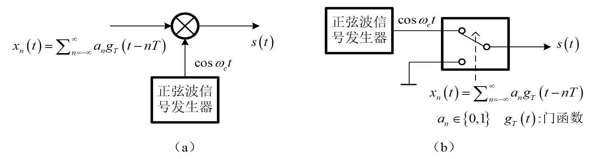
**定义：** 利用载波的幅度变化传递信息。最简单形式为 **OOK (On-Off Keying)**。

**表达式：**
$$
s(t) = \sum a_n g_T(t-nT) \cos \omega_c t
$$
*   $a_n=1$ (概率 $P$)，发送载波。
*   $a_n=0$ (概率 $1-P$)，不发送。

**功率谱：**
*   若 $P=0.5$，谱中包含连续谱和离散谱（载波分量）。
*   **带宽：** $B_{2ASK} = 2R_s$ ($R_s$ 为基带信号带宽)。
*   **频带效率：** $\eta_{2ASK} = \frac{1}{2} \eta_B$。

**解调方式：**
1.  **相干解调：**
	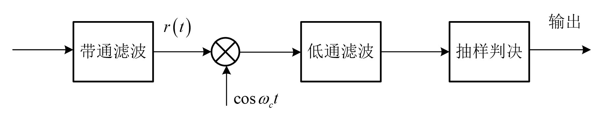
    *   需要提取载波。
    *   最佳判决门限：$\gamma_0 = \frac{a}{2}$ (先验等概时)。
    *   **误码率：**
        $$
        \boxed{ P_e = Q\left( \sqrt{\frac{E_b}{2N_0}} \right) }
        $$
2. **相关解调：**
	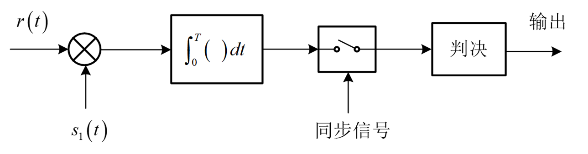
	*   **误码率：**
        $$
        \boxed{ P_e = Q\left( \sqrt{\frac{E_b}{N_0}} \right) }
        $$
	
3.  **包络检波 (非相干)：**
	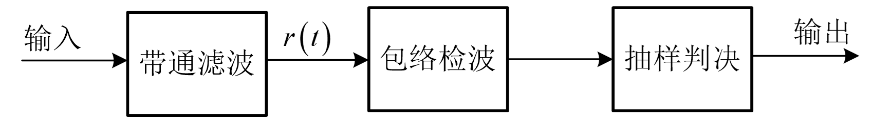
    *   不需要提取载波，结构简单。
    *   判决门限：在大信噪比下 $\gamma^* \approx \frac{a}{2}$。
    *   **误码率：**
        $$
        \boxed{ P_e \approx \frac{1}{2} \exp\left( -\frac{E_b}{4N_0} \right) }
        $$
    *   *缺点：* 存在门限效应，误码率略高于相干解调。

---

### 2. 二进制移相键控 (2PSK / BPSK)

**定义：** 利用载波的相位变化传递信息 (0相和 $\pi$相)。
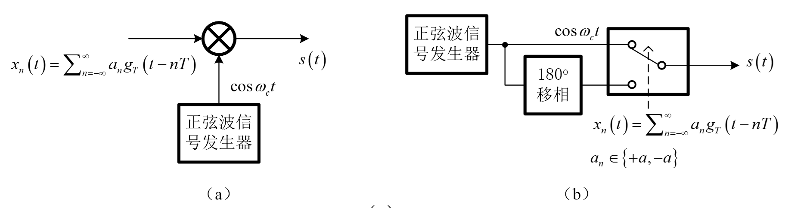
**表达式：**
$$
s(t) = \pm A \cos \omega_c t
$$

**特点：**
*   双极性信号，无离散载波分量 (等概时)。
*   **带宽：** 与 2ASK 相同。
*   **抗噪性能：** 优于 2ASK。

**解调方式：**
*   **必须采用相干/关解调** (包络检波无法区分相位)。
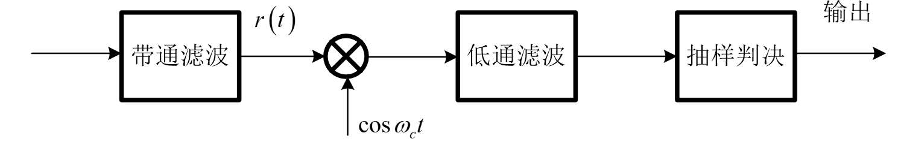
    $$\boxed{ P_e = Q\left( \sqrt{\frac{E_b}{N_0}} \right) }$$
    
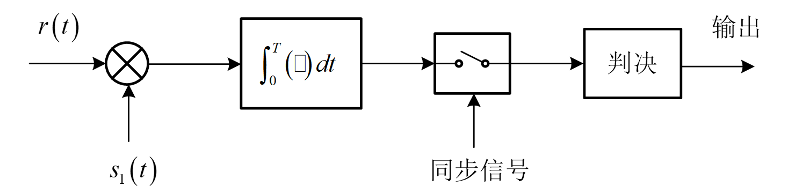
*   最佳判决门限：$\gamma_0 = 0$。
*   **误码率：**
    $$
    \boxed{ P_e = Q\left( \sqrt{\frac{2E_b}{N_0}} \right) }
    $$

**⚠️ 重要问题：相位模糊 (Phase Ambiguity)**
*   提取的本地载波相位可能与发送载波相差 $180^\circ$（反相）。
*   导致解调出的数字信号全部取反 ("0"变"1", "1"变"0")。
*   **解决方法：** 采用 2DPSK。

---

### 3. 二进制差分移相键控 (2DPSK)
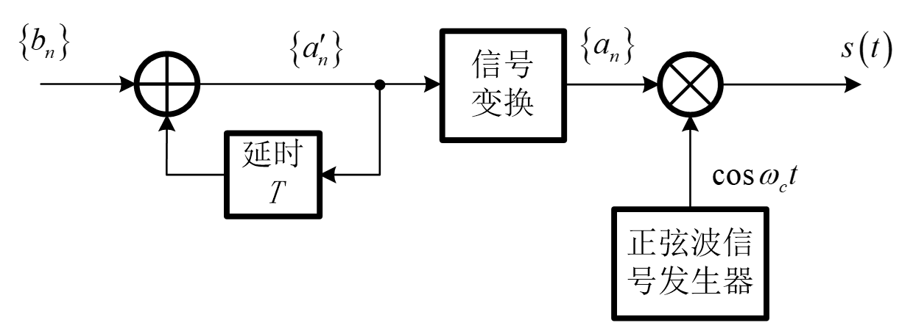
**原理：** 利用前后码元的相对相位变化来传递信息，而不是绝对相位。
*   "0" 表示前后相位相同。
*   "1" 表示前后相位不同 (相差 $\pi$)。

**产生过程：**
1.  绝对码 $\{b_n\}$ $\to$ 差分编码 $\to$ 相对码 $\{a'_n\}$。
2.  编码规则：$a'_n = b_n \oplus a'\_{n-1}$。
3.  用相对码 $\{a'_n\}$ 进行 2PSK 调制。

**解调方式：**
1.  **相干解调 + 差分译码 (码反变换)：**
    *   先解调出相对码，再进行 $b_n = a'_n \oplus a'\_{n-1}$ 译码。
    *   解决了相位模糊问题 (即使倒换，相对关系不变)。
    *   缺点：存在误码扩散 (1位错导致2位错)。
	*   对于采用**相干解调 + 差分译码**方式的 2DPSK 系统，其误码率 $P_{e\_2DPSK}$ 与 2PSK 相干解调误码率 $P_e$ 之间的关系为：

$$\boxed{ P_{e\_2DPSK} = 2P_e (1 - P_e) }$$
    *   **误码率：** $P_{e, 2DPSK} \approx 2 P_{e, 2PSK}$。
2.  **差分相干解调 (相位比较法)：**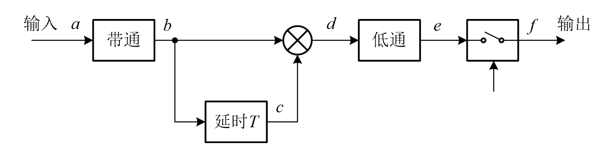
    *   不需要本地载波。
    *   利用延时 $T$ 的前一码元信号作为参考。
    *   **误码率：**
        $$
        \boxed{ P_e = \frac{1}{2} \exp\left( -\frac{E_b}{N_0} \right) }
        $$

---

### 4. 二进制移频键控 (2FSK)

**定义：** 利用载波的频率变化传递信息 ($f_1$ 代表 "1", $f_2$ 代表 "0")。
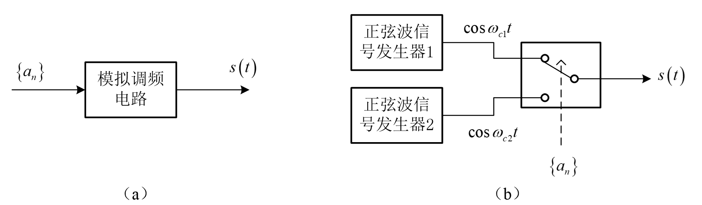
**信号特性：**
*   可看作两个不同载频的 OOK 信号的叠加。
*   **相位连续性：**
    *   模拟调频法 / VCO 产生 $\to$ 相位连续 (CPFSK)。
    *   开关切换法 $\to$ 相位通常不连续。
*   **正交条件：**
    *   相干解调最小频率间隔：$\Delta f = \frac{1}{2T}$ (初始相位为0时)。
    *   非相干解调通常要求更宽的间隔：$\Delta f = \frac{1}{T}$。
*   **带宽：** $B_{2FSK} \approx |f_2 - f_1| + 2R_b$。

**解调方式：**
1.  **相干解调：**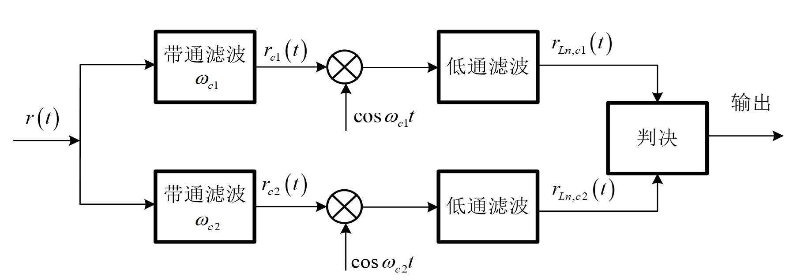
	$$
        \boxed{ P_e = Q\left( \sqrt{\frac{E_b}{2N_0}} \right) }
        $$
	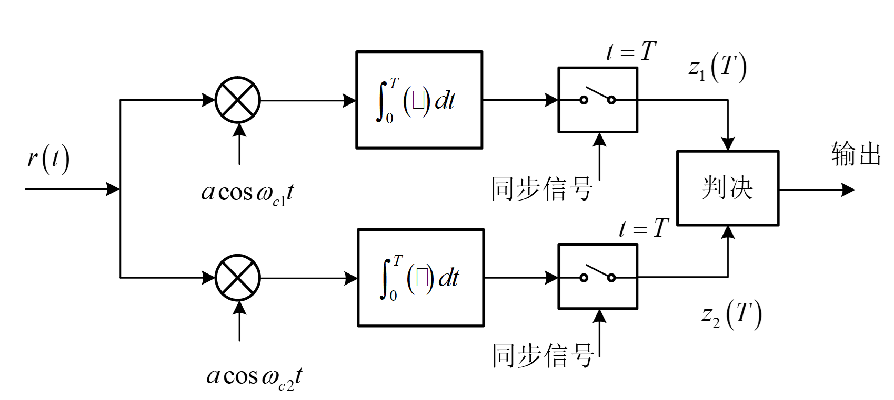
    *   两路相干解调 ($f_1$ 和 $f_2$) 后比较。
    *   **误码率：**
        $$
        \boxed{ P_e = Q\left( \sqrt{\frac{E_b}{N_0}} \right) }
        $$
2.  **非相干 (包络) 解调：**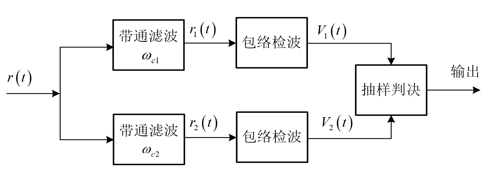
    *   两个带通滤波器 + 包络检波器 $\to$ 择大判决。
    *   **误码率：**
        $$
        \boxed{ P_e = \frac{1}{2} \exp\left( -\frac{E_b}{2N_0} \right) }
        $$
3.  **鉴频法：** 过零检测等。

---

## 6.4 性能总结与对比

### 1. 误码率性能排序 (由优到劣)
在相同 $E_b/N_0$ 下：
1.  **2PSK (相干)**：性能最好。
2.  **2DPSK (相干)**：略差于 2PSK (约2倍误码)。
3.  **2DPSK (差分相干)**：比相干差，但优于 FSK。
4.  **2FSK (相干)**：比 PSK 差 3dB。
5.  **2ASK (相干)**：抗噪性能一般 (平均功率受限时与 FSK 类似)。
6.  **2FSK (非相干)**。
7.  **2ASK (非相干)**。

**关键结论：**
*   相干解调优于非相干解调。
*   PSK 系统优于 FSK 和 ASK 系统 (PSK利用了相位差异 $\pi$，距离最大)。
*   2PSK 需要的信噪比比 2FSK/2ASK 少 **3dB** (在相同误码率下)。

### 2. 香农限 (Shannon Limit)
*   $E_b/N_0$ 的理论极限值为 **-1.6 dB**。小于此值无法实现无差错传输。

---

## 📝 典型例题解析

**例题 6.3.1 (课本P209-210):**
**已知：** OOK 信号，速率 $R_B = 4.8 \times 10^6$ Bd，幅度 $a=1$ mV，噪声谱密度 $N_0 = 2 \times 10^{-15}$ W/Hz。
**求：** 包络检波法和相关解调法的误码率。

**解题思路：**
1.  **计算码元能量 $E_b$：**
    依据 PPT 公式：
    $$
    E_b = \frac{1}{4} a^2 T = \frac{1}{4} a^2 \frac{1}{R_B}
    $$
    代入数据 (注意单位换算)：
    $$
    E_b = \frac{1}{4} (10^{-3})^2 \frac{1}{4.8 \times 10^6} \approx 10^{-12} \text{ J}
    $$
    *(注：此处沿用 PPT 截图中的计算量级)*

2.  **计算信噪比 $E_b/N_0$：**
    $$
    \frac{E_b}{N_0} = \frac{10^{-12}}{2 \times 10^{-15}} = 500
    $$

3.  **包络检波误码率：**
    $$
    P_e = \frac{1}{2} \exp\left(-\frac{E_b}{4N_0}\right) = \frac{1}{2} \exp\left(-\frac{500}{4}\right) = \frac{1}{2} e^{-125} \approx 7.5 \times 10^{-4}
    $$
    *(注：此处参考 PPT 截图中的最终结果 $7.5 \times 10^{-4}$，实际计算 $e^{-125}$ 极小，PPT中可能使用了特定近似或 $E_b/N_0$ 值略有不同，核心是掌握公式)*

4.  **相关解调 (相干) 误码率：**
    $$
    P_e = Q\left(\sqrt{\frac{E_b}{2N_0}}\right) \approx 1.77 \times 10^{-7}
    $$

---

## 💡 学习总结与易错点

### 1. 核心公式速记表
| 调制方式 | 解调方式 | 误码率 $P_e$ (近似) | 备注 |
| :--- | :--- | :--- | :--- |
| **2ASK** | 相干 | $Q(\sqrt{E_b/2N_0})$ | 门限 $a/2$ |
| | 非相干 | $\frac{1}{2}e^{-E_b/4N_0}$ | 门限效应 |
| **2FSK** | 相干 | $Q(\sqrt{E_b/N_0})$ | 需正交 |
| | 非相干 | $\frac{1}{2}e^{-E_b/2N_0}$ | 双包络检波 |
| **2PSK** | 相干 | $Q(\sqrt{2E_b/N_0})$ | 最优性能，有相位模糊 |
| **2DPSK** | 差分相干 | $\frac{1}{2}e^{-E_b/N_0}$ | 解决相位模糊 |

### 2. 易错点提醒
*   **$E_b$ 的定义：** 注意是“比特能量”还是“符号能量”。在二进制中两者相等，但计算 $E_b$ 时需注意 OOK 的平均能量是 $a^2T/4$ (假设0/1等概)，而 PSK 是 $a^2T/2$。
*   **解调条件：**
    *   2PSK **不能**使用非相干解调（包络检波丢失相位信息）。
    *   2FSK 相干解调要求 $f_1, f_2$ 正交。
*   **相位模糊：** 只有 PSK 存在相位模糊，DPSK 是为了解决此问题而设计的，但代价是性能略有损失（相干DPSK比PSK差，但优于差分相干DPSK）。

---

# 📘 第二部分
## 6.4 多进制数字调制 (M-ary Modulation)

### 1. 基本概念
*   **目的：** 在有限的信道频带内传输高速数据，提高频带利用率。
*   **定义：** 将高速二进制码流转换为 $M$ 进制符号 ($M>2$) 进行调制。
*   **参数关系：**
    *   $M$：进制数，通常 $M=2^k$。
    *   $k$：每个码元携带的比特数，$k = \log_2 M$。
    *   $R_s$ (码元速率) 与 $R_b$ (比特速率)：
        $$ \boxed{ R_s = \frac{R_b}{\log_2 M} } $$
    *   码元周期 $T_s$ 与比特周期 $T_b$：$T_s = k T_b$。
*   **频带利用率 $\eta$：**
    *   对于 MASK, MPSK, MQAM，带宽 $W \approx R_s$ (双边带)，故：
        $$ \eta_B = \frac{R_b}{W} \approx \log_2 M \quad (\text{bits/s/Hz}) $$
    *   **结论：** M进制调制的频带利用率是二进制的 $\log_2 M$ 倍。

---

## 2. 信号空间分析 (Signal Space Analysis)

为了分析多进制信号的性能，引入 $N$ 维信号空间的概念。

### 2.1 正交基与系数
*   **标准正交基：** $\{\Psi_k(t)\}, k=1,\dots,N$，满足 $\int_0^{T_s} \Psi_i(t)\Psi_j(t)dt = \delta_{ij}$。
*   **信号表示：** 任意信号 $s_m(t)$ 可表示为基函数的线性组合：
    $$ s_m(t) = \sum_{i=1}^{N} s_{mi} \Psi_i(t), \quad m=1,\dots,M $$
*   **系数矢量：** $\vec{S}_m = [s\_{m1}, s\_{m2}, \dots, s\_{mN}]^T$。

### 2.2 关键度量
*   **信号能量：**
    $$ E_m = \int_0^{T_s} s_m^2(t)dt = \sum_{i=1}^{N} s_{mi}^2 = |\vec{S}_m|^2 $$
*   **欧氏距离 (Euclidean Distance)：** 两个信号 $s_m(t)$ 和 $s_k(t)$ 之间的距离 $d_{mk}$ 决定了判决的可靠性。
    $$ \boxed{ d_{mk} = \sqrt{\sum_{i=1}^{N} (s_{mi} - s_{ki})^2} = |\vec{S}_m - \vec{S}_k| } $$

### 2.3 最佳接收准则
*   **最大似然准则 (ML)：** 在先验概率等概 ($P(s_i) = 1/M$) 的条件下，最佳接收等价于最小距离判决。
    *   **判决规则：** 接收到矢量 $\vec{r}$，若 $|\vec{r} - \vec{S}_i|$ 最小，则判决发送的是 $s_i$。
    *   **实现：** 通过**相关器**或**匹配滤波器**解调得到接收矢量 $\vec{r}$，计算其与所有可能发送矢量 $\vec{S}_m$ 的距离并比较。

---

## 3. M进制振幅键控 (MASK)

### 3.1 信号特征
*   **表达式：** $s_i(t) = a_i g_T(t) \cos \omega_c t$。
*   **幅度电平：** $a_i = 2i - 1 - M, \quad i=1,\dots,M$ (双极性等间距)。
*   **信号空间：** 一维空间，点分布在一条直线上。

### 3.2 性能分析
*   **功率谱：** 形状与 OOK 相同，主瓣宽度为 $2R_s = 2R_b/k$。
*   **误码率 (Symbol Error Rate, $P_E$)：**
    $$ P_E \approx 2\left(1-\frac{1}{M}\right) Q\left( \sqrt{\frac{6 \log_2 M}{M^2-1} \cdot \frac{E_b}{N_0}} \right) $$
*   **特点：**
    *   随着 $M$ 增大，频带利用率提高。
    *   但为了维持相同的误码率，所需的信噪比 ($E_b/N_0$) 必须显著增加 (因为信号点变密集了，抗噪能力下降)。
*   **格雷码 (Gray Coding)：** 既然误码常发生在相邻电平，采用格雷码编码可使误比特率 $P_b \approx P_E / \log_2 M$。

---

## 4. M进制移相键控 (MPSK)

### 4.1 信号特征
*   **表达式：** $s_i(t) = g_T(t) \cos(\omega_c t + \frac{2\pi(i-1)}{M})$。
*   **信号空间：** 二维空间，所有信号点位于圆周上，能量 $E_s$ 恒定。
*   **最小距离：**
    $$ d_{\min} = 2\sqrt{E_s} \sin\left(\frac{\pi}{M}\right) $$

### 4.2 QPSK (4PSK) —— 重点 ⭐
*   **定义：** $M=4$，相位取值通常为 $\pi/4, 3\pi/4, 5\pi/4, 7\pi/4$ (或其他旋转形式)。
*   **产生与解调：**
    *   可看作两个**正交的 BPSK** 信号的叠加。
    *   $s(t) = I(t)\cos \omega_c t - Q(t)\sin \omega_c t$。
    *   利用正交性，两路可独立解调。
*   **误码率：**
    $$ \boxed{ P_{b, QPSK} = Q\left( \sqrt{\frac{2E_b}{N_0}} \right) } $$
    *   **注意：** QPSK 的误比特率性能与 BPSK **完全相同**，但频带利用率是 BPSK 的 **2倍**。
*   **功率谱：** 形状与 2PSK 相同，主瓣带宽 $R_b$ (即 $2R_s$)。

### 4.3 偏移 QPSK (OQPSK / Offset QPSK)
*   **动机：** QPSK 信号相位可能跳变 $180^\circ$ (例如 00 $\to$ 11)，导致经过带限滤波后包络起伏大，在非线性放大器中会产生频谱扩散。
*   **原理：** 将 $Q$ 路基带信号相对于 $I$ 路**延时半个码元周期 ($T_s/2 = T_b$)**。
*   **特点：**
    *   相位跳变限制为 $0^\circ$ 或 $\pm 90^\circ$，**不存在 $180^\circ$ 跳变**。
    *   包络起伏小，带外辐射小，适合非线性信道。
    *   误码率和功率谱密度与 QPSK 相同。

### 4.4 $\pi/4$-QPSK (简述)
*   结合了 QPSK 和 OQPSK 的优点，常用于移动通信。

---

## 5. M进制正交振幅调制 (MQAM)

### 5.1 基本原理
*   **定义：** 结合幅度调制和相位调制，或者看作是两个独立的 **MASK** 信号在正交载波上的合成。
*   **星座图：**
    *   通常为矩形网格 (如 16QAM, 64QAM)。
    *   $M=2^k$，$k$ 为偶数时，星座图为正方形；$k$ 为奇数时，为十字形 (Cross-QAM)。

### 5.2 性能分析
*   **最小距离：** $d_{\min} = \sqrt{2E_g}$ ($E_g$ 为基带脉冲能量)。
*   **抗噪性能：**
    *   在相同的平均功率下，MQAM 的最小欧氏距离比 MPSK 大。
    *   **结论：** 当 $M \ge 16$ 时，MQAM 的抗噪性能优于 MPSK。
*   **频带利用率：** 极高，最接近香农限的调制方式。
*   **应用：** 广泛用于 ADSL, modems, 数字微波等对带宽效率要求高的场合。

---

## 6. M进制移频键控 (MFSK)

### 6.1 信号特征
*   **定义：** 使用 $M$ 个不同的频率 $\{f_1, f_2, \dots, f_M\}$ 代表 $M$ 个符号。
*   **正交条件：**
    *   非相干解调：频率间隔 $\Delta f \ge 1/T_s$。
    *   相干解调：频率间隔 $\Delta f \ge 1/(2T_s)$。
*   **信号空间：** $M$ 维空间。所有信号点之间的距离相等，均为 $\sqrt{2E_s}$。

### 6.2 性能特点
*   **带宽：**
    $$ W \approx (M-1)\Delta f + 2R_s $$
    *   随着 $M$ 增加，**带宽显著增加**，频带利用率降低。
*   **误码率：**
    *   随着 $M$ 增加 ($k=\log_2 M$ 增加)，误码率性能**改善** (误码率下降)。
*   **互换特性：** MFSK 是一种“带宽换信噪比” (或功率) 的技术。适用于功率受限但带宽宽裕的场合 (如深空通信)。

---

## 7. 本章总结与性能对比

### 7.1 误码性能对比 (误比特率 $P_b$ vs $E_b/N_0$)
1.  **性能排序 (优 $\to$ 劣)：**
    *   QPSK / 2PSK (相干)
    *   2DPSK
    *   正交 2FSK (相干)
    *   2ASK (相干)
    *   非相干检测通常比相干检测差约 1~3 dB (在大信噪比下差别变小)。
2.  **MPSK vs MQAM：**
    *   $M=4$ 时，QPSK 与 4QAM 性能相同。
    *   $M > 4$ 时，MQAM 优于 MPSK (MQAM 星座点分布更均匀，距离更远)。
3.  **MFSK：**
    *   随着 $M \uparrow$，性能提升 (趋近香农限)，但代价是带宽急剧膨胀。

### 7.2 频带利用率对比 ($\eta$)
$$ \eta = \frac{R_b}{W} $$
1.  **MQAM / MPSK / MASK：** $\eta \approx \log_2 M$。随 $M$ 增大，频带利用率**提高**。
2.  **MFSK：** $\eta \approx \frac{2 \log_2 M}{M}$。随 $M$ 增大，频带利用率**降低**。

### 7.3 系统选择指南
*   **功率受限，带宽受限：** QPSK (最佳折中，卫星通信常用)。
*   **带宽极度受限，信噪比高：** MQAM (如电话线调制解调器，微波中继)。
*   **功率极度受限，带宽宽裕：** MFSK (如深空探测)。
*   **非线性信道：** OQPSK, MSK (恒包络特性)。

### ⚠️ 易错点提示
1.  **码元与比特：** 计算误码率时，注意区分 $P_E$ (误符号率) 和 $P_b$ (误比特率)。通常 $P_b \approx P_E / \log_2 M$ (仅在格雷码且高信噪比下成立)。
2.  **QPSK带宽：** QPSK 的带宽与 BPSK 相同 ($2R_s$ of BPSK $= R_b$; $2R_s$ of QPSK $= R_b$), 但传输速率翻倍。
3.  **星座图距离：** 比较抗噪性能主要看星座图中相邻点的最小欧氏距离。距离越大，抗噪越好。

---

### 📝 典型示例 (PPT P241)
**比较 M=16 时的 MPSK 和 MQAM 的抗噪性能**

*   **16-PSK 最小距离：**
    $$ d_{16PSK, \min} = 2\sqrt{E_s} \sin(\frac{\pi}{16}) \approx 0.39 \sqrt{E_s} $$
*   **16-QAM 最小距离：**
    $$ d_{16QAM, \min} = \sqrt{2E_g} \quad \text{(需归一化平均能量比较)} $$
    根据推导 (PPT P101)，在相同平均功率下：
    $$ d_{16QAM, \min} \approx 0.47 \times (\text{Equivalent Factor}) $$
*   **结论：** $d_{16QAM, \min} > d_{16PSK, \min}$。即 **16QAM 优于 16PSK**。

---

# 📘 第三部分

## 6.5 恒包络连续相位调制

### 1. 恒包络调制的基本概念
*   **定义：** 在数字调制中，不管调制信号如何改变，信号包络保持恒定 ，且符号间相位变化具有较为平滑的过度特性（属于非线性调制）。
*   **优点：**
    *   可用硬限幅的方法去除干扰引起的幅度变化，抗干扰性能较高。
    *   可以使用高效率的C类高功率放大器（非线性放大器），适合移动通信设备。
    *   已调信号功率谱旁瓣低，频谱利用效率提高。
*   **缺点：** 占用的带宽通常比线性调制大。
*   **相位连续性：** 避免相位突变是消除带外干扰（频谱泄露）的关键。
    *   相位突变 $\rightarrow$ 频率瞬间极大扩展 $\rightarrow$ 带外干扰。

---

### 2. 最小移频键控 (MSK)

#### 2.1 MSK的定义与特点
*   **定义：** MSK (Minimum Shift Keying) 本质上是一种 **二进制连续相位移频键控 (CPFSK)**。
*   **调制指数：** $h = 0.5$。这是保证移频键控误码性能良好且两信号正交所允许的最小调制指数。
*   **正交条件：** 在初相相同时保证两载波频率正交的条件是：
    $$ \boxed{ \Delta f = |f_1 - f_2| = \frac{1}{2T_s} } $$
    即频率间隔是码元速率的一半。
*   **频率关系：**
    $$ f_c = \frac{m R_b}{4}, \quad f_2 = f_c + \frac{1}{4T_s}, \quad f_1 = f_c - \frac{1}{4T_s} $$
    其中 $f_1$ 和 $f_2$ 必须是 $R_b/4$ 的整数倍。

#### 2.2 MSK信号的时域表达
MSK信号可表示为：
$$ \boxed{ s_{MSK}(t) = \cos \left[ \omega_c t + \frac{\pi a_k}{2T_b}t + x_k \right], \quad kT_b \le t \le (k+1)T_b } $$
*   $a_k = \pm 1$：输入数据。
*   $x_k$：相位常数，用于保证 $t=kT_b$ 时相位连续。
*   **相位变化规律：** 在一个码元周期内，相位线性地增加或减少 $\pi/2$。
    *   输入“+1” $\rightarrow$ 相位增加 $\pi/2$。
    *   输入“-1” $\rightarrow$ 相位减少 $\pi/2$。

#### 2.3 MSK的正交展开（I/Q形式）
MSK信号可以看作是两路正交信号的合成：
$$ s_{MSK}(t) = a_I(t) \cos \left( \frac{\pi t}{2T_s} \right) \cos \omega_c t - a_Q(t) \sin \left( \frac{\pi t}{2T_s} \right) \sin \omega_c t $$
*   **特点：** 同相支路 $I$ 和正交支路 $Q$ 的数据 $a_I, a_Q$ 在时间上错开 $T_s$ 秒。
*   **波形加权：** 这里的基带波形不再是矩形脉冲，而是**半个余弦波**（正弦波），这种波形比矩形波形更平滑，有助于抑制旁瓣。

#### 2.4 MSK的功率谱特性
*   **旁瓣衰减：** MSK的功率谱旁瓣衰减速度比 QPSK/OQPSK 快。
    *   QPSK/OQPSK 功率谱随 $f^{-2}$ 衰减。
    *   MSK 功率谱随 $f^{-4}$ 衰减。
*   **带宽：** 主瓣宽度较宽，为 $1.5 R_b$。
*   **比较：** MSK信号具有比2PSK更好的频谱特性（旁瓣更低）。

#### 2.5 MSK的产生与解调
*   **产生：**
    1.  **VCO法：** 直接利用 $h=0.5$ 的压控振荡器产生。
    2.  **正交调制法：** 类似于 OQPSK 的结构，但基带成形滤波器产生半正弦波形。需加**预编码**以适应差分编码逻辑。
*   **解调：**
    1.  **相干解调：** 性能与 2PSK/QPSK 相同（理想情况下）。
    2.  **非相干解调：** 鉴频器。

---

### 3. 高斯滤波最小移频键控 (GMSK)

#### 3.1 引入GMSK的原因
*   MSK 虽然旁瓣衰减快，但主瓣较宽，邻道辐射（如要求低于主瓣峰值 60dB）仍不够理想。
*   **目的：** 在保持恒包络特性的基础上，进一步压缩带宽，加快带外衰减。

#### 3.2 GMSK原理
*   **定义：** 在 MSK 调制器前加入一个高斯低通滤波器（预调制滤波器）。
*   **核心参数：** $B_b T_b$（3dB带宽与码元宽度的乘积）。
    *   $B_b T_b$ 越小 $\rightarrow$ 频谱越紧凑，邻道干扰越小。
    *   $B_b T_b$ 越小 $\rightarrow$ 波形被展宽，码间干扰 (ISI) 越大。
*   **GSM系统标准：** 采用 $B_b T_b = 0.3$ 的 GMSK，此时功率谱满足要求（$f-f_c=1.5/T_b$ 时低于60dB）。

#### 3.3 GMSK特性
*   **波形与相位：**
    *   包络恒定。
    *   相位路径由折线变为**平滑过渡的曲线**（消除了相位转折点）。
    *   不再像 MSK 那样固定变化 $\pm \pi/2$，增量随输入序列变化。
*   **产生方法：** 波形存储正交调制法（查表法）。
    *   将算好的 $\cos[\theta(t)]$ 和 $\sin[\theta(t)]$ 存入 ROM，通过查表进行正交调制。
*   **解调：**
    1.  **差分相干解调：** 一比特延迟或二比特延迟。
    2.  **相干解调：** 性能最好，但电路复杂。
    3.  **鉴频器解调。**

#### 3.4 误码性能
*   由于引入了高斯滤波导致码间干扰（ISI）：
    *   GMSK 的误码率性能略**差于** MSK。
    *   $B_b T_b$ 越小，误码率性能越差（因为 ISI 增加）。
    *   但在 $B_b T_b=0.3$ 时，性能损失很小（相对于 MSK 仅损失不到 1dB），换取了极大的频谱效率提升。

---

### 4. 各种移动通信制式的调制方式补充

| 制式 | 调制方式 | 备注 |
| :--- | :--- | :--- |
| **GSM** | **GMSK** | $B_b T_b = 0.3$，恒包络 |
| **IS-95** | OQPSK (下行), BPSK/QPSK | 扩频通信 |
| **CDMA2000 / WCDMA** | BPSK, QPSK, OCQPSK, HPSK | 混合相移键控 |
| **HSPA** | 16QAM, 64QAM | 高阶调制以提高速率 |
| **LTE** | QAM (16QAM, 64QAM等) | 结合 OFDM 技术 |

---

### 📝 典型例题

**例题：MSK相位计算**
**题目：** 已知 MSK 信号输入序列 $\{a_n\}$ 为 $+1, -1, +1$。求 $t=T_b, 2T_b, 3T_b$ 时的相位变化（假设初始相位为 0）。
**解答：**
MSK 在一个码元周期 $T_b$ 内相位线性变化 $\pm \pi/2$。
1.  $0 \to T_b$：输入 $+1$，相位增加 $\pi/2$。
    *   $\theta(T_b) = 0 + \pi/2 = \pi/2$。
2.  $T_b \to 2T_b$：输入 $-1$，相位减少 $\pi/2$。
    *   $\theta(2T_b) = \pi/2 - \pi/2 = 0$。
3.  $2T_b \to 3T_b$：输入 $+1$，相位增加 $\pi/2$。
    *   $\theta(3T_b) = 0 + \pi/2 = \pi/2$。

**结论：** 偶数倍 $T_b$ 时刻相位为 $0$ 或 $\pi$（模 $2\pi$）；奇数倍 $T_b$ 时刻相位为 $\pm \pi/2$（模 $2\pi$）。

---

## 6.6 正交频分复用

### 1. 多载波传输的基本概念

#### 1.1 基本原理

- **核心思想**：将一个高速的数据流分解为若干个低速的子数据流。
    
- **过程**：
    
    1. 每个子数据流具有低得多的比特速率。
        
    2. 经过调制（符号匹配）和滤波（波形形成）。
        
    3. 去调制相应的子载波，构成多个并行的已调信号。
        
    4. 合成后进行传输。
        

#### 1.2 多载波 vs 单载波

- **单载波系统**：一次衰落或干扰会导致整个链路失效。
    
- **多载波系统**：某一时刻只有少部分子信道受深衰落影响，因此具有较强的抗衰落和抗干扰能力。
    

#### 1.3 频谱设置的三种方式

1. **传统频分复用 (FDM)**：
    
    - 各子载波间隔足够大，频谱不重叠。
        
    - **缺点**：频谱利用率低，需要保护频带，滤波器实现困难。
        
2. **3dB 频分复用**：
    
    - 频谱部分重叠，交点在功率比峰值低 3dB 处。
        
3. **正交频分复用 (OFDM)**：
    
    - 各子载波相互正交。
        
    - 各子载波频谱有 **1/2 的重叠**。
        
    - **优势**：带宽比 FDMA 节省一半。
        

---

### 2. OFDM 的基本原理

#### 2.1 定义与特点

OFDM (Orthogonal Frequency Division Multiplexing) 是一种特殊的多载波传输技术。

- **子载波特点**：数量多、带宽窄。
    
- **频谱效率**：子载波间有重叠但正交，频谱效率高于传统多载波。
    
- **抗衰落**：子载波带宽很小，能很好对抗频率选择性衰落，均衡复杂度低。
    

#### 2.2 正交性条件

为了保证子载波间正交且间隔达到最小（最高频带利用率），相邻子载波间的最小间隔 $\Delta f$ 必须满足：

$$\boxed{ \min \Delta f = \frac{1}{T_s} }$$

- 其中 $T_s$ 为码元周期。
    
- **时域理解**：在一个码元周期内，每个子载波包含整数倍的周期波形。
    
- **频域理解**：每个子载波的频谱峰值对应相邻子载波的零点。
    

#### 2.3 复数子载波表示

OFDM 信号可以表示为：

$$s_{OFDM}(t) = \sum_{k=0}^{N-1} S_k e^{j2\pi f_k t}$$

- $S_k$ 是映射后的复数数据（星座点）。
    
- 利用复数子载波的正交性，通过相关解调可以恢复原始符号：
    
    $$\frac{1}{T_s} \int_{0}^{T_s} e^{j2\pi f_j t} e^{-j2\pi f_k t} dt = \begin{cases} 1, & j=k \\ 0, & j \neq k \end{cases}$$
    

---

### 3. OFDM 的实现：IFFT 与 FFT 🚀

传统方法需要大量独立振荡器，硬件极其复杂。OFDM 的突破在于利用 **IFFT/FFT** 算法实现调制解调。

#### 3.1 离散化处理

若取 $T_s = NT$，$f_n = \frac{n}{NT}$，则 OFDM 信号离散化为：

$$s_{OFDM}(kT) = \sum_{n=0}^{N-1} S_n e^{j \frac{2\pi k n}{N}}$$

#### 3.2 算法对应关系

这正是离散傅里叶逆变换 (IDFT) 的形式。因此：

- 调制端 (发射)：使用 IFFT (快速傅里叶逆变换)。
    
    $$\boxed{ S_{OFDM}(k) = \frac{1}{\sqrt{N}} \sum_{n=0}^{N-1} S_n W_N^{-nk} }$$
    
- 解调端 (接收)：使用 FFT (快速傅里叶变换)。
    
    $$\boxed{ S_n = \frac{1}{\sqrt{N}} \sum_{k=0}^{N-1} s_{OFDM}(k) W_N^{nk} }$$
    

⚠️ **注意点**：IFFT/FFT 的引入解决了系统实现的复杂性问题，是 OFDM 能广泛应用的关键。

---

### 4. 关键技术：保护间隔与循环前缀

#### 4.1 保护间隔 (Guard Interval, GI)

- **原因**：信道非理想（多径效应）导致符号在时间上扩展，产生码间串扰 (ISI)。
    
- **对策**：在相邻符号间引入时间保护间隔 $T_g$。
    
- **代价**：降低了系统的传输效率。
    

#### 4.2 循环前缀 (Cyclic Prefix, CP)

- **问题**：如果仅仅加入空白保护间隔，当存在信道时延时，积分区间内可能包含非整数倍的子载波周期，破坏正交性，产生子载波间干扰 (ICI)。
    
- **对策**：**循环前缀**。将符号尾部长度为 $T_g$ 的信号复制到保护间隔内。
    
- **作用**：只要多径时延小于保护间隔，就能保证子载波间的正交性不被破坏，避免 ICI。
    

---

### 5. OFDM 信号的功率谱

- OFDM 信号的功率谱是多个 Sinc 函数功率谱的叠加。
    
- 随着子信道数 $N$ 的增加，OFDM 信号的功率谱越来越接近“**矩形**”，频谱利用率极高。
    
- 带外辐射随频率偏离中心频率而衰减。
    

---

### 6. OFDM 技术的优缺点分析

#### ✅ 优点

1. **抗衰落能力强**：将宽带频率选择性衰落转化为窄带平坦衰落，且窄带干扰只影响特定子载波。
    
2. **克服符号间串扰 (ISI)**：符号周期 $T$ 被大大扩展，使得信道时延的影响微不足道。
    
3. **频谱利用率高**：子载波重叠且正交。
    
4. **实现简单**：利用成熟的 IFFT/FFT 技术。
    
5. **资源分配灵活**：可根据用户需求灵活分配子载波数。

#### ❌ 缺点

1. **对频率偏差敏感**：频率偏差（如多普勒频移）会破坏正交性，导致严重的子载波间干扰。
    
2. **峰值平均功率比 (PAPR) 高**：
    
    - OFDM 信号是多个子载波叠加，瞬间峰值可能很大。
        
    - 这对射频放大器的线性度要求非常高，需要复杂的大功率处理技术。

---

### 7. 本章学习总结

1. **核心公式**：
    
    - 子载波最小间隔：$\Delta f = 1/T_s$。
        
    - 调制/解调实现：IFFT / FFT 公式。
        
2. **核心机制**：
    
    - 利用**正交性**允许频谱重叠，提高效率。
        
    - 利用**串/并变换**延长符号周期，抗 ISI。
        
    - 利用**循环前缀 (CP)** 维持正交性，抗 ICI。
        
3. **应用场景**：广泛应用于 LTE/4G、WiFi (802.11a/g/n/ac)、数字广播 (DAB)、ADSL 等宽带通信领域。
    

---

#### 💡 易错点提醒

- **不要混淆 FDM 和 OFDM**：FDM 需要保护频带，频谱不重叠；OFDM 频谱重叠但利用正交性分离。
    
- **保护间隔的作用**：主要是为了抗 ISI，但必须配合**循环前缀**才能同时抗 ICI（保持正交性）。
    
- **IFFT 的位置**：发射端做 IFFT（将频域数据转为时域波形），接收端做 FFT（将时域波形转回频域数据）。
# 附录
## 数字调制系统误码率总结表

| 调制方式      | **相干解调 ** <small>统一公式模型：$Q(\sqrt{\beta \cdot r})$</small> | **相关解调**                                              | **包络检波解调** <small>统一公式模型：$\frac{1}{2}e^{-\frac{\beta \cdot r}{2}}$</small> | **性能评价**       |
| :-------- | :----------------------------------------------------------- | :---------------------------------------------------- | :---------------------------------------------------------------------------- | :------------- |
| **2ASK**  | $$Q\left(\sqrt{\frac{r}{2}}\right)$$                         | $$Q\left(\sqrt{r}\right)$$                            | $$P_e = \frac{1}{2}e^{-\frac{r}{4}}$$                                         | 差 (最易受干扰)      |
| **2FSK**  | $$Q\left(\sqrt{\frac{r}{2}}\right)$$                         | $$Q\left(\sqrt{r}\right)$$                            | $$P_e = \frac{1}{2}e^{-\frac{r}{4}}$$                                         | 中 (通用标准)       |
| **2PSK**  | $$Q\left(\sqrt{r}\right)$$                                   | $$Q\left(\sqrt{2r}\right)$$                           | **×** (无法非相干解调)                                                               | **优** (抗噪性能最强) |
| **2DPSK** | $$2P_e(1-P_e)$$ <small>(注: $P_e$是2PSK的误码率)</small>        | $$2P_e(1-P_e)$$ <small>(注: $P_e$是2PSK的误码率)</small> | $$P_e = \frac{1}{2}e^{-\frac{r}{2}}$$                                         | 优 (略差于PSK，但实用) |

**注：** 表中的 $r$ 代表信噪比 (SNR)。

| **比较维度**       | **2ASK (OOK)**                           | **2PSK (BPSK)**                          | **2DPSK**                               | **2FSK**                               |
| -------------- | ---------------------------------------- | ---------------------------------------- | --------------------------------------- | -------------------------------------- |
| **全称**         | 二进制幅移键控                                  | 二进制相移键控                                  | 二进制差分相移键控                               | 二进制频移键控                                |
| **波形特点**       | 有载波表示"1" 无载波表示"0"                     | 载波相位0°表示"1" 相位180°表示"0"               | **相对相位**表示信息 前后相位变="1" 前后相位不变="0" | 频率$f_1$表示"1" 频率$f_2$表示"0" (包络恒定) |
| **功率谱特点**      | **有**离散谱线 ($f_c$处) 连续谱为辛克($Sa^2$)函数形状 | **无**离散谱线 (双极性等概时) 连续谱为辛克($Sa^2$)函数形状 | 与 2PSK 相同 形状一样，带宽一样                  | **有**离散谱线 ($f_1, f_2$处) 双峰结构        |
| **第一零点带宽**     | $$2R_b$$                                 | $$2R_b$$                                 | $$2R_b$$                                | $$\text{最小}3R_b$$                      |
| **频带利用率**      | 较高 (1 bit/s/Hz)                          | 较高 (1 bit/s/Hz)                          | 较高 (1 bit/s/Hz)                         | 较低 (< 1 bit/s/Hz)                      |
| **调制实现**       | 乘法器 (开关电路)                               | 平衡调制器 (乘法器) 输入为双极性码                   | **差分编码** + 2PSK调制器                      | 两个独立的振荡器切换 或 VCO (压控振荡器)            |
| **解调方法**       | **非相干 (包络检波)** 相干解调 相关解调           | **相干解调** 相关解调                         | **差分相干解调** 相干解调 + 差分译码               | **非相干 (包络检波)** 相干解调 过零检测法        |
| **抗噪性能 (误码率)** | **最差**                                   | **最好**                                   | 次之 (比PSK略差3dB)                          | 居中 (优于ASK，劣于PSK)                       |
| **特殊问题**       | 门限电平随信道增益变化，判决困难                         | 存在 **"倒 $\pi$ 现象"** (相位模糊)            | 解决了相位模糊问题 但有**成对误码**                 | 占用频带较宽                                 |

---

## 多进制调制方法总结对比表

| 特性 | MASK | MPSK | MQAM | MFSK |
| :--- | :--- | :--- | :--- | :--- |
| **几何空间** | **1维** (直线) | **2维** (圆周) | **2维** (方格/棋盘) | **M维** (超空间坐标轴) |
| **频带利用率** | 中等 | 高 (随 $M$ 增加) | **极高** (随 $M$ 增加) | **极低** (随 $M$ 增加而降低) |
| **功率利用率** | 低 | 中等 | 高 | **极高** (随 $M$ 增加而提高) |
| **符号能量** | 变化 | **恒定** | 变化 | **恒定** |
| **最小距离** | 随 $M$ 减小 | 随 $M$ 急剧减小 | 随 $M$ 缓慢减小 | **恒定** ($\sqrt{2E_s}$) |
| **主要应用** | 光通信、简单电路 | 卫星通信、QPSK | 4G/5G/WiFi (高吞吐) | 深空通信、低功耗物联网 |

*  核心结论

1.  **想省带宽（高频带利用率）**：选 **MQAM**。通过在二维平面紧密堆积点来传更多数据。
2.  **想省功率（高功率利用率）**：选 **MFSK**。通过增加带宽（频率数量）来换取更低的信噪比要求。
3.  **想抗非线性干扰**：选 **MPSK** 或 **MFSK**。因为它们是恒包络信号（幅度不变）。

## 基带不为矩形波的误码率

解决这类问题的**核心逻辑**永远是通用的：
1.  **求能量 $E_b$**：计算信号在一个码元周期内的能量（假设等概且能量相等）。
2.  **求互相关系数 $R_{12}$**：计算两个信号的乘积积分。
3.  **求相关系数 $\rho$**：$\rho = \frac{R_{12}}{E_b}$。
4.  **代入公式**：相干解调的误码率公式为 $P_b = Q\left(\sqrt{\frac{E_b}{N_0}(1-\rho)}\right)$。

---

### 非标准 2PSK（相位非正交/携带导频）

**题目背景**：为了提取载波同步信号，发送端并没有使用标准的 $\pi$ 相位差（即 $180^\circ$），而是使用了一个小于 $180^\circ$ 的相位差，使得信号含有一个同相的残留载波分量。

**设传输信号为：**
$$ s_1(t) = A \cos(2\pi f_c t + \theta) $$
$$ s_2(t) = A \cos(2\pi f_c t - \theta) $$
其中 $0 \le t \le T_b$，且 $0 < \theta < \pi/2$。假设 $f_c \gg 1/T_b$，即在一个周期内包含整数个载波周期。符号先验等概，采用相干解调。

**(1) 求 $s_1(t)$ 与 $s_2(t)$ 的相关系数 $\rho$。**
**(2) 证明其误比特率 $P_b = Q\left( \sqrt{\frac{2E_b}{N_0}} \sin\theta \right)$。**

#### **【详细解析】**

**第一步：计算平均能量 $E_b$**
由于 $s_1(t)$ 和 $s_2(t)$ 只是相位不同，振幅相同，能量相等。
$$ E_b = \int_{0}^{T_b} s_1^2(t) dt = \int_{0}^{T_b} A^2 \cos^2(2\pi f_c t + \theta) dt $$
利用三角公式 $\cos^2 x = \frac{1+\cos 2x}{2}$，高频项积分近似为0：
$$ E_b = \frac{A^2 T_b}{2} $$

**第二步：计算互相关函数 $R_{12}$**
$$ R_{12} = \int_{0}^{T_b} s_1(t)s_2(t) dt = \int_{0}^{T_b} A^2 \cos(2\pi f_c t + \theta) \cos(2\pi f_c t - \theta) dt $$
利用积化和差公式 $\cos \alpha \cos \beta = \frac{1}{2}[\cos(\alpha-\beta) + \cos(\alpha+\beta)]$：
$$ R_{12} = \frac{A^2}{2} \int_{0}^{T_b} [\cos(2\theta) + \cos(4\pi f_c t)] dt $$
同样，高频项 $\cos(4\pi f_c t)$ 积分为0，第一项是常数：
$$ R_{12} = \frac{A^2}{2} \cdot T_b \cdot \cos(2\theta) = \left( \frac{A^2 T_b}{2} \right) \cos(2\theta) = E_b \cos(2\theta) $$

**第三步：计算相关系数 $\rho$**
$$ \rho = \frac{R_{12}}{\sqrt{E_1 E_2}} = \frac{E_b \cos(2\theta)}{E_b} = \cos(2\theta) $$

**第四步：代入误码率公式**
由相关接收公式：
$$ P_b = Q\left(\sqrt{\frac{E_b}{N_0}(1-\rho)}\right) $$
代入 $\rho = \cos(2\theta)$：
$$ P_b = Q\left(\sqrt{\frac{E_b}{N_0}(1 - \cos(2\theta))}\right) $$
利用半角公式 $1 - \cos(2\theta) = 2\sin^2\theta$：
$$ P_b = Q\left(\sqrt{\frac{E_b}{N_0} \cdot 2\sin^2\theta}\right) = Q\left(\sqrt{\frac{2E_b}{N_0}} \sin\theta \right) $$
**证明完毕。**
*(注：当 $\theta = \pi/2$ 即 90度时，$\sin\theta=1$，回到标准 BPSK 公式，验证无误)*

---

### 非标准 2FSK（含公共导频信号）

**题目背景**：为了简化接收机的同步，在 2FSK 信号中叠加了一个独立的导频载波。这会导致两个信号不再正交（相关系数不为0）。

**设传输信号为：**
$$ s_1(t) = A \cos(2\pi f_1 t) + kA \cos(2\pi f_c t) $$
$$ s_2(t) = A \cos(2\pi f_2 t) - kA \cos(2\pi f_c t) $$
其中 $0 \le t \le T_b$。假设 $f_1, f_2, f_c$ 相互正交（即任意两个不同频率的信号乘积积分为0）。$k$ 为导频系数。符号先验等概，采用相干解调。

**(1) 求 $s_1(t)$ 与 $s_2(t)$ 的相关系数 $\rho$。**
**(2) 求系统的误比特率 $P_b$ 表达式。**

#### **【详细解析】**

**第一步：计算能量 $E_b$**
以 $s_1(t)$ 为例，展开平方：
$$ s_1^2(t) = A^2\cos^2(2\pi f_1 t) + (kA)^2\cos^2(2\pi f_c t) + 2k A^2 \cos(2\pi f_1 t)\cos(2\pi f_c t) $$
积分时，平方项产生能量，交叉项由于频率正交，积分为0。
令基准能量 $E_0 = \frac{A^2 T_b}{2}$。
$$ E_b = \int s_1^2 dt = \frac{A^2 T_b}{2} + \frac{k^2 A^2 T_b}{2} = E_0(1+k^2) $$
同理 $E_2 = E_b$。

**第二步：计算互相关 $R_{12}$**
$$ R_{12} = \int_{0}^{T_b} [A \cos(2\pi f_1 t) + kA \cos(2\pi f_c t)] \cdot [A \cos(2\pi f_2 t) + kA \cos(2\pi f_c t)] dt $$
展开共有四项：
1. $A^2 \cos f_1 \cos f_2$ $\to$ 频率不同，正交，积分为0。
2. $k A^2 \cos f_1 \cos f_c$ $\to$ 正交，积分为0。
3. $k A^2 \cos f_c \cos f_2$ $\to$ 正交，积分为0。
4. $k^2 A^2 \cos^2 f_c$ $\to$ 导频自乘，积分结果为导频能量。

$$ R_{12} = \int_{0}^{T_b} k^2 A^2 \cos^2(2\pi f_c t) dt = \frac{k^2 A^2 T_b}{2} = k^2 E_0 $$

**第三步：计算相关系数 $\rho$**
$$ \rho = \frac{R_{12}}{E_b} = \frac{k^2 E_0}{E_0(1+k^2)} = \frac{k^2}{1+k^2} $$

**第四步：代入误码率公式**
$$ P_b = Q\left(\sqrt{\frac{E_b}{N_0}(1-\rho)}\right) $$
$$ 1 - \rho = 1 - \frac{k^2}{1+k^2} = \frac{1+k^2-k^2}{1+k^2} = \frac{1}{1+k^2} $$
$$ P_b = Q\left(\sqrt{\frac{E_b}{N_0} \cdot \frac{1}{1+k^2}}\right) $$
或者将 $E_b$ 换回 $E_0$ 表示（$E_b = E_0(1+k^2)$）：
$$ P_b = Q\left(\sqrt{\frac{E_0(1+k^2)}{N_0} \cdot \frac{1}{1+k^2}}\right) = Q\left(\sqrt{\frac{E_0}{N_0}}\right) $$
*(结论分析：这说明引入导频虽然增加了总发射功率 $E_b$，但对于区分信号 $s_1$ 和 $s_2$ 的“有效距离”没有贡献，误码率只取决于携带信息的那个分量的能量 $E_0$)*

---

### 非标准 2ASK（非零电平/单极性不归零变形）

**题目背景**：典型的 2ASK 是“有载波”和“无载波”。现在考虑一种情况，系统处于不完全关断状态，即发送“0”时仍有小幅度的载波传输（类似于调幅 AM 中的载波发送）。

**设传输信号为：**
$$ s_1(t) = A \cdot g(t) \cos(2\pi f_c t) $$
$$ s_2(t) = \alpha A \cdot g(t) \cos(2\pi f_c t) $$
其中 $0 \le t \le T_b$，且 $0 < \alpha < 1$（$\alpha$ 是残留系数）。$g(t)$ 是任意基带脉冲波形（如升余弦、矩形等），设 $\int_0^{T_b} g^2(t)dt = E_g$。符号先验等概。

**(1) 计算两个信号的欧氏距离平方 $d_{12}^2$。**
**(2) 利用距离公式求误比特率 $P_b$。**
*(注：由于 $s_1$ 和 $s_2$ 能量不相等，使用 $\rho$ 公式容易出错，推荐直接使用距离公式，这是处理能量不平衡信号的通用解法)*

#### **【详细解析】**

**第一步：分析信号能量**
虽然本题推荐用距离法，但我们先看能量：
$E_1 = \frac{A^2}{2} E_g$, $E_2 = \frac{\alpha^2 A^2}{2} E_g = \alpha^2 E_1$。
平均能量 $E_{avg} = \frac{E_1 + E_2}{2} = \frac{1+\alpha^2}{2}E_1$。

**第二步：计算欧氏距离平方 $d_{12}^2$**
对于任意二元信号，最佳接收机的性能取决于信号差的能量：
$$ d_{12}^2 = \int_{0}^{T_b} [s_1(t) - s_2(t)]^2 dt $$
$$ s_1(t) - s_2(t) = A g(t) \cos(2\pi f_c t) - \alpha A g(t) \cos(2\pi f_c t) = A(1-\alpha)g(t)\cos(2\pi f_c t) $$
$$ d_{12}^2 = \int_{0}^{T_b} [A(1-\alpha)]^2 g^2(t) \cos^2(2\pi f_c t) dt $$
$$ d_{12}^2 = A^2(1-\alpha)^2 \cdot \frac{1}{2} \int_{0}^{T_b} g^2(t) dt $$
$$ d_{12}^2 = \frac{A^2 E_g}{2} (1-\alpha)^2 $$
注意到 $E_1 = \frac{A^2 E_g}{2}$，所以：
$$ d_{12}^2 = E_1 (1-\alpha)^2 $$

**第三步：代入通用的误码率距离公式**
相干检测的通用公式为：
$$ P_b = Q\left( \sqrt{\frac{d_{12}^2}{2N_0}} \right) $$
代入 $d_{12}^2$：
$$ P_b = Q\left( \sqrt{\frac{E_1(1-\alpha)^2}{2N_0}} \right) = Q\left( (1-\alpha)\sqrt{\frac{E_1}{2N_0}} \right) $$

**（附加：如果非要用相关系数公式怎么做？）**
这道题用 $\rho$ 公式会很麻烦，因为 $\rho$ 公式原型是 $Q(\frac{d_{12}}{\sqrt{2N_0}})$，只有当 $E_1=E_2=E_b$ 时，才能化简为 $Q(\sqrt{\frac{E_b}{N_0}(1-\rho)})$。
对于本题：
$R_{12} = \sqrt{E_1 E_2} = \alpha E_1$ (因为波形完全相同，只是幅度不同，$\rho=1$)。
如果强行套用 $1-\rho = 0$，算出 $P_b = Q(0) = 0.5$，这显然是**错的**。因为 $\rho=1$ 且能量不等时，不能简单套用那个公式。
**结论：** 遇到能量不等的信号（如 2ASK 变种），请务必使用 **信号差的能量（欧氏距离）** 来求解。