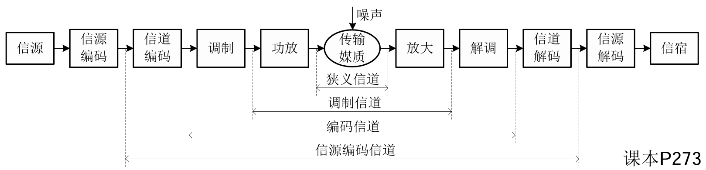
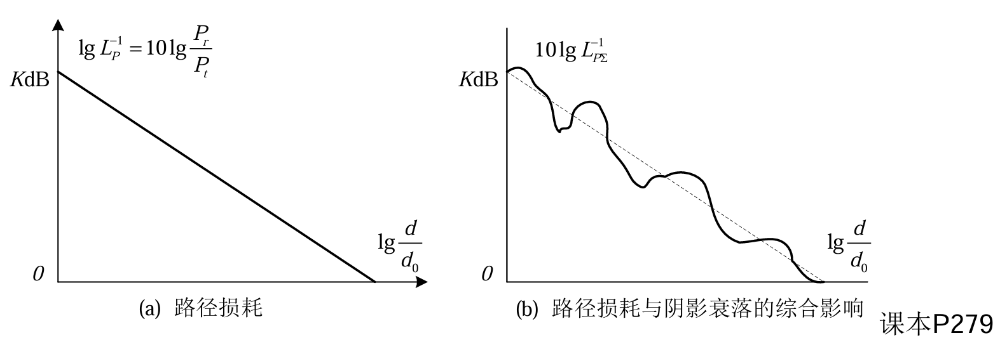

## 7.1 信道的定义与分类

### 1. 信道的定义
*   **狭义信道**：信号从通信发送设备发出到通信接收设备接收端所经历的传输路径（仅包含传输媒质）。
*   **广义信道**：根据不同需要划分，包括：
    *   狭义信道
    *   调制信道（包含调制器、解调器）
    *   编码信道（包含编码器、解码器）
    *   信源编码信道等。

### 2. 信道的分类
根据信道参数特性划分：
*   **恒参信道**：
    *   特性恒定不变。
    *   典型代表：有线电缆、光纤、无线视距中继。
    *   传递函数：$H(\omega) = |H(\omega)|e^{j\phi(\omega)}$（幅频和相频特性与时间无关）。
*   **随参信道**：
    *   特性随时间随机变化。
    *   典型代表：短波电离层反射、对流层散射、移动通信信道。
    *   传递函数：$H(\omega, t) = |H(\omega, t)|e^{j\phi(\omega, t)}$（频率与时间的随机函数）。

---

## 7.2 信道的损耗与衰落特性

### 1. 信号基本表达式

**发送信号通常可表达为**
$$\boxed{s(t) = x_I(t)\cos\omega_c t - x_Q(t)\sin\omega_c t }$$

**定义复基带信号**
$$ x(t) = x_I(t) + jx_Q(t) $$

**发送信号可表示为**
$$\boxed{ s(t) = \text{Re}\left( x(t)e^{j\omega_c t} \right) }$$

**相应接收信号为**
$$ r(t) = y_I(t)\cos\omega_c t - y_Q(t)\sin\omega_c t + n(t) $$
$$ = \text{Re}\left( y(t)e^{j\omega_c t} \right) + n(t) $$

**其中**
$$ y(t) = y_I(t) + jy_Q(t) $$
**$n(t)$ 为接收过程中的噪声干扰**
### 2. 路径损耗 (Path Loss)
在不考虑噪声干扰下，路径损耗 $L_P$ 定义为发送功率 $P_t$ 与接收功率 $P_r$ 之比：
$$ L_{p}dB = 10\lg \frac{P_t}{P_r} $$

#### 🌌 自由空间损耗模型
*   **定义**：发射机与接收机之间无障碍，信号沿直线传播（视距信道 LOS）。
*   **接收功率 (Friis 公式)**：
    $$ P_r = P_t G_t G_r \left( \frac{\lambda}{4\pi d} \right)^2 $$
    其中，$G_t, G_r$ 为天线增益，$\lambda$ 为波长，$d$ 为距离。
*   **自由空间传播损耗 $L_{fs}$**：
    $$ \boxed{ L_{fs} = \frac{P_T}{P_R} = \left( \frac{4\pi d}{\lambda} \right)^2 } $$
*   **以 dB 计的经验公式**：
    $$ \[L_{fs}\](dB) = 32.44 + 20\lg d(km) + 20\lg f(MHz) $$
     ⚠️ **注意**：距离越远、频率越高，损耗越大。

#### 🏙️ 路径损耗经验模型
$$ L_p = K \left( \frac{d_0}{d} \right)^{-\gamma} $$
*   $\gamma$：路径损耗指数（环境越复杂，$\gamma$ 越大，如市区 $\gamma \approx 3.7 \sim 6.5$）。

### 3. 阴影衰落 (Shadowing)
*   **定义**：电波遇到地形、建筑物阻挡产生的缓慢起伏变化（又称中等尺度衰落）。
*   **分布**：功率损耗值服从**对数正态分布**（即 dB 值服从正态分布）。

### 4. 综合模型
总损耗 = 路径损耗（确定性） + 阴影衰落（随机变量）：
$$ L_{PS dB} = 10\lg K - 10\gamma \lg \frac{d_0}{d} + SL_{P dB} $$

---

## 7.3 信道的统计多径模型

### 1. 多普勒频移 (Doppler Shift)

当收发端存在相对运动时，接收信号频率发生变化。
*   **频移公式**：
    $$ \boxed{ f_D = \frac{v}{\lambda} \cos \theta } $$
    *   接近发射机：$f_D > 0$
    *   远离发射机：$f_D < 0$

### 2. 多径接收信号
信号通过多条路径到达，各径具有不同的幅度、时延和多普勒频移。
*   **时变多径信道冲激响应**：
    $$ h_L(\tau, t) = \sum_{i=1}^{N(t)} \alpha_i(t) e^{-j\phi_i(t)} \delta(\tau - \tau_i(t)) $$

### 3. 📉 窄带衰落模型
*   **条件**：最大多径时延 $\tau_{\max}$ 远小于信号码元周期（$\tau_{\max} \ll W^{-1}$）。
*   **特性**：波形无明显畸变，主要表现为幅度和相位的变化。
*   **统计特性**（由中心极限定理）：
    *   **包络**：无直射径时服从**瑞利分布 (Rayleigh)**；有强直射径时服从**莱斯分布 (Ricean)**。
    *   **相位**：服从均匀分布。
*   **相关函数与功率谱**：
    *   理想均匀散射下，自相关函数涉及零阶贝塞尔函数 $J_0$。
    *   **功率谱密度 (Jakes 谱)**：呈 U 型分布，带宽为 $2f_{D\max}$。

### 4. 📶 宽带衰落模型
*   **条件**：多径时延与码元周期相当或更大，导致严重的码间串扰 (ISI)。
*   **散射函数 $S_c(\tau, \rho)$**：描述时变信道的功率谱特性。
*   **关键参数与对比**：

| 域            | 扩展参数                   | 相关参数                                       | 信道特性分类                                              |
| :----------- | :--------------------- | :----------------------------------------- | :-------------------------------------------------- |
| **时域 (时延)**  | 均方根时延扩展 $\sigma_{T_m}$ | **相干带宽 $B_c$** | $\Delta f < B_c$：平坦衰落 $\Delta f \ge B_c$：频率选择性衰落 |
| **频域 (多普勒)** | 多普勒扩展 $B_D$            | **相干时间 $T_c$** | $\Delta t \le T_c$：慢衰落 $\Delta t > T_c$：快衰落      |

> 💡 **关系**：
> *   $B_c \approx 1/\sigma_{T_m}$ (与多径时延扩展成反比，时延越大，相干带宽越窄)
> *   $T_c \approx 1/f_{D}$ (相干时间与最大多普勒频移成反比，运动越快，相干时间越短)

---

## 7.4 信道的容量分析

### 1. 高斯信道容量 (Shannon 公式)
$$ \boxed{ C = W \log_2 \left( 1 + \frac{S}{N} \right) = W \log_2 (1 + \gamma) } $$
信道容量由带宽 $W$ 和信噪比 $\gamma$ 决定。

### 2. 平坦衰落信道容量
*   **接收端已知 CSI (信道状态信息)**：容量是瞬时容量的统计平均。
    *   存在**中断概率 $P_{out}$**：当 $\gamma < \gamma_{\min}$ 时，系统无法工作。
*   **收发端均已知 CSI**：
    *   采用 **注水法 (Water Filling)** 分配功率。
    *   **策略**：信道好时（$\gamma$ 大）多发功率，信道差时少发或不发。
    *   最佳功率分配：
        $$ \frac{P(\gamma)}{\overline{P}} = \begin{cases} \frac{1}{\gamma_0} - \frac{1}{\gamma}, & \gamma \ge \gamma_0 \\ 0, & \gamma < \gamma_0 \end{cases} $$

### 3. 频率选择性衰落信道容量
*   模型：可看作多个并行的窄带子信道。
*   **功率分配**：同样采用注水法，在衰落小的子信道分配更多功率。
    $$ C = \sum_{\gamma_i \ge \gamma_0} W_i \log_2 \left( \frac{\gamma_i}{\gamma_0} \right) $$

---

## 7.5 信道的估计与均衡

### 1. 基本概念
*   **信道估计**：检测信道对信号幅度/相位的畸变。
*   **信道均衡**：调整接收系统参数，消除信道畸变（主要是消除码间串扰 ISI）。
*   **问题**：模拟均衡可能导致噪声增强（例如：信道衰减大处，均衡器增益大，同时放大了噪声）。

### 2. 数字时域均衡
采用**横向滤波器 (Transversal Filter)** 实现。
*   **迫零算法 (Zero-Forcing, ZF)**：
    *   目标：使均衡器输出在采样点处无码间串扰（即本码元为1，其余采样点为0）。
    *   **缺点**：忽略了噪声影响，可能严重放大噪声。
    *   判定标准：峰值畸变系数 $D$ 越小越好。
*   **最小均方误差算法 (MMSE)**：
    *   目标：综合考虑残留 ISI 和加性噪声，使总的均方误差最小。
    *   优于迫零法，具有更好的抗噪性能。

### 3. 均衡器的实现类型
*   **线性均衡器**：横向滤波器结构。
*   **判决反馈均衡器 (DFE)**：
    *   结构：**前馈滤波器 + 反馈滤波器**。
    *   原理：利用已判决的正确信号消除对当前信号的尾部干扰（反馈滤波器输出为残存串扰）。
    *   性能优于线性均衡器。

### 4. 自适应均衡
*   **原理**：在传输过程中动态调整滤波器系数。
*   **方式**：
    *   **周期调整**：发送训练序列（开销大）。
    *   **连续调整**：利用判决结果估算误差进行调整（如 LMS 算法）。
    *   系数更新公式（近似）：
        $$ w_i((k+1)T) = w_i(kT) - \frac{1}{2} \mu \cdot e(kT) \cdot x(kT-iT) $$

---

## 本章学习总结

1.  **信道模型是基础**：理解路径损耗（大尺度）、阴影衰落（中尺度）和多径衰落（小尺度）的区别。
2.  **多径效应是核心**：掌握时延扩展导致的频率选择性衰落（相干带宽），以及多普勒扩展导致的时间选择性衰落（相干时间）。
3.  **容量分析是极限**：香农公式在衰落信道下的应用，核心在于“注水法”——资源向信道质量好的地方倾斜。
4.  **均衡技术是手段**：为了对抗多径引起的 ISI。需理解迫零法（简单但放大噪声）与 MMSE 法（平衡 ISI 与噪声）的区别，以及判决反馈均衡（DFE）的结构优势。

> **⚠️ 易错点提醒**：
> *   计算自由空间损耗时，注意频率和距离的单位（特别是使用经验公式时）。
> *   区分“瑞利衰落”（无直射径）和“莱斯衰落”（有直射径）。
> *   迫零均衡虽然能消除 ISI，但在信道深衰落点会极大地放大噪声，导致性能恶化。

## 考点解析
### 一、 自由空间传播与路径损耗

**1. 信号波长与频率关系**
$$ \lambda = \frac{c}{f} $$
*   注意：$c \approx 3 \times 10^8$ m/s。计算时 $f$ 必须换算成 **Hz** (1 MHz = $10^6$ Hz)。

**2. 弗里斯 (Friis) 传输公式 (接收功率计算)**
$$ \boxed{ P_r = P_t G_t G_r \left( \frac{\lambda}{4\pi d} \right)^2 } $$
*   **参数含义**：
    *   $P_r$：接收功率 (W)
    *   $P_t$：发射功率 (W)
    *   $G_t, G_r$：发射、接收天线增益 (线性值，非dB)
    *   $d$：传输距离 (m)
*   易错点：如果题目给的是 dB/dBm，必须先转回线性值计算，或者使用下面的dB形式公式。

**3. 路径损耗 (Path Loss)**
*   **线性定义**：
    $$ L_p = \frac{P_t}{P_r} = \frac{1}{G_t G_r} \left( \frac{4\pi d}{\lambda} \right)^2 $$
*   **对数形式 (dB)** (常用)：
    $$ \[L_{fs}\](dB) = 32.44 + 20\lg d(km) + 20\lg f(MHz) $$
    或者手动推导：
    $$ L_p(dB) = 10\lg P_t - 10\lg P_r $$

---

### 二、 多普勒频移

**1. 多普勒频移公式**
$$ \boxed{ f_d = \frac{v}{\lambda} \cos \theta = \frac{v \cdot f_c}{c} \cos \theta } $$
*   **参数含义**：
    *   $v$：移动台速度 (必须换算为 m/s)
    *   $\theta$：运动方向与电波入射方向的夹角
    *   $f_c$：载波频率

**2. 接收频率**
$$ f_{rx} = f_c + f_d $$
*   三种特殊情况：
    *   **迎面开** ($\theta = 0^\circ$): $\cos 0^\circ = 1 \Rightarrow f_d = +f_m$ (最大正频移)
    *   **背离并** ($\theta = 180^\circ$): $\cos 180^\circ = -1 \Rightarrow f_d = -f_m$ (最大负频移)
    *   **垂直开** ($\theta = 90^\circ$): $\cos 90^\circ = 0 \Rightarrow f_d = 0$

---

### 三、 衰落特性判决

**1. 频率选择性衰落判决 (是否产生ISI)**
*   **判据 1 (时域)**：
    *   若 **$T_s \gg \sigma_\tau$** (码元周期 $\gg$ 多径时延扩展) $\rightarrow$ **平坦衰落** (无ISI，无需均衡)。
    *   若 **$T_s \approx \sigma_\tau$ 或 $T_s < \sigma_\tau$** $\rightarrow$ **频率选择性衰落** (有ISI，需均衡)。
*   **判据 2 (频域)**：
    *   若 **$B_s \ll B_c$** (信号带宽 $\ll$ 相干带宽) $\rightarrow$ **平坦衰落**。
    *   若 **$B_s \ge B_c$** $\rightarrow$ **频率选择性衰落**。
    *   注：$B_c \approx 1/\sigma_\tau$。

**2. 快/慢衰落判决**
*   若 **$T_s \ll T_c$** (码元周期 $\ll$ 相干时间) $\rightarrow$ **慢衰落**。
*   若 **$T_s \ge T_c$** $\rightarrow$ **快衰落**。
*   注：$T_c \approx \frac{1}{f_m} = \frac{\lambda}{v}$。

---

### 四、 信道容量

$$ \boxed{ C = W \log_2 (1 + \frac{S}{N}) } $$
*   常用于结合路径损耗计算出的 $P_r$ (即 $S$) 来求极限传输速率。
*   如果给出 $S/N$ 是 dB 值，务必用 $10^{(dB/10)}$ 转为线性比值。

---

### 五、 时域均衡器

**1. 迫零 (Zero-Forcing) 均衡器设计**
目标是解线性方程组：$\mathbf{X} \cdot \mathbf{c} = \mathbf{q}$
对于3抽头均衡器 ($c_{-1}, c_0, c_1$)，方程组通常为：
$$
\begin{cases}
x_0 c_{-1} + x_{-1} c_0 + x_{-2} c_1 = 0 \\\\
x_1 c_{-1} + x_0 c_0 + x_{-1} c_1 = 1 \quad (\text{对应中心时刻}) \\\\
x_2 c_{-1} + x_1 c_0 + x_0 c_1 = 0
\end{cases}
$$
*   技巧：列方程时，本质是**卷积**运算。输出 $y(k) = \sum_{n=-N}^{N} c_n x(k-n)$。

**2. 峰值畸变计算 (Peak Distortion)**
$$ \boxed{ D = \frac{1}{|y(0)|} \sum_{k \neq 0} |y(k)| } $$
*   **均衡前**：把 $x(k)$ 代入公式，分母是主瓣 $x(0)$，分子是所有旁瓣绝对值之和。
*   **均衡后**：先算出均衡器输出序列 $y(k)$，再用同样方法计算。对于迫零均衡器，紧邻主瓣的 $y(k)$ 也是0，但更远处的 $y(k)$ 可能不为0（残余畸变）。