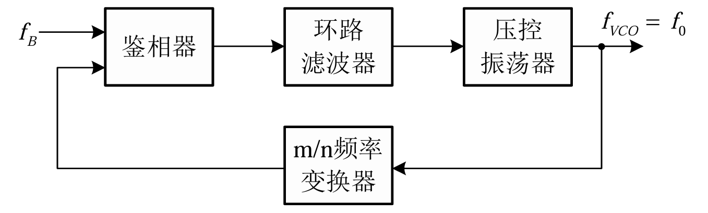
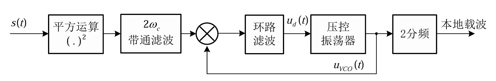
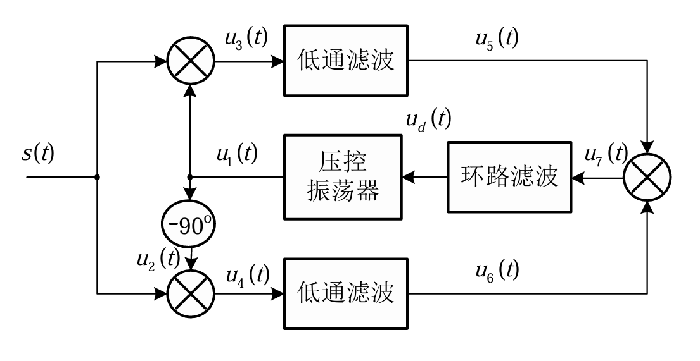
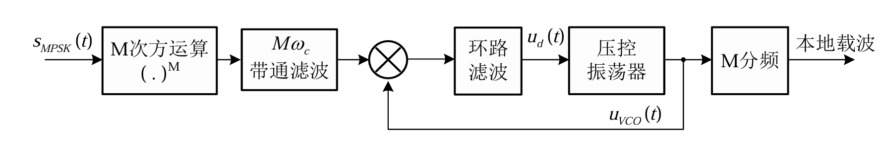
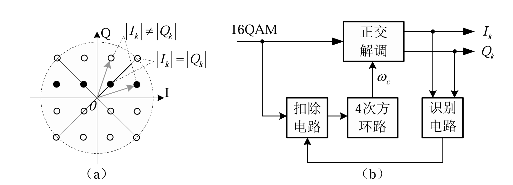
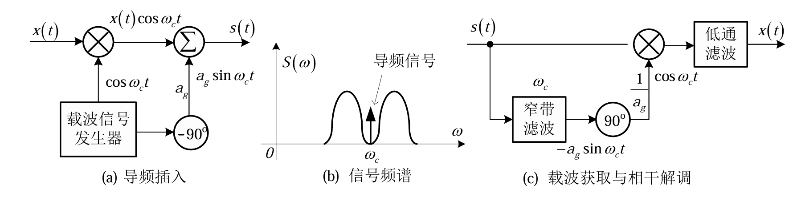
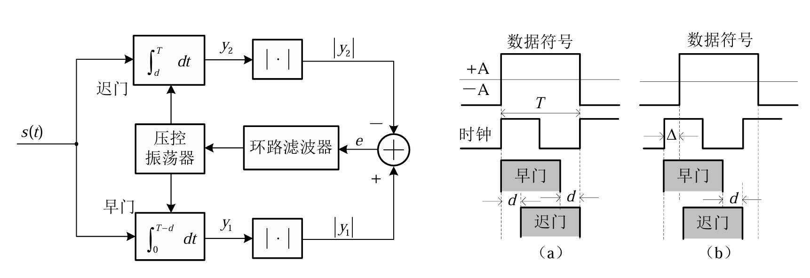
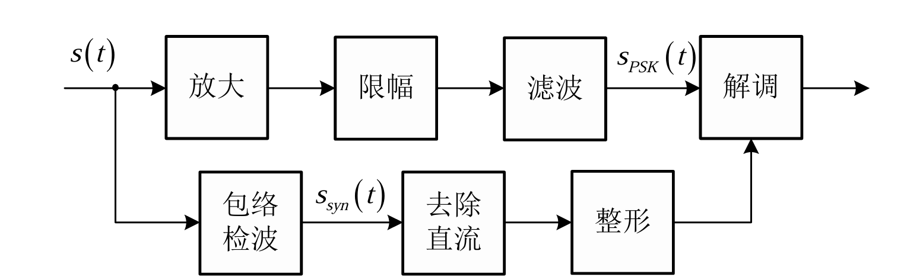

## 9.1 引言
**同步**（Synchronization）是通信系统接收端恢复发送信息所需的关键技术之一。它可以使得信号的发送与接收节奏保持一致，保证信息的正确接收。

在数字通信系统中，同步主要包括以下三种：
1.  **载波同步**：实现发送与接收具有相同的载波频率和固定的相位关系，保证相干解调的实现。
2.  **符号同步**（位同步）：实现符号接收的定位，提取出“最佳采样时刻”，避免符号间串扰（ISI），保证符号的正确接收和解码。
3.  **帧同步**（群同步）：实现帧的定位，保证符号与信息间一一对应的映射关系，正确划分信息码组。

---

## 9.2 锁相环 (PLL)

### 1. 基本概念与组成 🔄
**锁相**指两个信号有固定的频率比值和稳定的相位关系。锁相环（PLL）是实现同步的核心电路。

*   **基本结构**：
    1.  **鉴相器 (PD)**：鉴别两个信号的相位差，将其转化为电压 $u_{PD}$。
    2.  **环路滤波器 (LF)**：低通滤波器，滤除高频成分和噪声，输出控制电压 $u_d$。
    3.  **压控振荡器 (VCO)**：振荡频率由电压控制，输出 $f_{VCO}$。
    4.  **频率变换器**：完成频率变换（通常倍数为有理数 $m/n$）。

### 2. 工作原理 ⚙️
*   **负反馈控制**：
    *   当鉴相器输出特性斜率 $du_d/d\Delta\phi \ge 0$ 时，环路形成负反馈，趋向于稳定平衡点。
    *   当 $du_d/d\Delta\phi < 0$ 时，形成正反馈，是非稳定平衡点。
*   **稳态相差**：
    若鉴相器为理想乘法器，当环路锁定时，稳态相差一般较小。

### 3. 基本性能分析 📉
利用拉普拉斯变换分析线性化模型：

*   **环路传递函数**：
    $$ H(s) = \frac{\Phi_0(s)}{\Phi_B(s)} = \frac{K_{PD}' K_0 F(s)}{s + K_{PD}' K_0 F(s)} = \frac{KF(s)}{s + KF(s)} $$
*   **相位误差传递函数**：
    $$ H_{\Delta\phi}(s) = \frac{\Delta\Phi(s)}{\Phi_B(s)} = 1 - H(s) = \frac{s}{s + KF(s)} $$
*   **稳态相差**（由终值定理）：
    $$ \lim_{t \to \infty} \Delta\phi(t) = \lim_{s \to 0} s \Delta\Phi(s) $$
    *   **相位阶跃**：稳态相差为 0。
    *   **频率阶跃**（$\Delta f_B$）：稳态相差为固定值 $\frac{2\pi\Delta f_B}{KF(0)}$，意味着实现了频率同步（$f_B = f_{VCO}$）但有固定相位差。

*   **重要参数**：
    *   **同步范围**：锁相环可跟踪输入信号频率变化的最大范围。增大直流增益有利于扩大同步范围。
    *   **捕捉时间**：从自由振荡到同步所需的时间。$t_p \approx \frac{\Delta\omega^2}{2\xi\omega_n^3}$。
    *   **同步保持时间**：失去基准信号后，维持相位误差在允许范围内的时间。对间歇同步系统（如电视色副载波）非常重要。
    *   **环路噪声带宽 ($B_L$)**：
        *   $B_L$ 小 $\to$ 抑制噪声能力强。
        *   $B_L$ 小 $\to$ 跟踪快速变化信号能力弱。
        *   ⚠️ **注意点**：需根据应用场景折中选择。

---

## 9.3 载波同步

### 1. 直接提取法 (自同步法) 🔌
利用非线性电路直接从已调信号中提取载波。
#### A. 平方环法 (适用于 2PSK)

### 推导过程
BPSK 信号的数学表达式为 $s(t) = m(t)\cos(\omega_c t + \theta)$，其中 $m(t) = \pm 1$。
1. 平方运算：将信号平方
    $$[s(t)]^2 = m^2(t)\cos^2(\omega_c t + \theta) = 1 \cdot \frac{1 + \cos(2\omega_c t + 2\theta)}{2}$$
    
2. **滤波提取**：通过带通滤波器提取 $2\omega_c$ 分量。此时，由于 $m^2(t)=1$，原本的随机调制被消除，得到了一个稳定的二倍频载波。
3. **锁相与分频**：使用锁相环（PLL）跟踪该二倍频信号，最后进行 **二分频**，即可恢复相干载波。
*   **相位模糊 (Phase Ambiguity)**：
    *   二分频后，相位变化 $2\pi$ 对应 $\Delta\phi = 0$ 或 $\pi$。
    *   导致接收端无法确定相位是 $0$ 还是 $\pi$，可能导致解调出的数据“0”与“1”倒置。
    *   **解决方法**：采用 **2DPSK** (差分编码) 或发送训练序列。

#### B. 科斯塔斯环法（同相正交环）

*   **结构**：利用正交的两路信号（同相支路和正交支路）相乘，得到误差信号控制 VCO。
*   **特点**：同样存在相位模糊问题，需配合差分编码使用。
*   **推导与结构**
	假设接收信号为 $s(t) = m(t)\cos(\omega_c t + \theta)$，本地压控振荡器（VCO）输出为 $\cos(\omega_c t + \hat{\theta})$。
	 **I 路（同相）**：$s(t) \cdot \cos(\omega_c t + \hat{\theta}) \xrightarrow{LPF} \frac{1}{2}m(t)\cos(\theta - \hat{\theta})$
    **Q 路（正交）**：$s(t) \cdot \sin(\omega_c t + \hat{\theta}) \xrightarrow{LPF} \frac{1}{2}m(t)\sin(\theta - \hat{\theta})$
    鉴相误差信号：将两路相乘：
$$e(t) = I \cdot Q = \frac{1}{8}m^2(t)\sin(2(\theta - \hat{\theta}))$$
* **核心优势**
	由于 $m^2(t) > 0$，误差信号 $e(t)$ 的极性不受调制信号影响。当相位差 $\phi = \theta - \hat{\theta}$ 很小时，$\sin(2\phi) \approx 2\phi$，该信号经过环路滤波器后反馈给 VCO，强制 $\hat{\theta}$ 逼近 $\theta$。

#### C. M次方环法 (适用于 MPSK)

*   **原理**：对 MPSK 信号进行 M 次方运算，去除调制信息，提取 $M\omega_c$，再进行 M 分频。
*   **相位模糊**：存在 $M$ 重相位模糊（$2\pi/M$ 的整数倍）。

#### D. MQAM 信号的载波恢复

MQAM 既调幅又调相，无法直接用 M 次方环。
*   **矢量点扣除法**：只利用幅度满足特定条件（如最内圈）的星座点进行处理，将其改造为类似 QPSK 信号。
*   **通用载波恢复环法**：利用统计平均思想。

### 2. 插入导频法 🕯️

在发送信号频谱中（通常在零点或特定位置）插入线谱（导频）。
*   **优点**：接收端只需用窄带滤波器（或 PLL）提取导频即可。**没有相位模糊问题**。
*   **缺点**：消耗发射功率和带宽。
*   **实现**：通常插入正交导频（与信号载波相差 $90^\circ$）以利于解调。

| **维度**    | **导频插入法**               | **直接提取法**                           |
| --------- | ----------------------- | ----------------------------------- |
| **相位模糊**  | **无** (导频就是绝对相位基准)      | **有** ($180^\circ$ 或 $90^\circ$ 模糊) |
| **同步速度**  | **快** (甚至可开环工作)         | 较慢 (闭环捕获过程)                         |
| **适用信号**  | 所有线性调制 (SSB/VSB 必须用此法)  | 主要是 DSB/PSK/QAM                     |
| **功率效率**  | **低** (导频占用了发射功率，但不传信息) | 高 (全部功率用于传信息)                       |
| **带宽效率**  | 较低 (可能需要保护带)            | 高                                   |
| **电路复杂度** | 简单 (仅需滤波器/PLL)          | 复杂 (需要非线性运算)                        |
### 3. 载波相位的似然估计法 📊
基于最大似然估计（ML）理论。
*   **面向判决环 (Decision-Directed)**：需要发送专门的训练序列（已知数据）。
*   **非面向判决环**：利用信号的统计特性（如先验等概），不依赖训练序列。推导出的结构往往包含非线性运算（如 tanh 或平方），实际上对应了平方环或 Costas 环等结构。

---

## 9.4 符号同步 (位同步)

### 1. 直接提取法 🕰️
先对接收符号序列进行非线性变换，产生含有符号频率的线谱。

*   **线谱法**：接收信号 $\to$ 非线性变换（如平方） $\to$ 窄带滤波 $\to$ 移相 $\to$ 符号时钟。
    *   **原理**：随机序列的平方后，其功率谱密度中包含 $1/T$ 的离散谱分量（只要波形不是理想矩形）。
*   **早迟门法 (Early-Late Gate)**：
    *   **结构**：包含“早门”积分器和“迟门”积分器。
    *   **原理**：比较前半个码元（早）和后半个码元（迟）的能量。
        *   若同步，两者能量差为 0。
        *   若不同步，差值信号控制 VCO 调整相位。
    *   **注意点**：输入信号不能出现长串“0”或长串“1”，否则无法提取误差信号。

### 2. 插入导频法
在基带信号频谱的零点（如 $1/2T$ 或 $1/T$ 处）插入导频信号。

### 3. 包络携带法

对于恒包络调制（如 MPSK），叠加一个微弱的调幅信号（频率为符号速率）来携带同步信息。

### 4. 似然估计法
与载波同步类似，寻找最佳的定时偏差 $\tau$，使得似然函数最大。

---

## 9.5 帧同步

### 1. 概念
需要确定数据的起始位置，以便将比特流正确分组为码字或信元。

### 2. 帧同步标识符的周期性插入法 🔖

#### A. 集中式插入
在每帧的帧头插入完整的特殊码组（帧同步字，如 Barker 码）。
*   **工作状态**：
    1.  **同步搜索**：逐比特滑动搜索，寻找第一个同步字。
    2.  **预同步**：连续 $J$ 次检测到同步字，确认进入同步状态（消除虚假同步）。
    3.  **同步保持**：连续 $K$ 次丢失同步字才认为失步（消除干扰影响）。

#### B. 分散式插入
将同步字分散插入到各个帧中（如每帧插入 1 bit）。例如 $\Delta M$ 调制系统。

#### C. 辅助帧同步法
如 ATM 信元，利用报头的 CRC 校验兼做定界功能（即如果 CRC 校验正确，则认为找到了信元头）。

### 3. 同步标识符 (Barker 码) 🔢
*   **巴克码 (Barker Code)**：具有类似白噪声的尖锐自相关特性。
    *   **特性**：$R(0) = N$ (峰值)，而旁瓣 $|R(j)| \le 1$ ($j \ne 0$)。
    *   **相关搜索**：接收端利用滑动相关器检测巴克码，当输出出现尖锐峰值时，标记为帧头。

| **长度 (N)** | **巴克码码组序列**                              | **峰值旁瓣比 (PSR)** |
| ---------- | ---------------------------------------- | --------------- |
| **2**      | `+1 -1` 或 `+1 +1`                        | 2:1 (-6 dB)     |
| **3**      | `+1 +1 -1`                               | 3:1 (-9.5 dB)   |
| **4**      | `+1 +1 -1 +1`                            | 4:1 (-12 dB)    |
| **5**      | `+1 +1 +1 -1 +1`                         | 5:1 (-14 dB)    |
| **7**      | `+1 +1 +1 -1 -1 +1 -1`                   | 7:1 (-16.9 dB)  |
| **11**     | `+1 +1 +1 -1 -1 -1 +1 -1 -1 +1 -1`       | 11:1 (-20.8 dB) |
| **13**     | `+1 +1 +1 +1 +1 -1 -1 +1 +1 -1 +1 -1 +1` | 13:1 (-22.3 dB) |
*   **性能分析**：
    *   **漏同步**：未检测到同步字。
    *   **假同步**：在数据中误检测出同步字。
    *   **搜索时间**：平均搜索时间与同步字长度、帧长及检测概率有关。

---

## 本章学习总结 📝

1.  **核心目标**：接收端恢复“基准”，包括频率、相位、时间起点。
2.  **锁相环 (PLL)** 是同步技术的硬件基础，理解其负反馈调节和滤波作用。
3.  **载波同步**：
    *   **重点**：平方环/Costas环原理，以及**相位模糊**的成因与对策（差分编码）。
    *   **区分**：直接提取法（有模糊，省功率） vs 插入导频法（无模糊，耗功率）。
4.  **符号同步**：早迟门法是经典方法，利用了波形的对称性。
5.  **帧同步**：
    *   依赖于特殊码组（如巴克码）的**自相关特性**。
    *   理解同步保护机制（前方保护/后方保护）以提高系统鲁棒性。

### ⚠️ 易错点提醒
*   **相干解调必须要有载波同步**。
*   **2PSK 的直接提取法必然存在 $180^\circ$ 相位模糊**，这在星座图上表现为点对称旋转，导致数据反转。
*   **Barker 码**之所以被广泛使用，是因为其**非峰值处的自相关函数值非常小**（只有 0 或 -1），极易识别。