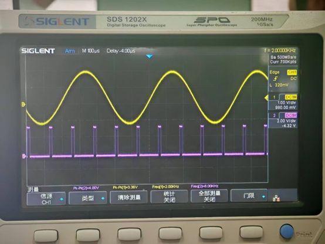

## **一、实验目的和内容：**

**1.** **实验目的**

(1) 掌握自然抽样和单极性抽样的原理和实现方法，理解依循滤波器的幅频特性，相频特性对抽样信号恢复的影响。

(2) 掌握脉冲编码调制与解调的原理。掌握脉冲编码调制与解调系统的动态范围和频率特性的定义及测量方法。

(3) 掌握简单增量调制的工作原理，误码率产生原因及过载失真和量化噪声的定义，掌握其测试方法。

(4) 掌握 CVSD 的工作原理，了解简单增量调制与 CVSD 工作原理不同之处及性能上的差别。

**2.** **实验内容**

(1) 观测和验证抽样定理。对比自然抽样和单极性抽样的波形。

(2) 进行 PCM 编译码实验。测量并记录不同信号幅度下的 A 律编码结果。

(3) 进行 △M 编译码和译码实验。观察编码规则，量化噪声和过载现象。

(4) 进行 CVSD 编译码实验。观察其自适应量化阶变化和量化噪声特性。

## **二、实验原理理解：**

(1) 脉冲编码调制 (PCM) 简称 <ins>脉码调制</ins>，它是一种用一组二进制码来替代连续信号的抽样值的<ins>模拟信号数字化</ins>方式。脉冲编码调制在发送端进行波形编码，主要包括 <ins>抽样</ins>、<ins>量化</ins>、<ins>编码</ins> 三个过程，把 <ins>模拟信号</ins> 变换为二进制码组。在接收端，<ins>二进制码流</ins>经译码后还原为量化后的样值脉冲序列，然后经 <ins>低通滤波器</ins> 滤除高频分量就可以得到重建的信号。

(2) 量化是利用预规定的有限电平来表示 <ins>模拟信号抽样值</ins> 的过程。根据量化间隔是否均匀，量化可分为 <ins>均匀量化</ins> 和 <ins>非均匀量化</ins>。实现非均匀量化的方法之一是把输入量化器的信号先进行 <ins>压缩</ins> 处理，再把压缩的信号进行 <ins>均匀量化</ins>。

(3) 在 PCM 通信编码中，常用的二进制码型有三种，自然二进制码、折叠二进制码和格雷二进制码。实验中采用的码型是 <ins>折叠二进制码</ins>。在 A 律 13 折线编码中，普遍采用 8 位二进制码，对应有 <ins>256</ins> 个量化级，即正负输入幅度范围内各有 <ins>128</ins> 个量化级。码型结构如下： C₁ C₂C₃C₄ C₅C₆C₇C₈。
                                                          （极性码）（段落码）（段内码）

(4) 增量调制是采用一位二进制数码来表示信号此时刻的值相对于前一时刻的值是增大还减小。增大发 “<ins>1</ins>” 码，减少发 “<ins>0</ins>” 码，数码“1”“0”只是表示信号相对于前一时刻的增减，不代表信号的绝对值。

(5) 增量调制接收端译码规则是每收到一个“1”码，译码器输出相对于前一时刻的值 <ins>上升</ins> 一个量阶，没收到一个“0”码则 <ins>下降</ins> 一个量阶。

(6) 增量调制静态时输出“1”“0”交替码，而 PCM 编码静态时输出全 “<ins>0</ins>” 码。静态时增量调制能否输出“1”“0”交替码是检查增量调制工作正常与否的一个依据。

(7) 对于简单增量调制，由于 △ 是固定不变的，采用较大的台阶电压时，近似信号能很快地跟踪话音信号的<ins>斜率变化</ins>，从而使 <ins>过载噪声</ins> 减小，但 <ins>量化噪声</ins> 增大。反之，当采用较小的台阶电压时，虽 <ins>量化噪声</ins> 减小，但 <ins>过载噪声</ins> 增大。解决这个矛盾的最好方法是采用 <ins>自适应增量调制</ins>。

(8) 话音信号的 PCM 编译码系统由哪些部分构成？各部分组成的功能是什么？（6 分）  
话音信号 -> 滤波1 -> 抽样 -> 编码 -> 信道 -> 解码 -> 滤波2 -> 话音信号

① 滤波器1：滤除在人的听觉外和对语音质量影响较小的频率成分  
② 抽样器：将模拟信号转化为数字信号  
③ 编码器：把抽样后的电平信号进行量化和编码，变成二进制码组  
④ 信道：传送信息  
⑤ 解码器：在接收端把二进制码组转化回量化值  
⑥ 滤波器2：滤除高频成分

(9) 从理论上分析，当 △M 的编码器在输入信号为零时，输出的编码是什么？当输入信号幅度小于量阶幅度一半时，输出什么码？输入幅度增加到多大时，产生起始编码？（6 分）

① 输出编码为“1”“0”交替  
② 输出编码为“1”“0”交替  
③ 达到或超过 1/2 量化阶梯幅度 △ 时，起始编码

## **三、预习思考题**

* 理论上正弦波正半周编码码型首位C1应该是“1”，负半周编码码型首位C1应该为“0”，那么如果PCM编码实验结果为11011000，00000001，01011000，00000001，这样的实验结果正常吗？ 为什么？ 如果不正常，那如何解释为何会出现这样的结果？如果实验结果为11011000，10000001，11011000，00000001，正常吗？ 为什么？
## **四、实验内容**

### **（一）抽样定理实验内容**
#### a.记录自然抽样前后的信号波形：主控&信号源模块的MUSIC和M01模块的TH3（抽样输出)

**图一 自然抽样**
#### b.记录平顶抽样前后的信号波形：主控&信号源模块的MUSIC和M01模块TH3（抽样输出）**（2分）**

**图二 平顶抽样**

#### 分析题1
分析两种抽样方式下，抽样输出信号波形的关系：**（3分）**

**答：** 两者输出信号的根本区别在于脉冲顶部的形状。                                                 

1.    **图一为自然抽样，** 保留了原始信号在抽样时间内的瞬时形态。该图中，抽样输出脉冲（紫色波形）的顶部轮廓并非平坦的直线，而是精确地复现了在脉冲持续时间内原始模拟信号（黄色波形）的局部形状。即脉冲顶部是原始信号的一段“切片”，其形状随原始信号的瞬时值变化而变化。           

2.    **图二为平顶抽样，** 平顶抽样则用一个在抽样瞬间确定的恒定电平来代表该抽样点的信息。该图中，抽样输出脉冲（紫色波形）的顶部为一条清晰的水平直线，呈现平顶特征。每一个脉冲的幅度值取决于抽样瞬间原始模拟信号的瞬时幅值，并且该幅值在整个脉冲宽度τ内保持恒定不变。            

3.    这种波形上的差异直接导致了它们在频谱特性和电路实现上的不同。自然抽样理论分析中常用，实际物理实现较少。平顶抽样因其易于与数字系统接口而被广泛应用，但分析其性能时必须考虑孔径效应带来的高频衰减失真。 
#### 分析题2
根据抽样定理实验结果，分析在抽样脉冲频率多小的情况下恢复信号有失真？**（4分）**

**答：** 已知该信号是由1khz和3khz正弦波叠加而来的。根据奈奎斯特抽样定理：对于一个最大频率分量为 f_max 的带限信号，为了能够从其抽样样本中无失真地恢复原始信号，抽样频率 f_s 必须大于或等于最大频率分量的两倍。                                                                            

fsmin = 2 * fmax = 2 * 3 kHz = 6 kHz

因此，当抽样脉冲频率 f_s 小于 6 kHz 时，将会发生频谱混叠，导致高频分量（3 kHz）被错误地映射为低频分量，无法从抽样信号中无失真地恢复出原始信号，从而产生严重失真。因此，为避免信号失真，抽样频率必须严格满足 f_s ≥ 6 kHz。                                                               

### **（二）脉冲调制编译码实验**

#### 分析题3
分析本实验中用于PCM编码和译码的时钟CLK的频率为多少Hz？用于作为抽样信号的FS的频率为多少Hz？**（4分）**

**答：** 示波器下方的测量区域已自动测量了CH1的频率，因此用于作为抽样信号的FS的频率为 **8.00 kHz**。

由 fCLK = fs × N (其中 N 是每个抽样点的编码位数) 得，用于PCM编码和译码的时钟CLK的频率为： 

**8kHz × 8 bits = 64 kHz**

综上： 抽样信号 (FS) 的频率为8.00 kHz，时钟 (CLK) 的频率为64kHz。 
#### b.记录编码输入信号A-OUT与抽样信号FS之间的关系。**（2分）**

**图三** A-OUT与抽样信号FS

#### c.测量记录信号源为大信号和小信号时的A律编码结果。**（20分）**

|      |            |          |          |          |          |          |
| ---- | ---------- | -------- | -------- | -------- | -------- | -------- |
| 压缩特性 | A-OUT电压峰峰值 | 取样周期1    | 取样周期2    | 取样周期3    | 取样周期4    | 取样周期5    |
| A律   | 500mV      | 00011100 | 10110101 | 10011011 | 00110110 | 00011100 |
|      | 1000mV     | 00111000 | 11010011 | 10111000 | 01010011 | 00111000 |
|      | 2000mV     | 01010100 | 11110000 | 11010100 | 01110000 | 01010100 |
| μ律   | 2000mV     | 11011000 | 11100000 | 01011000 | 01100000 | 11011000 |

#### 分析题4
分析大信号与小信号时的A律编码结果：**（3分）**

答：**1.****小信号分析 (A-OUT = 500mV)****：提取每个编码的段落码**                                         

- 周期1: 001 (段落 1)、周期2: 011 (段落 3)、周期3: 001 (段落 1)、周期4: 011 (段落 3)

其样值被编码到**较低的段落**。根据A律定义，低段落的量化步长非常小，这意味着编码器为小信号分配了**精细的量化间隔**和**较高的量化分辨率**。这有效地减少了小信号的量化误差，提高了其信噪比。          

**2.****大信号分析 (A-OUT = 2000mV)****：提取每个编码的段落码**                                        

- 周期1: 101 (段落 5)、周期2: 111 (段落 7)、周期3: 101 (段落 5)、周期4: 111 (段落 7)          

当输入信号幅度较大时，其样值被编码到**较高的段落**。高段落的量化步长要大得多。这意味着编码器对大信号使用了**粗略的量化间隔**和**较低的量化分辨率**。虽然绝对量化误差增大了，但相对于大信号本身的幅度而言，相对误差仍然保持在可接受的范围内。                                                      

3.对实验结果中符号码的特点进行分析：在所有测试条件下，符号码序列都呈现出 0 和 1 的交替变化（例如，0 → 1 → 1 → 0）。对比500mV、1000mV和2000mV三个不同峰值电压下的结果，我们发现符号码的变化模式 (0, 1, 1, 0, ...) 是**完全一致的**。这说明**符号码只与信号的极性（正或负）有关，而与信号的瞬时幅度大小无关**。                                                                                    

### **（三）增量调制实验**

#### 1、**ΔM编码规则实验**
##### a.观察和记录模块M01的TP3(本地译码)和TH7(编码输出)之间的关系。**（2分）**

**图四** TP3(本地译码)和TH7(编码输出)波形图

  
##### b.观察和记录模块M01的TP5(信源延时)和TP3(本地译码)之间的关系。**（2分）**

**图五** TP5(信源延时)和TP3(本地译码)波形图

##### 分析题5
当模拟信号源的频率逐渐增大或者逐渐减小时，模拟信号源波形与译码信号波形之间的锲合度有什么变化？**（4分）**

**答：**

1. **低频区：** 在频率非常低时，信号斜率平缓。译码波形能够很好地跟踪信号的总体趋势，但由于阶距 δ 是固定的，阶梯波形会在平缓的信号曲线附近产生明显的上下振荡。此时，颗粒噪声是主要的失真来源，导致**微观上的锲合度不佳**。                                                   
2. **中频区：** 随着频率的增加，信号的斜率也随之增大。阶梯波形需要更频繁地连续“上升”或“下降”来跟踪信号。此时，颗粒噪声现象会明显减弱，因为信号不再长时间停留于平缓区。在这个频率范围内，系统的跟踪能力与信号的变化率匹配得最好，**波形的锲合度达到最佳状态**。               
3. **高频区：** 当频率继续增大到某一临界点以上时，原始信号在过零点附近的斜率会变得非常陡峭，其变化速率超出了系统的最大跟踪能力 (δ * fs)。此时，译码出的阶梯波形会明显“掉队”，无法跟上原始信号的快速变化，产生**斜率过载失真**。从示波器上看，译码出的正弦波会变成三角波，其幅度和形状都与原始信号有巨大差异，**锲合度急剧恶化**。                                         

#### 2、**量阶和编码性能实验**

  
##### a. 观察量化噪声，记录模拟信号源频率为100Hz下的量化噪声波形。**（2分）**

**图六** 模拟信号源频率为100Hz下的量化噪声波形

##### b.模拟信号源频率为多少时，本地译码出现了过载现象？（2分）

答：模拟信号源频率为1.6Khz时，波形近似为一个三角波，本地译码开始出现过载现象。

  
##### c. 记录模拟信号源频率为2400Hz下的量化噪声波形。（2分）

**图七** 模拟信号源频率为2400Hz下的量化噪声波形

##### 分析题6
在模拟信号源频率从100Hz提高到2400Hz的过程中，您发现了量化噪声有什么变化？为什么？**（4分）**

答：

1.   在低频区，**颗粒噪声**是主导的量化噪声形式。噪声的特点是幅度相对较小，但持续存在于整个波形   中，使得译码信号显得“粗糙”或“嘈杂”。 这是因为信号频率很低，其最大斜率 (d/dt)m(t) 远小于系统的最大跟踪速率δ * fs。编码器输出的比特流（...101010...）频繁交替，以试图在零附近逼近一个非常小的变化量。然而，由于量化阶距δ是固定的，每一步都显得过大，导致了持续的过冲和下冲，从而产生了颗粒噪声。                                                           

2.   在中频区，颗粒噪声显著减小，总的量化噪声功率达到最小值，这是系统的最佳工作区域。这是因为信号斜率的增大使得固定的量化阶距δ变得更为合适。编码器不再需要频繁地反转方向，而是可以产生更长的连续“1”或连续“0”的序列来平滑地跟踪信号。此时，信号的变化速率与系统的跟踪能力 达到了最佳匹配。                                                                        

3.   在高频区主导的量化噪声形式是非常严重的**过载失真**。这种失真不再是随机的噪声，而是一种系统性的、与信号本身高度相关的波形畸变。这是因为在高频下，正弦信号的最大斜率（A * 2π * f）已经超过了系统的最大跟踪速率δ * fs。编码器即使连续输出“1”（或“0”），其生成的阶梯波形的上 升（或下降）速度也跟不上原始信号的变化速度。这导致译码信号的幅度和相位都严重滞后于原始信 号，从而产生了巨大的失真。                                                              

4.   这个过程深刻揭示了线性增量调制的内在局限性，即固定的量化阶距δ无法同时优化对慢变信号和快变信号的编码性能，这是其核心的性能瓶颈。                                                  

#### 3、**CVSD****量阶及量化噪声观测实验**

##### a. CVSD量化噪声观测，记录量化噪声波形填入下表。

|              |             |                                         |
| ------------ | ----------- | --------------------------------------- |
| A-OUT正弦波的峰峰值 | A-OUT正弦波的频率 | 量化噪声波形                                  |
| 1V           | 400Hz       | 图八  |
| 3V           | 400Hz       | 图九  |
| 1V           | 2000Hz      | 图十  |
| 3V           | 2000Hz      | 图十一 |

##### 分析题7
分析不同峰峰值下，不同频率的输入信号的量化噪声结果：**（4分）**

**答：**

**图八：1V, 400Hz**

·        信号特性： 中等频率，中等幅度，信号斜率相对平缓。

·        噪声波形观测 (白色)： 噪声波形（白色）的幅度在四组实验中是最低的，几乎成为一条贴近零电平的细线。

·        噪声分析： 这是典型的颗粒噪声。由于输入信号变化缓慢，CVSD的自适应算法将量化阶距减小以进行精细跟踪。然而，这个最小阶距对于平缓的信号段仍然偏大，导致译码输出（紫色）在真实信号（黄色）上下进行微小的“抖动”。这个差值，即我们直接看到的白色噪声波形，幅度很小，表明CVSD成功地将颗粒噪声抑制在了较低的水平。

**图九：3V, 400Hz**

·        信号特性： 频率不变，但幅度极大，导致信号斜率极其陡峭。

·        噪声波形观测 (白色)： 噪声波形（白色）的幅度变得非常巨大。其形态不再是随机噪声，而是具有清晰的、与输入信号周期同步的结构化波形。噪声的峰值出现在输入信号的峰顶和谷底处，即译码输出（紫色三角波）与输入信号（白色正弦波）差异最大的地方。

·        噪声分析： 系统此时处于严重的斜率过载状态。噪声的主要成分是斜率过载失真。由于输入信号斜率远超CVSD系统的最大跟踪能力，译码器输出严重滞后，产生了巨大的、系统性的误差。直接观测到的白色噪声波形，就是这种结构性失真的直观体现。

**图十：1V, 2000Hz**

·        信号特性： 幅度适中，频率较高，信号斜率较案例一更大。

·        噪声波形观测 (白色)： 噪声波形（白色）为周期波形，幅度适中。

·        噪声分析： 这是CVSD系统工作的最佳状态。信号斜率足够大，避免了明显的颗粒噪声；同时又在其自适应跟踪能力范围之内，没有产生斜率过载。CVSD的阶距被动态调整到了一个理想的大小，使得译码输出能够高度精确地复现输入信号。因此，二者之差（量化噪声）的能量最小，系统的信噪比达到最高。

**图十一：3V, 2000Hz**

·        信号特性： 高频、高幅度的信号，导致了本次实验中最大的信号斜率。

·        噪声波形观测 (白色)： 噪声波形（白色）为周期波形，幅度最大。

·        噪声分析： 系统处于过载状态。在信号变化平缓的区域，CVSD能够很好地跟踪，因此噪声（误差）很小。但在信号斜率最大的瞬间，系统的自适应阶距达到了上限，仍然略显不足，导致暂时的跟踪滞后，从而产生了脉冲式的误差。这清晰地表明，噪声的主要来源是在信号最陡峭部分出现的瞬时性斜率过载失真。